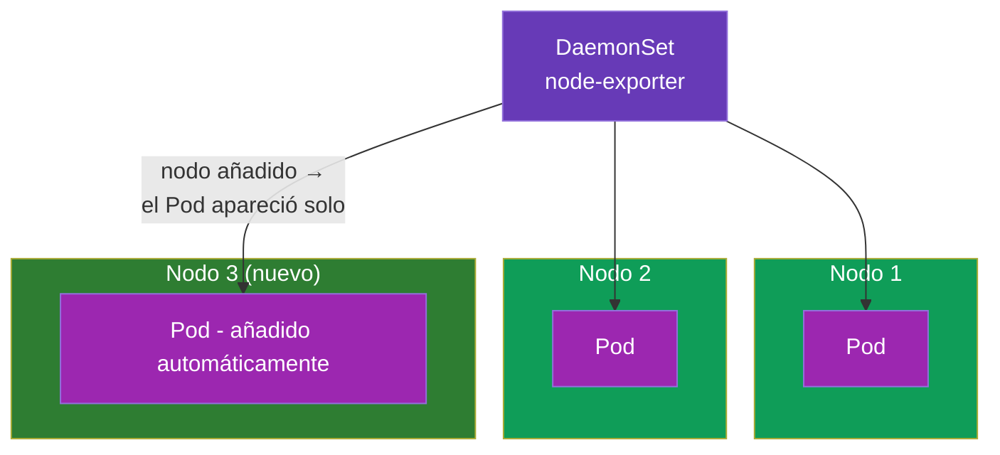
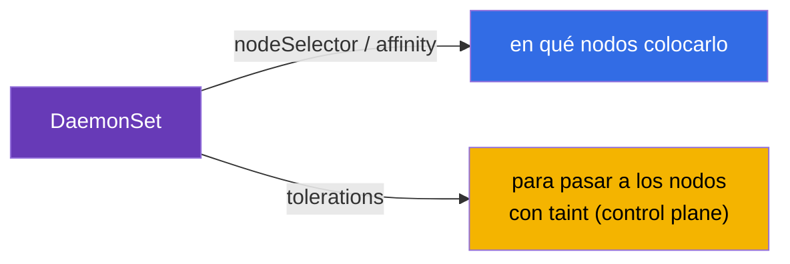
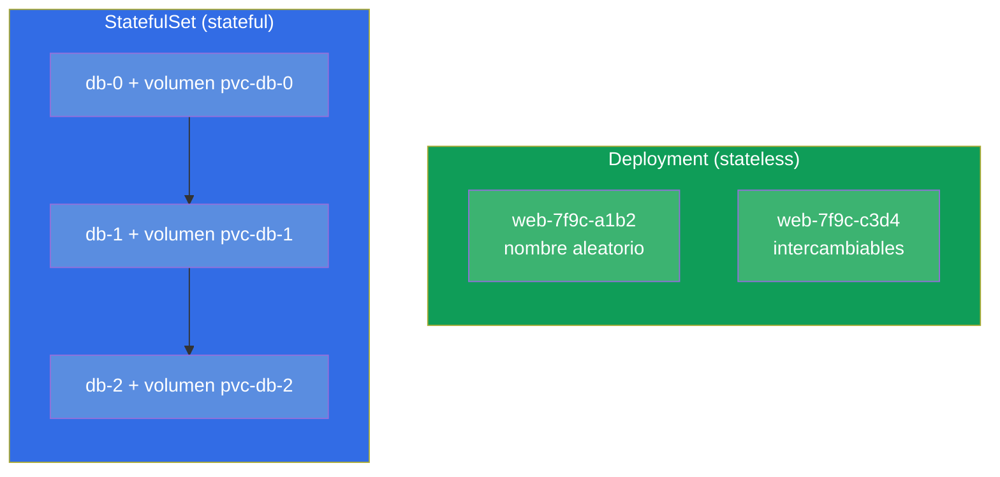
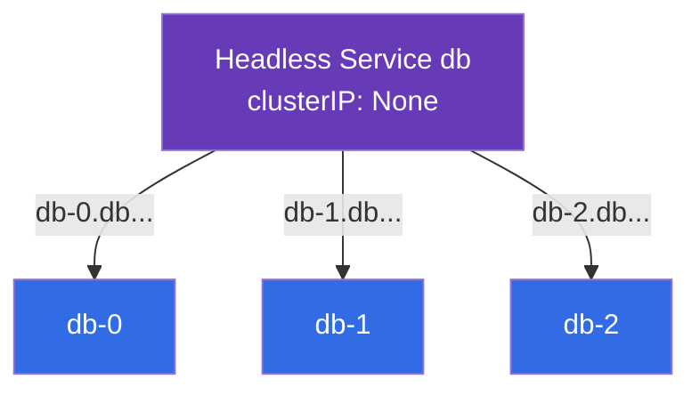
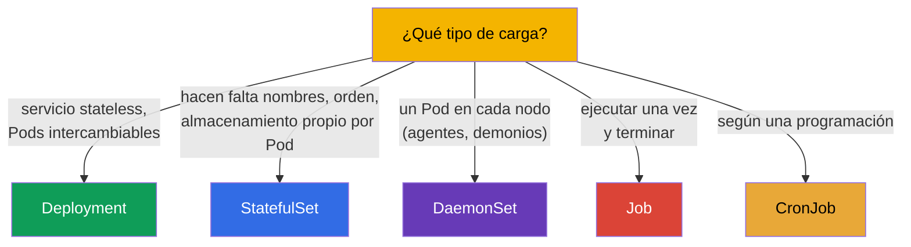

[Русская версия](ru.md) · [Eng version](README.md) · [Version française](fr.md) · [Deutsche Version](de.md) · [ქართული ვერსია](ge.md)

# Capítulo 11. DaemonSet y StatefulSet

> **Qué viene ahora.** Ya hemos visto el Deployment (servicios stateless) y Job/CronJob (tareas).
> Quedan dos controladores especializados de cargas de trabajo: el **DaemonSet** («un
> Pod en cada nodo» - para agentes y demonios) y el **StatefulSet** (para
> aplicaciones con estado - bases de datos, donde importan los nombres estables y el almacenamiento propio).
> Entender qué controlador va con cada tarea es materia de CKAD (Application Design) y de CKA
> (Workloads). El almacenamiento del StatefulSet se apoya en PV/PVC (capítulo 25), así que aquí nos
> centraremos en los controladores en sí.

## 11.1. DaemonSet: un Pod en cada nodo

El **DaemonSet** garantiza que en **cada** nodo (o en cada uno que cumpla la condición)
funcione exactamente una instancia del Pod. Si añades un nodo nuevo, el DaemonSet
lanzará en él un Pod automáticamente. Si quitas el nodo, el Pod se va con él.



El DaemonSet no tiene campo `replicas` - el número de Pods es igual al número de nodos aptos, y el
propio clúster mantiene esa correspondencia.

Los usuarios típicos del DaemonSet son los componentes de sistema que deben estar en cada
nodo:

- **red:** kube-proxy, agentes CNI (Calico, Cilium);
- **logs:** recolectores tipo Fluent Bit, Fluentd;
- **monitorización:** node-exporter, agentes de observability;
- **almacenamiento/seguridad:** agentes CSI, agentes de seguridad.

```yaml
apiVersion: apps/v1
kind: DaemonSet
metadata:
  name: node-exporter
spec:
  selector:
    matchLabels:
      app: node-exporter
  template:
    metadata:
      labels:
        app: node-exporter
    spec:
      containers:
      - name: node-exporter
        image: prom/node-exporter
```

## 11.2. DaemonSet y la elección de nodos

Por defecto el DaemonSet coloca un Pod en todos los nodos. Se puede limitar el conjunto de nodos con
`nodeSelector` o con affinity (capítulo 12) en la plantilla del Pod:

```yaml
    spec:
      nodeSelector:
        disktype: ssd        # solo en los nodos con esta etiqueta
```

Un detalle importante: normalmente el DaemonSet debe funcionar también en los nodos del control plane, que
están cerrados con un taint (capítulo 2). Por eso los DaemonSet de sistema añaden
**tolerations** (capítulo 13), para que sus Pods entren también ahí. Sin eso, el agente de monitorización
no llegaría al control plane.



El DaemonSet se actualiza como un Deployment - mediante rolling update (`updateStrategy`).

## 11.3. StatefulSet: aplicaciones con estado

El **StatefulSet** hace falta cuando los Pods **no son intercambiables**: cada uno tiene su identidad,
su almacenamiento permanente, y el orden de arranque importa. Los casos clásicos son las bases de datos y los sistemas
en clúster (PostgreSQL, MySQL, MongoDB, Kafka, etcd, Elasticsearch), donde el nodo `db-0`
no es lo mismo que `db-1`.

Lo que aporta el StatefulSet más allá del Deployment:

- **Nombres de Pod estables.** No hashes aleatorios, sino los predecibles `web-0`, `web-1`,
  `web-2`. El nombre sobrevive a la recreación del Pod.
- **Almacenamiento estable.** A cada Pod, su propio PVC, que sigue ligado a él
  cuando se recrea (el Pod `web-0` siempre recibe su volumen).
- **Orden.** Los Pods se crean en orden (0, luego 1, luego 2) y se borran en el
  inverso (2, 1, 0). Esto importa en los clústeres donde los nodos deben levantarse por turnos.



## 11.4. Manifiesto de StatefulSet y volumeClaimTemplates

El rasgo distintivo del StatefulSet es `volumeClaimTemplates`: la plantilla con la que a **cada**
Pod se le crea su propio PVC (y con ello, su propio volumen).

```yaml
apiVersion: apps/v1
kind: StatefulSet
metadata:
  name: db
spec:
  serviceName: db            # servicio headless (ver más abajo)
  replicas: 3
  selector:
    matchLabels:
      app: db
  template:
    metadata:
      labels:
        app: db
    spec:
      containers:
      - name: db
        image: postgres:16
        volumeMounts:
        - name: data
          mountPath: /var/lib/postgresql/data
  volumeClaimTemplates:      # a cada Pod, su propio PVC
  - metadata:
      name: data
    spec:
      accessModes: ["ReadWriteOnce"]
      resources:
        requests:
          storage: 10Gi
```

Como resultado aparecerán los PVC `data-db-0`, `data-db-1`, `data-db-2` - uno por Pod. Si
el Pod `db-1` se recrea, volverá a montar precisamente `data-db-1`, y no el volumen de otro.

## 11.5. StatefulSet y el servicio headless

El StatefulSet suele funcionar en pareja con un **servicio headless** (`clusterIP: None`, capítulo 7).
Un servicio normal da una única IP común y balancea - pero aquí necesitamos dirigirnos a un Pod
**concreto** (por ejemplo, al máster de la BD `db-0`). El servicio headless no balancea, sino que da a cada
Pod su propio nombre DNS estable:

```
<pod>.<service>.<namespace>.svc.cluster.local
db-0.db.default.svc.cluster.local
db-1.db.default.svc.cluster.local
```



Así el cliente puede llegar de forma dirigida al nodo que necesita del clúster de BD - por ejemplo, escribir en el
máster y leer de las réplicas.

## 11.6. Comparación de los controladores de cargas de trabajo

Juntemos todos los controladores de la parte 2 en un único cuadro de elección:



| Controlador | Número de Pods | Identidad de los Pods | Almacenamiento | Uso típico |
|-----------|-------------|--------------------|-----------|--------------------|
| Deployment | `replicas` | nombres aleatorios, intercambiables | común/efímero | web, API, stateless |
| StatefulSet | `replicas` | estables (`-0`, `-1`) | propio en cada Pod | BD, colas, clústeres |
| DaemonSet | = número de nodos | por nodo | normalmente hostPath/efímero | agentes en cada nodo |
| Job | `completions` | no importa | efímero | tarea puntual |
| CronJob | según programación | no importa | efímero | tarea periódica |

## 11.7. Cómo se usa esto en producción

- **El DaemonSet es la capa de infraestructura.** En cualquier producción, mediante DaemonSet corren los agentes
  de logs (Fluent Bit), de métricas (node-exporter), de red (CNI) y de seguridad. Es la manera de
  «cubrir» de forma garantizada cada nodo, incluidos los nuevos, sin acciones manuales.
- **El StatefulSet es para el estado, pero con cuidado.** Las BD y los sistemas en clúster se lanzan en Kubernetes
  mediante StatefulSet, pero muchos equipos prefieren BD **gestionadas** en la
  nube (RDS, Cloud SQL) - mantener lo stateful en el clúster es más difícil (backups, tolerancia a fallos,
  actualizaciones). Se elige el StatefulSet cuando la BD realmente debe vivir en el clúster.
- **volumeClaimTemplates y los datos.** Por defecto, los volúmenes del StatefulSet **no se borran** al
  borrar el StatefulSet - es una protección de los datos. Limpiarlos hay que hacerlo de forma consciente. En producción se
  vigila esto, para no perder ni «olvidar» volúmenes.
- **Orden y actualizaciones.** El arranque/parada ordenados del StatefulSet son críticos para los
  sistemas con quórum (etcd, Kafka): la actualización va Pod a Pod, para no perder el
  quórum. Esto se configura con la estrategia de actualización del StatefulSet.
- **tolerations en el DaemonSet.** Para que los agentes lleguen también al control plane, los DaemonSet de sistema
  llevan tolerations amplias - si no, la monitorización y los logs de los «másters» estarán ciegos.

## 11.8. Mini-glosario

- **DaemonSet** - controlador que mantiene un Pod en cada nodo (apto).
- **StatefulSet** - controlador para aplicaciones con estado: nombres estables, orden,
  almacenamiento propio por Pod.
- **volumeClaimTemplates** - plantilla del StatefulSet que crea un PVC para cada Pod.
- **Identidad estable** - nombres de Pod predecibles (`db-0`, `db-1`), que sobreviven a la
  recreación.
- **Servicio headless** - `clusterIP: None`; da a cada Pod su propio nombre DNS, no balancea.
- **updateStrategy** - estrategia de actualización de DaemonSet/StatefulSet (rolling).

## 11.9. Resumen del capítulo

- El DaemonSet mantiene un Pod en cada nodo apto; no hay `replicas`, el número de
  Pods = número de nodos. Para agentes de logs, métricas, red y seguridad.
- El DaemonSet limita los nodos con nodeSelector/affinity y normalmente lleva tolerations,
  para llegar también al control plane.
- El StatefulSet es para aplicaciones con estado: nombres estables (`-0`, `-1`), arranque/parada
  ordenados, almacenamiento permanente propio en cada Pod.
- `volumeClaimTemplates` crea un PVC por Pod; el Pod recreado recupera su volumen
  de vuelta.
- El StatefulSet trabaja con un servicio headless, que da nombres DNS dirigidos a los Pods.
- Elección del controlador: Deployment (stateless), StatefulSet (estado), DaemonSet (por nodo),
  Job/CronJob (tareas).

## 11.10. Para qué sirve: en el examen y en el trabajo real

**En el examen.** «Elige el controlador correcto para la tarea» es una pregunta típica de CKAD;
«crea un DaemonSet», «despliega un StatefulSet con volúmenes» son tareas de Workloads. Hay que entender
por qué una BD es un StatefulSet y un agente en cada nodo es un DaemonSet, y conocer
volumeClaimTemplates y el servicio headless.

**En el trabajo real.** El DaemonSet es el cimiento de la capa de infraestructura del clúster (logs,
métricas, red). El StatefulSet determina cómo viven en el clúster las BD y los sistemas en clúster, y
sus detalles finos (conservación de volúmenes, orden de actualización) influyen directamente en la integridad de los datos
y en la disponibilidad. Saber elegir el controlador es una decisión de diseño básica.

## 11.11. Preguntas de autoevaluación

1. ¿En qué se diferencia el DaemonSet del Deployment y por qué no tiene `replicas`?
2. ¿Para qué hacen falta las tolerations en los DaemonSet de sistema?
3. ¿Qué aporta el StatefulSet más allá del Deployment (tres propiedades clave)?
4. ¿Qué es `volumeClaimTemplates` y cómo se relacionan un Pod y su PVC en la recreación?
5. ¿Para qué necesita el StatefulSet un servicio headless y qué aporta por DNS?
6. ¿Por qué los volúmenes del StatefulSet no se borran automáticamente y por qué eso es bueno?
7. Para cada caso elige el controlador: API web, PostgreSQL, agente de métricas en cada
   nodo, backup nocturno.

## Práctica

Hemos cerrado los controladores de cargas de trabajo. Después (capítulo 12) pasaremos a la planificación - cómo
Kubernetes y tú decidís en qué nodo acabará un Pod. El StatefulSet con almacenamiento volverá en el
capítulo 26 (almacenamiento), y el DaemonSet en los laboratorios de cargas de trabajo.

🧪 Práctica 103 (DaemonSet; el StatefulSet, en el laboratorio 108): [tasks/cka/labs/103](../../labs/103/README_ES.MD)

---
[Índice](../README_ES.md) · [Capítulo 10](../10/es.md) · [Capítulo 12](../12/es.md)
