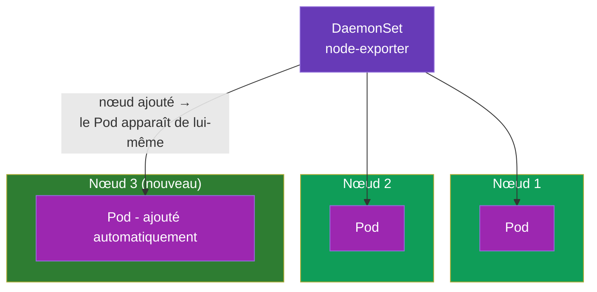
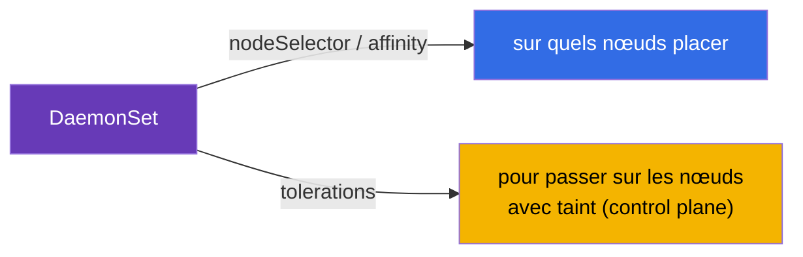
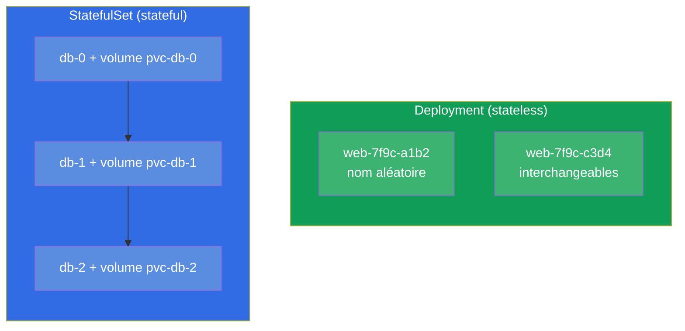
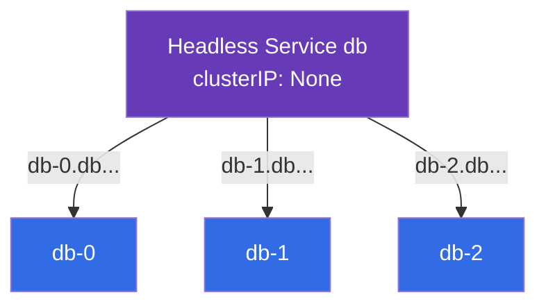
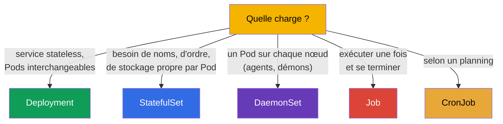

[Русская версия](ru.md) · [Eng version](README.md) · [Versión en español](es.md) · [Deutsche Version](de.md) · [ქართული ვერსია](ge.md) · [繁體中文版](tw.md) · [日本語版](jp.md)

# Chapitre 11. DaemonSet et StatefulSet

> **Ce qui suit.** Nous avons vu le Deployment (services stateless) et Job/CronJob (les tâches).
> Restent deux contrôleurs de charges de travail spécialisés : le **DaemonSet** (« un Pod sur
> chaque nœud » - pour les agents et les démons) et le **StatefulSet** (pour les applications
> avec état - les bases de données, où comptent les noms stables et le stockage propre).
> Comprendre quel contrôleur convient à quelle tâche est un sujet du CKAD (Application Design) et
> du CKA (Workloads). Le stockage du StatefulSet s'appuie sur PV/PVC (chapitre 25), donc ici nous
> nous concentrons sur les contrôleurs eux-mêmes.

## 11.1. DaemonSet : un Pod sur chaque nœud

Le **DaemonSet** garantit que sur **chaque** nœud (ou sur chaque nœud correspondant à une
condition) tourne exactement une instance du Pod. Vous ajoutez un nœud - le DaemonSet y lance
automatiquement un Pod. Vous retirez un nœud - le Pod part avec lui.



Le DaemonSet n'a pas de champ `replicas` - le nombre de Pods est égal au nombre de nœuds
éligibles, et le cluster maintient lui-même la correspondance.

Les utilisateurs typiques du DaemonSet sont les composants système qui doivent être présents sur
chaque nœud :

- **réseau :** kube-proxy, agents CNI (Calico, Cilium) ;
- **logs :** collecteurs comme Fluent Bit, Fluentd ;
- **supervision :** node-exporter, agents d'observabilité ;
- **stockage/sécurité :** agents CSI, agents de sécurité.

```yaml
apiVersion: apps/v1
kind: DaemonSet
metadata:
  name: node-exporter
spec:
  selector:
    matchLabels:
      app: node-exporter
  template:
    metadata:
      labels:
        app: node-exporter
    spec:
      containers:
      - name: node-exporter
        image: prom/node-exporter
```

## 11.2. DaemonSet et choix des nœuds

Par défaut, le DaemonSet place un Pod sur tous les nœuds. On peut restreindre l'ensemble des
nœuds via `nodeSelector` ou l'affinity (chapitre 12) dans le template du Pod :

```yaml
    spec:
      nodeSelector:
        disktype: ssd        # seulement sur les nœuds portant ce label
```

Détail important : le DaemonSet doit généralement fonctionner aussi sur les nœuds du control
plane, qui sont fermés par un taint (chapitre 2). C'est pourquoi les DaemonSet système ajoutent
des **tolerations** (chapitre 13), afin que leurs Pods y soient admis. Sans cela, l'agent de
supervision n'arriverait pas sur le control plane.



Le DaemonSet se met à jour comme un Deployment - par rolling update (`updateStrategy`).

## 11.3. StatefulSet : les applications avec état

Le **StatefulSet** est nécessaire quand les Pods ne sont **pas interchangeables** : chacun a son
identité, son stockage persistant, et l'ordre de démarrage compte. Les classiques sont les bases
de données et les systèmes en cluster (PostgreSQL, MySQL, MongoDB, Kafka, etcd, Elasticsearch),
où le nœud `db-0` n'est pas la même chose que `db-1`.

Ce que le StatefulSet apporte de plus que le Deployment :

- **Des noms de Pods stables.** Pas des hachages aléatoires, mais des `web-0`, `web-1`, `web-2`
  prévisibles. Le nom survit à la recréation du Pod.
- **Un stockage stable.** Chaque Pod a son PVC, qui lui reste rattaché lors de la recréation (le
  Pod `web-0` récupère toujours son volume).
- **L'ordre.** Les Pods sont créés dans l'ordre (0, puis 1, puis 2) et supprimés dans l'ordre
  inverse (2, 1, 0). C'est important pour les clusters dont les nœuds doivent monter à tour de
  rôle.



## 11.4. Manifeste StatefulSet et volumeClaimTemplates

Le trait distinctif du StatefulSet, c'est `volumeClaimTemplates` : un template selon lequel
**chaque** Pod reçoit son propre PVC (et donc son propre volume).

```yaml
apiVersion: apps/v1
kind: StatefulSet
metadata:
  name: db
spec:
  serviceName: db            # service headless (voir ci-dessous)
  replicas: 3
  selector:
    matchLabels:
      app: db
  template:
    metadata:
      labels:
        app: db
    spec:
      containers:
      - name: db
        image: postgres:16
        volumeMounts:
        - name: data
          mountPath: /var/lib/postgresql/data
  volumeClaimTemplates:      # à chaque Pod son propre PVC
  - metadata:
      name: data
    spec:
      accessModes: ["ReadWriteOnce"]
      resources:
        requests:
          storage: 10Gi
```

Il en résulte les PVC `data-db-0`, `data-db-1`, `data-db-2` - un par Pod. Si le Pod `db-1` est
recréé, il remontera de nouveau exactement `data-db-1`, et pas le volume d'un autre.

## 11.5. StatefulSet et service headless

Le StatefulSet fonctionne habituellement en paire avec un **service headless** (`clusterIP: None`,
chapitre 7). Un service ordinaire donne une seule IP commune et répartit la charge - mais ici il
nous faut joindre un Pod **précis** (par exemple le maître de la base `db-0`). Le service headless
ne répartit pas la charge, il attribue à chaque Pod son nom DNS stable :

```
<pod>.<service>.<namespace>.svc.cluster.local
db-0.db.default.svc.cluster.local
db-1.db.default.svc.cluster.local
db-2.db.default.svc.cluster.local
```



Le client peut ainsi atteindre nommément le nœud voulu du cluster de base de données - par exemple
écrire sur le maître et lire sur les répliques.

## 11.6. Comparaison des contrôleurs de charges de travail

Rassemblons tous les contrôleurs de la partie 2 en une seule image de choix :



| Contrôleur | Nombre de Pods | Identité des Pods | Stockage | Usage typique |
|-----------|-------------|--------------------|-----------|--------------------|
| Deployment | `replicas` | noms aléatoires, interchangeables | commun/éphémère | web, API, stateless |
| StatefulSet | `replicas` | stables (`-0`, `-1`) | propre à chaque Pod | BD, files, clusters |
| DaemonSet | = nombre de nœuds | par nœud | souvent hostPath/éphémère | agents sur chaque nœud |
| Job | `completions` | sans importance | éphémère | tâche ponctuelle |
| CronJob | selon un planning | sans importance | éphémère | tâche périodique |

## 11.7. Comment cela s'applique en production

- **Le DaemonSet, c'est la couche d'infrastructure.** Dans n'importe quelle prod, les agents de
  logs (Fluent Bit), de métriques (node-exporter), de réseau (CNI) et de sécurité tournent via des
  DaemonSet. C'est le moyen de « couvrir » à coup sûr chaque nœud, y compris les nouveaux, sans
  action manuelle.
- **Le StatefulSet pour l'état, mais avec prudence.** Les BD et les systèmes en cluster sont
  lancés dans Kubernetes via un StatefulSet, mais beaucoup d'équipes préfèrent les BD **managées**
  dans le cloud (RDS, Cloud SQL) - garder du stateful dans le cluster est plus difficile
  (sauvegardes, tolérance aux pannes, mises à niveau). On choisit le StatefulSet quand la BD doit
  vraiment vivre dans le cluster.
- **volumeClaimTemplates et les données.** Les volumes d'un StatefulSet ne sont par défaut **pas
  supprimés** lors de la suppression du StatefulSet - c'est une protection des données. Il faut les
  nettoyer en conscience. En prod, on surveille cela pour ne pas perdre ni « oublier » des volumes.
- **Ordre et mises à jour.** Le démarrage/arrêt ordonné d'un StatefulSet est critique pour les
  systèmes à quorum (etcd, Kafka) : la mise à jour se fait un Pod à la fois, pour ne pas perdre le
  quorum. Cela se règle via la stratégie de mise à jour du StatefulSet.
- **Les tolerations du DaemonSet.** Pour que les agents arrivent aussi sur le control plane, les
  DaemonSet système portent de larges tolerations - sinon la supervision/les logs des « maîtres »
  resteront aveugles.

## 11.8. Mini-glossaire

- **DaemonSet** - contrôleur qui maintient un Pod sur chaque nœud (éligible).
- **StatefulSet** - contrôleur pour les applications avec état : noms stables, ordre, stockage
  propre par Pod.
- **volumeClaimTemplates** - template du StatefulSet qui crée un PVC pour chaque Pod.
- **Identité stable** - noms de Pods prévisibles (`db-0`, `db-1`) qui survivent à la recréation.
- **Service headless** - `clusterIP: None` ; donne à chaque Pod son nom DNS, ne répartit pas la
  charge.
- **updateStrategy** - stratégie de mise à jour du DaemonSet/StatefulSet (rolling).

## 11.9. Récapitulatif du chapitre

- Le DaemonSet maintient un Pod sur chaque nœud éligible ; pas de `replicas`, le nombre de Pods =
  le nombre de nœuds. Pour les agents de logs, de métriques, de réseau, de sécurité.
- Le DaemonSet restreint les nœuds via nodeSelector/affinity et porte généralement des tolerations
  pour arriver aussi sur le control plane.
- Le StatefulSet est fait pour les applications avec état : noms stables (`-0`, `-1`),
  démarrage/arrêt ordonné, stockage persistant propre à chaque Pod.
- `volumeClaimTemplates` crée un PVC par Pod ; un Pod recréé récupère son volume.
- Le StatefulSet fonctionne avec un service headless qui donne aux Pods des noms DNS adressables.
- Choix du contrôleur : Deployment (stateless), StatefulSet (état), DaemonSet (par nœud),
  Job/CronJob (tâches).

## 11.10. À quoi cela sert : à l'examen et dans le travail réel

**À l'examen.** « Choisis le bon contrôleur pour la tâche » est une question type du CKAD ;
« crée un DaemonSet », « déploie un StatefulSet avec des volumes » sont des exercices Workloads. Il
faut comprendre pourquoi une BD est un StatefulSet et un agent sur chaque nœud un DaemonSet, et
connaître volumeClaimTemplates et le service headless.

**Dans le travail réel.** Le DaemonSet est le socle de la couche d'infrastructure du cluster
(logs, métriques, réseau). Le StatefulSet détermine comment les BD et les systèmes en cluster
vivent dans le cluster, et ses subtilités (conservation des volumes, ordre de mise à jour)
influencent directement l'intégrité des données et la disponibilité. Savoir choisir le contrôleur
est une décision de conception de base.

## 11.11. Questions d'auto-évaluation

1. En quoi le DaemonSet se distingue-t-il du Deployment et pourquoi n'a-t-il pas de `replicas` ?
2. Pourquoi les DaemonSet système ont-ils besoin de tolerations ?
3. Qu'apporte le StatefulSet de plus que le Deployment (trois propriétés clés) ?
4. Qu'est-ce que `volumeClaimTemplates` et comment un Pod et son PVC sont-ils liés lors de la
   recréation ?
5. Pourquoi le StatefulSet a-t-il besoin d'un service headless et qu'apporte-t-il côté DNS ?
6. Pourquoi les volumes d'un StatefulSet ne sont-ils pas supprimés automatiquement et en quoi
   est-ce une bonne chose ?
7. Pour chaque cas, choisissez le contrôleur : une API web, PostgreSQL, un agent de métriques sur
   chaque nœud, une sauvegarde nocturne.

## Pratique

Nous avons bouclé les contrôleurs de charges de travail. Ensuite (chapitre 12), nous passerons à
la planification - comment Kubernetes et vous décidez sur quel nœud atterrira un Pod. Le
StatefulSet avec son stockage reviendra au chapitre 26 (stockage), et le DaemonSet dans les TP sur
les charges de travail.

🧪 TP 103 (DaemonSet ; StatefulSet - dans le TP 108) : [tasks/cka/labs/103](../../labs/103/README_FR.MD)

🎮 Killercoda (dans le navigateur, sans installation) : [Kubernetes StatefulSets](https://killercoda.com/chadmcrowell/scenario/kubernetes-statefulset)

---
[Sommaire](../README_FR.md) · [Chapitre 10](../10/fr.md) · [Chapitre 12](../12/fr.md)
