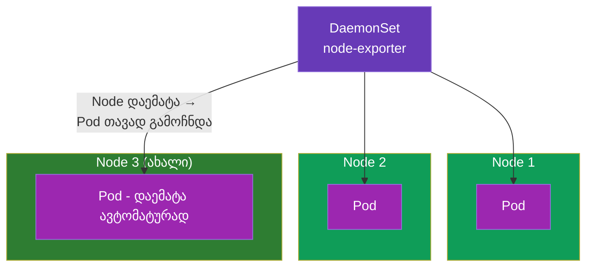
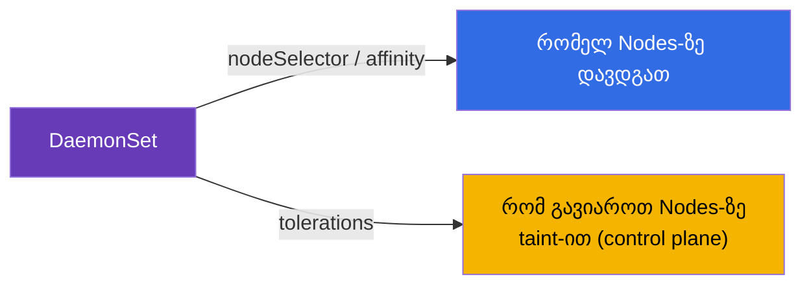
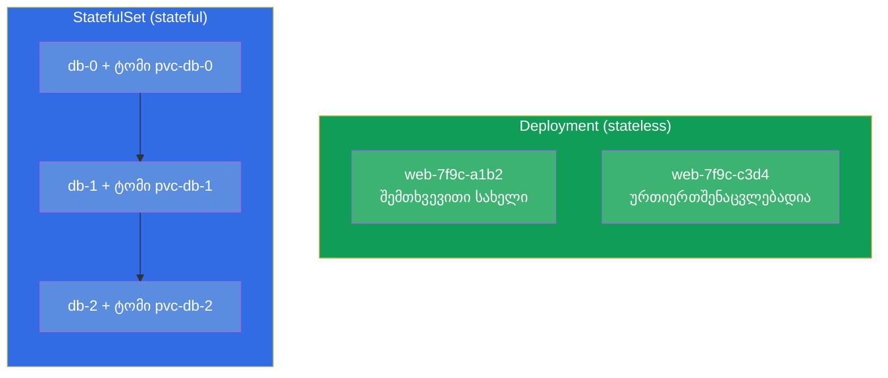
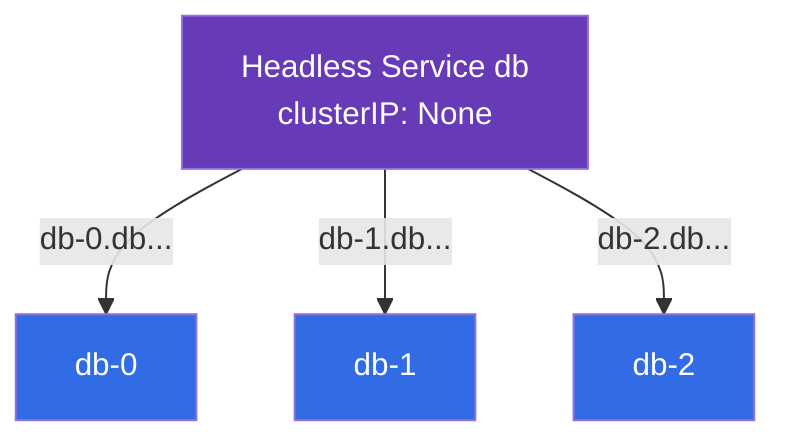
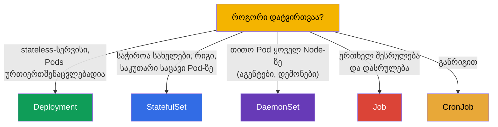

[Русская версия](ru.md) · [Eng version](README.md) · [Versión en español](es.md) · [Version française](fr.md) · [Deutsche Version](de.md) · [繁體中文版](tw.md) · [日本語版](jp.md)

# თავი 11. DaemonSet და StatefulSet

> **რა იქნება შემდეგ.** გავარჩიეთ Deployment (stateless-სერვისები) და Job/CronJob (ამოცანები).
> დარჩა სამუშაო დატვირთვების ორი სპეციალიზებული კონტროლერი: **DaemonSet** („თითო
> Pod ყოველ Node-ზე“ - აგენტებისა და დემონებისთვის) და **StatefulSet** (მდგომარეობის მქონე
> აპლიკაციებისთვის - ბაზებისთვის, სადაც მნიშვნელოვანია სტაბილური სახელები და საკუთარი საცავი).
> იმის გაგება, რომელი კონტროლერი რომელი ამოცანისთვისაა, - CKAD-ის (Application Design) და CKA-ის
> (Workloads) თემაა. StatefulSet-ის საცავი ეყრდნობა PV/PVC-ს (თავი 25), ამიტომ აქ
> ყურადღებას თავად კონტროლერებზე გავამახვილებთ.

## 11.1. DaemonSet: თითო Pod ყოველ Node-ზე

**DaemonSet** გარანტიას იძლევა, რომ **ყოველ** Node-ზე (ან ყოველ პირობის შესაბამის Node-ზე)
მუშაობს ზუსტად ერთი Pod-ის ეგზემპლარი. დავამატეთ ახალი Node - DaemonSet ავტომატურად
გაუშვებს მასზე Pod-ს. მოვაშორეთ Node - Pod მასთან ერთად წავა.



DaemonSet-ს არ აქვს ველი `replicas` - Pods-ის რაოდენობა უდრის შესაბამისი Nodes-ის რაოდენობას, კლასტერი
თავად ინარჩუნებს ამ შესაბამისობას.

DaemonSet-ის ტიპური მომხმარებლები არის სისტემური კომპონენტები, რომლებიც ყოველ Node-ზე
უნდა იყოს:

- **ქსელი:** kube-proxy, CNI-აგენტები (Calico, Cilium);
- **ლოგები:** შემგროვებლები, როგორიცაა Fluent Bit, Fluentd;
- **მონიტორინგი:** node-exporter, observability-აგენტები;
- **საცავი/უსაფრთხოება:** CSI-აგენტები, security-აგენტები.

```yaml
apiVersion: apps/v1
kind: DaemonSet
metadata:
  name: node-exporter
spec:
  selector:
    matchLabels:
      app: node-exporter
  template:
    metadata:
      labels:
        app: node-exporter
    spec:
      containers:
      - name: node-exporter
        image: prom/node-exporter
```

## 11.2. DaemonSet და Nodes-ის არჩევა

ნაგულისხმევად DaemonSet Pod-ს ყველა Node-ზე დგამს. Nodes-ის ნაკრების შეზღუდვა შეიძლება
`nodeSelector`-ით ან affinity-ით (თავი 12) Pod-ის შაბლონში:

```yaml
    spec:
      nodeSelector:
        disktype: ssd        # მხოლოდ ამ label-ის მქონე Nodes-ზე
```

მნიშვნელოვანი დეტალი: DaemonSet ჩვეულებრივ control plane-ის Nodes-ზეც უნდა მუშაობდეს, რომლებიც
taint-ით არის დახურული (თავი 2). ამიტომ სისტემური DaemonSet-ები ამატებენ
**tolerations**-ს (თავი 13), რომ მათი Pods იქაც გაუშვან. ამის გარეშე მონიტორინგის აგენტი
control plane-ზე არ მოხვდებოდა.



DaemonSet განახლდება Deployment-ის მსგავსად - rolling update-ით (`updateStrategy`).

## 11.3. StatefulSet: მდგომარეობის მქონე აპლიკაციები

**StatefulSet** საჭიროა, როცა Pods **ურთიერთშენაცვლებადი არ არის**: თითოეულს თავისი იდენტურობა აქვს,
თავისი მუდმივი საცავი, ხოლო გაშვების რიგი მნიშვნელოვანია. კლასიკა არის ბაზები და კლასტერული
სისტემები (PostgreSQL, MySQL, MongoDB, Kafka, etcd, Elasticsearch), სადაც კვანძი `db-0` -
ეს იგივე არ არის, რაც `db-1`.

რას იძლევა StatefulSet Deployment-ის ზემოთ:

- **Pods-ის სტაბილური სახელები.** არა შემთხვევითი ჰეშები, არამედ განჭვრეტადი `web-0`, `web-1`,
  `web-2`. სახელი გადაურჩება Pod-ის ხელახლა შექმნას.
- **სტაბილური საცავი.** ყოველ Pod-ს - თავისი PVC, რომელიც მასთან მიბმული რჩება
  ხელახლა შექმნის დროსაც (Pod `web-0` ყოველთვის თავის ტომს იღებს).
- **მოწესრიგებულობა.** Pods იქმნება რიგის მიხედვით (0, შემდეგ 1, შემდეგ 2) და იშლება
  უკუღმა (2, 1, 0). ეს მნიშვნელოვანია კლასტერებისთვის, სადაც კვანძები რიგრიგობით უნდა აიწყონ.



## 11.4. StatefulSet-ის მანიფესტი და volumeClaimTemplates

StatefulSet-ის გამორჩეული ნიშანი არის `volumeClaimTemplates`: შაბლონი, რომლის მიხედვით **ყოველ**
Pod-ს ეძლევა საკუთარი PVC (და მაშასადამე - საკუთარი ტომი).

```yaml
apiVersion: apps/v1
kind: StatefulSet
metadata:
  name: db
spec:
  serviceName: db            # headless-სერვისი (იხ. ქვემოთ)
  replicas: 3
  selector:
    matchLabels:
      app: db
  template:
    metadata:
      labels:
        app: db
    spec:
      containers:
      - name: db
        image: postgres:16
        volumeMounts:
        - name: data
          mountPath: /var/lib/postgresql/data
  volumeClaimTemplates:      # ყოველ Pod-ს - თავისი PVC
  - metadata:
      name: data
    spec:
      accessModes: ["ReadWriteOnce"]
      resources:
        requests:
          storage: 10Gi
```

შედეგად გამოჩნდება PVC-ები `data-db-0`, `data-db-1`, `data-db-2` - თითო ყოველ Pod-ზე. თუ
Pod `db-1` ხელახლა შეიქმნება, ის თავიდან სწორედ `data-db-1`-ს დაამონტაჟებს და არა სხვის ტომს.

## 11.5. StatefulSet და headless-სერვისი

StatefulSet ჩვეულებრივ **headless-სერვისთან** წყვილში მუშაობს (`clusterIP: None`, თავი 7).
ჩვეულებრივი სერვისი ერთ საერთო IP-ს იძლევა და აბალანსებს - მაგრამ ჩვენ **კონკრეტულ**
Pod-ს უნდა მივმართოთ (მაგალითად, ბაზის მასტერს `db-0`). headless-სერვისი არ აბალანსებს, არამედ ყოველ
Pod-ს თავის სტაბილურ DNS-სახელს აძლევს:

```
<pod>.<service>.<namespace>.svc.cluster.local
db-0.db.default.svc.cluster.local
db-1.db.default.svc.cluster.local
```



ასე კლიენტს შეუძლია მისამართულად მიწვდეს ბაზის კლასტერის საჭირო კვანძს - მაგალითად, წეროს
მასტერში და კითხულობდეს რეპლიკებიდან.

## 11.6. სამუშაო დატვირთვების კონტროლერების შედარება

შევკრიბოთ ნაწილ 2-ის ყველა კონტროლერი არჩევის ერთ სურათში:



| კონტროლერი | Pods-ის რაოდენობა | Pods-ის იდენტურობა | საცავი | ტიპური გამოყენება |
|-----------|-------------|--------------------|-----------|--------------------|
| Deployment | `replicas` | შემთხვევითი სახელები, ურთიერთშენაცვლებადია | საერთო/ეფემერული | ვები, API, stateless |
| StatefulSet | `replicas` | სტაბილური (`-0`, `-1`) | თავისი ყოველ Pod-ზე | ბაზები, რიგები, კლასტერები |
| DaemonSet | = Nodes-ის რაოდენობა | Node-ის მიხედვით | ჩვეულებრივ hostPath/ეფემერული | აგენტები ყოველ Node-ზე |
| Job | `completions` | არ არის მნიშვნელოვანი | ეფემერული | ერთჯერადი ამოცანა |
| CronJob | განრიგით | არ არის მნიშვნელოვანი | ეფემერული | პერიოდული ამოცანა |

## 11.7. როგორ იყენებენ ამას პროდაქშენში

- **DaemonSet - ინფრასტრუქტურული შრე.** ნებისმიერ პროდში DaemonSet-ით ტრიალდება ლოგების
  (Fluent Bit), მეტრიკების (node-exporter), ქსელის (CNI) და უსაფრთხოების აგენტები. ეს არის ხერხი,
  გარანტირებულად „დაფარო“ ყოველი Node, ახლების ჩათვლით, ხელით მოქმედებების გარეშე.
- **StatefulSet - მდგომარეობისთვის, მაგრამ ფრთხილად.** ბაზებსა და კლასტერულ სისტემებს Kubernetes-ში
  StatefulSet-ით უშვებენ, მაგრამ ბევრი გუნდი ღრუბელში **მართულ** ბაზებს ამჯობინებს
  (RDS, Cloud SQL) - stateful-ის კლასტერში ჭერა უფრო რთულია (ბექაპები, უმტყუნებლობა,
  განახლებები). StatefulSet-ს ირჩევენ, როცა ბაზა მართლაც კლასტერში უნდა ცხოვრობდეს.
- **volumeClaimTemplates და მონაცემები.** StatefulSet-ის ტომები ნაგულისხმევად **არ იშლება**
  StatefulSet-ის წაშლის დროს - ეს მონაცემების დაცვაა. მათი გასუფთავება შეგნებულად უწევთ. პროდში ამას
  თვალს ადევნებენ, რომ ტომები არ დაკარგონ და არ „დაივიწყონ“.
- **რიგი და განახლებები.** StatefulSet-ის მოწესრიგებული გაშვება/გაჩერება კრიტიკულია
  ქვორუმიანი სისტემებისთვის (etcd, Kafka): განახლება თითო Pod-ით მიდის, რომ ქვორუმი არ დაიკარგოს.
  ამას StatefulSet-ის განახლების სტრატეგიით აწყობენ.
- **DaemonSet-ის tolerations.** იმისთვის, რომ აგენტები control plane-ზეც მოხვდნენ, სისტემურ
  DaemonSet-ებს ფართო tolerations აქვს - თორემ „მასტერების“ მონიტორინგი/ლოგები ბრმა იქნება.

## 11.8. მინი-ლექსიკონი

- **DaemonSet** - კონტროლერი, რომელიც ყოველ (შესაბამის) Node-ზე თითო Pod-ს ინახავს.
- **StatefulSet** - კონტროლერი მდგომარეობის მქონე აპლიკაციებისთვის: სტაბილური სახელები, რიგი,
  საკუთარი საცავი Pod-ზე.
- **volumeClaimTemplates** - StatefulSet-ის შაბლონი, რომელიც ყოველი Pod-ისთვის PVC-ს ქმნის.
- **სტაბილური იდენტურობა** - Pods-ის განჭვრეტადი სახელები (`db-0`, `db-1`), რომლებიც გადაურჩება
  ხელახლა შექმნას.
- **Headless-სერვისი** - `clusterIP: None`; ყოველ Pod-ს თავის DNS-სახელს აძლევს, არ აბალანსებს.
- **updateStrategy** - DaemonSet/StatefulSet-ის განახლების სტრატეგია (rolling).

## 11.9. თავის შეჯამება

- DaemonSet ყოველ შესაბამის Node-ზე თითო Pod-ს ინახავს; `replicas` არ არის, Pods-ის
  რაოდენობა = Nodes-ის რაოდენობა. ლოგების, მეტრიკების, ქსელის, უსაფრთხოების აგენტებისთვის.
- DaemonSet Nodes-ს ზღუდავს nodeSelector/affinity-ით და ჩვეულებრივ tolerations-ს ატარებს,
  რომ control plane-ზეც მოხვდეს.
- StatefulSet - მდგომარეობის მქონე აპლიკაციებისთვის: სტაბილური სახელები (`-0`, `-1`), მოწესრიგებული
  გაშვება/გაჩერება, საკუთარი მუდმივი საცავი ყოველ Pod-ზე.
- `volumeClaimTemplates` თითო PVC-ს ქმნის Pod-ზე; ხელახლა შექმნილი Pod თავის ტომს უკან
  იღებს.
- StatefulSet მუშაობს headless-სერვისთან, რომელიც Pods-ს მისამართულ DNS-სახელებს აძლევს.
- კონტროლერის არჩევა: Deployment (stateless), StatefulSet (state), DaemonSet (Node-ის მიხედვით),
  Job/CronJob (ამოცანები).

## 11.10. როგორ გამოგადგებათ: გამოცდაზე და რეალურ სამუშაოში

**გამოცდაზე.** „აირჩიე სწორი კონტროლერი ამოცანისთვის“ - CKAD-ის ტიპური კითხვაა;
„შექმენი DaemonSet“, „გაშალე StatefulSet ტომებით“ - Workloads-ის დავალებებია. საჭიროა გაგება,
რატომ არის ბაზა StatefulSet, ხოლო აგენტი ყოველ Node-ზე - DaemonSet, და
volumeClaimTemplates-ისა და headless-სერვისის ცოდნა.

**რეალურ სამუშაოში.** DaemonSet არის კლასტერის ინფრასტრუქტურული შრის ფუნდამენტი (ლოგები,
მეტრიკები, ქსელი). StatefulSet განსაზღვრავს, როგორ ცხოვრობს კლასტერში ბაზები და კლასტერული სისტემები, ხოლო
მისი ნატიფი დეტალები (ტომების შენახვა, განახლების რიგი) პირდაპირ მოქმედებს მონაცემების სიმრთელეზე
და ხელმისაწვდომობაზე. კონტროლერის არჩევის უნარი საბაზისო საპროექტო გადაწყვეტილებაა.

## 11.11. თვითშემოწმების კითხვები

1. რითი განსხვავდება DaemonSet Deployment-ისგან და რატომ არ აქვს მას `replicas`?
2. რისთვის სჭირდება სისტემურ DaemonSet-ებს tolerations?
3. რას იძლევა StatefulSet Deployment-ის ზემოთ (სამი საკვანძო თვისება)?
4. რა არის `volumeClaimTemplates` და როგორ არის დაკავშირებული Pod და მისი PVC ხელახლა შექმნის დროს?
5. რისთვის სჭირდება StatefulSet-ს headless-სერვისი და რას იძლევა ის DNS-ით?
6. რატომ არ იშლება StatefulSet-ის ტომები ავტომატურად და რითია ეს კარგი?
7. ყოველი შემთხვევისთვის აირჩიეთ კონტროლერი: ვებ-API, PostgreSQL, მეტრიკების აგენტი ყოველ
   Node-ზე, ღამის ბექაპი.

## პრაქტიკა

დავხურეთ სამუშაო დატვირთვების კონტროლერები. შემდეგ (თავი 12) გადავალთ დაგეგმვაზე - როგორ
წყვეტს Kubernetes და თქვენ, რომელ Node-ზე მოხვდება Pod. StatefulSet საცავთან ერთად დაბრუნდება
თავ 26-ში (შენახვა), ხოლო DaemonSet - სამუშაო დატვირთვების ლაბებში.

🧪 ლაბი 103 (DaemonSet; StatefulSet - ლაბ 108-ში): [tasks/cka/labs/103](../../labs/103/README_GE.MD)

🎮 Killercoda (ბრაუზერში, ინსტალაციის გარეშე): [Kubernetes StatefulSets](https://killercoda.com/chadmcrowell/scenario/kubernetes-statefulset)

---
[სარჩევი](../README_GE.md) · [თავი 10](../10/ge.md) · [თავი 12](../12/ge.md)
