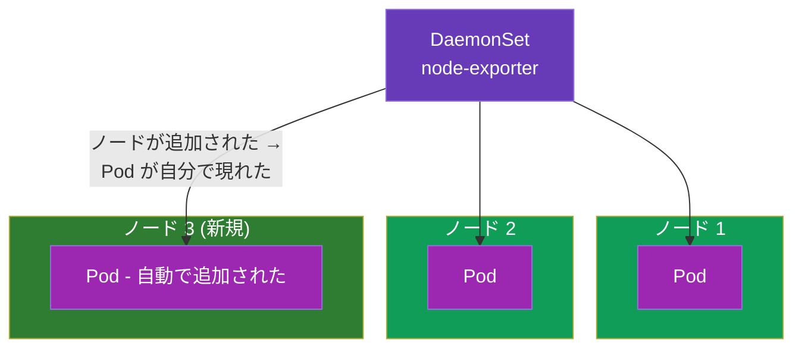
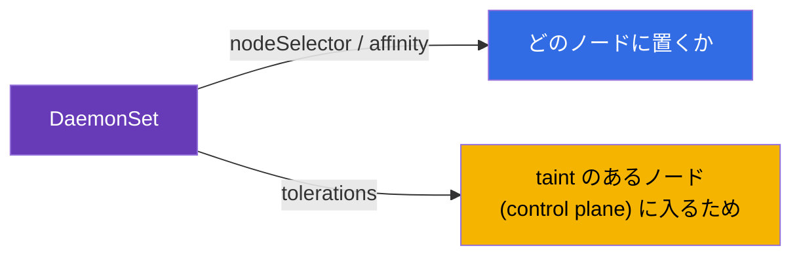
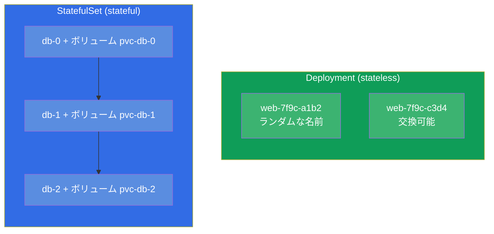
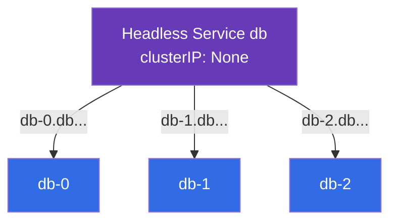
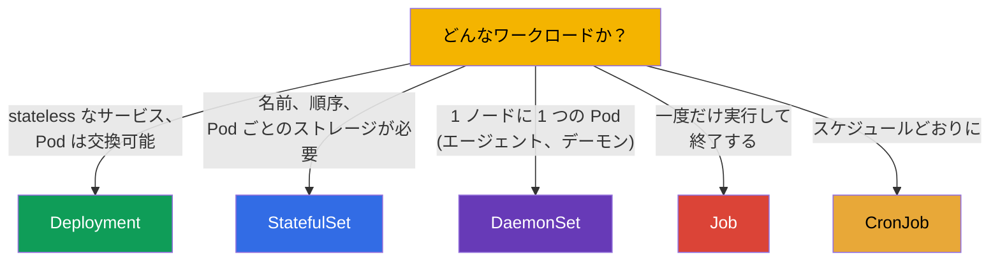

[Русская версия](ru.md) · [Eng version](README.md) · [Versión en español](es.md) · [Version française](fr.md) · [Deutsche Version](de.md) · [ქართული ვერსია](ge.md) · [繁體中文版](tw.md)

# 第 11 章。DaemonSet と StatefulSet

> **次はなにか。** Deployment (stateless なサービス) と Job/CronJob (タスク) を
> 見てきました。残っているのは 2 つの専門的なワークロードコントローラです：
> **DaemonSet** (「1 ノードに 1 つの Pod」 - エージェントやデーモンのため) と
> **StatefulSet** (状態を持つアプリケーション - 安定した名前と自分専用の
> ストレージが重要なデータベースなどのため) です。どのコントローラがどの用途かを
> 理解することは、CKAD (Application Design) と CKA (Workloads) のテーマです。
> StatefulSet のストレージは PV/PVC (第 25 章) に依存するので、ここではコントローラ
> 自体に集中します。

## 11.1. DaemonSet：1 ノードに 1 つの Pod

**DaemonSet** は、**すべての** ノード (または条件に合うすべてのノード) でちょうど
1 つの Pod のインスタンスが動くことを保証します。新しいノードを追加すれば、
DaemonSet が自動でそこに Pod を起動します。ノードを外せば、Pod もそれと一緒に
消えます。



DaemonSet には `replicas` フィールドがありません - Pod の数は条件に合うノードの数に
等しく、クラスタ自身がその対応を保ちます。

DaemonSet の典型的な利用者は、すべてのノードに存在しなければならないシステム
コンポーネントです：

- **ネットワーク：** kube-proxy、CNI エージェント (Calico、Cilium)；
- **ログ：** Fluent Bit、Fluentd のような収集エージェント；
- **モニタリング：** node-exporter、observability のエージェント；
- **ストレージ/セキュリティ：** CSI エージェント、security エージェント。

```yaml
apiVersion: apps/v1
kind: DaemonSet
metadata:
  name: node-exporter
spec:
  selector:
    matchLabels:
      app: node-exporter
  template:
    metadata:
      labels:
        app: node-exporter
    spec:
      containers:
      - name: node-exporter
        image: prom/node-exporter
```

## 11.2. DaemonSet とノードの選択

デフォルトでは DaemonSet はすべてのノードに Pod を置きます。ノードの集合を絞るには、
Pod テンプレートの `nodeSelector` または affinity (第 12 章) を使います：

```yaml
    spec:
      nodeSelector:
        disktype: ssd        # このラベルを持つノードだけ
```

重要な点：DaemonSet は通常、taint (第 2 章) で閉じられている control plane の
ノードでも動く必要があります。そのためシステムの DaemonSet は **tolerations**
(第 13 章) を付けて、そこにも Pod が入れるようにします。これがなければ、
モニタリングのエージェントは control plane に行き着けません。



DaemonSet は Deployment と同じように rolling update (`updateStrategy`) で更新されます。

## 11.3. StatefulSet：状態を持つアプリケーション

**StatefulSet** が必要になるのは、Pod が **交換可能ではない** ときです：それぞれが
自分のアイデンティティと自分専用の永続ストレージを持ち、起動の順序が重要な場合です。
定番はデータベースとクラスタ型のシステム (PostgreSQL、MySQL、MongoDB、Kafka、etcd、
Elasticsearch) で、そこではノード `db-0` は `db-1` と同じものではありません。

StatefulSet が Deployment に加えて与えてくれるもの：

- **安定した Pod 名。** ランダムなハッシュではなく、予測できる `web-0`、`web-1`、
  `web-2`。名前は Pod の再作成を越えて生き残ります。
- **安定したストレージ。** 各 Pod に自分の PVC があり、再作成のときもその Pod に
  紐づいたままです (Pod `web-0` は常に自分のボリュームを受け取ります)。
- **順序性。** Pod は順番に作られ (0、次に 1、次に 2)、削除は逆順です (2、1、0)。
  ノードが順番に立ち上がる必要のあるクラスタでは、これが重要です。



## 11.4. StatefulSet のマニフェストと volumeClaimTemplates

StatefulSet を特徴づけるのは `volumeClaimTemplates` です：**各** Pod に自分専用の
PVC (つまり自分専用のボリューム) を作るためのテンプレートです。

```yaml
apiVersion: apps/v1
kind: StatefulSet
metadata:
  name: db
spec:
  serviceName: db            # headless サービス (下を参照)
  replicas: 3
  selector:
    matchLabels:
      app: db
  template:
    metadata:
      labels:
        app: db
    spec:
      containers:
      - name: db
        image: postgres:16
        volumeMounts:
        - name: data
          mountPath: /var/lib/postgresql/data
  volumeClaimTemplates:      # 各 Pod に自分の PVC
  - metadata:
      name: data
    spec:
      accessModes: ["ReadWriteOnce"]
      resources:
        requests:
          storage: 10Gi
```

結果として PVC `data-db-0`、`data-db-1`、`data-db-2` が - Pod ごとに 1 つ - 現れます。
Pod `db-1` が再作成されると、他人のボリュームではなく、まさに `data-db-1` を
もう一度マウントします。

## 11.5. StatefulSet と headless サービス

StatefulSet は通常 **headless サービス** (`clusterIP: None`、第 7 章) と組んで
動きます。普通のサービスは共通の IP を 1 つ与えて負荷分散しますが、私たちは
**特定の** Pod (たとえば DB のマスター `db-0`) にアクセスする必要があります。
headless サービスは負荷分散をせず、各 Pod に安定した DNS 名を与えます：

```
<pod>.<service>.<namespace>.svc.cluster.local
db-0.db.default.svc.cluster.local
db-1.db.default.svc.cluster.local
```



こうしてクライアントは DB クラスタの必要なノードへ名指しで到達できます - たとえば
マスターに書き、レプリカから読む、といったことです。

## 11.6. ワークロードコントローラの比較

パート 2 のすべてのコントローラを、1 枚の選択図にまとめましょう：



| コントローラ | Pod の数 | Pod のアイデンティティ | ストレージ | 典型的な用途 |
|-----------|-------------|--------------------|-----------|--------------------|
| Deployment | `replicas` | ランダムな名前、交換可能 | 共有/エフェメラル | ウェブ、API、stateless |
| StatefulSet | `replicas` | 安定 (`-0`、`-1`) | Pod ごとに自分専用 | DB、キュー、クラスタ |
| DaemonSet | = ノード数 | ノード単位 | 通常 hostPath/エフェメラル | 各ノード上のエージェント |
| Job | `completions` | 重要ではない | エフェメラル | 一度だけのタスク |
| CronJob | スケジュールどおり | 重要ではない | エフェメラル | 定期的なタスク |

## 11.7. 本番環境でこれをどう使うか

- **DaemonSet はインフラの層。** どんな本番環境でも、ログ (Fluent Bit)、メトリクス
  (node-exporter)、ネットワーク (CNI)、セキュリティのエージェントは DaemonSet で
  動いています。これは新しいノードも含めて、手作業なしにすべてのノードを確実に
  「覆う」方法です。
- **StatefulSet は状態のため、ただし慎重に。** Kubernetes で DB やクラスタ型の
  システムを動かすときは StatefulSet を使いますが、多くのチームはクラウドの
  **マネージド** DB (RDS、Cloud SQL) を好みます - stateful をクラスタ内で運用するのは
  より難しいのです (バックアップ、耐障害性、アップグレード)。StatefulSet を選ぶのは、
  DB が本当にクラスタ内で生きるべきときです。
- **volumeClaimTemplates とデータ。** StatefulSet のボリュームは、StatefulSet を
  削除してもデフォルトでは **削除されません** - これはデータの保護です。片付けは
  意識的に行う必要があります。本番ではボリュームを失わないよう、また「忘れ去られ」
  ないよう、これを見ています。
- **順序と更新。** StatefulSet の順序づけられた起動/停止は、クォーラムを持つ
  システム (etcd、Kafka) にとって決定的です：クォーラムを失わないよう、更新は
  Pod 1 つずつ進みます。これは StatefulSet の更新戦略で設定します。
- **DaemonSet の tolerations。** エージェントが control plane にも入れるように、
  システムの DaemonSet は広い tolerations を持ちます - そうでなければ「マスター」の
  モニタリング/ログは盲目になります。

## 11.8. ミニ用語集

- **DaemonSet** - (条件に合う) 各ノードに 1 つの Pod を保つコントローラ。
- **StatefulSet** - 状態を持つアプリケーションのためのコントローラ：安定した名前、
  順序、Pod ごとの自分専用ストレージ。
- **volumeClaimTemplates** - 各 Pod のために PVC を作る StatefulSet のテンプレート。
- **安定したアイデンティティ** - 再作成を越えて生き残る、予測できる Pod 名
  (`db-0`、`db-1`)。
- **headless サービス** - `clusterIP: None`；各 Pod に自分の DNS 名を与え、負荷分散はしません。
- **updateStrategy** - DaemonSet/StatefulSet の更新戦略 (rolling)。

## 11.9. 本章のまとめ

- DaemonSet は条件に合う各ノードに 1 つの Pod を保ちます；`replicas` はなく、Pod の数
  = ノードの数です。ログ、メトリクス、ネットワーク、セキュリティのエージェント向けです。
- DaemonSet は nodeSelector/affinity でノードを絞り、control plane にも入れるよう
  通常 tolerations を持ちます。
- StatefulSet は状態を持つアプリケーションのため：安定した名前 (`-0`、`-1`)、順序
  づけられた起動/停止、Pod ごとの自分専用の永続ストレージ。
- `volumeClaimTemplates` は Pod ごとに PVC を作ります；再作成された Pod は自分の
  ボリュームを取り戻します。
- StatefulSet は、Pod に名指しの DNS 名を与える headless サービスと組んで動きます。
- コントローラの選択：Deployment (stateless)、StatefulSet (状態)、DaemonSet
  (ノード単位)、Job/CronJob (タスク)。

## 11.10. これがどう役に立つか：試験と実際の仕事で

**試験では。** 「タスクに合った正しいコントローラを選べ」は CKAD の定番の問題です；
「DaemonSet を作れ」「ボリューム付きの StatefulSet をデプロイせよ」は Workloads の
課題です。なぜ DB は StatefulSet で、各ノード上のエージェントは DaemonSet なのかを
理解し、volumeClaimTemplates と headless サービスを知っている必要があります。

**実際の仕事では。** DaemonSet はクラスタのインフラ層の土台です (ログ、メトリクス、
ネットワーク)。StatefulSet はクラスタ内で DB とクラスタ型システムがどう生きるかを
決め、その細部 (ボリュームの保持、更新の順序) はデータの保全性と可用性に直接
影響します。コントローラを選べることは、基本的な設計上の判断です。

## 11.11. 自己チェックの質問

1. DaemonSet は Deployment とどう違い、なぜ `replicas` がないのですか？
2. システムの DaemonSet に tolerations が必要なのはなぜですか？
3. StatefulSet が Deployment に加えて与えるものは何ですか (3 つの重要な性質)？
4. `volumeClaimTemplates` とは何で、再作成のとき Pod とその PVC はどう結びついていますか？
5. StatefulSet に headless サービスが必要なのはなぜで、DNS の面で何を与えますか？
6. StatefulSet のボリュームが自動で削除されないのはなぜで、それはどう良いのですか？
7. それぞれの場合にコントローラを選んでください：ウェブ API、PostgreSQL、各ノード上の
   メトリクスエージェント、夜間のバックアップ。

## 演習

ワークロードコントローラは終わりました。次 (第 12 章) はスケジューリングへ進みます -
Kubernetes とあなたが、Pod がどのノードに載るかをどう決めるのか。ストレージを伴う
StatefulSet は第 26 章 (ストレージ) で戻ってきて、DaemonSet はワークロード関連の
ラボで出てきます。

🧪 ラボ 103 (DaemonSet；StatefulSet はラボ 108): [tasks/cka/labs/103](../../labs/103/README_JP.MD)

---
[目次](../README_JP.md) · [第 10 章](../10/jp.md) · [第 12 章](../12/jp.md)
