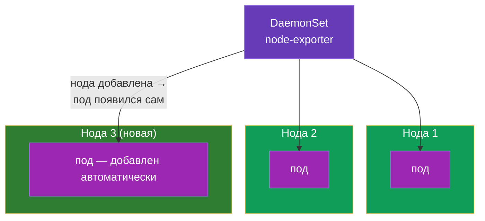
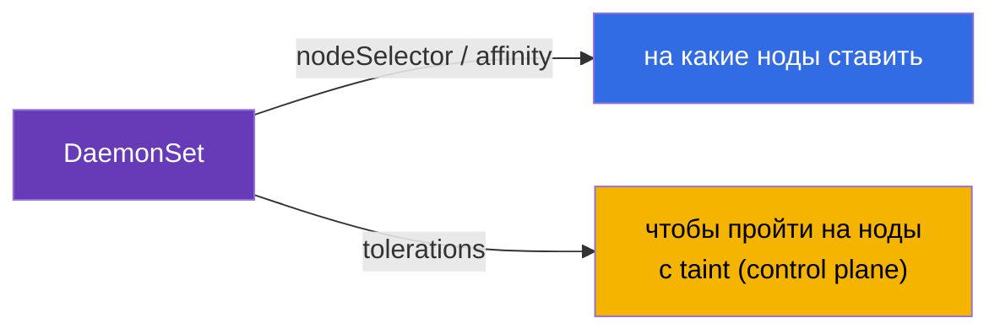
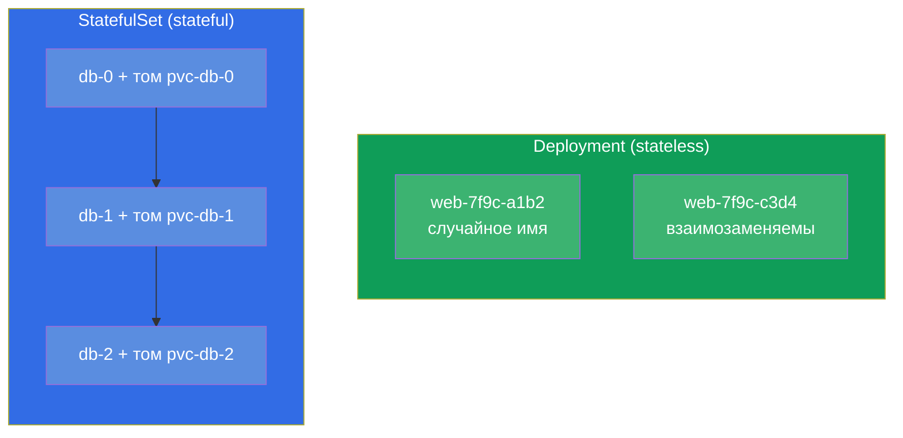
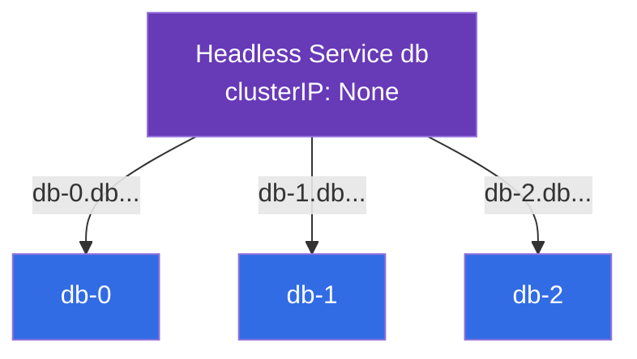
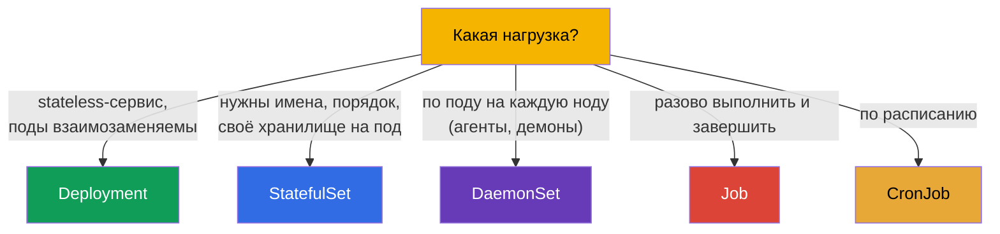

# Глава 11. DaemonSet и StatefulSet

> **Что дальше.** Мы разобрали Deployment (stateless-сервисы) и Job/CronJob (задачи).
> Остались два специализированных контроллера рабочих нагрузок: **DaemonSet** («по
> одному поду на каждую ноду» - для агентов и демонов) и **StatefulSet** (для
> приложений с состоянием - баз данных, где важны стабильные имена и своё хранилище).
> Понимать, какой контроллер под какую задачу, - тема CKAD (Application Design) и CKA
> (Workloads). Хранилище StatefulSet опирается на PV/PVC (глава 25), поэтому здесь мы
> сосредоточимся на самих контроллерах.

## 11.1. DaemonSet: по одному поду на каждую ноду

**DaemonSet** гарантирует, что на **каждой** ноде (или на каждой подходящей под условие)
работает ровно один экземпляр пода. Добавили новую ноду - DaemonSet автоматически
запустит на ней под. Убрали ноду - под уедет вместе с ней.



У DaemonSet нет поля `replicas` - число подов равно числу подходящих нод, кластер сам
поддерживает соответствие.

Типичные пользователи DaemonSet - системные компоненты, которые должны быть на каждой
ноде:

- **сеть:** kube-proxy, CNI-агенты (Calico, Cilium);
- **логи:** сборщики вроде Fluent Bit, Fluentd;
- **мониторинг:** node-exporter, агенты observability;
- **хранилище/безопасность:** CSI-агенты, security-агенты.

```yaml
apiVersion: apps/v1
kind: DaemonSet
metadata:
  name: node-exporter
spec:
  selector:
    matchLabels:
      app: node-exporter
  template:
    metadata:
      labels:
        app: node-exporter
    spec:
      containers:
      - name: node-exporter
        image: prom/node-exporter
```

## 11.2. DaemonSet и выбор нод

По умолчанию DaemonSet ставит под на все ноды. Ограничить набор нод можно через
`nodeSelector` или affinity (глава 12) в шаблоне пода:

```yaml
    spec:
      nodeSelector:
        disktype: ssd        # только на ноды с этой меткой
```

Важная деталь: DaemonSet обычно должен работать и на нодах control plane, которые
закрыты taint'ом (глава 2). Поэтому системные DaemonSet добавляют
**tolerations** (глава 13), чтобы их поды пускались и туда. Без этого агент мониторинга
не попал бы на control plane.



DaemonSet обновляется как Deployment - через rolling update (`updateStrategy`).

## 11.3. StatefulSet: приложения с состоянием

**StatefulSet** нужен, когда поды **не взаимозаменяемы**: у каждого своя идентичность,
своё постоянное хранилище, а порядок запуска важен. Классика - базы данных и кластерные
системы (PostgreSQL, MySQL, MongoDB, Kafka, etcd, Elasticsearch), где узел `db-0` -
это не то же самое, что `db-1`.

Что даёт StatefulSet сверх Deployment:

- **Стабильные имена подов.** Не случайные хеши, а предсказуемые `web-0`, `web-1`,
  `web-2`. Имя переживает пересоздание пода.
- **Стабильное хранилище.** Каждому поду - свой PVC, который остаётся привязан к нему
  при пересоздании (под `web-0` всегда получает свой том).
- **Упорядоченность.** Поды создаются по порядку (0, затем 1, затем 2) и удаляются в
  обратном (2, 1, 0). Это важно для кластеров, где узлы должны подниматься по очереди.



## 11.4. Манифест StatefulSet и volumeClaimTemplates

Отличительная черта StatefulSet - `volumeClaimTemplates`: шаблон, по которому **каждому**
поду создаётся собственный PVC (а значит - свой том).

```yaml
apiVersion: apps/v1
kind: StatefulSet
metadata:
  name: db
spec:
  serviceName: db            # headless-сервис (см. ниже)
  replicas: 3
  selector:
    matchLabels:
      app: db
  template:
    metadata:
      labels:
        app: db
    spec:
      containers:
      - name: db
        image: postgres:16
        volumeMounts:
        - name: data
          mountPath: /var/lib/postgresql/data
  volumeClaimTemplates:      # каждому поду — свой PVC
  - metadata:
      name: data
    spec:
      accessModes: ["ReadWriteOnce"]
      resources:
        requests:
          storage: 10Gi
```

В результате появятся PVC `data-db-0`, `data-db-1`, `data-db-2` - по одному на под. Если
под `db-1` пересоздастся, он снова примонтирует именно `data-db-1`, а не чужой том.

## 11.5. StatefulSet и headless-сервис

StatefulSet обычно работает в паре с **headless-сервисом** (`clusterIP: None`, глава 7).
Обычный сервис даёт один общий IP и балансирует - но нам нужно обращаться к **конкретному**
поду (например, к мастеру БД `db-0`). Headless-сервис не балансирует, а выдаёт каждому
поду своё стабильное DNS-имя:

```
<pod>.<service>.<namespace>.svc.cluster.local
db-0.db.default.svc.cluster.local
db-1.db.default.svc.cluster.local
```



Так клиент может адресно достучаться до нужного узла кластера БД - например, писать в
мастер и читать с реплик.

## 11.6. Сравнение контроллеров рабочих нагрузок

Соберём все контроллеры из части 2 в одну картину выбора:



| Контроллер | Число подов | Идентичность подов | Хранилище | Типичное применение |
|-----------|-------------|--------------------|-----------|--------------------|
| Deployment | `replicas` | случайные имена, взаимозаменяемы | общее/эфемерное | веб, API, stateless |
| StatefulSet | `replicas` | стабильные (`-0`, `-1`) | своё на каждый под | БД, очереди, кластеры |
| DaemonSet | = число нод | по ноде | обычно hostPath/эфемерное | агенты на каждой ноде |
| Job | `completions` | неважна | эфемерное | разовая задача |
| CronJob | по расписанию | неважна | эфемерное | периодическая задача |

## 11.7. Как это применяют в продакшене

- **DaemonSet - инфраструктурный слой.** В любом проде через DaemonSet крутятся агенты
  логов (Fluent Bit), метрик (node-exporter), сети (CNI) и безопасности. Это способ
  гарантированно «покрыть» каждую ноду, включая новые, без ручных действий.
- **StatefulSet - для состояния, но осторожно.** БД и кластерные системы в Kubernetes
  запускают через StatefulSet, но многие команды предпочитают **управляемые** БД в
  облаке (RDS, Cloud SQL) - держать stateful в кластере сложнее (бэкапы, отказоустойчивость,
  апгрейды). StatefulSet выбирают, когда БД действительно должна жить в кластере.
- **volumeClaimTemplates и данные.** Тома StatefulSet по умолчанию **не удаляются** при
  удалении StatefulSet - это защита данных. Чистить их приходится осознанно. В проде за
  этим следят, чтобы не потерять и не «забыть» тома.
- **Порядок и обновления.** Упорядоченный запуск/останов StatefulSet критичен для
  кворумных систем (etcd, Kafka): обновление идёт по одному поду, чтобы не потерять
  кворум. Это настраивают через стратегию обновления StatefulSet.
- **tolerations у DaemonSet.** Чтобы агенты попадали и на control plane, системные
  DaemonSet несут широкие tolerations - иначе мониторинг/логи «мастеров» будут слепыми.

## 11.8. Мини-глоссарий

- **DaemonSet** - контроллер, держащий по одному поду на каждой (подходящей) ноде.
- **StatefulSet** - контроллер для приложений с состоянием: стабильные имена, порядок,
  своё хранилище на под.
- **volumeClaimTemplates** - шаблон StatefulSet, создающий PVC для каждого пода.
- **Стабильная идентичность** - предсказуемые имена подов (`db-0`, `db-1`), переживающие
  пересоздание.
- **Headless-сервис** - `clusterIP: None`; даёт каждому поду своё DNS-имя, не балансирует.
- **updateStrategy** - стратегия обновления DaemonSet/StatefulSet (rolling).

## 11.9. Итоги главы

- DaemonSet держит по одному поду на каждой подходящей ноде; нет `replicas`, число
  подов = число нод. Для агентов логов, метрик, сети, безопасности.
- DaemonSet ограничивает ноды через nodeSelector/affinity и обычно несёт tolerations,
  чтобы попадать и на control plane.
- StatefulSet - для приложений с состоянием: стабильные имена (`-0`, `-1`), упорядоченный
  запуск/останов, своё постоянное хранилище на каждый под.
- `volumeClaimTemplates` создаёт по PVC на под; пересозданный под получает свой том
  обратно.
- StatefulSet работает с headless-сервисом, дающим адресные DNS-имена подам.
- Выбор контроллера: Deployment (stateless), StatefulSet (state), DaemonSet (по ноде),
  Job/CronJob (задачи).

## 11.10. Как это пригодится: на экзамене и в реальной работе

**На экзамене.** «Выбери правильный контроллер под задачу» - типовой вопрос CKAD;
«создай DaemonSet», «разверни StatefulSet с томами» - задания Workloads. Нужно понимать,
почему БД - это StatefulSet, а агент на каждой ноде - DaemonSet, и знать про
volumeClaimTemplates и headless-сервис.

**В реальной работе.** DaemonSet - фундамент инфраструктурного слоя кластера (логи,
метрики, сеть). StatefulSet определяет, как в кластере живут БД и кластерные системы, а
его нюансы (сохранение томов, порядок обновления) напрямую влияют на сохранность данных
и доступность. Умение выбрать контроллер - базовое проектное решение.

## 11.11. Вопросы для самопроверки

1. Чем DaemonSet отличается от Deployment и почему у него нет `replicas`?
2. Зачем системным DaemonSet нужны tolerations?
3. Что даёт StatefulSet сверх Deployment (три ключевых свойства)?
4. Что такое `volumeClaimTemplates` и как связаны под и его PVC при пересоздании?
5. Зачем StatefulSet нужен headless-сервис и что он даёт по DNS?
6. Почему тома StatefulSet не удаляются автоматически и чем это хорошо?
7. Для каждого случая выберите контроллер: веб-API, PostgreSQL, агент метрик на каждой
   ноде, ночной бэкап.

## Практика

Мы закрыли контроллеры рабочих нагрузок. Дальше (глава 12) перейдём к планированию - как
Kubernetes и вы решаете, на какую ноду попадёт под. StatefulSet с хранилищем вернётся в
главе 26 (хранение), а DaemonSet - в лабах по рабочим нагрузкам.

🧪 Лаба 01: [tasks/cka/labs/01](../../labs/01/README_RU.MD)

---
[Оглавление](../README_RU.md) · [Глава 10](../10/ru.md) · [Глава 12](../12/ru.md)
