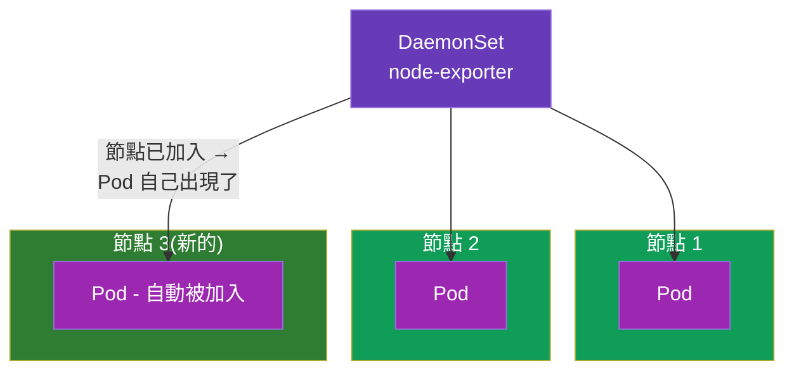
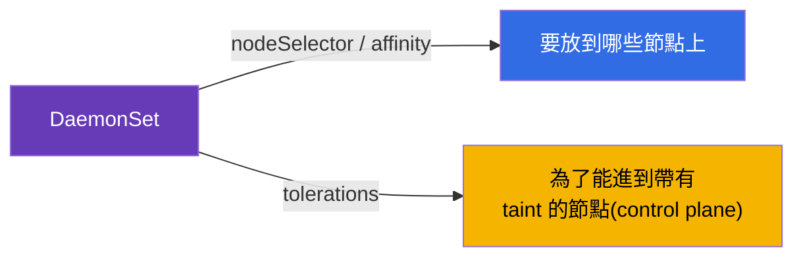
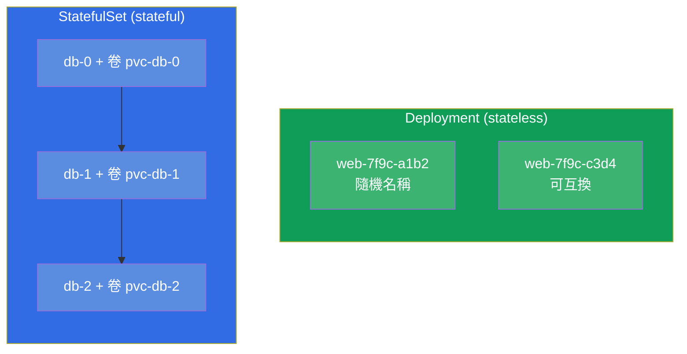
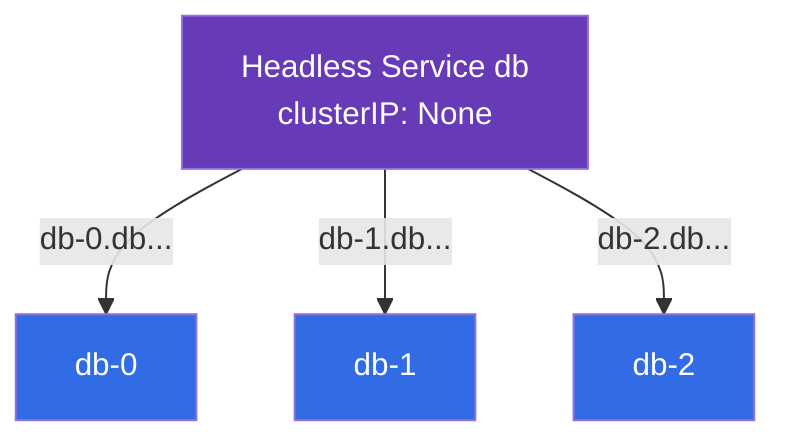
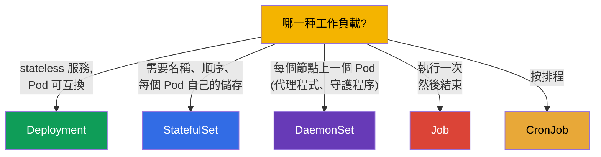

[Русская версия](ru.md) · [Eng version](README.md) · [Versión en español](es.md) · [Version française](fr.md) · [Deutsche Version](de.md) · [ქართული ვერსია](ge.md) · [日本語版](jp.md)

# 第 11 章。DaemonSet 與 StatefulSet

> **接下來是什麼。** 我們已經拆解了 Deployment(stateless 服務)與 Job/CronJob(任務)。
> 還剩下兩個專門的工作負載控制器:**DaemonSet**(「每個節點上一個 Pod」- 給
> 代理程式與守護程序用)與 **StatefulSet**(給有狀態的應用程式 - 資料庫,那裡
> 穩定的名稱與自己的儲存很重要)。理解哪個控制器對應哪一種任務,是 CKAD
> (Application Design)與 CKA(Workloads)的主題。StatefulSet 的儲存依賴 PV/PVC
> (第 25 章),因此這裡我們專注在控制器本身。

## 11.1. DaemonSet:每個節點上一個 Pod

**DaemonSet** 保證在 **每一個** 節點上(或每一個符合條件的節點上)剛好運行
一個 Pod 實例。加入了新節點 - DaemonSet 就會自動在它上面啟動 Pod。移除了
節點 - Pod 也跟著它一起離開。



DaemonSet 沒有 `replicas` 欄位 - Pod 的數量等於符合條件的節點數量,叢集自己
維持這個對應關係。

DaemonSet 的典型使用者 - 那些必須存在於每個節點上的系統元件:

- **網路:** kube-proxy、CNI 代理程式(Calico、Cilium);
- **日誌:** 像 Fluent Bit、Fluentd 這樣的收集器;
- **監控:** node-exporter、observability 代理程式;
- **儲存/安全:** CSI 代理程式、security 代理程式。

```yaml
apiVersion: apps/v1
kind: DaemonSet
metadata:
  name: node-exporter
spec:
  selector:
    matchLabels:
      app: node-exporter
  template:
    metadata:
      labels:
        app: node-exporter
    spec:
      containers:
      - name: node-exporter
        image: prom/node-exporter
```

## 11.2. DaemonSet 與節點的選擇

預設情況下 DaemonSet 會把 Pod 放到所有節點上。要限制節點的範圍,可以在 Pod
的範本中透過 `nodeSelector` 或 affinity(第 12 章)來做:

```yaml
    spec:
      nodeSelector:
        disktype: ssd        # 只放到帶有這個標籤的節點上
```

重要的細節:DaemonSet 通常也必須在 control plane 節點上運行,而那些節點被
taint 關起來了(第 2 章)。因此系統 DaemonSet 會加上 **tolerations**(第 13 章),
讓它們的 Pod 也能被放到那裡。沒有這個,監控代理程式就進不了 control plane。



DaemonSet 的更新方式跟 Deployment 一樣 - 透過 rolling update(`updateStrategy`)。

## 11.3. StatefulSet:有狀態的應用程式

**StatefulSet** 在 Pod **不可互換** 時才需要:每一個都有自己的身分、自己的
持久儲存,而且啟動順序很重要。經典案例就是資料庫與叢集式系統
(PostgreSQL、MySQL、MongoDB、Kafka、etcd、Elasticsearch),在那裡節點 `db-0`
跟 `db-1` 不是同一回事。

StatefulSet 在 Deployment 之上提供了什麼:

- **穩定的 Pod 名稱。** 不是隨機的雜湊,而是可預測的 `web-0`、`web-1`、
  `web-2`。名稱能在 Pod 被重建之後存活下來。
- **穩定的儲存。** 每個 Pod 都有自己的 PVC,在重建時仍然綁在它身上
  (Pod `web-0` 永遠拿到自己的卷)。
- **順序性。** Pod 依序被建立(0,然後 1,然後 2),並以相反的順序被刪除
  (2、1、0)。對於節點必須依序啟動的叢集來說,這很重要。



## 11.4. StatefulSet 的 manifest 與 volumeClaimTemplates

StatefulSet 的特徵就是 `volumeClaimTemplates`:一個範本,依照它為 **每一個**
Pod 建立屬於自己的 PVC(也就是自己的卷)。

```yaml
apiVersion: apps/v1
kind: StatefulSet
metadata:
  name: db
spec:
  serviceName: db            # headless 服務(見下文)
  replicas: 3
  selector:
    matchLabels:
      app: db
  template:
    metadata:
      labels:
        app: db
    spec:
      containers:
      - name: db
        image: postgres:16
        volumeMounts:
        - name: data
          mountPath: /var/lib/postgresql/data
  volumeClaimTemplates:      # 每個 Pod 都有自己的 PVC
  - metadata:
      name: data
    spec:
      accessModes: ["ReadWriteOnce"]
      resources:
        requests:
          storage: 10Gi
```

結果會出現 PVC `data-db-0`、`data-db-1`、`data-db-2` - 每個 Pod 一個。如果
Pod `db-1` 被重建,它會再次掛載正好是 `data-db-1`,而不是別人的卷。

## 11.5. StatefulSet 與 headless 服務

StatefulSet 通常會與 **headless 服務** 成對運作(`clusterIP: None`,第 7 章)。
普通的服務會給出一個共用 IP 並做負載平衡 - 但我們需要連到 **特定的** Pod
(例如資料庫的主節點 `db-0`)。headless 服務不做負載平衡,而是給每個 Pod
自己穩定的 DNS 名稱:

```
<pod>.<service>.<namespace>.svc.cluster.local
db-0.db.default.svc.cluster.local
db-1.db.default.svc.cluster.local
```



這樣客戶端就能有針對性地連到資料庫叢集中需要的那個節點 - 例如往主節點寫入、
從副本讀取。

## 11.6. 工作負載控制器的比較

我們把第 2 部分的所有控制器組合成一張選擇圖:



| 控制器 | Pod 的數量 | Pod 的身分 | 儲存 | 典型應用 |
|-----------|-------------|--------------------|-----------|--------------------|
| Deployment | `replicas` | 隨機名稱,可互換 | 共用/臨時 | 網頁、API、stateless |
| StatefulSet | `replicas` | 穩定(`-0`、`-1`) | 每個 Pod 自己的 | 資料庫、佇列、叢集 |
| DaemonSet | = 節點數量 | 依節點 | 通常是 hostPath/臨時 | 每個節點上的代理程式 |
| Job | `completions` | 不重要 | 臨時 | 一次性任務 |
| CronJob | 按排程 | 不重要 | 臨時 | 週期性任務 |

## 11.7. 這在生產環境中如何應用

- **DaemonSet 是基礎設施層。** 在任何生產環境中,日誌(Fluent Bit)、指標
  (node-exporter)、網路(CNI)與安全的代理程式都是透過 DaemonSet 在跑。這是
  一種不需要手動操作、就能保證「覆蓋」每個節點(包括新節點)的方式。
- **StatefulSet 用於狀態,但要小心。** Kubernetes 中的資料庫與叢集式系統會
  透過 StatefulSet 啟動,但許多團隊更偏好雲端的 **受管** 資料庫
  (RDS、Cloud SQL)- 把有狀態的東西留在叢集裡更困難(備份、容錯、升級)。
  當資料庫真的必須住在叢集裡時,才會選 StatefulSet。
- **volumeClaimTemplates 與資料。** 刪除 StatefulSet 時,它的卷預設 **不會被
  刪除** - 這是對資料的保護。清理它們必須是有意識的動作。在生產環境中會盯著
  這件事,以免遺失或「忘記」這些卷。
- **順序與更新。** StatefulSet 有順序的啟動/停止對於仲裁型系統
  (etcd、Kafka)很關鍵:更新一次只動一個 Pod,以免失去 quorum。這透過
  StatefulSet 的更新策略來設定。
- **DaemonSet 的 tolerations。** 為了讓代理程式也能進到 control plane,系統
  DaemonSet 會帶著很寬鬆的 tolerations - 否則「主節點」的監控/日誌就會是
  瞎的。

## 11.8. 迷你詞彙表

- **DaemonSet** - 在每一個(符合條件的)節點上維持一個 Pod 的控制器。
- **StatefulSet** - 給有狀態應用程式用的控制器:穩定的名稱、順序、每個 Pod
  自己的儲存。
- **volumeClaimTemplates** - StatefulSet 的範本,為每個 Pod 建立 PVC。
- **穩定的身分** - 可預測的 Pod 名稱(`db-0`、`db-1`),能在重建後存活
  下來。
- **headless 服務** - `clusterIP: None`;給每個 Pod 自己的 DNS 名稱,不做負載平衡。
- **updateStrategy** - DaemonSet/StatefulSet 的更新策略(rolling)。

## 11.9. 本章總結

- DaemonSet 在每一個符合條件的節點上維持一個 Pod;沒有 `replicas`,Pod 的
  數量 = 節點數量。用於日誌、指標、網路、安全的代理程式。
- DaemonSet 透過 nodeSelector/affinity 限制節點,並且通常帶著 tolerations,
  以便也能進到 control plane。
- StatefulSet 用於有狀態的應用程式:穩定的名稱(`-0`、`-1`)、有順序的
  啟動/停止、每個 Pod 自己的持久儲存。
- `volumeClaimTemplates` 為每個 Pod 建立一個 PVC;被重建的 Pod 會把自己的卷
  拿回來。
- StatefulSet 與 headless 服務一起運作,後者給 Pod 具位址性的 DNS 名稱。
- 控制器的選擇:Deployment(stateless)、StatefulSet(狀態)、DaemonSet(依節點)、
  Job/CronJob(任務)。

## 11.10. 這些知識用在哪裡:考試與實際工作

**在考試中。** 「為這個任務選出正確的控制器」是 CKAD 的典型問題;
「建立一個 DaemonSet」、「部署一個帶卷的 StatefulSet」是 Workloads 的題目。需要
理解為什麼資料庫是 StatefulSet,而每個節點上的代理程式是 DaemonSet,並且知道
volumeClaimTemplates 與 headless 服務。

**在實際工作中。** DaemonSet 是叢集基礎設施層的基石(日誌、指標、網路)。
StatefulSet 決定了資料庫與叢集式系統在叢集中如何生存,而它的細節(卷的保留、
更新的順序)直接影響資料的安全與可用性。會選擇控制器,是最基本的設計決策。

## 11.11. 自我檢查問題

1. DaemonSet 與 Deployment 有什麼不同,為什麼它沒有 `replicas`?
2. 系統 DaemonSet 為什麼需要 tolerations?
3. StatefulSet 在 Deployment 之上提供了什麼(三個關鍵特性)?
4. 什麼是 `volumeClaimTemplates`,重建時 Pod 與它的 PVC 是如何關聯的?
5. StatefulSet 為什麼需要 headless 服務,它在 DNS 上提供了什麼?
6. 為什麼 StatefulSet 的卷不會被自動刪除,這樣有什麼好處?
7. 請為每一種情況選出控制器:網頁 API、PostgreSQL、每個節點上的指標代理程式、
   夜間備份。

## 實踐

我們把工作負載控制器收尾了。接下來(第 12 章)會進入排程 - Kubernetes 與你
如何決定 Pod 會落到哪一個節點上。帶儲存的 StatefulSet 會在第 26 章(儲存)
回來,而 DaemonSet 則在工作負載相關的實驗中出現。

🧪 實驗 103(DaemonSet;StatefulSet 在實驗 108):[tasks/cka/labs/103](../../labs/103/README_TW.MD)

---
[目錄](../README_TW.md) · [第 10 章](../10/tw.md) · [第 12 章](../12/tw.md)
