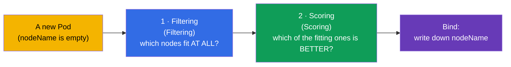
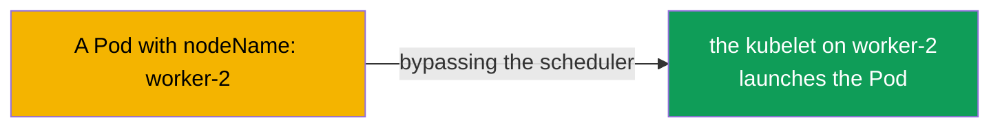
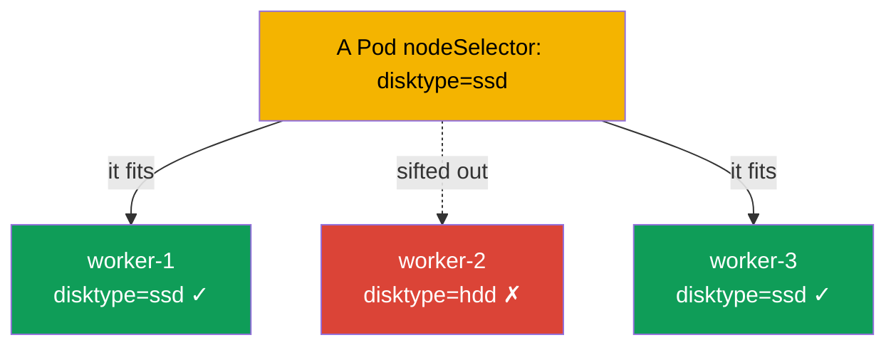
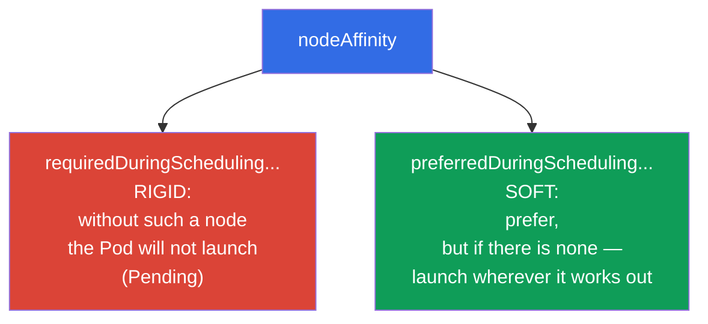
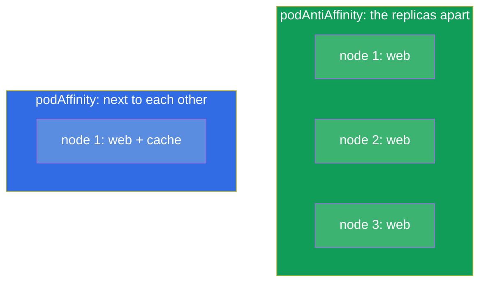
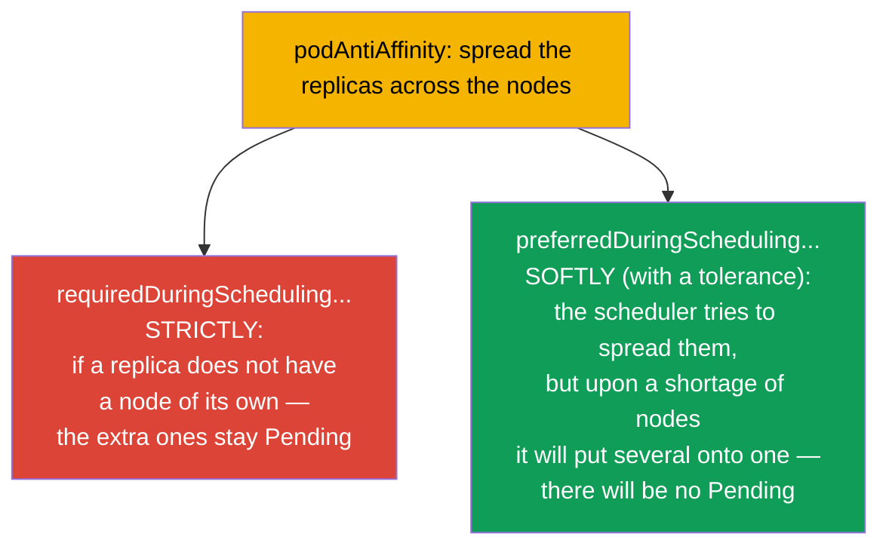
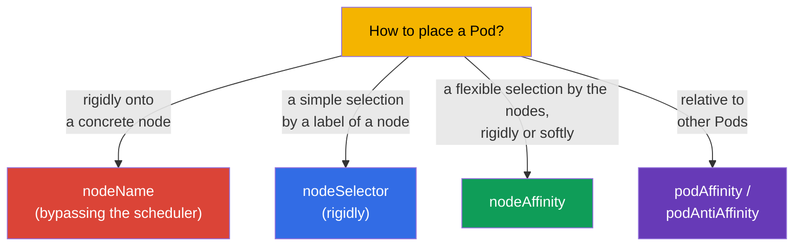
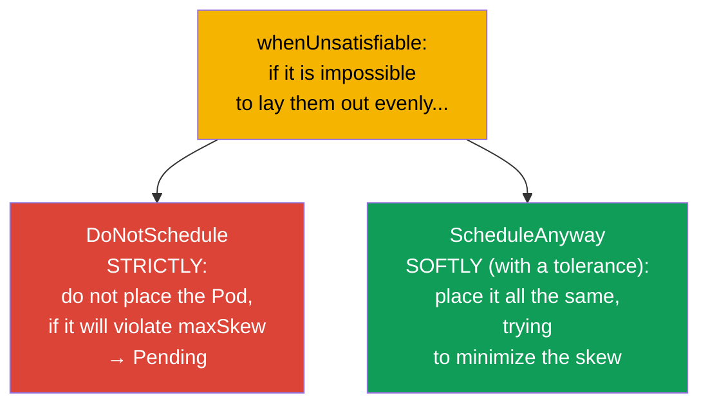

[Русская версия](ru.md) · [Versión en español](es.md) · [Version française](fr.md) · [Deutsche Version](de.md) · [ქართული ვერსია](ge.md) · [繁體中文版](tw.md) · [日本語版](jp.md)

# Chapter 12. The scheduling of the Pods: nodeName, nodeSelector, affinity

> **What comes next.** Up until now we have not thought about which node a Pod will land on - that
> was decided by the scheduler (chapter 2). Now we will learn to influence its decision. There are
> simple ways (`nodeName`, `nodeSelector`) and flexible ones (`nodeAffinity`, `podAffinity`,
> `podAntiAffinity`). This is the domain Workloads & Scheduling of both exams. The control of the
> placement of the Pods is what is needed both on the exam ("place a Pod on the node with the label
> X") and in production (spread the replicas across the zones, put a workload onto the GPU nodes).

## 12.1. How the scheduler chooses a node

Let us recall from chapter 2: when you create a Pod, at first it has an empty `nodeName`.
**kube-scheduler** finds such Pods and chooses a node for them in two stages.



- **Filtering** sifts out the nodes that do not fit in principle: there are not enough resources,
  they do not pass by the taints, nodeSelector, affinity.
- **Scoring** ranks the remaining nodes by "convenience" (the balance of the load, the proximity
  etc.) and chooses the best one.

We can interfere in both stages: rigidly limit the set of the nodes or softly "ask for" a
preference. Let us go over the tools from the simple to the flexible.

## 12.2. nodeName: a direct assignment (bypassing the scheduler)

The crudest way is to write the node right into the Pod. Then the scheduler does not participate at all:
the kubelet of the specified node simply takes the Pod.

```yaml
spec:
  nodeName: worker-2       # the Pod will go strictly onto this node
```



The downsides are obvious: if such a node does not exist or there are no resources on it, the Pod
will simply hang - nobody will pick an alternative. `nodeName` is used rarely (debugging, the static
Pods - chapter 15), but one has to know it: it explains how the static Pods of the control plane work.

## 12.3. nodeSelector: a simple selection by the labels of a node

A more practical way is `nodeSelector`. The Pod will go only onto the nodes that have
**all** the specified labels. This is the simplest and the most frequent mechanism on the exam.

At first we label the nodes (the labels of the nodes are like the labels of any objects, chapter 6):

```bash
kubectl label node worker-1 disktype=ssd
kubectl get nodes --show-labels
```

Then in the Pod:

```yaml
spec:
  nodeSelector:
    disktype: ssd          # only onto the nodes with the label disktype=ssd
```



`nodeSelector` is a rigid condition: there is no node with the needed label - the Pod hangs in
`Pending`. It is simple, but not flexible: it is impossible to express "either/or", "preferably",
"except". For that there is affinity.

## 12.4. nodeAffinity: a flexible selection by the nodes

**nodeAffinity** is an advanced version of nodeSelector. It gives two important improvements: the
expressions (In, NotIn, Exists) and, most importantly, **two levels of rigidity**.



- **`requiredDuringSchedulingIgnoredDuringExecution`** - a rigid rule (like
  nodeSelector, but with expressions). There is no fitting node - the Pod is in Pending.
- **`preferredDuringSchedulingIgnoredDuringExecution`** - a soft preference with a weight.
  The scheduler will try, but in the absence of a fitting node it will launch the Pod all the same.

```yaml
spec:
  affinity:
    nodeAffinity:
      requiredDuringSchedulingIgnoredDuringExecution:
        nodeSelectorTerms:
        - matchExpressions:
          - key: disktype
            operator: In
            values: [ssd, nvme]        # ssd OR nvme
      preferredDuringSchedulingIgnoredDuringExecution:
      - weight: 50
        preference:
          matchExpressions:
          - key: zone
            operator: In
            values: [eu-central-1a]    # desirably in this zone
```

The part `IgnoredDuringExecution` means: the rule is checked only during the **scheduling**.
If the labels of the node change later, an already launched Pod will not be evicted.

## 12.5. podAffinity and podAntiAffinity: the placement relative to other Pods

Sometimes what matters is not "which node", but "next to which Pods". For that there are:

- **podAffinity** - place the Pod **next to** the Pods that have certain labels
  (for example, an application closer to its cache for a low latency).
- **podAntiAffinity** - place the Pod **farther away** from the Pods with certain labels
  (for example, the replicas of one application - onto different nodes, so that the fall of a node
  does not kill them all at once).



The key notion here is the **topologyKey**: by which trait to count "next to" or
"far away". Usually this is a label of a node: `kubernetes.io/hostname` (within a node),
`topology.kubernetes.io/zone` (within a zone).

```yaml
spec:
  affinity:
    podAntiAffinity:
      requiredDuringSchedulingIgnoredDuringExecution:
      - labelSelector:
          matchLabels:
            app: web
        topologyKey: kubernetes.io/hostname   # not more than one web per node
```

This example guarantees that two Pods `app=web` will not end up on one node - a classic
technique of fault tolerance.

### A strict and a soft rule (required versus preferred)

As with nodeAffinity, podAffinity/podAntiAffinity have **two levels of rigidity**, and the difference
is fundamental for the fault tolerance.



- **Strictly** (`requiredDuringSchedulingIgnoredDuringExecution`): the rule is obligatory.
  There are more replicas than fitting nodes - the extra Pods will hang in `Pending`. It guarantees
  the spread, but risks an under-deployment.
- **Softly** (`preferredDuringSchedulingIgnoredDuringExecution` with the weight `weight`):
  the scheduler *tries* to spread them, but if there are not enough nodes - it will place the Pods
  all the same (even if several per node). All the replicas will come up, but without a guarantee of
  the spread.

> **A caveat about production and the autoscaler of the nodes.** In the cloud clusters the Pods in
> `Pending` usually do not "hang" for long: they are watched over by an autoscaler of the nodes
> (Cluster Autoscaler, Karpenter and the like) - having seen an unplaced Pod, it adds a new node to
> the cluster. With `required` this is convenient (the rigid spread is brought to the end by the
> raising of the nodes), but it demands carefulness: with unlucky parameters (too strict rules of
> antiAffinity, a large `topologyKey`, inflated requests) the autoscaler will keep raising ever new
> nodes for every Pod, and the cluster will grow out of under-loaded nodes - this directly increases
> the cost. Therefore `required` and the settings of the autoscaler are coordinated with each other,
> and for the less critical workloads `preferred` is preferred.

```yaml
spec:
  affinity:
    podAntiAffinity:
      preferredDuringSchedulingIgnoredDuringExecution:   # softly, "with a tolerance"
      - weight: 100
        podAffinityTerm:
          labelSelector:
            matchLabels:
              app: web
          topologyKey: kubernetes.io/hostname
```

A practical rule: for the critical services, where the spread is obligatory, they take `required`;
if it is more important that all the replicas launch even upon a shortage of nodes - `preferred`.

## 12.6. A comparison of the mechanisms of the placement



| The mechanism | The flexibility | The rigidity | The scheduler participates |
|----------|----------|-----------|----------------------|
| `nodeName` | no | absolute | no |
| `nodeSelector` | low (only AND by the labels) | only rigidly | yes |
| `nodeAffinity` | high (the expressions) | rigidly or softly | yes |
| `podAffinity/AntiAffinity` | high (relative to the Pods) | rigidly or softly | yes |

There are also **taints/tolerations** - but that is a "mirror" mechanism (the node repels the Pods,
and not the Pod chooses the node), a separate chapter 13 is devoted to it. And **topologySpreadConstraints** -
an even distribution across the zones/nodes (we will mention it below).

## 12.7. An even distribution: topologySpreadConstraints

A separate mechanism, more convenient for the "evenness", is `topologySpreadConstraints`. It
allows to say "scatter the replicas as evenly as possible across the zones/nodes", having set the
permissible skew (`maxSkew`):

```yaml
spec:
  topologySpreadConstraints:
  - maxSkew: 1
    topologyKey: topology.kubernetes.io/zone
    whenUnsatisfiable: DoNotSchedule
    labelSelector:
      matchLabels:
        app: web
```

- **`maxSkew`** - the maximally permissible difference of the number of the Pods between the
  topologies (the zones/the nodes). `maxSkew: 1` - scatter as evenly as possible.
- **`topologyKey`** - by what to distribute (the zone `topology.kubernetes.io/zone`, the node
  `kubernetes.io/hostname`).

### A strict and a soft distribution (whenUnsatisfiable)

As with affinity, topologySpread has a strict and a soft mode - it is set by the field
`whenUnsatisfiable`:



| `whenUnsatisfiable` | The behaviour | The analogue |
|---------------------|-----------|--------|
| `DoNotSchedule` | strictly: the violating Pod stays Pending | `required` of affinity |
| `ScheduleAnyway` | softly: the Pod will be placed all the same, the skew is minimized | `preferred` of affinity |

The same compromise as in affinity: `DoNotSchedule` guarantees an even distribution, but
may leave the Pods in `Pending` upon a shortage of zones/nodes; `ScheduleAnyway` guarantees that
all the Pods will launch, but permits a skew.

topologySpreadConstraints is a modern and often preferable way to achieve a
fault-tolerant distribution of the replicas across the zones/nodes - cleaner than to pile up podAntiAffinity.

## 12.8. How this is applied in production

- **The spread of the replicas for the fault tolerance.** The main application is to scatter the
  replicas across different nodes and availability zones, so that the fall of a node/a zone does not
  kill the whole service. In production this is done through `podAntiAffinity` or (more often)
  `topologySpreadConstraints`.
- **The binding of a workload to a type of nodes.** The GPU tasks - onto the GPU nodes, the
  memory-heavy ones - onto the nodes with a lot of RAM, ingress - onto dedicated nodes. They are
  implemented through nodeSelector/nodeAffinity by the labels of the nodes (they are often set by the
  cloud automatically: the type of the instance, the zone, the architecture).
- **A joint placement for the latency.** podAffinity puts an application next to its
  cache/local dependency, lowering the network delays - but it is applied carefully, so as
  not to lose the fault tolerance.
- **nodeName is almost never used.** In production a direct assignment is an antipattern (the
  fault tolerance and the balancing are lost). The exception is the static Pods of the control plane
  (chapter 15).
- **The soft rules are preferable.** An abuse of the rigid (`required`) rules
  often leads to `Pending`, when there are no fitting nodes left. The experienced teams by
  possibility use `preferred`/`topologySpread`, so that the Pod launches somewhere all the same.

## 12.9. A mini-glossary

- **kube-scheduler** - the component that chooses a node for a Pod (filtering + scoring).
- **nodeName** - a rigid assignment of a node bypassing the scheduler.
- **nodeSelector** - a simple rigid selection of a node by its labels.
- **nodeAffinity** - a flexible selection of the nodes; `required` (rigidly) and `preferred` (softly).
- **podAffinity** - to place a Pod next to the Pods by the labels.
- **podAntiAffinity** - to place a Pod farther away from the Pods by the labels.
- **topologyKey** - a label of a node that determines the "zone of the neighbourhood" (hostname, zone).
- **topologySpreadConstraints** - an even distribution of the Pods across the topology
  (`maxSkew`).
- **whenUnsatisfiable** - the mode of topologySpread: `DoNotSchedule` (strictly, → Pending) or
  `ScheduleAnyway` (softly, with a tolerance of the skew).
- **required vs preferred** - a strict (obligatory) versus a soft (by possibility)
  rule of the placement of affinity.
- **IgnoredDuringExecution** - the rule is checked during the scheduling, but it does not evict an
  already launched Pod.

## 12.10. The chapter's takeaways

- The scheduler chooses a node in two stages: filtering (who fits) and scoring (who is better).
- `nodeName` is a rigid direct assignment bypassing the scheduler; it is fragile, it is used rarely.
- `nodeSelector` is a simple rigid selection by the labels of a node; there is no fitting node - Pending.
- `nodeAffinity` is a flexible selection with expressions and two levels: `required` (rigidly) and
  `preferred` (softly).
- `podAffinity`/`podAntiAffinity` place a Pod relative to other Pods; the key is
  `topologyKey` (hostname, zone).
- `topologySpreadConstraints` is a convenient way to distribute the replicas evenly across the
  zones/nodes (`maxSkew`).
- A strict vs a soft distribution: `required`/`DoNotSchedule` (a guarantee of the spread, but a risk
  of Pending) versus `preferred`/`ScheduleAnyway` (all the Pods will launch, but a skew is possible).
- In production the main application is the fault tolerance (the spread of the replicas) and the
  binding of the workloads to the types of nodes; to abuse the rigid rules is dangerous (Pending).

## 12.11. How this will come in handy: on the exam and in real work

**On the exam.** "Place a Pod on the node with the label X" (nodeSelector), "configure nodeAffinity /
podAntiAffinity" are the typical tasks of Workloads & Scheduling. One needs to be able to label the nodes
(`kubectl label node`), to write a nodeSelector and the structure of affinity, to distinguish required and
preferred. The diagnostics of "why is the Pod in Pending" often comes down exactly to the rigid rules
of the placement.

**In real work.** The correct placement of the Pods is the foundation of the fault tolerance
(the replicas across the zones) and of the efficiency (a workload onto the fitting nodes). podAntiAffinity/
topologySpread protect a service from the fall of a node or of a whole zone, and nodeAffinity puts the
tasks onto the needed hardware (GPU, memory). These are the everyday architectural decisions during the
design of the workloads.

## 12.12. Self-check questions

1. Of which two stages does the choice of a node by the scheduler consist?
2. In what way does `nodeName` differ from `nodeSelector` and why is `nodeName` fragile?
3. Which two levels of rigidity does nodeAffinity give and in what way do they differ in practice?
4. What is the difference between podAffinity and podAntiAffinity? Give an example of the application
   of each one.
5. What is a `topologyKey` and how does one "spread" the replicas across the nodes with its help?
6. In what way is `topologySpreadConstraints` more convenient than podAntiAffinity for an even distribution?
7. Why does an abuse of the rigid rules lead to Pods in Pending?

## Practice

We have learned to attract the Pods to the nodes. In chapter 13 we will go over the reverse mechanism - taints and
tolerations, with which the nodes **repel** the Pods. The scheduling is drilled in the labs on
workloads.

🧪 Lab 122 (scheduling drills: nodeSelector, affinity, taints): [tasks/cka/labs/122](../../labs/122/README.MD)

---
[Contents](../README.md) · [Chapter 11](../11/README.md) · [Chapter 13](../13/README.md)
