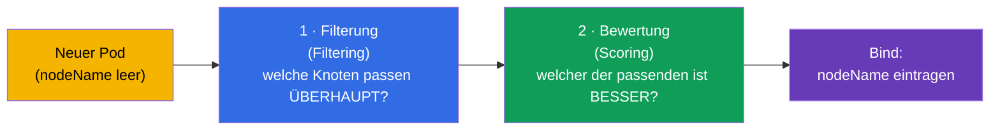
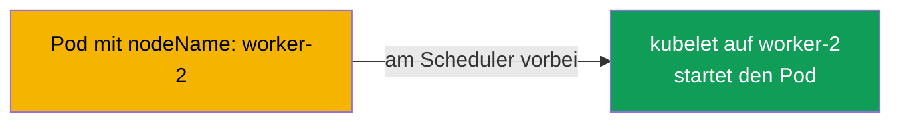
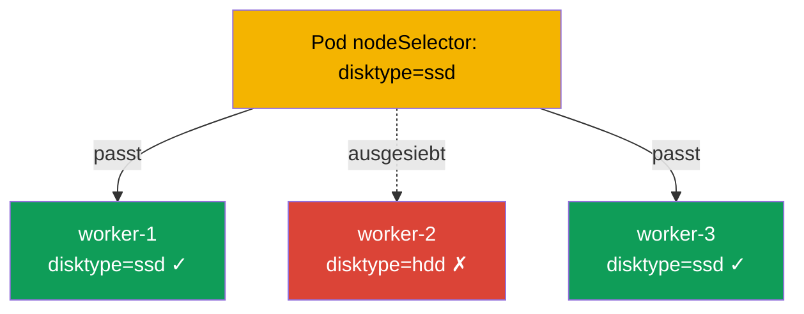
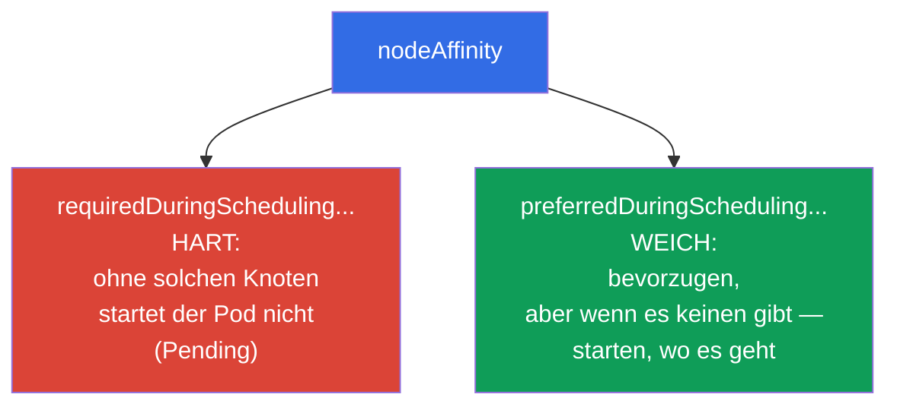
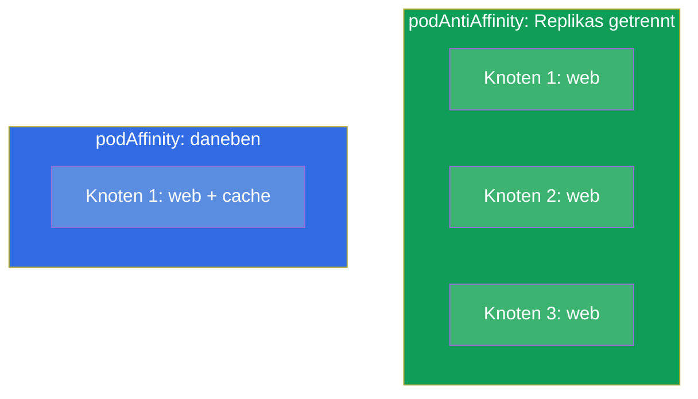
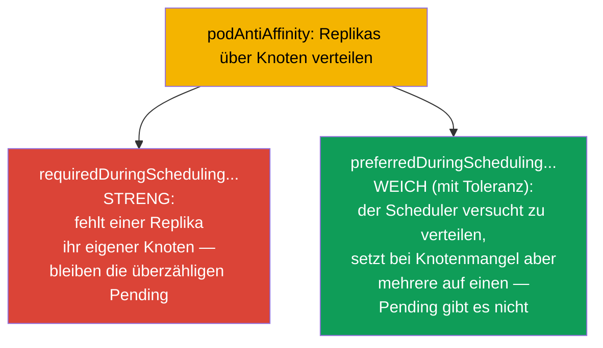
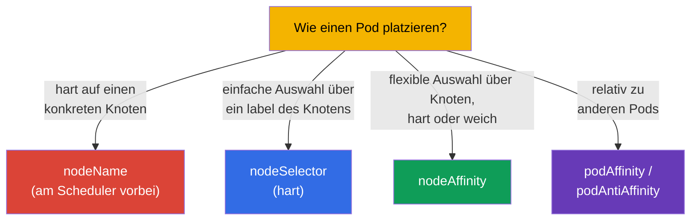
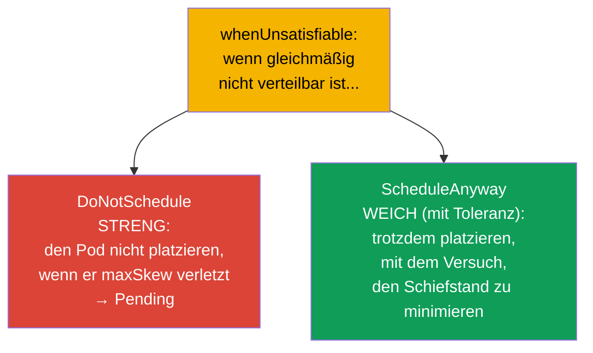

[Русская версия](ru.md) · [Eng version](README.md) · [Versión en español](es.md) · [Version française](fr.md) · [ქართული ვერსია](ge.md) · [繁體中文版](tw.md) · [日本語版](jp.md)

# Kapitel 12. Planung von Pods: nodeName, nodeSelector, affinity

> **Was kommt.** Bisher haben wir uns nicht darum gekümmert, auf welchen Knoten ein Pod
> gelangt - das entschied der Scheduler (Kapitel 2). Jetzt lernen wir, seine Entscheidung zu
> beeinflussen. Es gibt einfache Wege (`nodeName`, `nodeSelector`) und flexible
> (`nodeAffinity`, `podAffinity`, `podAntiAffinity`). Das ist die Domain Workloads &
> Scheduling beider Prüfungen. Die Steuerung der Platzierung von Pods braucht man sowohl in
> der Prüfung („platziere einen Pod auf dem Knoten mit dem label X“) als auch in der
> Produktion (Replikas über Zonen verteilen, Last auf GPU-Knoten setzen).

## 12.1. Wie der Scheduler einen Knoten wählt

Erinnern wir uns an Kapitel 2: wenn Sie einen Pod erstellen, hat er zunächst ein leeres
`nodeName`. **kube-scheduler** findet solche Pods und wählt für sie einen Knoten in zwei
Etappen.



- **Die Filterung** siebt die Knoten aus, die grundsätzlich nicht passen: die Ressourcen
  reichen nicht, sie kommen nicht durch taints, nodeSelector, affinity.
- **Die Bewertung** ordnet die verbliebenen Knoten nach „Bequemlichkeit“ (Lastausgleich,
  Nähe usw.) und wählt den besten.

Wir können in beide Etappen eingreifen: die Menge der Knoten hart einschränken oder sanft
eine Präferenz „erbitten“. Gehen wir die Werkzeuge vom Einfachen zum Flexiblen durch.

## 12.2. nodeName: direkte Zuweisung (am Scheduler vorbei)

Der gröbste Weg ist, den Knoten direkt im Pod einzutragen. Dann ist der Scheduler gar nicht
beteiligt: das kubelet des angegebenen Knotens nimmt den Pod einfach entgegen.

```yaml
spec:
  nodeName: worker-2       # der Pod geht strikt auf diesen Knoten
```



Die Nachteile sind offensichtlich: gibt es diesen Knoten nicht oder hat er keine Ressourcen,
bleibt der Pod einfach hängen - niemand sucht eine Alternative. `nodeName` wird selten
genutzt (Debugging, statische Pods - Kapitel 15), aber man muss es kennen: es erklärt, wie
die statischen Pods der Control Plane funktionieren.

## 12.3. nodeSelector: einfache Auswahl über labels des Knotens

Der praktischere Weg ist `nodeSelector`. Der Pod geht nur auf Knoten, die **alle**
angegebenen labels haben. Das ist der einfachste und häufigste Mechanismus in der Prüfung.

Zuerst markieren wir die Knoten (labels von Knoten sind wie labels beliebiger Objekte,
Kapitel 6):

```bash
kubectl label node worker-1 disktype=ssd
kubectl get nodes --show-labels
```

Dann im Pod:

```yaml
spec:
  nodeSelector:
    disktype: ssd          # nur auf Knoten mit dem label disktype=ssd
```



`nodeSelector` ist eine harte Bedingung: gibt es keinen Knoten mit dem nötigen label, hängt
der Pod in `Pending`. Er ist einfach, aber nicht flexibel: man kann kein „entweder/oder“,
„vorzugsweise“, „außer“ ausdrücken. Dafür gibt es affinity.

## 12.4. nodeAffinity: flexible Auswahl über Knoten

**nodeAffinity** ist die fortgeschrittene Version von nodeSelector. Sie bringt zwei wichtige
Verbesserungen: Ausdrücke (In, NotIn, Exists) und - vor allem - **zwei Stufen der Härte**.



- **`requiredDuringSchedulingIgnoredDuringExecution`** - harte Regel (wie nodeSelector, aber
  mit Ausdrücken). Gibt es keinen passenden Knoten - der Pod bleibt in Pending.
- **`preferredDuringSchedulingIgnoredDuringExecution`** - weiche Präferenz mit Gewicht. Der
  Scheduler bemüht sich, startet den Pod aber auch dann, wenn es keinen passenden Knoten gibt.

```yaml
spec:
  affinity:
    nodeAffinity:
      requiredDuringSchedulingIgnoredDuringExecution:
        nodeSelectorTerms:
        - matchExpressions:
          - key: disktype
            operator: In
            values: [ssd, nvme]        # ssd ODER nvme
      preferredDuringSchedulingIgnoredDuringExecution:
      - weight: 50
        preference:
          matchExpressions:
          - key: zone
            operator: In
            values: [eu-central-1a]    # wünschenswert in dieser Zone
```

Der Teil `IgnoredDuringExecution` bedeutet: die Regel wird nur bei der **Planung** geprüft.
Ändern sich die labels des Knotens später, wird ein schon laufender Pod nicht vertrieben.

## 12.5. podAffinity und podAntiAffinity: Platzierung relativ zu anderen Pods

Manchmal ist nicht wichtig, „welcher Knoten“, sondern „neben welchen Pods“. Dafür gibt es:

- **podAffinity** - den Pod **neben** Pods platzieren, die bestimmte labels haben (zum
  Beispiel eine Anwendung näher an ihrem Cache für niedrige Latenz).
- **podAntiAffinity** - den Pod **weiter weg** von Pods mit bestimmten labels platzieren (zum
  Beispiel die Replikas einer Anwendung auf verschiedene Knoten, damit der Ausfall eines
  Knotens nicht alle auf einmal tötet).



Der zentrale Begriff hier ist **topologyKey**: nach welchem Merkmal „daneben“ oder „weit weg“
gezählt wird. Üblicherweise ist das ein label des Knotens: `kubernetes.io/hostname`
(innerhalb eines Knotens), `topology.kubernetes.io/zone` (innerhalb einer Zone).

```yaml
spec:
  affinity:
    podAntiAffinity:
      requiredDuringSchedulingIgnoredDuringExecution:
      - labelSelector:
          matchLabels:
            app: web
        topologyKey: kubernetes.io/hostname   # nicht mehr als ein web pro Knoten
```

Dieses Beispiel garantiert, dass zwei Pods `app=web` nicht auf demselben Knoten landen - ein
klassischer Trick für Ausfallsicherheit.

### Strenge und weiche Regel (required gegen preferred)

Wie bei nodeAffinity haben podAffinity/podAntiAffinity **zwei Stufen der Härte**, und der
Unterschied ist für die Ausfallsicherheit grundlegend.



- **Streng** (`requiredDuringSchedulingIgnoredDuringExecution`): die Regel ist verpflichtend.
  Gibt es mehr Replikas als passende Knoten, hängen die überzähligen Pods in `Pending`. Das
  garantiert die Verteilung, riskiert aber ein unvollständiges Deployment.
- **Weich** (`preferredDuringSchedulingIgnoredDuringExecution` mit dem Gewicht `weight`): der
  Scheduler *versucht* zu verteilen, platziert die Pods bei Knotenmangel aber trotzdem (auch
  mehrere pro Knoten). Alle Replikas kommen hoch, aber ohne Garantie der Verteilung.

> **Anmerkung zur Produktion und zum Node-Autoscaler.** In Cloud-Clustern „hängen“ Pods in
> `Pending` üblicherweise nicht lange: über sie wacht ein Node-Autoscaler (Cluster
> Autoscaler, Karpenter und ähnliche) - sieht er einen nicht platzierten Pod, fügt er dem
> Cluster einen neuen Knoten hinzu. Mit `required` ist das bequem (die harte Verteilung wird
> durch das Hochfahren von Knoten zu Ende gebracht), erfordert aber Sorgfalt: bei unglücklichen
> Parametern (zu strenge antiAffinity-Regeln, ein grober `topologyKey`, zu hohe requests)
> wird der Autoscaler für jeden Pod immer neue Knoten hochfahren, und der Cluster wächst aus
> unterausgelasteten Knoten - das erhöht direkt die Kosten. Deshalb stimmt man `required` und
> die Einstellungen des Autoscalers aufeinander ab, und für weniger kritische Lasten
> bevorzugt man `preferred`.

```yaml
spec:
  affinity:
    podAntiAffinity:
      preferredDuringSchedulingIgnoredDuringExecution:   # weich, „mit Toleranz“
      - weight: 100
        podAffinityTerm:
          labelSelector:
            matchLabels:
              app: web
          topologyKey: kubernetes.io/hostname
```

Praktische Regel: für kritische Services, bei denen die Verteilung verpflichtend ist, nimmt
man `required`; ist wichtiger, dass alle Replikas auch bei Knotenmangel starten - `preferred`.

## 12.6. Vergleich der Mechanismen der Platzierung



| Mechanismus | Flexibilität | Härte | Scheduler beteiligt |
|----------|----------|-----------|----------------------|
| `nodeName` | keine | absolut | nein |
| `nodeSelector` | niedrig (nur AND über labels) | nur hart | ja |
| `nodeAffinity` | hoch (Ausdrücke) | hart oder weich | ja |
| `podAffinity/AntiAffinity` | hoch (relativ zu Pods) | hart oder weich | ja |

Es gibt außerdem **taints/tolerations** - aber das ist der „gespiegelte“ Mechanismus (der
Knoten stößt Pods ab, nicht der Pod wählt den Knoten), ihm ist das eigene Kapitel 13 gewidmet.
Und **topologySpreadConstraints** - die gleichmäßige Verteilung über Zonen/Knoten (erwähnen
wir unten).

## 12.7. Gleichmäßige Verteilung: topologySpreadConstraints

Ein eigener, für „Gleichmäßigkeit“ bequemerer Mechanismus ist `topologySpreadConstraints`. Er
erlaubt zu sagen „verteile die Replikas maximal gleichmäßig über Zonen/Knoten“, indem man den
zulässigen Schiefstand (`maxSkew`) angibt:

```yaml
spec:
  topologySpreadConstraints:
  - maxSkew: 1
    topologyKey: topology.kubernetes.io/zone
    whenUnsatisfiable: DoNotSchedule
    labelSelector:
      matchLabels:
        app: web
```

- **`maxSkew`** - die maximal zulässige Differenz der Zahl der Pods zwischen den Topologien
  (Zonen/Knoten). `maxSkew: 1` - maximal gleichmäßig verteilen.
- **`topologyKey`** - wonach verteilt wird (Zone `topology.kubernetes.io/zone`, Knoten
  `kubernetes.io/hostname`).

### Strenge und weiche Verteilung (whenUnsatisfiable)

Wie bei affinity hat topologySpread einen strengen und einen weichen Modus - er wird über das
Feld `whenUnsatisfiable` gesetzt:



| `whenUnsatisfiable` | Verhalten | Analogon |
|---------------------|-----------|--------|
| `DoNotSchedule` | streng: der verletzende Pod bleibt Pending | `required` bei affinity |
| `ScheduleAnyway` | weich: der Pod wird trotzdem platziert, der Schiefstand minimiert | `preferred` bei affinity |

Derselbe Kompromiss wie bei affinity: `DoNotSchedule` garantiert die gleichmäßige Verteilung,
kann aber bei Mangel an Zonen/Knoten Pods in `Pending` lassen; `ScheduleAnyway` garantiert,
dass alle Pods starten, lässt aber Schiefstand zu.

topologySpreadConstraints ist der moderne und häufig vorzuziehende Weg, eine ausfallsichere
Verteilung der Replikas über Zonen/Knoten zu erreichen - sauberer, als podAntiAffinity
zusammenzubasteln.

## 12.8. Wie man das in der Produktion anwendet

- **Verteilung der Replikas für Ausfallsicherheit.** Die Hauptanwendung - die Replikas über
  verschiedene Knoten und Verfügbarkeitszonen streuen, damit der Ausfall eines Knotens/einer
  Zone nicht den ganzen Service tötet. In der Produktion macht man das über `podAntiAffinity`
  oder (häufiger) `topologySpreadConstraints`.
- **Bindung der Last an einen Knotentyp.** GPU-Aufgaben - auf GPU-Knoten,
  speicherintensive - auf Knoten mit viel RAM, ingress - auf dedizierte Knoten. Umgesetzt über
  nodeSelector/nodeAffinity anhand der labels der Knoten (die setzt oft die Cloud automatisch:
  Instanztyp, Zone, Architektur).
- **Gemeinsame Platzierung für Latenz.** podAffinity setzt eine Anwendung neben ihren
  Cache/ihre lokale Abhängigkeit und senkt so die Netzwerklatenzen - man wendet das aber
  sorgfältig an, um die Ausfallsicherheit nicht zu verlieren.
- **nodeName nutzt man fast nicht.** In der Produktion ist die direkte Zuweisung ein
  Antipattern (Ausfallsicherheit und Balancierung gehen verloren). Die Ausnahme sind die
  statischen Pods der Control Plane (Kapitel 15).
- **Weiche Regeln sind vorzuziehen.** Der Missbrauch harter (`required`) Regeln führt oft zu
  `Pending`, wenn keine passenden Knoten übrig sind. Erfahrene Teams nutzen nach Möglichkeit
  `preferred`/`topologySpread`, damit der Pod doch irgendwo startet.

## 12.9. Mini-Glossar

- **kube-scheduler** - Komponente, die einen Knoten für den Pod wählt (Filterung + Bewertung).
- **nodeName** - harte Zuweisung eines Knotens am Scheduler vorbei.
- **nodeSelector** - einfache harte Auswahl eines Knotens über seine labels.
- **nodeAffinity** - flexible Auswahl von Knoten; `required` (hart) und `preferred` (weich).
- **podAffinity** - den Pod neben Pods nach labels platzieren.
- **podAntiAffinity** - den Pod weiter weg von Pods nach labels platzieren.
- **topologyKey** - label des Knotens, das die „Nachbarschaftszone“ bestimmt (hostname, zone).
- **topologySpreadConstraints** - gleichmäßige Verteilung der Pods über die Topologie
  (`maxSkew`).
- **whenUnsatisfiable** - Modus von topologySpread: `DoNotSchedule` (streng, → Pending) oder
  `ScheduleAnyway` (weich, mit Toleranz für Schiefstand).
- **required vs preferred** - strenge (verpflichtende) gegen weiche (nach Möglichkeit) Regel
  der Platzierung bei affinity.
- **IgnoredDuringExecution** - die Regel wird bei der Planung geprüft, vertreibt aber keinen
  schon laufenden Pod.

## 12.10. Zusammenfassung des Kapitels

- Der Scheduler wählt einen Knoten in zwei Etappen: Filterung (wer passt) und Bewertung (wer
  ist besser).
- `nodeName` - harte direkte Zuweisung am Scheduler vorbei; fragil, wird selten angewendet.
- `nodeSelector` - einfache harte Auswahl über labels des Knotens; gibt es keinen passenden
  Knoten - Pending.
- `nodeAffinity` - flexible Auswahl mit Ausdrücken und zwei Stufen: `required` (hart) und
  `preferred` (weich).
- `podAffinity`/`podAntiAffinity` platzieren den Pod relativ zu anderen Pods; der Schlüssel ist
  `topologyKey` (hostname, zone).
- `topologySpreadConstraints` - bequemer Weg, die Replikas gleichmäßig über Zonen/Knoten zu
  verteilen (`maxSkew`).
- Strenge vs weiche Verteilung: `required`/`DoNotSchedule` (Garantie der Verteilung, aber
  Risiko von Pending) gegen `preferred`/`ScheduleAnyway` (alle Pods starten, aber Schiefstand
  ist möglich).
- In der Produktion ist die Hauptanwendung die Ausfallsicherheit (Verteilung der Replikas) und
  die Bindung von Lasten an Knotentypen; harte Regeln zu missbrauchen ist gefährlich (Pending).

## 12.11. Wozu das nützt: in der Prüfung und in der echten Arbeit

**In der Prüfung.** „Platziere einen Pod auf dem Knoten mit dem label X“ (nodeSelector),
„konfiguriere nodeAffinity / podAntiAffinity“ - typische Aufgaben zu Workloads & Scheduling.
Man muss Knoten markieren können (`kubectl label node`), nodeSelector und die Struktur von
affinity schreiben, required und preferred unterscheiden. Die Diagnose „warum ist der Pod in
Pending“ hängt oft genau an harten Regeln der Platzierung.

**In der echten Arbeit.** Die richtige Platzierung von Pods ist die Grundlage der
Ausfallsicherheit (Replikas über Zonen) und der Effizienz (Last auf passenden Knoten).
podAntiAffinity/topologySpread schützen den Service vor dem Ausfall eines Knotens oder einer
ganzen Zone, und nodeAffinity setzt Aufgaben auf die nötige Hardware (GPU, Speicher). Das sind
tägliche Architekturentscheidungen beim Entwurf von Lasten.

## 12.12. Fragen zur Selbstprüfung

1. Aus welchen zwei Etappen besteht die Wahl eines Knotens durch den Scheduler?
2. Worin unterscheidet sich `nodeName` von `nodeSelector` und warum ist `nodeName` fragil?
3. Welche zwei Stufen der Härte bietet nodeAffinity und worin unterscheiden sie sich in der
   Praxis?
4. Was ist der Unterschied zwischen podAffinity und podAntiAffinity? Nennen Sie ein Beispiel
   für die Anwendung von jedem.
5. Was ist `topologyKey` und wie „verteilt“ man mit seiner Hilfe die Replikas über die Knoten?
6. Warum ist `topologySpreadConstraints` für die gleichmäßige Verteilung bequemer als
   podAntiAffinity?
7. Warum führt der Missbrauch harter Regeln zu Pods in Pending?

## Praxis

Wir haben gelernt, Pods zu Knoten hinzuzuziehen. In Kapitel 13 gehen wir den umgekehrten
Mechanismus durch - taints und tolerations, mit denen Knoten Pods **abstoßen**. Die Planung
wird in den Labs zu den Workloads geübt.

🧪 Lab 122 (scheduling-Drills: nodeSelector, affinity, taints): [tasks/cka/labs/122](../../labs/122/README_DE.MD)

🎮 Killercoda (im Browser, ohne Installation): [Apply node affinity to a pod](https://killercoda.com/chadmcrowell/course/ckad/node-affinity) · [Node Affinity: Required and Preferred](https://killercoda.com/chadmcrowell/course/cka/node-affinity-required-preferred) · [Scheduling a pod to a specific node](https://killercoda.com/chadmcrowell/course/cka/node-name) · [Cordon and Select Node](https://killercoda.com/chadmcrowell/course/cka/nodeselector-cordon)

---
[Inhalt](../README_DE.md) · [Kapitel 11](../11/de.md) · [Kapitel 13](../13/de.md)
