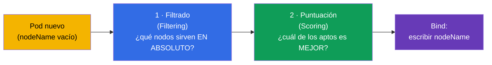
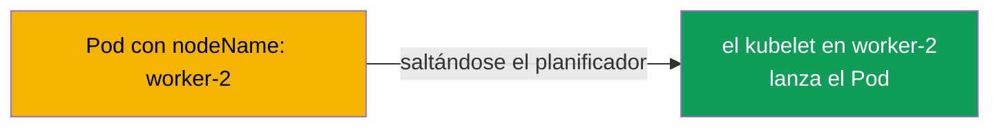
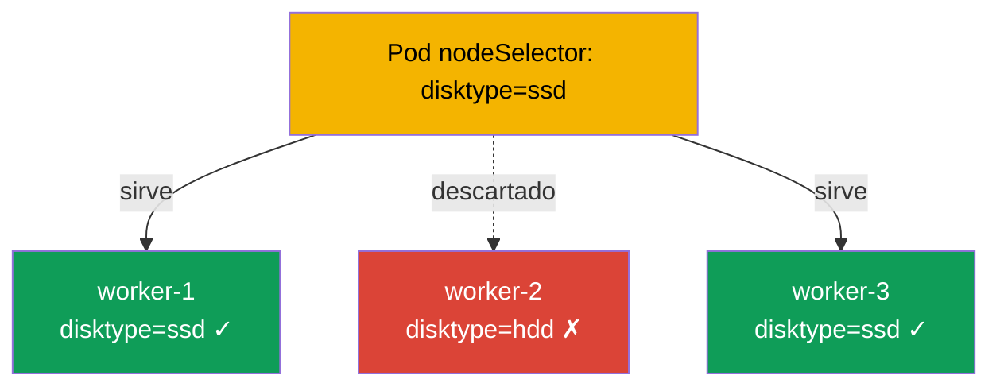
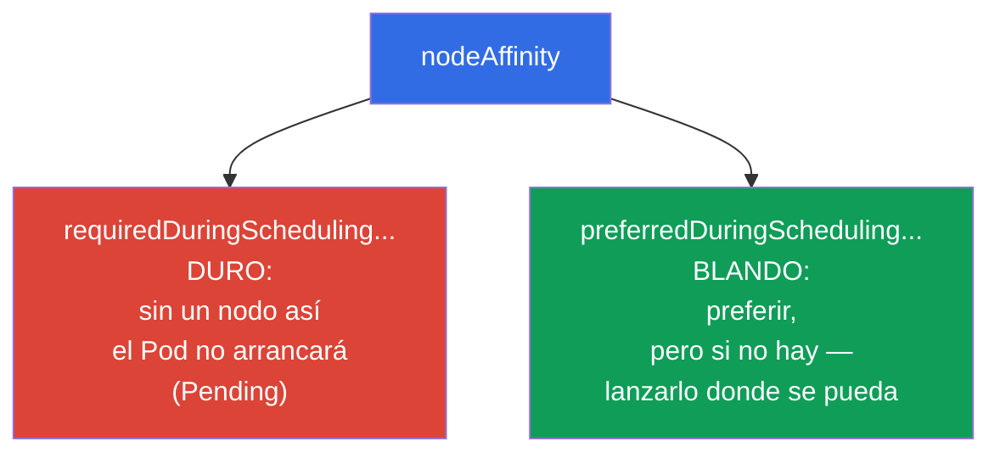
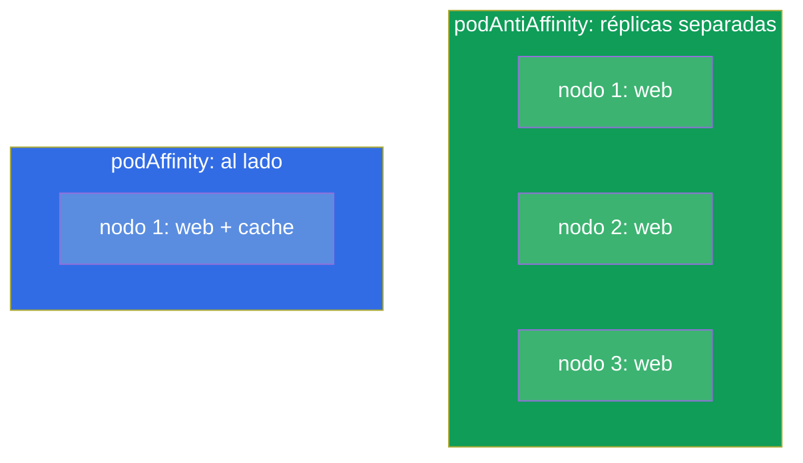
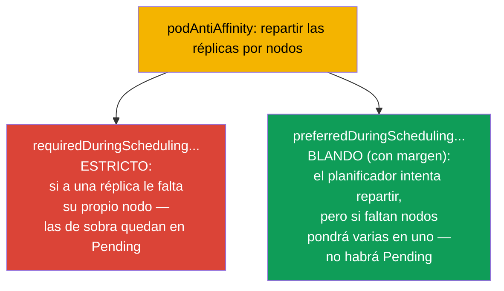
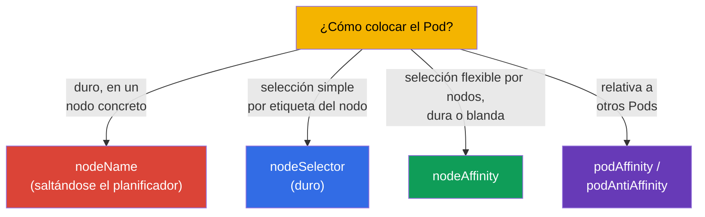
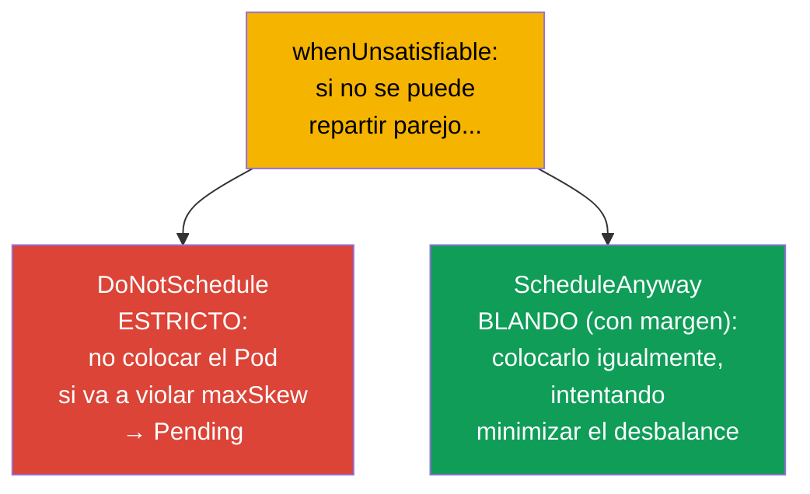

[Русская версия](ru.md) · [Eng version](README.md) · [Version française](fr.md) · [Deutsche Version](de.md) · [ქართული ვერსია](ge.md) · [繁體中文版](tw.md) · [日本語版](jp.md)

# Capítulo 12. Planificación de Pods: nodeName, nodeSelector, affinity

> **Qué viene ahora.** Hasta ahora no nos hemos parado a pensar en qué nodo acabaría un Pod - eso lo decidía
> el planificador (capítulo 2). Ahora aprenderemos a influir en su decisión. Hay formas simples
> (`nodeName`, `nodeSelector`) y flexibles (`nodeAffinity`, `podAffinity`,
> `podAntiAffinity`). Es el dominio Workloads & Scheduling de ambos exámenes. Controlar la
> colocación de los Pods es algo que hace falta tanto en el examen («coloca el Pod en el nodo con la etiqueta X»)
> como en producción (repartir réplicas por zonas, poner una carga en nodos con GPU).

## 12.1. Cómo elige el planificador el nodo

Recordemos del capítulo 2: cuando creas un Pod, al principio tiene el `nodeName` vacío.
El **kube-scheduler** encuentra esos Pods y les elige un nodo en dos etapas.



- El **filtrado** descarta los nodos que no sirven de entrada: no hay recursos suficientes,
  no pasan por taints, nodeSelector o affinity.
- La **puntuación** ordena los nodos restantes por «conveniencia» (equilibrio de carga, cercanía, etc.)
  y elige el mejor.

Podemos intervenir en ambas etapas: limitar de forma dura el conjunto de nodos o «pedir» con suavidad
una preferencia. Veamos las herramientas de lo simple a lo flexible.

## 12.2. nodeName: asignación directa (saltándose el planificador)

La forma más burda es escribir el nodo directamente en el Pod. Entonces el planificador no participa en absoluto:
el kubelet del nodo indicado simplemente toma el Pod.

```yaml
spec:
  nodeName: worker-2       # el Pod irá estrictamente a este nodo
```



Los inconvenientes son evidentes: si ese nodo no existe o no tiene recursos, el Pod simplemente se quedará colgado - nadie
buscará una alternativa. `nodeName` se usa poco (depuración, Pods estáticos - capítulo
15), pero hay que conocerlo: explica cómo funcionan los Pods estáticos del control plane.

## 12.3. nodeSelector: selección simple por etiquetas del nodo

Una forma más práctica es `nodeSelector`. El Pod irá solo a los nodos que tengan
**todas** las etiquetas indicadas. Es el mecanismo más simple y frecuente en el examen.

Primero etiquetamos los nodos (las etiquetas de nodo son como las de cualquier objeto, capítulo 6):

```bash
kubectl label node worker-1 disktype=ssd
kubectl get nodes --show-labels
```

Y luego, en el Pod:

```yaml
spec:
  nodeSelector:
    disktype: ssd          # solo en los nodos con la etiqueta disktype=ssd
```



`nodeSelector` es una condición dura: si no hay nodo con la etiqueta necesaria, el Pod se queda en `Pending`. Es
simple, pero poco flexible: no permite expresar «o/o», «preferiblemente», «excepto». Para eso está
affinity.

## 12.4. nodeAffinity: selección flexible por nodos

**nodeAffinity** es la versión avanzada de nodeSelector. Aporta dos mejoras importantes: las expresiones
(In, NotIn, Exists) y, sobre todo, **dos niveles de dureza**.



- **`requiredDuringSchedulingIgnoredDuringExecution`** - regla dura (como
  nodeSelector, pero con expresiones). Si no hay nodo apto, el Pod queda en Pending.
- **`preferredDuringSchedulingIgnoredDuringExecution`** - preferencia blanda con peso.
  El planificador lo intentará, pero si no hay nodo apto lanzará el Pod igualmente.

```yaml
spec:
  affinity:
    nodeAffinity:
      requiredDuringSchedulingIgnoredDuringExecution:
        nodeSelectorTerms:
        - matchExpressions:
          - key: disktype
            operator: In
            values: [ssd, nvme]        # ssd O nvme
      preferredDuringSchedulingIgnoredDuringExecution:
      - weight: 50
        preference:
          matchExpressions:
          - key: zone
            operator: In
            values: [eu-central-1a]    # deseable en esta zona
```

La parte `IgnoredDuringExecution` significa: la regla se comprueba solo en la **planificación**.
Si las etiquetas del nodo cambian más tarde, el Pod ya en marcha no será desalojado.

## 12.5. podAffinity y podAntiAffinity: colocación relativa a otros Pods

A veces lo que importa no es «qué nodo», sino «junto a qué Pods». Para eso existen:

- **podAffinity** - colocar el Pod **junto** a Pods que tienen ciertas etiquetas
  (por ejemplo, la aplicación más cerca de su caché para reducir la latencia).
- **podAntiAffinity** - colocar el Pod **más lejos** de los Pods con ciertas etiquetas
  (por ejemplo, las réplicas de una misma aplicación en nodos distintos, para que la caída de un nodo no se lleve
  todas de golpe).



El concepto clave aquí es **topologyKey**: según qué criterio se considera «al lado» o
«lejos». Normalmente es una etiqueta del nodo: `kubernetes.io/hostname` (dentro del nodo),
`topology.kubernetes.io/zone` (dentro de la zona).

```yaml
spec:
  affinity:
    podAntiAffinity:
      requiredDuringSchedulingIgnoredDuringExecution:
      - labelSelector:
          matchLabels:
            app: web
        topologyKey: kubernetes.io/hostname   # no más de un web por nodo
```

Este ejemplo garantiza que dos Pods `app=web` no acaben en el mismo nodo - un recurso clásico
de tolerancia a fallos.

### Regla estricta y blanda (required frente a preferred)

Igual que en nodeAffinity, podAffinity/podAntiAffinity tienen **dos niveles de dureza**, y la diferencia
es fundamental para la tolerancia a fallos.



- **Estricto** (`requiredDuringSchedulingIgnoredDuringExecution`): la regla es obligatoria.
  Si hay más réplicas que nodos aptos, los Pods de sobra se quedarán colgados en `Pending`. Garantiza
  el reparto, pero se arriesga a no desplegar todo.
- **Blando** (`preferredDuringSchedulingIgnoredDuringExecution` con peso `weight`):
  el planificador *intenta* repartir, pero si no hay nodos suficientes colocará los Pods de todas formas
  (aunque sea varios por nodo). Todas las réplicas arrancarán, pero sin garantía de reparto.

> **Matiz sobre producción y el autoescalador de nodos.** En los clústeres de nube los Pods en `Pending` normalmente
> no se «quedan colgados» mucho tiempo: los vigila el autoescalador de nodos (Cluster Autoscaler, Karpenter y
> similares) - al ver un Pod sin colocar, añade al clúster un nodo nuevo. Con `required`
> esto resulta cómodo (el reparto duro se lleva a término levantando nodos), pero exige cuidado:
> con parámetros desafortunados (reglas de antiAffinity demasiado estrictas, un `topologyKey` grande,
> requests infladas) el autoescalador levantará nodos nuevos sin fin para cada Pod, y el
> clúster crecerá a base de nodos subutilizados - eso aumenta directamente el coste.
> Por eso `required` y la configuración del autoescalador se acuerdan entre sí, y para cargas menos
> críticas se prefiere `preferred`.

```yaml
spec:
  affinity:
    podAntiAffinity:
      preferredDuringSchedulingIgnoredDuringExecution:   # blando, «con margen»
      - weight: 100
        podAffinityTerm:
          labelSelector:
            matchLabels:
              app: web
          topologyKey: kubernetes.io/hostname
```

Regla práctica: para los servicios críticos, donde el reparto es obligatorio, se toma `required`;
si importa más que todas las réplicas arranquen incluso faltando nodos, `preferred`.

## 12.6. Comparación de los mecanismos de colocación



| Mecanismo | Flexibilidad | Dureza | Participa el planificador |
|----------|----------|-----------|----------------------|
| `nodeName` | ninguna | absoluta | no |
| `nodeSelector` | baja (solo AND por etiquetas) | solo dura | sí |
| `nodeAffinity` | alta (expresiones) | dura o blanda | sí |
| `podAffinity/AntiAffinity` | alta (relativa a Pods) | dura o blanda | sí |

Existen además los **taints/tolerations** - pero es un mecanismo «espejo» (el nodo repele Pods, y no
el Pod elige nodo); tiene su propio capítulo 13. Y los **topologySpreadConstraints** -
distribución uniforme por zonas/nodos (los mencionamos abajo).

## 12.7. Distribución uniforme: topologySpreadConstraints

Un mecanismo aparte, más cómodo para la «uniformidad», es `topologySpreadConstraints`. Permite
decir «reparte las réplicas lo más parejo posible por zonas/nodos», indicando el desbalance admisible
(`maxSkew`):

```yaml
spec:
  topologySpreadConstraints:
  - maxSkew: 1
    topologyKey: topology.kubernetes.io/zone
    whenUnsatisfiable: DoNotSchedule
    labelSelector:
      matchLabels:
        app: web
```

- **`maxSkew`** - la diferencia máxima admisible del número de Pods entre topologías (zonas/
  nodos). `maxSkew: 1` - repartir lo más parejo posible.
- **`topologyKey`** - según qué distribuir (zona `topology.kubernetes.io/zone`, nodo
  `kubernetes.io/hostname`).

### Distribución estricta y blanda (whenUnsatisfiable)

Igual que en affinity, topologySpread tiene un modo estricto y uno blando - se indica con el campo
`whenUnsatisfiable`:



| `whenUnsatisfiable` | Comportamiento | Equivalente |
|---------------------|-----------|--------|
| `DoNotSchedule` | estricto: el Pod que viola la regla se queda en Pending | `required` de affinity |
| `ScheduleAnyway` | blando: el Pod se coloca igualmente, el desbalance se minimiza | `preferred` de affinity |

El mismo compromiso que en affinity: `DoNotSchedule` garantiza una distribución pareja, pero
puede dejar Pods en `Pending` si faltan zonas/nodos; `ScheduleAnyway` garantiza que
todos los Pods arranquen, pero admite desbalance.

topologySpreadConstraints es la forma moderna y a menudo preferible de conseguir una distribución
de réplicas tolerante a fallos por zonas/nodos - más limpia que montar podAntiAffinity.

## 12.8. Cómo se usa esto en producción

- **Reparto de réplicas para la tolerancia a fallos.** El uso principal es repartir las réplicas por
  nodos y zonas de disponibilidad distintos, para que la caída de un nodo/zona no se lleve todo el servicio. En producción
  esto se hace con `podAntiAffinity` o (más a menudo) con `topologySpreadConstraints`.
- **Atar la carga a un tipo de nodos.** Las tareas de GPU, a los nodos con GPU; las intensivas en memoria, a los nodos con
  mucha RAM; el ingress, a nodos dedicados. Se implementa con nodeSelector/nodeAffinity por
  etiquetas de nodo (que muchas veces la nube pone automáticamente: tipo de instancia, zona, arquitectura).
- **Colocación conjunta por latencia.** podAffinity sienta la aplicación junto a su
  caché o dependencia local, reduciendo las latencias de red - pero se aplica con cuidado, para
  no perder la tolerancia a fallos.
- **nodeName casi no se usa.** En producción la asignación directa es un antipatrón (se pierde la
  tolerancia a fallos y el balanceo). La excepción son los Pods estáticos del control plane
  (capítulo 15).
- **Las reglas blandas son preferibles.** Abusar de las reglas duras (`required`)
  lleva a menudo a `Pending`, cuando no quedan nodos aptos. Los equipos con experiencia usan en lo posible
  `preferred`/`topologySpread`, para que el Pod arranque en algún sitio de todos modos.

## 12.9. Mini-glosario

- **kube-scheduler** - componente que elige el nodo para el Pod (filtrado + puntuación).
- **nodeName** - asignación dura del nodo saltándose el planificador.
- **nodeSelector** - selección dura simple del nodo por sus etiquetas.
- **nodeAffinity** - selección flexible de nodos; `required` (dura) y `preferred` (blanda).
- **podAffinity** - colocar el Pod junto a Pods por etiquetas.
- **podAntiAffinity** - colocar el Pod más lejos de Pods por etiquetas.
- **topologyKey** - etiqueta del nodo que define la «zona de vecindad» (hostname, zone).
- **topologySpreadConstraints** - distribución uniforme de los Pods por la topología
  (`maxSkew`).
- **whenUnsatisfiable** - modo de topologySpread: `DoNotSchedule` (estricto, → Pending) o
  `ScheduleAnyway` (blando, con margen de desbalance).
- **required vs preferred** - regla de colocación estricta (obligatoria) frente a blanda (si se puede)
  en affinity.
- **IgnoredDuringExecution** - la regla se comprueba en la planificación, pero no desaloja al Pod
  ya en marcha.

## 12.10. Resumen del capítulo

- El planificador elige el nodo en dos etapas: filtrado (quién sirve) y puntuación (quién es mejor).
- `nodeName` es la asignación directa y dura saltándose el planificador; frágil, se usa poco.
- `nodeSelector` es la selección dura simple por etiquetas del nodo; si no hay nodo apto, Pending.
- `nodeAffinity` es la selección flexible con expresiones y dos niveles: `required` (dura) y
  `preferred` (blanda).
- `podAffinity`/`podAntiAffinity` colocan el Pod relativamente a otros Pods; la clave es
  `topologyKey` (hostname, zone).
- `topologySpreadConstraints` es una forma cómoda de distribuir las réplicas parejo por
  zonas/nodos (`maxSkew`).
- Distribución estricta vs blanda: `required`/`DoNotSchedule` (garantía de reparto, pero riesgo de
  Pending) frente a `preferred`/`ScheduleAnyway` (todos los Pods arrancan, pero el desbalance es posible).
- En producción el uso principal es la tolerancia a fallos (reparto de réplicas) y atar las cargas a
  tipos de nodos; abusar de las reglas duras es peligroso (Pending).

## 12.11. Para qué sirve: en el examen y en el trabajo real

**En el examen.** «Coloca el Pod en el nodo con la etiqueta X» (nodeSelector), «configura nodeAffinity /
podAntiAffinity» son tareas típicas de Workloads & Scheduling. Hay que saber etiquetar nodos
(`kubectl label node`), escribir nodeSelector y la estructura de affinity, y distinguir required de
preferred. El diagnóstico de «por qué el Pod está en Pending» se topa muchas veces precisamente con las reglas duras
de colocación.

**En el trabajo real.** La colocación correcta de los Pods es la base de la tolerancia a fallos
(réplicas por zonas) y de la eficiencia (la carga en los nodos adecuados). podAntiAffinity/
topologySpread protegen el servicio de la caída de un nodo o de una zona entera, y nodeAffinity sienta las
tareas en el hardware necesario (GPU, memoria). Son decisiones de arquitectura del día a día al
diseñar cargas de trabajo.

## 12.12. Preguntas de autoevaluación

1. ¿De qué dos etapas consta la elección del nodo por parte del planificador?
2. ¿En qué se diferencia `nodeName` de `nodeSelector` y por qué `nodeName` es frágil?
3. ¿Qué dos niveles de dureza aporta nodeAffinity y en qué se diferencian en la práctica?
4. ¿Cuál es la diferencia entre podAffinity y podAntiAffinity? Da un ejemplo de uso de
   cada uno.
5. ¿Qué es `topologyKey` y cómo se «reparten» con él las réplicas por nodos?
6. ¿Por qué `topologySpreadConstraints` es más cómodo que podAntiAffinity para una distribución uniforme?
7. ¿Por qué abusar de las reglas duras lleva a Pods en Pending?

## Práctica

Hemos aprendido a atraer Pods hacia los nodos. En el capítulo 13 veremos el mecanismo inverso - taints y
tolerations, con los que los nodos **repelen** Pods. La planificación se practica en los laboratorios de
cargas de trabajo.

🧪 Laboratorio 122 (drills de scheduling: nodeSelector, affinity, taints): [tasks/cka/labs/122](../../labs/122/README_ES.MD)

🎮 Killercoda (en el navegador, sin instalación): [Apply node affinity to a pod](https://killercoda.com/chadmcrowell/course/ckad/node-affinity) · [Node Affinity: Required and Preferred](https://killercoda.com/chadmcrowell/course/cka/node-affinity-required-preferred) · [Scheduling a pod to a specific node](https://killercoda.com/chadmcrowell/course/cka/node-name) · [Cordon and Select Node](https://killercoda.com/chadmcrowell/course/cka/nodeselector-cordon)

---
[Índice](../README_ES.md) · [Capítulo 11](../11/es.md) · [Capítulo 13](../13/es.md)
