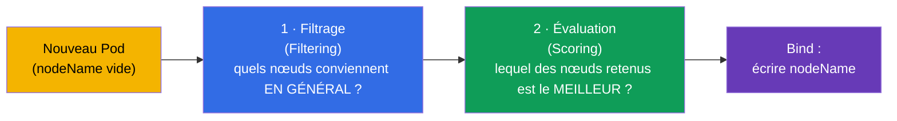
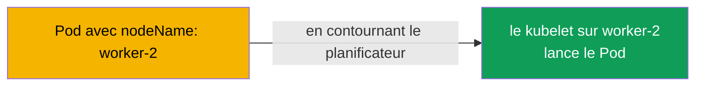
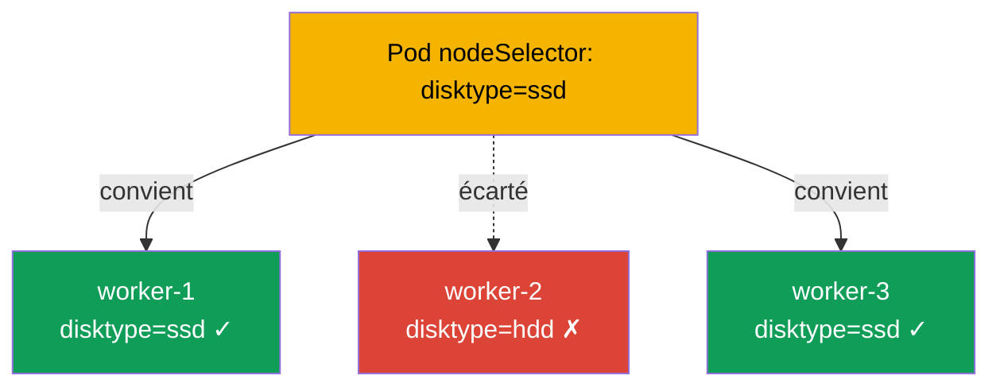
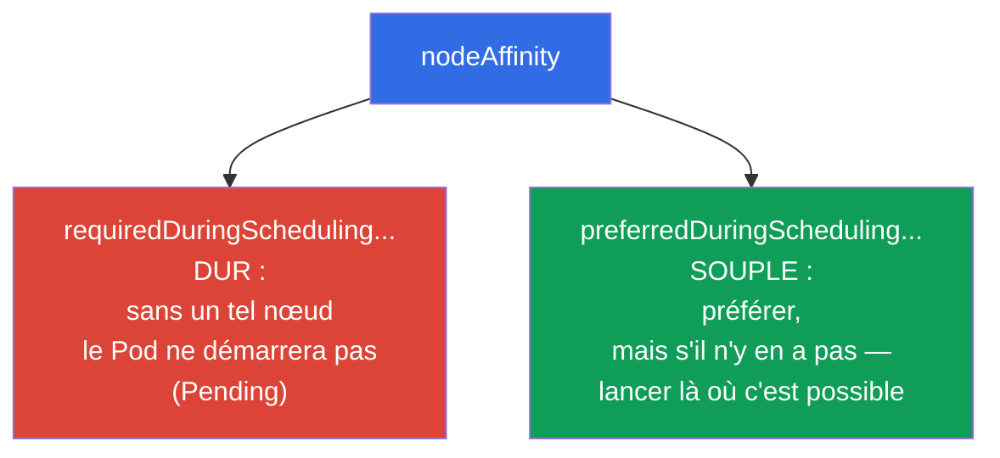
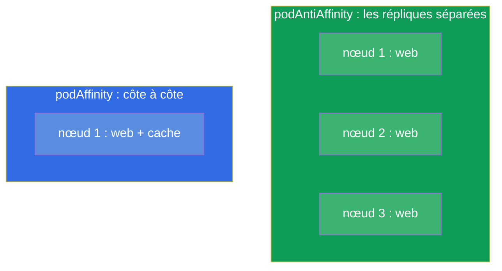
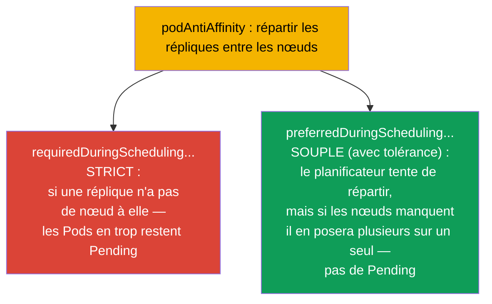
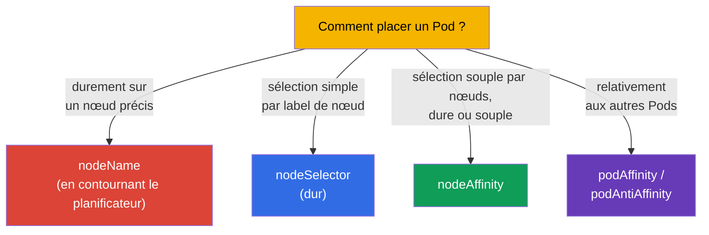
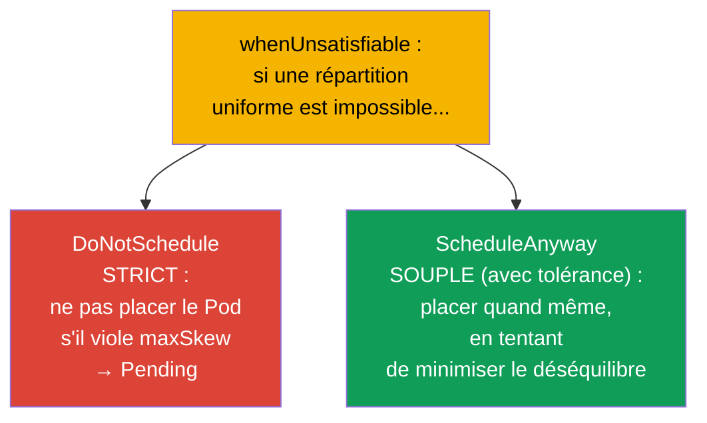

[Русская версия](ru.md) · [Eng version](README.md) · [Versión en español](es.md) · [Deutsche Version](de.md) · [ქართული ვერსია](ge.md) · [繁體中文版](tw.md) · [日本語版](jp.md)

# Chapitre 12. Planification des Pods : nodeName, nodeSelector, affinity

> **Ce qui suit.** Jusqu'ici nous ne nous sommes pas demandé sur quel nœud atterrirait un Pod -
> c'était le planificateur qui décidait (chapitre 2). Nous allons maintenant apprendre à
> influencer sa décision. Il y a des moyens simples (`nodeName`, `nodeSelector`) et des moyens
> souples (`nodeAffinity`, `podAffinity`, `podAntiAffinity`). C'est le domaine Workloads &
> Scheduling des deux examens. Maîtriser le placement des Pods sert à la fois à l'examen
> (« place un Pod sur le nœud portant le label X ») et en production (répartir les répliques
> entre les zones, poser une charge sur des nœuds GPU).

## 12.1. Comment le planificateur choisit un nœud

Rappelons le chapitre 2 : quand vous créez un Pod, son `nodeName` est d'abord vide.
**kube-scheduler** repère ces Pods et leur choisit un nœud en deux étapes.



- Le **filtrage** écarte les nœuds qui ne conviennent pas par principe : ressources
  insuffisantes, non conformité aux taints, au nodeSelector, à l'affinity.
- L'**évaluation** classe les nœuds restants selon leur « commodité » (équilibre de la charge,
  proximité, etc.) et choisit le meilleur.

Nous pouvons intervenir aux deux étapes : restreindre durement l'ensemble des nœuds ou
« demander » doucement une préférence. Voyons les outils du plus simple au plus souple.

## 12.2. nodeName : affectation directe (en contournant le planificateur)

Le moyen le plus brutal consiste à inscrire le nœud directement dans le Pod. Le planificateur
n'intervient alors pas du tout : le kubelet du nœud indiqué prend simplement le Pod.

```yaml
spec:
  nodeName: worker-2       # le Pod ira strictement sur ce nœud
```



Les inconvénients sont évidents : si ce nœud n'existe pas ou n'a plus de ressources, le Pod
reste simplement bloqué - personne ne lui trouvera d'alternative. `nodeName` est rarement
utilisé (débogage, Pods statiques - chapitre 15), mais il faut le connaître : cela explique le
fonctionnement des Pods statiques du control plane.

## 12.3. nodeSelector : sélection simple par labels de nœud

Le moyen plus pratique, c'est `nodeSelector`. Le Pod n'ira que sur les nœuds qui portent
**tous** les labels indiqués. C'est le mécanisme le plus simple et le plus fréquent à l'examen.

On commence par étiqueter les nœuds (les labels de nœuds sont comme les labels de n'importe quel
objet, chapitre 6) :

```bash
kubectl label node worker-1 disktype=ssd
kubectl get nodes --show-labels
```

Puis, dans le Pod :

```yaml
spec:
  nodeSelector:
    disktype: ssd          # uniquement sur les nœuds portant le label disktype=ssd
```



`nodeSelector` est une condition dure : s'il n'y a aucun nœud portant le label voulu, le Pod
reste en `Pending`. Il est simple, mais peu souple : impossible d'exprimer « soit/soit », « de
préférence », « sauf ». C'est à cela que sert l'affinity.

## 12.4. nodeAffinity : sélection souple par nœuds

La **nodeAffinity** est la version avancée de nodeSelector. Elle apporte deux améliorations
importantes : les expressions (In, NotIn, Exists) et surtout **deux niveaux de dureté**.



- **`requiredDuringSchedulingIgnoredDuringExecution`** - règle dure (comme nodeSelector, mais
  avec des expressions). Pas de nœud convenable - le Pod reste en Pending.
- **`preferredDuringSchedulingIgnoredDuringExecution`** - préférence souple, avec un poids. Le
  planificateur fera de son mieux, mais en l'absence de nœud convenable il lancera quand même le
  Pod.

```yaml
spec:
  affinity:
    nodeAffinity:
      requiredDuringSchedulingIgnoredDuringExecution:
        nodeSelectorTerms:
        - matchExpressions:
          - key: disktype
            operator: In
            values: [ssd, nvme]        # ssd OU nvme
      preferredDuringSchedulingIgnoredDuringExecution:
      - weight: 50
        preference:
          matchExpressions:
          - key: zone
            operator: In
            values: [eu-central-1a]    # de préférence dans cette zone
```

La partie `IgnoredDuringExecution` signifie : la règle n'est vérifiée qu'à la **planification**.
Si les labels du nœud changent plus tard, un Pod déjà lancé ne sera pas expulsé.

## 12.5. podAffinity et podAntiAffinity : placement relatif aux autres Pods

Parfois, ce qui compte n'est pas « quel nœud », mais « à côté de quels Pods ». Pour cela il y a :

- **podAffinity** - placer le Pod **à côté** des Pods portant certains labels (par exemple,
  l'application au plus près de son cache pour une faible latence).
- **podAntiAffinity** - placer le Pod **plus loin** des Pods portant certains labels (par
  exemple, les répliques d'une même application sur des nœuds différents, pour que la chute d'un
  nœud ne les tue pas toutes d'un coup).



La notion clé ici est le **topologyKey** : selon quel critère juger de la « proximité » ou de
l'« éloignement ». C'est en général un label de nœud : `kubernetes.io/hostname` (à l'échelle du
nœud), `topology.kubernetes.io/zone` (à l'échelle de la zone).

```yaml
spec:
  affinity:
    podAntiAffinity:
      requiredDuringSchedulingIgnoredDuringExecution:
      - labelSelector:
          matchLabels:
            app: web
        topologyKey: kubernetes.io/hostname   # pas plus d'un web par nœud
```

Cet exemple garantit que deux Pods `app=web` ne se retrouveront pas sur le même nœud - un
procédé classique de tolérance aux pannes.

### Règle dure et règle souple (required contre preferred)

Comme pour nodeAffinity, podAffinity/podAntiAffinity ont **deux niveaux de dureté**, et la
différence est déterminante pour la tolérance aux pannes.



- **Strict** (`requiredDuringSchedulingIgnoredDuringExecution`) : la règle est obligatoire. S'il
  y a plus de répliques que de nœuds convenables, les Pods en trop resteront bloqués en
  `Pending`. Cela garantit la répartition, mais risque un déploiement incomplet.
- **Souple** (`preferredDuringSchedulingIgnoredDuringExecution` avec un poids `weight`) : le
  planificateur *tente* de répartir, mais si les nœuds manquent il placera tout de même les Pods
  (quitte à en mettre plusieurs sur un nœud). Toutes les répliques démarreront, mais sans
  garantie de répartition.

> **Réserve sur la production et l'autoscaler de nœuds.** Dans les clusters cloud, les Pods en
> `Pending` ne « restent » généralement pas bloqués longtemps : un autoscaler de nœuds les
> surveille (Cluster Autoscaler, Karpenter et similaires) - voyant un Pod non placé, il ajoute
> un nouveau nœud au cluster. Avec `required` c'est commode (la répartition dure est menée à
> bien en montant des nœuds), mais cela demande de la rigueur : avec de mauvais paramètres
> (règles antiAffinity trop strictes, `topologyKey` trop large, requests surévaluées),
> l'autoscaler montera toujours de nouveaux nœuds pour chaque Pod, et le cluster se gonflera de
> nœuds sous-chargés - ce qui augmente directement le coût. C'est pourquoi on accorde `required`
> et les réglages de l'autoscaler entre eux, et que pour les charges moins critiques on préfère
> `preferred`.

```yaml
spec:
  affinity:
    podAntiAffinity:
      preferredDuringSchedulingIgnoredDuringExecution:   # souple, « avec tolérance »
      - weight: 100
        podAffinityTerm:
          labelSelector:
            matchLabels:
              app: web
          topologyKey: kubernetes.io/hostname
```

Règle pratique : pour les services critiques, où la répartition est obligatoire, on prend
`required` ; s'il importe davantage que toutes les répliques démarrent même quand les nœuds
manquent, on prend `preferred`.

## 12.6. Comparaison des mécanismes de placement



| Mécanisme | Souplesse | Dureté | Le planificateur intervient |
|----------|----------|-----------|----------------------|
| `nodeName` | aucune | absolue | non |
| `nodeSelector` | faible (seulement AND sur les labels) | dure uniquement | oui |
| `nodeAffinity` | élevée (expressions) | dure ou souple | oui |
| `podAffinity/AntiAffinity` | élevée (relative aux Pods) | dure ou souple | oui |

Il y a encore les **taints/tolerations** - mais c'est un mécanisme « en miroir » (le nœud
repousse les Pods, ce n'est pas le Pod qui choisit le nœud), auquel est consacré le chapitre 13 à
part entière. Et les **topologySpreadConstraints** - la répartition uniforme entre zones/nœuds
(nous en parlons ci-dessous).

## 12.7. Répartition uniforme : topologySpreadConstraints

Un mécanisme distinct, plus commode pour l'« uniformité », est `topologySpreadConstraints`. Il
permet de dire « répartis les répliques le plus uniformément possible entre les zones/nœuds », en
fixant le déséquilibre admissible (`maxSkew`) :

```yaml
spec:
  topologySpreadConstraints:
  - maxSkew: 1
    topologyKey: topology.kubernetes.io/zone
    whenUnsatisfiable: DoNotSchedule
    labelSelector:
      matchLabels:
        app: web
```

- **`maxSkew`** - l'écart maximal admissible du nombre de Pods entre les topologies (zones/
  nœuds). `maxSkew: 1` - répartir le plus uniformément possible.
- **`topologyKey`** - selon quoi répartir (la zone `topology.kubernetes.io/zone`, le nœud
  `kubernetes.io/hostname`).

### Répartition dure et souple (whenUnsatisfiable)

Comme pour l'affinity, topologySpread a un mode strict et un mode souple - fixé par le champ
`whenUnsatisfiable` :



| `whenUnsatisfiable` | Comportement | Équivalent |
|---------------------|-----------|--------|
| `DoNotSchedule` | strict : le Pod en infraction reste Pending | `required` de l'affinity |
| `ScheduleAnyway` | souple : le Pod sera placé quand même, le déséquilibre est minimisé | `preferred` de l'affinity |

Le même compromis que dans l'affinity : `DoNotSchedule` garantit une répartition uniforme, mais
peut laisser des Pods en `Pending` quand les zones/nœuds manquent ; `ScheduleAnyway` garantit que
tous les Pods démarreront, mais admet un déséquilibre.

topologySpreadConstraints est le moyen moderne, souvent préférable, d'obtenir une répartition
tolérante aux pannes des répliques entre zones/nœuds - plus propre que de bricoler du
podAntiAffinity.

## 12.8. Comment cela s'applique en production

- **Répartir les répliques pour la tolérance aux pannes.** C'est l'usage principal : disperser
  les répliques sur des nœuds et des zones de disponibilité différents, pour que la chute d'un
  nœud/d'une zone ne tue pas tout le service. En prod, on le fait via `podAntiAffinity` ou (plus
  souvent) `topologySpreadConstraints`.
- **Attacher une charge à un type de nœuds.** Les travaux GPU sur les nœuds GPU, ceux gourmands
  en mémoire sur les nœuds à grande RAM, l'ingress sur des nœuds dédiés. On le réalise via
  nodeSelector/nodeAffinity sur les labels de nœuds (que le cloud pose souvent
  automatiquement : type d'instance, zone, architecture).
- **Colocalisation pour la latence.** podAffinity pose l'application à côté de son cache/de sa
  dépendance locale, réduisant les latences réseau - mais on l'applique avec soin, pour ne pas
  perdre la tolérance aux pannes.
- **nodeName n'est presque pas utilisé.** En prod, l'affectation directe est un antipattern (on
  perd la tolérance aux pannes et l'équilibrage). L'exception, ce sont les Pods statiques du
  control plane (chapitre 15).
- **Les règles souples sont préférables.** L'abus de règles dures (`required`) conduit souvent à
  des `Pending`, quand il ne reste plus de nœud convenable. Les équipes expérimentées utilisent
  autant que possible `preferred`/`topologySpread`, pour que le Pod démarre tout de même quelque
  part.

## 12.9. Mini-glossaire

- **kube-scheduler** - composant qui choisit un nœud pour le Pod (filtrage + évaluation).
- **nodeName** - affectation dure du nœud en contournant le planificateur.
- **nodeSelector** - sélection dure et simple du nœud d'après ses labels.
- **nodeAffinity** - sélection souple des nœuds ; `required` (dur) et `preferred` (souple).
- **podAffinity** - placer le Pod à côté de Pods identifiés par leurs labels.
- **podAntiAffinity** - placer le Pod plus loin de Pods identifiés par leurs labels.
- **topologyKey** - label de nœud qui définit la « zone de voisinage » (hostname, zone).
- **topologySpreadConstraints** - répartition uniforme des Pods sur la topologie
  (`maxSkew`).
- **whenUnsatisfiable** - mode de topologySpread : `DoNotSchedule` (strict, → Pending) ou
  `ScheduleAnyway` (souple, avec tolérance au déséquilibre).
- **required vs preferred** - règle de placement dure (obligatoire) contre souple (dans la
  mesure du possible) dans l'affinity.
- **IgnoredDuringExecution** - la règle est vérifiée à la planification, mais n'expulse pas un
  Pod déjà lancé.

## 12.10. Récapitulatif du chapitre

- Le planificateur choisit un nœud en deux étapes : le filtrage (qui convient) et l'évaluation
  (qui est le meilleur).
- `nodeName` - affectation directe et dure en contournant le planificateur ; fragile, rarement
  utilisée.
- `nodeSelector` - sélection dure et simple par labels de nœud ; pas de nœud convenable -
  Pending.
- `nodeAffinity` - sélection souple avec des expressions et deux niveaux : `required` (dur) et
  `preferred` (souple).
- `podAffinity`/`podAntiAffinity` placent le Pod relativement aux autres Pods ; la clé, c'est
  `topologyKey` (hostname, zone).
- `topologySpreadConstraints` - moyen commode de répartir uniformément les répliques entre
  zones/nœuds (`maxSkew`).
- Répartition dure vs souple : `required`/`DoNotSchedule` (garantie de répartition, mais risque
  de Pending) contre `preferred`/`ScheduleAnyway` (tous les Pods démarreront, mais un déséquilibre
  est possible).
- En prod, l'usage principal est la tolérance aux pannes (répartition des répliques) et
  l'attachement des charges à des types de nœuds ; abuser des règles dures est dangereux
  (Pending).

## 12.11. À quoi cela sert : à l'examen et dans le travail réel

**À l'examen.** « Place un Pod sur le nœud portant le label X » (nodeSelector), « configure
nodeAffinity / podAntiAffinity » sont des exercices types de Workloads & Scheduling. Il faut
savoir étiqueter les nœuds (`kubectl label node`), écrire un nodeSelector et la structure de
l'affinity, distinguer required et preferred. Le diagnostic « pourquoi le Pod est en Pending »
bute justement souvent sur des règles de placement dures.

**Dans le travail réel.** Un bon placement des Pods est le fondement de la tolérance aux pannes
(répliques par zones) et de l'efficacité (charge sur les nœuds adaptés).
podAntiAffinity/topologySpread protègent le service de la chute d'un nœud ou d'une zone entière,
et nodeAffinity pose les travaux sur le matériel voulu (GPU, mémoire). Ce sont des décisions
d'architecture quotidiennes lors de la conception des charges.

## 12.12. Questions d'auto-évaluation

1. De quelles deux étapes est composé le choix d'un nœud par le planificateur ?
2. En quoi `nodeName` diffère-t-il de `nodeSelector` et pourquoi `nodeName` est-il fragile ?
3. Quels deux niveaux de dureté nodeAffinity offre-t-elle et en quoi diffèrent-ils en pratique ?
4. Quelle est la différence entre podAffinity et podAntiAffinity ? Donnez un exemple d'usage de
   chacune.
5. Qu'est-ce que le `topologyKey` et comment « répartir » avec lui les répliques entre les nœuds ?
6. En quoi `topologySpreadConstraints` est-il plus commode que podAntiAffinity pour une
   répartition uniforme ?
7. Pourquoi l'abus de règles dures conduit-il à des Pods en Pending ?

## Pratique

Nous avons appris à attirer les Pods vers les nœuds. Au chapitre 13, nous verrons le mécanisme
inverse - les taints et tolerations, par lesquels les nœuds **repoussent** les Pods. La
planification se travaille dans les TP sur les charges de travail.

🧪 TP 122 (drills de scheduling : nodeSelector, affinity, taints) : [tasks/cka/labs/122](../../labs/122/README_FR.MD)

🎮 Killercoda (dans le navigateur, sans installation) : [Apply node affinity to a pod](https://killercoda.com/chadmcrowell/course/ckad/node-affinity) · [Node Affinity: Required and Preferred](https://killercoda.com/chadmcrowell/course/cka/node-affinity-required-preferred) · [Scheduling a pod to a specific node](https://killercoda.com/chadmcrowell/course/cka/node-name) · [Cordon and Select Node](https://killercoda.com/chadmcrowell/course/cka/nodeselector-cordon)

---
[Sommaire](../README_FR.md) · [Chapitre 11](../11/fr.md) · [Chapitre 13](../13/fr.md)
