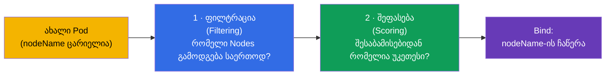
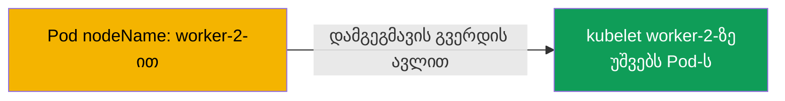
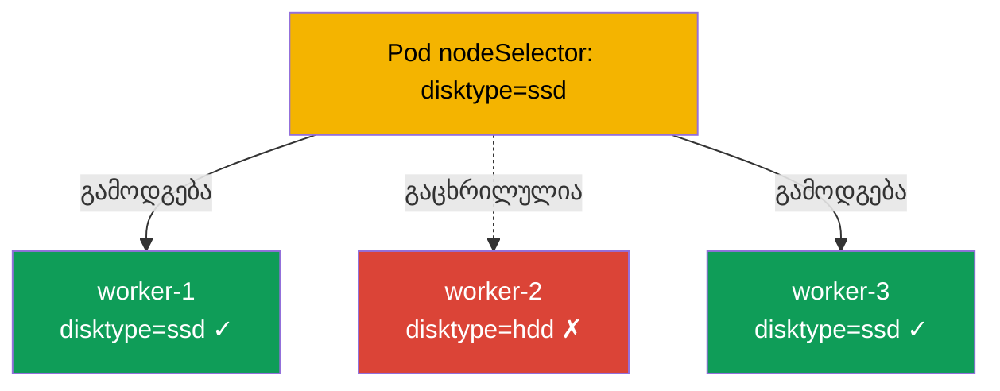
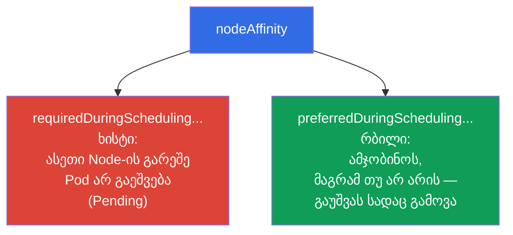
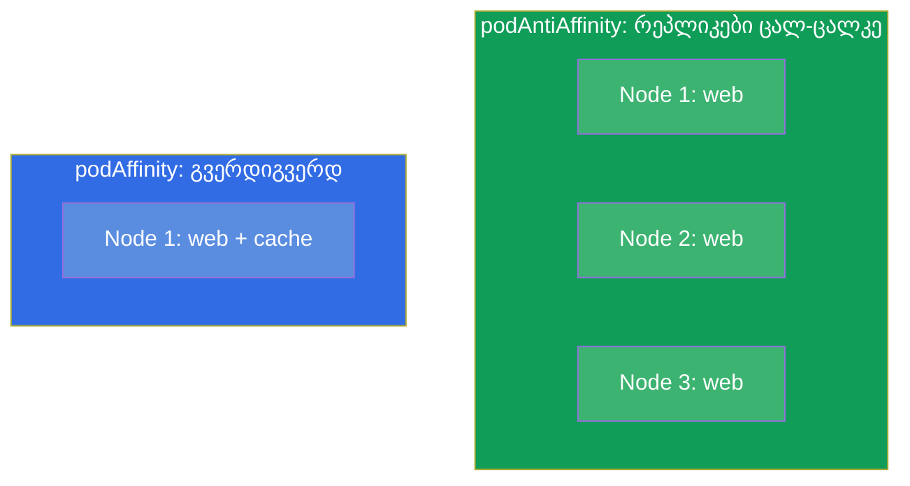
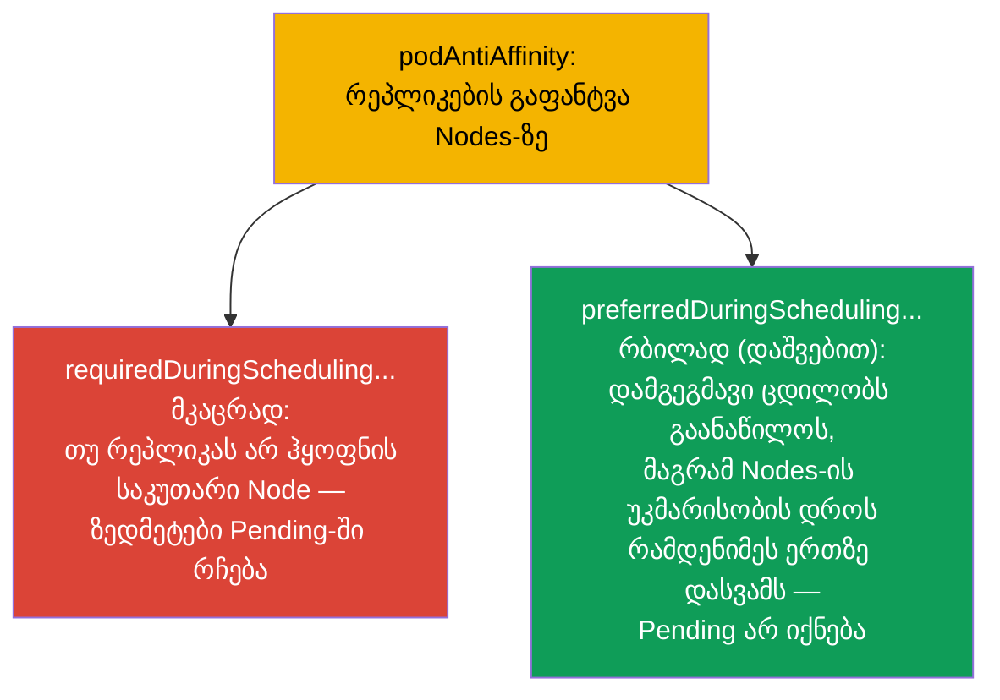
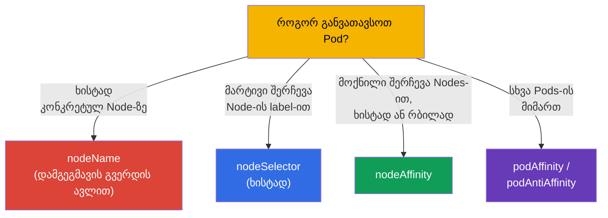
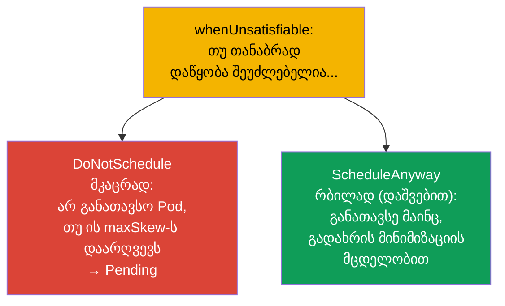

[Русская версия](ru.md) · [Eng version](README.md) · [Versión en español](es.md) · [Version française](fr.md) · [Deutsche Version](de.md) · [繁體中文版](tw.md) · [日本語版](jp.md)

# თავი 12. Pods-ის დაგეგმვა: nodeName, nodeSelector, affinity

> **რა იქნება შემდეგ.** აქამდე არ ვფიქრობდით, რომელ Node-ზე მოხვდებოდა Pod - ამას
> დამგეგმავი წყვეტდა (თავი 2). ახლა ვისწავლით, როგორ ვიმოქმედოთ მის გადაწყვეტილებაზე. არის მარტივი
> ხერხები (`nodeName`, `nodeSelector`) და მოქნილი (`nodeAffinity`, `podAffinity`,
> `podAntiAffinity`). ეს ორივე გამოცდის დომენი Workloads & Scheduling-ია. Pods-ის
> განთავსების მართვა - ეს ისაა, რაც გამოცდაზეც სჭირდება („განათავსე Pod X label-ის მქონე Node-ზე“),
> და პროდშიც (რეპლიკები ზონებზე გაანაწილო, დატვირთვა GPU-Nodes-ზე დასვა).

## 12.1. როგორ ირჩევს დამგეგმავი Node-ს

გავიხსენოთ თავი 2: როცა Pod-ს ქმნით, მას თავიდან ცარიელი `nodeName` აქვს.
**kube-scheduler** პოულობს ასეთ Pods-ს და ორ ეტაპად ურჩევს მათ Node-ს.



- **ფილტრაცია** აცილებს Nodes-ს, რომლებიც პრინციპში არ გამოდგება: არ ჰყოფნის რესურსები,
  ვერ გადის taints-ით, nodeSelector-ით, affinity-ით.
- **შეფასება** დარჩენილ Nodes-ს „მოხერხებულობით“ ალაგებს რანგებად (დატვირთვის ბალანსი, სიახლოვე და ა.შ.)
  და საუკეთესოს ირჩევს.

ჩვენ შეგვიძლია ორივე ეტაპში ჩავერიოთ: ხისტად შევზღუდოთ Nodes-ის ნაკრები ან რბილად „ვთხოვოთ“
უპირატესობა. განვიხილოთ ინსტრუმენტები მარტივიდან მოქნილისკენ.

## 12.2. nodeName: პირდაპირი დანიშვნა (დამგეგმავის გვერდის ავლით)

ყველაზე უხეში ხერხი - Node პირდაპირ Pod-ში ჩაწერო. მაშინ დამგეგმავი სულ არ მონაწილეობს:
მითითებული Node-ის kubelet უბრალოდ იღებს Pod-ს.

```yaml
spec:
  nodeName: worker-2       # Pod მკაცრად ამ Node-ზე წავა
```



მინუსები აშკარაა: თუ ასეთი Node არ არსებობს ან მასზე რესურსები არ არის, Pod უბრალოდ ჩაეკიდება - ვერავინ
შეარჩევს ალტერნატივას. `nodeName`-ს იშვიათად იყენებენ (გამართვა, სტატიკური Pods - თავი
15), მაგრამ ცოდნა საჭიროა: ეს ხსნის, როგორ მუშაობს control plane-ის სტატიკური Pods.

## 12.3. nodeSelector: მარტივი შერჩევა Node-ის labels-ით

უფრო პრაქტიკული ხერხია `nodeSelector`. Pod მხოლოდ იმ Nodes-ზე წავა, რომლებსაც აქვს
**ყველა** მითითებული label. ეს გამოცდაზე ყველაზე მარტივი და ხშირი მექანიზმია.

თავიდან ვნიშნავთ Nodes-ს (Nodes-ის labels - როგორც ნებისმიერი ობიექტის labels, თავი 6):

```bash
kubectl label node worker-1 disktype=ssd
kubectl get nodes --show-labels
```

შემდეგ Pod-ში:

```yaml
spec:
  nodeSelector:
    disktype: ssd          # მხოლოდ disktype=ssd label-ის მქონე Nodes-ზე
```



`nodeSelector` - ხისტი პირობაა: არ არის საჭირო label-ის მქონე Node - Pod ჰკიდია `Pending`-ში. ის
მარტივია, მაგრამ არა მოქნილი: ვერ გამოთქვამ „ან/ან“, „სასურველია“, „გარდა“. ამისთვის არსებობს
affinity.

## 12.4. nodeAffinity: მოქნილი შერჩევა Nodes-ის მიხედვით

**nodeAffinity** - nodeSelector-ის განვითარებული ვერსიაა. ორ მნიშვნელოვან გაუმჯობესებას იძლევა: გამოსახულებებს
(In, NotIn, Exists) და, მთავარია, **ხისტობის ორ დონეს**.



- **`requiredDuringSchedulingIgnoredDuringExecution`** - ხისტი წესი (როგორც
  nodeSelector, ოღონდ გამოსახულებებით). არ არის შესაბამისი Node - Pod Pending-შია.
- **`preferredDuringSchedulingIgnoredDuringExecution`** - რბილი უპირატესობა წონით.
  დამგეგმავი ეცდება, მაგრამ შესაბამისი Node-ის არარსებობის დროსაც მაინც გაუშვებს Pod-ს.

```yaml
spec:
  affinity:
    nodeAffinity:
      requiredDuringSchedulingIgnoredDuringExecution:
        nodeSelectorTerms:
        - matchExpressions:
          - key: disktype
            operator: In
            values: [ssd, nvme]        # ssd ან nvme
      preferredDuringSchedulingIgnoredDuringExecution:
      - weight: 50
        preference:
          matchExpressions:
          - key: zone
            operator: In
            values: [eu-central-1a]    # სასურველია ამ ზონაში
```

ნაწილი `IgnoredDuringExecution` ნიშნავს: წესი მხოლოდ **დაგეგმვის** დროს მოწმდება.
თუ Node-ის labels მოგვიანებით შეიცვლება, უკვე გაშვებულ Pod-ს არ გამოასახლებენ.

## 12.5. podAffinity და podAntiAffinity: განთავსება სხვა Pods-ის მიმართ

ხანდახან მნიშვნელოვანია არა „რომელი Node“, არამედ „რომელი Pods-ის გვერდით“. ამისთვის არსებობს:

- **podAffinity** - Pod-ის განთავსება იმ Pods-ის **გვერდით**, რომლებსაც გარკვეული labels აქვს
  (მაგალითად, აპლიკაცია თავის ქეშთან უფრო ახლოს, დაბალი დაყოვნებისთვის).
- **podAntiAffinity** - განთავსება გარკვეული labels-ის მქონე Pods-ისგან **მოშორებით**
  (მაგალითად, ერთი აპლიკაციის რეპლიკები - სხვადასხვა Node-ზე, რომ Node-ის ჩავარდნამ
  ყველა ერთდროულად არ მოკლას).



აქ საკვანძო ცნებაა **topologyKey**: რომელი ნიშნით ჩავთვალოთ „გვერდით“ თუ
„შორს“. ჩვეულებრივ ეს Node-ის label-ია: `kubernetes.io/hostname` (Node-ის ფარგლებში),
`topology.kubernetes.io/zone` (ზონის ფარგლებში).

```yaml
spec:
  affinity:
    podAntiAffinity:
      requiredDuringSchedulingIgnoredDuringExecution:
      - labelSelector:
          matchLabels:
            app: web
        topologyKey: kubernetes.io/hostname   # არაუმეტეს ერთი web Node-ზე
```

ეს მაგალითი გარანტიას იძლევა, რომ ორი Pod `app=web` ერთსა და იმავე Node-ზე არ აღმოჩნდება - უმტყუნებლობის
კლასიკური ხერხი.

### მკაცრი და რბილი წესი (required თუ preferred)

nodeAffinity-ის მსგავსად, podAffinity/podAntiAffinity-საც **ხისტობის ორი დონე** აქვს, და განსხვავება
პრინციპულია უმტყუნებლობისთვის.



- **მკაცრად** (`requiredDuringSchedulingIgnoredDuringExecution`): წესი სავალდებულოა.
  რეპლიკები შესაბამის Nodes-ზე მეტია - ზედმეტი Pods ჩაეკიდება `Pending`-ში. გარანტიას იძლევა
  გაფანტვაზე, მაგრამ ურისკავს არასრულ დეპლოის.
- **რბილად** (`preferredDuringSchedulingIgnoredDuringExecution` წონით `weight`):
  დამგეგმავი *ცდილობს* გაანაწილოს, მაგრამ თუ Nodes არ ჰყოფნის - მაინც განათავსებს Pods-ს
  (თუნდაც რამდენიმე ერთ Node-ზე). ყველა რეპლიკა აიწყობა, მაგრამ გაფანტვის გარანტიის გარეშე.

> **დათქმა პროდისა და Nodes-ის ავტოსკეილერის შესახებ.** ღრუბლოვან კლასტერებში `Pending`-ში Pods ჩვეულებრივ
> დიდხანს არ „ეკიდება“: მათ ადევნებს თვალს Nodes-ის ავტოსკეილერი (Cluster Autoscaler, Karpenter და
> მისთანები) - განუთავსებელი Pod-ის დანახვისას ის კლასტერს ახალ Node-ს ამატებს. `required`-თან
> ეს მოხერხებულია (ხისტი გაფანტვა Nodes-ის აწყობით ბოლომდე მიდის), მაგრამ სიფრთხილეს მოითხოვს:
> წარუმატებელი პარამეტრებით (მეტისმეტად მკაცრი antiAffinity-წესები, მსხვილი `topologyKey`,
> გაზრდილი requests) ავტოსკეილერი ყოველი Pod-ისთვის სულ ახალ Nodes-ს ააწყობს, და
> კლასტერი არასრულად დატვირთული Nodes-ისგან გაიზრდება - ეს პირდაპირ ზრდის ღირებულებას.
> ამიტომ `required`-სა და ავტოსკეილერის პარამეტრებს ერთმანეთს უსადაგებენ, ხოლო ნაკლებად
> კრიტიკული დატვირთვებისთვის `preferred`-ს ამჯობინებენ.

```yaml
spec:
  affinity:
    podAntiAffinity:
      preferredDuringSchedulingIgnoredDuringExecution:   # რბილად, „დაშვებით“
      - weight: 100
        podAffinityTerm:
          labelSelector:
            matchLabels:
              app: web
          topologyKey: kubernetes.io/hostname
```

პრაქტიკული წესი: კრიტიკული სერვისებისთვის, სადაც გაფანტვა სავალდებულოა, `required`-ს იღებენ;
თუ უფრო მნიშვნელოვანია, რომ ყველა რეპლიკა გაეშვას Nodes-ის უკმარისობის დროსაც, - `preferred`.

## 12.6. განთავსების მექანიზმების შედარება



| მექანიზმი | მოქნილობა | ხისტობა | დამგეგმავი მონაწილეობს |
|----------|----------|-----------|----------------------|
| `nodeName` | არა | აბსოლუტური | არა |
| `nodeSelector` | დაბალი (მხოლოდ AND labels-ით) | მხოლოდ ხისტად | კი |
| `nodeAffinity` | მაღალი (გამოსახულებები) | ხისტად ან რბილად | კი |
| `podAffinity/AntiAffinity` | მაღალი (Pods-ის მიმართ) | ხისტად ან რბილად | კი |

არსებობს ასევე **taints/tolerations** - მაგრამ ეს „სარკისებური“ მექანიზმია (Node უკუაგდებს Pods-ს, და არა
Pod ირჩევს Node-ს), მას ცალკე თავი 13 ეთმობა. და **topologySpreadConstraints** -
ზონებზე/Nodes-ზე თანაბარი განაწილება (ქვემოთ ვახსენებთ).

## 12.7. თანაბარი განაწილება: topologySpreadConstraints

ცალკე, „თანაბრობისთვის“ უფრო მოხერხებული მექანიზმია `topologySpreadConstraints`. ის
საშუალებას იძლევა თქვა „გაფანტე რეპლიკები მაქსიმალურად თანაბრად ზონებზე/Nodes-ზე“, დასაშვები
გადახრის (`maxSkew`) მითითებით:

```yaml
spec:
  topologySpreadConstraints:
  - maxSkew: 1
    topologyKey: topology.kubernetes.io/zone
    whenUnsatisfiable: DoNotSchedule
    labelSelector:
      matchLabels:
        app: web
```

- **`maxSkew`** - Pods-ის რაოდენობის მაქსიმალურად დასაშვები სხვაობა ტოპოლოგიებს შორის (ზონები/
  Nodes). `maxSkew: 1` - გაფანტვა მაქსიმალურად თანაბრად.
- **`topologyKey`** - რის მიხედვით გავანაწილოთ (ზონა `topology.kubernetes.io/zone`, Node
  `kubernetes.io/hostname`).

### მკაცრი და რბილი განაწილება (whenUnsatisfiable)

როგორც affinity-ს, topologySpread-საც აქვს მკაცრი და რბილი რეჟიმი - მითითებულია ველით
`whenUnsatisfiable`:



| `whenUnsatisfiable` | ქცევა | ანალოგი |
|---------------------|-----------|--------|
| `DoNotSchedule` | მკაცრად: დამრღვევი Pod Pending-ში რჩება | `required` affinity-სთან |
| `ScheduleAnyway` | რბილად: Pod მაინც განთავსდება, გადახრას მინიმუმამდე დაიყვანენ | `preferred` affinity-სთან |

იგივე კომპრომისი, რაც affinity-ში: `DoNotSchedule` თანაბარი განაწილების გარანტიას იძლევა, მაგრამ
შეიძლება Pods `Pending`-ში დატოვოს ზონების/Nodes-ის უკმარისობის დროს; `ScheduleAnyway` გარანტიას იძლევა, რომ
ყველა Pod გაეშვება, მაგრამ გადახრას უშვებს.

topologySpreadConstraints - თანამედროვე და ხშირად უპირატესი ხერხია რეპლიკების
უმტყუნებელი განაწილების მიღწევისთვის ზონებზე/Nodes-ზე - უფრო სუფთაა, ვიდრე podAntiAffinity-ის აშენება.

## 12.8. როგორ იყენებენ ამას პროდაქშენში

- **რეპლიკების გაფანტვა უმტყუნებლობისთვის.** მთავარი გამოყენება - რეპლიკები გაფანტო
  სხვადასხვა Node-ზე და ხელმისაწვდომობის ზონაზე, რომ Node-ის/ზონის ჩავარდნამ მთელი სერვისი არ მოკლას. პროდში
  ამას `podAntiAffinity`-ით ან (უფრო ხშირად) `topologySpreadConstraints`-ით აკეთებენ.
- **დატვირთვის მიბმა Nodes-ის ტიპზე.** GPU-ამოცანები - GPU-Nodes-ზე, მეხსიერებატევადი - დიდი
  RAM-ის მქონე Nodes-ზე, ingress - გამოყოფილ Nodes-ზე. ახორციელებენ nodeSelector/nodeAffinity-ით
  Nodes-ის labels-ით (მათ ხშირად ღრუბელი ავტომატურად სვამს: ინსტანსის ტიპი, ზონა, არქიტექტურა).
- **ერთად განთავსება ლატენტობისთვის.** podAffinity აპლიკაციას მისი
  ქეშის/ლოკალური დამოკიდებულების გვერდით სვამს და ქსელურ დაყოვნებას ამცირებს - მაგრამ ფრთხილად იყენებენ, რომ
  უმტყუნებლობა არ დაკარგონ.
- **nodeName-ს თითქმის არ იყენებენ.** პროდში პირდაპირი დანიშვნა ანტიპატერნია (იკარგება
  უმტყუნებლობა და დაბალანსება). გამონაკლისია control plane-ის სტატიკური Pods
  (თავი 15).
- **რბილი წესები უპირატესია.** ხისტი (`required`) წესებით გატაცება
  ხშირად `Pending`-ამდე მიდის, როცა შესაბამისი Nodes აღარ დარჩა. გამოცდილი გუნდები შესაძლებლობის
  ფარგლებში `preferred`/`topologySpread`-ს იყენებენ, რომ Pod მაინც სადმე გაეშვას.

## 12.9. მინი-ლექსიკონი

- **kube-scheduler** - კომპონენტი, რომელიც Pod-ისთვის Node-ს ირჩევს (ფილტრაცია + შეფასება).
- **nodeName** - Node-ის ხისტი დანიშვნა დამგეგმავის გვერდის ავლით.
- **nodeSelector** - Node-ის მარტივი ხისტი შერჩევა მისი labels-ით.
- **nodeAffinity** - Nodes-ის მოქნილი შერჩევა; `required` (ხისტად) და `preferred` (რბილად).
- **podAffinity** - Pod-ის განთავსება labels-ით მოძებნილი Pods-ის გვერდით.
- **podAntiAffinity** - Pod-ის განთავსება labels-ით მოძებნილი Pods-ისგან მოშორებით.
- **topologyKey** - Node-ის label, რომელიც განსაზღვრავს „მეზობლობის ზონას“ (hostname, zone).
- **topologySpreadConstraints** - Pods-ის თანაბარი განაწილება ტოპოლოგიაზე
  (`maxSkew`).
- **whenUnsatisfiable** - topologySpread-ის რეჟიმი: `DoNotSchedule` (მკაცრად, → Pending) თუ
  `ScheduleAnyway` (რბილად, გადახრის დაშვებით).
- **required vs preferred** - მკაცრი (სავალდებულო) წესი რბილის (შესაძლებლობისამებრ)
  საპირისპიროდ affinity-ის განთავსებაში.
- **IgnoredDuringExecution** - წესი მოწმდება დაგეგმვის დროს, მაგრამ უკვე
  გაშვებულ Pod-ს არ ასახლებს.

## 12.10. თავის შეჯამება

- დამგეგმავი Node-ს ორ ეტაპად ირჩევს: ფილტრაცია (ვინ გამოდგება) და შეფასება (ვინ არის უკეთესი).
- `nodeName` - ხისტი პირდაპირი დანიშვნა დამგეგმავის გვერდის ავლით; მყიფეა, იშვიათად იყენებენ.
- `nodeSelector` - მარტივი ხისტი შერჩევა Node-ის labels-ით; არ არის შესაბამისი Node - Pending.
- `nodeAffinity` - მოქნილი შერჩევა გამოსახულებებით და ორი დონით: `required` (ხისტად) და
  `preferred` (რბილად).
- `podAffinity`/`podAntiAffinity` Pod-ს სხვა Pods-ის მიმართ ათავსებს; საკვანძოა -
  `topologyKey` (hostname, zone).
- `topologySpreadConstraints` - მოხერხებული ხერხი, რეპლიკები თანაბრად გაანაწილო
  ზონებზე/Nodes-ზე (`maxSkew`).
- მკაცრი vs რბილი განაწილება: `required`/`DoNotSchedule` (გაფანტვის გარანტია, მაგრამ Pending-ის
  რისკი) `preferred`/`ScheduleAnyway`-ის საპირისპიროდ (ყველა Pod გაეშვება, მაგრამ გადახრა შესაძლებელია).
- პროდში მთავარი გამოყენება - უმტყუნებლობა (რეპლიკების გაფანტვა) და დატვირთვების მიბმა
  Nodes-ის ტიპებზე; ხისტი წესებით გატაცება საშიშია (Pending).

## 12.11. როგორ გამოგადგებათ: გამოცდაზე და რეალურ სამუშაოში

**გამოცდაზე.** „განათავსე Pod X label-ის მქონე Node-ზე“ (nodeSelector), „მოაწესრიგე nodeAffinity /
podAntiAffinity“ - Workloads & Scheduling-ის ტიპური დავალებებია. საჭიროა Nodes-ის მონიშვნის უნარი
(`kubectl label node`), nodeSelector-ისა და affinity-ის სტრუქტურის წერა, required-ისა და
preferred-ის გარჩევა. დიაგნოსტიკა „რატომ არის Pod Pending-ში“ ხშირად სწორედ განთავსების ხისტ
წესებზე ჩერდება.

**რეალურ სამუშაოში.** Pods-ის სწორი განთავსება უმტყუნებლობის (რეპლიკები ზონებზე)
და ეფექტიანობის (დატვირთვა შესაბამის Nodes-ზე) საფუძველია. podAntiAffinity/
topologySpread სერვისს იცავს Node-ის ან მთელი ზონის ჩავარდნისგან, ხოლო nodeAffinity
ამოცანებს საჭირო რკინაზე სვამს (GPU, მეხსიერება). ეს დატვირთვების დაპროექტების ყოველდღიური
არქიტექტურული გადაწყვეტილებებია.

## 12.12. თვითშემოწმების კითხვები

1. რომელი ორი ეტაპისგან შედგება დამგეგმავის მიერ Node-ის არჩევა?
2. რითი განსხვავდება `nodeName` `nodeSelector`-ისგან და რატომ არის `nodeName` მყიფე?
3. ხისტობის რომელ ორ დონეს იძლევა nodeAffinity და რითი განსხვავდება ისინი პრაქტიკაში?
4. რა განსხვავებაა podAffinity-სა და podAntiAffinity-ს შორის? მოიყვანეთ თითოეულის გამოყენების
   მაგალითი.
5. რა არის `topologyKey` და როგორ „გავანაწილოთ“ მისი დახმარებით რეპლიკები Nodes-ზე?
6. რითი არის `topologySpreadConstraints` podAntiAffinity-ზე მოხერხებული თანაბარი განაწილებისთვის?
7. რატომ მიდის ხისტი წესებით გატაცება Pods-ის Pending-ში აღმოჩენამდე?

## პრაქტიკა

ვისწავლეთ Pods-ის Nodes-თან მიზიდვა. თავ 13-ში განვიხილავთ უკუმექანიზმს - taints და
tolerations, რომლებითაც Nodes **უკუაგდებს** Pods-ს. დაგეგმვა მუშავდება სამუშაო
დატვირთვების ლაბებში.

🧪 ლაბი 122 (scheduling-დრილები: nodeSelector, affinity, taints): [tasks/cka/labs/122](../../labs/122/README_GE.MD)

🎮 Killercoda (ბრაუზერში, ინსტალაციის გარეშე): [Apply node affinity to a pod](https://killercoda.com/chadmcrowell/course/ckad/node-affinity) · [Node Affinity: Required and Preferred](https://killercoda.com/chadmcrowell/course/cka/node-affinity-required-preferred) · [Scheduling a pod to a specific node](https://killercoda.com/chadmcrowell/course/cka/node-name) · [Cordon and Select Node](https://killercoda.com/chadmcrowell/course/cka/nodeselector-cordon)

---
[სარჩევი](../README_GE.md) · [თავი 11](../11/ge.md) · [თავი 13](../13/ge.md)
