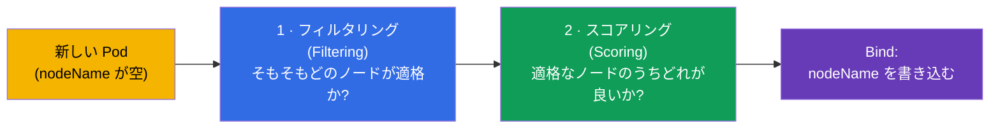
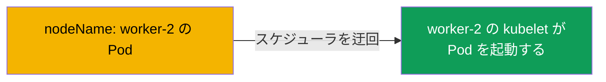
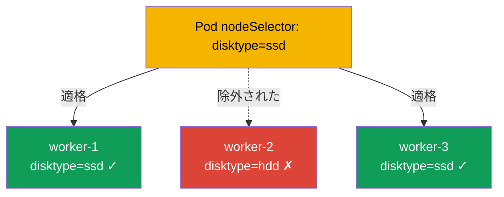
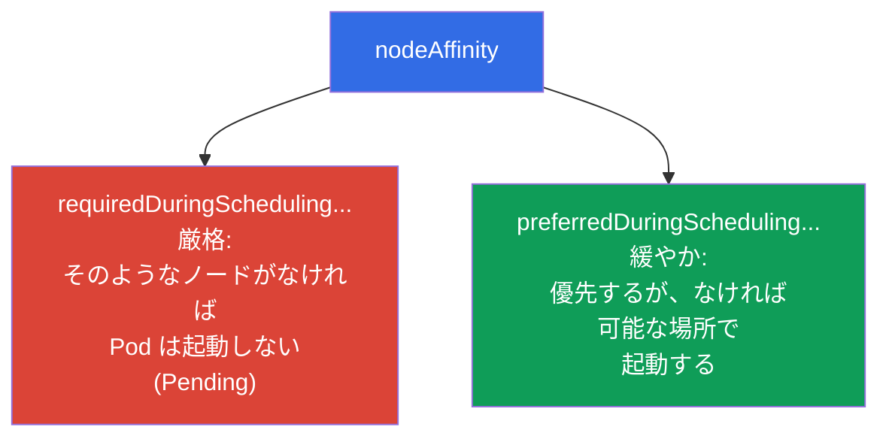
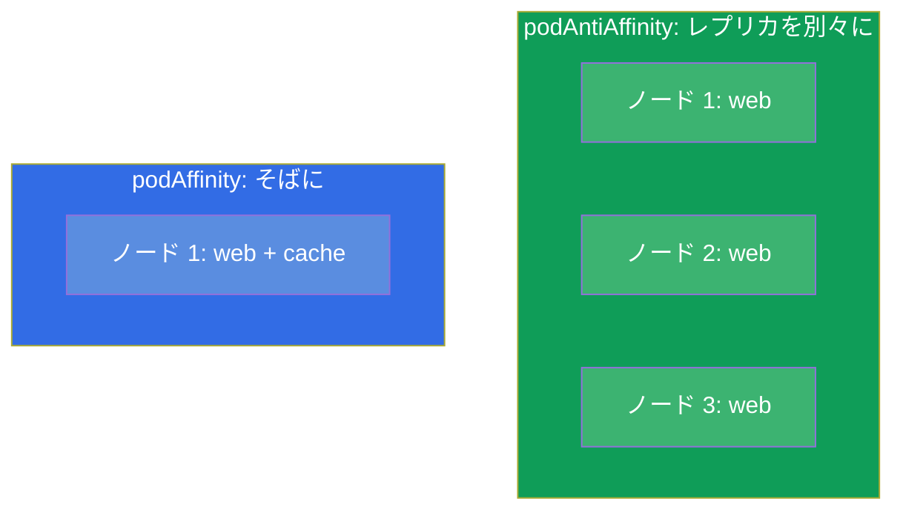
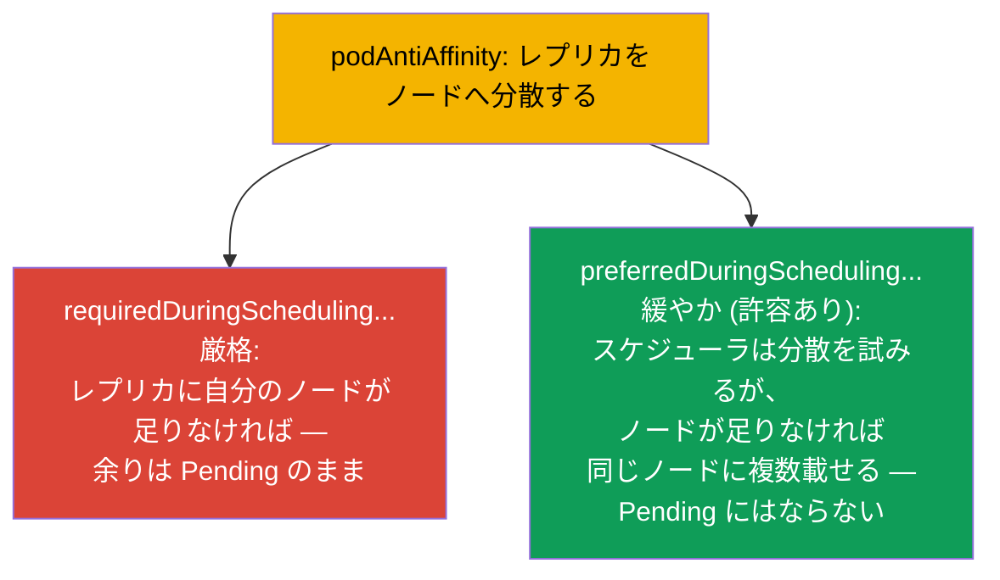
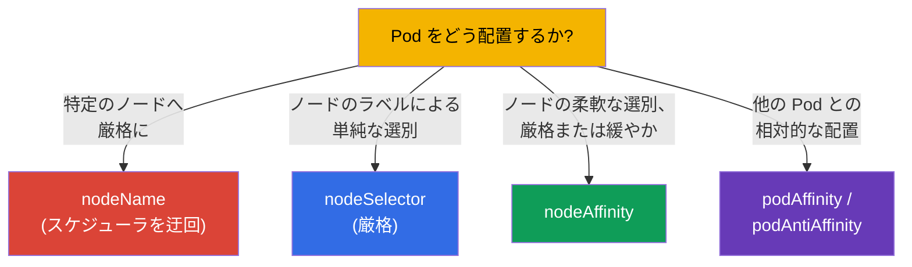
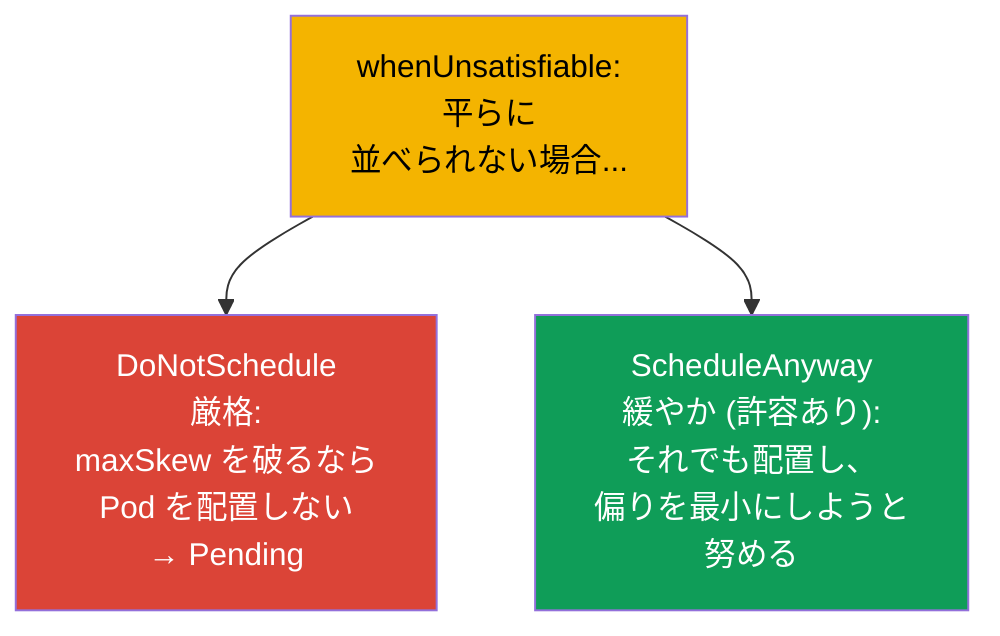

[Русская версия](ru.md) · [Eng version](README.md) · [Versión en español](es.md) · [Version française](fr.md) · [Deutsche Version](de.md) · [ქართული ვერსია](ge.md) · [繁體中文版](tw.md)

# 第 12 章。Pod のスケジューリング：nodeName、nodeSelector、affinity

> **次は何か。** ここまで Pod がどのノードに載るのかを気にしてきませんでした - それは
> スケジューラが決めていました（第 2 章）。これからその判断に影響を与える方法を学びます。
> 単純な手段（`nodeName`、`nodeSelector`）と柔軟な手段（`nodeAffinity`、`podAffinity`、
> `podAntiAffinity`）があります。これは両方の試験の Workloads & Scheduling 領域です。
> Pod の配置の制御は、試験でも（「ラベル X の付いたノードに Pod を配置せよ」）本番でも
> （レプリカをゾーンへ分散する、負荷を GPU ノードに載せる）必要になります。

## 12.1. スケジューラはどうやってノードを選ぶか

第 2 章を思い出しましょう：Pod を作った直後、その `nodeName` は空です。
**kube-scheduler** はそうした Pod を見つけ、2 つの段階でノードを選びます。



- **フィルタリング** は原理的に不適格なノードを落とします：リソースが足りない、
  taints、nodeSelector、affinity を満たさない、といった場合です。
- **スコアリング** は残ったノードを「都合の良さ」（負荷のバランス、近さなど）で
  順位付けし、最良のものを選びます。

私たちは両方の段階に介入できます：ノードの集合を厳しく絞り込むか、緩やかに好みを
「お願い」するかです。単純なものから柔軟なものへ、道具を見ていきましょう。

## 12.2. nodeName：直接指定（スケジューラを迂回する）

もっとも荒っぽい方法は、ノードを Pod に直接書くことです。その場合スケジューラは
まったく関与しません：指定されたノードの kubelet がそのまま Pod を引き取ります。

```yaml
spec:
  nodeName: worker-2       # Pod は厳密にこのノードへ行く
```



欠点は明らかです：そのノードが存在しない、あるいはリソースがない場合、Pod はただ
止まったままになります - 誰も代わりのノードを選んでくれません。`nodeName` はまれにしか
使いません（デバッグ、static Pod - 第 15 章）が、知っておく必要があります：これは
control plane の static Pod がどう動くのかを説明してくれます。

## 12.3. nodeSelector：ノードのラベルによる単純な選別

より実用的な方法は `nodeSelector` です。Pod は指定したラベルを **すべて** 持つノードにしか
行きません。試験でもっとも単純でよく出る仕組みです。

まずノードにラベルを付けます（ノードのラベルは他のオブジェクトのラベルと同じ、第 6 章）：

```bash
kubectl label node worker-1 disktype=ssd
kubectl get nodes --show-labels
```

次に Pod 側で：

```yaml
spec:
  nodeSelector:
    disktype: ssd          # disktype=ssd のラベルを持つノードだけ
```



`nodeSelector` は厳しい条件です - 必要なラベルを持つノードがなければ Pod は `Pending` の
ままです。単純ですが柔軟ではありません：「どちらか一方」「できれば」「〜以外」を表現
できません。そのために affinity があります。

## 12.4. nodeAffinity：ノードの柔軟な選別

**nodeAffinity** は nodeSelector の進化版です。2 つの重要な改善をもたらします：式
(In、NotIn、Exists) と、なにより **2 段階の厳しさ** です。



- **`requiredDuringSchedulingIgnoredDuringExecution`** - 厳格なルール（nodeSelector と
  同じですが式が使えます）。適格なノードがなければ Pod は Pending です。
- **`preferredDuringSchedulingIgnoredDuringExecution`** - 重み付きの緩やかな優先です。
  スケジューラは努力しますが、適格なノードがなくても Pod は起動します。

```yaml
spec:
  affinity:
    nodeAffinity:
      requiredDuringSchedulingIgnoredDuringExecution:
        nodeSelectorTerms:
        - matchExpressions:
          - key: disktype
            operator: In
            values: [ssd, nvme]        # ssd または nvme
      preferredDuringSchedulingIgnoredDuringExecution:
      - weight: 50
        preference:
          matchExpressions:
          - key: zone
            operator: In
            values: [eu-central-1a]    # できればこのゾーンで
```

`IgnoredDuringExecution` の部分はこういう意味です：ルールは **スケジューリング時** にしか
評価されません。あとでノードのラベルが変わっても、すでに起動している Pod は追い出され
ません。

## 12.5. podAffinity と podAntiAffinity：他の Pod との相対的な配置

ときに大事なのは「どのノードか」ではなく「どの Pod のそばか」です。そのために次があります：

- **podAffinity** - 特定のラベルを持つ Pod の **そば** に Pod を配置します
  （たとえば低レイテンシのために、アプリケーションを自分のキャッシュの近くへ）。
- **podAntiAffinity** - 特定のラベルを持つ Pod から **離して** 配置します
  （たとえば同じアプリケーションのレプリカを別々のノードに置き、ノードの障害で
  すべてが同時に落ちないようにする）。



ここでの鍵となる概念は **topologyKey** です：どの基準で「そば」や「遠く」を数えるのか。
ふつうはノードのラベルです：`kubernetes.io/hostname`（ノードの単位）、
`topology.kubernetes.io/zone`（ゾーンの単位）。

```yaml
spec:
  affinity:
    podAntiAffinity:
      requiredDuringSchedulingIgnoredDuringExecution:
      - labelSelector:
          matchLabels:
            app: web
        topologyKey: kubernetes.io/hostname   # 1 ノードに web は 1 つまで
```

この例は `app=web` の 2 つの Pod が同じノードに載らないことを保証します - 耐障害性の
古典的な手法です。

### 厳格なルールと緩やかなルール (required と preferred)

nodeAffinity と同様に、podAffinity/podAntiAffinity にも **2 段階の厳しさ** があり、
その違いは耐障害性にとって本質的です。



- **厳格** (`requiredDuringSchedulingIgnoredDuringExecution`)：ルールは必須です。
  レプリカが適格なノードより多ければ、余った Pod は `Pending` で止まります。分散は
  保証されますが、デプロイが不完全になるリスクがあります。
- **緩やか** (`preferredDuringSchedulingIgnoredDuringExecution` と重み `weight`)：
  スケジューラは *分散を試み* ますが、ノードが足りなければそれでも Pod を配置します
  （1 ノードに複数になってもです）。すべてのレプリカは起動しますが、分散の保証は
  ありません。

> **本番環境とノードのオートスケーラーについての注意。** クラウドのクラスタでは
> `Pending` の Pod はふつう長く「止まったまま」にはなりません：ノードのオートスケーラー
> (Cluster Autoscaler、Karpenter など) がそれを見ていて、配置されていない Pod を
> 見つけるとクラスタへ新しいノードを追加します。`required` ではこれは便利です
> （厳格な分散がノードの追加によって最後まで達成されます）が、注意が必要です：
> 不適切なパラメータ（厳しすぎる antiAffinity のルール、大きすぎる `topologyKey`、
> 過大な requests）だと、オートスケーラーは Pod ごとに新しいノードを次々と立ち上げ、
> クラスタは使いきれていないノードで膨れ上がります - これはコストを直接押し上げます。
> ですから `required` とオートスケーラーの設定は互いに整合させ、それほど重要でない
> 負荷には `preferred` を選びます。

```yaml
spec:
  affinity:
    podAntiAffinity:
      preferredDuringSchedulingIgnoredDuringExecution:   # 緩やか、「許容あり」
      - weight: 100
        podAffinityTerm:
          labelSelector:
            matchLabels:
              app: web
          topologyKey: kubernetes.io/hostname
```

実用的なルール：分散が必須の重要なサービスには `required` を選びます。ノードが
足りなくてもすべてのレプリカが起動することのほうが大事なら `preferred` です。

## 12.6. 配置の仕組みの比較



| 仕組み | 柔軟性 | 厳しさ | スケジューラが関与するか |
|----------|----------|-----------|----------------------|
| `nodeName` | なし | 絶対 | いいえ |
| `nodeSelector` | 低い (ラベルの AND のみ) | 厳格のみ | はい |
| `nodeAffinity` | 高い (式が使える) | 厳格または緩やか | はい |
| `podAffinity/AntiAffinity` | 高い (Pod との相対) | 厳格または緩やか | はい |

さらに **taints/tolerations** もありますが、これは「鏡像」の仕組みです（ノードが Pod を
はじく、Pod がノードを選ぶのではない）。それには独立した第 13 章を割いています。そして
**topologySpreadConstraints** - ゾーン/ノードへの均等な分散です（下で触れます）。

## 12.7. 均等な分散：topologySpreadConstraints

「均等さ」にとってより便利な独立した仕組みが `topologySpreadConstraints` です。許容できる
偏り (`maxSkew`) を指定して「レプリカをゾーン/ノードへできるだけ平らに散らして」と
言えます：

```yaml
spec:
  topologySpreadConstraints:
  - maxSkew: 1
    topologyKey: topology.kubernetes.io/zone
    whenUnsatisfiable: DoNotSchedule
    labelSelector:
      matchLabels:
        app: web
```

- **`maxSkew`** - トポロジー（ゾーン/ノード）間の Pod 数の許容できる最大の差です。
  `maxSkew: 1` はできるだけ平らに散らすことです。
- **`topologyKey`** - 何に沿って分散するか（ゾーン `topology.kubernetes.io/zone`、
  ノード `kubernetes.io/hostname`）。

### 厳格な分散と緩やかな分散 (whenUnsatisfiable)

affinity と同様に、topologySpread にも厳格なモードと緩やかなモードがあり、
`whenUnsatisfiable` フィールドで指定します：



| `whenUnsatisfiable` | ふるまい | 対応するもの |
|---------------------|-----------|--------|
| `DoNotSchedule` | 厳格：違反する Pod は Pending のまま | affinity の `required` |
| `ScheduleAnyway` | 緩やか：Pod はとにかく配置され、偏りは最小化される | affinity の `preferred` |

affinity と同じトレードオフです：`DoNotSchedule` は均等な分散を保証しますが、
ゾーン/ノードが足りないと Pod が `Pending` のまま残ることがあります。`ScheduleAnyway` は
すべての Pod が起動することを保証しますが、偏りを許します。

topologySpreadConstraints は、レプリカをゾーン/ノードへ耐障害的に分散するための現代的で
しばしば好まれる方法です - podAntiAffinity を組み立てるよりきれいです。

## 12.8. 本番環境でこれをどう使うか

- **耐障害性のためのレプリカの分散。** 主な用途は、レプリカを異なるノードとアベイラビリティ
  ゾーンへ散らし、ノード/ゾーンの障害がサービス全体を落とさないようにすることです。本番では
  `podAntiAffinity` か（より多くは）`topologySpreadConstraints` で行います。
- **ノードの種類への負荷の割り当て。** GPU のジョブは GPU ノードへ、メモリを多く使うものは
  RAM の大きいノードへ、ingress は専用ノードへ。ノードのラベルによる nodeSelector/
  nodeAffinity で実現します（ラベルはクラウドが自動で付けることが多いです：インスタンスの
  種類、ゾーン、アーキテクチャ）。
- **レイテンシのための同一配置。** podAffinity はアプリケーションをそのキャッシュ/ローカルな
  依存のそばに置き、ネットワークの遅延を下げます - ただし耐障害性を失わないよう慎重に
  使います。
- **nodeName はほぼ使いません。** 本番での直接指定はアンチパターンです（耐障害性と負荷分散を
  失います）。例外は control plane の static Pod です（第 15 章）。
- **緩やかなルールのほうが好ましい。** 厳格な (`required`) ルールの乱用は、適格なノードが
  残っていないときに `Pending` を招きがちです。経験のあるチームは可能なかぎり
  `preferred`/`topologySpread` を使い、Pod がどこかで起動するようにします。

## 12.9. ミニ用語集

- **kube-scheduler** - Pod のノードを選ぶコンポーネント（フィルタリング + スコアリング）。
- **nodeName** - スケジューラを迂回してノードを厳格に指定すること。
- **nodeSelector** - ノードのラベルによる単純で厳格な選別。
- **nodeAffinity** - ノードの柔軟な選別。`required`（厳格）と `preferred`（緩やか）。
- **podAffinity** - ラベルで指定した Pod のそばに Pod を配置すること。
- **podAntiAffinity** - ラベルで指定した Pod から離して Pod を配置すること。
- **topologyKey** - 「隣接のゾーン」を定義するノードのラベル (hostname、zone)。
- **topologySpreadConstraints** - トポロジーに沿った Pod の均等な分散
  (`maxSkew`)。
- **whenUnsatisfiable** - topologySpread のモード：`DoNotSchedule`（厳格、→ Pending）か
  `ScheduleAnyway`（緩やか、偏りを許容）。
- **required と preferred** - affinity の配置ルールにおける厳格な（必須の）ものと
  緩やかな（可能なかぎりの）もの。
- **IgnoredDuringExecution** - ルールはスケジューリング時に評価されるが、すでに起動している
  Pod を追い出さないこと。

## 12.10. 本章のまとめ

- スケジューラは 2 つの段階でノードを選びます：フィルタリング（誰が適格か）と
  スコアリング（誰が良いか）。
- `nodeName` - スケジューラを迂回する厳格な直接指定。脆く、まれにしか使いません。
- `nodeSelector` - ノードのラベルによる単純で厳格な選別。適格なノードがなければ Pending です。
- `nodeAffinity` - 式が使える柔軟な選別で、2 段階あります：`required`（厳格）と
  `preferred`（緩やか）。
- `podAffinity`/`podAntiAffinity` は他の Pod との相対で Pod を配置します。鍵は
  `topologyKey` (hostname、zone) です。
- `topologySpreadConstraints` - レプリカをゾーン/ノードへ平らに分散する便利な方法
  (`maxSkew`)。
- 厳格な分散と緩やかな分散：`required`/`DoNotSchedule`（分散の保証、ただし Pending の
  リスク）と `preferred`/`ScheduleAnyway`（すべての Pod が起動するが偏りはありうる）。
- 本番での主な用途は耐障害性（レプリカの分散）とノードの種類への負荷の割り当てです。
  厳格なルールの乱用は危険です (Pending)。

## 12.11. これがどう役に立つか：試験と実際の仕事で

**試験では。** 「ラベル X の付いたノードに Pod を配置せよ」(nodeSelector)、
「nodeAffinity / podAntiAffinity を設定せよ」は Workloads & Scheduling の典型的な問題です。
ノードにラベルを付けられること (`kubectl label node`)、nodeSelector と affinity の構造を
書けること、required と preferred を区別できることが必要です。「なぜ Pod が Pending なのか」
の調査は、まさに厳格な配置ルールに行き当たることが多いです。

**実際の仕事では。** Pod の正しい配置は耐障害性（レプリカをゾーンへ）と効率
（適切なノードへの負荷）の土台です。podAntiAffinity/topologySpread はノードやゾーン全体の
障害からサービスを守り、nodeAffinity はジョブを必要なハードウェア (GPU、メモリ) に載せます。
これは負荷を設計するときの日常的なアーキテクチャの判断です。

## 12.12. 自己チェックの質問

1. スケジューラによるノードの選択は、どの 2 つの段階からなりますか？
2. `nodeName` は `nodeSelector` とどう違い、なぜ `nodeName` は脆いのですか？
3. nodeAffinity が与える 2 段階の厳しさは何で、実際には何が違いますか？
4. podAffinity と podAntiAffinity の違いは何ですか？それぞれの利用例を挙げてください。
5. `topologyKey` とは何で、それを使ってレプリカをノードへ「分散する」にはどうしますか？
6. 均等な分散のために `topologySpreadConstraints` が podAntiAffinity より便利なのはなぜですか？
7. なぜ厳格なルールの乱用は Pod を Pending にしてしまうのですか？

## 演習

Pod をノードへ引き寄せる方法を学びました。第 13 章では逆の仕組み - ノードが Pod を
**はじく** taints と tolerations を見ます。スケジューリングはワークロードのラボで
練習します。

🧪 ラボ 122 (scheduling ドリル: nodeSelector、affinity、taints): [tasks/cka/labs/122](../../labs/122/README_JP.MD)

---
[目次](../README_JP.md) · [第 11 章](../11/jp.md) · [第 13 章](../13/jp.md)
