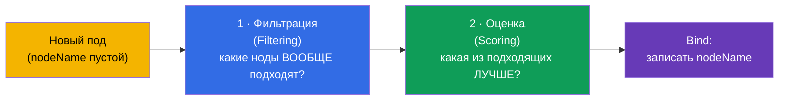
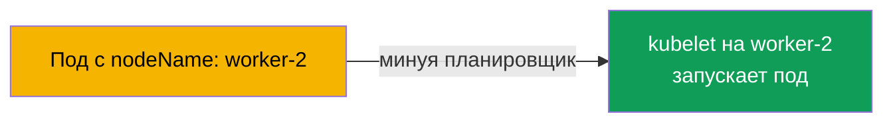
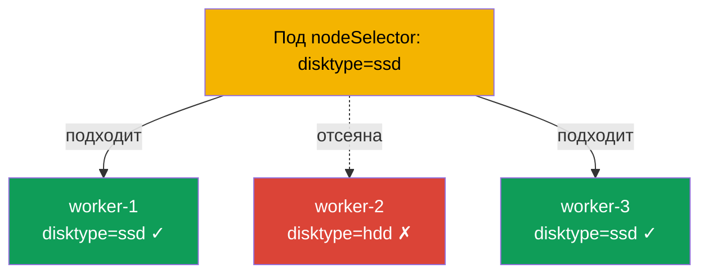
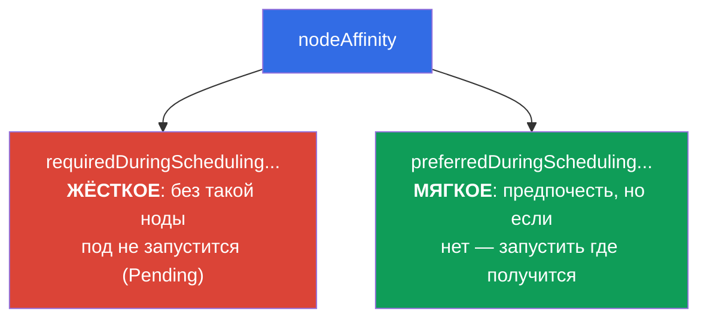
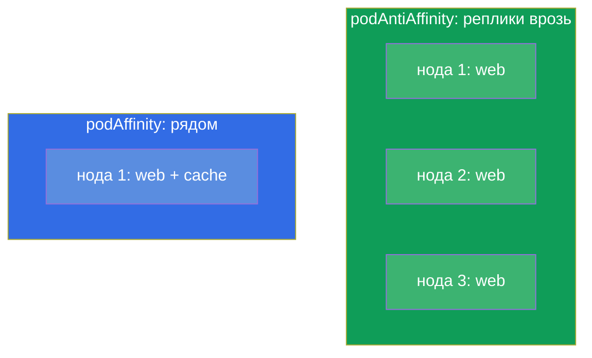
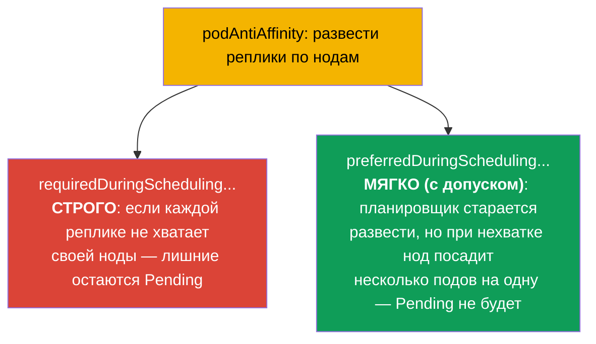
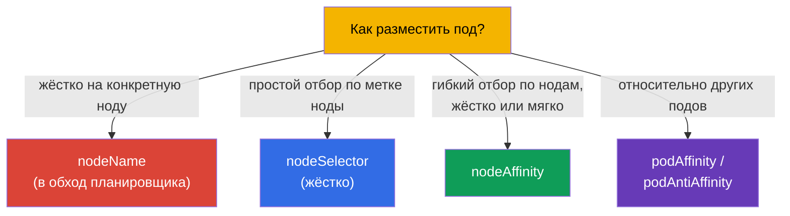
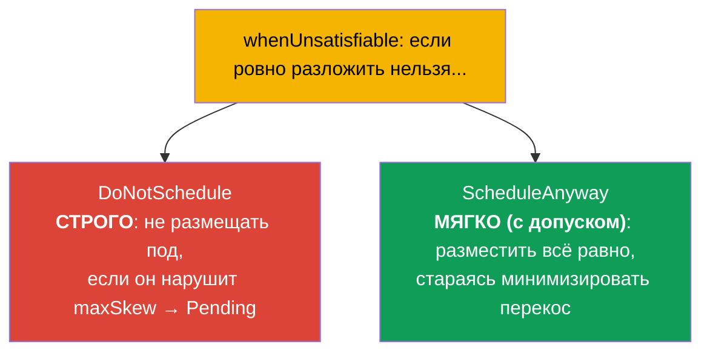

# Глава 12. Планирование подов: nodeName, nodeSelector, affinity

> **Что дальше.** До сих пор мы не задумывались, на какую ноду попадёт под - это решал
> планировщик (глава 2). Теперь научимся влиять на его решение. Есть простые способы
> (`nodeName`, `nodeSelector`) и гибкие (`nodeAffinity`, `podAffinity`,
> `podAntiAffinity`). Это домен Workloads & Scheduling обоих экзаменов. Управление
> размещением подов - то, что нужно и на экзамене («размести под на ноде с меткой X»),
> и в проде (разнести реплики по зонам, посадить нагрузку на GPU-ноды).

## 12.1. Как планировщик выбирает ноду

Вспомним из главы 2: когда вы создаёте под, у него сначала пустой `nodeName`.
**kube-scheduler** находит такие поды и выбирает им ноду в два этапа.



- **Фильтрация** отсеивает ноды, которые не подходят в принципе: не хватает ресурсов,
  не проходят по taints, nodeSelector, affinity.
- **Оценка** ранжирует оставшиеся ноды по «удобству» (баланс нагрузки, близость и т.д.)
  и выбирает лучшую.

Мы можем вмешаться в оба этапа: жёстко ограничить набор нод или мягко «попросить»
предпочтение. Разберём инструменты от простого к гибкому.

## 12.2. nodeName: прямое назначение (в обход планировщика)

Самый грубый способ - прописать ноду прямо в поде. Тогда планировщик вообще не участвует:
kubelet указанной ноды просто берёт под.

```yaml
spec:
  nodeName: worker-2       # под пойдёт строго на эту ноду
```



Минусы очевидны: если такой ноды нет или на ней нет ресурсов, под просто зависнет - никто
не подберёт альтернативу. `nodeName` используют редко (отладка, статические поды - глава
15), но знать надо: это объясняет, как работают статические поды control plane.

## 12.3. nodeSelector: простой отбор по меткам ноды

Более практичный способ - `nodeSelector`. Под поедет только на ноды, у которых есть
**все** указанные метки. Это самый простой и частый механизм на экзамене.

Сначала помечаем ноды (метки нод - как метки любых объектов, глава 6):

```bash
kubectl label node worker-1 disktype=ssd
kubectl get nodes --show-labels
```

Затем в поде:

```yaml
spec:
  nodeSelector:
    disktype: ssd          # только на ноды с меткой disktype=ssd
```



`nodeSelector` - жёсткое условие: нет ноды с нужной меткой - под висит в `Pending`. Он
прост, но не гибок: нельзя выразить «или/или», «предпочтительно», «кроме». Для этого есть
affinity.

## 12.4. nodeAffinity: гибкий отбор по нодам

**nodeAffinity** - продвинутая версия nodeSelector. Даёт два важных улучшения: выражения
(In, NotIn, Exists) и, главное, **два уровня жёсткости**.



- **`requiredDuringSchedulingIgnoredDuringExecution`** - жёсткое правило (как
  nodeSelector, но с выражениями). Нет подходящей ноды - под в Pending.
- **`preferredDuringSchedulingIgnoredDuringExecution`** - мягкое предпочтение с весом.
  Планировщик постарается, но при отсутствии подходящей ноды всё равно запустит под.

```yaml
spec:
  affinity:
    nodeAffinity:
      requiredDuringSchedulingIgnoredDuringExecution:
        nodeSelectorTerms:
        - matchExpressions:
          - key: disktype
            operator: In
            values: [ssd, nvme]        # ssd ИЛИ nvme
      preferredDuringSchedulingIgnoredDuringExecution:
      - weight: 50
        preference:
          matchExpressions:
          - key: zone
            operator: In
            values: [eu-central-1a]    # желательно в этой зоне
```

Часть `IgnoredDuringExecution` означает: правило проверяется только при **планировании**.
Если метки ноды позже изменятся, уже запущенный под не выселят.

## 12.5. podAffinity и podAntiAffinity: размещение относительно других подов

Иногда важно не «какая нода», а «рядом с какими подами». Для этого есть:

- **podAffinity** - разместить под **рядом** с подами, у которых определённые метки
  (например, приложение поближе к своему кешу для низкой задержки).
- **podAntiAffinity** - разместить **подальше** от подов с определёнными метками
  (например, реплики одного приложения - на разных нодах, чтобы падение ноды не убило
  все сразу).



Ключевое понятие здесь - **topologyKey**: по какому признаку считать «рядом» или
«далеко». Обычно это метка ноды: `kubernetes.io/hostname` (в пределах ноды),
`topology.kubernetes.io/zone` (в пределах зоны).

```yaml
spec:
  affinity:
    podAntiAffinity:
      requiredDuringSchedulingIgnoredDuringExecution:
      - labelSelector:
          matchLabels:
            app: web
        topologyKey: kubernetes.io/hostname   # не более одного web на ноду
```

Этот пример гарантирует, что два пода `app=web` не окажутся на одной ноде - классический
приём отказоустойчивости.

### Строгое и мягкое правило (required против preferred)

Как и у nodeAffinity, у podAffinity/podAntiAffinity **два уровня жёсткости**, и разница
принципиальна для отказоустойчивости.



- **Строго** (`requiredDuringSchedulingIgnoredDuringExecution`): правило обязательно.
  Реплик больше, чем подходящих нод, - лишние поды зависнут в `Pending`. Гарантирует
  разнос, но рискует недодеплоить.
- **Мягко** (`preferredDuringSchedulingIgnoredDuringExecution` с весом `weight`):
  планировщик *старается* развести, но если нод не хватает - всё равно разместит поды
  (пусть и по несколько на ноду). Все реплики поднимутся, но без гарантии разноса.

```yaml
spec:
  affinity:
    podAntiAffinity:
      preferredDuringSchedulingIgnoredDuringExecution:   # мягко, «с допуском»
      - weight: 100
        podAffinityTerm:
          labelSelector:
            matchLabels:
              app: web
          topologyKey: kubernetes.io/hostname
```

Практическое правило: для критичных сервисов, где разнос обязателен, берут `required`;
если важнее, чтобы все реплики запустились даже при нехватке нод, - `preferred`.

## 12.6. Сравнение механизмов размещения



| Механизм | Гибкость | Жёсткость | Планировщик участвует |
|----------|----------|-----------|----------------------|
| `nodeName` | нет | абсолютная | нет |
| `nodeSelector` | низкая (только AND по меткам) | только жёстко | да |
| `nodeAffinity` | высокая (выражения) | жёстко или мягко | да |
| `podAffinity/AntiAffinity` | высокая (относительно подов) | жёстко или мягко | да |

Ещё есть **taints/tolerations** - но это «зеркальный» механизм (нода отталкивает поды, а
не под выбирает ноду), ему посвящена отдельная глава 13. И **topologySpreadConstraints** -
равномерное распределение по зонам/нодам (упомянем ниже).

## 12.7. Равномерное распределение: topologySpreadConstraints

Отдельный, более удобный для «равномерности» механизм - `topologySpreadConstraints`. Он
позволяет сказать «раскидай реплики максимально ровно по зонам/нодам», задав допустимый
перекос (`maxSkew`):

```yaml
spec:
  topologySpreadConstraints:
  - maxSkew: 1
    topologyKey: topology.kubernetes.io/zone
    whenUnsatisfiable: DoNotSchedule
    labelSelector:
      matchLabels:
        app: web
```

- **`maxSkew`** - максимально допустимая разница числа подов между топологиями (зонами/
  нодами). `maxSkew: 1` - раскидать максимально ровно.
- **`topologyKey`** - по чему распределять (зона `topology.kubernetes.io/zone`, нода
  `kubernetes.io/hostname`).

### Строгое и мягкое распределение (whenUnsatisfiable)

Как и у affinity, у topologySpread есть строгий и мягкий режим - задаётся полем
`whenUnsatisfiable`:



| `whenUnsatisfiable` | Поведение | Аналог |
|---------------------|-----------|--------|
| `DoNotSchedule` | строго: нарушающий под остаётся Pending | `required` у affinity |
| `ScheduleAnyway` | мягко: под всё равно разместят, перекос минимизируют | `preferred` у affinity |

Тот же компромисс, что и в affinity: `DoNotSchedule` гарантирует ровное распределение, но
может оставить поды в `Pending` при нехватке зон/нод; `ScheduleAnyway` гарантирует, что
все поды запустятся, но допускает перекос.

topologySpreadConstraints - современный и часто предпочтительный способ добиться
отказоустойчивого распределения реплик по зонам/нодам - чище, чем городить podAntiAffinity.

## 12.8. Как это применяют в продакшене

- **Разнос реплик для отказоустойчивости.** Главное применение - раскидать реплики по
  разным нодам и зонам доступности, чтобы падение ноды/зоны не убило весь сервис. В проде
  это делают через `podAntiAffinity` или (чаще) `topologySpreadConstraints`.
- **Привязка нагрузки к типу нод.** GPU-задачи - на GPU-ноды, память-ёмкие - на ноды с
  большой RAM, ingress - на выделенные ноды. Реализуют через nodeSelector/nodeAffinity по
  меткам нод (их часто проставляет облако автоматически: тип инстанса, зона, архитектура).
- **Совместное размещение для латентности.** podAffinity сажает приложение рядом с его
  кешем/локальной зависимостью, снижая сетевые задержки - но применяют аккуратно, чтобы
  не потерять отказоустойчивость.
- **nodeName почти не используют.** В проде прямое назначение - антипаттерн (теряется
  отказоустойчивость и балансировка). Исключение - статические поды control plane
  (глава 15).
- **Мягкие правила предпочтительнее.** Злоупотребление жёсткими (`required`) правилами
  часто приводит к `Pending`, когда подходящих нод не осталось. Опытные команды по
  возможности используют `preferred`/`topologySpread`, чтобы под всё же где-то запустился.

## 12.9. Мини-глоссарий

- **kube-scheduler** - компонент, выбирающий ноду для пода (фильтрация + оценка).
- **nodeName** - жёсткое назначение ноды в обход планировщика.
- **nodeSelector** - простой жёсткий отбор ноды по её меткам.
- **nodeAffinity** - гибкий отбор нод; `required` (жёстко) и `preferred` (мягко).
- **podAffinity** - размещать под рядом с подами по меткам.
- **podAntiAffinity** - размещать под подальше от подов по меткам.
- **topologyKey** - метка ноды, определяющая «зону соседства» (hostname, zone).
- **topologySpreadConstraints** - равномерное распределение подов по топологии
  (`maxSkew`).
- **whenUnsatisfiable** - режим topologySpread: `DoNotSchedule` (строго, → Pending) или
  `ScheduleAnyway` (мягко, с допуском перекоса).
- **required vs preferred** - строгое (обязательное) против мягкого (по возможности)
  правило размещения у affinity.
- **IgnoredDuringExecution** - правило проверяется при планировании, но не выселяет уже
  запущенный под.

## 12.10. Итоги главы

- Планировщик выбирает ноду в два этапа: фильтрация (кто подходит) и оценка (кто лучше).
- `nodeName` - жёсткое прямое назначение в обход планировщика; хрупко, применяют редко.
- `nodeSelector` - простой жёсткий отбор по меткам ноды; нет подходящей ноды - Pending.
- `nodeAffinity` - гибкий отбор с выражениями и двумя уровнями: `required` (жёстко) и
  `preferred` (мягко).
- `podAffinity`/`podAntiAffinity` размещают под относительно других подов; ключ -
  `topologyKey` (hostname, zone).
- `topologySpreadConstraints` - удобный способ ровно распределить реплики по
  зонам/нодам (`maxSkew`).
- Строгое vs мягкое распределение: `required`/`DoNotSchedule` (гарантия разноса, но риск
  Pending) против `preferred`/`ScheduleAnyway` (все поды запустятся, но перекос возможен).
- В проде главное применение - отказоустойчивость (разнос реплик) и привязка нагрузок к
  типам нод; жёсткими правилами злоупотреблять опасно (Pending).

## 12.11. Как это пригодится: на экзамене и в реальной работе

**На экзамене.** «Размести под на ноде с меткой X» (nodeSelector), «настрой nodeAffinity /
podAntiAffinity» - типовые задания Workloads & Scheduling. Нужно уметь метить ноды
(`kubectl label node`), писать nodeSelector и структуру affinity, различать required и
preferred. Диагностика «почему под в Pending» часто упирается именно в жёсткие правила
размещения.

**В реальной работе.** Правильное размещение подов - основа отказоустойчивости
(реплики по зонам) и эффективности (нагрузка на подходящие ноды). podAntiAffinity/
topologySpread защищают сервис от падения ноды или целой зоны, а nodeAffinity сажает
задачи на нужное железо (GPU, память). Это ежедневные архитектурные решения при
проектировании нагрузок.

## 12.12. Вопросы для самопроверки

1. Из каких двух этапов состоит выбор ноды планировщиком?
2. Чем `nodeName` отличается от `nodeSelector` и почему `nodeName` хрупок?
3. Какие два уровня жёсткости даёт nodeAffinity и чем они отличаются на практике?
4. В чём разница между podAffinity и podAntiAffinity? Приведите пример применения
   каждого.
5. Что такое `topologyKey` и как с его помощью «развести» реплики по нодам?
6. Чем `topologySpreadConstraints` удобнее podAntiAffinity для равномерного распределения?
7. Почему злоупотребление жёсткими правилами приводит к подам в Pending?

## Практика

Мы научились притягивать поды к нодам. В главе 13 разберём обратный механизм - taints и
tolerations, которыми ноды **отталкивают** поды. Планирование отрабатывается в лабах по
рабочим нагрузкам.

🧪 Лаба 122 (scheduling-дриллы: nodeSelector, affinity, taints): [tasks/cka/labs/122](../../labs/122/README_RU.MD)

---
[Оглавление](../README_RU.md) · [Глава 11](../11/ru.md) · [Глава 13](../13/ru.md)
