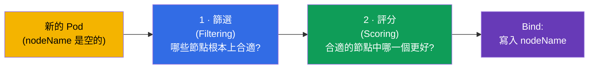
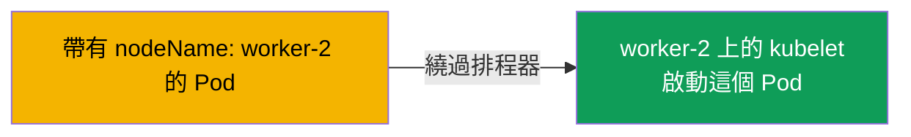
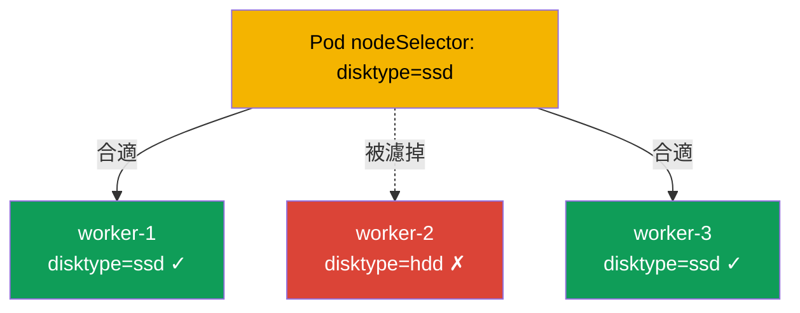
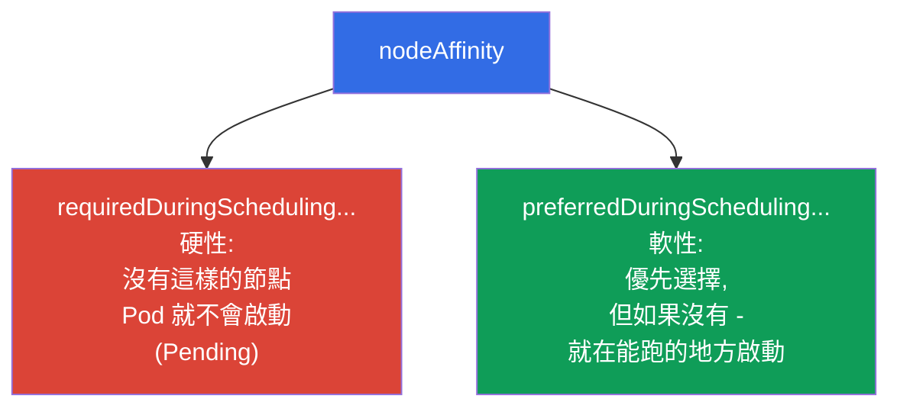
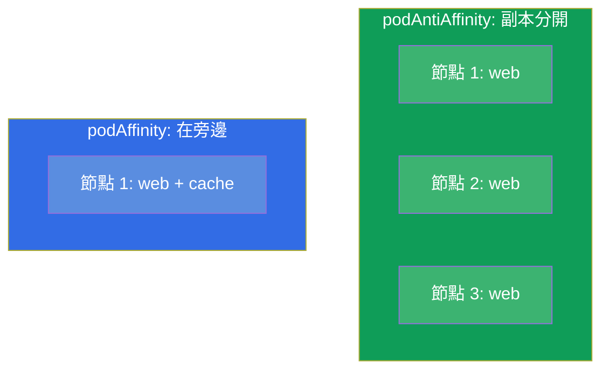
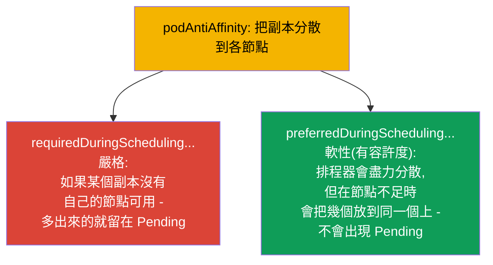
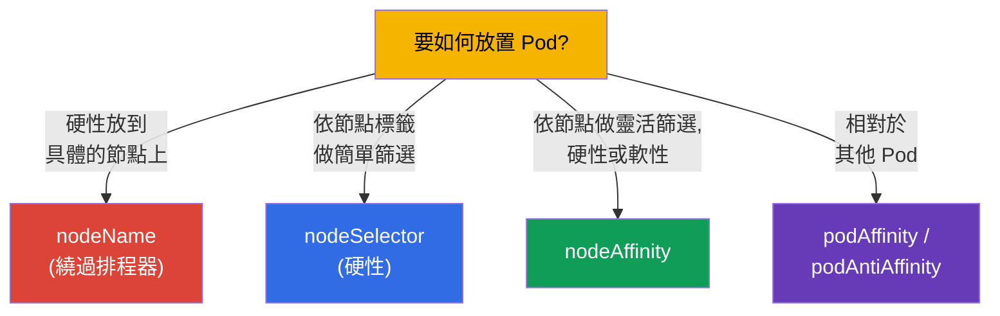
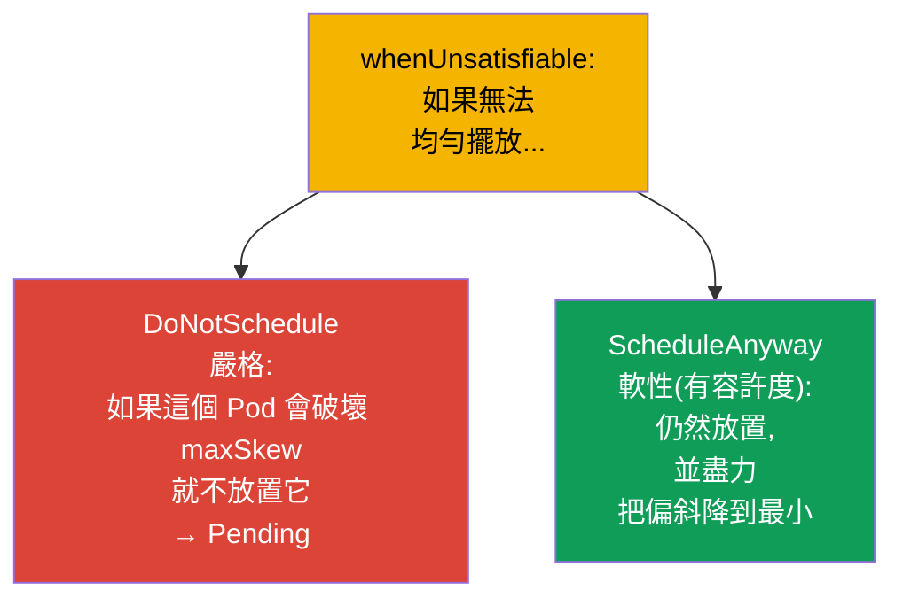

[Русская версия](ru.md) · [Eng version](README.md) · [Versión en español](es.md) · [Version française](fr.md) · [Deutsche Version](de.md) · [ქართული ვერსია](ge.md) · [日本語版](jp.md)

# 第 12 章。Pod 的排程:nodeName、nodeSelector、affinity

> **接下來是什麼。** 到目前為止我們都沒去想 Pod 會落到哪個節點上 - 那是由
> 排程器決定的(第 2 章)。現在我們要學會影響它的決定。有簡單的方式
> (`nodeName`、`nodeSelector`),也有靈活的方式(`nodeAffinity`、`podAffinity`、
> `podAntiAffinity`)。這是兩場考試的 Workloads & Scheduling 領域。管理
> Pod 的放置位置,既是考試需要的(「把 Pod 放到帶有標籤 X 的節點上」),
> 也是生產環境需要的(把副本分散到各可用區、把負載安置到 GPU 節點上)。

## 12.1. 排程器如何選擇節點

回想一下第 2 章:當你建立一個 Pod 時,它一開始的 `nodeName` 是空的。
**kube-scheduler** 會找到這樣的 Pod,並用兩個階段為它們選擇節點。



- **篩選** 會濾掉原則上就不合適的節點:資源不足、
  在 taints、nodeSelector、affinity 上通不過。
- **評分** 會依「方便程度」(負載的平衡、鄰近程度等)為剩下的節點排名,
  並選出最好的那一個。

我們可以介入這兩個階段:硬性限制節點的集合,或是軟性地「請求」
某個偏好。我們從簡單到靈活逐一拆解這些工具。

## 12.2. nodeName:直接指派(繞過排程器)

最粗暴的方式 - 直接把節點寫進 Pod 裡。這樣排程器完全不參與:
指定節點上的 kubelet 直接把這個 Pod 接走。

```yaml
spec:
  nodeName: worker-2       # Pod 會嚴格地跑到這個節點上
```



缺點很明顯:如果這樣的節點不存在,或者它上面沒有資源,Pod 就會直接卡住 -
沒有人會去挑一個替代方案。`nodeName` 很少使用(除錯、靜態 Pod - 第
15 章),但必須知道它:它解釋了 control plane 的靜態 Pod 是如何運作的。

## 12.3. nodeSelector:依節點標籤做簡單篩選

更實用的方式是 `nodeSelector`。Pod 只會跑到那些帶有**全部**指定標籤的
節點上。這是考試中最簡單也最常見的機制。

首先為節點打上標籤(節點的標籤跟任何物件的標籤一樣,第 6 章):

```bash
kubectl label node worker-1 disktype=ssd
kubectl get nodes --show-labels
```

然後在 Pod 中:

```yaml
spec:
  nodeSelector:
    disktype: ssd          # 只跑到帶有標籤 disktype=ssd 的節點上
```



`nodeSelector` 是硬性條件:沒有帶著所需標籤的節點 - Pod 就掛在 `Pending`。
它很簡單,但不靈活:無法表達「或者/或者」、「最好是」、「除了」。要做到這些,
就有 affinity。

## 12.4. nodeAffinity:依節點做靈活篩選

**nodeAffinity** 是 nodeSelector 的進階版本。它帶來兩個重要的改進:表達式
(In、NotIn、Exists),以及最重要的 - **兩種硬度層級**。



- **`requiredDuringSchedulingIgnoredDuringExecution`** - 硬性規則(就像
  nodeSelector,但帶有表達式)。沒有合適的節點 - Pod 就在 Pending。
- **`preferredDuringSchedulingIgnoredDuringExecution`** - 帶權重的軟性偏好。
  排程器會盡力嘗試,但在沒有合適節點時仍然會啟動這個 Pod。

```yaml
spec:
  affinity:
    nodeAffinity:
      requiredDuringSchedulingIgnoredDuringExecution:
        nodeSelectorTerms:
        - matchExpressions:
          - key: disktype
            operator: In
            values: [ssd, nvme]        # ssd 或 nvme
      preferredDuringSchedulingIgnoredDuringExecution:
      - weight: 50
        preference:
          matchExpressions:
          - key: zone
            operator: In
            values: [eu-central-1a]    # 最好在這個可用區
```

`IgnoredDuringExecution` 這一部分的意思是:規則只在**排程時**檢查。
如果節點的標籤後來改變了,已經啟動的 Pod 不會被驅逐。

## 12.5. podAffinity 與 podAntiAffinity:相對於其他 Pod 的放置

有時重要的不是「哪個節點」,而是「在哪些 Pod 旁邊」。為此有:

- **podAffinity** - 把 Pod 放在帶有特定標籤的 Pod **旁邊**
  (例如,讓應用程式靠近自己的快取以取得低延遲)。
- **podAntiAffinity** - 把 Pod 放得**離**帶有特定標籤的 Pod **遠一些**
  (例如,同一個應用程式的副本 - 放在不同節點上,這樣節點掛掉不會
  一次把全部都弄死)。



這裡的關鍵概念是 **topologyKey**:依什麼標準來算「旁邊」或
「很遠」。通常這是節點的標籤:`kubernetes.io/hostname`(在節點範圍內)、
`topology.kubernetes.io/zone`(在可用區範圍內)。

```yaml
spec:
  affinity:
    podAntiAffinity:
      requiredDuringSchedulingIgnoredDuringExecution:
      - labelSelector:
          matchLabels:
            app: web
        topologyKey: kubernetes.io/hostname   # 每個節點上不超過一個 web
```

這個例子保證兩個 `app=web` 的 Pod 不會落在同一個節點上 - 這是經典的
容錯手法。

### 嚴格與軟性的規則(required 對比 preferred)

跟 nodeAffinity 一樣,podAffinity/podAntiAffinity 有**兩種硬度層級**,而這個
差別對容錯來說是根本性的。



- **嚴格**(`requiredDuringSchedulingIgnoredDuringExecution`):規則是必須遵守的。
  副本比合適的節點還多 - 多出來的 Pod 就會掛在 `Pending`。它保證了
  分散,但有部署不完整的風險。
- **軟性**(`preferredDuringSchedulingIgnoredDuringExecution`,帶有權重 `weight`):
  排程器*會盡力*分散,但如果節點不夠 - 它仍然會把 Pod 放上去
  (即使一個節點上放好幾個)。所有副本都會起來,但沒有分散的保證。

> **關於生產環境與節點自動擴縮器的一點說明。** 在雲端叢集中,處於 `Pending`
> 的 Pod 通常不會「卡」太久:有節點自動擴縮器(Cluster Autoscaler、Karpenter
> 之類)在盯著它們 - 一看到沒有被放置的 Pod,它就往叢集裡加一個新節點。搭配
> `required` 這很方便(硬性分散靠著把節點拉起來而得以完成),但需要小心:
> 在參數不當時(antiAffinity 規則過於嚴格、`topologyKey` 太大、
> requests 開得太高),自動擴縮器會為每一個 Pod 不斷拉起新節點,而
> 叢集就會由一堆負載不足的節點膨脹起來 - 這會直接推高成本。
> 因此 `required` 與自動擴縮器的設定要互相協調,而對於比較不
> 關鍵的負載,則偏好使用 `preferred`。

```yaml
spec:
  affinity:
    podAntiAffinity:
      preferredDuringSchedulingIgnoredDuringExecution:   # 軟性,「有容許度」
      - weight: 100
        podAffinityTerm:
          labelSelector:
            matchLabels:
              app: web
          topologyKey: kubernetes.io/hostname
```

實務上的規則:對於必須分散的關鍵服務,採用 `required`;
如果更重要的是即使節點不足所有副本也都要啟動 - 那就 `preferred`。

## 12.6. 放置機制的比較



| 機制 | 靈活度 | 硬度 | 排程器參與 |
|----------|----------|-----------|----------------------|
| `nodeName` | 沒有 | 絕對 | 不參與 |
| `nodeSelector` | 低(只有標籤的 AND) | 只有硬性 | 參與 |
| `nodeAffinity` | 高(表達式) | 硬性或軟性 | 參與 |
| `podAffinity/AntiAffinity` | 高(相對於 Pod) | 硬性或軟性 | 參與 |

另外還有 **taints/tolerations** - 但那是「鏡像」機制(是節點推開 Pod,而
不是 Pod 選擇節點),它有專門的第 13 章。以及 **topologySpreadConstraints** -
在各可用區/節點上的均勻分佈(下面會提到)。

## 12.7. 均勻分佈:topologySpreadConstraints

有一個獨立、對「均勻性」更方便的機制 - `topologySpreadConstraints`。它
讓你可以說「把副本盡可能均勻地撒到各可用區/節點上」,只要設定可容許的
偏斜(`maxSkew`):

```yaml
spec:
  topologySpreadConstraints:
  - maxSkew: 1
    topologyKey: topology.kubernetes.io/zone
    whenUnsatisfiable: DoNotSchedule
    labelSelector:
      matchLabels:
        app: web
```

- **`maxSkew`** - 各拓樸(可用區/節點)之間 Pod 數量最大可容許的差值。
  `maxSkew: 1` - 盡可能均勻地撒開。
- **`topologyKey`** - 依什麼來分佈(可用區 `topology.kubernetes.io/zone`、節點
  `kubernetes.io/hostname`)。

### 嚴格與軟性的分佈(whenUnsatisfiable)

跟 affinity 一樣,topologySpread 也有嚴格與軟性兩種模式 - 由
`whenUnsatisfiable` 這個欄位設定:



| `whenUnsatisfiable` | 行為 | 對應的類比 |
|---------------------|-----------|--------|
| `DoNotSchedule` | 嚴格:違反規則的 Pod 留在 Pending | affinity 的 `required` |
| `ScheduleAnyway` | 軟性:Pod 仍然會被放置,偏斜會被降到最小 | affinity 的 `preferred` |

跟 affinity 中一樣的取捨:`DoNotSchedule` 保證均勻分佈,但在可用區/節點
不足時可能讓 Pod 留在 `Pending`;`ScheduleAnyway` 保證所有 Pod 都會啟動,
但允許偏斜。

topologySpreadConstraints 是達成副本在各可用區/節點上容錯分佈的現代且
常被優先採用的方式 - 比堆砌 podAntiAffinity 乾淨得多。

## 12.8. 這在生產環境中如何應用

- **為了容錯而分散副本。** 主要的用途 - 把副本撒到不同的節點與可用區上,
  讓節點/可用區掛掉不會弄死整個服務。在生產環境中,這是透過
  `podAntiAffinity` 或(更常見的)`topologySpreadConstraints` 來做。
- **把負載綁定到某類節點。** GPU 任務 - 放到 GPU 節點上,吃記憶體的 -
  放到 RAM 大的節點上,ingress - 放到專用節點上。這是透過依節點標籤的
  nodeSelector/nodeAffinity 實作(這些標籤常由雲端自動打上:實例類型、可用區、架構)。
- **為了延遲而共同放置。** podAffinity 把應用程式安置在它的
  快取/本地依賴旁邊,降低網路延遲 - 但要謹慎使用,以免
  失去容錯能力。
- **nodeName 幾乎不用。** 在生產環境中直接指派是反模式(會失去
  容錯與負載平衡)。例外是 control plane 的靜態 Pod
  (第 15 章)。
- **軟性規則更可取。** 濫用硬性(`required`)規則
  常常導致 `Pending`,也就是已經沒有合適的節點了。有經驗的團隊會盡可能
  使用 `preferred`/`topologySpread`,讓 Pod 至少能在某個地方啟動。

## 12.9. 迷你詞彙表

- **kube-scheduler** - 為 Pod 選擇節點的元件(篩選 + 評分)。
- **nodeName** - 繞過排程器的硬性節點指派。
- **nodeSelector** - 依節點標籤做的簡單硬性篩選。
- **nodeAffinity** - 對節點的靈活篩選;`required`(硬性)與 `preferred`(軟性)。
- **podAffinity** - 依標籤把 Pod 放在其他 Pod 旁邊。
- **podAntiAffinity** - 依標籤把 Pod 放得離其他 Pod 遠一些。
- **topologyKey** - 決定「鄰近範圍」的節點標籤(hostname、zone)。
- **topologySpreadConstraints** - Pod 在拓樸上的均勻分佈
  (`maxSkew`)。
- **whenUnsatisfiable** - topologySpread 的模式:`DoNotSchedule`(嚴格,→ Pending)或
  `ScheduleAnyway`(軟性,容許偏斜)。
- **required vs preferred** - affinity 中嚴格(必須)對比軟性(盡可能)的
  放置規則。
- **IgnoredDuringExecution** - 規則在排程時檢查,但不會驅逐已經
  啟動的 Pod。

## 12.10. 本章總結

- 排程器用兩個階段選擇節點:篩選(誰合適)與評分(誰更好)。
- `nodeName` - 繞過排程器的硬性直接指派;很脆弱,很少使用。
- `nodeSelector` - 依節點標籤的簡單硬性篩選;沒有合適的節點 - Pending。
- `nodeAffinity` - 帶表達式與兩種層級的靈活篩選:`required`(硬性)與
  `preferred`(軟性)。
- `podAffinity`/`podAntiAffinity` 把 Pod 相對於其他 Pod 放置;關鍵是
  `topologyKey`(hostname、zone)。
- `topologySpreadConstraints` - 把副本均勻分佈到各可用區/節點的方便方式
  (`maxSkew`)。
- 嚴格 vs 軟性的分佈:`required`/`DoNotSchedule`(保證分散,但有 Pending
  的風險)對比 `preferred`/`ScheduleAnyway`(所有 Pod 都會啟動,但可能有偏斜)。
- 在生產環境中主要的用途是容錯(分散副本)與把負載綁定到
  某類節點;濫用硬性規則很危險(Pending)。

## 12.11. 這些知識用在哪裡:考試與實際工作

**在考試中。**「把 Pod 放到帶有標籤 X 的節點上」(nodeSelector)、「設定 nodeAffinity /
podAntiAffinity」- 都是 Workloads & Scheduling 的典型題目。需要會給節點打標籤
(`kubectl label node`)、會寫 nodeSelector 與 affinity 的結構、能區分 required 與
preferred。「為什麼 Pod 在 Pending」的診斷,往往就卡在這些硬性的
放置規則上。

**在實際工作中。** 正確的 Pod 放置是容錯的基礎
(副本分佈到各可用區),也是效率的基礎(把負載放到合適的節點上)。podAntiAffinity/
topologySpread 保護服務不受某個節點甚至整個可用區掛掉的影響,而 nodeAffinity 把
任務安置到需要的硬體上(GPU、記憶體)。這些都是設計工作負載時
每天都要做的架構決策。

## 12.12. 自我檢查問題

1. 排程器選擇節點由哪兩個階段組成?
2. `nodeName` 與 `nodeSelector` 有什麼不同,為什麼 `nodeName` 很脆弱?
3. nodeAffinity 提供哪兩種硬度層級,它們在實務上有什麼差別?
4. podAffinity 與 podAntiAffinity 的差別是什麼?請各舉一個應用
   的例子。
5. 什麼是 `topologyKey`,要怎麼用它把副本「分散」到各節點上?
6. 對於均勻分佈,`topologySpreadConstraints` 為什麼比 podAntiAffinity 更方便?
7. 為什麼濫用硬性規則會導致 Pod 停在 Pending?

## 實踐

我們學會了把 Pod 吸引到節點上。第 13 章會拆解相反的機制 - taints 與
tolerations,節點用它們來**推開** Pod。排程會在工作負載相關的實驗中演練。

🧪 實驗 122(scheduling 演練:nodeSelector、affinity、taints):[tasks/cka/labs/122](../../labs/122/README_TW.MD)

---
[目錄](../README_TW.md) · [第 11 章](../11/tw.md) · [第 13 章](../13/tw.md)
