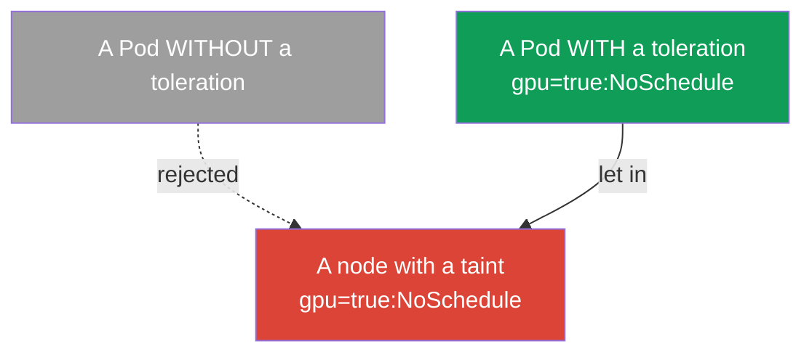
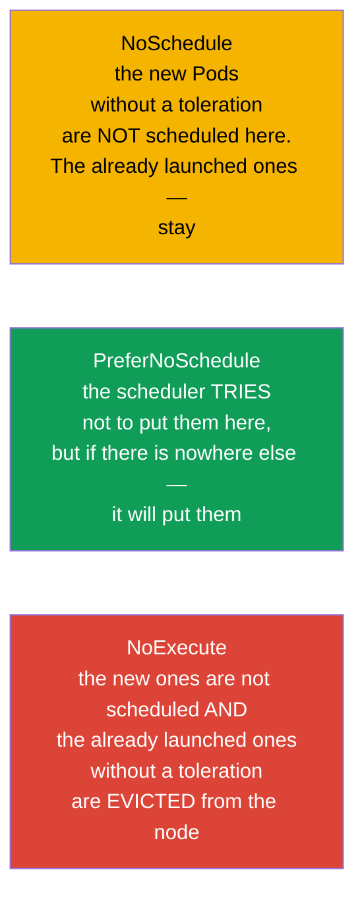
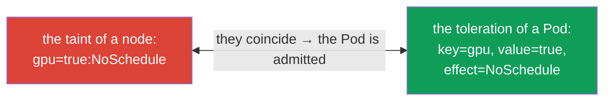
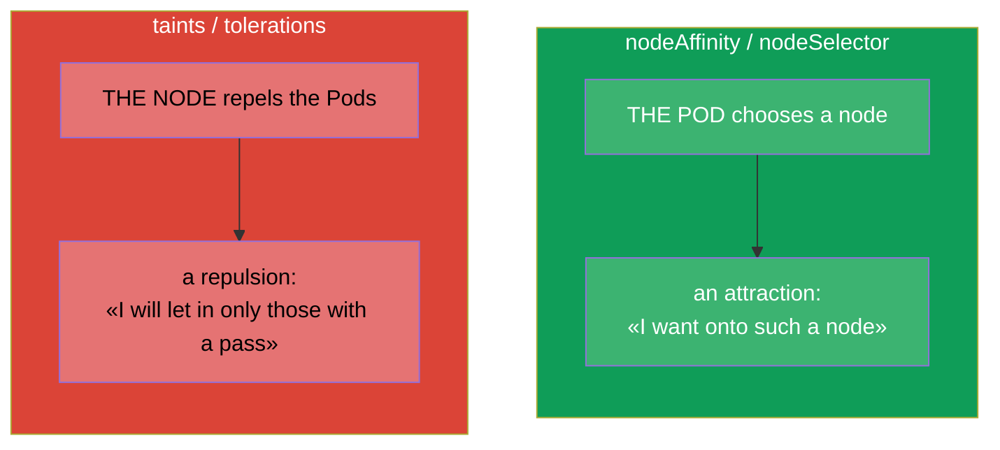
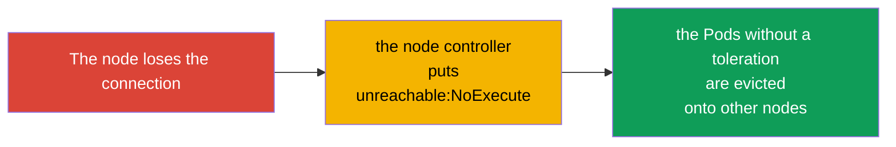

[Русская версия](ru.md) · [Versión en español](es.md) · [Version française](fr.md) · [Deutsche Version](de.md) · [ქართული ვერსია](ge.md) · [繁體中文版](tw.md) · [日本語版](jp.md)

# Chapter 13. Taints and tolerations

> **What comes next.** In chapter 12 the Pod itself chose a node (affinity - the Pod is "attracted").
> Taints and tolerations are the mirror mechanism: now **the node repels** the Pods, and a Pod
> must have a "pass" (a toleration) in order to get onto it. This is the topic Workloads &
> Scheduling of both exams and one of the most frequent sources of Pods in `Pending`.
> An understanding of the taints is obligatory for troubleshooting too: the control plane, the "sick"
> nodes and the dedicated nodes work exactly on this mechanism.

## 13.1. The idea: the node repels, the Pod presents a pass

It is easiest to understand through the metaphor of a "face control".

- **A taint (a restricting mark on a node)** is like an announcement at the entrance: "I will not
  let you in just like that". A node with a taint by default does not accept the Pods.
- **A toleration (the tolerance of a Pod)** is the "pass" that says: "I can
  be on a node with such a taint". Only a Pod with a fitting toleration will be let in.



The most important subtlety, which one has to assimilate at once: **a toleration does not attract a
Pod to a node, it only permits** to end up there. A toleration lifts the prohibition, but does not
guarantee the placement. If one needs both to attract and to permit - the toleration is combined with
nodeSelector/affinity (chapter 12).

## 13.2. The anatomy of a taint

A taint consists of three parts: `key=value:effect`.

```
gpu=true:NoSchedule
│   │    └─ the effect: what to do with the Pods without a toleration
│   └─ the value (may be absent)
└─ the key
```

It is put onto a node by the command:

```bash
kubectl taint nodes worker-1 gpu=true:NoSchedule
# to remove it - the sign "minus" at the end
kubectl taint nodes worker-1 gpu=true:NoSchedule-
# to look at the taints of a node
kubectl describe node worker-1 | grep -i taint
```

## 13.3. The three effects of a taint

The effect determines what happens with the Pods without a fitting toleration. There are three of
them, and the difference between them is a frequent question.



| The effect | The new Pods without a toleration | The already launched Pods without a toleration |
|--------|---------------------------|-------------------------------------|
| `NoSchedule` | are not scheduled | stay working |
| `PreferNoSchedule` | try not to be scheduled (softly) | stay working |
| `NoExecute` | are not scheduled | **are evicted** from the node |

`NoExecute` is the harshest one: it not only does not let the new ones in, but also drives out the
existing Pods that do not have a corresponding toleration.

## 13.4. A toleration in a Pod

A toleration is described in `spec.tolerations` of a Pod and must coincide with the taint by the key,
the value and the effect (or use the operator `Exists`).

```yaml
spec:
  tolerations:
  - key: "gpu"
    operator: "Equal"       # Equal (a coincidence of the value) or Exists (any value)
    value: "true"
    effect: "NoSchedule"
```

The operators:
- **`Equal`** - the key, and the value, and the effect must coincide.
- **`Exists`** - a coincidence of the key is enough (the value does not matter). If one omits the key
  too - the toleration "tolerates any taint" (some system components do it that way).



## 13.5. Taints versus affinity: do not confuse them

These are two orthogonal mechanisms, they are often confused. Keep the difference clearly:



| | affinity / nodeSelector | taints / tolerations |
|---|------------------------|----------------------|
| Who is the initiator | the Pod ("I want to go here") | the node ("I will let in only my own ones") |
| The action | attracts | repels |
| What happens without a rule | the Pod is not attracted anywhere in particular | the node rejects the Pod |

They are often used **together**: a taint reserves a node for a certain class of tasks
(it repels everybody), and the needed Pods get both a toleration (a pass) and a nodeAffinity
(an attraction exactly here). That is how the dedicated nodes for GPU/ingress are done.

## 13.6. The built-in taints and the control plane

Kubernetes itself puts taints in the important cases. One has to know them for troubleshooting.

- **The control plane.** The nodes of the control plane by default carry the taint
  `node-role.kubernetes.io/control-plane:NoSchedule`. That is why the ordinary applications do not
  get there. The system components (for example, a DaemonSet of the monitoring, chapter 11) carry a
  corresponding toleration.
- **The problems of a node.** Upon the failures the node controller automatically puts taints with
  the effect `NoExecute`, in order to lead the Pods away from a sick node:

| The automatic taint | When it is put |
|----------------------|----------------|
| `node.kubernetes.io/not-ready` | the node is not ready (the kubelet does not answer) |
| `node.kubernetes.io/unreachable` | the node is unreachable |
| `node.kubernetes.io/memory-pressure` | a shortage of memory |
| `node.kubernetes.io/disk-pressure` | a shortage of space on the disk |
| `node.kubernetes.io/unschedulable` | the node is marked as unschedulable (cordon) |



From here there is an important link with the commands of the servicing of the nodes: `kubectl cordon`
makes a node unschedulable (a taint), and `kubectl drain` evicts the Pods from it - this we will go over
in detail in chapter 36 (the update of a cluster).

## 13.7. tolerationSeconds: a postponed eviction

For the taints `NoExecute` one may specify how long a Pod will still "hold on" before the eviction:

```yaml
  tolerations:
  - key: "node.kubernetes.io/unreachable"
    operator: "Exists"
    effect: "NoExecute"
    tolerationSeconds: 300      # hold on for 5 minutes, then leave
```

Kubernetes itself adds such tolerations for `not-ready`/`unreachable` to the Pods with a default
value (usually 300 seconds). This protects from the excessive relocations upon short
network failures: if the node returns within 5 minutes, the Pods will not migrate for nothing.

## 13.8. How this is applied in production

- **Dedicated nodes for a class of tasks.** The expensive GPU nodes, the nodes for ingress, the nodes
  for a concrete team are reserved with a taint - so that no outsider Pods drive in there.
  The needed Pods get a toleration (a pass) and usually also a nodeAffinity (in order exactly to be
  attracted). The classic pattern "taint + toleration + affinity".
- **The isolation of the control plane.** A production control plane is closed with a taint, so that the
  applications do not compete for the resources with the "brain" of the cluster. Only the system DaemonSets have a pass.
- **The auto-eviction from the sick nodes.** The automatic `NoExecute` taints (not-ready,
  unreachable) - this is how the cluster itself evacuates the Pods from a failed node.
  `tolerationSeconds` balances between "lead them away quickly" and "do not jerk them for nothing upon a
  short failure".
- **The planned servicing.** Before an upgrade/a repair of a node they do a `cordon` + a `drain` -
  this puts a taint and softly evicts the Pods onto other nodes without a downtime (chapter 36).
- **A frequent source of Pending.** A forgotten taint on a node (for example, after manual
  experiments) is a typical reason why the Pods "do not fit anywhere". During the analysis of a
  Pending one always looks both at the taints of the nodes and at the resources.

## 13.9. A mini-glossary

- **Taint** - a restricting mark on a node (`key=value:effect`) that repels the Pods.
- **Toleration** - the "pass" of a Pod that allows to be on a node with a taint.
- **NoSchedule** - do not schedule the new Pods without a toleration (the old ones stay).
- **PreferNoSchedule** - softly avoid the scheduling here.
- **NoExecute** - do not schedule and evict the already launched Pods without a toleration.
- **operator Equal/Exists** - a coincidence by the value / only by the key.
- **tolerationSeconds** - how long a Pod holds on on a node with NoExecute before the eviction.
- **cordon / drain** - to mark a node unschedulable / to evict the Pods from it (chapter 36).

## 13.10. The chapter's takeaways

- Taints and tolerations are a mirror of affinity: the node **repels** the Pods, and the Pod presents
  a **pass** (a toleration) in order to get there.
- A toleration only permits the placement, but does not attract; for the attraction one needs
  nodeSelector/affinity.
- A taint = `key=value:effect`; the effects: NoSchedule (do not let the new ones in),
  PreferNoSchedule (softly avoid), NoExecute (do not let in and evict the existing ones).
- A toleration coincides with a taint by the key/the value/the effect; the operator Equal (by the value)
  or Exists (by the key).
- Kubernetes itself puts taints: onto the control plane (`NoSchedule`) and onto the problematic nodes
  (`NoExecute`: not-ready, unreachable, pressure).
- `tolerationSeconds` postpones the eviction upon `NoExecute`, protecting from the relocations upon
  short failures.
- In production the taints reserve the dedicated nodes (in a link toleration + affinity),
  isolate the control plane and automatically evacuate the Pods from the sick nodes.

## 13.11. How this will come in handy: on the exam and in real work

**On the exam.** "Put a taint on a node", "add a toleration to a Pod", "why is the Pod in
Pending" are the typical tasks. One needs the commands `kubectl taint`, the knowledge of the three effects and
of the structure of a toleration, and also an understanding of the built-in taints of the control plane. Very often
a Pending on the exam is explained exactly by a taint without a corresponding toleration.

**In real work.** Taints/tolerations are the mechanism of the reservation of the nodes (GPU, ingress),
of the isolation of the control plane and of the automatic evacuation from the failed nodes. The servicing of the nodes
(`cordon`/`drain`) during the upgrades also stands on this. A forgotten taint is a frequent reason for
"the Pods do not fit", therefore it is checked during any analysis of the problems of the scheduling.

## 13.12. Self-check questions

1. In what way do taints/tolerations differ from affinity by the "direction" of the action?
2. Why does a toleration not guarantee the placement of a Pod on a node?
3. Take apart the taint `gpu=true:NoSchedule` by its parts. In what way does NoExecute differ from
   NoSchedule?
4. How does a toleration coincide with a taint? In what way does `Exists` differ from `Equal`?
5. Which taint by default is on the control plane and why do the applications not get there?
6. What does the node controller do with the Pods when a node becomes unreachable?
7. What is `tolerationSeconds` needed for and from what does it protect?

## Practice

We have gone over both the attraction (chapter 12) and the repulsion (this chapter). In chapter 14 we will move on to
the resources of the Pods - requests, limits and the quotas, which also influence the scheduling and whether
a Pod will fit on a node. Taints/tolerations are drilled in the labs on the scheduling.

🧪 Lab 122 (including a drill on taints/tolerations): [tasks/cka/labs/122](../../labs/122/README.MD)

---
[Contents](../README.md) · [Chapter 12](../12/README.md) · [Chapter 14](../14/README.md)
