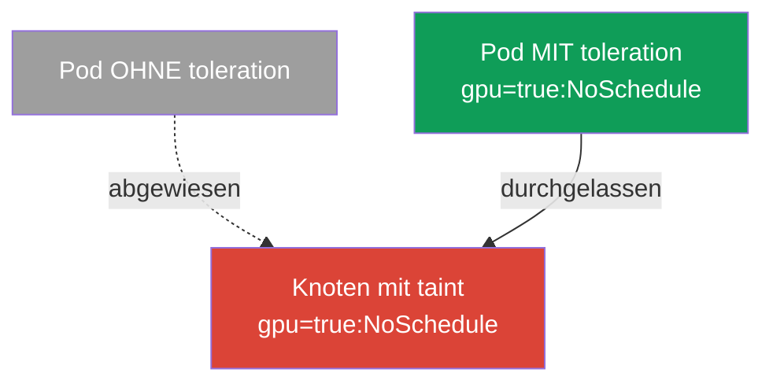
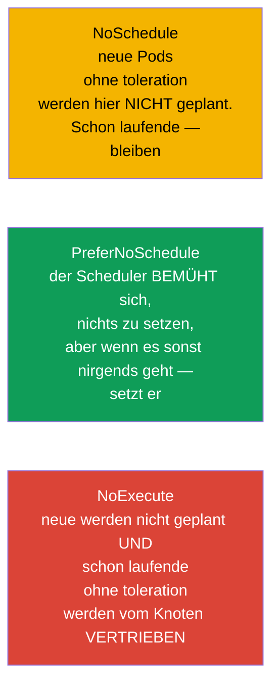
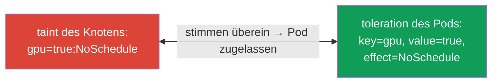
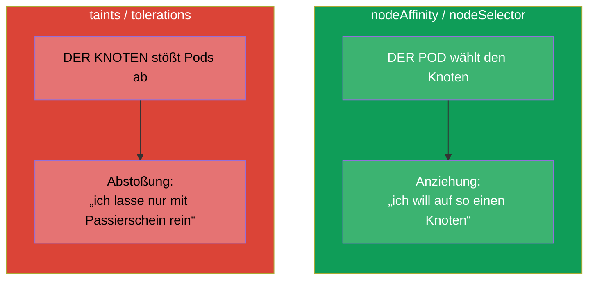
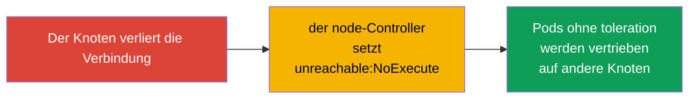

[Русская версия](ru.md) · [Eng version](README.md) · [Versión en español](es.md) · [Version française](fr.md) · [ქართული ვერსია](ge.md) · [繁體中文版](tw.md) · [日本語版](jp.md)

# Kapitel 13. Taints und tolerations

> **Was kommt.** In Kapitel 12 hat der Pod selbst den Knoten gewählt (affinity - der Pod
> wird „angezogen“). Taints und tolerations sind der gespiegelte Mechanismus: jetzt **stößt
> der Knoten** Pods **ab**, und der Pod muss einen „Passierschein“ (toleration) haben, um auf
> ihn zu gelangen. Das ist die Domain Workloads & Scheduling beider Prüfungen und eine der
> häufigsten Quellen für Pods in `Pending`. Das Verständnis von taints ist auch für das
> Troubleshooting Pflicht: die Control Plane, „kranke“ Knoten und dedizierte Knoten
> funktionieren genau über diesen Mechanismus.

## 13.1. Die Idee: der Knoten stößt ab, der Pod zeigt den Passierschein

Am einfachsten versteht man das über die Metapher der „Einlasskontrolle“.

- **Taint (Einschränkungs-Markierung am Knoten)** - das ist wie ein Aushang am Eingang: „so
  einfach lasse ich niemanden rein“. Ein Knoten mit taint nimmt standardmäßig keine Pods an.
- **Toleration (Toleranz beim Pod)** - das ist der „Passierschein“, der sagt: „ich darf mich
  auf einem Knoten mit solchem taint aufhalten“. Nur ein Pod mit passendem toleration wird
  hereingelassen.



Die wichtigste Feinheit, die man sich sofort einprägen muss: **ein toleration zieht den Pod
nicht zum Knoten hin, es erlaubt ihm nur**, dort zu landen. Das toleration hebt das Verbot
auf, garantiert aber keine Platzierung. Muss man sowohl anziehen als auch erlauben -
kombiniert man das toleration mit nodeSelector/affinity (Kapitel 12).

## 13.2. Anatomie eines taint

Ein taint besteht aus drei Teilen: `Schlüssel=Wert:Effekt`.

```
gpu=true:NoSchedule
│   │    └─ Effekt: was mit Pods ohne toleration zu tun ist
│   └─ Wert (kann fehlen)
└─ Schlüssel
```

Gesetzt wird er am Knoten mit dem Befehl:

```bash
kubectl taint nodes worker-1 gpu=true:NoSchedule
# entfernen - ein „Minus“ am Ende
kubectl taint nodes worker-1 gpu=true:NoSchedule-
# die taints des Knotens ansehen
kubectl describe node worker-1 | grep -i taint
```

## 13.3. Die drei Effekte eines taint

Der Effekt bestimmt, was mit Pods ohne passendes toleration passiert. Es gibt drei, und der
Unterschied zwischen ihnen ist eine häufige Frage.



| Effekt | Neue Pods ohne toleration | Schon laufende Pods ohne toleration |
|--------|---------------------------|-------------------------------------|
| `NoSchedule` | werden nicht geplant | bleiben in Betrieb |
| `PreferNoSchedule` | bemühen sich, nicht geplant zu werden (sanft) | bleiben in Betrieb |
| `NoExecute` | werden nicht geplant | werden **vertrieben** vom Knoten |

`NoExecute` ist der härteste: er lässt nicht nur keine neuen herein, sondern jagt auch die
existierenden Pods weg, die kein entsprechendes toleration haben.

## 13.4. Toleration im Pod

Ein toleration wird in `spec.tolerations` des Pods beschrieben und muss mit dem taint in
Schlüssel, Wert und Effekt übereinstimmen (oder den Operator `Exists` nutzen).

```yaml
spec:
  tolerations:
  - key: "gpu"
    operator: "Equal"       # Equal (Übereinstimmung von value) oder Exists (beliebiges value)
    value: "true"
    effect: "NoSchedule"
```

Operatoren:
- **`Equal`** - übereinstimmen müssen Schlüssel, Wert und Effekt.
- **`Exists`** - es genügt die Übereinstimmung des Schlüssels (der Wert ist unwichtig). Lässt
  man auch den Schlüssel weg - „toleriert“ das toleration jeden taint (so machen es einige
  Systemkomponenten).



## 13.5. Taints gegen affinity: nicht verwechseln

Das sind zwei orthogonale Mechanismen, sie werden oft verwechselt. Halten Sie den Unterschied
klar:



| | affinity / nodeSelector | taints / tolerations |
|---|------------------------|----------------------|
| Wer ist der Initiator | der Pod („ich will hierhin“) | der Knoten („ich lasse nur meine rein“) |
| Wirkung | zieht an | stößt ab |
| Was ohne Regel | der Pod wird nirgendwohin besonders angezogen | der Knoten weist den Pod ab |

Man nutzt sie oft **zusammen**: der taint reserviert den Knoten für eine bestimmte Klasse von
Aufgaben (stößt alle ab), und die nötigen Pods bekommen sowohl ein toleration
(Passierschein) als auch nodeAffinity (Anziehung genau hierhin). So macht man dedizierte
Knoten für GPU/ingress.

## 13.6. Eingebaute taints und die Control Plane

Kubernetes setzt in wichtigen Fällen selbst taints. Man muss sie für das Troubleshooting
kennen.

- **Control Plane.** Die Knoten der Control Plane tragen standardmäßig den taint
  `node-role.kubernetes.io/control-plane:NoSchedule`. Deshalb gelangen normale Anwendungen
  dort nicht hin. Systemkomponenten (zum Beispiel das DaemonSet des Monitorings, Kapitel 11)
  tragen das entsprechende toleration.
- **Probleme des Knotens.** Bei Störungen setzt der node-Controller automatisch taints mit dem
  Effekt `NoExecute`, um die Pods von einem kranken Knoten wegzuführen:

| Automatischer taint | Wann er gesetzt wird |
|----------------------|----------------|
| `node.kubernetes.io/not-ready` | der Knoten ist nicht bereit (das kubelet antwortet nicht) |
| `node.kubernetes.io/unreachable` | der Knoten ist unerreichbar |
| `node.kubernetes.io/memory-pressure` | Speichermangel |
| `node.kubernetes.io/disk-pressure` | Platzmangel auf der Platte |
| `node.kubernetes.io/unschedulable` | der Knoten ist als unschedulable markiert (cordon) |



Daher die wichtige Verbindung zu den Befehlen der Knotenwartung: `kubectl cordon` macht den
Knoten unschedulable (taint), und `kubectl drain` vertreibt die Pods von ihm - das nehmen wir
ausführlich in Kapitel 36 durch (Aktualisierung des Clusters).

## 13.7. tolerationSeconds: aufgeschobene Vertreibung

Für taints mit `NoExecute` kann man angeben, wie lange der Pod noch „durchhält“, bevor er
vertrieben wird:

```yaml
  tolerations:
  - key: "node.kubernetes.io/unreachable"
    operator: "Exists"
    effect: "NoExecute"
    tolerationSeconds: 300      # 5 Minuten durchhalten, dann gehen
```

Kubernetes fügt den Pods solche tolerations auf `not-ready`/`unreachable` selbst mit dem
Standardwert hinzu (üblicherweise 300 Sekunden). Das schützt vor unnötigen Umzügen bei kurzen
Netzstörungen: kommt der Knoten innerhalb von 5 Minuten zurück, migrieren die Pods nicht
umsonst.

## 13.8. Wie man das in der Produktion anwendet

- **Dedizierte Knoten für eine Aufgabenklasse.** Teure GPU-Knoten, Knoten für ingress,
  Knoten für ein bestimmtes Team reserviert man mit einem taint - damit dort keine fremden
  Pods einziehen. Die nötigen Pods bekommen ein toleration (Passierschein) und meist noch
  nodeAffinity (um genau dorthin angezogen zu werden). Das klassische Muster „taint +
  toleration + affinity“.
- **Isolation der Control Plane.** Die produktive Control Plane ist mit einem taint
  abgeriegelt, damit Anwendungen nicht mit dem „Gehirn“ des Clusters um Ressourcen
  konkurrieren. Nur System-DaemonSets haben einen Passierschein.
- **Automatische Vertreibung von kranken Knoten.** Die automatischen
  `NoExecute`-taints (not-ready, unreachable) sind der Weg, wie der Cluster die Pods von
  einem ausgefallenen Knoten selbst evakuiert. `tolerationSeconds` balanciert zwischen
  „schnell wegführen“ und „bei einer kurzen Störung nicht unnötig aufschrecken“.
- **Planmäßige Wartung.** Vor dem Upgrade/der Reparatur eines Knotens macht man `cordon` +
  `drain` - das setzt einen taint und vertreibt die Pods sanft auf andere Knoten ohne
  Ausfallzeit (Kapitel 36).
- **Häufige Quelle von Pending.** Ein vergessener taint am Knoten (zum Beispiel nach
  manuellen Experimenten) - eine typische Ursache dafür, warum Pods „nirgends
  hineinpassen“. Bei der Analyse von Pending schaut man immer sowohl auf die taints der
  Knoten als auch auf die Ressourcen.

## 13.9. Mini-Glossar

- **Taint** - eine Einschränkungs-Markierung am Knoten (`Schlüssel=Wert:Effekt`), die Pods
  abstößt.
- **Toleration** - der „Passierschein“ beim Pod, der es erlaubt, sich auf einem Knoten mit
  taint aufzuhalten.
- **NoSchedule** - keine neuen Pods ohne toleration planen (die alten bleiben).
- **PreferNoSchedule** - die Planung hierhin sanft vermeiden.
- **NoExecute** - nicht planen und schon laufende Pods ohne toleration vertreiben.
- **operator Equal/Exists** - Übereinstimmung nach Wert / nur nach Schlüssel.
- **tolerationSeconds** - wie lange sich der Pod auf einem Knoten mit NoExecute hält, bevor
  er vertrieben wird.
- **cordon / drain** - den Knoten als unschedulable markieren / die Pods von ihm vertreiben
  (Kapitel 36).

## 13.10. Zusammenfassung des Kapitels

- Taints und tolerations sind das Spiegelbild von affinity: der Knoten **stößt** Pods **ab**,
  und der Pod zeigt einen **Passierschein** (toleration), um dorthin zu gelangen.
- Ein toleration erlaubt die Platzierung nur, zieht aber nicht an; für die Anziehung braucht
  man nodeSelector/affinity.
- Taint = `Schlüssel=Wert:Effekt`; Effekte: NoSchedule (keine neuen hereinlassen),
  PreferNoSchedule (sanft vermeiden), NoExecute (nicht hereinlassen und die existierenden
  vertreiben).
- Das toleration stimmt mit dem taint in Schlüssel/Wert/Effekt überein; Operator Equal (nach
  Wert) oder Exists (nach Schlüssel).
- Kubernetes setzt taints selbst: an der Control Plane (`NoSchedule`) und an problematischen
  Knoten (`NoExecute`: not-ready, unreachable, pressure).
- `tolerationSeconds` schiebt die Vertreibung bei `NoExecute` auf und schützt vor Umzügen bei
  kurzen Störungen.
- In der Produktion reservieren taints dedizierte Knoten (in Verbindung mit toleration +
  affinity), isolieren die Control Plane und evakuieren automatisch die Pods von kranken
  Knoten.

## 13.11. Wofür das nützlich ist: in der Prüfung und in der echten Arbeit

**In der Prüfung.** „Setze einen taint am Knoten“, „füge dem Pod ein toleration hinzu“,
„warum ist der Pod in Pending“ - typische Aufgaben. Man braucht die Befehle `kubectl taint`,
das Wissen über die drei Effekte und die Struktur des toleration sowie das Verständnis der
eingebauten taints der Control Plane. Sehr oft erklärt sich Pending in der Prüfung genau
durch einen taint ohne entsprechendes toleration.

**In der echten Arbeit.** Taints/tolerations sind der Mechanismus für die Reservierung von
Knoten (GPU, ingress), die Isolation der Control Plane und die automatische Evakuierung von
ausgefallenen Knoten. Die Knotenwartung (`cordon`/`drain`) bei Upgrades beruht ebenfalls
darauf. Ein vergessener taint ist eine häufige Ursache für „die Pods passen nicht hinein“,
deshalb prüft man ihn bei jeder Analyse von Planungsproblemen.

## 13.12. Fragen zur Selbstüberprüfung

1. Worin unterscheiden sich taints/tolerations von affinity in der „Richtung“ der Wirkung?
2. Warum garantiert ein toleration nicht die Platzierung des Pods auf dem Knoten?
3. Zerlegen Sie den taint `gpu=true:NoSchedule` in seine Teile. Worin unterscheidet sich
   NoExecute von NoSchedule?
4. Wie stimmt ein toleration mit einem taint überein? Worin unterscheidet sich `Exists` von
   `Equal`?
5. Welcher taint ist standardmäßig an der Control Plane gesetzt und warum gelangen
   Anwendungen dort nicht hin?
6. Was macht der node-Controller mit den Pods, wenn der Knoten unreachable wird?
7. Wozu braucht man `tolerationSeconds` und wovor schützt es?

## Praxis

Wir haben sowohl die Anziehung (Kapitel 12) als auch die Abstoßung (dieses Kapitel)
durchgenommen. In Kapitel 14 gehen wir zu den Ressourcen der Pods über - requests, limits
und Quoten, die ebenfalls die Planung beeinflussen und darüber entscheiden, ob der Pod auf
dem Knoten Platz findet. Taints/tolerations werden in den Labs zur Planung geübt.

🧪 Lab 122 (u. a. Drill zu taints/tolerations): [tasks/cka/labs/122](../../labs/122/README_DE.MD)

🎮 Killercoda (im Browser, ohne Installation): [Taints and Tolerations](https://killercoda.com/chadmcrowell/course/cka/taints-tolerations) · [Add a Toleration to a Pod YAML](https://killercoda.com/chadmcrowell/course/cka/add-toleration) · [Remove the Taint from Node](https://killercoda.com/chadmcrowell/course/cka/remove-taint)

---
[Inhalt](../README_DE.md) · [Kapitel 12](../12/de.md) · [Kapitel 14](../14/de.md)
