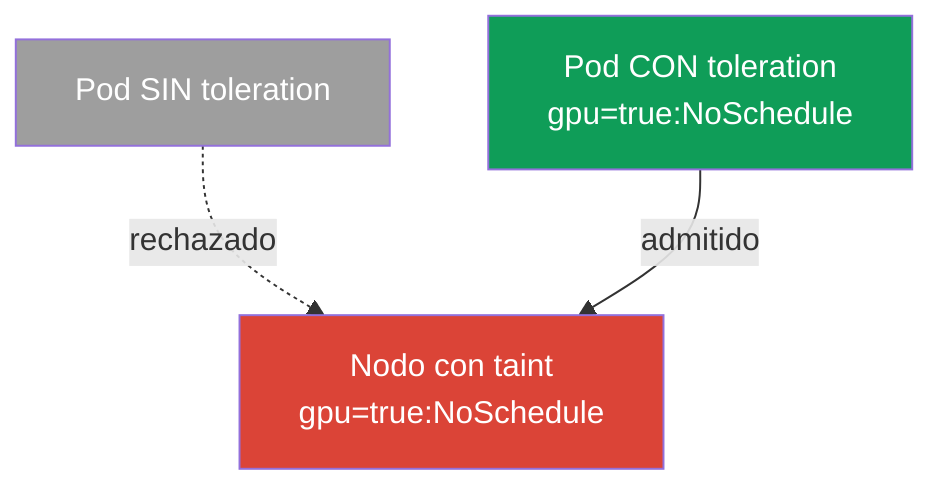
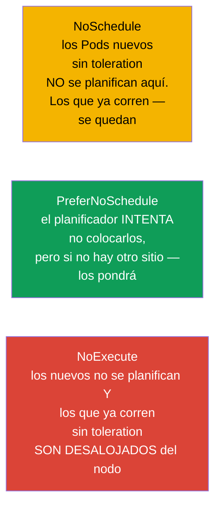
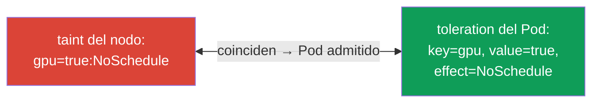
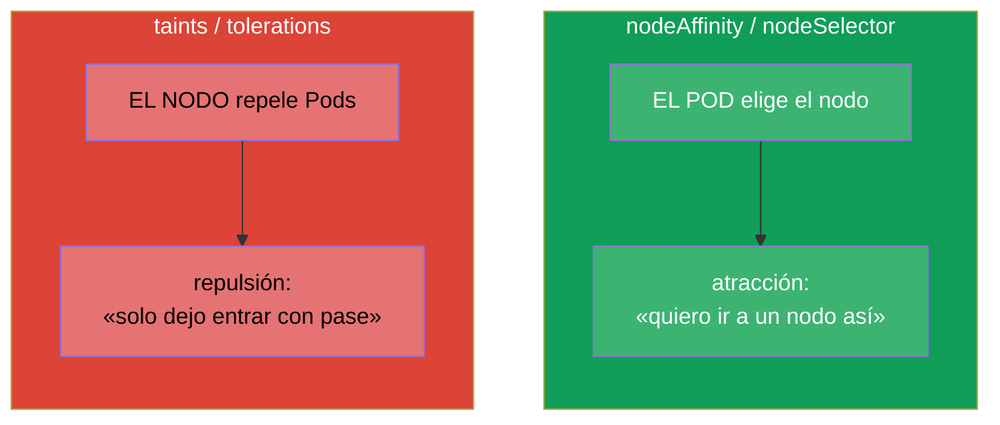
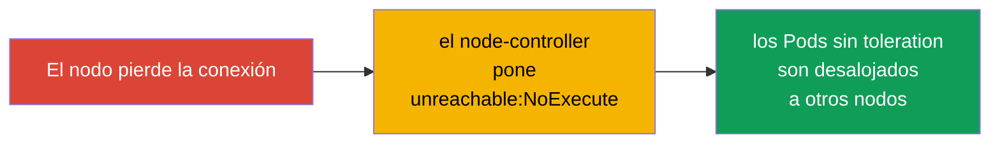

[Русская версия](ru.md) · [Eng version](README.md) · [Version française](fr.md) · [Deutsche Version](de.md) · [ქართული ვერსია](ge.md) · [繁體中文版](tw.md) · [日本語版](jp.md)

# Capítulo 13. Taints y tolerations

> **Qué viene ahora.** En el capítulo 12 era el Pod el que elegía nodo (affinity - el Pod «se siente atraído»).
> Taints y tolerations son el mecanismo espejo: ahora **el nodo repele** Pods, y el Pod
> debe tener un «pase» (toleration) para poder entrar. Es tema del dominio Workloads &
> Scheduling de ambos exámenes y una de las causas más frecuentes de Pods en `Pending`.
> Entender los taints es obligatorio también para el troubleshooting: el control plane, los nodos «enfermos» y los
> nodos dedicados funcionan precisamente con este mecanismo.

## 13.1. La idea: el nodo repele, el Pod presenta su pase

Lo más fácil es entenderlo con la metáfora del «control de acceso».

- **Taint (marca-restricción en el nodo)** - es como un cartel en la entrada: «así, sin más, no
  te dejo pasar». Un nodo con taint no acepta Pods por defecto.
- **Toleration (tolerancia del Pod)** - es el «pase» que dice: «yo puedo
  estar en un nodo con ese taint». Solo dejan entrar al Pod con un toleration adecuado.



El matiz más importante, y hay que asimilarlo desde el principio: **el toleration no atrae al Pod hacia el nodo,
solo le permite** estar allí. El toleration levanta la prohibición, pero no garantiza la
colocación. Si hace falta atraer y permitir a la vez, el toleration se combina con nodeSelector/
affinity (capítulo 12).

## 13.2. Anatomía de un taint

Un taint consta de tres partes: `clave=valor:efecto`.

```
gpu=true:NoSchedule
│   │    └─ efecto: qué hacer con los Pods sin toleration
│   └─ valor (puede faltar)
└─ clave
```

Se pone en el nodo con el comando:

```bash
kubectl taint nodes worker-1 gpu=true:NoSchedule
# quitarlo — un signo «menos» al final
kubectl taint nodes worker-1 gpu=true:NoSchedule-
# ver los taints del nodo
kubectl describe node worker-1 | grep -i taint
```

## 13.3. Los tres efectos de un taint

El efecto determina qué pasa con los Pods que no tienen un toleration adecuado. Son tres, y la diferencia
entre ellos es una pregunta frecuente.



| Efecto | Pods nuevos sin toleration | Pods ya en marcha sin toleration |
|--------|---------------------------|-------------------------------------|
| `NoSchedule` | no se planifican | siguen funcionando |
| `PreferNoSchedule` | intentan no planificarse (con suavidad) | siguen funcionando |
| `NoExecute` | no se planifican | **son desalojados** del nodo |

`NoExecute` es el más duro: no solo no deja entrar a los nuevos, sino que además echa a los Pods
existentes que no tengan el toleration correspondiente.

## 13.4. El toleration en el Pod

El toleration se describe en `spec.tolerations` del Pod y debe coincidir con el taint en clave,
valor y efecto (o bien usar el operador `Exists`).

```yaml
spec:
  tolerations:
  - key: "gpu"
    operator: "Equal"       # Equal (coincidencia de value) o Exists (cualquier value)
    value: "true"
    effect: "NoSchedule"
```

Operadores:
- **`Equal`** - deben coincidir la clave, el valor y el efecto.
- **`Exists`** - basta con que coincida la clave (el valor no importa). Si además se omite la clave,
  el toleration «tolera cualquier taint» (así lo hacen algunos componentes del sistema).



## 13.5. Taints frente a affinity: no confundirlos

Son dos mecanismos ortogonales que se confunden a menudo. Ten la diferencia bien clara:



| | affinity / nodeSelector | taints / tolerations |
|---|------------------------|----------------------|
| Quién toma la iniciativa | el Pod («quiero ir ahí») | el nodo («solo dejo entrar a los míos») |
| Acción | atrae | repele |
| Qué pasa sin regla | el Pod no se siente atraído a ningún sitio en particular | el nodo rechaza el Pod |

Se usan a menudo **juntos**: el taint reserva el nodo para una clase concreta de tareas
(repele a todos), y los Pods que hacen falta reciben el toleration (el pase) y también nodeAffinity
(la atracción hacia ese sitio). Así se hacen los nodos dedicados a GPU/ingress.

## 13.6. Taints integrados y el control plane

Kubernetes pone taints por su cuenta en casos importantes. Hay que conocerlos para el troubleshooting.

- **Control plane.** Los nodos del control plane llevan por defecto el taint
  `node-role.kubernetes.io/control-plane:NoSchedule`. Por eso las aplicaciones normales no acaban
  allí. Los componentes del sistema (por ejemplo, el DaemonSet de monitorización, capítulo 11) llevan el
  toleration correspondiente.
- **Problemas del nodo.** Ante fallos, el node-controller pone automáticamente taints con el efecto
  `NoExecute` para llevarse los Pods del nodo enfermo:

| Taint automático | Cuándo se pone |
|----------------------|----------------|
| `node.kubernetes.io/not-ready` | el nodo no está listo (el kubelet no responde) |
| `node.kubernetes.io/unreachable` | el nodo es inalcanzable |
| `node.kubernetes.io/memory-pressure` | falta de memoria |
| `node.kubernetes.io/disk-pressure` | falta de espacio en disco |
| `node.kubernetes.io/unschedulable` | el nodo está marcado como unschedulable (cordon) |



De aquí sale un vínculo importante con los comandos de mantenimiento de nodos: `kubectl cordon` marca el nodo como
unschedulable (taint), y `kubectl drain` desaloja sus Pods - lo veremos en detalle en el
capítulo 36 (actualización del clúster).

## 13.7. tolerationSeconds: desalojo diferido

Para los taints `NoExecute` se puede indicar cuánto más «aguanta» el Pod antes de ser desalojado:

```yaml
  tolerations:
  - key: "node.kubernetes.io/unreachable"
    operator: "Exists"
    effect: "NoExecute"
    tolerationSeconds: 300      # aguantar 5 minutos y luego irse
```

Kubernetes añade a los Pods por su cuenta esos tolerations para `not-ready`/`unreachable` con un
valor por defecto (normalmente 300 segundos). Esto protege de mudanzas innecesarias en cortes
de red breves: si el nodo vuelve en 5 minutos, los Pods no migrarán en vano.

## 13.8. Cómo se usa esto en producción

- **Nodos dedicados a una clase de tareas.** Los nodos GPU caros, los nodos para ingress, los nodos para
  un equipo concreto se reservan con un taint - para que no entren Pods ajenos.
  Los Pods que hacen falta reciben el toleration (el pase) y normalmente también nodeAffinity (para
  ser atraídos precisamente allí). Es el patrón clásico «taint + toleration + affinity».
- **Aislamiento del control plane.** El control plane de producción está cerrado con un taint, para que las aplicaciones no
  compitan por recursos con el «cerebro» del clúster. Solo los DaemonSet del sistema tienen pase.
- **Autodesalojo de los nodos enfermos.** Los taints `NoExecute` automáticos (not-ready,
  unreachable) son la forma en que el clúster evacúa por sí mismo los Pods de un nodo caído.
  `tolerationSeconds` equilibra entre «llevárselos rápido» y «no moverlos en vano ante un corte
  breve».
- **Mantenimiento planificado.** Antes de una actualización o reparación del nodo se hace `cordon` + `drain` -
  eso pone un taint y desaloja con suavidad los Pods a otros nodos sin caída de servicio (capítulo 36).
- **Fuente frecuente de Pending.** Un taint olvidado en un nodo (por ejemplo, después de experimentos
  manuales) es la causa típica de por qué los Pods «no caben en ningún sitio». Al analizar un
  Pending siempre se miran tanto los taints de los nodos como los recursos.

## 13.9. Mini-glosario

- **Taint** - marca-restricción en el nodo (`clave=valor:efecto`) que repele Pods.
- **Toleration** - el «pase» del Pod que le permite estar en un nodo con taint.
- **NoSchedule** - no planificar Pods nuevos sin toleration (los antiguos se quedan).
- **PreferNoSchedule** - evitar con suavidad planificar aquí.
- **NoExecute** - no planificar y desalojar los Pods ya en marcha sin toleration.
- **operator Equal/Exists** - coincidencia por valor / solo por clave.
- **tolerationSeconds** - cuánto aguanta el Pod en un nodo con NoExecute antes del desalojo.
- **cordon / drain** - marcar el nodo como unschedulable / desalojar sus Pods (capítulo 36).

## 13.10. Resumen del capítulo

- Taints y tolerations son el espejo de affinity: el nodo **repele** Pods, y el Pod presenta un
  **pase** (toleration) para poder entrar.
- El toleration solo permite la colocación, no atrae; para la atracción hace falta
  nodeSelector/affinity.
- Taint = `clave=valor:efecto`; efectos: NoSchedule (no dejar entrar a los nuevos),
  PreferNoSchedule (evitar con suavidad), NoExecute (no dejar entrar y desalojar a los existentes).
- El toleration coincide con el taint en clave/valor/efecto; operador Equal (por valor)
  o Exists (por clave).
- Kubernetes pone taints por su cuenta: en el control plane (`NoSchedule`) y en los nodos con problemas
  (`NoExecute`: not-ready, unreachable, pressure).
- `tolerationSeconds` retrasa el desalojo con `NoExecute`, protegiendo de mudanzas ante
  cortes breves.
- En producción los taints reservan nodos dedicados (en combinación con toleration + affinity),
  aíslan el control plane y evacúan automáticamente los Pods de los nodos enfermos.

## 13.11. Para qué sirve: en el examen y en el trabajo real

**En el examen.** «Pon un taint en el nodo», «añade un toleration al Pod», «por qué el Pod está en
Pending» son tareas típicas. Hacen falta los comandos `kubectl taint`, conocer los tres efectos y
la estructura del toleration, además de entender los taints integrados del control plane. Muy a menudo
un Pending en el examen se explica precisamente por un taint sin el toleration correspondiente.

**En el trabajo real.** Taints/tolerations son el mecanismo para reservar nodos (GPU, ingress),
aislar el control plane y evacuar automáticamente los nodos caídos. El mantenimiento de nodos
(`cordon`/`drain`) en las actualizaciones se apoya también en esto. Un taint olvidado es una causa frecuente de
«los Pods no caben», por eso se comprueba en cualquier análisis de problemas de planificación.

## 13.12. Preguntas de autoevaluación

1. ¿En qué se diferencian taints/tolerations de affinity por la «dirección» de su acción?
2. ¿Por qué un toleration no garantiza la colocación del Pod en el nodo?
3. Descompón el taint `gpu=true:NoSchedule` en sus partes. ¿En qué se diferencia NoExecute de
   NoSchedule?
4. ¿Cómo coincide un toleration con un taint? ¿En qué se diferencia `Exists` de `Equal`?
5. ¿Qué taint tiene por defecto el control plane y por qué las aplicaciones no acaban allí?
6. ¿Qué hace el node-controller con los Pods cuando un nodo pasa a unreachable?
7. ¿Para qué sirve `tolerationSeconds` y de qué protege?

## Práctica

Hemos visto tanto la atracción (capítulo 12) como la repulsión (este capítulo). En el capítulo 14 pasaremos a
los recursos de los Pods - requests, limits y cuotas, que también influyen en la planificación y en si
el Pod cabe en el nodo. Taints/tolerations se practican en los laboratorios de planificación.

🧪 Laboratorio 122 (incluye drill de taints/tolerations): [tasks/cka/labs/122](../../labs/122/README_ES.MD)

🎮 Killercoda (en el navegador, sin instalación): [Taints and Tolerations](https://killercoda.com/chadmcrowell/course/cka/taints-tolerations) · [Add a Toleration to a Pod YAML](https://killercoda.com/chadmcrowell/course/cka/add-toleration) · [Remove the Taint from Node](https://killercoda.com/chadmcrowell/course/cka/remove-taint)

---
[Índice](../README_ES.md) · [Capítulo 12](../12/es.md) · [Capítulo 14](../14/es.md)
