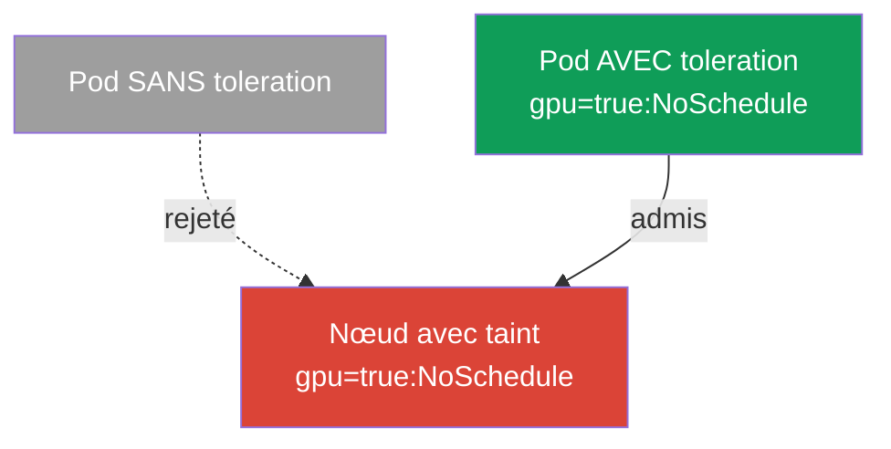
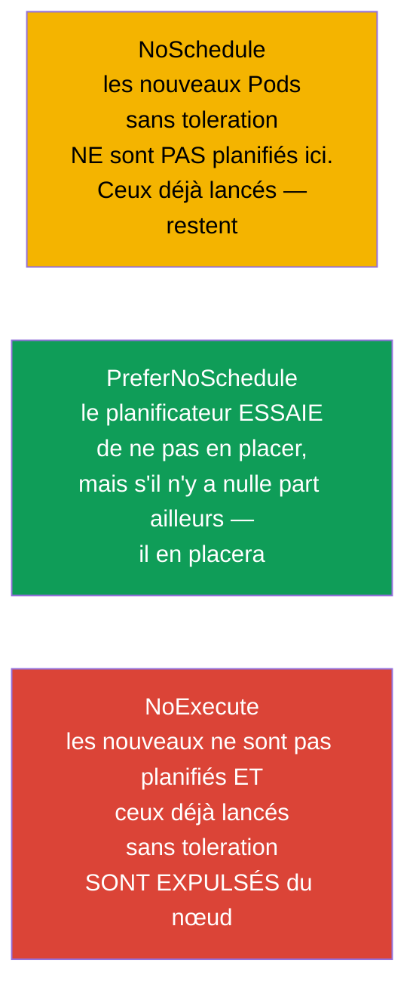
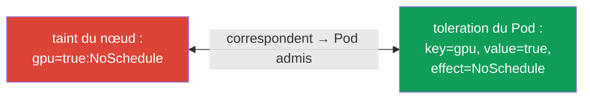
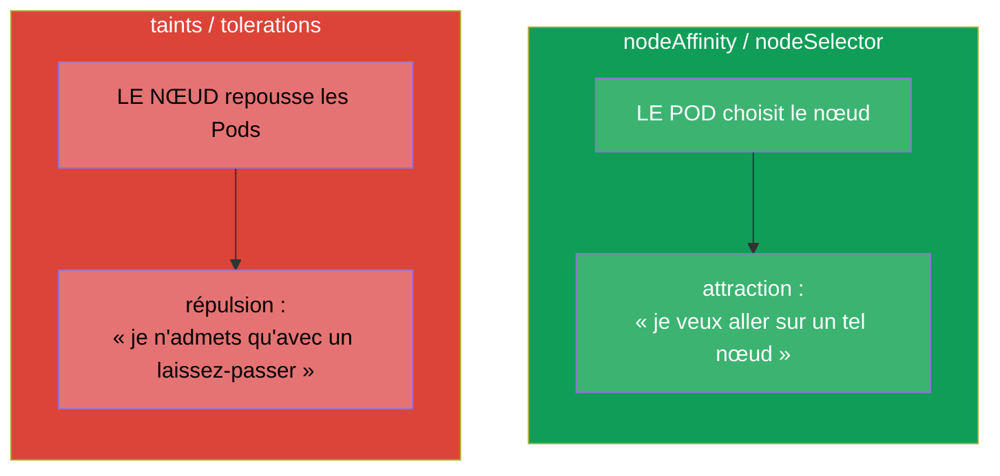
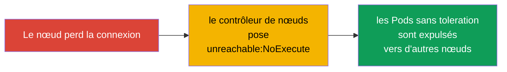

[Русская версия](ru.md) · [Eng version](README.md) · [Versión en español](es.md) · [Deutsche Version](de.md) · [ქართული ვერსია](ge.md)

# Chapitre 13. Taints et tolerations

> **Ce qui suit.** Au chapitre 12, c'était le Pod qui choisissait son nœud (affinity - le Pod est
> « attiré »). Les taints et tolerations sont le mécanisme en miroir : c'est maintenant **le nœud
> qui repousse** les Pods, et le Pod doit posséder un « laissez-passer » (toleration) pour y
> accéder. C'est un sujet du domaine Workloads & Scheduling des deux examens et l'une des causes
> les plus fréquentes de Pods en `Pending`. Comprendre les taints est également indispensable au
> troubleshooting : le control plane, les nœuds « malades » et les nœuds dédiés reposent
> précisément sur ce mécanisme.

## 13.1. L'idée : le nœud repousse, le Pod présente son laissez-passer

Le plus simple est de le comprendre par la métaphore du « contrôle à l'entrée ».

- **Taint (marque-restriction sur le nœud)** - c'est comme un écriteau à l'entrée : « je ne laisse
  pas entrer n'importe qui ». Par défaut, un nœud portant un taint n'accepte pas de Pods.
- **Toleration (tolérance du Pod)** - c'est le « laissez-passer » qui dit : « je peux me trouver
  sur un nœud portant ce taint ». Seul un Pod muni d'un toleration adapté sera admis.



La subtilité essentielle, à assimiler tout de suite : **un toleration n'attire pas le Pod vers le
nœud, il ne fait qu'autoriser** sa présence. Le toleration lève l'interdiction, mais ne garantit
pas le placement. S'il faut à la fois attirer et autoriser, on combine le toleration avec
nodeSelector/affinity (chapitre 12).

## 13.2. Anatomie d'un taint

Un taint comporte trois parties : `clé=valeur:effet`.

```
gpu=true:NoSchedule
│   │    └─ effet : que faire des Pods sans toleration
│   └─ valeur (peut être absente)
└─ clé
```

On le pose sur un nœud avec la commande :

```bash
kubectl taint nodes worker-1 gpu=true:NoSchedule
# retirer - le signe « moins » à la fin
kubectl taint nodes worker-1 gpu=true:NoSchedule-
# consulter les taints du nœud
kubectl describe node worker-1 | grep -i taint
```

## 13.3. Les trois effets d'un taint

L'effet détermine ce qui arrive aux Pods dépourvus de toleration adapté. Il y en a trois, et la
différence entre eux est une question fréquente.



| Effet | Nouveaux Pods sans toleration | Pods déjà lancés sans toleration |
|--------|---------------------------|-------------------------------------|
| `NoSchedule` | ne sont pas planifiés | continuent de tourner |
| `PreferNoSchedule` | on essaie de ne pas les planifier (en souplesse) | continuent de tourner |
| `NoExecute` | ne sont pas planifiés | **sont expulsés** du nœud |

`NoExecute` est le plus dur : non seulement il n'admet pas les nouveaux, mais il chasse aussi les
Pods existants qui n'ont pas le toleration correspondant.

## 13.4. Le toleration dans le Pod

Le toleration se décrit dans `spec.tolerations` du Pod et doit correspondre au taint par la clé,
la valeur et l'effet (ou bien utiliser l'opérateur `Exists`).

```yaml
spec:
  tolerations:
  - key: "gpu"
    operator: "Equal"       # Equal (correspondance de value) ou Exists (n'importe quelle value)
    value: "true"
    effect: "NoSchedule"
```

Les opérateurs :
- **`Equal`** - la clé, la valeur et l'effet doivent tous correspondre.
- **`Exists`** - la correspondance de la clé suffit (la valeur importe peu). Si l'on omet aussi la
  clé, le toleration « tolère n'importe quel taint » (c'est ce que font certains composants
  système).



## 13.5. Taints contre affinity : ne pas confondre

Ce sont deux mécanismes orthogonaux, souvent confondus. Gardez la différence bien nette :



| | affinity / nodeSelector | taints / tolerations |
|---|------------------------|----------------------|
| Qui prend l'initiative | le Pod (« je veux aller là ») | le nœud (« je n'admets que les miens ») |
| Action | attire | repousse |
| Sans règle | le Pod n'est attiré nulle part en particulier | le nœud rejette le Pod |

On les utilise souvent **ensemble** : un taint réserve le nœud à une certaine classe de tâches (il
repousse tout le monde), et les Pods voulus reçoivent à la fois un toleration (laissez-passer) et
une nodeAffinity (attraction précisément vers ce nœud). C'est ainsi que sont faits les nœuds dédiés
au GPU/à l'ingress.

## 13.6. Taints intégrés et control plane

Kubernetes pose lui-même des taints dans des cas importants. Il faut les connaître pour le
troubleshooting.

- **Control plane.** Les nœuds du control plane portent par défaut le taint
  `node-role.kubernetes.io/control-plane:NoSchedule`. C'est pourquoi les applications ordinaires
  n'y atterrissent pas. Les composants système (par exemple le DaemonSet de monitoring,
  chapitre 11) portent le toleration correspondant.
- **Problèmes de nœud.** En cas de panne, le contrôleur de nœuds pose automatiquement des taints
  avec l'effet `NoExecute`, afin d'emmener les Pods hors du nœud malade :

| Taint automatique | Quand il est posé |
|----------------------|----------------|
| `node.kubernetes.io/not-ready` | le nœud n'est pas prêt (le kubelet ne répond pas) |
| `node.kubernetes.io/unreachable` | le nœud est injoignable |
| `node.kubernetes.io/memory-pressure` | manque de mémoire |
| `node.kubernetes.io/disk-pressure` | manque d'espace disque |
| `node.kubernetes.io/unschedulable` | le nœud est marqué unschedulable (cordon) |



D'où le lien important avec les commandes de maintenance des nœuds : `kubectl cordon` rend le nœud
unschedulable (un taint), et `kubectl drain` en expulse les Pods - nous verrons cela en détail au
chapitre 36 (mise à jour du cluster).

## 13.7. tolerationSeconds : expulsion différée

Pour les taints `NoExecute`, on peut indiquer combien de temps le Pod « tiendra » encore avant
d'être expulsé :

```yaml
  tolerations:
  - key: "node.kubernetes.io/unreachable"
    operator: "Exists"
    effect: "NoExecute"
    tolerationSeconds: 300      # tenir 5 minutes, puis partir
```

Kubernetes ajoute lui-même aux Pods de tels tolerations sur `not-ready`/`unreachable` avec une
valeur par défaut (généralement 300 secondes). Cela protège des déménagements inutiles lors de
courtes pannes réseau : si le nœud revient sous 5 minutes, les Pods ne migreront pas pour rien.

## 13.8. Comment cela s'applique en production

- **Nœuds dédiés à une classe de tâches.** Les nœuds GPU coûteux, les nœuds pour l'ingress, les
  nœuds réservés à une équipe précise sont réservés par un taint - pour qu'aucun Pod étranger n'y
  vienne. Les Pods voulus reçoivent un toleration (laissez-passer) et généralement en plus une
  nodeAffinity (pour être justement attirés là). Le schéma classique « taint + toleration +
  affinity ».
- **Isolation du control plane.** Le control plane de prod est fermé par un taint, pour que les
  applications ne concurrencent pas le « cerveau » du cluster sur les ressources. Seuls les
  DaemonSet système ont un laissez-passer.
- **Expulsion automatique des nœuds malades.** Les taints `NoExecute` automatiques (not-ready,
  unreachable) sont la façon dont le cluster évacue lui-même les Pods d'un nœud défaillant.
  `tolerationSeconds` équilibre entre « évacuer vite » et « ne pas s'agiter pour rien lors d'une
  panne courte ».
- **Maintenance planifiée.** Avant une mise à niveau/une réparation d'un nœud, on fait `cordon` +
  `drain` - cela pose un taint et expulse en douceur les Pods vers d'autres nœuds sans
  interruption (chapitre 36).
- **Source fréquente de Pending.** Un taint oublié sur un nœud (par exemple après des
  expérimentations manuelles) est une cause typique de Pods qui « ne tiennent nulle part ». Lors
  de l'analyse d'un Pending, on regarde toujours à la fois les taints des nœuds et les ressources.

## 13.9. Mini-glossaire

- **Taint** - marque-restriction sur le nœud (`clé=valeur:effet`), qui repousse les Pods.
- **Toleration** - « laissez-passer » du Pod, qui lui permet de se trouver sur un nœud portant un
  taint.
- **NoSchedule** - ne pas planifier de nouveaux Pods sans toleration (les anciens restent).
- **PreferNoSchedule** - éviter en souplesse d'y planifier.
- **NoExecute** - ne pas planifier et expulser les Pods déjà lancés sans toleration.
- **operator Equal/Exists** - correspondance par la valeur / seulement par la clé.
- **tolerationSeconds** - combien de temps le Pod tient sur un nœud avec NoExecute avant
  l'expulsion.
- **cordon / drain** - marquer le nœud unschedulable / en expulser les Pods (chapitre 36).

## 13.10. Récapitulatif du chapitre

- Les taints et tolerations sont le miroir de l'affinity : le nœud **repousse** les Pods, et le Pod
  présente un **laissez-passer** (toleration) pour y accéder.
- Le toleration ne fait qu'autoriser le placement, il n'attire pas ; pour l'attraction il faut
  nodeSelector/affinity.
- Taint = `clé=valeur:effet` ; les effets : NoSchedule (ne pas admettre les nouveaux),
  PreferNoSchedule (éviter en souplesse), NoExecute (ne pas admettre et expulser les existants).
- Le toleration correspond au taint par la clé/la valeur/l'effet ; opérateur Equal (par la valeur)
  ou Exists (par la clé).
- Kubernetes pose lui-même des taints : sur le control plane (`NoSchedule`) et sur les nœuds
  problématiques (`NoExecute` : not-ready, unreachable, pressure).
- `tolerationSeconds` diffère l'expulsion en cas de `NoExecute`, protégeant des déménagements lors
  de pannes courtes.
- En prod, les taints réservent les nœuds dédiés (en tandem toleration + affinity), isolent le
  control plane et évacuent automatiquement les Pods des nœuds malades.

## 13.11. À quoi cela sert : à l'examen et dans le travail réel

**À l'examen.** « Pose un taint sur le nœud », « ajoute un toleration au Pod », « pourquoi le Pod
est-il en Pending » sont des exercices types. Il faut les commandes `kubectl taint`, la
connaissance des trois effets et de la structure d'un toleration, ainsi que la compréhension des
taints intégrés du control plane. Très souvent, un Pending à l'examen s'explique justement par un
taint sans le toleration correspondant.

**Dans le travail réel.** Taints/tolerations sont le mécanisme de réservation des nœuds (GPU,
ingress), d'isolation du control plane et d'évacuation automatique des nœuds défaillants. La
maintenance des nœuds (`cordon`/`drain`) lors des mises à niveau repose aussi là-dessus. Un taint
oublié est une cause fréquente de « les Pods ne tiennent pas », c'est pourquoi on le vérifie à
chaque analyse de problème de planification.

## 13.12. Questions d'auto-évaluation

1. En quoi taints/tolerations diffèrent-ils de l'affinity par la « direction » de leur action ?
2. Pourquoi un toleration ne garantit-il pas le placement du Pod sur le nœud ?
3. Décomposez le taint `gpu=true:NoSchedule` en ses parties. En quoi NoExecute diffère-t-il de
   NoSchedule ?
4. Comment un toleration correspond-il à un taint ? En quoi `Exists` diffère-t-il de `Equal` ?
5. Quel taint est posé par défaut sur le control plane et pourquoi les applications n'y
   atterrissent-elles pas ?
6. Que fait le contrôleur de nœuds avec les Pods quand un nœud devient unreachable ?
7. À quoi sert `tolerationSeconds` et de quoi protège-t-il ?

## Pratique

Nous avons vu à la fois l'attraction (chapitre 12) et la répulsion (ce chapitre). Au chapitre 14,
nous passerons aux ressources des Pods - requests, limits et quotas, qui influent également sur la
planification et sur le fait qu'un Pod tienne ou non sur un nœud. Taints/tolerations se travaillent
dans les TP sur la planification.

🧪 TP 122 (dont un drill sur taints/tolerations) : [tasks/cka/labs/122](../../labs/122/README_FR.MD)

---
[Sommaire](../README_FR.md) · [Chapitre 12](../12/fr.md) · [Chapitre 14](../14/fr.md)
