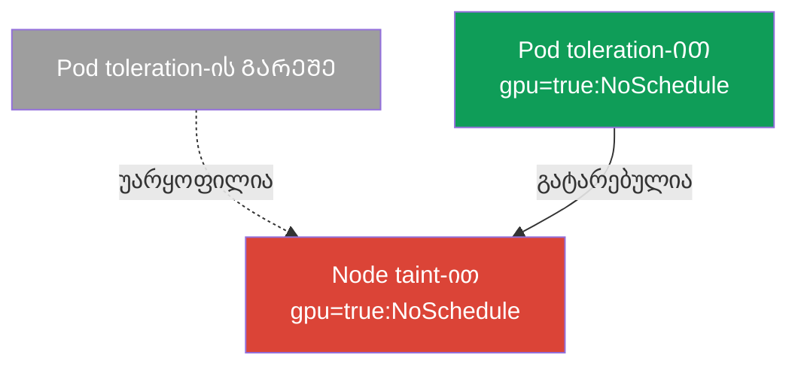
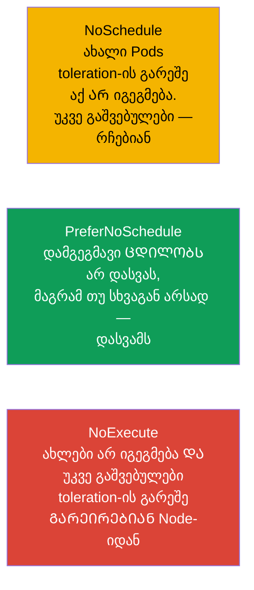
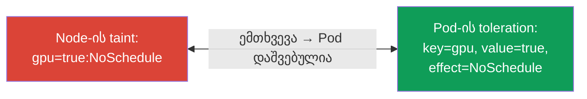
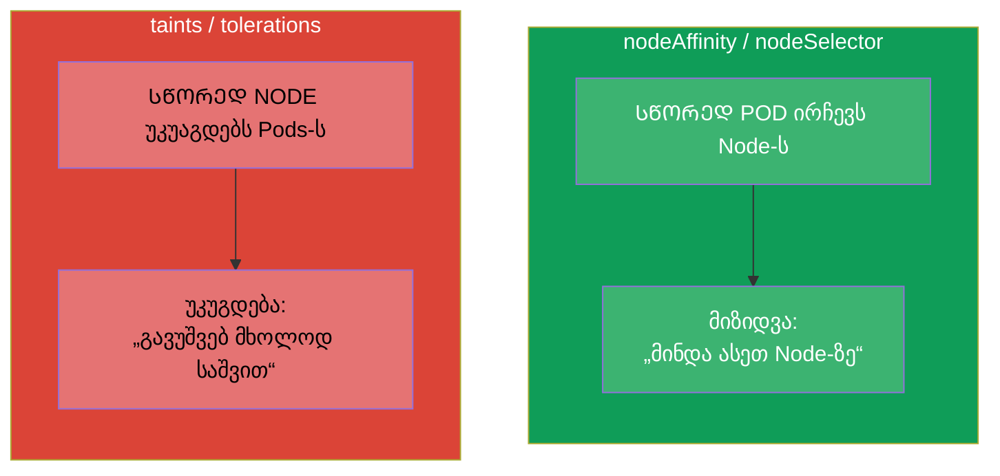
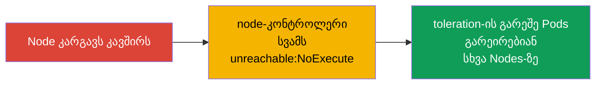

[Русская версия](ru.md) · [Eng version](README.md) · [Versión en español](es.md) · [Version française](fr.md) · [Deutsche Version](de.md) · [繁體中文版](tw.md) · [日本語版](jp.md)

# თავი 13. Taints და tolerations

> **რა იქნება შემდეგ.** თავ 12-ში Pod თავად ირჩევდა Node-ს (affinity - Pod „მიიზიდება“).
> Taints და tolerations - სარკისებური მექანიზმია: ახლა **Node უკუაგდებს** Pods-ს, ხოლო Pod-ს
> უნდა ჰქონდეს „საშვი“ (toleration), რომ მასზე მოხვდეს. ეს ორივე გამოცდის Workloads &
> Scheduling-ის თემაა და `Pending`-ში Pods-ის ერთ-ერთი ყველაზე ხშირი წყარო.
> taints-ის გაგება სავალდებულოა troubleshooting-ისთვისაც: control plane, „ავადმყოფი“ Nodes და
> გამოყოფილი Nodes სწორედ ამ მექანიზმზე მუშაობს.

## 13.1. იდეა: Node უკუაგდებს, Pod საშვს წარადგენს

ყველაზე მარტივად „ფეის-კონტროლის“ მეტაფორით გავიგებთ.

- **Taint (შემზღუდველი ნიშნული Node-ზე)** - ეს არის როგორც განცხადება შესასვლელში: „ასე უბრალოდ
  არ გამოვუშვებ“. taint-ის მქონე Node ნაგულისხმევად Pods-ს არ იღებს.
- **Toleration (მოთმინება Pod-თან)** - ეს არის „საშვი“, რომელიც ამბობს: „შემიძლია
  ვიმყოფებოდე ასეთი taint-ის მქონე Node-ზე“. მხოლოდ შესაბამისი toleration-ის მქონე Pod-ს გაუშვებენ.



უმნიშვნელოვანესი დახვეწილობა, რომელიც მაშინვე უნდა აითვისოთ: **toleration Pod-ს Node-თან არ მიიზიდავს,
ის მხოლოდ ნებას იძლევა** იქ აღმოჩნდეს. Toleration ხსნის აკრძალვას, მაგრამ განთავსების გარანტიას
არ იძლევა. თუ საჭიროა მიზიდვაც და ნებაც - toleration-ს nodeSelector/affinity-სთან
აკომბინირებენ (თავი 12).

## 13.2. taint-ის ანატომია

Taint სამი ნაწილისგან შედგება: `გასაღები=მნიშვნელობა:ეფექტი`.

```
gpu=true:NoSchedule
│   │    └─ ეფექტი: რა გავუკეთოთ toleration-ის გარეშე Pods-ს
│   └─ მნიშვნელობა (შეიძლება არ იყოს)
└─ გასაღები
```

Node-ზე ისმება ბრძანებით:

```bash
kubectl taint nodes worker-1 gpu=true:NoSchedule
# მოშორება — „მინუსის“ ნიშანი ბოლოში
kubectl taint nodes worker-1 gpu=true:NoSchedule-
# Node-ის taints-ის ნახვა
kubectl describe node worker-1 | grep -i taint
```

## 13.3. taint-ის სამი ეფექტი

ეფექტი განსაზღვრავს, რა ხდება შესაბამისი toleration-ის გარეშე Pods-თან. ისინი სამია, და მათ შორის
განსხვავება ხშირი კითხვაა.



| ეფექტი | ახალი Pods toleration-ის გარეშე | უკვე გაშვებული Pods toleration-ის გარეშე |
|--------|---------------------------|-------------------------------------|
| `NoSchedule` | არ იგეგმება | რჩებიან მუშაობაში |
| `PreferNoSchedule` | ცდილობენ არ დაიგეგმონ (რბილად) | რჩებიან მუშაობაში |
| `NoExecute` | არ იგეგმება | **გარეირებიან** Node-იდან |

`NoExecute` - ყველაზე ხისტია: ის არა მხოლოდ ახლებს არ უშვებს, არამედ არსებულ Pods-საც აგდებს,
რომლებსაც შესაბამისი toleration არ აქვს.

## 13.4. Toleration Pod-ში

Toleration აღიწერება Pod-ის `spec.tolerations`-ში და უნდა ემთხვეოდეს taint-ს გასაღებით,
მნიშვნელობითა და ეფექტით (ან უნდა გამოიყენოს ოპერატორი `Exists`).

```yaml
spec:
  tolerations:
  - key: "gpu"
    operator: "Equal"       # Equal (value-ს დამთხვევა) ან Exists (ნებისმიერი value)
    value: "true"
    effect: "NoSchedule"
```

ოპერატორები:
- **`Equal`** - უნდა ემთხვეოდეს გასაღებიც, მნიშვნელობაც და ეფექტიც.
- **`Exists`** - საკმარისია გასაღების დამთხვევა (მნიშვნელობა არ არის მნიშვნელოვანი). თუ გასაღებსაც გამოტოვებთ -
  toleration „ნებისმიერ taint-ს ითმენს“ (ასე აკეთებს ზოგიერთი სისტემური კომპონენტი).



## 13.5. Taints affinity-ის წინააღმდეგ: არ აურიოთ

ეს ორი ორთოგონალური მექანიზმია, მათ ხშირად ურევენ. განსხვავება მკაფიოდ დაიმახსოვრეთ:



| | affinity / nodeSelector | taints / tolerations |
|---|------------------------|----------------------|
| ვინ არის ინიციატორი | Pod („მინდა აქ“) | Node („გავუშვებ მხოლოდ ჩემიანებს“) |
| მოქმედება | მიიზიდავს | უკუაგდებს |
| რა ხდება წესის გარეშე | Pod განსაკუთრებით არსად არ არის მიზიდული | Node უარყოფს Pod-ს |

მათ ხშირად **ერთად** იყენებენ: taint Node-ს გარკვეული კლასის ამოცანებისთვის რეზერვავს
(ყველას უკუაგდებს), ხოლო საჭირო Pods იღებს toleration-საც (საშვს) და nodeAffinity-საც
(მიზიდვას სწორედ აქ). ასე აკეთებენ გამოყოფილ Nodes-ს GPU/ingress-ისთვის.

## 13.6. ჩაშენებული taints და control plane

Kubernetes მნიშვნელოვან შემთხვევებში თავად სვამს taints-ს. მათი ცოდნა troubleshooting-ისთვის საჭიროა.

- **Control plane.** control plane-ის Nodes ნაგულისხმევად ატარებს taint-ს
  `node-role.kubernetes.io/control-plane:NoSchedule`. ამიტომ ჩვეულებრივი აპლიკაციები იქ არ
  ხვდება. სისტემური კომპონენტები (მაგალითად, მონიტორინგის DaemonSet, თავი 11) ატარებს
  შესაბამის toleration-ს.
- **Node-ის პრობლემები.** შეფერხებების დროს node-კონტროლერი ავტომატურად სვამს taints-ს ეფექტით
  `NoExecute`, რომ Pods ავადმყოფი Node-იდან წაიყვანოს:

| ავტომატური taint | როდის ისმება |
|----------------------|----------------|
| `node.kubernetes.io/not-ready` | Node არ არის მზად (kubelet არ პასუხობს) |
| `node.kubernetes.io/unreachable` | Node მიუწვდომელია |
| `node.kubernetes.io/memory-pressure` | მეხსიერების უკმარისობა |
| `node.kubernetes.io/disk-pressure` | დისკზე ადგილის უკმარისობა |
| `node.kubernetes.io/unschedulable` | Node მონიშნულია როგორც unschedulable (cordon) |



აქედან მოდის მნიშვნელოვანი კავშირი Nodes-ის მომსახურების ბრძანებებთან: `kubectl cordon` Node-ს
unschedulable-ს ხდის (taint), ხოლო `kubectl drain` მისგან Pods-ს გარეირებს - ამას დაწვრილებით
36-ე თავში განვიხილავთ (კლასტერის განახლება).

## 13.7. tolerationSeconds: გადადებული გარეირება

`NoExecute` taint-ებისთვის შეიძლება მიუთითოთ, კიდევ რამდენ ხანს „გაუძლებს“ Pod გარეირებამდე:

```yaml
  tolerations:
  - key: "node.kubernetes.io/unreachable"
    operator: "Exists"
    effect: "NoExecute"
    tolerationSeconds: 300      # გაუძლოს 5 წუთი, შემდეგ წავიდეს
```

Kubernetes თავად ამატებს Pods-ს ასეთ tolerations-ს `not-ready`/`unreachable`-ზე
ნაგულისხმევი მნიშვნელობით (ჩვეულებრივ 300 წამი). ეს იცავს ზედმეტი გადასვლებისგან ხანმოკლე
ქსელური შეფერხებების დროს: თუ Node 5 წუთში დაბრუნდება, Pods ტყუილად არ მიგრირდება.

## 13.8. როგორ იყენებენ ამას პროდაქშენში

- **გამოყოფილი Nodes ამოცანების კლასისთვის.** ძვირიან GPU-Nodes-ს, ingress-ისთვის განკუთვნილ Nodes-ს,
  კონკრეტული გუნდისთვის განკუთვნილ Nodes-ს taint-ით რეზერვავენ - რომ იქ უცხო Pods არ შემოვიდეს.
  საჭირო Pods იღებს toleration-ს (საშვს) და ჩვეულებრივ nodeAffinity-საც (რომ სწორედ
  მიიზიდოს). კლასიკური პატერნი „taint + toleration + affinity“.
- **control plane-ის იზოლაცია.** პროდის control plane taint-ით დახურულია, რომ აპლიკაციები
  კლასტერის „ტვინთან“ რესურსებისთვის არ ეჯიბრებოდნენ. მხოლოდ სისტემურ DaemonSet-ებს აქვს საშვი.
- **ავადმყოფი Nodes-იდან ავტოგარეირება.** ავტომატური `NoExecute`-taints (not-ready,
  unreachable) - ეს არის ის, როგორ ევაკუირებს კლასტერი თავად Pods-ს მტყუნებული Node-იდან.
  `tolerationSeconds` აბალანსებს „სწრაფად წაყვანასა“ და „ხანმოკლე შეფერხების დროს ტყუილად
  არ აწიოკებას“ შორის.
- **გეგმიური მომსახურება.** Node-ის აფგრეიდამდე/შეკეთებამდე აკეთებენ `cordon` + `drain` -
  ეს taint-ს სვამს და Pods-ს რბილად გარეირებს სხვა Nodes-ზე უმოქმედობის გარეშე (თავი 36).
- **Pending-ის ხშირი წყარო.** Node-ზე დავიწყებული taint (მაგალითად, ხელით
  ექსპერიმენტების შემდეგ) - ტიპური მიზეზი, რატომ „ვერ ეტევა არსად“ Pods. Pending-ის გარჩევის
  დროს ყოველთვის უყურებენ Nodes-ის taints-საც და რესურსებსაც.

## 13.9. მინი-ლექსიკონი

- **Taint** - შემზღუდველი ნიშნული Node-ზე (`გასაღები=მნიშვნელობა:ეფექტი`), რომელიც Pods-ს უკუაგდებს.
- **Toleration** - „საშვი“ Pod-თან, რომელიც taint-ის მქონე Node-ზე ყოფნის საშუალებას იძლევა.
- **NoSchedule** - არ დაიგეგმოს ახალი Pods toleration-ის გარეშე (ძველები რჩებიან).
- **PreferNoSchedule** - რბილად აირიდოს აქ დაგეგმვა.
- **NoExecute** - არ დაიგეგმოს და გარეიროს უკვე გაშვებული Pods toleration-ის გარეშე.
- **operator Equal/Exists** - დამთხვევა მნიშვნელობით / მხოლოდ გასაღებით.
- **tolerationSeconds** - რამდენ ხანს ჩერდება Pod NoExecute-ის მქონე Node-ზე გარეირებამდე.
- **cordon / drain** - Node-ის unschedulable-ად მონიშვნა / მისგან Pods-ის გარეირება (თავი 36).

## 13.10. თავის შეჯამება

- Taints და tolerations - affinity-ის სარკეა: Node **უკუაგდებს** Pods-ს, ხოლო Pod წარადგენს
  **საშვს** (toleration), რომ იქ მოხვდეს.
- Toleration მხოლოდ ნებას იძლევა განთავსებაზე, მაგრამ არ მიიზიდავს; მიზიდვისთვის საჭიროა
  nodeSelector/affinity.
- Taint = `გასაღები=მნიშვნელობა:ეფექტი`; ეფექტები: NoSchedule (არ გაუშვას ახლები),
  PreferNoSchedule (რბილად აირიდოს), NoExecute (არ გაუშვას და გარეიროს არსებულები).
- Toleration ემთხვევა taint-ს გასაღებით/მნიშვნელობით/ეფექტით; ოპერატორი Equal (მნიშვნელობით)
  ან Exists (გასაღებით).
- Kubernetes თავად სვამს taints-ს: control plane-ზე (`NoSchedule`) და პრობლემურ Nodes-ზე
  (`NoExecute`: not-ready, unreachable, pressure).
- `tolerationSeconds` `NoExecute`-ის დროს გარეირებას გადადებს და ხანმოკლე შეფერხებების დროს
  გადასვლებისგან იცავს.
- პროდში taints რეზერვავს გამოყოფილ Nodes-ს (toleration + affinity-ის კავშირში),
  იზოლირებს control plane-ს და ავტომატურად ევაკუირებს Pods-ს ავადმყოფი Nodes-იდან.

## 13.11. როგორ გამოგადგებათ: გამოცდაზე და რეალურ სამუშაოში

**გამოცდაზე.** „დასვი taint Node-ზე“, „დაამატე toleration Pod-ს“, „რატომ არის Pod
Pending-ში“ - ტიპური დავალებებია. საჭიროა ბრძანებები `kubectl taint`, სამი ეფექტისა და
toleration-ის სტრუქტურის ცოდნა, ასევე control plane-ის ჩაშენებული taints-ის გაგება. ძალიან ხშირად
გამოცდაზე Pending სწორედ შესაბამისი toleration-ის გარეშე taint-ით აიხსნება.

**რეალურ სამუშაოში.** Taints/tolerations - Nodes-ის რეზერვირების (GPU, ingress),
control plane-ის იზოლაციისა და მტყუნებული Nodes-იდან ავტომატური ევაკუაციის მექანიზმია. Nodes-ის მომსახურება
(`cordon`/`drain`) აფგრეიდების დროს ასევე ამაზე დგას. დავიწყებული taint - „Pods ვერ ეტევა“-ს
ხშირი მიზეზია, ამიტომ მას დაგეგმვის პრობლემების ნებისმიერი გარჩევის დროს ამოწმებენ.

## 13.12. თვითშემოწმების კითხვები

1. რითი განსხვავდება taints/tolerations affinity-ისგან მოქმედების „მიმართულებით“?
2. რატომ არ იძლევა toleration Node-ზე Pod-ის განთავსების გარანტიას?
3. გაარჩიეთ taint `gpu=true:NoSchedule` ნაწილებად. რითი განსხვავდება NoExecute
   NoSchedule-ისგან?
4. როგორ ემთხვევა toleration taint-ს? რითი განსხვავდება `Exists` `Equal`-ისგან?
5. რომელი taint დგას ნაგულისხმევად control plane-ზე და რატომ არ ხვდება იქ აპლიკაციები?
6. რას აკეთებს node-კონტროლერი Pods-თან, როცა Node ხდება unreachable?
7. რისთვის არის საჭირო `tolerationSeconds` და რისგან იცავს ის?

## პრაქტიკა

გავარჩიეთ მიზიდვაც (თავი 12) და უკუგდებაც (ეს თავი). თავ 14-ში გადავალთ
Pods-ის რესურსებზე - requests, limits და კვოტებზე, რომლებიც ასევე მოქმედებს დაგეგმვაზე და იმაზე,
დაეტევა თუ არა Pod Node-ზე. Taints/tolerations მუშავდება დაგეგმვის ლაბებში.

🧪 ლაბი 122 (მათ შორის დრილი taints/tolerations-ზე): [tasks/cka/labs/122](../../labs/122/README_GE.MD)

---
[სარჩევი](../README_GE.md) · [თავი 12](../12/ge.md) · [თავი 14](../14/ge.md)
