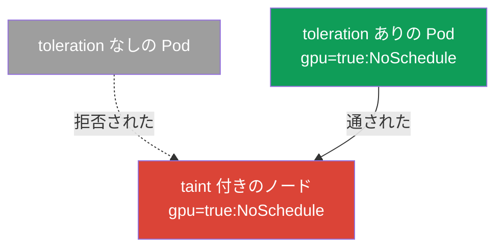
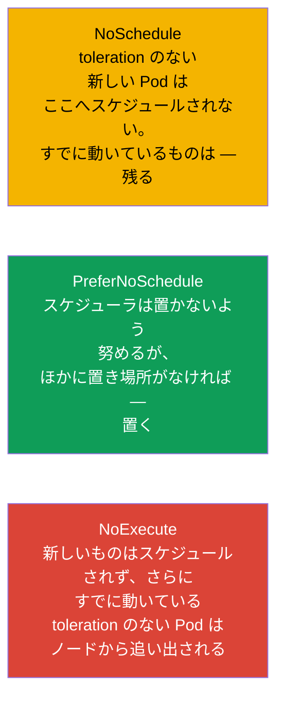
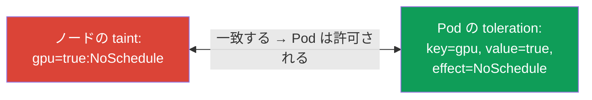
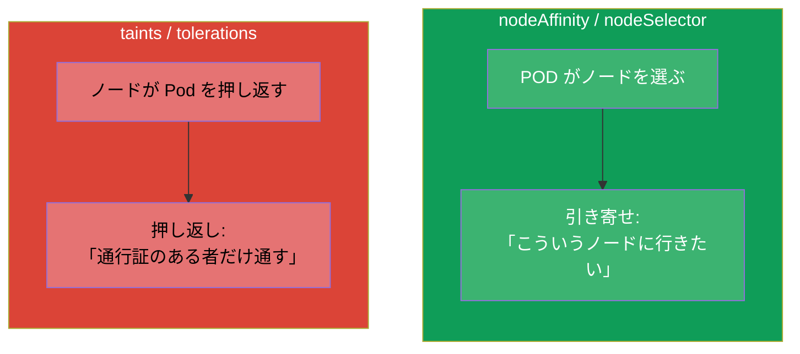
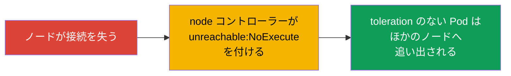

[Русская версия](ru.md) · [Eng version](README.md) · [Versión en español](es.md) · [Version française](fr.md) · [Deutsche Version](de.md) · [ქართული ვერსია](ge.md) · [繁體中文版](tw.md)

# 第 13 章。Taints と tolerations

> **次は何か。** 第 12 章では Pod 自身がノードを選んでいました (affinity - Pod が
> 「引き寄せられる」)。Taints と tolerations はその鏡像の仕組みです：今度は **ノードが
> Pod を押し返し**、Pod はそこへ入るための「通行証」(toleration) を持っていなければ
> なりません。これは両方の試験の Workloads & Scheduling のテーマであり、Pod が
> `Pending` になる原因のうち最も多いものの 1 つです。taints の理解は troubleshooting
> にも欠かせません：control plane、「体調の悪い」ノード、専用ノードは、まさにこの
> 仕組みの上で動いています。

## 13.1. 考え方：ノードが押し返し、Pod は通行証を見せる

「入場チェック」というたとえがいちばん分かりやすいでしょう。

- **Taint (ノードに付ける制限マーク)** - 入口に貼られた掲示のようなものです：「そのままでは
  通さない」。taint の付いたノードは、デフォルトでは Pod を受け入れません。
- **Toleration (Pod 側の受容)** - 「その taint が付いたノードにいても平気です」と告げる
  「通行証」です。合致する toleration を持つ Pod だけが通されます。



すぐに身につけるべき最も重要な細かい点：**toleration は Pod をノードへ引き寄せるのでは
なく、そこにいることを許可するだけ** です。Toleration は禁止を解除しますが、配置を
保証はしません。引き寄せもしたいなら - toleration を nodeSelector / affinity (第 12 章)
と組み合わせます。

## 13.2. taint の構造

Taint は 3 つの部分からなります：`キー=値:効果`。

```
gpu=true:NoSchedule
│   │    └─ 効果: toleration のない Pod をどう扱うか
│   └─ 値 (なくてもよい)
└─ キー
```

ノードへは次のコマンドで付けます：

```bash
kubectl taint nodes worker-1 gpu=true:NoSchedule
# 外す — 末尾に「マイナス」記号
kubectl taint nodes worker-1 gpu=true:NoSchedule-
# ノードの taints を見る
kubectl describe node worker-1 | grep -i taint
```

## 13.3. taint の 3 つの効果

効果は、合致する toleration を持たない Pod に何が起きるかを決めます。効果は 3 つあり、
その違いはよく問われます。



| 効果 | toleration のない新しい Pod | toleration のないすでに動いている Pod |
|--------|---------------------------|-------------------------------------|
| `NoSchedule` | スケジュールされない | 動いたまま残る |
| `PreferNoSchedule` | できるだけスケジュールしない (ゆるやか) | 動いたまま残る |
| `NoExecute` | スケジュールされない | ノードから **追い出される** |

`NoExecute` はもっとも厳しいものです：新しいものを通さないだけでなく、対応する
toleration を持たない既存の Pod も追い出します。

## 13.4. Pod の toleration

Toleration は Pod の `spec.tolerations` に書き、taint のキー、値、効果と一致していなければ
なりません (または `Exists` 演算子を使います)。

```yaml
spec:
  tolerations:
  - key: "gpu"
    operator: "Equal"       # Equal (value が一致) または Exists (value は何でもよい)
    value: "true"
    effect: "NoSchedule"
```

演算子：
- **`Equal`** - キー、値、効果のすべてが一致しなければなりません。
- **`Exists`** - キーの一致だけで十分です (値は問いません)。キーも省略すると、その
  toleration は「あらゆる taint を受け入れる」ようになります (一部のシステム
  コンポーネントがそうしています)。



## 13.5. taints と affinity：混同しないこと

これは直交する 2 つの仕組みで、よく混同されます。違いをはっきり押さえておきましょう：



| | affinity / nodeSelector | taints / tolerations |
|---|------------------------|----------------------|
| 主導するのは誰か | Pod (「ここに行きたい」) | ノード (「身内だけ通す」) |
| 動作 | 引き寄せる | 押し返す |
| ルールがない場合 | Pod は特にどこへも引き寄せられない | ノードが Pod を拒否する |

この 2 つはしばしば **一緒に** 使われます：taint がノードを特定の種類の処理のために
予約し (ほかのすべてを押し返し)、必要な Pod には toleration (通行証) と nodeAffinity
(まさにここへの引き寄せ) の両方を与えます。GPU / ingress 用の専用ノードはこうやって
作ります。

## 13.6. 組み込みの taints と control plane

Kubernetes は重要な場面で自分から taints を付けます。troubleshooting のために知って
おく必要があります。

- **Control plane。** control plane のノードはデフォルトで taint
  `node-role.kubernetes.io/control-plane:NoSchedule` を持っています。だから通常の
  アプリケーションはそこへは行きません。システムコンポーネント (たとえば監視の
  DaemonSet、第 11 章) は対応する toleration を持っています。
- **ノードの問題。** 障害が起きると node コントローラーは、体調の悪いノードから Pod を
  逃がすために `NoExecute` 効果の taints を自動で付けます：

| 自動で付く taint | いつ付くか |
|----------------------|----------------|
| `node.kubernetes.io/not-ready` | ノードが Ready でない (kubelet が応答しない) |
| `node.kubernetes.io/unreachable` | ノードに到達できない |
| `node.kubernetes.io/memory-pressure` | メモリ不足 |
| `node.kubernetes.io/disk-pressure` | ディスク容量不足 |
| `node.kubernetes.io/unschedulable` | ノードが unschedulable とマークされた (cordon) |



ここからノード保守のコマンドとの重要なつながりが出てきます：`kubectl cordon` はノードを
unschedulable にし (taint)、`kubectl drain` はそこから Pod を追い出します - これは
第 36 章 (クラスタのアップグレード) で詳しく見ていきます。

## 13.7. tolerationSeconds：追い出しの遅延

`NoExecute` の taint については、追い出される前に Pod がどれだけ「粘る」かを指定できます：

```yaml
  tolerations:
  - key: "node.kubernetes.io/unreachable"
    operator: "Exists"
    effect: "NoExecute"
    tolerationSeconds: 300      # 5 分粘り、そのあと退去する
```

Kubernetes は `not-ready` / `unreachable` に対するこうした tolerations を、デフォルト値
(通常は 300 秒) で Pod へ自分から追加します。これは短いネットワーク障害での無駄な引っ越しを
防ぎます：ノードが 5 分以内に戻ってくれば、Pod は無駄に移動しません。

## 13.8. 本番環境でこれをどう使うか

- **処理の種類ごとの専用ノード。** 高価な GPU ノード、ingress 用のノード、特定チーム用の
  ノードは taint で予約します - 関係のない Pod が入り込まないようにするためです。必要な
  Pod には toleration (通行証) を、そしてたいていはさらに nodeAffinity (きちんと
  引き寄せるため) を与えます。古典的な「taint + toleration + affinity」パターンです。
- **control plane の隔離。** 本番の control plane は taint で閉じられており、
  アプリケーションがクラスタの「頭脳」とリソースを争わないようにします。通行証を持つのは
  システムの DaemonSet だけです。
- **体調の悪いノードからの自動追い出し。** 自動の `NoExecute` taints (not-ready、
  unreachable) は、クラスタが故障したノードから Pod を自分で避難させる仕組みそのものです。
  `tolerationSeconds` は「早く逃がす」と「短い障害で無駄に動かさない」のバランスを取ります。
- **計画的な保守。** ノードのアップグレードや修理の前には `cordon` + `drain` を行います -
  これは taint を付け、ダウンタイムなしで Pod をほかのノードへゆるやかに追い出します
  (第 36 章)。
- **Pending のよくある原因。** ノードに付けたまま忘れられた taint (たとえば手作業の
  実験のあと) は、Pod が「どこにも収まらない」典型的な理由です。Pending を調べるときは
  必ずノードの taints とリソースの両方を見ます。

## 13.9. ミニ用語集

- **Taint** - ノードに付ける制限マーク (`キー=値:効果`) で、Pod を押し返します。
- **Toleration** - taint の付いたノードにいることを許す Pod の「通行証」。
- **NoSchedule** - toleration のない新しい Pod をスケジュールしない (既存のものは残る)。
- **PreferNoSchedule** - ここへのスケジューリングをゆるやかに避ける。
- **NoExecute** - スケジュールせず、toleration のないすでに動いている Pod も追い出す。
- **operator Equal/Exists** - 値まで一致 / キーだけ一致。
- **tolerationSeconds** - NoExecute のノードで Pod が追い出されるまで粘る時間。
- **cordon / drain** - ノードを unschedulable とマークする / そこから Pod を追い出す (第 36 章)。

## 13.10. 本章のまとめ

- Taints と tolerations は affinity の鏡像です：ノードが Pod を **押し返し**、Pod は
  そこへ入るために **通行証** (toleration) を見せます。
- Toleration は配置を許可するだけで、引き寄せはしません。引き寄せには nodeSelector /
  affinity が必要です。
- Taint = `キー=値:効果`。効果は：NoSchedule (新しいものを通さない)、
  PreferNoSchedule (ゆるやかに避ける)、NoExecute (通さず、既存のものも追い出す)。
- Toleration は taint とキー / 値 / 効果で一致します。演算子は Equal (値で) または
  Exists (キーで)。
- Kubernetes は自分から taints を付けます：control plane に (`NoSchedule`)、問題のある
  ノードに (`NoExecute`：not-ready、unreachable、pressure)。
- `tolerationSeconds` は `NoExecute` での追い出しを遅らせ、短い障害での引っ越しから
  守ります。
- 本番では taints が専用ノードを予約し (toleration + affinity と組み合わせて)、
  control plane を隔離し、体調の悪いノードから Pod を自動で避難させます。

## 13.11. これがどう役に立つか：試験と実際の仕事で

**試験では。** 「ノードに taint を付けよ」「Pod に toleration を追加せよ」「なぜ Pod が
Pending なのか」は典型的な課題です。`kubectl taint` コマンド、3 つの効果と toleration の
構造の知識、そして control plane の組み込み taints の理解が必要です。試験で Pending に
なる理由は、対応する toleration のない taint であることが非常に多いです。

**実際の仕事では。** Taints/tolerations はノードの予約 (GPU、ingress)、control plane の
隔離、故障したノードからの自動避難の仕組みです。アップグレード時のノード保守
(`cordon`/`drain`) もこの上に立っています。忘れられた taint は「Pod が収まらない」の
よくある原因なので、スケジューリングの問題を調べるときには必ず確認します。

## 13.12. 自己チェックの質問

1. taints/tolerations は作用の「向き」において affinity とどう違いますか？
2. なぜ toleration は Pod のノードへの配置を保証しないのですか？
3. taint `gpu=true:NoSchedule` を部分ごとに分解してください。NoExecute は NoSchedule と
   どう違いますか？
4. Toleration はどのように taint と一致しますか？`Exists` は `Equal` とどう違いますか？
5. control plane にはデフォルトでどの taint が付いていて、なぜアプリケーションはそこへ
   行かないのですか？
6. ノードが unreachable になったとき、node コントローラーは Pod に対して何をしますか？
7. `tolerationSeconds` は何のために必要で、何から守ってくれますか？

## 演習

引き寄せ (第 12 章) と押し返し (この章) の両方を見てきました。第 14 章では Pod の
リソース - requests、limits、クォータへ進みます。これらもスケジューリングと、Pod が
ノードに収まるかどうかに影響します。Taints/tolerations はスケジューリングのラボで
練習します。

🧪 ラボ 122 (taints/tolerations のドリルを含む): [tasks/cka/labs/122](../../labs/122/README_JP.MD)

---
[目次](../README_JP.md) · [第 12 章](../12/jp.md) · [第 14 章](../14/jp.md)
