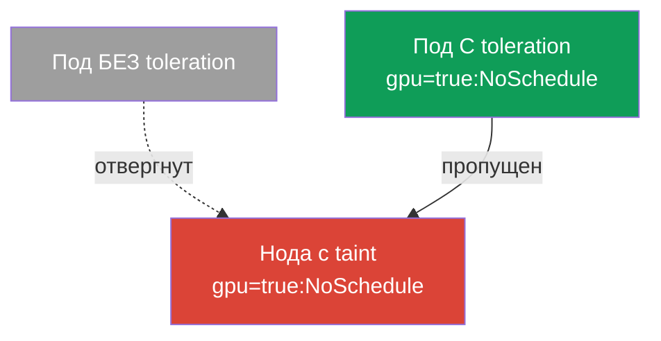
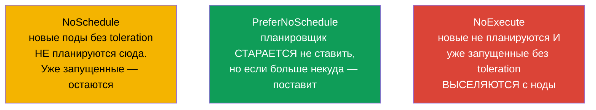
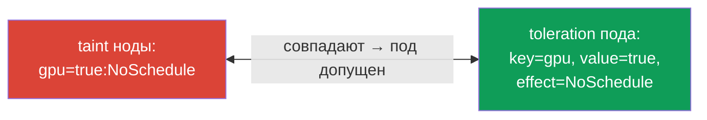
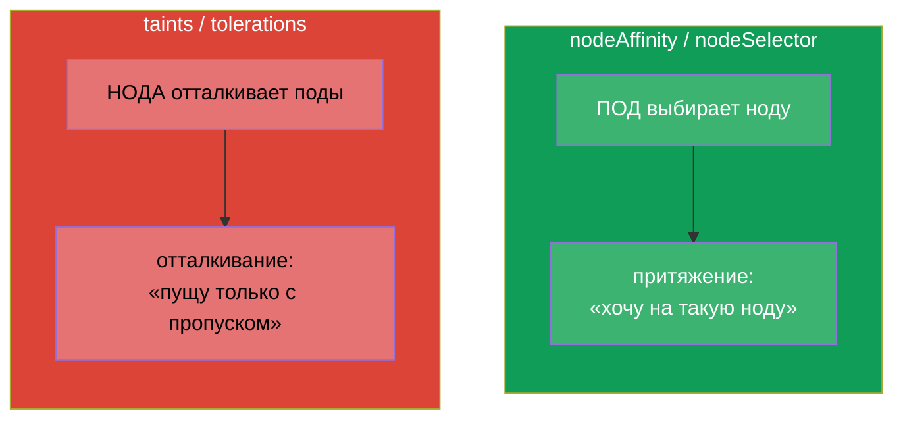
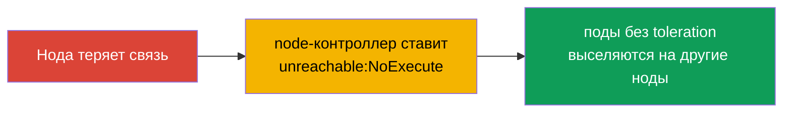

# Глава 13. Taints и tolerations

> **Что дальше.** В главе 12 под сам выбирал ноду (affinity - под «притягивается»).
> Taints и tolerations - зеркальный механизм: теперь **нода отталкивает** поды, а под
> должен иметь «пропуск» (toleration), чтобы на неё попасть. Это тема Workloads &
> Scheduling обоих экзаменов и один из самых частых источников подов в `Pending`.
> Понимание taints обязательно и для troubleshooting: control plane, «больные» ноды и
> выделенные ноды работают именно на этом механизме.

## 13.1. Идея: нода отталкивает, под предъявляет пропуск

Проще всего понять на метафоре «фейс-контроль».

- **Taint (метка-ограничение на ноде)** - это как объявление на входе: «просто так не
  пущу». Нода с taint по умолчанию не принимает поды.
- **Toleration (терпимость у пода)** - это «пропуск», который говорит: «я могу
  находиться на ноде с таким taint». Только под с подходящим toleration пустят.



Важнейшая тонкость, которую надо усвоить сразу: **toleration не притягивает под к ноде,
он лишь разрешает** там оказаться. Toleration снимает запрет, но не гарантирует
размещение. Если надо и притянуть, и разрешить - toleration комбинируют с nodeSelector/
affinity (глава 12).

## 13.2. Анатомия taint

Taint состоит из трёх частей: `ключ=значение:эффект`.

```
gpu=true:NoSchedule
│   │    └─ эффект: что делать с подами без toleration
│   └─ значение (может отсутствовать)
└─ ключ
```

Ставится на ноду командой:

```bash
kubectl taint nodes worker-1 gpu=true:NoSchedule
# снять — знак «минус» в конце
kubectl taint nodes worker-1 gpu=true:NoSchedule-
# посмотреть taints ноды
kubectl describe node worker-1 | grep -i taint
```

## 13.3. Три эффекта taint

Эффект определяет, что происходит с подами без подходящего toleration. Их три, и разница
между ними - частый вопрос.



| Эффект | Новые поды без toleration | Уже запущенные поды без toleration |
|--------|---------------------------|-------------------------------------|
| `NoSchedule` | не планируются | остаются работать |
| `PreferNoSchedule` | стараются не планироваться (мягко) | остаются работать |
| `NoExecute` | не планируются | **выселяются** с ноды |

`NoExecute` - самый жёсткий: он не только не пускает новых, но и выгоняет существующие
поды, у которых нет соответствующего toleration.

## 13.4. Toleration в поде

Toleration описывается в `spec.tolerations` пода и должен совпадать с taint по ключу,
значению и эффекту (либо использовать оператор `Exists`).

```yaml
spec:
  tolerations:
  - key: "gpu"
    operator: "Equal"       # Equal (совпадение value) или Exists (любое value)
    value: "true"
    effect: "NoSchedule"
```

Операторы:
- **`Equal`** - совпадать должны и ключ, и значение, и эффект.
- **`Exists`** - достаточно совпадения ключа (значение не важно). Если опустить и ключ -
  toleration «терпит любой taint» (так делают некоторые системные компоненты).



## 13.5. Taints против affinity: не путать

Это два ортогональных механизма, их часто путают. Держите различие чётко:



| | affinity / nodeSelector | taints / tolerations |
|---|------------------------|----------------------|
| Кто инициатор | под («хочу сюда») | нода («пущу только своих») |
| Действие | притягивает | отталкивает |
| Что без правила | под не притянут никуда особо | нода отвергает под |

Их часто используют **вместе**: taint резервирует ноду под определённый класс задач
(отталкивает всех), а нужные поды получают и toleration (пропуск), и nodeAffinity
(притяжение именно сюда). Так делают выделенные ноды под GPU/ingress.

## 13.6. Встроенные taints и control plane

Kubernetes сам ставит taints в важных случаях. Их надо знать для troubleshooting.

- **Control plane.** Ноды control plane по умолчанию несут taint
  `node-role.kubernetes.io/control-plane:NoSchedule`. Поэтому обычные приложения туда не
  попадают. Системные компоненты (например, DaemonSet мониторинга, глава 11) несут
  соответствующий toleration.
- **Проблемы ноды.** При сбоях node-контроллер автоматически ставит taints с эффектом
  `NoExecute`, чтобы увести поды с больной ноды:

| Автоматический taint | Когда ставится |
|----------------------|----------------|
| `node.kubernetes.io/not-ready` | нода не готова (kubelet не отвечает) |
| `node.kubernetes.io/unreachable` | нода недостижима |
| `node.kubernetes.io/memory-pressure` | нехватка памяти |
| `node.kubernetes.io/disk-pressure` | нехватка места на диске |
| `node.kubernetes.io/unschedulable` | нода помечена как unschedulable (cordon) |



Отсюда важная связка с командами обслуживания нод: `kubectl cordon` ставит ноду
unschedulable (taint), а `kubectl drain` выселяет с неё поды - это мы подробно разберём в
главе 36 (обновление кластера).

## 13.7. tolerationSeconds: отложенное выселение

Для taint'ов `NoExecute` можно указать, сколько под ещё «продержится» перед выселением:

```yaml
  tolerations:
  - key: "node.kubernetes.io/unreachable"
    operator: "Exists"
    effect: "NoExecute"
    tolerationSeconds: 300      # держаться 5 минут, потом уйти
```

Kubernetes сам добавляет подам такие tolerations на `not-ready`/`unreachable` со
значением по умолчанию (обычно 300 секунд). Это защищает от лишних переездов при коротких
сетевых сбоях: если нода вернётся за 5 минут, поды не будут зря мигрировать.

## 13.8. Как это применяют в продакшене

- **Выделенные ноды под класс задач.** Дорогие GPU-ноды, ноды под ingress, ноды под
  конкретную команду резервируют taint'ом - чтобы туда не заезжали посторонние поды.
  Нужные поды получают toleration (пропуск) и обычно ещё nodeAffinity (чтобы именно
  притянуться). Классический паттерн «taint + toleration + affinity».
- **Изоляция control plane.** Продовый control plane закрыт taint'ом, чтобы приложения не
  конкурировали за ресурсы с «мозгом» кластера. Только системные DaemonSet имеют пропуск.
- **Автовыселение с больных нод.** Автоматические `NoExecute`-taints (not-ready,
  unreachable) - это то, как кластер сам эвакуирует поды с отказавшей ноды.
  `tolerationSeconds` балансирует между «быстро увести» и «не дёргать зря при коротком
  сбое».
- **Плановое обслуживание.** Перед апгрейдом/ремонтом ноды делают `cordon` + `drain` -
  это ставит taint и мягко выселяет поды на другие ноды без простоя (глава 36).
- **Частый источник Pending.** Забытый taint на ноде (например, после ручных
  экспериментов) - типичная причина, почему поды «никуда не помещаются». При разборе
  Pending всегда смотрят и taints нод, и ресурсы.

## 13.9. Мини-глоссарий

- **Taint** - метка-ограничение на ноде (`ключ=значение:эффект`), отталкивающая поды.
- **Toleration** - «пропуск» у пода, позволяющий находиться на ноде с taint.
- **NoSchedule** - не планировать новые поды без toleration (старые остаются).
- **PreferNoSchedule** - мягко избегать планирования сюда.
- **NoExecute** - не планировать и выселять уже запущенные поды без toleration.
- **operator Equal/Exists** - совпадение по значению / только по ключу.
- **tolerationSeconds** - сколько под держится на ноде с NoExecute перед выселением.
- **cordon / drain** - пометить ноду unschedulable / выселить с неё поды (глава 36).

## 13.10. Итоги главы

- Taints и tolerations - зеркало affinity: нода **отталкивает** поды, а под предъявляет
  **пропуск** (toleration), чтобы туда попасть.
- Toleration только разрешает размещение, но не притягивает; для притяжения нужен
  nodeSelector/affinity.
- Taint = `ключ=значение:эффект`; эффекты: NoSchedule (не пускать новых),
  PreferNoSchedule (мягко избегать), NoExecute (не пускать и выселять существующих).
- Toleration совпадает с taint по ключу/значению/эффекту; оператор Equal (по значению)
  или Exists (по ключу).
- Kubernetes сам ставит taints: на control plane (`NoSchedule`) и на проблемные ноды
  (`NoExecute`: not-ready, unreachable, pressure).
- `tolerationSeconds` откладывает выселение при `NoExecute`, защищая от переездов при
  коротких сбоях.
- В проде taints резервируют выделенные ноды (в связке toleration + affinity),
  изолируют control plane и автоматически эвакуируют поды с больных нод.

## 13.11. Как это пригодится: на экзамене и в реальной работе

**На экзамене.** «Поставь taint на ноду», «добавь toleration поду», «почему под в
Pending» - типовые задания. Нужны команды `kubectl taint`, знание трёх эффектов и
структуры toleration, а также понимание встроенных taints control plane. Очень часто
Pending на экзамене объясняется именно taint'ом без соответствующего toleration.

**В реальной работе.** Taints/tolerations - механизм резервирования нод (GPU, ingress),
изоляции control plane и автоматической эвакуации с отказавших нод. Обслуживание нод
(`cordon`/`drain`) при апгрейдах тоже стоит на этом. Забытый taint - частая причина
«поды не помещаются», поэтому его проверяют при любом разборе проблем планирования.

## 13.12. Вопросы для самопроверки

1. Чем taints/tolerations отличаются от affinity по «направлению» действия?
2. Почему toleration не гарантирует размещение пода на ноде?
3. Разберите taint `gpu=true:NoSchedule` по частям. Чем NoExecute отличается от
   NoSchedule?
4. Как toleration совпадает с taint? Чем `Exists` отличается от `Equal`?
5. Какой taint по умолчанию стоит на control plane и почему приложения туда не попадают?
6. Что делает node-контроллер с подами, когда нода становится unreachable?
7. Зачем нужен `tolerationSeconds` и от чего он защищает?

## Практика

Мы разобрали и притяжение (глава 12), и отталкивание (эта глава). В главе 14 перейдём к
ресурсам подов - requests, limits и квотам, которые тоже влияют на планирование и на то,
поместится ли под на ноде. Taints/tolerations отрабатываются в лабах по планированию.

🧪 Лаба 122 (в т.ч. дрилл на taints/tolerations): [tasks/cka/labs/122](../../labs/122/README_RU.MD)

---
[Оглавление](../README_RU.md) · [Глава 12](../12/ru.md) · [Глава 14](../14/ru.md)
