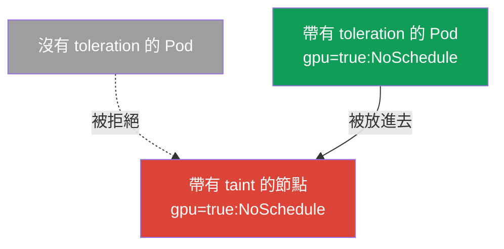
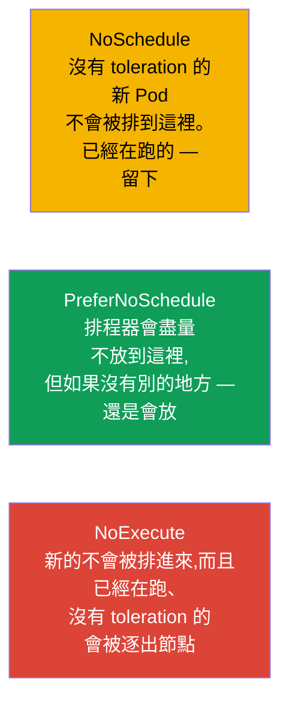
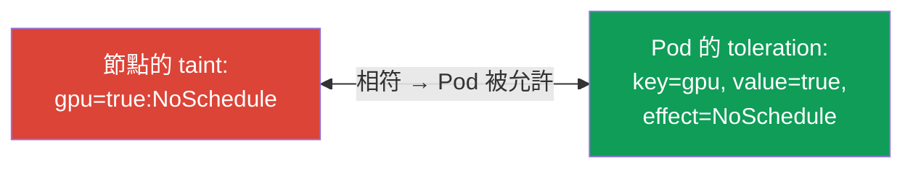
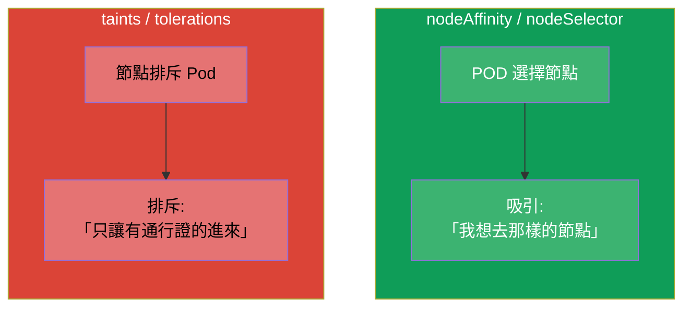

[Русская версия](ru.md) · [Eng version](README.md) · [Versión en español](es.md) · [Version française](fr.md) · [Deutsche Version](de.md) · [ქართული ვერსია](ge.md) · [日本語版](jp.md)

# 第 13 章。Taints 與 tolerations

> **接下來是什麼。** 在第 12 章裡是 Pod 自己在挑節點(affinity - Pod「被吸引過去」)。
> Taints 與 tolerations 是鏡像的機制:現在是 **節點排斥** Pod,而 Pod 必須持有
> 「通行證」(toleration)才能進到它上面。這是兩場考試的 Workloads &
> Scheduling 主題,也是 Pod 卡在 `Pending` 最常見的來源之一。
> 理解 taints 對 troubleshooting 也是必須的:control plane、「生病的」節點與
> 專用節點,靠的正是這個機制。

## 13.1. 概念:節點排斥,Pod 出示通行證

用「門禁管制」這個比喻最容易理解。

- **Taint(節點上的限制標記)** - 就像入口處的公告:「不能隨便進來」。帶有 taint
  的節點預設不接受 Pod。
- **Toleration(Pod 的容忍)** - 就是「通行證」,它說:「我可以待在帶有這種
  taint 的節點上」。只有帶著相符 toleration 的 Pod 才會被放進去。



必須立刻掌握的最重要細節:**toleration 不會把 Pod 吸引到節點上,它只是允許** Pod
出現在那裡。Toleration 解除了禁令,但不保證放置。如果既要吸引又要允許 - 就把
toleration 跟 nodeSelector/affinity(第 12 章)組合起來用。

## 13.2. Taint 的結構

Taint 由三個部分組成:`鍵=值:效果`。

```
gpu=true:NoSchedule
│   │    └─ 效果:對沒有 toleration 的 Pod 要怎麼做
│   └─ 值(可以不存在)
└─ 鍵
```

在節點上設定的指令:

```bash
kubectl taint nodes worker-1 gpu=true:NoSchedule
# 移除 — 在結尾加上「減號」
kubectl taint nodes worker-1 gpu=true:NoSchedule-
# 查看節點的 taints
kubectl describe node worker-1 | grep -i taint
```

## 13.3. Taint 的三種效果

效果決定了沒有相符 toleration 的 Pod 會發生什麼事。一共有三種,而它們之間的
差別是很常見的考點。



| 效果 | 沒有 toleration 的新 Pod | 已經在跑、沒有 toleration 的 Pod |
|--------|---------------------------|-------------------------------------|
| `NoSchedule` | 不會被排程 | 繼續留著運行 |
| `PreferNoSchedule` | 盡量不排到這裡(軟性) | 繼續留著運行 |
| `NoExecute` | 不會被排程 | **被逐出** 節點 |

`NoExecute` 是最嚴厲的:它不只不放新的進來,還會把沒有對應 toleration 的
現有 Pod 趕走。

## 13.4. Pod 裡的 toleration

Toleration 寫在 Pod 的 `spec.tolerations` 裡,並且必須在鍵、值與效果上與 taint
相符(或者使用 `Exists` 運算子)。

```yaml
spec:
  tolerations:
  - key: "gpu"
    operator: "Equal"       # Equal(value 相符)或 Exists(任何 value)
    value: "true"
    effect: "NoSchedule"
```

運算子:
- **`Equal`** - 鍵、值與效果都必須相符。
- **`Exists`** - 只要鍵相符就夠了(值不重要)。如果連鍵也省略 - 這個 toleration
  就「容忍任何 taint」(有些系統元件就是這麼做的)。



## 13.5. Taints 與 affinity:不要搞混

這是兩個彼此正交的機制,常常被混在一起。請把差別記清楚:



| | affinity / nodeSelector | taints / tolerations |
|---|------------------------|----------------------|
| 誰是發起者 | Pod(「我想去這裡」) | 節點(「只讓自己人進來」) |
| 動作 | 吸引 | 排斥 |
| 沒有規則時會怎樣 | Pod 不會特別被吸引到哪裡 | 節點拒絕 Pod |

它們常常被 **一起** 使用:taint 把節點保留給某一類任務(排斥所有人),而需要的
Pod 同時拿到 toleration(通行證)與 nodeAffinity(正好被吸引到這裡)。GPU/ingress
的專用節點就是這麼做的。

## 13.6. 內建的 taints 與 control plane

Kubernetes 自己會在一些重要情況下設定 taints。為了 troubleshooting,必須知道它們。

- **Control plane。** control plane 的節點預設帶著 taint
  `node-role.kubernetes.io/control-plane:NoSchedule`。因此一般的應用程式進不去
  那裡。系統元件(例如監控的 DaemonSet,第 11 章)則帶著對應的 toleration。
- **節點的問題。** 發生故障時,node 控制器會自動設定效果為 `NoExecute` 的
  taints,以便把 Pod 從生病的節點上帶走:

| 自動的 taint | 什麼時候會被設定 |
|----------------------|----------------|
| `node.kubernetes.io/not-ready` | 節點未就緒(kubelet 沒有回應) |
| `node.kubernetes.io/unreachable` | 節點無法連通 |
| `node.kubernetes.io/memory-pressure` | 記憶體不足 |
| `node.kubernetes.io/disk-pressure` | 磁碟空間不足 |
| `node.kubernetes.io/unschedulable` | 節點被標記為 unschedulable(cordon) |


由此可見它與節點維護指令之間的重要關聯:`kubectl cordon` 會把節點設為
unschedulable(taint),而 `kubectl drain` 會把 Pod 從它上面逐出 - 這些我們會在
第 36 章(叢集升級)裡詳細拆解。

## 13.7. tolerationSeconds:延後的逐出

對於 `NoExecute` 的 taint,可以指定 Pod 在被逐出之前還能「撐」多久:

```yaml
  tolerations:
  - key: "node.kubernetes.io/unreachable"
    operator: "Exists"
    effect: "NoExecute"
    tolerationSeconds: 300      # 撐 5 分鐘,然後離開
```

Kubernetes 自己會為 Pod 加上針對 `not-ready`/`unreachable` 的這種 tolerations,
並帶著預設值(通常是 300 秒)。這可以避免短暫網路故障造成多餘的搬遷:如果節點在
5 分鐘內回來,Pod 就不會白白遷移。

## 13.8. 這在生產環境中如何應用

- **依任務類別劃分的專用節點。** 昂貴的 GPU 節點、給 ingress 用的節點、給特定
  團隊用的節點,都會用 taint 保留起來 - 好讓外來的 Pod 不會開進去。需要的 Pod
  會拿到 toleration(通行證),而且通常還會加上 nodeAffinity(才能真的被吸引
  過去)。這就是經典的「taint + toleration + affinity」模式。
- **Control plane 的隔離。** 生產環境的 control plane 用 taint 關起來,好讓應用
  程式不會跟叢集的「大腦」競爭資源。只有系統的 DaemonSet 才有通行證。
- **從生病的節點自動逐出。** 自動的 `NoExecute` taints(not-ready、
  unreachable)就是叢集自己從故障節點上撤離 Pod 的方式。
  `tolerationSeconds` 在「快點帶走」與「短暫故障時不要白折騰」之間取得平衡。
- **計畫性維護。** 在升級/維修節點之前會做 `cordon` + `drain` - 這會設定 taint
  並溫和地把 Pod 逐出到其他節點,不造成停機(第 36 章)。
- **Pending 的常見來源。** 節點上被遺忘的 taint(例如手動實驗之後留下的)- 是
  Pod「哪裡都放不下」的典型原因。在排查 Pending 時,總是要同時看節點的 taints
  與資源。

## 13.9. 迷你詞彙表

- **Taint** - 節點上的限制標記(`鍵=值:效果`),會排斥 Pod。
- **Toleration** - Pod 的「通行證」,讓它可以待在帶有 taint 的節點上。
- **NoSchedule** - 不排程沒有 toleration 的新 Pod(舊的留下)。
- **PreferNoSchedule** - 軟性地避免排到這裡。
- **NoExecute** - 不排程,並且逐出已經在跑、沒有 toleration 的 Pod。
- **operator Equal/Exists** - 依值相符 / 只依鍵相符。
- **tolerationSeconds** - Pod 在帶有 NoExecute 的節點上被逐出之前能撐多久。
- **cordon / drain** - 把節點標記為 unschedulable / 把 Pod 從它上面逐出(第 36 章)。

## 13.10. 本章總結

- Taints 與 tolerations 是 affinity 的鏡像:節點 **排斥** Pod,而 Pod 要出示
  **通行證**(toleration)才能進去那裡。
- Toleration 只是允許放置,並不會吸引;要吸引就需要 nodeSelector/affinity。
- Taint = `鍵=值:效果`;效果有:NoSchedule(不放新的進來)、
  PreferNoSchedule(軟性避開)、NoExecute(不放進來並逐出現有的)。
- Toleration 依鍵/值/效果與 taint 相符;運算子有 Equal(依值)
  或 Exists(依鍵)。
- Kubernetes 自己會設定 taints:在 control plane 上(`NoSchedule`)與在有問題的
  節點上(`NoExecute`:not-ready、unreachable、pressure)。
- `tolerationSeconds` 會延後 `NoExecute` 時的逐出,避免短暫故障造成搬遷。
- 在生產環境中,taints 用來保留專用節點(搭配 toleration + affinity)、
  隔離 control plane,並自動從生病的節點撤離 Pod。

## 13.11. 這些知識用在哪裡:考試與實際工作

**在考試中。** 「在節點上設一個 taint」、「給 Pod 加上 toleration」、「為什麼 Pod
卡在 Pending」都是典型題目。需要 `kubectl taint` 指令、三種效果與 toleration 結構
的知識,以及對 control plane 內建 taints 的理解。考試中的 Pending 非常常見的原因,
正是有 taint 卻沒有對應的 toleration。

**在實際工作中。** Taints/tolerations 是保留節點(GPU、ingress)、隔離 control
plane 與從故障節點自動撤離的機制。升級時的節點維護(`cordon`/`drain`)也建立在
這之上。被遺忘的 taint 是「Pod 放不下」的常見原因,因此在排查任何排程問題時都會
檢查它。

## 13.12. 自我檢查問題

1. Taints/tolerations 與 affinity 在作用「方向」上有什麼不同?
2. 為什麼 toleration 不保證 Pod 會被放到節點上?
3. 請把 taint `gpu=true:NoSchedule` 按部分拆解。NoExecute 與 NoSchedule 有什麼
   不同?
4. Toleration 是如何與 taint 相符的?`Exists` 與 `Equal` 有什麼不同?
5. control plane 上預設有什麼 taint,為什麼應用程式進不去那裡?
6. 當節點變成 unreachable 時,node 控制器會對 Pod 做什麼?
7. 為什麼需要 `tolerationSeconds`,它防的是什麼?

## 實踐

我們既拆解了吸引(第 12 章),也拆解了排斥(這一章)。在第 14 章我們會進到
Pod 的資源 - requests、limits 與配額,它們同樣影響排程,以及 Pod 是否放得進
節點。Taints/tolerations 會在排程相關的實驗中操練。

🧪 實驗 122(其中包含 taints/tolerations 的操練):[tasks/cka/labs/122](../../labs/122/README_TW.MD)

🎮 Killercoda（在瀏覽器中，無需安裝）：[Taints and Tolerations](https://killercoda.com/chadmcrowell/course/cka/taints-tolerations) · [Add a Toleration to a Pod YAML](https://killercoda.com/chadmcrowell/course/cka/add-toleration) · [Remove the Taint from Node](https://killercoda.com/chadmcrowell/course/cka/remove-taint)

---
[目錄](../README_TW.md) · [第 12 章](../12/tw.md) · [第 14 章](../14/tw.md)
