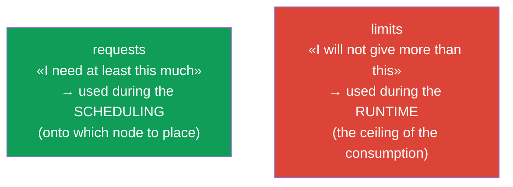
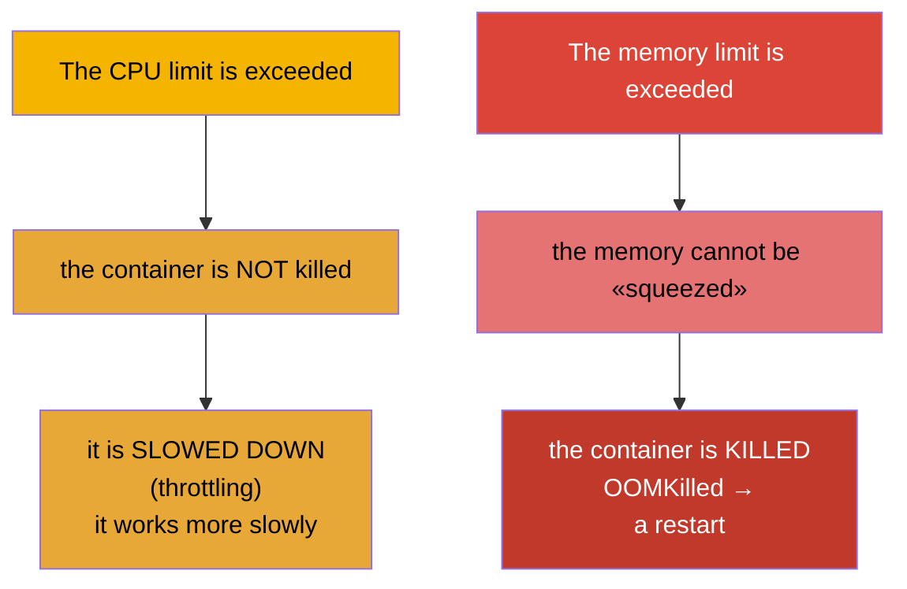
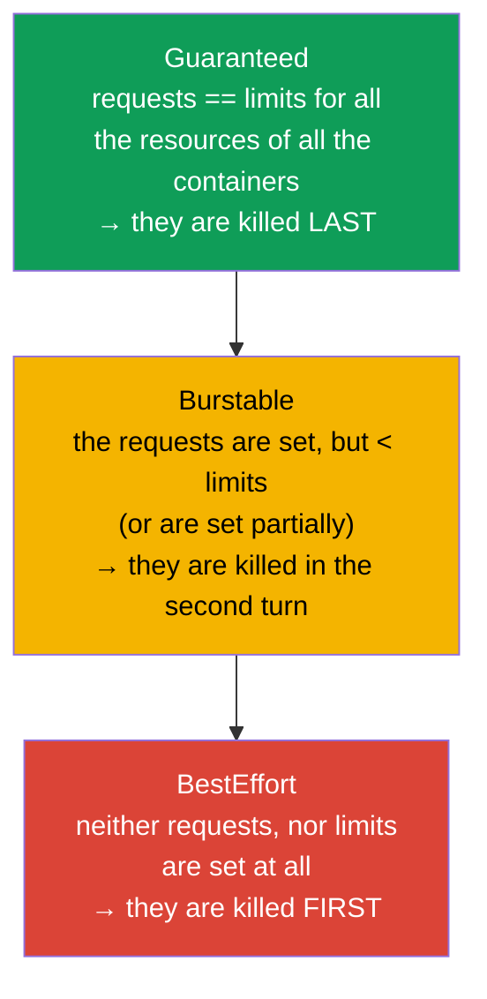
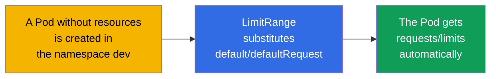
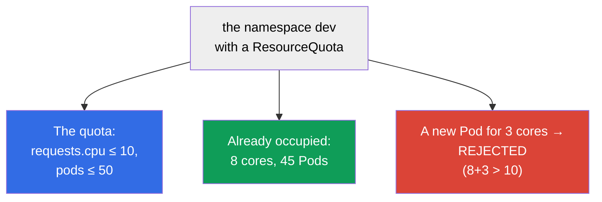

[Русская версия](ru.md) · [Versión en español](es.md) · [Version française](fr.md) · [Deutsche Version](de.md) · [ქართული ვერსია](ge.md) · [繁體中文版](tw.md) · [日本語版](jp.md)

# Chapter 14. The resources: requests, limits, LimitRange and ResourceQuota

> **What comes next.** Every Pod consumes CPU and memory. If this is not managed, one
> "voracious" container will bring down its neighbours, and the scheduler will not be able to lay out
> the load reasonably. **requests** and **limits** set the appetites of a Pod, they influence the
> scheduling and the moment when a Pod will be killed or slowed down. **LimitRange** and
> **ResourceQuota** limit the consumption at the level of a namespace. These are the topics of both
> exams (Workloads on CKA, Environment/Config on CKAD) and the everyday reality of the operation.

## 14.1. requests and limits: two different promises

A container has two settings of the resources, and they are constantly confused. Let us take them apart clearly.

- **requests (a request)** - how many resources a container **needs guaranteed**.
  The scheduler uses the requests in order to choose a node: a Pod will go only there, where
  at least that much is free. This is a "reservation".
- **limits (a limit)** - the **ceiling**, above which a container will not be allowed to consume.
  Exceeded by the memory - it will be killed (OOMKilled); exceeded by the CPU - it will be slowed down (throttling).



```yaml
spec:
  containers:
  - name: app
    image: nginx
    resources:
      requests:
        cpu: "250m"        # 0.25 of a core is guaranteed
        memory: "64Mi"
      limits:
        cpu: "500m"        # not more than half of a core
        memory: "128Mi"    # not more than 128 MiB
```

## 14.2. The units of measurement of CPU and of memory

These units have to be read fluently.

**CPU** is measured in cores, the fractional ones - in milli-cores (`m`, milli-CPU, "millicores"):

| The notation | The meaning |
|--------|----------|
| `1` or `1000m` | one full core |
| `500m` | half of a core |
| `250m` | a quarter of a core |
| `100m` | 0.1 of a core |

**How the millicores are counted.** `1000m` = one core = 100% of the processor time of one
vCPU (in a cloud this is usually one thread/hyperthread). A millicore is a **share of the processor
time per period**, and not "a separate piece of hardware". Under the hood this is implemented by the
Linux CFS scheduler through cgroups: the `requests` turn into `cpu.shares`
(a relative weight during the division of the CPU, when there is not enough of it for everybody), and the `limits` - into a CFS
quota (`cpu.cfs_quota_us`/`cpu.cfs_period_us`). For example, `500m` with a period of 100 ms
means "not more than 50 ms of CPU per every 100 ms": a container may occupy half of one
core continuously or a whole core, but only for half of a period.

**Memory** is measured in bytes, usually with the suffixes. It is important not to confuse the binary and the
decimal units:

| The binary ones (the powers of 1024) | The decimal ones (the powers of 1000) |
|-------------------------|---------------------------|
| `Ki`, `Mi`, `Gi` | `k`, `M`, `G` |
| `128Mi` = 128×1024² bytes | `128M` = 128×1000² bytes |

**What a MiB is.** The suffix `Mi` is a **mebibyte** (MiB): `1 Mi` = 2²⁰ = 1 048 576 bytes
(that is, 1024 KiB). Not to be confused with a **megabyte** (MB, the suffix `M`): `1 M` = 10⁶ =
1 000 000 bytes. Analogously `Gi` = a gibibyte (GiB, 2³⁰ bytes), and `G` = a gigabyte (10⁹ bytes).
The binary units (`Mi`, `Gi`) appeared exactly in order to remove the confusion of "1024 or 1000".
In practice in Kubernetes they use exactly them more often: `128Mi` ≈ 134 MB, and not 128 MB.

> **Be careful with the non-uniform nodes.** A millicore sets a **share of the time** of a core, and not
> an absolute performance. If the nodes in a cluster are different (for example, a part is on fast
> modern cores, a part is on old slow ones), then `500m` on a fast node will perform
> noticeably more work than `500m` on a slow one. The same requests/limits on different
> hardware give a different real power - from here there is a **skew by the load and by the latencies**: a Pod
> on a slow node will slow down and will run into the CPU throttling more often with the same limit.
> The memory does not "skew" like that (a byte is a byte everywhere), but the frequency/the throughput of the RAM
> may also differ. What to do about it: if possible keep the pools of the nodes uniform;
> if the nodes are of different types - mark them with the labels (a class of CPU) and through `nodeAffinity`
> (chapter 12) seat the workloads that are sensitive to the performance onto the needed type, and also
> put this difference into the capacity planning.

## 14.3. What happens upon an excess: CPU and memory behave differently

This is the key difference for the debugging.



- **CPU is a compressible resource.** An excess of the limit → throttling: the container is simply given
  less processor time, it slows down, but it lives.
- **Memory is an incompressible resource.** It cannot be "taken away little by little". Exceeded the limit →
  the container is killed with `OOMKilled`, the Pod is restarted (we saw this in chapter 4).

From here there is a practical rule: an understated memory limit = regular OOMKilled and
restarts; an understated CPU limit = a slow work under the load.

## 14.4. The classes of the quality of service (QoS)

By the ratio of the requests and the limits Kubernetes assigns a **QoS class** to a Pod. It
determines who will be killed first, when the memory physically runs out on a node (this is a mechanism
separate from the limits - eviction).



| The QoS class | The condition | The priority upon a shortage of memory |
|-----------|---------|-------------------------------|
| **Guaranteed** | requests = limits by all the resources | they are killed last |
| **Burstable** | the requests are set and are less than the limits | they are killed in the second turn |
| **BestEffort** | neither requests, nor limits | they are killed first |

When the memory runs out on a node, the kubelet starts to **evict** the Pods (eviction), starting with
BestEffort, then the Burstable ones that have exceeded their requests. The Guaranteed Pods are in the greatest
safety. Therefore for the critical services in production they set `requests == limits`.

## 14.5. LimitRange: the default values and the boundaries in a namespace

The problem: if a developer has not specified the requests/limits, the Pod becomes BestEffort and
risks being killed first. **LimitRange** solves this at the level of a namespace - it sets the
default values and the permissible boundaries.

```yaml
apiVersion: v1
kind: LimitRange
metadata:
  name: defaults
  namespace: dev
spec:
  limits:
  - type: Container
    default:              # the default limits, if they are not set
      cpu: "500m"
      memory: "256Mi"
    defaultRequest:       # the default requests, if they are not set
      cpu: "100m"
      memory: "64Mi"
    max:                  # the maximum that may be requested
      cpu: "2"
      memory: "1Gi"
    min:                  # the minimum
      cpu: "50m"
      memory: "32Mi"
```



LimitRange acts upon a **separate object** (a container/a Pod/a PVC) in a namespace: it sets
the defaults and checks that what has been requested fits into the min/max. If a Pod goes out of the
boundaries - it will be rejected.

## 14.6. ResourceQuota: the total limit on a namespace

**ResourceQuota** limits the **total** consumption of the whole namespace: how much CPU/memory
in total all the Pods together may request, how many objects of each type may be created.

```yaml
apiVersion: v1
kind: ResourceQuota
metadata:
  name: team-quota
  namespace: dev
spec:
  hard:
    requests.cpu: "10"          # in total all the CPU requests ≤ 10 cores
    requests.memory: "20Gi"
    limits.cpu: "20"
    limits.memory: "40Gi"
    pods: "50"                  # not more than 50 Pods
    services: "10"
    persistentvolumeclaims: "5"
```



The difference between LimitRange and ResourceQuota (a frequent question):

| | LimitRange | ResourceQuota |
|---|-----------|---------------|
| The level | a separate object (a container/a Pod/a PVC) | the whole namespace in total |
| What it does | the defaults + min/max on an object | a common ceiling on a namespace |
| An example | "a Pod: minimum 50m, maximum 2 cores" | "the whole namespace: not more than 10 cores and 50 Pods" |

> **An important nuance.** If there is a ResourceQuota by the `requests`/`limits` in a namespace, then
> every Pod **is obliged** to specify the corresponding requests/limits, otherwise it will be rejected.
> This is exactly where LimitRange helps out: it will set the defaults, and the Pods will pass the quota.

## 14.7. How this is applied in production

- **requests/limits are obligatory for everybody.** In the mature clusters a Pod without requests/limits
  simply will not pass (through LimitRange + admission). This protects the nodes from the "voracious"
  neighbours and gives the scheduler an exact picture for the layout.
- **Guaranteed for the critical services.** For the databases and the important services they set `requests ==
  limits` (Guaranteed), so that they are not evicted first upon a shortage of memory. For the flexible
  background tasks Burstable is allowed.
- **LimitRange + ResourceQuota on every namespace.** A typical practice of the multitenancy:
  to every team - a namespace with its own quota (how many resources in total it is allowed) and a
  LimitRange (the defaults and the boundaries on an object). That is how one team does not "eat up" the whole cluster.
- **Right-sizing by the metrics.** The requests/limits are selected by the real consumption
  (`kubectl top`, Prometheus, the VPA recommendations). Overstated requests → idling,
  but "reserved" resources and extra money; understated memory limits → OOMKilled.
- **OOMKilled and throttling are frequent incidents.** Mass OOMKilled after a release is a signal
  of an understated memory limit; inexplicable slowdowns under the load are a CPU throttling. This is
  the first thing that is checked by the metrics upon the complaints about the performance.

### A case: how to select the requests/limits for a new application

A typical situation: a new service has been rolled out and we do not know which requests/limits to set -
there is no consumption profile yet. To guess by the eye is dangerous: if you understate the memory - the
OOMKilled will pour in, if you understate the CPU - the service will slow down, if you overstate - you will reserve the resources for nothing and
overpay. The correct approach is **iterative**, from the knowingly safe to the exact one.

1. **We start with a margin.** On the first release we consciously set the requests/limits "with a
   margin" (for example, by a rough estimate ×1.5-2 of the expected one). The task of the first step is not to
   economize, but not to fall: to avoid OOMKilled and a harsh throttling, while there is no real
   data. It is better at the same time not to overstate the `requests` more than needed - the
   scheduling and the cost of the "reservation" depend on them.
2. **We observe under a real load.** We gather the metrics of the consumption of CPU and of memory over a
   representative period - obligatorily having captured the **full cycles of the load**: the daily
   peaks, the night, the weekends, and also the one-time bursts (the releases, the batches, the sales).
   The tools: `kubectl top`, Prometheus/Grafana, VPA in the mode of the recommendations (`Off`),
   which will itself propose the values by the history.
3. **We hang the alerts onto the symptoms.** We set up the alerts onto `OOMKilled` (the restarts by the reason
   OutOfMemory) and onto the **CPU throttling** (`container_cpu_cfs_throttled_periods`). These are the
   early signals that the limits are understated - in order to learn about a problem earlier than the users do.
4. **We correct by the data.** By the gathered statistics we bring the values closer to the reality:
   - **the memory:** the `limit` - a bit above the observed peak (the memory is incompressible, a margin for a
     burst is obligatory, otherwise OOMKilled); the `request` - close to the typical consumption;
   - **the CPU:** the `request` - around the typical load (it influences the scheduling), the `limit` -
     higher, in order to permit the short-time bursts without a constant throttling (and sometimes
     a CPU limit is consciously not set at all, relying on the requests and the QoS).
5. **We repeat the cycle.** Right-sizing is not a one-time action: upon a change of the code, of the traffic
   or of the dependencies the consumption profile changes, therefore the steps 2-4 are periodically
   repeated. For the critical services in the end they often come to `requests == limits`
   (Guaranteed), for the flexible background ones - they leave Burstable.

The result: from "with a margin, just so that it does not fall" through the metrics and the alerts - to the values that reflect
the real consumption. That is how they simultaneously avoid the OOMKilled/the throttling and do not overpay
for an idling "reservation".

## 14.8. The useful commands

```bash
# The consumption (a metrics-server is needed, chapter 28)
kubectl top nodes
kubectl top pods
kubectl top pods --sort-by=memory

# The QoS class and the reasons for the killing of a Pod
kubectl describe pod <pod> | grep -i qos
kubectl describe pod <pod>            # we look for Last State: Terminated, Reason: OOMKilled

# The quotas and the limits of a namespace
kubectl get resourcequota -n dev
kubectl describe resourcequota team-quota -n dev
kubectl get limitrange -n dev
```

## 14.9. A mini-glossary

- **requests** - the guaranteed minimum of the resources; it is used during the scheduling.
- **limits** - the ceiling of the consumption; it is checked during the runtime.
- **milli-CPU (m)** - a thousandth part of a core (`500m` = half a core).
- **Mi/Gi vs M/G** - the binary (1024) versus the decimal (1000) units of memory.
- **throttling** - the slowing down of a container upon an excess of the CPU limit.
- **OOMKilled** - the killing of a container upon an excess of the memory limit.
- **The QoS class** - Guaranteed / Burstable / BestEffort; the order of the eviction upon a shortage
  of memory.
- **eviction** - the eviction of the Pods by the kubelet upon a shortage of the resources of a node.
- **LimitRange** - the defaults and the boundaries of the resources on a separate object in a namespace.
- **ResourceQuota** - the total limit of the resources and of the number of the objects on a namespace.

## 14.10. The chapter's takeaways

- requests is the guaranteed minimum (for the scheduling), limits is the ceiling (for the runtime).
- CPU: `m` (milli-cores); memory: the binary `Mi/Gi` (1024) versus the decimal `M/G` (1000).
- An excess of the CPU → throttling (it slows down); an excess of the memory → OOMKilled (it is killed).
- QoS: Guaranteed (requests=limits, they are killed last), Burstable, BestEffort (without
  the resources, they are killed first); it influences the eviction upon a shortage of memory on a node.
- LimitRange sets the defaults and the min/max of the resources on a separate object in a namespace.
- ResourceQuota limits the total consumption and the number of the objects on the whole namespace.
- In the presence of a ResourceQuota the Pods are obliged to specify the requests/limits; LimitRange
  sets the defaults, so that they pass.

## 14.11. How this will come in handy: on the exam and in real work

**On the exam.** "Set the requests/limits for a container", "create a ResourceQuota/a LimitRange
for a namespace", "why is the Pod OOMKilled / in Pending because of the resources", "determine the QoS class" are
the typical tasks. One needs to write the block `resources`, to know the units, to distinguish LimitRange from
ResourceQuota and to understand OOMKilled vs throttling.

**In real work.** requests/limits are the basis of the stability and of the cost of a cluster:
they protect from the "voracious" neighbours, give the scheduler an exact picture, determine who will be
evicted upon a shortage of memory. The quotas and LimitRange are the mechanism of a fair division of the resources between
the teams. Right-sizing by the metrics directly saves money and prevents OOMKilled.

## 14.12. Self-check questions

1. In what way do the requests differ from the limits and at which stage is each of them used?
2. How much of a core does `250m` mean? In what way does `128Mi` differ from `128M`?
3. What happens upon an excess of the CPU limit and of the memory limit - and why differently?
4. How is the QoS class determined and how does it influence the eviction upon a shortage of memory?
5. In what way does LimitRange differ from ResourceQuota by the level of the action?
6. Why is it important to have a LimitRange in the presence of a ResourceQuota?
7. How to distinguish by the symptoms an understated memory limit from an understated CPU limit?

## Practice

We have learned to manage the appetites of the Pods and the quotas of a namespace. In chapter 15 we will go over
the remaining topics of the scheduling - the static Pods, PriorityClass and several
schedulers. The resources and the quotas are drilled in the labs on the workloads.

🧪 Lab 122 (including a drill on requests/limits): [tasks/cka/labs/122](../../labs/122/README.MD)

🎮 Killercoda (in a browser, no setup): [Set CPU and memory limits](https://killercoda.com/chadmcrowell/course/ckad/cpu-mem-limits) · [LimitRange for Namespace](https://killercoda.com/chadmcrowell/course/ckad/limitrange-namespace) · [ResourceQuota for Namespace](https://killercoda.com/chadmcrowell/course/ckad/resourcequota-namespace) · [Default CPU/Memory Limits](https://killercoda.com/chadmcrowell/course/ckad/default-cpu-memory)

---
[Contents](../README.md) · [Chapter 13](../13/README.md) · [Chapter 15](../15/README.md)
