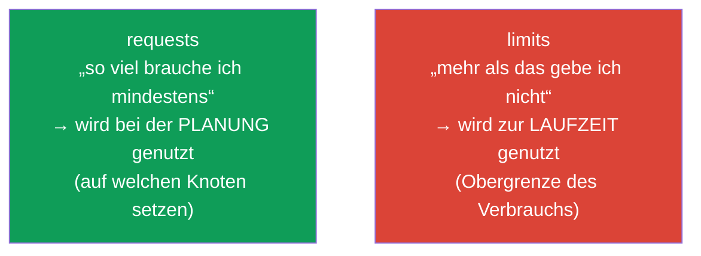
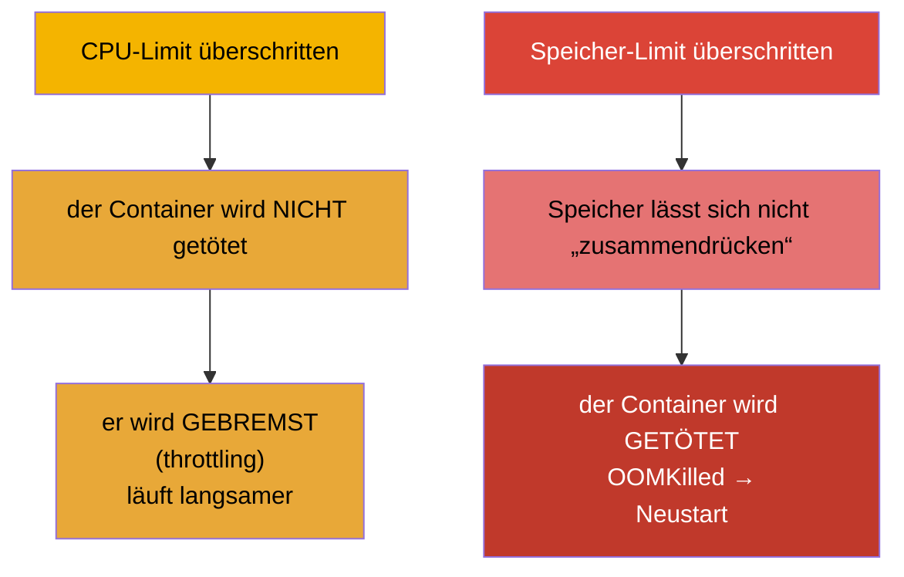
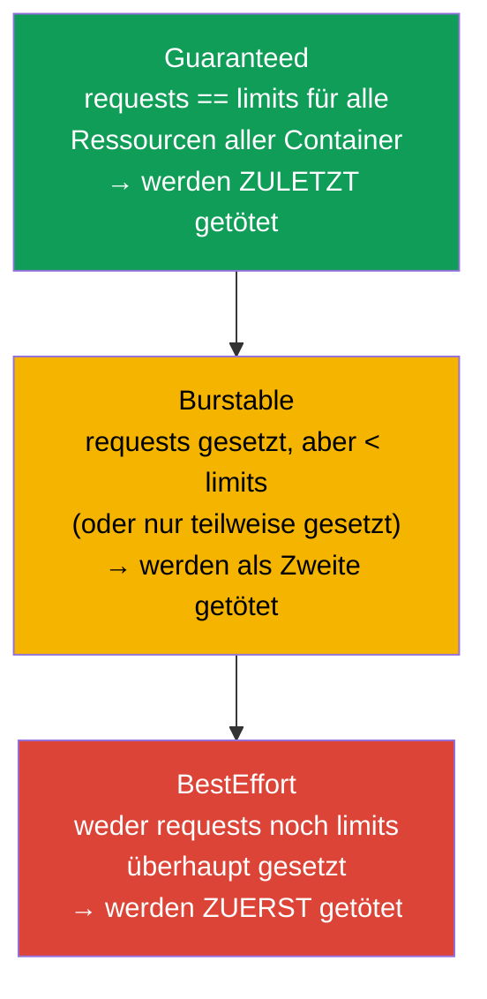
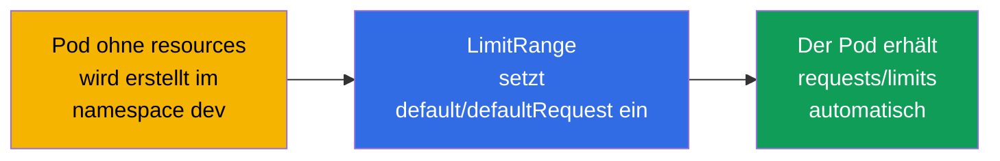
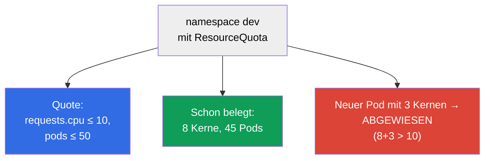

[Русская версия](ru.md) · [Eng version](README.md) · [Versión en español](es.md) · [Version française](fr.md) · [ქართული ვერსია](ge.md) · [繁體中文版](tw.md) · [日本語版](jp.md)

# Kapitel 14. Ressourcen: requests, limits, LimitRange und ResourceQuota

> **Was kommt.** Jeder Pod verbraucht CPU und Speicher. Steuert man das nicht, reißt ein
> „gefräßiger“ Container seine Nachbarn mit, und der Scheduler kann die Last nicht
> vernünftig verteilen. **requests** und **limits** legen den Appetit des Pods fest, sie
> beeinflussen die Planung und den Zeitpunkt, an dem der Pod getötet oder gebremst wird.
> **LimitRange** und **ResourceQuota** begrenzen den Verbrauch auf Ebene des Namespace. Das
> sind Themen beider Prüfungen (Workloads bei CKA, Environment/Config bei CKAD) und
> alltägliche Realität im Betrieb.

## 14.1. requests und limits: zwei unterschiedliche Versprechen

Ein Container hat zwei Ressourceneinstellungen, und sie werden ständig verwechselt. Klären
wir das eindeutig.

- **requests (Anforderung)** - wie viele Ressourcen der Container **garantiert braucht**.
  Der Scheduler nutzt requests, um den Knoten auszuwählen: der Pod geht nur dorthin, wo
  mindestens so viel frei ist. Das ist die „Reservierung“.
- **limits (Limit)** - die **Obergrenze**, über die hinaus der Container nichts verbrauchen
  darf. Beim Speicher überschritten - wird getötet (OOMKilled); bei der CPU überschritten -
  wird gebremst (throttling).



```yaml
spec:
  containers:
  - name: app
    image: nginx
    resources:
      requests:
        cpu: "250m"        # 0.25 Kerne garantiert
        memory: "64Mi"
      limits:
        cpu: "500m"        # nicht mehr als ein halber Kern
        memory: "128Mi"    # nicht mehr als 128 MiB
```

## 14.2. Maßeinheiten für CPU und Speicher

Diese Einheiten muss man fließend lesen können.

**CPU** wird in Kernen gemessen, Bruchteile in Milli-Kernen (`m`, milli-CPU, „Millicores“):

| Schreibweise | Bedeutung |
|--------|----------|
| `1` oder `1000m` | ein voller Kern |
| `500m` | ein halber Kern |
| `250m` | ein Viertel Kern |
| `100m` | 0.1 Kern |

**Wie Millicores gerechnet werden.** `1000m` = ein Kern = 100 % der Prozessorzeit einer
vCPU (in der Cloud ist das üblicherweise ein Thread/Hyperthread). Ein Millicore ist ein
**Anteil an der Prozessorzeit pro Periode**, nicht „ein separates Stück Hardware“. Unter
der Haube setzt das der CFS-Scheduler von Linux über cgroups um: `requests` werden zu
`cpu.shares` (relatives Gewicht bei der Aufteilung der CPU, wenn sie nicht für alle
reicht), und `limits` zur CFS-Quote (`cpu.cfs_quota_us`/`cpu.cfs_period_us`). Zum Beispiel
bedeutet `500m` bei einer Periode von 100 ms „nicht mehr als 50 ms CPU pro 100 ms“: der
Container kann die Hälfte eines Kerns dauerhaft belegen oder einen ganzen Kern, aber nur
eine halbe Periode.

**Speicher** wird in Bytes gemessen, üblicherweise mit Suffixen. Wichtig ist, binäre und
dezimale Einheiten nicht zu verwechseln:

| Binär (Potenzen von 1024) | Dezimal (Potenzen von 1000) |
|-------------------------|---------------------------|
| `Ki`, `Mi`, `Gi` | `k`, `M`, `G` |
| `128Mi` = 128×1024² Bytes | `128M` = 128×1000² Bytes |

**Was MiB bedeutet.** Das Suffix `Mi` steht für **Mebibyte** (MiB): `1 Mi` = 2²⁰ = 1 048 576
Bytes (also 1024 KiB). Nicht zu verwechseln mit **Megabyte** (MB, Suffix `M`): `1 M` = 10⁶ =
1 000 000 Bytes. Analog ist `Gi` = Gibibyte (GiB, 2³⁰ Bytes) und `G` = Gigabyte (10⁹ Bytes).
Die binären Einheiten (`Mi`, `Gi`) sind genau deshalb entstanden, um die Verwirrung „1024
oder 1000“ zu beseitigen. In der Praxis nutzt man in Kubernetes meist genau sie: `128Mi` ≈
134 MB, nicht 128 MB.

> **Vorsicht bei heterogenen Knoten.** Ein Millicore gibt einen **Zeitanteil** eines Kerns
> an, nicht die absolute Leistung. Sind die Knoten im Cluster unterschiedlich (zum Beispiel
> ein Teil auf schnellen modernen Kernen, ein Teil auf alten langsamen), dann erledigt
> `500m` auf einem schnellen Knoten merklich mehr Arbeit als `500m` auf einem langsamen.
> Gleiche requests/limits auf unterschiedlicher Hardware ergeben unterschiedliche reale
> Leistung - daraus folgt eine **Schieflage bei Last und Latenzen**: der Pod auf dem
> langsamen Knoten wird bremsen und bei gleichem Limit häufiger an CPU-throttling stoßen.
> Beim Speicher gibt es diese Schieflage nicht (ein Byte ist überall ein Byte), aber
> Frequenz/Durchsatz des RAM können sich ebenfalls unterscheiden. Was man dagegen tut: die
> Knotenpools möglichst homogen halten; sind die Knoten verschiedenartig - sie mit Labels
> kennzeichnen (CPU-Klasse) und leistungsempfindliche Workloads über `nodeAffinity`
> (Kapitel 12) auf den passenden Typ setzen sowie diesen Unterschied in die
> Capacity-Planung einrechnen.

## 14.3. Was bei Überschreitung passiert: CPU und Speicher verhalten sich unterschiedlich

Das ist der zentrale Unterschied für das Debugging.



- **CPU - eine komprimierbare Ressource.** Überschreitung des Limits → throttling: der
  Container bekommt einfach weniger Prozessorzeit, er wird langsamer, lebt aber weiter.
- **Speicher - eine nicht komprimierbare Ressource.** Man kann ihn nicht „stückweise
  wegnehmen“. Limit überschritten → der Container wird mit `OOMKilled` getötet, der Pod
  startet neu (wir haben das in Kapitel 4 gesehen).

Daraus folgt die praktische Regel: ein zu niedriges Speicher-Limit = regelmäßige OOMKilled
und Neustarts; ein zu niedriges CPU-Limit = langsamer Betrieb unter Last.

## 14.4. Quality-of-Service-Klassen (QoS)

Nach dem Verhältnis von requests und limits vergibt Kubernetes dem Pod eine **QoS-Klasse**.
Sie bestimmt, wen man zuerst tötet, wenn auf dem Knoten der Speicher physisch ausgeht (das
ist ein von den Limits getrennter Mechanismus - eviction).



| QoS-Klasse | Bedingung | Priorität bei Speichermangel |
|-----------|---------|-------------------------------|
| **Guaranteed** | requests = limits bei allen Ressourcen | werden zuletzt getötet |
| **Burstable** | requests gesetzt und kleiner als limits | werden als Zweite getötet |
| **BestEffort** | weder requests noch limits | werden zuerst getötet |

Wenn auf dem Knoten der Speicher ausgeht, beginnt das kubelet, Pods zu **verdrängen**
(eviction), angefangen bei BestEffort, dann Burstable, die ihre requests überschritten
haben. Guaranteed-Pods sind am sichersten. Deshalb setzt man kritischen Diensten in der
Produktion `requests == limits`.

## 14.5. LimitRange: Standardwerte und Grenzen im Namespace

Das Problem: hat der Entwickler keine requests/limits angegeben, wird der Pod zu BestEffort
und riskiert, als Erster getötet zu werden. **LimitRange** löst das auf Ebene des Namespace -
es setzt Standardwerte und zulässige Grenzen.

```yaml
apiVersion: v1
kind: LimitRange
metadata:
  name: defaults
  namespace: dev
spec:
  limits:
  - type: Container
    default:              # limits als Standard, wenn nicht gesetzt
      cpu: "500m"
      memory: "256Mi"
    defaultRequest:       # requests als Standard, wenn nicht gesetzt
      cpu: "100m"
      memory: "64Mi"
    max:                  # Maximum, das angefordert werden darf
      cpu: "2"
      memory: "1Gi"
    min:                  # Minimum
      cpu: "50m"
      memory: "32Mi"
```



LimitRange wirkt auf ein **einzelnes Objekt** (Container/Pod/PVC) im Namespace: es setzt
Standardwerte und prüft, dass das Angeforderte in min/max passt. Verlässt ein Pod die
Grenzen - wird er abgewiesen.

## 14.6. ResourceQuota: das Gesamtlimit für den Namespace

**ResourceQuota** begrenzt den **Gesamtverbrauch** des ganzen Namespace: wie viel CPU/Speicher
alle Pods zusammen anfordern dürfen und wie viele Objekte jedes Typs erstellt werden können.

```yaml
apiVersion: v1
kind: ResourceQuota
metadata:
  name: team-quota
  namespace: dev
spec:
  hard:
    requests.cpu: "10"          # insgesamt alle CPU-requests ≤ 10 Kerne
    requests.memory: "20Gi"
    limits.cpu: "20"
    limits.memory: "40Gi"
    pods: "50"                  # nicht mehr als 50 Pods
    services: "10"
    persistentvolumeclaims: "5"
```



Der Unterschied zwischen LimitRange und ResourceQuota (eine häufige Frage):

| | LimitRange | ResourceQuota |
|---|-----------|---------------|
| Ebene | einzelnes Objekt (Container/Pod/PVC) | der ganze Namespace insgesamt |
| Was es tut | Standardwerte + min/max pro Objekt | eine gemeinsame Obergrenze für den Namespace |
| Beispiel | „ein Pod mindestens 50m, maximal 2 Kerne“ | „der ganze Namespace nicht mehr als 10 Kerne und 50 Pods“ |

> **Wichtige Feinheit.** Gibt es im Namespace eine ResourceQuota für `requests`/`limits`,
> dann **muss** jeder Pod die entsprechenden requests/limits angeben, sonst wird er
> abgewiesen. Genau hier hilft LimitRange: es setzt die Standardwerte ein, und die Pods
> kommen durch die Quote.

## 14.7. Wie man das in der Produktion anwendet

- **requests/limits sind für alle Pflicht.** In gereiften Clustern kommt ein Pod ohne
  requests/limits einfach nicht durch (über LimitRange + admission). Das schützt die Knoten
  vor „gefräßigen“ Nachbarn und gibt dem Scheduler ein genaues Bild für die Verteilung.
- **Guaranteed für kritische Dienste.** Für Datenbanken und wichtige Dienste setzt man
  `requests == limits` (Guaranteed), damit sie bei Speichermangel nicht als Erste verdrängt
  werden. Für flexible Hintergrundaufgaben lässt man Burstable zu.
- **LimitRange + ResourceQuota für jeden Namespace.** Die typische Praxis der
  Mehrmandantenfähigkeit: jedem Team ein Namespace mit eigener Quote (wie viele Ressourcen
  es insgesamt haben darf) und LimitRange (Standardwerte und Grenzen pro Objekt). So „frisst“
  ein Team nicht den ganzen Cluster auf.
- **Right-Sizing nach Metriken.** requests/limits wählt man nach dem realen Verbrauch
  (`kubectl top`, Prometheus, VPA-Empfehlungen). Zu hohe requests → brachliegende, aber
  „reservierte“ Ressourcen und unnötiges Geld; zu niedrige Speicher-limits → OOMKilled.
- **OOMKilled und throttling sind häufige Vorfälle.** Massenhafte OOMKilled nach einem
  Release sind ein Signal für ein zu niedriges Speicher-Limit; unerklärliche Verzögerungen
  unter Last sind CPU-throttling. Das ist das Erste, was man bei Beschwerden über die
  Performance in den Metriken prüft.

### Fallbeispiel: wie man requests/limits für eine neue Anwendung findet

Eine typische Situation: ein neuer Dienst ist ausgerollt und wir wissen nicht, welche
requests/limits zu setzen sind - ein Verbrauchsprofil gibt es noch nicht. Nach Gefühl zu
raten ist gefährlich: setzt man den Speicher zu niedrig, prasseln OOMKilled herein, setzt man
die CPU zu niedrig, bremst der Dienst, setzt man zu hoch, reserviert man umsonst Ressourcen
und zahlt drauf. Der richtige Ansatz ist **iterativ**, von bewusst sicher zu genau.

1. **Wir starten mit Reserve.** Beim ersten Release setzen wir requests/limits bewusst „mit
   Reserve“ (zum Beispiel nach grober Schätzung ×1.5-2 des Erwarteten). Die Aufgabe des
   ersten Schritts ist nicht zu sparen, sondern nicht zu fallen: OOMKilled und hartes
   throttling zu vermeiden, solange es keine echten Daten gibt. Die `requests` sollte man
   dabei besser nicht stärker als nötig aufblasen - von ihnen hängen die Planung und die
   Kosten der „Reservierung“ ab.
2. **Wir beobachten unter realer Last.** Wir sammeln Metriken zum CPU- und Speicherverbrauch
   über einen repräsentativen Zeitraum - unbedingt mit **vollständigen Lastzyklen**:
   Tagesspitzen, Nacht, Wochenende sowie einmalige Ausschläge (Releases, Batches,
   Ausverkäufe). Werkzeuge: `kubectl top`, Prometheus/Grafana, VPA im Empfehlungsmodus
   (`Off`), der selbst Werte anhand der Historie vorschlägt.
3. **Wir hängen Alerts an die Symptome.** Wir richten Alerts auf `OOMKilled` (Neustarts mit
   Grund OutOfMemory) und auf **CPU-throttling** (`container_cpu_cfs_throttled_periods`) ein.
   Das sind frühe Signale dafür, dass die Limits zu niedrig sind - damit wir vor den Nutzern
   von dem Problem erfahren.
4. **Wir korrigieren anhand der Daten.** Nach der gesammelten Statistik nähern wir die Werte
   der Realität an:
   - **Speicher:** `limit` - etwas über der beobachteten Spitze (Speicher ist nicht
     komprimierbar, eine Reserve für Ausschläge ist Pflicht, sonst OOMKilled); `request` -
     nahe am typischen Verbrauch;
   - **CPU:** `request` - etwa bei der typischen Last (beeinflusst die Planung), `limit` -
     höher, um kurzzeitige Ausschläge ohne dauerhaftes throttling zu erlauben (manchmal
     verzichtet man auf ein CPU-Limit bewusst ganz und verlässt sich auf requests und QoS).
5. **Wir wiederholen den Zyklus.** Right-Sizing ist keine einmalige Aktion: bei Änderungen
   am Code, am Verkehr oder an den Abhängigkeiten ändert sich das Verbrauchsprofil, deshalb
   wiederholt man die Schritte 2-4 regelmäßig. Für kritische Dienste kommt man am Ende oft
   zu `requests == limits` (Guaranteed), für flexible Hintergrunddienste bleibt es bei
   Burstable.

Fazit: von „mit Reserve, damit nur nichts umfällt“ über Metriken und Alerts hin zu Werten,
die den realen Verbrauch widerspiegeln. So vermeidet man gleichzeitig OOMKilled/throttling
und zahlt nicht für eine brachliegende „Reservierung“ drauf.

## 14.8. Nützliche Befehle

```bash
# Verbrauch (benötigt metrics-server, Kapitel 28)
kubectl top nodes
kubectl top pods
kubectl top pods --sort-by=memory

# QoS-Klasse und Gründe für das Töten des Pods
kubectl describe pod <pod> | grep -i qos
kubectl describe pod <pod>            # wir suchen Last State: Terminated, Reason: OOMKilled

# Quoten und Limits des Namespace
kubectl get resourcequota -n dev
kubectl describe resourcequota team-quota -n dev
kubectl get limitrange -n dev
```

## 14.9. Mini-Glossar

- **requests** - das garantierte Minimum an Ressourcen; wird bei der Planung genutzt.
- **limits** - die Obergrenze des Verbrauchs; wird zur Laufzeit geprüft.
- **milli-CPU (m)** - ein Tausendstel eines Kerns (`500m` = ein halber Kern).
- **Mi/Gi vs M/G** - binäre (1024) gegen dezimale (1000) Speichereinheiten.
- **throttling** - das Bremsen des Containers bei Überschreitung des CPU-Limits.
- **OOMKilled** - das Töten des Containers bei Überschreitung des Speicher-Limits.
- **QoS-Klasse** - Guaranteed / Burstable / BestEffort; die Reihenfolge der Verdrängung bei
  Speichermangel.
- **eviction** - das Verdrängen von Pods durch das kubelet bei Ressourcenmangel des Knotens.
- **LimitRange** - Standardwerte und Ressourcengrenzen für ein einzelnes Objekt im Namespace.
- **ResourceQuota** - das Gesamtlimit für Ressourcen und Objektanzahl pro Namespace.

## 14.10. Zusammenfassung des Kapitels

- requests sind das garantierte Minimum (für die Planung), limits die Obergrenze (für den
  Betrieb).
- CPU: `m` (Milli-Kerne); Speicher: binäre `Mi/Gi` (1024) gegen dezimale `M/G` (1000).
- Überschreitung der CPU → throttling (wird langsamer); Überschreitung des Speichers →
  OOMKilled (wird getötet).
- QoS: Guaranteed (requests=limits, werden zuletzt getötet), Burstable, BestEffort (ohne
  Ressourcen, werden zuerst getötet); beeinflusst die eviction bei Speichermangel auf dem
  Knoten.
- LimitRange setzt Standardwerte und min/max für Ressourcen eines einzelnen Objekts im
  Namespace.
- ResourceQuota begrenzt den Gesamtverbrauch und die Objektanzahl für den ganzen Namespace.
- Bei vorhandener ResourceQuota müssen Pods requests/limits angeben; LimitRange setzt die
  Standardwerte ein, damit sie durchkommen.

## 14.11. Wofür das nützlich ist: in der Prüfung und in der echten Arbeit

**In der Prüfung.** „Setze requests/limits für den Container“, „erstelle eine
ResourceQuota/LimitRange für den Namespace“, „warum ist der Pod OOMKilled / in Pending
wegen Ressourcen“, „bestimme die QoS-Klasse“ - typische Aufgaben. Man muss den Block
`resources` schreiben können, die Einheiten kennen, LimitRange und ResourceQuota
unterscheiden und OOMKilled vs throttling verstehen.

**In der echten Arbeit.** requests/limits sind die Grundlage für Stabilität und Kosten des
Clusters: sie schützen vor „gefräßigen“ Nachbarn, geben dem Scheduler ein genaues Bild und
bestimmen, wen man bei Speichermangel verdrängt. Quoten und LimitRange sind der Mechanismus
für die faire Aufteilung der Ressourcen zwischen Teams. Right-Sizing nach Metriken spart
direkt Geld und verhindert OOMKilled.

## 14.12. Fragen zur Selbstüberprüfung

1. Worin unterscheiden sich requests von limits und in welcher Phase wird jedes genutzt?
2. Wie viel von einem Kern bedeutet `250m`? Worin unterscheidet sich `128Mi` von `128M`?
3. Was passiert bei Überschreitung des CPU-Limits und des Speicher-Limits - und warum
   unterschiedlich?
4. Wie wird die QoS-Klasse bestimmt und wie beeinflusst sie die Verdrängung bei
   Speichermangel?
5. Worin unterscheidet sich LimitRange von ResourceQuota nach der Wirkungsebene?
6. Warum ist es bei vorhandener ResourceQuota wichtig, eine LimitRange zu haben?
7. Wie unterscheidet man anhand der Symptome ein zu niedriges Speicher-Limit von einem zu
   niedrigen CPU-Limit?

## Praxis

Wir haben gelernt, den Appetit der Pods und die Quoten des Namespace zu steuern. In Kapitel
15 nehmen wir die restlichen Themen der Planung durch - statische Pods, PriorityClass und
mehrere Scheduler. Ressourcen und Quoten werden in den Labs zu den Workloads geübt.

🧪 Lab 122 (u. a. Drill zu requests/limits): [tasks/cka/labs/122](../../labs/122/README_DE.MD)

---
[Inhalt](../README_DE.md) · [Kapitel 13](../13/de.md) · [Kapitel 15](../15/de.md)
