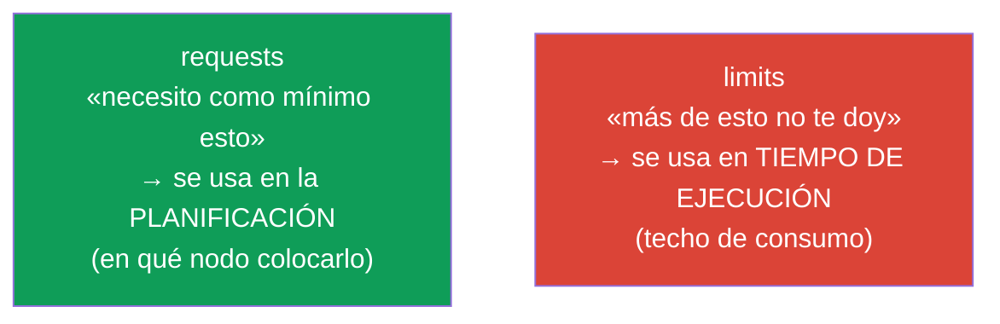
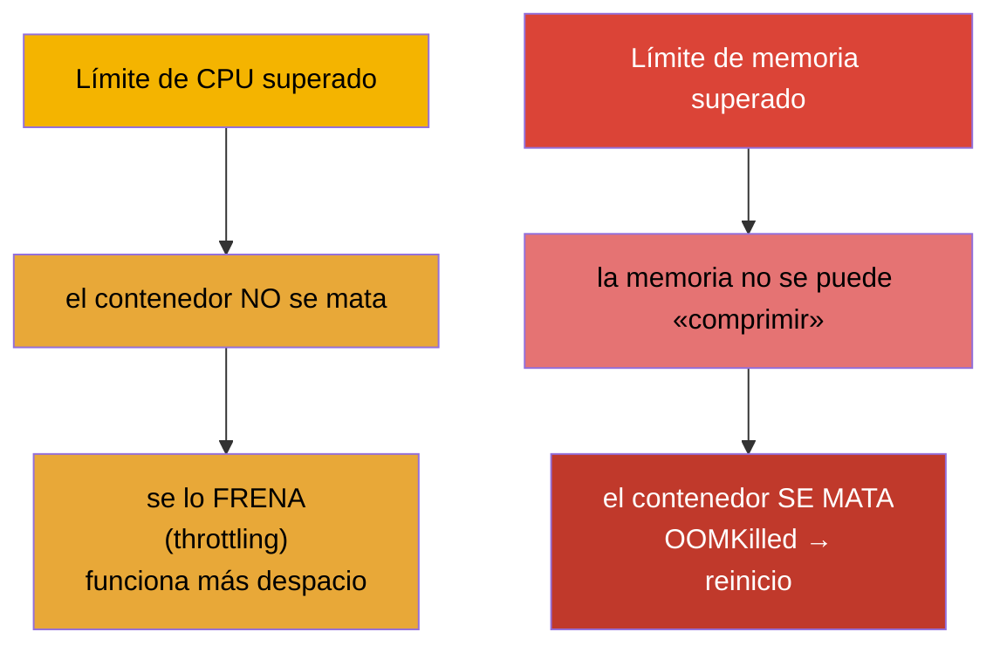
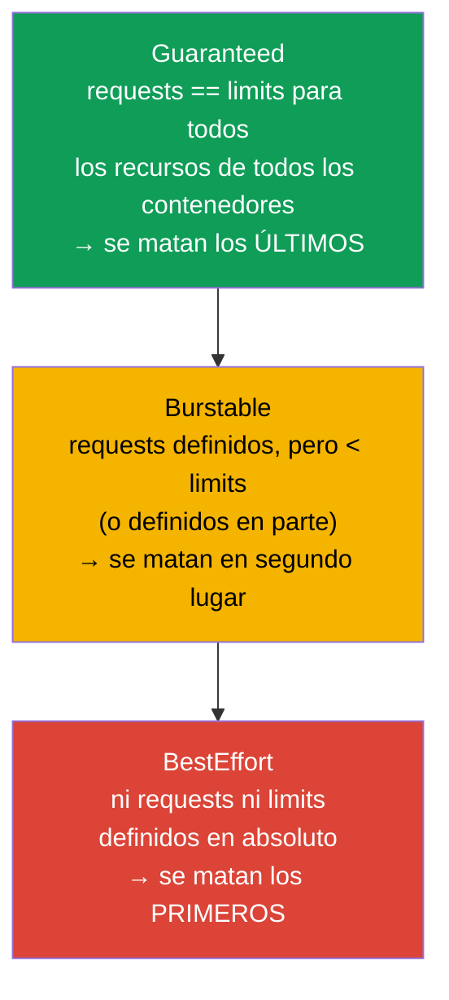
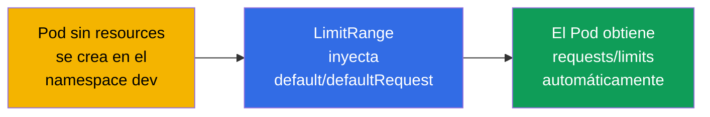
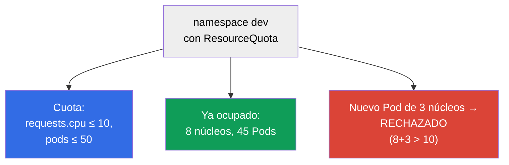

[Русская версия](ru.md) · [Eng version](README.md) · [Version française](fr.md) · [Deutsche Version](de.md) · [ქართული ვერსია](ge.md) · [繁體中文版](tw.md) · [日本語版](jp.md)

# Capítulo 14. Recursos: requests, limits, LimitRange y ResourceQuota

> **Qué viene ahora.** Cada Pod consume CPU y memoria. Si eso no se gestiona, un contenedor
> «glotón» tumbará a sus vecinos y el planificador no podrá repartir la carga de forma
> razonable. **requests** y **limits** definen el apetito del Pod, influyen en la planificación y en
> cuándo se mata o se frena al Pod. **LimitRange** y **ResourceQuota** limitan el
> consumo a nivel de namespace. Son temas de ambos exámenes (Workloads en CKA,
> Environment/Config en CKAD) y realidad cotidiana de la operación.

## 14.1. requests y limits: dos promesas distintas

Un contenedor tiene dos ajustes de recursos, y se confunden constantemente. Vamos a verlo claro.

- **requests (solicitud)** - cuántos recursos necesita el contenedor **de forma garantizada**.
  El planificador usa los requests para elegir nodo: el Pod solo irá donde haya
  libre al menos esa cantidad. Es la «reserva».
- **limits (límite)** - el **techo** por encima del cual no se dejará consumir al contenedor.
  Si supera la memoria, lo matan (OOMKilled); si supera la CPU, lo frenan (throttling).



```yaml
spec:
  containers:
  - name: app
    image: nginx
    resources:
      requests:
        cpu: "250m"        # 0.25 de núcleo garantizado
        memory: "64Mi"
      limits:
        cpu: "500m"        # no más de medio núcleo
        memory: "128Mi"    # no más de 128 MiB
```

## 14.2. Unidades de medida de CPU y memoria

Hay que leer estas unidades con soltura.

La **CPU** se mide en núcleos; las fracciones, en mili-núcleos (`m`, milli-CPU, «milicores»):

| Notación | Significado |
|--------|----------|
| `1` o `1000m` | un núcleo completo |
| `500m` | medio núcleo |
| `250m` | un cuarto de núcleo |
| `100m` | 0.1 de núcleo |

**Cómo se cuentan los milicores.** `1000m` = un núcleo = 100% del tiempo de procesador de una
vCPU (en la nube suele ser un hilo/hyperthread). Un milicore es una **fracción del tiempo de
procesador por periodo**, no «un trocito separado de hardware». Por debajo lo implementa el
planificador CFS de Linux mediante cgroups: los `requests` se convierten en `cpu.shares`
(peso relativo al repartir la CPU cuando no hay suficiente para todos) y los `limits`, en cuota
CFS (`cpu.cfs_quota_us`/`cpu.cfs_period_us`). Por ejemplo, `500m` con un periodo de 100 ms
significa «no más de 50 ms de CPU por cada 100 ms»: el contenedor puede ocupar la mitad de un
núcleo de forma continua o un núcleo entero, pero solo medio periodo.

La **memoria** se mide en bytes, normalmente con sufijos. Es importante no confundir las unidades
binarias con las decimales:

| Binarias (potencias de 1024) | Decimales (potencias de 1000) |
|-------------------------|---------------------------|
| `Ki`, `Mi`, `Gi` | `k`, `M`, `G` |
| `128Mi` = 128×1024² bytes | `128M` = 128×1000² bytes |

**Qué es un MiB.** El sufijo `Mi` es el **mebibyte** (MiB): `1 Mi` = 2²⁰ = 1 048 576 bytes
(es decir, 1024 KiB). No confundir con el **megabyte** (MB, sufijo `M`): `1 M` = 10⁶ =
1 000 000 bytes. De forma análoga, `Gi` = gibibyte (GiB, 2³⁰ bytes) y `G` = gigabyte (10⁹ bytes).
Las unidades binarias (`Mi`, `Gi`) aparecieron precisamente para quitar la confusión «¿1024 o 1000?».
En la práctica, en Kubernetes se usan más estas: `128Mi` ≈ 134 MB, no 128 MB.

> **Cuidado con los nodos heterogéneos.** El milicore define una **fracción de tiempo** de núcleo, no un
> rendimiento absoluto. Si en el clúster hay nodos distintos (por ejemplo, unos con núcleos rápidos
> modernos y otros con núcleos viejos y lentos), `500m` en el nodo rápido hará notablemente
> más trabajo que `500m` en el lento. Los mismos requests/limits sobre hardware distinto
> dan una potencia real distinta; de ahí el **desequilibrio en carga y latencias**: un Pod
> en un nodo lento irá más despacio y chocará más a menudo con el CPU-throttling con el mismo límite.
> La memoria no «desequilibra» así (un byte es un byte en todas partes), pero la frecuencia/el ancho de banda de la RAM
> también puede diferir. Qué hacer con esto: en lo posible, mantener los pools de nodos homogéneos;
> si los nodos son de tipos distintos, etiquetarlos (clase de CPU) y mediante `nodeAffinity`
> (capítulo 12) colocar las cargas sensibles al rendimiento en el tipo adecuado, además de
> tener en cuenta esa diferencia en la planificación de capacidad.

## 14.3. Qué pasa al superar el límite: la CPU y la memoria se comportan de forma distinta

Es la diferencia clave para depurar.



- **La CPU es un recurso comprimible.** Superar el límite → throttling: simplemente se le da al contenedor
  menos tiempo de procesador, va más lento, pero sigue vivo.
- **La memoria es un recurso incomprimible.** No se puede «quitar poquito a poco». Si supera el límite →
  el contenedor se mata con `OOMKilled` y el Pod se reinicia (lo vimos en el capítulo 4).

De ahí la regla práctica: un límite de memoria demasiado bajo = OOMKilled y reinicios
regulares; un límite de CPU demasiado bajo = funcionamiento lento bajo carga.

## 14.4. Clases de calidad de servicio (QoS)

Según la relación entre requests y limits, Kubernetes asigna al Pod una **clase QoS**. Esta
determina a quién se mata primero cuando en el nodo se agota físicamente la memoria (es un mecanismo
aparte de los límites: el eviction).



| Clase QoS | Condición | Prioridad ante falta de memoria |
|-----------|---------|-------------------------------|
| **Guaranteed** | requests = limits en todos los recursos | se matan los últimos |
| **Burstable** | requests definidos y menores que limits | se matan en segundo lugar |
| **BestEffort** | ni requests ni limits | se matan los primeros |

Cuando en el nodo se acaba la memoria, el kubelet empieza a **desalojar** Pods (eviction), empezando por
los BestEffort y siguiendo por los Burstable que han superado sus requests. Los Pods Guaranteed están en la mayor
seguridad. Por eso a los servicios críticos en producción se les pone `requests == limits`.

## 14.5. LimitRange: valores por defecto y límites en el namespace

El problema: si la persona que desarrolla no indica requests/limits, el Pod pasa a ser BestEffort y
corre el riesgo de ser el primero en morir. **LimitRange** lo resuelve a nivel de namespace: define
valores por defecto y límites admisibles.

```yaml
apiVersion: v1
kind: LimitRange
metadata:
  name: defaults
  namespace: dev
spec:
  limits:
  - type: Container
    default:              # limits por defecto, si no se han definido
      cpu: "500m"
      memory: "256Mi"
    defaultRequest:       # requests por defecto, si no se han definido
      cpu: "100m"
      memory: "64Mi"
    max:                  # máximo que se puede solicitar
      cpu: "2"
      memory: "1Gi"
    min:                  # mínimo
      cpu: "50m"
      memory: "32Mi"
```



LimitRange actúa sobre un **objeto concreto** (contenedor/Pod/PVC) del namespace: pone los
valores por defecto y comprueba que lo solicitado encaje en min/max. Si el Pod se sale de los
límites, se rechaza.

## 14.6. ResourceQuota: límite total del namespace

**ResourceQuota** limita el consumo **total** de todo el namespace: cuánta CPU/memoria pueden
solicitar en conjunto todos los Pods y cuántos objetos de cada tipo se pueden crear.

```yaml
apiVersion: v1
kind: ResourceQuota
metadata:
  name: team-quota
  namespace: dev
spec:
  hard:
    requests.cpu: "10"          # en total, todos los requests de CPU ≤ 10 núcleos
    requests.memory: "20Gi"
    limits.cpu: "20"
    limits.memory: "40Gi"
    pods: "50"                  # no más de 50 Pods
    services: "10"
    persistentvolumeclaims: "5"
```



Diferencia entre LimitRange y ResourceQuota (pregunta frecuente):

| | LimitRange | ResourceQuota |
|---|-----------|---------------|
| Nivel | un objeto concreto (contenedor/Pod/PVC) | todo el namespace en conjunto |
| Qué hace | valores por defecto + min/max por objeto | techo global para el namespace |
| Ejemplo | «el Pod, mínimo 50m, máximo 2 núcleos» | «todo el namespace, no más de 10 núcleos y 50 Pods» |

> **Matiz importante.** Si en el namespace hay una ResourceQuota sobre `requests`/`limits`, entonces
> cada Pod **está obligado** a indicar los requests/limits correspondientes o será rechazado.
> Aquí es donde ayuda LimitRange: pone los valores por defecto y los Pods pasan la cuota.

## 14.7. Cómo se usa esto en producción

- **requests/limits obligatorios para todos.** En los clústeres maduros, un Pod sin requests/limits
  simplemente no pasa (mediante LimitRange + admission). Eso protege a los nodos de vecinos
  «glotones» y da al planificador una imagen exacta para el reparto.
- **Guaranteed para los servicios críticos.** Para las bases de datos y los servicios importantes se pone `requests ==
  limits` (Guaranteed), para que no sean los primeros desalojados ante falta de memoria. Para las tareas
  de fondo flexibles se admite Burstable.
- **LimitRange + ResourceQuota en cada namespace.** Práctica típica de multitenencia:
  a cada equipo, un namespace con su cuota (cuántos recursos tiene permitidos en total) y su
  LimitRange (valores por defecto y límites por objeto). Así un equipo no se «come» todo el clúster.
- **Right-sizing por métricas.** Los requests/limits se ajustan según el consumo real
  (`kubectl top`, Prometheus, recomendaciones de VPA). Requests exagerados → recursos ociosos
  pero «reservados» y dinero de más; límites de memoria demasiado bajos → OOMKilled.
- **OOMKilled y throttling son incidentes frecuentes.** OOMKilled en masa tras un release es señal
  de un límite de memoria bajo; lentitud inexplicable bajo carga es CPU throttling. Es lo
  primero que se revisa en las métricas cuando hay quejas de rendimiento.

### Caso: cómo ajustar requests/limits en una aplicación nueva

Situación típica: hemos desplegado un servicio nuevo y no sabemos qué requests/limits poner,
todavía no hay perfil de consumo. Adivinar a ojo es peligroso: si te quedas corto de memoria, lloverán
OOMKilled; si te quedas corto de CPU, el servicio irá lento; si te pasas, reservarás recursos en vano y
pagarás de más. El enfoque correcto es **iterativo**, de lo seguro a lo preciso.

1. **Empezamos con margen.** En el primer release ponemos a conciencia requests/limits «con
   margen» (por ejemplo, ×1.5-2 sobre la estimación aproximada). La tarea del primer paso no es
   ahorrar, sino no caerse: evitar OOMKilled y throttling duro mientras no haya datos
   reales. Mejor no exagerar los `requests` más de lo necesario, porque de ellos dependen la
   planificación y el coste de la «reserva».
2. **Observamos bajo carga real.** Recogemos métricas de consumo de CPU y memoria durante un
   periodo representativo, capturando obligatoriamente **ciclos de carga completos**: picos diarios,
   la noche, los fines de semana, además de picos puntuales (releases, batches, rebajas).
   Herramientas: `kubectl top`, Prometheus/Grafana, VPA en modo de recomendaciones (`Off`),
   que propondrá valores a partir del histórico.
3. **Ponemos alertas sobre los síntomas.** Configuramos alertas de `OOMKilled` (reinicios por
   OutOfMemory) y de **CPU throttling** (`container_cpu_cfs_throttled_periods`). Son señales
   tempranas de que los límites están bajos, para enterarnos del problema antes que los usuarios.
4. **Corregimos con los datos.** Con la estadística recogida acercamos los valores a la realidad:
   - **memoria:** el `limit`, algo por encima del pico observado (la memoria es incomprimible, el margen para
     un pico es obligatorio o habrá OOMKilled); el `request`, cerca del consumo típico;
   - **CPU:** el `request`, en torno a la carga habitual (influye en la planificación); el `limit`,
     más alto, para permitir picos breves sin throttling permanente (y a veces
     el límite de CPU no se pone a propósito, confiando en los requests y en el QoS).
5. **Repetimos el ciclo.** El right-sizing no es una acción única: al cambiar el código, el tráfico
   o las dependencias, el perfil de consumo cambia, por eso los pasos 2-4 se repiten
   periódicamente. Para los servicios críticos se acaba llegando a menudo a `requests == limits`
   (Guaranteed); para los de fondo flexibles se deja Burstable.

Resultado: de «con margen, con tal de que no se caiga» a valores que reflejan el consumo real,
pasando por métricas y alertas. Así se evitan a la vez los OOMKilled/throttling y no se paga de más
por una «reserva» ociosa.

## 14.8. Comandos útiles

```bash
# Consumo (hace falta metrics-server, capítulo 28)
kubectl top nodes
kubectl top pods
kubectl top pods --sort-by=memory

# Clase QoS y motivos por los que se ha matado el Pod
kubectl describe pod <pod> | grep -i qos
kubectl describe pod <pod>            # buscamos Last State: Terminated, Reason: OOMKilled

# Cuotas y límites del namespace
kubectl get resourcequota -n dev
kubectl describe resourcequota team-quota -n dev
kubectl get limitrange -n dev
```

## 14.9. Mini-glosario

- **requests** - mínimo garantizado de recursos; se usa en la planificación.
- **limits** - techo de consumo; se comprueba en tiempo de ejecución.
- **milli-CPU (m)** - milésima parte de un núcleo (`500m` = medio núcleo).
- **Mi/Gi vs M/G** - unidades de memoria binarias (1024) frente a decimales (1000).
- **throttling** - frenado del contenedor al superar el límite de CPU.
- **OOMKilled** - muerte del contenedor al superar el límite de memoria.
- **Clase QoS** - Guaranteed / Burstable / BestEffort; orden de desalojo ante falta de
  memoria.
- **eviction** - desalojo de Pods por el kubelet ante falta de recursos del nodo.
- **LimitRange** - valores por defecto y límites de recursos para un objeto concreto del namespace.
- **ResourceQuota** - límite total de recursos y de número de objetos del namespace.

## 14.10. Resumen del capítulo

- requests es el mínimo garantizado (para la planificación); limits es el techo (para la ejecución).
- CPU: `m` (mili-núcleos); memoria: binarias `Mi/Gi` (1024) frente a decimales `M/G` (1000).
- Superar la CPU → throttling (va lento); superar la memoria → OOMKilled (lo matan).
- QoS: Guaranteed (requests=limits, se matan los últimos), Burstable, BestEffort (sin
  recursos, se matan los primeros); influye en el eviction ante falta de memoria en el nodo.
- LimitRange define valores por defecto y min/max de recursos para un objeto concreto del namespace.
- ResourceQuota limita el consumo total y el número de objetos de todo el namespace.
- Con una ResourceQuota presente, los Pods están obligados a indicar requests/limits; LimitRange
  pone los valores por defecto para que pasen.

## 14.11. Para qué sirve: en el examen y en el trabajo real

**En el examen.** «Define requests/limits para el contenedor», «crea una ResourceQuota/LimitRange
para el namespace», «por qué el Pod está OOMKilled / en Pending por recursos», «determina la clase QoS»
son tareas típicas. Hay que escribir el bloque `resources`, conocer las unidades, distinguir LimitRange de
ResourceQuota y entender OOMKilled frente a throttling.

**En el trabajo real.** requests/limits son la base de la estabilidad y del coste del clúster:
protegen de los vecinos «glotones», dan al planificador una imagen exacta y determinan a quién se
desaloja ante falta de memoria. Las cuotas y LimitRange son el mecanismo del reparto justo de recursos entre
equipos. El right-sizing por métricas ahorra dinero directamente y previene los OOMKilled.

## 14.12. Preguntas de autoevaluación

1. ¿En qué se diferencian los requests de los limits y en qué etapa se usa cada uno?
2. ¿Cuánto núcleo significa `250m`? ¿En qué se diferencia `128Mi` de `128M`?
3. ¿Qué pasa al superar el límite de CPU y el de memoria, y por qué de forma distinta?
4. ¿Cómo se determina la clase QoS y cómo influye en el desalojo ante falta de memoria?
5. ¿En qué se diferencia LimitRange de ResourceQuota por su nivel de actuación?
6. ¿Por qué, con una ResourceQuota presente, es importante tener un LimitRange?
7. ¿Cómo distinguir por los síntomas un límite de memoria bajo de un límite de CPU bajo?

## Práctica

Hemos aprendido a gestionar el apetito de los Pods y las cuotas de namespace. En el capítulo 15 veremos
los temas de planificación que quedan: los Pods estáticos, PriorityClass y varios
planificadores. Los recursos y las cuotas se practican en los laboratorios de cargas de trabajo.

🧪 Laboratorio 122 (incluye drill de requests/limits): [tasks/cka/labs/122](../../labs/122/README_ES.MD)

🎮 Killercoda (en el navegador, sin instalación): [Set CPU and memory limits](https://killercoda.com/chadmcrowell/course/ckad/cpu-mem-limits) · [LimitRange for Namespace](https://killercoda.com/chadmcrowell/course/ckad/limitrange-namespace) · [ResourceQuota for Namespace](https://killercoda.com/chadmcrowell/course/ckad/resourcequota-namespace) · [Default CPU/Memory Limits](https://killercoda.com/chadmcrowell/course/ckad/default-cpu-memory)

---
[Índice](../README_ES.md) · [Capítulo 13](../13/es.md) · [Capítulo 15](../15/es.md)
