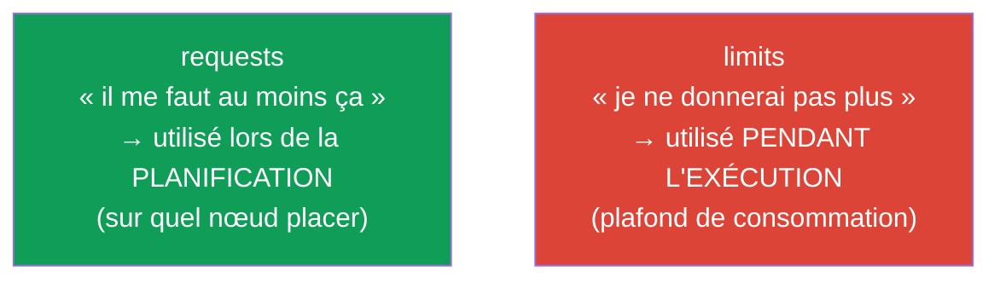
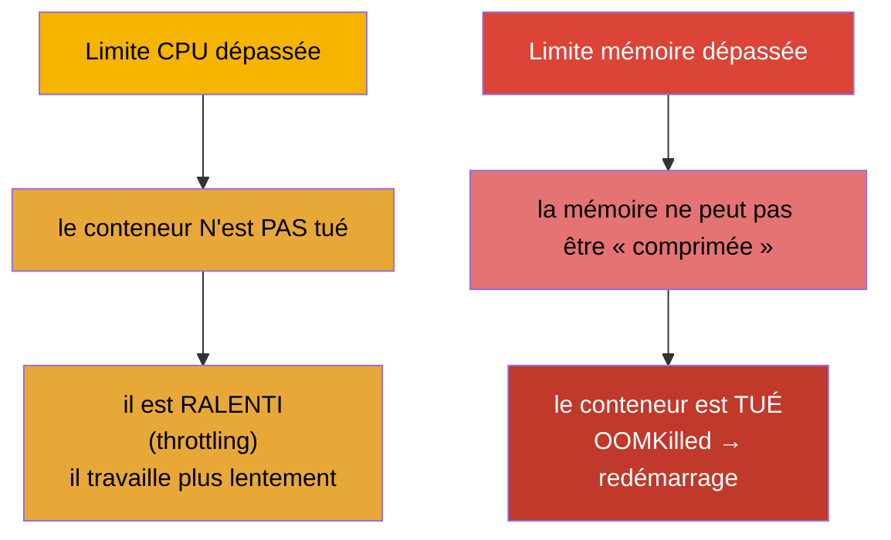
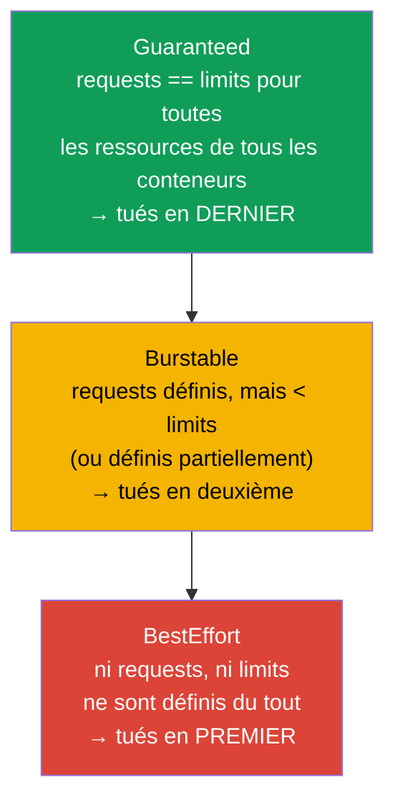
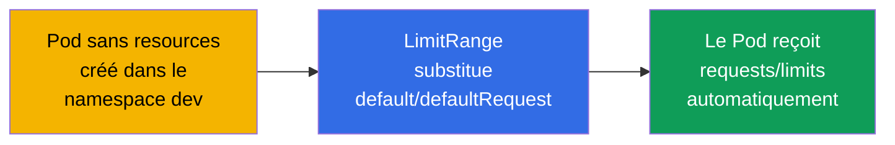
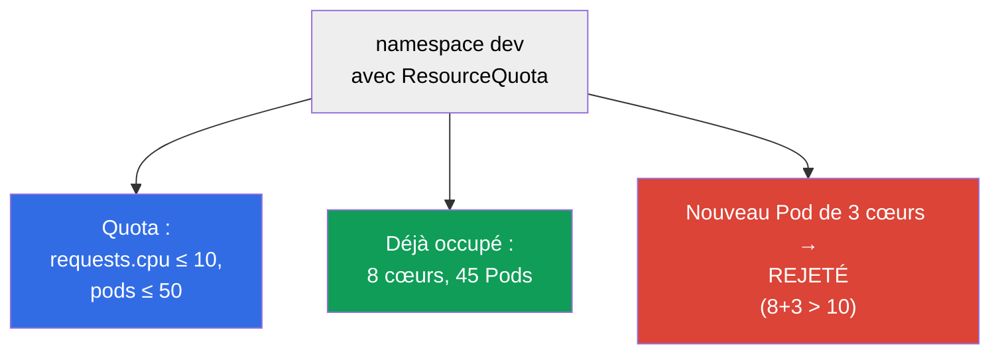

[Русская версия](ru.md) · [Eng version](README.md) · [Versión en español](es.md) · [Deutsche Version](de.md) · [ქართული ვერსია](ge.md) · [繁體中文版](tw.md) · [日本語版](jp.md)

# Chapitre 14. Ressources : requests, limits, LimitRange et ResourceQuota

> **Ce qui suit.** Chaque Pod consomme du CPU et de la mémoire. Si l'on ne gère pas cela, un
> conteneur « glouton » fera tomber ses voisins, et le planificateur ne pourra pas répartir la
> charge de façon raisonnable. **requests** et **limits** définissent l'appétit du Pod, influent sur
> la planification et sur le moment où le Pod sera tué ou ralenti. **LimitRange** et
> **ResourceQuota** bornent la consommation au niveau du namespace. Ce sont des sujets des deux
> examens (Workloads pour la CKA, Environment/Config pour la CKAD) et une réalité quotidienne de
> l'exploitation.

## 14.1. requests et limits : deux promesses différentes

Un conteneur a deux réglages de ressources, et on les confond sans arrêt. Mettons cela au clair.

- **requests (demande)** - la quantité de ressources dont le conteneur a **besoin de façon
  garantie**. Le planificateur utilise les requests pour choisir le nœud : le Pod n'ira que là où
  il reste au moins autant de libre. C'est une « réservation ».
- **limits (limite)** - le **plafond** au-delà duquel le conteneur ne pourra pas consommer.
  Dépassement en mémoire - il est tué (OOMKilled) ; dépassement en CPU - il est ralenti
  (throttling).



```yaml
spec:
  containers:
  - name: app
    image: nginx
    resources:
      requests:
        cpu: "250m"        # 0.25 cœur garanti
        memory: "64Mi"
      limits:
        cpu: "500m"        # pas plus d'un demi-cœur
        memory: "128Mi"    # pas plus de 128 Mio
```

## 14.2. Unités de mesure du CPU et de la mémoire

Ces unités doivent se lire couramment.

**Le CPU** se mesure en cœurs ; les fractions, en milli-cœurs (`m`, milli-CPU, « millicores ») :

| Écriture | Signification |
|--------|----------|
| `1` ou `1000m` | un cœur complet |
| `500m` | un demi-cœur |
| `250m` | un quart de cœur |
| `100m` | 0.1 cœur |

**Comment se calculent les millicores.** `1000m` = un cœur = 100 % du temps processeur d'un vCPU
(dans le cloud, c'est généralement un thread/hyperthread). Le millicore est une **part de temps
processeur sur une période**, et non « un petit morceau de matériel à part ». Sous le capot, c'est
le planificateur CFS de Linux qui l'implémente via les cgroups : les `requests` se transforment en
`cpu.shares` (poids relatif lors du partage du CPU quand il n'y en a pas assez pour tous), et les
`limits` en quota CFS (`cpu.cfs_quota_us`/`cpu.cfs_period_us`). Par exemple, `500m` avec une
période de 100 ms signifie « pas plus de 50 ms de CPU pour chaque tranche de 100 ms » : le
conteneur peut occuper la moitié d'un cœur en continu, ou bien un cœur entier mais seulement une
demi-période.

**La mémoire** se mesure en octets, généralement avec des suffixes. Il importe de ne pas confondre
les unités binaires et décimales :

| Binaires (puissances de 1024) | Décimales (puissances de 1000) |
|-------------------------|---------------------------|
| `Ki`, `Mi`, `Gi` | `k`, `M`, `G` |
| `128Mi` = 128×1024² octets | `128M` = 128×1000² octets |

**Qu'est-ce qu'un Mio.** Le suffixe `Mi` désigne le **mébioctet** (Mio) : `1 Mi` = 2²⁰ = 1 048 576
octets (soit 1024 Kio). Ne pas confondre avec le **mégaoctet** (Mo, suffixe `M`) : `1 M` = 10⁶ =
1 000 000 octets. De même, `Gi` = gibioctet (Gio, 2³⁰ octets), et `G` = gigaoctet (10⁹ octets). Les
unités binaires (`Mi`, `Gi`) sont justement apparues pour lever la confusion « 1024 ou 1000 ». En
pratique, dans Kubernetes, on utilise plutôt celles-là : `128Mi` ≈ 134 Mo, et non 128 Mo.

> **Attention aux nœuds hétérogènes.** Le millicore définit une **part de temps** de cœur, non une
> performance absolue. Si les nœuds du cluster diffèrent (par exemple, une partie sur des cœurs
> modernes rapides, une autre sur d'anciens cœurs lents), alors `500m` sur un nœud rapide
> accomplira sensiblement plus de travail que `500m` sur un nœud lent. Des requests/limits
> identiques sur du matériel différent donnent une puissance réelle différente - d'où un
> **déséquilibre en charge et en latences** : le Pod sur le nœud lent ralentira et butera plus
> souvent sur le CPU-throttling à limite égale. La mémoire ne « déséquilibre » pas ainsi (un octet
> reste un octet), mais la fréquence/la bande passante de la RAM peut aussi différer. Que faire :
> autant que possible, garder des pools de nœuds homogènes ; si les nœuds sont de types différents -
> les étiqueter avec des labels (classe de CPU) et, via `nodeAffinity` (chapitre 12), placer les
> charges sensibles à la performance sur le type voulu, tout en intégrant cette différence dans la
> planification de capacité.

## 14.3. Ce qui se passe en cas de dépassement : CPU et mémoire se comportent différemment

C'est la distinction clé pour le débogage.



- **Le CPU est une ressource compressible.** Dépassement de la limite → throttling : on donne
  simplement moins de temps processeur au conteneur, il ralentit, mais il vit.
- **La mémoire est une ressource incompressible.** On ne peut pas la « reprendre petit à petit ».
  Dépassement de la limite → le conteneur est tué avec `OOMKilled`, le Pod redémarre (nous l'avons
  vu au chapitre 4).

D'où la règle pratique : une limite mémoire sous-évaluée = des OOMKilled et des redémarrages
réguliers ; une limite CPU sous-évaluée = un fonctionnement lent sous charge.

## 14.4. Classes de qualité de service (QoS)

Selon le rapport entre requests et limits, Kubernetes attribue au Pod une **classe QoS**. Elle
détermine qui sera tué en premier quand la mémoire du nœud viendra physiquement à manquer (c'est un
mécanisme distinct des limites - l'eviction).



| Classe QoS | Condition | Priorité en cas de manque de mémoire |
|-----------|---------|-------------------------------|
| **Guaranteed** | requests = limits pour toutes les ressources | tués en dernier |
| **Burstable** | requests définis et inférieurs aux limits | tués en deuxième |
| **BestEffort** | ni requests, ni limits | tués en premier |

Quand la mémoire manque sur le nœud, le kubelet commence à **expulser** les Pods (eviction), en
partant des BestEffort, puis des Burstable qui ont dépassé leurs requests. Les Pods Guaranteed sont
les plus en sécurité. C'est pourquoi on met `requests == limits` aux services critiques en prod.

## 14.5. LimitRange : valeurs par défaut et bornes dans un namespace

Le problème : si le développeur n'a pas indiqué de requests/limits, le Pod devient BestEffort et
risque d'être tué en premier. **LimitRange** résout cela au niveau du namespace - il définit des
valeurs par défaut et des bornes admissibles.

```yaml
apiVersion: v1
kind: LimitRange
metadata:
  name: defaults
  namespace: dev
spec:
  limits:
  - type: Container
    default:              # limits par défaut, s'ils ne sont pas définis
      cpu: "500m"
      memory: "256Mi"
    defaultRequest:       # requests par défaut, s'ils ne sont pas définis
      cpu: "100m"
      memory: "64Mi"
    max:                  # maximum que l'on peut demander
      cpu: "2"
      memory: "1Gi"
    min:                  # minimum
      cpu: "50m"
      memory: "32Mi"
```



LimitRange agit sur un **objet individuel** (conteneur/Pod/PVC) dans le namespace : il fixe les
valeurs par défaut et vérifie que ce qui est demandé tient dans les min/max. Si le Pod sort des
bornes - il sera rejeté.

## 14.6. ResourceQuota : limite globale sur le namespace

**ResourceQuota** borne la consommation **totale** de tout le namespace : combien de CPU/mémoire au
total tous les Pods peuvent demander, combien d'objets de chaque type on peut créer.

```yaml
apiVersion: v1
kind: ResourceQuota
metadata:
  name: team-quota
  namespace: dev
spec:
  hard:
    requests.cpu: "10"          # au total, tous les requests CPU ≤ 10 cœurs
    requests.memory: "20Gi"
    limits.cpu: "20"
    limits.memory: "40Gi"
    pods: "50"                  # pas plus de 50 Pods
    services: "10"
    persistentvolumeclaims: "5"
```



Différence entre LimitRange et ResourceQuota (question fréquente) :

| | LimitRange | ResourceQuota |
|---|-----------|---------------|
| Niveau | objet individuel (conteneur/Pod/PVC) | tout le namespace au total |
| Ce qu'il fait | valeurs par défaut + min/max par objet | plafond global sur le namespace |
| Exemple | « le Pod : au minimum 50m, au maximum 2 cœurs » | « tout le namespace : pas plus de 10 cœurs et 50 Pods » |

> **Nuance importante.** Si un namespace comporte une ResourceQuota sur les `requests`/`limits`,
> alors chaque Pod **doit obligatoirement** indiquer les requests/limits correspondants, sinon il
> sera rejeté. C'est là que LimitRange sauve la mise : il posera les valeurs par défaut, et les Pods
> passeront la quota.

## 14.7. Comment cela s'applique en production

- **requests/limits obligatoires pour tous.** Dans les clusters matures, un Pod sans
  requests/limits ne passe tout simplement pas (via LimitRange + admission). Cela protège les nœuds
  des voisins « gloutons » et donne au planificateur une image précise pour la répartition.
- **Guaranteed pour les services critiques.** Pour les bases de données et les services importants,
  on met `requests == limits` (Guaranteed), afin qu'ils ne soient pas expulsés en premier en cas de
  manque de mémoire. Pour les tâches de fond souples, on admet Burstable.
- **LimitRange + ResourceQuota sur chaque namespace.** Pratique type de la multitenancy : à chaque
  équipe son namespace avec sa propre quota (combien de ressources au total elle peut prendre) et un
  LimitRange (valeurs par défaut et bornes par objet). Ainsi une équipe ne « mange » pas tout le
  cluster.
- **Right-sizing d'après les métriques.** Les requests/limits se choisissent d'après la
  consommation réelle (`kubectl top`, Prometheus, recommandations du VPA). Des requests surévalués →
  des ressources inactives mais « réservées » et de l'argent gaspillé ; des limits mémoire
  sous-évalués → OOMKilled.
- **OOMKilled et throttling sont des incidents fréquents.** Des OOMKilled massifs après une mise en
  production signalent une limite mémoire sous-évaluée ; des ralentissements inexplicables sous
  charge, du CPU throttling. C'est la première chose que l'on vérifie dans les métriques en cas de
  plaintes sur la performance.

### Cas pratique : comment choisir requests/limits pour une nouvelle application

Situation typique : on a déployé un nouveau service et on ne sait pas quels requests/limits mettre -
il n'y a pas encore de profil de consommation. Deviner à l'œil est risqué : sous-évaluez la mémoire
et les OOMKilled pleuvront, sous-évaluez le CPU et le service ralentira, surévaluez et vous
réserverez des ressources pour rien en payant plus. La bonne approche est **itérative**, du
franchement sûr vers le précis.

1. **On démarre avec de la marge.** Pour la première mise en production, on met sciemment des
   requests/limits « avec de la marge » (par exemple, ×1.5-2 d'une estimation grossière de
   l'attendu). L'objectif de la première étape n'est pas d'économiser, mais de ne pas tomber :
   éviter les OOMKilled et un throttling brutal tant qu'il n'y a pas de données réelles. Il vaut
   mieux ne pas surévaluer les `requests` plus que nécessaire - la planification et le coût de la
   « réservation » en dépendent.
2. **On observe sous charge réelle.** On collecte les métriques de consommation CPU et mémoire sur
   une période représentative - en capturant impérativement des **cycles de charge complets** :
   pics journaliers, nuit, week-ends, ainsi que les pointes ponctuelles (mises en production, batchs,
   soldes). Outils : `kubectl top`, Prometheus/Grafana, VPA en mode recommandations (`Off`), qui
   proposera lui-même des valeurs d'après l'historique.
3. **On pose des alertes sur les symptômes.** On configure des alertes sur `OOMKilled` (redémarrages
   pour cause d'OutOfMemory) et sur le **CPU throttling** (`container_cpu_cfs_throttled_periods`).
   Ce sont les signaux précoces que les limites sont sous-évaluées - pour apprendre le problème avant
   les utilisateurs.
4. **On corrige d'après les données.** À partir des statistiques collectées, on rapproche les
   valeurs de la réalité :
   - **mémoire :** `limit` - un peu au-dessus du pic observé (la mémoire est incompressible, une
     marge pour la pointe est obligatoire, sinon OOMKilled) ; `request` - proche de la consommation
     typique ;
   - **CPU :** `request` - autour de la charge courante (cela influe sur la planification), `limit` -
     plus haut, pour autoriser de brèves pointes sans throttling permanent (et parfois on ne met
     sciemment aucune limite CPU, en s'appuyant sur les requests et la QoS).
5. **On répète le cycle.** Le right-sizing n'est pas une action unique : quand le code, le trafic ou
   les dépendances changent, le profil de consommation change aussi, c'est pourquoi on répète
   périodiquement les étapes 2-4. Pour les services critiques, on aboutit finalement souvent à
   `requests == limits` (Guaranteed) ; pour les tâches de fond souples, on laisse du Burstable.

Bilan : de « avec de la marge, pourvu que ça ne tombe pas » vers des valeurs qui reflètent la
consommation réelle, en passant par les métriques et les alertes. On évite ainsi à la fois les
OOMKilled/le throttling et le surcoût d'une « réservation » inactive.

## 14.8. Commandes utiles

```bash
# Consommation (nécessite metrics-server, chapitre 28)
kubectl top nodes
kubectl top pods
kubectl top pods --sort-by=memory

# Classe QoS et raisons de la mort d'un Pod
kubectl describe pod <pod> | grep -i qos
kubectl describe pod <pod>            # on cherche Last State: Terminated, Reason: OOMKilled

# Quotas et limites du namespace
kubectl get resourcequota -n dev
kubectl describe resourcequota team-quota -n dev
kubectl get limitrange -n dev
```

## 14.9. Mini-glossaire

- **requests** - minimum de ressources garanti ; utilisé lors de la planification.
- **limits** - plafond de consommation ; vérifié pendant l'exécution.
- **milli-CPU (m)** - millième de cœur (`500m` = un demi-cœur).
- **Mi/Gi vs M/G** - unités de mémoire binaires (1024) contre décimales (1000).
- **throttling** - ralentissement du conteneur en cas de dépassement de la limite CPU.
- **OOMKilled** - mise à mort du conteneur en cas de dépassement de la limite mémoire.
- **classe QoS** - Guaranteed / Burstable / BestEffort ; ordre d'expulsion en cas de manque de
  mémoire.
- **eviction** - expulsion des Pods par le kubelet en cas de manque de ressources du nœud.
- **LimitRange** - valeurs par défaut et bornes de ressources pour un objet individuel dans un
  namespace.
- **ResourceQuota** - limite globale des ressources et du nombre d'objets sur un namespace.

## 14.10. Récapitulatif du chapitre

- requests = minimum garanti (pour la planification), limits = plafond (pour l'exécution).
- CPU : `m` (milli-cœurs) ; mémoire : unités binaires `Mi/Gi` (1024) contre décimales `M/G` (1000).
- Dépassement du CPU → throttling (ça ralentit) ; dépassement de la mémoire → OOMKilled (on tue).
- QoS : Guaranteed (requests=limits, tués en dernier), Burstable, BestEffort (sans ressources, tués
  en premier) ; influe sur l'eviction quand la mémoire manque sur le nœud.
- LimitRange fixe les valeurs par défaut et les min/max de ressources pour un objet individuel dans
  un namespace.
- ResourceQuota borne la consommation totale et le nombre d'objets pour tout le namespace.
- En présence d'une ResourceQuota, les Pods doivent indiquer des requests/limits ; LimitRange pose
  les valeurs par défaut pour qu'ils passent.

## 14.11. À quoi cela sert : à l'examen et dans le travail réel

**À l'examen.** « Définis les requests/limits d'un conteneur », « crée une ResourceQuota/un
LimitRange pour un namespace », « pourquoi le Pod est-il OOMKilled / en Pending à cause des
ressources », « détermine la classe QoS » sont des exercices types. Il faut savoir écrire le bloc
`resources`, connaître les unités, distinguer LimitRange et ResourceQuota et comprendre OOMKilled vs
throttling.

**Dans le travail réel.** requests/limits sont la base de la stabilité et du coût du cluster : ils
protègent des voisins « gloutons », donnent au planificateur une image précise, déterminent qui sera
expulsé en cas de manque de mémoire. Les quotas et LimitRange sont le mécanisme d'un partage
équitable des ressources entre les équipes. Le right-sizing d'après les métriques économise
directement de l'argent et prévient les OOMKilled.

## 14.12. Questions d'auto-évaluation

1. En quoi les requests diffèrent-ils des limits et à quelle étape chacun est-il utilisé ?
2. Quelle fraction de cœur signifie `250m` ? En quoi `128Mi` diffère-t-il de `128M` ?
3. Que se passe-t-il en cas de dépassement de la limite CPU et de la limite mémoire - et pourquoi
   est-ce différent ?
4. Comment se détermine la classe QoS et comment influe-t-elle sur l'expulsion en cas de manque de
   mémoire ?
5. En quoi LimitRange diffère-t-il de ResourceQuota par son niveau d'action ?
6. Pourquoi, en présence d'une ResourceQuota, est-il important d'avoir un LimitRange ?
7. Comment distinguer, d'après les symptômes, une limite mémoire sous-évaluée d'une limite CPU
   sous-évaluée ?

## Pratique

Nous avons appris à gérer l'appétit des Pods et les quotas de namespace. Au chapitre 15, nous
verrons les sujets restants de la planification - les static Pods, la PriorityClass et les
planificateurs multiples. Ressources et quotas se travaillent dans les TP sur les charges de
travail.

🧪 TP 122 (dont un drill sur requests/limits) : [tasks/cka/labs/122](../../labs/122/README_FR.MD)

---
[Sommaire](../README_FR.md) · [Chapitre 13](../13/fr.md) · [Chapitre 15](../15/fr.md)
