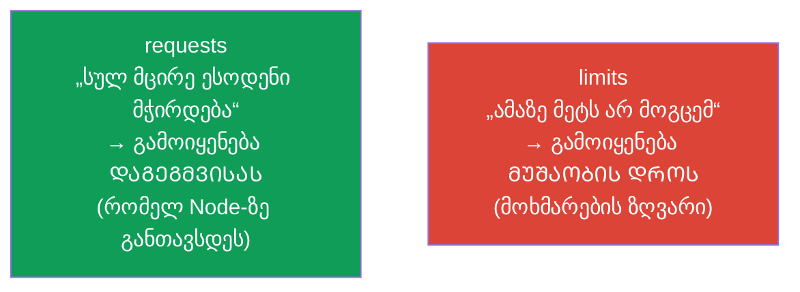
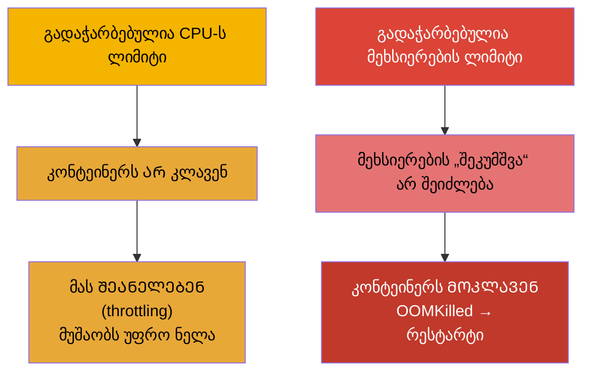
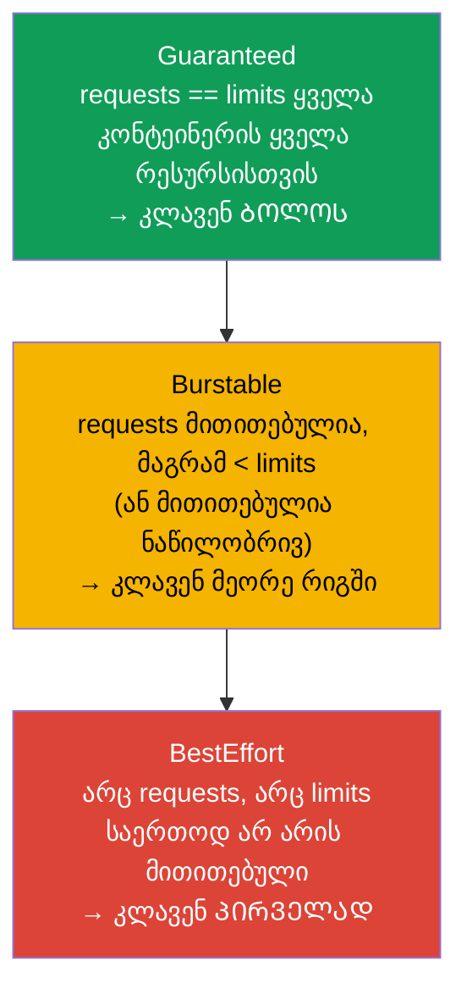
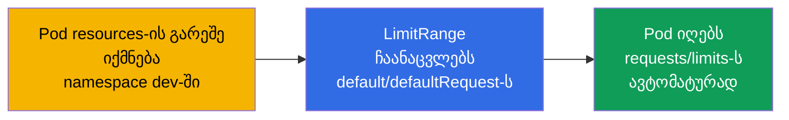
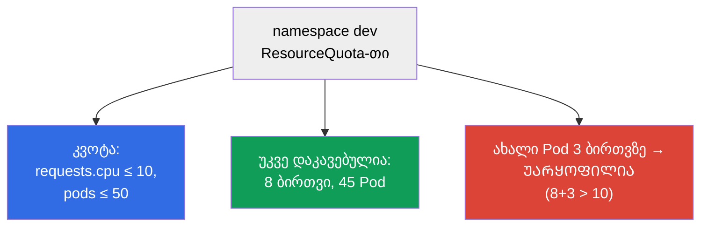

[Русская версия](ru.md) · [Eng version](README.md) · [Versión en español](es.md) · [Version française](fr.md) · [Deutsche Version](de.md) · [繁體中文版](tw.md) · [日本語版](jp.md)

# თავი 14. რესურსები: requests, limits, LimitRange და ResourceQuota

> **რა იქნება შემდეგ.** ყოველი Pod ხარჯავს CPU-ს და მეხსიერებას. თუ ამას არ მართავ, ერთი
> „მძვინვარე“ კონტეინერი მეზობლებს დაამხობს, ხოლო დამგეგმავი დატვირთვას გონივრულად ვერ
> გაანაწილებს. **requests** და **limits** განსაზღვრავს Pod-ის აპეტიტს, მოქმედებს დაგეგმვაზე და
> იმაზე, როდის მოკლავენ ან შეანელებენ Pod-ს. **LimitRange** და **ResourceQuota** ზღუდავს
> მოხმარებას namespace-ის დონეზე. ეს ორივე გამოცდის თემაა (Workloads CKA-ზე,
> Environment/Config CKAD-ზე) და ექსპლუატაციის ყოველდღიური რეალობა.

## 14.1. requests და limits: ორი განსხვავებული დანაპირები

კონტეინერს რესურსების ორი პარამეტრი აქვს და მათ მუდმივად ურევენ. მკაფიოდ გავარჩიოთ.

- **requests (მოთხოვნა)** - რამდენი რესურსი **გარანტირებულად სჭირდება** კონტეინერს.
  დამგეგმავი requests-ს იყენებს Node-ის ასარჩევად: Pod მხოლოდ იქ წავა, სადაც სულ მცირე
  ესოდენი თავისუფალია. ეს არის „რეზერვაცია“.
- **limits (ლიმიტი)** - **ზღვარი**, რომელზე მეტის მოხმარებას კონტეინერს არ მისცემენ.
  მეხსიერებაზე გადააჭარბა - მოკლავენ (OOMKilled); CPU-ზე გადააჭარბა - შეანელებენ (throttling).



```yaml
spec:
  containers:
  - name: app
    image: nginx
    resources:
      requests:
        cpu: "250m"        # 0.25 ბირთვი გარანტირებულია
        memory: "64Mi"
      limits:
        cpu: "500m"        # ბირთვის ნახევარზე მეტი არა
        memory: "128Mi"    # 128 მებიბაიტზე მეტი არა
```

## 14.2. CPU-სა და მეხსიერების საზომი ერთეულები

ეს ერთეულები თავისუფლად უნდა იკითხებოდეს.

**CPU** იზომება ბირთვებით, წილადები - მილი-ბირთვებით (`m`, milli-CPU, „მილიკორები“):

| ჩანაწერი | მნიშვნელობა |
|--------|----------|
| `1` ან `1000m` | ერთი სრული ბირთვი |
| `500m` | ბირთვის ნახევარი |
| `250m` | ბირთვის მეოთხედი |
| `100m` | 0.1 ბირთვი |

**როგორ ითვლება მილიკორები.** `1000m` = ერთი ბირთვი = ერთი vCPU-ს პროცესორული დროის 100%
(ღრუბელში ეს ჩვეულებრივ ერთი ნაკადი/ჰიპერთრედია). მილიკორი არის **პროცესორული დროის წილი
პერიოდში**, და არა „ცალკე რკინის ნაჭერი“. კაპოტის ქვეშ ამას Linux-ის CFS-დამგეგმავი
რეალიზებს cgroups-ის მეშვეობით: `requests` გარდაიქმნება `cpu.shares`-ად
(შედარებითი წონა CPU-ს დანაწილებისას, როცა ის ყველას არ ჰყოფნის), ხოლო `limits` - CFS-ის
კვოტად (`cpu.cfs_quota_us`/`cpu.cfs_period_us`). მაგალითად, `500m` 100 მწმ პერიოდის დროს
ნიშნავს „არა უმეტეს 50 მწმ CPU ყოველ 100 მწმ-ში“: კონტეინერს შეუძლია განუწყვეტლივ დაიკავოს
ერთი ბირთვის ნახევარი ან მთელი ბირთვი, მაგრამ მხოლოდ პერიოდის ნახევარში.

**მეხსიერება** იზომება ბაიტებით, ჩვეულებრივ სუფიქსებით. მნიშვნელოვანია არ აურიოთ ორობითი და
ათობითი ერთეულები:

| ორობითი (1024-ის ხარისხები) | ათობითი (1000-ის ხარისხები) |
|-------------------------|---------------------------|
| `Ki`, `Mi`, `Gi` | `k`, `M`, `G` |
| `128Mi` = 128×1024² ბაიტი | `128M` = 128×1000² ბაიტი |

**რა არის მებიბაიტი.** სუფიქსი `Mi` არის **მებიბაიტი** (მიბ): `1 Mi` = 2²⁰ = 1 048 576 ბაიტი
(ანუ 1024 კიბ). არ აურიოთ **მეგაბაიტთან** (მბ, სუფიქსი `M`): `1 M` = 10⁶ =
1 000 000 ბაიტი. ანალოგიურად `Gi` = გიბიბაიტი (გიბ, 2³⁰ ბაიტი), ხოლო `G` = გიგაბაიტი (10⁹ ბაიტი).
ორობითი ერთეულები (`Mi`, `Gi`) სწორედ იმისთვის გამოჩნდა, რომ მოეხსნა არევა „1024 თუ 1000“.
პრაქტიკაში Kubernetes-ში უფრო ხშირად სწორედ მათ იყენებენ: `128Mi` ≈ 134 მბ, და არა 128 მბ.

> **ფრთხილად არაერთგვაროვან Nodes-თან.** მილიკორი განსაზღვრავს ბირთვის **დროის წილს**, და არა
> აბსოლუტურ წარმადობას. თუ კლასტერში Nodes განსხვავებულია (მაგალითად, ნაწილი სწრაფ
> თანამედროვე ბირთვებზეა, ნაწილი ძველ ნელებზე), მაშინ `500m` სწრაფ Node-ზე შესამჩნევად
> მეტ სამუშაოს შეასრულებს, ვიდრე `500m` ნელზე. ერთნაირი requests/limits განსხვავებულ
> რკინაზე განსხვავებულ რეალურ სიმძლავრეს იძლევა - აქედან მოდის **გადახრა დატვირთვასა და
> შეყოვნებებში**: ნელ Node-ზე მყოფი Pod შეანელებს და იმავე ლიმიტის დროს უფრო ხშირად მიეჭედება
> CPU-throttling-ს. მეხსიერება ასე არ „იხრება“ (ბაიტი ყველგან ბაიტია), მაგრამ RAM-ის
> სიხშირე/გამტარუნარიანობაც შეიძლება განსხვავდებოდეს. რა ვუყოთ ამას: შეძლებისდაგვარად
> Nodes-ის პულები ერთგვაროვანი შევინახოთ; თუ Nodes სხვადასხვა ტიპისაა - მოვნიშნოთ ისინი
> ლეიბლებით (CPU-ს კლასი) და `nodeAffinity`-ის მეშვეობით (თავი 12) წარმადობისადმი
> მგრძნობიარე დატვირთვები საჭირო ტიპზე დავსვათ, ასევე ეს სხვაობა capacity-დაგეგმვაში ჩავდოთ.

## 14.3. რა ხდება გადაჭარბებისას: CPU და მეხსიერება სხვადასხვანაირად იქცევა

ეს გასაღებური განსხვავებაა გამართვისთვის.



- **CPU - შეკუმშვადი რესურსია.** ლიმიტის გადაჭარბება → throttling: კონტეინერს უბრალოდ
  ნაკლებ პროცესორულ დროს აძლევენ, ის შენელდება, მაგრამ ცოცხალია.
- **მეხსიერება - შეუკუმშვადი რესურსია.** მას „ცოტ-ცოტად“ ვერ წაართმევ. ლიმიტი გადააჭარბა →
  კონტეინერს კლავენ `OOMKilled`-ით, Pod ხელახლა ეშვება (ეს თავ 4-ში ვნახეთ).

აქედან პრაქტიკული წესი: შემცირებული მეხსიერების ლიმიტი = რეგულარული OOMKilled და
რესტარტები; შემცირებული CPU-ს ლიმიტი = ნელი მუშაობა დატვირთვის ქვეშ.

## 14.4. მომსახურების ხარისხის კლასები (QoS)

requests-სა და limits-ის თანაფარდობის მიხედვით Kubernetes Pod-ს ანიჭებს **QoS-კლასს**. ის
განსაზღვრავს, ვის მოკლავენ პირველად, როცა Node-ზე ფიზიკურად ამოიწურება მეხსიერება (ეს
ლიმიტებისგან ცალკე მექანიზმია - eviction).



| QoS-კლასი | პირობა | პრიორიტეტი მეხსიერების უკმარისობისას |
|-----------|---------|-------------------------------|
| **Guaranteed** | requests = limits ყველა რესურსზე | კლავენ ბოლოს |
| **Burstable** | requests მითითებულია და limits-ზე ნაკლებია | კლავენ მეორე რიგში |
| **BestEffort** | არც requests, არც limits | კლავენ პირველად |

როცა Node-ზე მეხსიერება იწურება, kubelet იწყებს Pods-ის **გარეირებას** (eviction),
BestEffort-იდან, შემდეგ Burstable-იდან, რომლებმაც requests გადააჭარბეს. Guaranteed-Pods -
ყველაზე დიდ უსაფრთხოებაშია. ამიტომ კრიტიკულ სერვისებს პროდში `requests == limits` უსვამენ.

## 14.5. LimitRange: ნაგულისხმევი მნიშვნელობები და საზღვრები namespace-ში

პრობლემა: თუ დეველოპერმა requests/limits არ მიუთითა, Pod ხდება BestEffort და რისკავს, რომ
პირველად მოკლან. **LimitRange** ამას namespace-ის დონეზე წყვეტს - ის სვამს ნაგულისხმევ
მნიშვნელობებსა და დასაშვებ საზღვრებს.

```yaml
apiVersion: v1
kind: LimitRange
metadata:
  name: defaults
  namespace: dev
spec:
  limits:
  - type: Container
    default:              # ნაგულისხმევი limits, თუ არ არის მითითებული
      cpu: "500m"
      memory: "256Mi"
    defaultRequest:       # ნაგულისხმევი requests, თუ არ არის მითითებული
      cpu: "100m"
      memory: "64Mi"
    max:                  # მაქსიმუმი, რისი მოთხოვნაც შეიძლება
      cpu: "2"
      memory: "1Gi"
    min:                  # მინიმუმი
      cpu: "50m"
      memory: "32Mi"
```



LimitRange მოქმედებს **ცალკე ობიექტზე** (კონტეინერი/Pod/PVC) namespace-ში: სვამს
ნაგულისხმევებს და ამოწმებს, რომ მოთხოვნილი min/max-ში ეტევა. თუ Pod საზღვრებს გასცდა -
მას უარყოფენ.

## 14.6. ResourceQuota: ჯამური ლიმიტი namespace-ზე

**ResourceQuota** ზღუდავს მთელი namespace-ის **ჯამურ** მოხმარებას: სულ რამდენი CPU/მეხსიერება
შეიძლება მოითხოვოს ყველა Pod-მა ერთად, თითოეული ტიპის რამდენი ობიექტის შექმნაა შესაძლებელი.

```yaml
apiVersion: v1
kind: ResourceQuota
metadata:
  name: team-quota
  namespace: dev
spec:
  hard:
    requests.cpu: "10"          # ჯამურად ყველა requests CPU ≤ 10 ბირთვი
    requests.memory: "20Gi"
    limits.cpu: "20"
    limits.memory: "40Gi"
    pods: "50"                  # არა უმეტეს 50 Pod-ისა
    services: "10"
    persistentvolumeclaims: "5"
```



LimitRange-სა და ResourceQuota-ს განსხვავება (ხშირი კითხვა):

| | LimitRange | ResourceQuota |
|---|-----------|---------------|
| დონე | ცალკე ობიექტი (კონტეინერი/Pod/PVC) | მთელი namespace ჯამურად |
| რას აკეთებს | ნაგულისხმევები + min/max ობიექტზე | საერთო ზღვარი namespace-ზე |
| მაგალითი | „Pod-ს მინიმუმ 50m, მაქსიმუმ 2 ბირთვი“ | „მთელ namespace-ს არა უმეტეს 10 ბირთვისა და 50 Pod-ისა“ |

> **მნიშვნელოვანი დახვეწილობა.** თუ namespace-ში არის ResourceQuota `requests`/`limits`-ზე,
> მაშინ ყოველი Pod **ვალდებულია** მიუთითოს შესაბამისი requests/limits, თორემ უარყოფილი იქნება.
> სწორედ აქ შველის LimitRange: ის ჩაანაცვლებს ნაგულისხმევებს და Pods კვოტას გაივლის.

## 14.7. როგორ იყენებენ ამას პროდაქშენში

- **requests/limits სავალდებულოა ყველასთვის.** მოწიფულ კლასტერებში Pod requests/limits-ის
  გარეშე უბრალოდ ვერ გაივლის (LimitRange + admission-ის მეშვეობით). ეს იცავს Nodes-ს
  „მძვინვარე“ მეზობლებისგან და დამგეგმავს ზუსტ სურათს აძლევს განაწილებისთვის.
- **Guaranteed კრიტიკული სერვისებისთვის.** ბაზებსა და მნიშვნელოვან სერვისებს უსვამენ `requests ==
  limits`-ს (Guaranteed), რომ მეხსიერების უკმარისობისას პირველად არ გარეიროს. მოქნილი
  ფონური ამოცანებისთვის Burstable-ს უშვებენ.
- **LimitRange + ResourceQuota ყოველ namespace-ზე.** მრავალმოქირავნეობის ტიპური პრაქტიკა:
  ყოველ გუნდს - namespace თავისი კვოტით (სულ რამდენი რესურსი შეიძლება) და
  LimitRange-ით (ნაგულისხმევები და საზღვრები ობიექტზე). ასე ერთი გუნდი მთელ კლასტერს არ „შეჭამს“.
- **Right-sizing მეტრიკებით.** requests/limits რეალური მოხმარებით შეირჩევა
  (`kubectl top`, Prometheus, VPA-რეკომენდაციები). გაზრდილი requests → უქმად მდგარი,
  მაგრამ „დარეზერვებული“ რესურსები და ზედმეტი ფული; შემცირებული მეხსიერების limits → OOMKilled.
- **OOMKilled და throttling - ხშირი ინციდენტებია.** მასობრივი OOMKilled რელიზის შემდეგ - სიგნალი
  შემცირებული მეხსიერების ლიმიტისა; აუხსნელი შენელებები დატვირთვის ქვეშ - CPU throttling. ეს
  არის პირველი, რასაც მეტრიკებით ამოწმებენ წარმადობაზე ჩივილების დროს.

### ქეისი: როგორ შევურჩიოთ requests/limits ახალ აპლიკაციას

ტიპური სიტუაცია: გამოვუშვით ახალი სერვისი და არ ვიცით, რა requests/limits დავსვათ -
მოხმარების პროფილი ჯერ არ არსებობს. თვალით გამოცნობა საშიშია: მეხსიერებას შეამცირებ - OOMKilled-ები
დაიწყება, CPU-ს შეამცირებ - სერვისი შენელდება, გაზრდი - ტყუილად დარეზერვებ რესურსებს და
გადაიხდი მეტს. სწორი მიდგომაა **იტერაციული**, აშკარად უსაფრთხოდან ზუსტისკენ.

1. **მარაგით ვიწყებთ.** პირველ რელიზზე შეგნებულად ვსვამთ requests/limits-ს „მარაგით“
   (მაგალითად, უხეში შეფასებით ×1.5-2 მოსალოდნელისა). პირველი ნაბიჯის ამოცანაა არა
   დაზოგვა, არამედ არ ჩავარდნა: ავიცილოთ OOMKilled და ხისტი throttling, სანამ რეალური
   მონაცემები არ არის. `requests` ამ დროს უმჯობესია საჭიროზე მეტად არ გავზარდოთ - მათზეა
   დამოკიდებული დაგეგმვა და „რეზერვაციის“ ღირებულება.
2. **ვაკვირდებით რეალურ დატვირთვის ქვეშ.** ვაგროვებთ CPU-სა და მეხსიერების მოხმარების მეტრიკებს
   წარმომადგენლობით პერიოდზე - აუცილებლად **დატვირთვის სრული ციკლების** დაფარვით: დღეღამური
   პიკები, ღამე, დასვენების დღეები, ასევე ერთჯერადი აფეთქებები (რელიზები, ბატჩები, ფასდაკლებები).
   ინსტრუმენტები: `kubectl top`, Prometheus/Grafana, VPA რეკომენდაციების რეჟიმში (`Off`),
   რომელიც ისტორიის მიხედვით თავად შემოგთავაზებთ მნიშვნელობებს.
3. **ვკიდებთ ალერტებს სიმპტომებზე.** ვაწყობთ ალერტებს `OOMKilled`-ზე (რესტარტები
   OutOfMemory-ს გამო) და **CPU throttling**-ზე (`container_cpu_cfs_throttled_periods`). ეს
   ადრეული სიგნალებია, რომ ლიმიტები შემცირებულია, - რომ პრობლემა მომხმარებლებზე ადრე გავიგოთ.
4. **ვასწორებთ მონაცემებით.** შეგროვებული სტატისტიკით მნიშვნელობებს რეალობასთან ვაახლოებთ:
   - **მეხსიერება:** `limit` - დაკვირვებულ პიკზე ოდნავ მაღლა (მეხსიერება შეუკუმშვადია, მარაგი
     აფეთქებაზე სავალდებულოა, თორემ OOMKilled); `request` - ტიპურ მოხმარებასთან ახლოს;
   - **CPU:** `request` - ტიპური დატვირთვის ახლოს (მოქმედებს დაგეგმვაზე), `limit` -
     უფრო მაღლა, რომ დაშვებულ იქნეს ხანმოკლე აფეთქებები მუდმივი throttling-ის გარეშე (ხოლო ზოგჯერ
     CPU-ლიმიტს შეგნებულად საერთოდ არ სვამენ, requests-სა და QoS-ზე დაყრდნობით).
5. **ვიმეორებთ ციკლს.** Right-sizing ერთჯერადი მოქმედება არ არის: კოდის, ტრაფიკის ან
   დამოკიდებულებების შეცვლისას მოხმარების პროფილი იცვლება, ამიტომ 2-4 ნაბიჯებს პერიოდულად
   იმეორებენ. კრიტიკული სერვისებისთვის საბოლოოდ ხშირად `requests == limits`-მდე მიდიან
   (Guaranteed), მოქნილი ფონურებისთვის - Burstable-ს ტოვებენ.

შედეგი: „მარაგით, ოღონდ არ ჩავარდეს“-დან მეტრიკებისა და ალერტების გავლით - მნიშვნელობებამდე,
რომლებიც რეალურ მოხმარებას ასახავს. ასე ერთდროულად ავიცილებთ OOMKilled/throttling-ს და
უქმად მდგარ „რეზერვაციაზე“ ზედმეტს არ ვიხდით.

## 14.8. სასარგებლო ბრძანებები

```bash
# მოხმარება (საჭიროა metrics-server, თავი 28)
kubectl top nodes
kubectl top pods
kubectl top pods --sort-by=memory

# QoS-კლასი და Pod-ის მოკვლის მიზეზები
kubectl describe pod <pod> | grep -i qos
kubectl describe pod <pod>            # ვეძებთ Last State: Terminated, Reason: OOMKilled

# namespace-ის კვოტები და ლიმიტები
kubectl get resourcequota -n dev
kubectl describe resourcequota team-quota -n dev
kubectl get limitrange -n dev
```

## 14.9. მინი-ლექსიკონი

- **requests** - რესურსების გარანტირებული მინიმუმი; გამოიყენება დაგეგმვისას.
- **limits** - მოხმარების ზღვარი; მოწმდება მუშაობის დროს.
- **milli-CPU (m)** - ბირთვის მეათასედი წილი (`500m` = ბირთვის ნახევარი).
- **Mi/Gi vs M/G** - ორობითი (1024) ათობითი (1000) მეხსიერების ერთეულების წინააღმდეგ.
- **throttling** - კონტეინერის შენელება CPU-ს ლიმიტის გადაჭარბებისას.
- **OOMKilled** - კონტეინერის მოკვლა მეხსიერების ლიმიტის გადაჭარბებისას.
- **QoS-კლასი** - Guaranteed / Burstable / BestEffort; გარეირების რიგი მეხსიერების
  უკმარისობისას.
- **eviction** - Pods-ის გარეირება kubelet-ის მიერ Node-ის რესურსების უკმარისობისას.
- **LimitRange** - რესურსების ნაგულისხმევები და საზღვრები ცალკე ობიექტზე namespace-ში.
- **ResourceQuota** - რესურსებისა და ობიექტების რაოდენობის ჯამური ლიმიტი namespace-ზე.

## 14.10. თავის შეჯამება

- requests - გარანტირებული მინიმუმი (დაგეგმვისთვის), limits - ზღვარი (მუშაობისთვის).
- CPU: `m` (მილი-ბირთვები); მეხსიერება: ორობითი `Mi/Gi` (1024) ათობითი `M/G`-ს (1000) წინააღმდეგ.
- CPU-ს გადაჭარბება → throttling (შენელდება); მეხსიერების გადაჭარბება → OOMKilled (კლავენ).
- QoS: Guaranteed (requests=limits, კლავენ ბოლოს), Burstable, BestEffort (რესურსების
  გარეშე, კლავენ პირველად); მოქმედებს eviction-ზე Node-ზე მეხსიერების უკმარისობისას.
- LimitRange სვამს რესურსების ნაგულისხმევებსა და min/max-ს ცალკე ობიექტზე namespace-ში.
- ResourceQuota ზღუდავს ჯამურ მოხმარებასა და ობიექტების რაოდენობას მთელ namespace-ზე.
- ResourceQuota-ს არსებობისას Pods ვალდებულია მიუთითოს requests/limits; LimitRange
  ჩაანაცვლებს ნაგულისხმევებს, რომ მათ გაიარონ.

## 14.11. როგორ გამოგადგებათ: გამოცდაზე და რეალურ სამუშაოში

**გამოცდაზე.** „დაუსვი requests/limits კონტეინერს“, „შექმენი ResourceQuota/LimitRange
namespace-ისთვის“, „რატომ არის Pod OOMKilled / Pending-ში რესურსების გამო“, „განსაზღვრე QoS-კლასი“ -
ტიპური დავალებებია. საჭიროა ბლოკ `resources`-ის წერა, ერთეულების ცოდნა, LimitRange-სა და
ResourceQuota-ს გარჩევა და OOMKilled vs throttling-ის გაგება.

**რეალურ სამუშაოში.** requests/limits - კლასტერის სტაბილურობისა და ღირებულების საფუძველია:
იცავს „მძვინვარე“ მეზობლებისგან, დამგეგმავს ზუსტ სურათს აძლევს, განსაზღვრავს, ვის
გარეირებენ მეხსიერების უკმარისობისას. კვოტები და LimitRange - რესურსების პატიოსანი დანაწილების მექანიზმია
გუნდებს შორის. Right-sizing მეტრიკებით პირდაპირ ზოგავს ფულს და OOMKilled-ს აღკვეთს.

## 14.12. თვითშემოწმების კითხვები

1. რითი განსხვავდება requests limits-ისგან და რომელ ეტაპზე გამოიყენება თითოეული?
2. ბირთვის რამდენს ნიშნავს `250m`? რითი განსხვავდება `128Mi` `128M`-ისგან?
3. რა ხდება CPU-ს ლიმიტისა და მეხსიერების ლიმიტის გადაჭარბებისას - და რატომ სხვადასხვანაირად?
4. როგორ განისაზღვრება QoS-კლასი და როგორ მოქმედებს ის გარეირებაზე მეხსიერების უკმარისობისას?
5. რითი განსხვავდება LimitRange ResourceQuota-სგან მოქმედების დონით?
6. რატომ არის მნიშვნელოვანი ResourceQuota-ს არსებობისას LimitRange-ის ქონა?
7. როგორ გავარჩიოთ სიმპტომებით შემცირებული მეხსიერების ლიმიტი შემცირებული CPU-ს ლიმიტისგან?

## პრაქტიკა

ვისწავლეთ Pods-ის აპეტიტებისა და namespace-ის კვოტების მართვა. თავ 15-ში განვიხილავთ
დაგეგმვის დარჩენილ თემებს - სტატიკურ Pods-ს, PriorityClass-ს და რამდენიმე
დამგეგმავს. რესურსები და კვოტები მუშავდება ლაბებში სამუშაო დატვირთვებზე.

🧪 ლაბი 122 (მათ შორის დრილი requests/limits-ზე): [tasks/cka/labs/122](../../labs/122/README_GE.MD)

🎮 Killercoda (ბრაუზერში, ინსტალაციის გარეშე): [Set CPU and memory limits](https://killercoda.com/chadmcrowell/course/ckad/cpu-mem-limits) · [LimitRange for Namespace](https://killercoda.com/chadmcrowell/course/ckad/limitrange-namespace) · [ResourceQuota for Namespace](https://killercoda.com/chadmcrowell/course/ckad/resourcequota-namespace) · [Default CPU/Memory Limits](https://killercoda.com/chadmcrowell/course/ckad/default-cpu-memory)

---
[სარჩევი](../README_GE.md) · [თავი 13](../13/ge.md) · [თავი 15](../15/ge.md)
