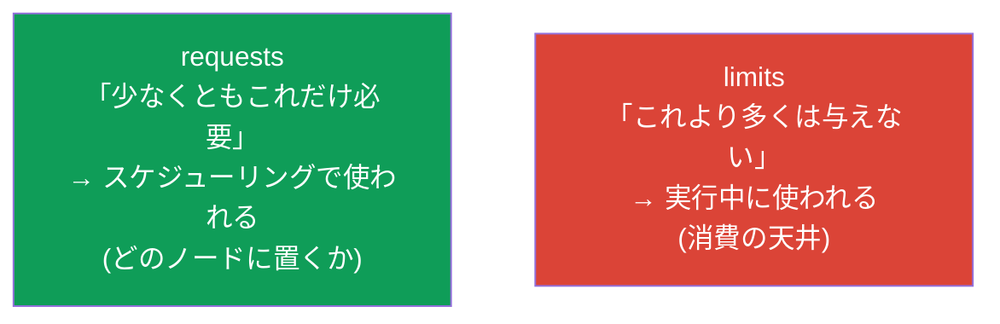
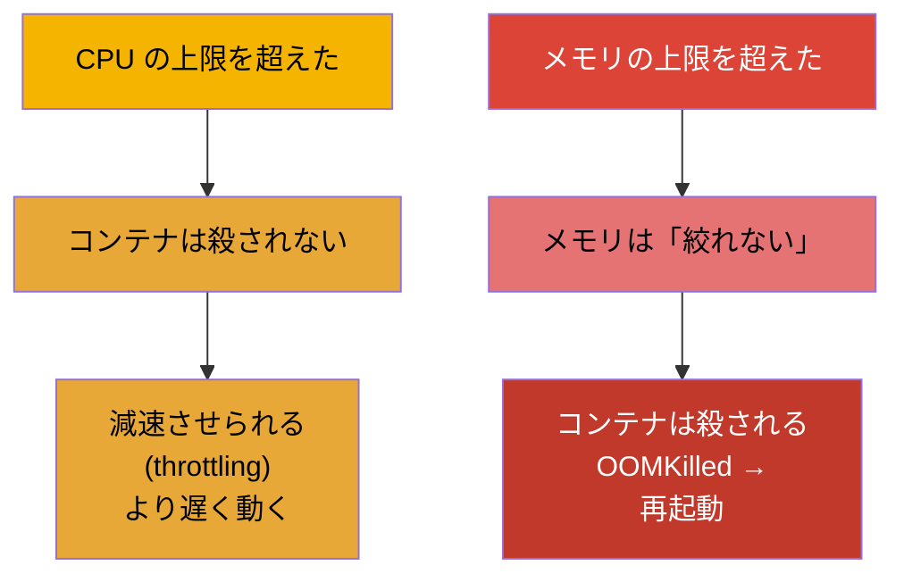
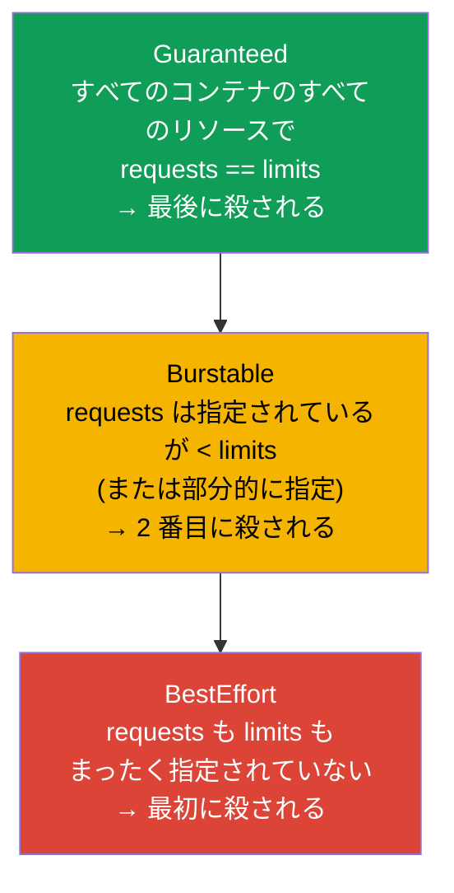
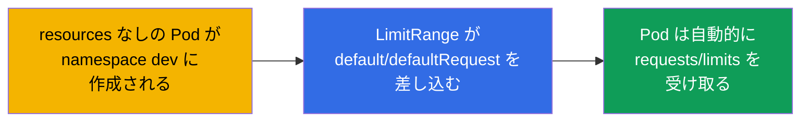
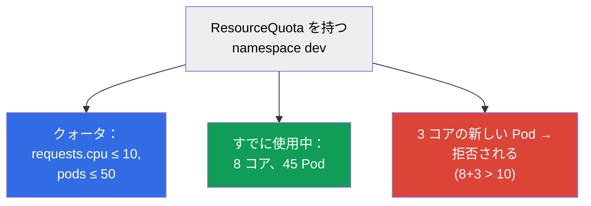

[Русская версия](ru.md) · [Eng version](README.md) · [Versión en español](es.md) · [Version française](fr.md) · [Deutsche Version](de.md) · [ქართული ვერსია](ge.md) · [繁體中文版](tw.md)

# 第 14 章。リソース：requests、limits、LimitRange、ResourceQuota

> **次は何か。** どの Pod も CPU とメモリを消費します。これを管理しなければ、1 つの
> 「食いしん坊」なコンテナが隣人を倒し、スケジューラは負荷を賢く配置できません。
> **requests** と **limits** は Pod の食欲を定め、スケジューリングに影響し、いつ Pod が
> 殺されるか、あるいは減速させられるかを決めます。**LimitRange** と **ResourceQuota** は
> namespace のレベルで消費を制限します。これは両方の試験のテーマ（CKA では Workloads、
> CKAD では Environment/Config）であり、運用の日常の現実でもあります。

## 14.1. requests と limits：2 つの異なる約束

コンテナにはリソースの設定が 2 つあり、いつも混同されます。はっきり整理しましょう。

- **requests（要求）** - コンテナに **保証されて必要な** リソース量です。
  スケジューラは requests を使ってノードを選びます：Pod は少なくともその分だけ空きが
  あるところにしか行きません。これは「予約」です。
- **limits（上限）** - それより上はコンテナに消費させない **天井** です。
  メモリで超えたら殺され (OOMKilled)、CPU で超えたら減速させられます (throttling)。



```yaml
spec:
  containers:
  - name: app
    image: nginx
    resources:
      requests:
        cpu: "250m"        # 0.25 コアが保証される
        memory: "64Mi"
      limits:
        cpu: "500m"        # コアの半分より多くはない
        memory: "128Mi"    # 128 MiB より多くはない
```

## 14.2. CPU とメモリの単位

これらの単位はすらすら読めるようになる必要があります。

**CPU** はコア単位で測り、端数はミリコア (`m`, milli-CPU、「ミリコア」) で表します：

| 表記 | 意味 |
|--------|----------|
| `1` または `1000m` | 完全な 1 コア |
| `500m` | コアの半分 |
| `250m` | コアの 4 分の 1 |
| `100m` | 0.1 コア |

**ミリコアはどう数えられるか。** `1000m` = 1 コア = 1 つの vCPU のプロセッサ時間の
100%（クラウドでは通常 1 スレッド/ハイパースレッド）です。ミリコアとは **ある期間内の
プロセッサ時間の割合** であって、「独立したハードウェアの一片」ではありません。内部では
これを Linux の CFS スケジューラが cgroups を通して実現します：`requests` は
`cpu.shares`（CPU が全員に足りないときの分配の相対的な重み）になり、`limits` は CFS の
クォータ (`cpu.cfs_quota_us`/`cpu.cfs_period_us`) になります。たとえば期間 100 ms での
`500m` は「100 ms ごとに CPU 時間 50 ms より多くは使わない」という意味です：コンテナは
1 コアの半分を継続的に占めることもできますし、1 コア全部を期間の半分だけ占めることも
できます。

**メモリ** はバイトで測り、通常はサフィックスを付けます。2 進の単位と 10 進の単位を
混同しないことが重要です：

| 2 進 (1024 のべき乗) | 10 進 (1000 のべき乗) |
|-------------------------|---------------------------|
| `Ki`, `Mi`, `Gi` | `k`, `M`, `G` |
| `128Mi` = 128×1024² バイト | `128M` = 128×1000² バイト |

**MiB とは何か。** サフィックス `Mi` は **メビバイト** (MiB) です：`1 Mi` = 2²⁰ = 1 048 576 バイト
（つまり 1024 KiB）。**メガバイト**（MB、サフィックス `M`）と混同しないでください：`1 M` = 10⁶ =
1 000 000 バイトです。同様に `Gi` = ギビバイト (GiB、2³⁰ バイト)、`G` = ギガバイト (10⁹ バイト) です。
2 進の単位 (`Mi`, `Gi`) は、まさに「1024 なのか 1000 なのか」という混乱を取り除くために現れました。
実際の Kubernetes ではこちらの方がよく使われます：`128Mi` ≈ 134 MB であり、128 MB ではありません。

> **不均一なノードには注意。** ミリコアはコアの **時間の割合** を指定するもので、絶対的な
> 性能ではありません。クラスタのノードが異なる場合（たとえば一部は速い現代的なコア、一部は
> 古い遅いコア）、速いノードでの `500m` は遅いノードでの `500m` より目に見えて多くの仕事を
> こなします。同じ requests/limits が異なるハードウェアでは異なる実際の力になります - そこから
> **負荷とレイテンシの偏り** が生まれます：遅いノードにいる Pod は同じ上限でも遅くなり、
> CPU throttling にぶつかる頻度が高くなります。メモリはこのように「偏り」ませんが（バイトは
> どこでもバイトです）、RAM の周波数/帯域も異なることがあります。どうすればよいか：可能な
> かぎりノードプールを均一に保つこと。ノードが異機種なら、ラベル（CPU クラス）を付けて
> `nodeAffinity`（第 12 章）で性能に敏感なワークロードを必要な種類に載せ、さらにこの差を
> キャパシティプランニングに織り込むことです。

## 14.3. 超えたときに何が起きるか：CPU とメモリは違う振る舞いをする

これはデバッグにとって決定的な違いです。



- **CPU は圧縮できるリソース。** 上限の超過 → throttling：コンテナに与えるプロセッサ時間が
  単に減り、遅くなりますが生き続けます。
- **メモリは圧縮できないリソース。** 「少しずつ取り上げる」ことができません。上限を超えたら →
  コンテナは `OOMKilled` で殺され、Pod は再起動します（第 4 章で見ました）。

そこから実践的なルールが出てきます：低すぎるメモリ上限 = 定期的な OOMKilled と
再起動。低すぎる CPU 上限 = 負荷時の動作が遅い。

## 14.4. サービス品質クラス (QoS)

requests と limits の関係によって、Kubernetes は Pod に **QoS クラス** を割り当てます。それは
ノードのメモリが物理的に尽きたときに誰が最初に殺されるかを決めます（これは上限とは別の
仕組みで、eviction です）。



| QoS クラス | 条件 | メモリ不足時の優先度 |
|-----------|---------|-------------------------------|
| **Guaranteed** | すべてのリソースで requests = limits | 最後に殺される |
| **Burstable** | requests が指定され limits より小さい | 2 番目に殺される |
| **BestEffort** | requests も limits もない | 最初に殺される |

ノードのメモリが尽きると、kubelet は Pod の **追い出し** (eviction) を始めます。まず
BestEffort、次に requests を超えている Burstable です。Guaranteed の Pod がもっとも
安全です。だから本番の重要なサービスには `requests == limits` を設定します。

## 14.5. LimitRange：namespace 内のデフォルト値と境界

問題：開発者が requests/limits を指定しないと、Pod は BestEffort になり、最初に殺される
リスクを負います。**LimitRange** はこれを namespace のレベルで解決します - デフォルト値と
許容される境界を定めます。

```yaml
apiVersion: v1
kind: LimitRange
metadata:
  name: defaults
  namespace: dev
spec:
  limits:
  - type: Container
    default:              # 指定されていない場合のデフォルトの limits
      cpu: "500m"
      memory: "256Mi"
    defaultRequest:       # 指定されていない場合のデフォルトの requests
      cpu: "100m"
      memory: "64Mi"
    max:                  # 要求できる最大値
      cpu: "2"
      memory: "1Gi"
    min:                  # 最小値
      cpu: "50m"
      memory: "32Mi"
```



LimitRange は namespace 内の **個々のオブジェクト**（コンテナ/Pod/PVC）に作用します：デフォルトを
定め、要求された値が min/max に収まっているかを検証します。Pod が境界を外れると
拒否されます。

## 14.6. ResourceQuota：namespace 全体への合計上限

**ResourceQuota** は namespace 全体の **合計の** 消費を制限します：すべての Pod が合わせて
どれだけの CPU/メモリを要求できるか、各種類のオブジェクトをいくつ作れるか。

```yaml
apiVersion: v1
kind: ResourceQuota
metadata:
  name: team-quota
  namespace: dev
spec:
  hard:
    requests.cpu: "10"          # すべての requests CPU の合計 ≤ 10 コア
    requests.memory: "20Gi"
    limits.cpu: "20"
    limits.memory: "40Gi"
    pods: "50"                  # Pod は 50 個まで
    services: "10"
    persistentvolumeclaims: "5"
```



LimitRange と ResourceQuota の違い（よく問われます）：

| | LimitRange | ResourceQuota |
|---|-----------|---------------|
| レベル | 個々のオブジェクト（コンテナ/Pod/PVC） | namespace 全体の合計 |
| 何をするか | オブジェクトごとのデフォルト + min/max | namespace 全体の上限 |
| 例 | 「Pod は最小 50m、最大 2 コア」 | 「namespace 全体で 10 コアと 50 Pod まで」 |

> **重要な細かい点。** namespace に `requests`/`limits` の ResourceQuota がある場合、
> 各 Pod は対応する requests/limits を **必ず** 指定しなければならず、そうでなければ拒否されます。
> ここで LimitRange が助けになります：デフォルトを差し込んでくれるので、Pod はクォータを通ります。

## 14.7. 本番環境でこれをどう使うか

- **requests/limits は全員に必須。** 成熟したクラスタでは requests/limits のない Pod は
  そもそも通りません（LimitRange + admission による）。これはノードを「食いしん坊」な
  隣人から守り、スケジューラに配置のための正確な絵を与えます。
- **重要なサービスには Guaranteed。** DB や重要なサービスには `requests ==
  limits`（Guaranteed）を設定し、メモリ不足のときに最初に追い出されないようにします。柔軟な
  バックグラウンドのジョブには Burstable を許します。
- **各 namespace に LimitRange + ResourceQuota。** マルチテナンシーの定番の実践です：
  チームごとに namespace を用意し、自分のクォータ（全体でどれだけのリソースを使えるか）と
  LimitRange（オブジェクトごとのデフォルトと境界）を与えます。こうして 1 つのチームが
  クラスタ全体を「食べ尽くす」ことがなくなります。
- **メトリクスによる right-sizing。** requests/limits は実際の消費に合わせて選びます
  (`kubectl top`、Prometheus、VPA の推奨)。requests を高くしすぎると → 遊んでいるのに
  「予約された」リソースと無駄なお金。メモリの limits を低くしすぎると → OOMKilled。
- **OOMKilled と throttling はよくあるインシデント。** リリース後の大量の OOMKilled は
  低すぎるメモリ上限の合図。負荷時の説明のつかない遅さは CPU throttling です。性能への
  苦情が来たとき、メトリクスで最初に確認するのがこれです。

### ケース：新しいアプリケーションの requests/limits をどう選ぶか

よくある状況：新しいサービスをリリースしたが、requests/limits に何を設定すべきか分からない -
消費のプロファイルがまだありません。目分量で当てるのは危険です：メモリを低くすれば
OOMKilled が降り注ぎ、CPU を低くすればサービスは遅くなり、高くしすぎればリソースを無駄に
予約して払いすぎます。正しいやり方は **反復的** で、確実に安全なところから正確なところへ進みます。

1. **余裕をもって始める。** 最初のリリースでは意図的に requests/limits を「余裕をもって」
   設定します（たとえば大まかな見積もりの ×1.5-2）。最初のステップの目標は節約ではなく
   倒れないことです：実データがないうちは OOMKilled と厳しい throttling を避けます。ただし
   `requests` は必要以上に高くしない方がよいです - スケジューリングと「予約」のコストが
   それに依存します。
2. **実際の負荷のもとで観察する。** CPU とメモリの消費メトリクスを代表的な期間にわたって
   集めます - 必ず **負荷の完全なサイクル** を捉えて：日中のピーク、夜間、週末、さらに
   一時的な急増（リリース、バッチ、セール）も含めます。
   道具：`kubectl top`、Prometheus/Grafana、推奨モード (`Off`) の VPA。VPA は履歴から
   値を自分で提案してくれます。
3. **症状にアラートを付ける。** `OOMKilled`（OutOfMemory を理由とする再起動）と
   **CPU throttling** (`container_cpu_cfs_throttled_periods`) にアラートを設定します。これは
   上限が低すぎることの早期の合図で、ユーザーより先に問題を知るためのものです。
4. **データに従って調整する。** 集めた統計に基づいて値を現実へ近づけます：
   - **メモリ：** `limit` - 観測されたピークより少し上に（メモリは圧縮できないので、急増への
     余裕は必須です。さもなくば OOMKilled）。`request` - 典型的な消費に近く。
   - **CPU：** `request` - 典型的な負荷のあたりに（スケジューリングに影響します）、`limit` - それより
     上にして、絶えず throttling されずに短時間の急増を許します（場合によっては
     CPU の上限を意識的にまったく設定せず、requests と QoS に頼ることもあります）。
5. **サイクルを繰り返す。** right-sizing は 1 回で終わる作業ではありません：コード、トラフィック、
   依存関係が変われば消費のプロファイルも変わるので、ステップ 2-4 を定期的に
   繰り返します。重要なサービスは結局 `requests == limits`（Guaranteed）に行き着くことが
   多く、柔軟なバックグラウンドのものは Burstable のままにします。

まとめ：「余裕をもって、とにかく倒れないように」から、メトリクスとアラートを経て、実際の消費を
反映した値へ。こうして OOMKilled/throttling を避けつつ、遊んでいる「予約」に
払いすぎることもなくなります。

## 14.8. 役に立つコマンド

```bash
# 消費量 (metrics-server が必要、第 28 章)
kubectl top nodes
kubectl top pods
kubectl top pods --sort-by=memory

# QoS クラスと Pod が殺された理由
kubectl describe pod <pod> | grep -i qos
kubectl describe pod <pod>            # Last State: Terminated, Reason: OOMKilled を探す

# namespace のクォータと上限
kubectl get resourcequota -n dev
kubectl describe resourcequota team-quota -n dev
kubectl get limitrange -n dev
```

## 14.9. ミニ用語集

- **requests** - 保証されるリソースの最小量。スケジューリングで使われます。
- **limits** - 消費の天井。実行中に検証されます。
- **milli-CPU (m)** - コアの 1000 分の 1 (`500m` = コアの半分)。
- **Mi/Gi vs M/G** - メモリの 2 進 (1024) 単位と 10 進 (1000) 単位。
- **throttling** - CPU の上限を超えたときのコンテナの減速。
- **OOMKilled** - メモリの上限を超えたときのコンテナの強制終了。
- **QoS クラス** - Guaranteed / Burstable / BestEffort。メモリ不足時の追い出しの
  順序です。
- **eviction** - ノードのリソースが足りないときの kubelet による Pod の追い出し。
- **LimitRange** - namespace 内の個々のオブジェクトに対するリソースのデフォルトと境界。
- **ResourceQuota** - namespace 全体に対するリソースとオブジェクト数の合計上限。

## 14.10. 本章のまとめ

- requests は保証される最小量（スケジューリング用）、limits は天井（実行中用）です。
- CPU：`m`（ミリコア）。メモリ：2 進の `Mi/Gi` (1024) と 10 進の `M/G` (1000)。
- CPU の超過 → throttling（遅くなる）。メモリの超過 → OOMKilled（殺される）。
- QoS：Guaranteed (requests=limits、最後に殺される)、Burstable、BestEffort（リソース
  指定なし、最初に殺される）。ノードのメモリ不足時の eviction に影響します。
- LimitRange は namespace 内の個々のオブジェクトに対するリソースのデフォルトと min/max を定めます。
- ResourceQuota は namespace 全体の合計消費とオブジェクト数を制限します。
- ResourceQuota があるときは Pod は requests/limits を指定する義務があります。LimitRange が
  デフォルトを差し込み、Pod が通るようにします。

## 14.11. これがどう役に立つか：試験と実際の仕事で

**試験では。** 「コンテナに requests/limits を設定せよ」「namespace 用に ResourceQuota/LimitRange
を作成せよ」「なぜ Pod が OOMKilled なのか / リソースのせいで Pending なのか」「QoS クラスを判定せよ」 -
これらは定番の課題です。`resources` ブロックを書けること、単位を知っていること、LimitRange と
ResourceQuota を区別できること、OOMKilled と throttling を理解していることが必要です。

**実際の仕事では。** requests/limits はクラスタの安定性とコストの基礎です：
「食いしん坊」な隣人から守り、スケジューラに正確な絵を与え、メモリ不足のときに誰を
追い出すかを決めます。クォータと LimitRange はチームの間でリソースを公平に分ける
仕組みです。メトリクスによる right-sizing は直接お金を節約し、OOMKilled を防ぎます。

## 14.12. 自己チェックの質問

1. requests は limits とどう違い、それぞれどの段階で使われますか？
2. `250m` はコアのどれだけを意味しますか？`128Mi` は `128M` とどう違いますか？
3. CPU の上限とメモリの上限を超えたとき何が起きますか - そしてなぜ違うのですか？
4. QoS クラスはどのように決まり、メモリ不足時の追い出しにどう影響しますか？
5. LimitRange は作用のレベルにおいて ResourceQuota とどう違いますか？
6. ResourceQuota があるとき、なぜ LimitRange を持つことが重要なのですか？
7. 症状から、低すぎるメモリ上限と低すぎる CPU 上限をどう見分けますか？

## 演習

Pod の食欲と namespace のクォータを管理できるようになりました。第 15 章では
スケジューリングの残りのテーマ - static Pod、PriorityClass、複数の
スケジューラ - を扱います。リソースとクォータはワークロードのラボで練習します。

🧪 ラボ 122（requests/limits のドリルも含む）: [tasks/cka/labs/122](../../labs/122/README_JP.MD)

🎮 Killercoda（ブラウザ内、セットアップ不要）：[Set CPU and memory limits](https://killercoda.com/chadmcrowell/course/ckad/cpu-mem-limits) · [LimitRange for Namespace](https://killercoda.com/chadmcrowell/course/ckad/limitrange-namespace) · [ResourceQuota for Namespace](https://killercoda.com/chadmcrowell/course/ckad/resourcequota-namespace) · [Default CPU/Memory Limits](https://killercoda.com/chadmcrowell/course/ckad/default-cpu-memory)

---
[目次](../README_JP.md) · [第 13 章](../13/jp.md) · [第 15 章](../15/jp.md)
