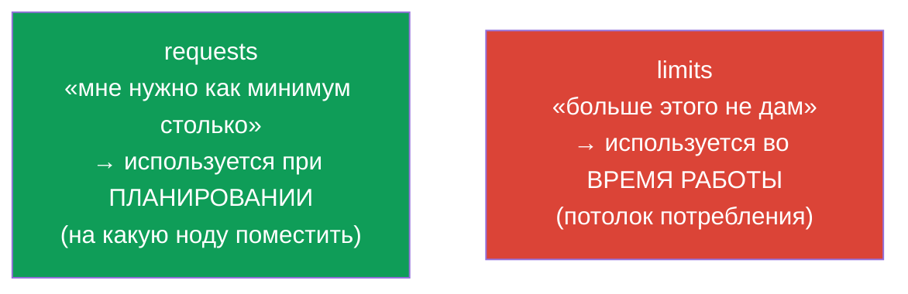
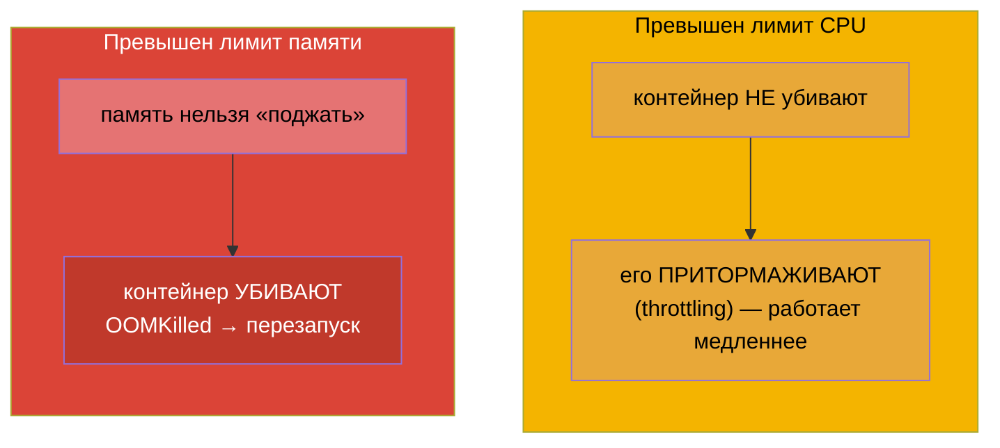
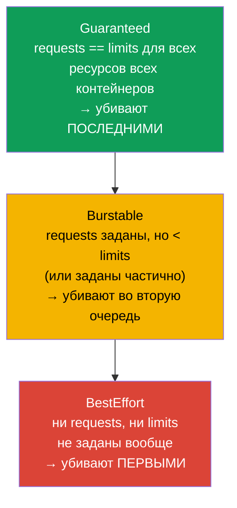
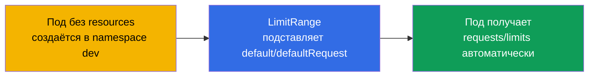
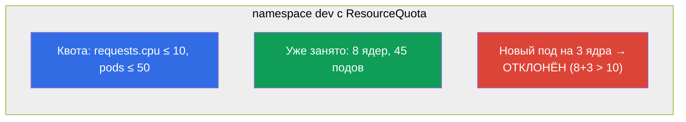

# Глава 14. Ресурсы: requests, limits, LimitRange и ResourceQuota

> **Что дальше.** Каждый под потребляет CPU и память. Если этим не управлять, один
> «прожорливый» контейнер уронит соседей, а планировщик не сможет разумно раскладывать
> нагрузку. **requests** и **limits** задают аппетиты пода, влияют на планирование и на
> то, когда под убьют или притормозят. **LimitRange** и **ResourceQuota** ограничивают
> потребление на уровне namespace. Это темы обоих экзаменов (Workloads на CKA,
> Environment/Config на CKAD) и повседневная реальность эксплуатации.

## 14.1. requests и limits: два разных обещания

У контейнера две настройки ресурсов, и их постоянно путают. Разберём чётко.

- **requests (запрос)** - сколько ресурсов контейнеру **гарантированно нужно**.
  Планировщик использует requests, чтобы выбрать ноду: под поедет только туда, где
  свободно хотя бы столько. Это «бронь».
- **limits (лимит)** - **потолок**, выше которого контейнеру не дадут потреблять.
  Превысил по памяти - убьют (OOMKilled); превысил по CPU - притормозят (throttling).



```yaml
spec:
  containers:
  - name: app
    image: nginx
    resources:
      requests:
        cpu: "250m"        # 0.25 ядра гарантировано
        memory: "64Mi"
      limits:
        cpu: "500m"        # не больше половины ядра
        memory: "128Mi"    # не больше 128 МиБ
```

## 14.2. Единицы измерения CPU и памяти

Эти единицы надо читать свободно.

**CPU** измеряется в ядрах, дробные - в милли-ядрах (`m`):

| Запись | Значение |
|--------|----------|
| `1` или `1000m` | одно полное ядро |
| `500m` | половина ядра |
| `250m` | четверть ядра |
| `100m` | 0.1 ядра |

**Память** - в байтах, обычно с суффиксами. Важно не путать двоичные и десятичные:

| Двоичные (степени 1024) | Десятичные (степени 1000) |
|-------------------------|---------------------------|
| `Ki`, `Mi`, `Gi` | `k`, `M`, `G` |
| `128Mi` = 128×1024² байт | `128M` = 128×1000² байт |

На практике чаще используют двоичные (`Mi`, `Gi`). `128Mi` ≈ 134 МБ, а не 128 МБ.

## 14.3. Что происходит при превышении: CPU и память ведут себя по-разному

Это ключевое различие для отладки.



- **CPU - сжимаемый ресурс.** Превышение лимита → throttling: контейнеру просто дают
  меньше процессорного времени, он тормозит, но живёт.
- **Память - несжимаемый ресурс.** Её нельзя «отобрать по чуть-чуть». Превысил лимит →
  контейнер убивают с `OOMKilled`, под перезапускается (мы видели это в главе 4).

Отсюда практическое правило: заниженный лимит памяти = регулярные OOMKilled и
рестарты; заниженный лимит CPU = медленная работа под нагрузкой.

## 14.4. Классы качества обслуживания (QoS)

По соотношению requests и limits Kubernetes присваивает поду **QoS-класс**. Он
определяет, кого убьют первым, когда на ноде физически кончится память (это отдельный от
лимитов механизм - eviction).



| QoS-класс | Условие | Приоритет при нехватке памяти |
|-----------|---------|-------------------------------|
| **Guaranteed** | requests = limits по всем ресурсам | убивают последними |
| **Burstable** | requests заданы и меньше limits | убивают во вторую очередь |
| **BestEffort** | ни requests, ни limits | убивают первыми |

Когда на ноде кончается память, kubelet начинает **выселять** поды (eviction), начиная с
BestEffort, затем Burstable, превысивших requests. Guaranteed-поды - в наибольшей
безопасности. Поэтому критичным сервисам в проде ставят `requests == limits`.

## 14.5. LimitRange: значения по умолчанию и границы в namespace

Проблема: если разработчик не указал requests/limits, под становится BestEffort и
рискует быть убитым первым. **LimitRange** решает это на уровне namespace - задаёт
значения по умолчанию и допустимые границы.

```yaml
apiVersion: v1
kind: LimitRange
metadata:
  name: defaults
  namespace: dev
spec:
  limits:
  - type: Container
    default:              # limits по умолчанию, если не заданы
      cpu: "500m"
      memory: "256Mi"
    defaultRequest:       # requests по умолчанию, если не заданы
      cpu: "100m"
      memory: "64Mi"
    max:                  # максимум, что можно запросить
      cpu: "2"
      memory: "1Gi"
    min:                  # минимум
      cpu: "50m"
      memory: "32Mi"
```



LimitRange действует на **отдельный объект** (контейнер/под/PVC) в namespace: задаёт
дефолты и проверяет, что запрошенное укладывается в min/max. Если под выходит за
границы - его отклонят.

## 14.6. ResourceQuota: суммарный лимит на namespace

**ResourceQuota** ограничивает **суммарное** потребление всего namespace: сколько всего
CPU/памяти могут запросить все поды вместе, сколько объектов каждого типа можно создать.

```yaml
apiVersion: v1
kind: ResourceQuota
metadata:
  name: team-quota
  namespace: dev
spec:
  hard:
    requests.cpu: "10"          # суммарно все requests CPU ≤ 10 ядер
    requests.memory: "20Gi"
    limits.cpu: "20"
    limits.memory: "40Gi"
    pods: "50"                  # не более 50 подов
    services: "10"
    persistentvolumeclaims: "5"
```



Разница LimitRange и ResourceQuota (частый вопрос):

| | LimitRange | ResourceQuota |
|---|-----------|---------------|
| Уровень | отдельный объект (контейнер/под/PVC) | весь namespace суммарно |
| Что делает | дефолты + min/max на объект | общий потолок на namespace |
| Пример | «под минимум 50m, максимум 2 ядра» | «всему namespace не больше 10 ядер и 50 подов» |

> **Важный нюанс.** Если в namespace есть ResourceQuota по `requests`/`limits`, то
> каждый под **обязан** указывать соответствующие requests/limits, иначе будет отклонён.
> Тут и выручает LimitRange: он проставит дефолты, и поды пройдут квоту.

## 14.7. Как это применяют в продакшене

- **requests/limits обязательны для всех.** В зрелых кластерах под без requests/limits
  просто не пройдёт (через LimitRange + admission). Это защищает ноды от «прожорливых»
  соседей и даёт планировщику точную картину для раскладки.
- **Guaranteed для критичных сервисов.** Для БД и важных сервисов ставят `requests ==
  limits` (Guaranteed), чтобы их не выселяли первыми при нехватке памяти. Для гибких
  фоновых задач допускают Burstable.
- **LimitRange + ResourceQuota на каждый namespace.** Типовая практика мультитенантности:
  каждой команде - namespace со своей квотой (сколько всего ресурсов ей можно) и
  LimitRange (дефолты и границы на объект). Так одна команда не «съест» весь кластер.
- **Right-sizing по метрикам.** requests/limits подбирают по реальному потреблению
  (`kubectl top`, Prometheus, VPA-рекомендации). Завышенные requests → простаивающие,
  но «забронированные» ресурсы и лишние деньги; заниженные limits памяти → OOMKilled.
- **OOMKilled и throttling - частые инциденты.** Массовые OOMKilled после релиза - сигнал
  заниженного лимита памяти; необъяснимые тормоза под нагрузкой - CPU throttling. Это
  первое, что проверяют по метрикам при жалобах на производительность.

## 14.8. Полезные команды

```bash
# Потребление (нужен metrics-server, глава 28)
kubectl top nodes
kubectl top pods
kubectl top pods --sort-by=memory

# QoS-класс и причины убийства пода
kubectl describe pod <pod> | grep -i qos
kubectl describe pod <pod>            # ищем Last State: Terminated, Reason: OOMKilled

# Квоты и лимиты namespace
kubectl get resourcequota -n dev
kubectl describe resourcequota team-quota -n dev
kubectl get limitrange -n dev
```

## 14.9. Мини-глоссарий

- **requests** - гарантированный минимум ресурсов; используется при планировании.
- **limits** - потолок потребления; проверяется во время работы.
- **milli-CPU (m)** - тысячная доля ядра (`500m` = полъядра).
- **Mi/Gi vs M/G** - двоичные (1024) против десятичных (1000) единиц памяти.
- **throttling** - притормаживание контейнера при превышении лимита CPU.
- **OOMKilled** - убийство контейнера при превышении лимита памяти.
- **QoS-класс** - Guaranteed / Burstable / BestEffort; порядок выселения при нехватке
  памяти.
- **eviction** - выселение подов kubelet при нехватке ресурсов ноды.
- **LimitRange** - дефолты и границы ресурсов на отдельный объект в namespace.
- **ResourceQuota** - суммарный лимит ресурсов и числа объектов на namespace.

## 14.10. Итоги главы

- requests - гарантированный минимум (для планирования), limits - потолок (для работы).
- CPU: `m` (милли-ядра); память: двоичные `Mi/Gi` (1024) против десятичных `M/G` (1000).
- Превышение CPU → throttling (тормозит); превышение памяти → OOMKilled (убивают).
- QoS: Guaranteed (requests=limits, убивают последними), Burstable, BestEffort (без
  ресурсов, убивают первыми); влияет на eviction при нехватке памяти на ноде.
- LimitRange задаёт дефолты и min/max ресурсов на отдельный объект в namespace.
- ResourceQuota ограничивает суммарное потребление и число объектов на весь namespace.
- При наличии ResourceQuota поды обязаны указывать requests/limits; LimitRange
  проставляет дефолты, чтобы они проходили.

## 14.11. Как это пригодится: на экзамене и в реальной работе

**На экзамене.** «Задай requests/limits контейнеру», «создай ResourceQuota/LimitRange
для namespace», «почему под OOMKilled / в Pending из-за ресурсов», «определи QoS-класс» -
типовые задания. Нужно писать блок `resources`, знать единицы, различать LimitRange и
ResourceQuota и понимать OOMKilled vs throttling.

**В реальной работе.** requests/limits - основа стабильности и стоимости кластера:
защищают от «прожорливых» соседей, дают планировщику точную картину, определяют, кого
выселят при нехватке памяти. Квоты и LimitRange - механизм честного дележа ресурсов между
командами. Right-sizing по метрикам напрямую экономит деньги и предотвращает OOMKilled.

## 14.12. Вопросы для самопроверки

1. Чем requests отличается от limits и на каком этапе каждый используется?
2. Сколько ядра означает `250m`? Чем `128Mi` отличается от `128M`?
3. Что происходит при превышении лимита CPU и лимита памяти - и почему по-разному?
4. Как определяется QoS-класс и как он влияет на выселение при нехватке памяти?
5. Чем LimitRange отличается от ResourceQuota по уровню действия?
6. Почему при наличии ResourceQuota важно иметь LimitRange?
7. Как по симптомам отличить заниженный лимит памяти от заниженного лимита CPU?

## Практика

Мы научились управлять аппетитами подов и квотами namespace. В главе 15 разберём
оставшиеся темы планирования - статические поды, PriorityClass и несколько
планировщиков. Ресурсы и квоты отрабатываются в лабах по рабочим нагрузкам.

🧪 Лаба 122 (в т.ч. дрилл на requests/limits): [tasks/cka/labs/122](../../labs/122/README_RU.MD)

---
[Оглавление](../README_RU.md) · [Глава 13](../13/ru.md) · [Глава 15](../15/ru.md)
