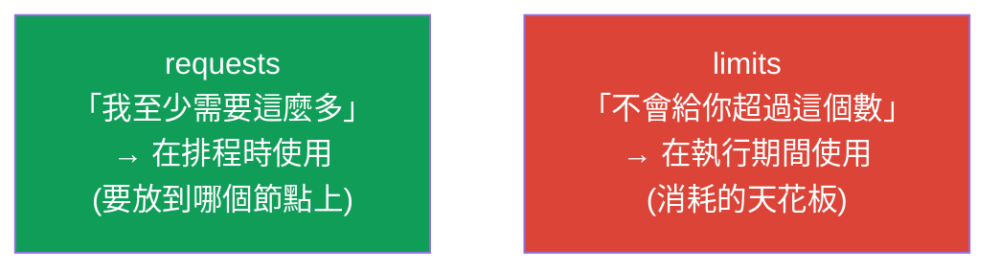
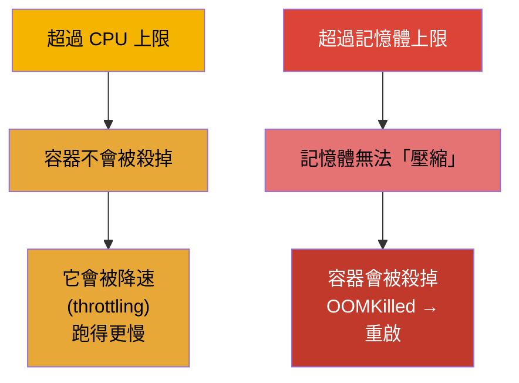
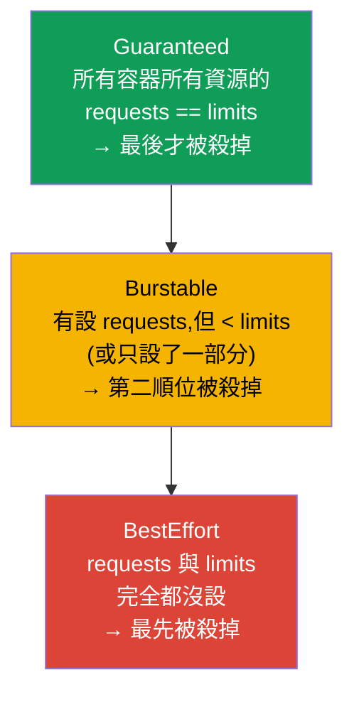
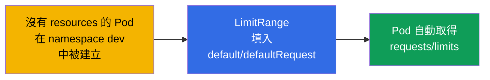
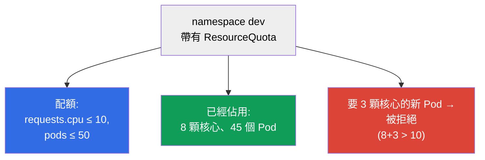

[Русская версия](ru.md) · [Eng version](README.md) · [Versión en español](es.md) · [Version française](fr.md) · [Deutsche Version](de.md) · [ქართული ვერსია](ge.md) · [日本語版](jp.md)

# 第 14 章。資源:requests、limits、LimitRange 與 ResourceQuota

> **接下來是什麼。** 每個 Pod 都會消耗 CPU 與記憶體。如果不去管理這件事,一個
> 「貪吃」的容器就會拖垮鄰居,而排程器也無法合理地分配
> 負載。**requests** 與 **limits** 設定 Pod 的食量,影響排程,也影響
> 什麼時候 Pod 會被殺掉或被降速。**LimitRange** 與 **ResourceQuota** 則在
> namespace 層級限制消耗。這是兩場考試都會考的主題(CKA 的 Workloads、
> CKAD 的 Environment/Config),也是日常營運的現實。

## 14.1. requests 與 limits:兩種不同的承諾

容器有兩項資源設定,而它們常常被搞混。我們把它講清楚。

- **requests(請求)** - 容器**必須被保證拿到**多少資源。
  排程器用 requests 來挑選節點:Pod 只會被放到至少還有這麼多空閒資源的地方。
  這就是「預訂」。
- **limits(上限)** - **天花板**,超過這個值就不會再讓容器消耗。
  記憶體超標 - 就被殺掉(OOMKilled);CPU 超標 - 就被降速(throttling)。



```yaml
spec:
  containers:
  - name: app
    image: nginx
    resources:
      requests:
        cpu: "250m"        # 保證有 0.25 顆核心
        memory: "64Mi"
      limits:
        cpu: "500m"        # 不超過半顆核心
        memory: "128Mi"    # 不超過 128 MiB
```

## 14.2. CPU 與記憶體的計量單位

這些單位必須能流利地讀懂。

**CPU** 以核心為單位計量,小數則用毫核心(`m`,milli-CPU,「毫核」):

| 寫法 | 意義 |
|--------|----------|
| `1` 或 `1000m` | 一顆完整的核心 |
| `500m` | 半顆核心 |
| `250m` | 四分之一顆核心 |
| `100m` | 0.1 顆核心 |

**毫核是怎麼算的。** `1000m` = 一顆核心 = 一個 vCPU 的 100% 處理器時間
(在雲端上通常就是一個執行緒/hyper-thread)。毫核是**一段週期內處理器時間的
比例**,而不是「一小塊獨立的硬體」。在底層,這是由 Linux 的 CFS 排程器透過
cgroups 實作的:`requests` 會變成 `cpu.shares`
(當 CPU 不夠大家分時,分配 CPU 的相對權重),而 `limits` 會變成 CFS
的配額(`cpu.cfs_quota_us`/`cpu.cfs_period_us`)。例如週期為 100 毫秒時,`500m`
意味著「每 100 毫秒最多用 50 毫秒的 CPU」:容器可以持續佔用半顆
核心,也可以佔用一整顆核心,但只有半個週期。

**記憶體**以位元組計量,通常帶後綴。重點是不要把二進位單位與
十進位單位搞混:

| 二進位(1024 的次方) | 十進位(1000 的次方) |
|-------------------------|---------------------------|
| `Ki`、`Mi`、`Gi` | `k`、`M`、`G` |
| `128Mi` = 128×1024² 位元組 | `128M` = 128×1000² 位元組 |

**什麼是 MiB。** 後綴 `Mi` 是 **mebibyte**(MiB):`1 Mi` = 2²⁰ = 1 048 576 位元組
(也就是 1024 KiB)。不要和 **megabyte**(MB,後綴 `M`)混淆:`1 M` = 10⁶ =
1 000 000 位元組。同樣地,`Gi` = gibibyte(GiB,2³⁰ 位元組),而 `G` = gigabyte(10⁹ 位元組)。
二進位單位(`Mi`、`Gi`)出現的原因正是要消除「1024 還是 1000」的混亂。
在 Kubernetes 的實務中更常用的就是它們:`128Mi` ≈ 134 MB,而不是 128 MB。

> **不同規格的節點要小心。** 毫核指定的是核心**時間的比例**,而不是
> 絕對效能。如果叢集裡的節點不一樣(例如一部分是快速的
> 現代核心,一部分是老舊的慢核心),那麼快節點上的 `500m` 能完成的工作
> 會明顯多於慢節點上的 `500m`。相同的 requests/limits 在不同
> 硬體上會給出不同的實際算力 - 由此產生**負載與延遲的偏斜**:位於
> 慢節點上的 Pod 會比較慢,在相同上限下也更容易撞上 CPU throttling。
> 記憶體不會這樣「偏斜」(位元組到哪都是位元組),但 RAM 的頻率/吞吐量
> 也可能不同。該怎麼辦:盡可能讓節點池保持同質;
> 如果節點型號混雜 - 就用標籤標記它們(CPU 等級),並透過 `nodeAffinity`
> (第 12 章)把對效能敏感的負載放到需要的機型上,同時
> 把這個差異納入容量規劃。

## 14.3. 超標時會發生什麼:CPU 與記憶體的行為不同

這是除錯時的關鍵差異。



- **CPU 是可壓縮資源。** 超過上限 → throttling:就只是給容器
  更少的處理器時間,它會變慢,但還活著。
- **記憶體是不可壓縮資源。** 沒辦法「一點一點收回來」。超過上限 →
  容器被以 `OOMKilled` 殺掉,Pod 重啟(我們在第 4 章見過)。

由此得出一條實務規則:記憶體上限設得太低 = 經常 OOMKilled 與
重啟;CPU 上限設得太低 = 在負載下跑得很慢。

## 14.4. 服務品質類別(QoS)

Kubernetes 會依 requests 與 limits 的關係給 Pod 一個 **QoS 類別**。它
決定當節點的記憶體實際用盡時,誰會先被殺掉(這是與上限無關的另一套
機制 - eviction)。



| QoS 類別 | 條件 | 記憶體不足時的優先順序 |
|-----------|---------|-------------------------------|
| **Guaranteed** | 所有資源的 requests = limits | 最後才被殺掉 |
| **Burstable** | 有設 requests 且小於 limits | 第二順位被殺掉 |
| **BestEffort** | requests 與 limits 都沒設 | 最先被殺掉 |

當節點的記憶體用盡時,kubelet 會開始**驅逐** Pod(eviction),從
BestEffort 開始,接著是超過 requests 的 Burstable。Guaranteed 的 Pod 最
安全。因此生產環境中的關鍵服務會設定 `requests == limits`。

## 14.5. LimitRange:namespace 內的預設值與邊界

問題:如果開發者沒有指定 requests/limits,Pod 就會變成 BestEffort,
有被第一個殺掉的風險。**LimitRange** 在 namespace 層級解決這件事 - 它設定
預設值與允許的邊界。

```yaml
apiVersion: v1
kind: LimitRange
metadata:
  name: defaults
  namespace: dev
spec:
  limits:
  - type: Container
    default:              # 未指定時的預設 limits
      cpu: "500m"
      memory: "256Mi"
    defaultRequest:       # 未指定時的預設 requests
      cpu: "100m"
      memory: "64Mi"
    max:                  # 最多可以請求多少
      cpu: "2"
      memory: "1Gi"
    min:                  # 最少
      cpu: "50m"
      memory: "32Mi"
```



LimitRange 作用在 namespace 中的**單一物件**(容器/Pod/PVC):設定
預設值,並檢查所請求的量是否落在 min/max 之內。如果 Pod 超出
邊界 - 就會被拒絕。

## 14.6. ResourceQuota:整個 namespace 的總量上限

**ResourceQuota** 限制整個 namespace 的**總**消耗量:所有 Pod 加起來總共
可以請求多少 CPU/記憶體,每種類型的物件可以建立多少個。

```yaml
apiVersion: v1
kind: ResourceQuota
metadata:
  name: team-quota
  namespace: dev
spec:
  hard:
    requests.cpu: "10"          # 所有 requests CPU 加總 ≤ 10 顆核心
    requests.memory: "20Gi"
    limits.cpu: "20"
    limits.memory: "40Gi"
    pods: "50"                  # 不超過 50 個 Pod
    services: "10"
    persistentvolumeclaims: "5"
```



LimitRange 與 ResourceQuota 的差別(常見考題):

| | LimitRange | ResourceQuota |
|---|-----------|---------------|
| 層級 | 單一物件(容器/Pod/PVC) | 整個 namespace 的總和 |
| 做什麼 | 對物件設預設值 + min/max | namespace 的總天花板 |
| 例子 | 「Pod 最少 50m,最多 2 顆核心」 | 「整個 namespace 不超過 10 顆核心與 50 個 Pod」 |

> **重要細節。** 如果 namespace 裡有針對 `requests`/`limits` 的 ResourceQuota,那麼
> 每個 Pod 都**必須**指定對應的 requests/limits,否則會被拒絕。
> 這時候 LimitRange 就派上用場了:它會填入預設值,讓 Pod 能通過配額檢查。

## 14.7. 這在生產環境中如何應用

- **requests/limits 對所有人都是必填。** 在成熟的叢集裡,沒有 requests/limits 的
  Pod 根本過不了關(透過 LimitRange + admission)。這能保護節點不被「貪吃」的
  鄰居影響,也讓排程器有精確的資訊來安排位置。
- **關鍵服務用 Guaranteed。** 對資料庫與重要服務會設定 `requests ==
  limits`(Guaranteed),讓它們在記憶體不足時不會最先被驅逐。對彈性的
  背景工作則允許 Burstable。
- **每個 namespace 都配 LimitRange + ResourceQuota。** 這是多租戶的典型做法:
  每個團隊一個 namespace,配上自己的配額(總共可以用多少資源)與
  LimitRange(物件層級的預設值與邊界)。這樣一個團隊就不會「吃掉」整個叢集。
- **依指標做 right-sizing。** requests/limits 要依實際消耗來挑選
  (`kubectl top`、Prometheus、VPA 的建議值)。requests 設得過高 → 資源閒置卻被
  「預訂」住,還要多花錢;記憶體 limits 設得過低 → OOMKilled。
- **OOMKilled 與 throttling 是常見事故。** 發版後大量 OOMKilled 是記憶體上限
  設得太低的訊號;負載下莫名的卡頓則是 CPU throttling。當有人抱怨效能時,
  這是第一件要從指標中檢查的事。

### 案例:如何為新應用挑選 requests/limits

典型情境:剛推出一個新服務,不知道 requests/limits 該設多少 -
還沒有消耗的輪廓。憑感覺瞎猜很危險:記憶體設低了 - 會一路 OOMKilled;
CPU 設低了 - 服務會卡;設得太高 - 白白預訂資源、
多花錢。正確的做法是**迭代式**的,從絕對安全走向精確。

1. **先留餘裕起步。** 第一次發版時刻意把 requests/limits 設得「有餘裕」
   (例如按粗略估算的 ×1.5-2 倍)。第一步的目標不是
   省錢,而是不要掛掉:在還沒有真實數據之前,避免 OOMKilled 與嚴重的 throttling。
   同時 `requests` 最好不要比需要的高太多 - 排程與「預訂」的成本都取決於它們。
2. **在真實負載下觀察。** 收集一段有代表性的期間內 CPU 與記憶體的消耗指標 -
   一定要涵蓋**完整的負載週期**:每日高峰、夜間、週末,以及
   一次性的突發(發版、批次作業、大促)。
   工具:`kubectl top`、Prometheus/Grafana、以建議模式(`Off`)執行的 VPA,
   它會依歷史資料自己提出數值。
3. **針對症狀掛告警。** 為 `OOMKilled`(因 OutOfMemory 而重啟)與
   **CPU throttling**(`container_cpu_cfs_throttled_periods`)設定告警。這是
   上限設得太低的早期訊號 - 讓你比使用者更早知道問題。
4. **依數據修正。** 依收集到的統計把數值貼近現實:
   - **記憶體:** `limit` - 略高於觀察到的高峰(記憶體不可壓縮,一定要為
     突發留餘裕,否則就是 OOMKilled);`request` - 接近典型消耗量;
   - **CPU:** `request` - 大約是典型負載(會影響排程),`limit` -
     設高一些,以允許短暫的突發而不會一直 throttling(有時也會刻意
     完全不設 CPU 上限,只依賴 requests 與 QoS)。
5. **重複這個循環。** Right-sizing 不是一次性的動作:當程式碼、流量
   或依賴改變時,消耗的輪廓也會改變,所以第 2-4 步要定期
   重複。關鍵服務最終常常會走到 `requests == limits`
   (Guaranteed),彈性的背景工作則保留 Burstable。

結論:從「留點餘裕,別掛就好」出發,經過指標與告警,走到能反映
真實消耗的數值。這樣就能同時避開 OOMKilled/throttling,又不會為閒置的
「預訂」多付錢。

## 14.8. 實用指令

```bash
# 消耗量(需要 metrics-server,第 28 章)
kubectl top nodes
kubectl top pods
kubectl top pods --sort-by=memory

# Pod 的 QoS 類別與被殺掉的原因
kubectl describe pod <pod> | grep -i qos
kubectl describe pod <pod>            # 找 Last State: Terminated, Reason: OOMKilled

# namespace 的配額與限制
kubectl get resourcequota -n dev
kubectl describe resourcequota team-quota -n dev
kubectl get limitrange -n dev
```

## 14.9. 迷你詞彙表

- **requests** - 被保證的最低資源量;在排程時使用。
- **limits** - 消耗的天花板;在執行期間檢查。
- **milli-CPU (m)** - 核心的千分之一(`500m` = 半顆核心)。
- **Mi/Gi vs M/G** - 二進位(1024)對十進位(1000)的記憶體單位。
- **throttling** - 超過 CPU 上限時對容器降速。
- **OOMKilled** - 超過記憶體上限時殺掉容器。
- **QoS 類別** - Guaranteed / Burstable / BestEffort;記憶體不足時的驅逐
  順序。
- **eviction** - 節點資源不足時 kubelet 驅逐 Pod。
- **LimitRange** - namespace 中單一物件的資源預設值與邊界。
- **ResourceQuota** - namespace 的資源總量與物件數量上限。

## 14.10. 本章總結

- requests 是被保證的最低量(用於排程),limits 是天花板(用於執行期)。
- CPU:`m`(毫核心);記憶體:二進位 `Mi/Gi`(1024)對十進位 `M/G`(1000)。
- CPU 超標 → throttling(變慢);記憶體超標 → OOMKilled(被殺掉)。
- QoS:Guaranteed(requests=limits,最後才被殺)、Burstable、BestEffort(沒有
  資源設定,最先被殺);會影響節點記憶體不足時的 eviction。
- LimitRange 為 namespace 中的單一物件設定資源預設值與 min/max。
- ResourceQuota 限制整個 namespace 的總消耗量與物件數量。
- 有 ResourceQuota 時,Pod 必須指定 requests/limits;LimitRange 會
  填入預設值,讓它們能通過。

## 14.11. 這些知識用在哪裡:考試與實際工作

**在考試中。** 「為容器設定 requests/limits」、「為 namespace 建立
ResourceQuota/LimitRange」、「為什麼 Pod 被 OOMKilled / 因資源而 Pending」、「判斷 QoS 類別」 -
都是典型題目。要會寫 `resources` 區塊、知道單位、能區分 LimitRange 與
ResourceQuota,並理解 OOMKilled vs throttling。

**在實際工作中。** requests/limits 是叢集穩定性與成本的基礎:
保護你不受「貪吃」鄰居影響、給排程器精確的資訊、決定記憶體不足時
誰會被驅逐。配額與 LimitRange 則是團隊之間公平分配資源的
機制。依指標做 right-sizing 能直接省錢,也能預防 OOMKilled。

## 14.12. 自我檢查問題

1. requests 與 limits 有什麼不同,各自在哪個階段使用?
2. `250m` 代表幾分之幾顆核心?`128Mi` 與 `128M` 有什麼不同?
3. 超過 CPU 上限與超過記憶體上限時會發生什麼 - 為什麼不一樣?
4. QoS 類別是怎麼判定的,它如何影響記憶體不足時的驅逐?
5. LimitRange 與 ResourceQuota 在作用層級上有什麼不同?
6. 為什麼有 ResourceQuota 時,擁有 LimitRange 很重要?
7. 如何從症狀分辨記憶體上限設得太低與 CPU 上限設得太低?

## 實踐

我們學會了管理 Pod 的食量與 namespace 的配額。第 15 章會拆解
剩下的排程主題 - 靜態 Pod、PriorityClass 與多個
排程器。資源與配額會在工作負載的實驗中演練。

🧪 實驗 122(其中包含 requests/limits 的操練):[tasks/cka/labs/122](../../labs/122/README_TW.MD)

---
[目錄](../README_TW.md) · [第 13 章](../13/tw.md) · [第 15 章](../15/tw.md)
