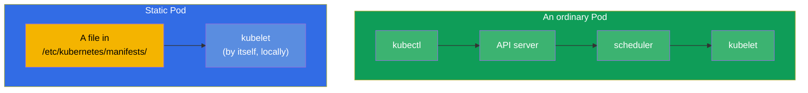
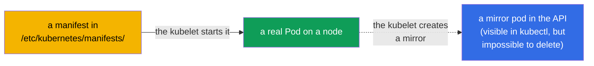
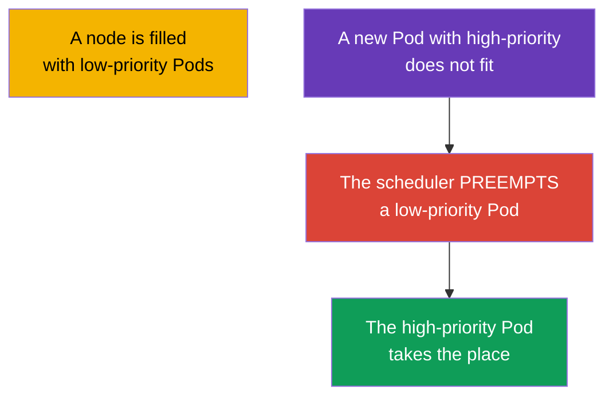
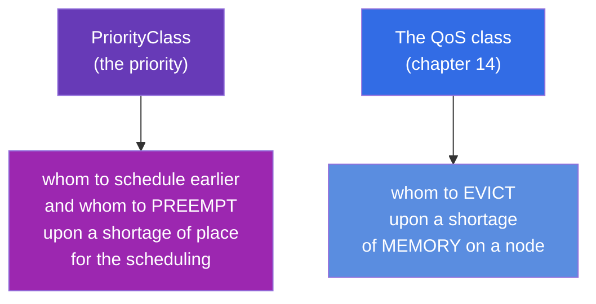
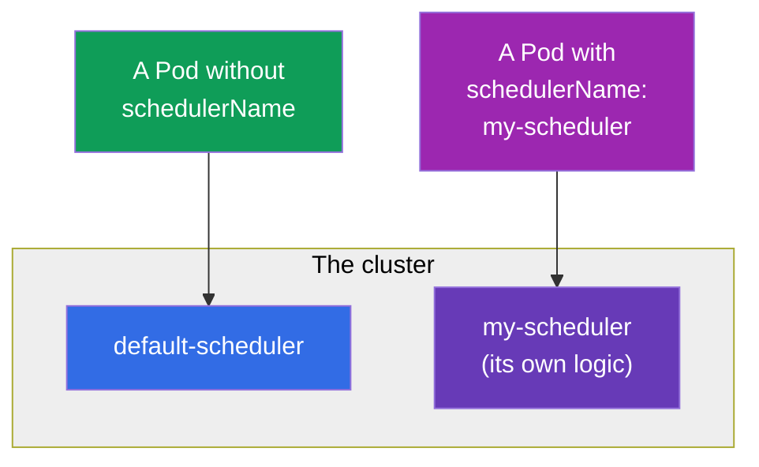

[Русская версия](ru.md) · [Versión en español](es.md) · [Version française](fr.md) · [Deutsche Version](de.md) · [ქართული ვერსია](ge.md) · [繁體中文版](tw.md) · [日本語版](jp.md)

# Chapter 15. Static Pods, PriorityClass and several schedulers

> **What comes next.** We are closing the block of the scheduling with three topics that are often met on
> the CKA. **Static Pods** are the Pods that the kubelet manages directly, bypassing the control plane
> (exactly like that the components of the control plane itself are started!). **PriorityClass** is
> the priorities of the Pods and the eviction (preemption) upon a shortage of the resources. **Several
> schedulers** is how to start and to use your own scheduler. The first two topics are important
> both for the troubleshooting and for the understanding of how a cluster is assembled at all.

## 15.1. Static Pods: the Pods under the management of the kubelet

An ordinary Pod goes through the API server and the scheduler (chapter 2). A **Static Pod** is an exception:
it is managed by **the kubelet of a concrete node directly**, which reads the manifest from a local folder. Neither
the API server nor the scheduler participates in this.



The kubelet watches a folder (usually `/etc/kubernetes/manifests/`, the path is set in its config
by the parameter `staticPodPath`). You have put a YAML of a Pod there - the kubelet starts it. You have changed the
file - it recreates it. You have deleted it - it stops it.

```bash
# To find out the path to the manifests of the static pods
grep staticPodPath /var/lib/kubelet/config.yaml
# usually: /etc/kubernetes/manifests
```

## 15.2. The mirror pods and why this is important for the CKA

Although a static pod is created bypassing the API server, the kubelet creates for it a **mirror
pod** in the API - so that you would see it through `kubectl get pods`. But this is only a
reflection: it is **impossible** to delete a static pod through `kubectl delete` - the kubelet will immediately
recreate it from the file. A static pod can be removed only by removing its manifest from the folder.



**The main thing for the CKA:** exactly like that the components of the control plane are started (chapter 2) -
kube-apiserver, etcd, scheduler, controller-manager. Their manifests lie in
`/etc/kubernetes/manifests/` on the control plane node, and they are repaired by editing these files. The name
of a static pod receives the suffix of the name of the node (for example, `kube-apiserver-master1`). This is the key to
the tasks "repair a component of the control plane".

> **And in the managed clusters (EKS/GKE/AKS)?** There you will not see these static pods -
> and not because they have been hidden by a filter, but because the control plane has been taken out **beyond the limits
> of your cluster**. The provider starts the apiserver, etcd, scheduler and controller-manager
> in its own managed infrastructure (a separate account of AWS/Google/Azure), to the nodes
> of which you have no access. Outwards only a managed API endpoint is given. That is why in
> `kubectl get nodes` only the worker nodes are visible, and in `kube-system` - only the components
> of the level of a node and the addons (`kube-proxy`, `coredns`, a CNI like `aws-node`), but not the
> components of the control plane themselves. The provider serves and updates them, and the logs are available only
> indirectly (for example, the control plane logging in CloudWatch at EKS). The way "to repair
> a component through a manifest in `/etc/kubernetes/manifests/`" works in the self-managed
> clusters (kubeadm) - on the CKA exam it is exactly such a one.

## 15.3. How to create a static pod

Simply to put a manifest of a Pod into the needed folder on a node:

```bash
# on the node
cat > /etc/kubernetes/manifests/my-static.yaml <<EOF
apiVersion: v1
kind: Pod
metadata:
  name: my-static
spec:
  containers:
  - name: nginx
    image: nginx
EOF
# the kubelet will pick up the file by itself, the Pod will appear in a few seconds
kubectl get pods -o wide       # we will see my-static-<the-name-of-the-node>
```

The static pods are applied there, where a Pod has to work **before and independently of the control
plane** - in the first place for the control plane itself. The ordinary applications do not need them -
for them there are DaemonSet/Deployment.

## 15.4. PriorityClass: the priorities of the Pods

When there are not enough resources for everybody, who is more important? **PriorityClass** sets a numeric
priority of the Pods. The more prioritised Pods are scheduled earlier and upon a shortage of the resources may
**preempt** the less prioritised ones.

```yaml
apiVersion: scheduling.k8s.io/v1
kind: PriorityClass
metadata:
  name: high-priority
value: 1000000              # the bigger, the more important
globalDefault: false
description: "For the critical services"
```

The usage in a Pod:

```yaml
spec:
  priorityClassName: high-priority
```



How the preemption works: if a high-priority Pod does not fit,
the scheduler finds on a suitable node the Pods with a lower priority and deletes them,
freeing the place. The preempted Pods try to move to other nodes.

The built-in system priorities that you will see in a cluster:

| PriorityClass | The value | What for |
|---------------|----------|----------|
| `system-cluster-critical` | 2000000000 | the critical components of a cluster |
| `system-node-critical` | 2000001000 | the components of the level of a node (the highest) |

> **globalDefault.** If a PriorityClass has `globalDefault: true`, it is applied to
> all the Pods without an explicit `priorityClassName`. By default the priority of the Pods is 0.

## 15.5. PriorityClass and QoS: not to be confused

Two similar topics, but about different things:



- **PriorityClass** solves the question of the scheduling: whom to place earlier and whom to preempt,
  in order to place an important Pod.
- **QoS** (out of the requests/limits) solves the question of the survival upon a shortage of memory on an already
  working node: whom the kubelet will evict first.

Both are about "who is more important", but at different stages: the priority - during the placement, the QoS - during the eviction.

### A case: a high priority ≠ a protection from the eviction

In order to feel that the priority and the QoS are **independent**, let us take apart two Pods:

- **Pod A** - a high `priorityClassName` (for example, `1000000`), but **BestEffort**:
  the requests/limits are not set at all.
- **Pod B** - a low priority (`0`, by default), but **Guaranteed**: `requests == limits`
  by the CPU and by the memory.

Their fate in two different situations is **the opposite**.

**Situation 1: there is not enough place in order to schedule Pod A (preemption).** Here works
the scheduler and it looks **only at the priority** - the QoS does not participate in the choice of the victim at all.
Pod A is more important, that is why, if there is no place for it, the scheduler may **preempt**
the less prioritised Pod B - even despite the fact that B is guaranteed (the Guaranteed QoS does not protect from
the preemption). B will be killed and will go to look for another node, and A will be placed. That
is, at the stage of the scheduling the high priority of A wins.

**Situation 2: the memory physically runs out on a node (a node-pressure eviction).** Now
the **kubelet** decides, and the main criterion is the **consumption relative to the requests**, that is
the QoS, and not the priority. The kubelet first drives out those who eat above their requests;
BestEffort (requests = 0) immediately falls into this group, and Guaranteed, living within the limits of the
requests, - into the most protected one. That is why Pod A (BestEffort) will be evicted **first**, although
its priority is higher, and Pod B (Guaranteed) will survive. The priority works here only as
a secondary criterion - all other things being equal inside one group.

The conclusion: a high PriorityClass helps **to get onto a node and to hold the place during the
scheduling**, but **does not protect** from the eviction upon a shortage of memory - there the
Guaranteed QoS (`requests == limits`) saves. For a truly critical service **both
things** are needed: a high priority and Guaranteed.

### A case: two Pods with the same priority and Guaranteed - which one will be killed first?

And what if both Pods are completely equal "by the ranks" - the same `priorityClassName` and both are
Guaranteed? Then both the priority and the QoS group stop distinguishing them, and a
third criterion of the node-pressure eviction comes into play: **the consumption relative to the requests**. The kubelet
ranks the Pods for the eviction by the chain "an excess of the requests → Priority → by how much the
consumption is above the requests"; when the first two are equal, the last one decides - the first to leave will be the one
who consumes **more relative to his own request** (conditionally the "greedier" one). So all
other things being equal the Pod that is more voracious by the memory perishes.

The important nuances exactly for Guaranteed:

- **Your own limit - your own death.** Guaranteed has `requests == limits`. If a container itself
  runs into its own memory limit, the OOM killer kills it **individually** (`OOMKilled`),
  independently of a neighbouring Pod - this is not a "choice between two", but an excess of one's own
  ceiling.
- **Node-pressure is an extreme case.** The Guaranteed Pods are evicted in the last turn and
  usually only when the memory is already not enough for the system daemons of a node (the kubelet, the runtime),
  and not because of the neighbours. At the level of the kernel, upon an exhaustion of the memory the OOM killer
  is guided by the `oom_score` (at Guaranteed it is the most "protected" one), and inside one
  class it kills the process consuming more memory.

The practical conclusion: when the formal signs are equal, the "fuse" becomes the
real consumption - that is why even for the critical Guaranteed Pods it is important to set the requests
close to the real peak, and not "in reserve".

## 15.6. Several schedulers

By default the Pods are laid out by the `default-scheduler`. But it is possible to start **your own** scheduler
(with its own logic of the choice of the nodes) and to indicate to a Pod by which scheduler to place it.

```yaml
spec:
  schedulerName: my-scheduler    # this Pod will be laid out by the custom scheduler
```



If a Pod indicates a non-existing `schedulerName`, it will forever remain in `Pending` -
nobody will pick it up. This is one more possible reason of a Pending during the debugging.

There are two ways to get a "different" behaviour of the scheduling, and it is important to choose between them
by the labour costs.

### Variant 1 (the light one): the Scheduler Profiles in the standard scheduler

In the majority of the cases a separate binary is not needed - the **profiles of the scheduler** are enough.
One and the same `kube-scheduler` may keep several **profiles**, each with its own
`schedulerName` and its own set of the enabled/disabled plugins and their weights. A Pod chooses a
profile by the same field `spec.schedulerName`.

The profiles are set in the `KubeSchedulerConfiguration` (the file that the kube-scheduler reads):

```yaml
apiVersion: kubescheduler.config.k8s.io/v1
kind: KubeSchedulerConfiguration
profiles:
  - schedulerName: default-scheduler        # the usual behaviour
  - schedulerName: bin-packing              # its own name — the Pods will indicate it
    pluginConfig:
      - name: NodeResourcesFit
        args:
          scoringStrategy:
            type: MostAllocated              # a dense packing instead of a uniform one
```

Here `MostAllocated` forces the profile `bin-packing` to stuff the nodes more densely (a saving
on the number of the nodes), whereas the standard `LeastAllocated` scatters the Pods uniformly. For a Pod it is
enough to indicate `schedulerName: bin-packing` - and it will be laid out by this profile, and everything
else will continue to work as usual. One process, no superfluous deployment.

**How to apply this step by step** (self-managed / kubeadm, where the `kube-scheduler` is a static
pod on the control plane):

1. **To create a file of the configuration** on the control-plane node, for example
   `/etc/kubernetes/sched-config.yaml`, with a `KubeSchedulerConfiguration` (as above) and
   an indication of the kubeconfig of the scheduler:

   ```yaml
   apiVersion: kubescheduler.config.k8s.io/v1
   kind: KubeSchedulerConfiguration
   clientConnection:
     kubeconfig: /etc/kubernetes/scheduler.conf   # the kubeconfig of the scheduler itself
   profiles:
     - schedulerName: default-scheduler
     - schedulerName: bin-packing
       pluginConfig:
         - name: NodeResourcesFit
           args:
             scoringStrategy:
               type: MostAllocated
   ```

2. **To pass the file to the scheduler** through the flag `--config`. We edit the manifest of the static pod
   `/etc/kubernetes/manifests/kube-scheduler.yaml`: we add an argument and mount the file
   from the host inside the Pod:

   ```yaml
   spec:
     containers:
     - command:
       - kube-scheduler
       - --config=/etc/kubernetes/sched-config.yaml   # + remove the conflicting old flags
       volumeMounts:
       - name: sched-config
         mountPath: /etc/kubernetes/sched-config.yaml
         readOnly: true
     volumes:
     - name: sched-config
       hostPath:
         path: /etc/kubernetes/sched-config.yaml
         type: File
   ```

3. **The kubelet will restart** the Pod of the scheduler **by itself** (this is a static pod - it reacts to an edit
   of the manifest). We check that it has come up without errors:

   ```bash
   kubectl -n kube-system get pod -l component=kube-scheduler
   kubectl -n kube-system logs kube-scheduler-<node>    # we look for "profiles" and the absence of the errors of the config
   ```

4. **To check the work of the profile:** we create a Pod with `schedulerName: bin-packing` and look that
   it has gone into `Running`, and that in the events exactly this profile has assigned it:

   ```bash
   kubectl run t --image=nginx --overrides='{"spec":{"schedulerName":"bin-packing"}}'
   kubectl get event --field-selector involvedObject.name=t | grep -i scheduled
   ```

> In the **managed** clusters (EKS/GKE/AKS) the edits of the configuration of the scheduler are unavailable -
> the control plane is closed (see the inset in 15.2). There the custom scheduling is done only through
> your own scheduler, deployed in the cluster (Variant 2).

**What else can be set in the profiles.** A profile is not only a `schedulerName`; through it
the behaviour of the scheduling itself is configured:

- **To enable/disable the plugins by the phases (extension points).** The scheduling has the stages:
  `queueSort`, `preFilter`, `filter`, `postFilter`, `preScore`, `score`, `reserve`,
  `permit`, `preBind`, `bind`, `postBind`. In the block `plugins` for every stage it is possible to
  list the plugins as `enabled`/`disabled` (for example, to disable `PodTopologySpread` at
  the stage of the score in one profile).
- **The weights of the score plugins.** The plugins of the phase `score` have a `weight` - by changing them,
  the resulting evaluation of the nodes is recut (for example, to strengthen `ImageLocality`, in order to more often seat a
  Pod there, where the image has already been downloaded).
- **The arguments of the plugins (`pluginConfig`).** A fine tuning of the concrete plugins:
  - `NodeResourcesFit` - the strategy of the scoring (`LeastAllocated`/`MostAllocated`/
    `RequestedToCapacityRatio`) and the weights of the resources;
  - `PodTopologySpread` - `defaultConstraints` (the defaults of the distribution by the topology);
  - `InterPodAffinity` - `hardPodAffinityWeight`;
  - `NodeAffinity` - `addedAffinity` (to add to all the Pods of the profile an affinity rule);
  - `DefaultPreemptionArgs`, `VolumeBinding` and others.
- **Several profiles at once** - to each one its own `schedulerName` and its own set of the
  plugins/weights; the Pods choose the needed one by the field `schedulerName`. A limitation: the plugin
  `queueSort` has to be the same in all the profiles.
- **The global parameters of the scheduler** (are set in the same file, not inside a profile):
  `percentageOfNodesToScore` (how many nodes to evaluate - a compromise of the speed/the quality on
  the big clusters), `parallelism`, `podMaxBackoffSeconds` and so on.

### Variant 2 (the heavy one): your own scheduler as a separate process

If a logic is needed that cannot be expressed by the plugins, a **second scheduler** is started - as
an ordinary Deployment in `kube-system`. It needs its own ServiceAccount and RBAC (an access to the nodes,
the Pods, the events, the leases for the leader election). Schematically:

```yaml
apiVersion: apps/v1
kind: Deployment
metadata:
  name: my-scheduler
  namespace: kube-system
spec:
  replicas: 1
  selector:
    matchLabels: {app: my-scheduler}
  template:
    metadata:
      labels: {app: my-scheduler}
    spec:
      serviceAccountName: my-scheduler        # + a ClusterRole/ClusterRoleBinding with the needed rights
      containers:
      - name: kube-scheduler
        image: registry.k8s.io/kube-scheduler:v1.34.0   # or your own binary with the custom plugins
        command:
        - kube-scheduler
        - --config=/etc/kubernetes/my-scheduler-config.yaml   # here is its own schedulerName
        # ...a ConfigMap with a KubeSchedulerConfiguration is mounted
```

After this the Pods with `spec.schedulerName: my-scheduler` will be laid out exactly by it. Both
schedulers work in parallel; the main thing is that they would not "fight" over the same Pods
(each one takes only its own ones by the `schedulerName`).

### When this is really needed

In practice a second scheduler is a rarity; more often the profiles or the ordinary
affinity/taints/topologySpread (chapters 12-13) are enough. The real reasons:

- **Batch/ML and gang scheduling.** The tasks, where a set of the Pods has to start "all or
  nothing" (a distributed training, Spark/MPI), need a co-scheduling - it is given by Volcano,
  Apache YuniKorn, the coscheduling plugin. The standard scheduler places the Pods one by one and
  may lead to a deadlock out of the half-started tasks.
- **A dense packing for the sake of a saving.** The bin-packing (`MostAllocated`) compacts the nodes, so that
  the autoscaler could extinguish the superfluous ones - a direct saving. This is exactly the case of a profile, and not of a
  binary.
- **A special hardware and a topology.** A consideration of NUMA, of a GPU topology, of a network proximity, of the
  requirements to the latencies - when the standard plugins are not enough.
- **A multitenancy and a fair division.** The quotas and the queues between the teams with their own
  policy of the fairness (YuniKorn, Volcano queues).
- **Your own domain logic.** The rules of the placement that cannot be expressed by the existing
  labels and predicates.

The practical rule: first they try to solve the task by a profile or by an affinity; a separate
scheduler is taken only when a principally different logic is needed (in the first place the gang
scheduling for batch/ML). For the exam it is enough to know: the behaviour of the scheduling is changed by
the profiles or by your own scheduler, and a Pod is attached to it by the field `schedulerName`.

## 15.7. How this is applied in the production

- **The static pods - only under the control plane.** In the production the static pods are the way, by which
  kubeadm raises and keeps the components of the control plane until the appearance of a working API. For
  the applied workloads they are not used - there there are DaemonSet/Deployment. The knowledge that "the control
  plane = the static pods in `/etc/kubernetes/manifests/`" is the basis of their servicing and repairing.
- **PriorityClass for the protection of the critical services.** In the production to the critical components
  (the monitoring, the ingress, the system services) a high priority is assigned, so that upon a
  shortage of the resources the less important background tasks would be preempted, and not they. To the batch workloads,
  on the contrary, a low priority is given - it is not a pity to preempt them.
- **Be careful with the preemption.** A thoughtlessly high priority at many Pods leads to
  a "war of the preemptions" and to an instability. The priorities are thought out at the level of the whole cluster.
- **The custom schedulers are a rarity.** Your own scheduler is written in the specific cases
  (for example, HPC, special rules of the placement). More often the affinity/taints/
  topologySpread out of the chapters 12-13 are enough. But it is useful to know about the `schedulerName`: an incorrect value is
  a reason of an eternal Pending.

## 15.8. A mini glossary

- **Static Pod** - a Pod managed by the kubelet directly out of a local manifest, bypassing the
  API server and the scheduler.
- **staticPodPath** - the folder that the kubelet watches (usually `/etc/kubernetes/manifests/`).
- **Mirror Pod** - a reflection of a static pod in the API; it is visible, but it is not deleted
  through the kubectl.
- **PriorityClass** - an object with a numeric priority of the Pods.
- **Preemption** - a deletion of the less prioritised Pods for the sake of the placement of a more
  prioritised one.
- **globalDefault** - a PriorityClass applied to the Pods without an explicit priority.
- **schedulerName** - which scheduler lays out a Pod.
- **Scheduler Profiles** - several configurations within the frames of one scheduler.

## 15.9. The summary of the chapter

- A Static Pod is managed by the kubelet directly out of the folder `/etc/kubernetes/manifests/`, bypassing the
  API server and the scheduler; it is changed by an edit of the file.
- For a static pod a mirror pod is created in the API (visible in the kubectl), but it is impossible to delete it through
  the kubectl - only by removing the manifest.
- The components of the control plane (apiserver, etcd, scheduler, controller-manager) are static
  pods; from here there is the way to repair them.
- PriorityClass sets a numeric priority; the high-priority Pods are scheduled earlier and
  may preempt the less prioritised ones upon a shortage of place.
- PriorityClass (the scheduling/the preemption) and QoS (the eviction upon a shortage of memory) are about
  different stages, they are not to be confused.
- It is possible to start several schedulers and to choose them through the `schedulerName`; an incorrect
  name = an eternal Pending.

## 15.10. How this will come in handy: on the exam and in the real work

**On the exam.** "Create a static pod on a node", "repair a component of the control plane" (through
a manifest in `/etc/kubernetes/manifests/`), "create a PriorityClass and assign it to a Pod" are
the typical tasks of the CKA. The understanding of the static pods is directly needed for the domain of the troubleshooting.
A `schedulerName` with a non-existing scheduler is one of the reasons of a Pending.

**In the real work.** The static pods are how the control plane physically lives, and the knowledge
of this is the basis of its servicing. PriorityClass protects the critical services from the preemption
upon a shortage of the resources and determines what may be brought as a sacrifice. This influences the
stability of the whole cluster under the load.

## 15.11. Self-check questions

1. In what way does a static pod differ from an ordinary Pod by the path of the creation?
2. Why is it impossible to delete a static pod through `kubectl delete` and how to remove it?
3. How are the static pods and the components of the control plane connected? Where do their manifests lie?
4. What does a PriorityClass do and how does the preemption work?
5. In what way does a PriorityClass differ from a QoS class by the purpose?
6. How to direct a Pod to a concrete scheduler and what will happen upon an incorrect `schedulerName`?
7. What does `globalDefault: true` at a PriorityClass mean?

## Practice

We have closed the scheduling. In chapter 16 there is the last topic of the part 2: the autoscaling
of the workloads (HPA), where the replicas of a Deployment are changed automatically by the load. The static pods and
PriorityClass are drilled in the labs on the cluster and on the scheduling.

🧪 Lab 117 (including the debugging of the static pods): [tasks/cka/labs/117](../../labs/117/README.MD)

🧪 Lab 122 (including a drill on PriorityClass): [tasks/cka/labs/122](../../labs/122/README.MD)

---
[Contents](../README.md) · [Chapter 14](../14/README.md) · [Chapter 16](../16/README.md)
