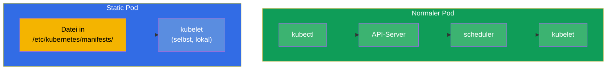
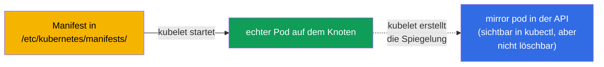
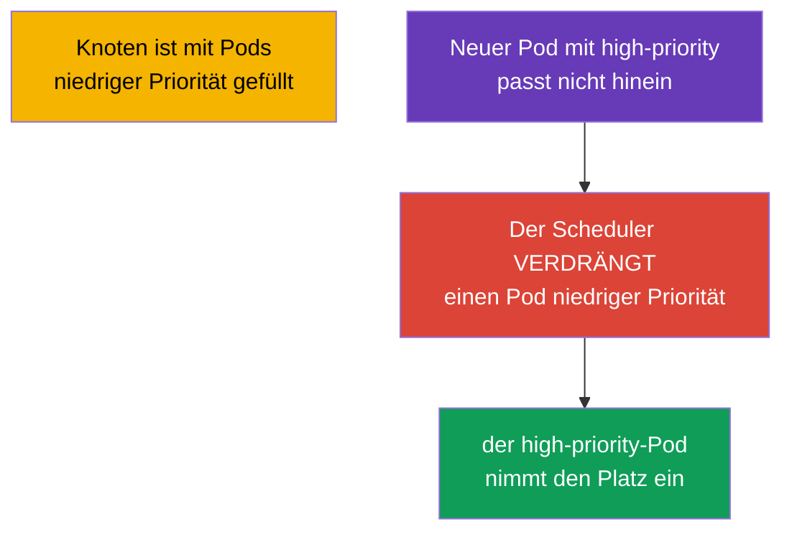
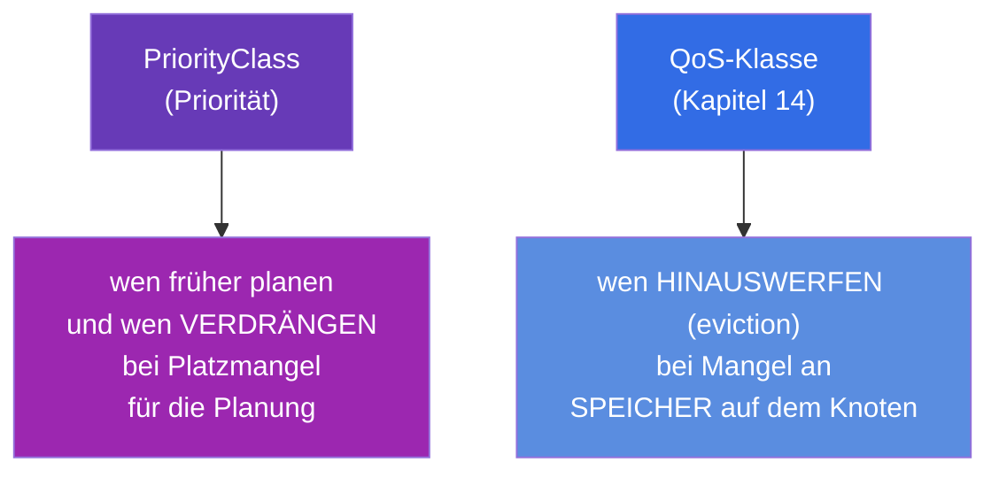
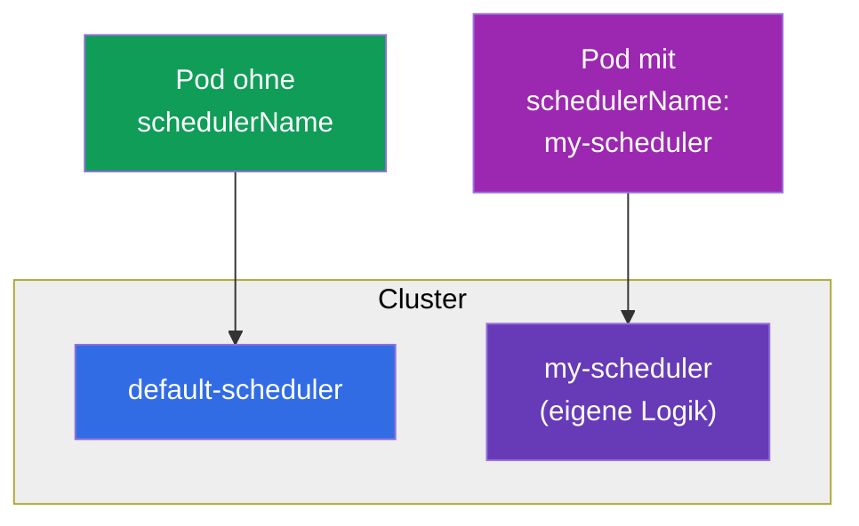

[Русская версия](ru.md) · [Eng version](README.md) · [Versión en español](es.md) · [Version française](fr.md) · [ქართული ვერსია](ge.md) · [繁體中文版](tw.md) · [日本語版](jp.md)

# Kapitel 15. Static Pods, PriorityClass und mehrere Scheduler

> **Was kommt.** Wir schließen den Block zur Planung mit drei Themen ab, die bei der CKA
> häufig vorkommen. **Static Pods** - Pods, die das kubelet direkt verwaltet, unter Umgehung
> der Control Plane (genau so werden die Komponenten der Control Plane selbst gestartet!).
> **PriorityClass** - Prioritäten von Pods und Verdrängung (preemption) bei
> Ressourcenmangel. **Mehrere Scheduler** - wie man einen eigenen Scheduler startet und
> nutzt. Die ersten zwei Themen sind wichtig sowohl für das Troubleshooting als auch für das
> Verständnis, wie der Cluster überhaupt aufgebaut ist.

## 15.1. Static Pods: Pods unter Verwaltung des kubelet

Ein normaler Pod geht durch den API-Server und den Scheduler (Kapitel 2). Ein **Static Pod**
ist die Ausnahme: ihn verwaltet **das kubelet eines konkreten Knotens direkt**, indem es das
Manifest aus einem lokalen Verzeichnis liest. Weder der API-Server noch der Scheduler sind
daran beteiligt.



Das kubelet beobachtet das Verzeichnis (üblicherweise `/etc/kubernetes/manifests/`, der Pfad
steht in seiner Konfiguration im Parameter `staticPodPath`). Legt man dort ein Pod-YAML ab -
startet das kubelet ihn. Ändert man die Datei - erstellt es ihn neu. Löscht man sie - stoppt
es ihn.

```bash
# Den Pfad zu den Manifesten der static pods herausfinden
grep staticPodPath /var/lib/kubelet/config.yaml
# üblicherweise: /etc/kubernetes/manifests
```

## 15.2. Mirror Pods und warum das für die CKA wichtig ist

Obwohl ein static pod unter Umgehung des API-Servers erstellt wird, erzeugt das kubelet für
ihn einen **Mirror Pod** in der API - damit Sie ihn über `kubectl get pods` sehen. Aber das
ist nur eine Spiegelung: einen static pod über `kubectl delete` zu löschen ist **nicht
möglich** - das kubelet erstellt ihn sofort aus der Datei neu. Einen static pod entfernt man
nur, indem man sein Manifest aus dem Verzeichnis nimmt.



**Das Wichtigste für die CKA:** genau so werden die Komponenten der Control Plane gestartet
(Kapitel 2) - kube-apiserver, etcd, scheduler, controller-manager. Ihre Manifeste liegen in
`/etc/kubernetes/manifests/` auf dem Control-Plane-Knoten, und man repariert sie, indem man
diese Dateien bearbeitet. Der Name eines static pod bekommt den Namen des Knotens als Suffix
(zum Beispiel `kube-apiserver-master1`). Das ist der Schlüssel zu den Aufgaben „repariere
eine Komponente der Control Plane“.

> **Und in managed Clustern (EKS/GKE/AKS)?** Dort werden Sie diese static pods nicht sehen -
> und zwar nicht, weil sie per Filter versteckt wären, sondern weil die Control Plane
> **außerhalb Ihres Clusters** ausgelagert ist. Der Provider startet apiserver, etcd,
> scheduler und controller-manager in seiner eigenen managed Infrastruktur (einem separaten
> Konto bei AWS/Google/Azure), auf deren Knoten Sie keinen Zugriff haben. Nach außen wird nur
> ein managed API-Endpoint gegeben. Deshalb sind in `kubectl get nodes` nur die Worker-Knoten
> sichtbar und in `kube-system` nur Komponenten auf Knotenebene und Addons (`kube-proxy`,
> `coredns`, CNI wie `aws-node`), aber nicht die Komponenten der Control Plane selbst. Diese
> betreut und aktualisiert der Provider, und die Logs sind nur mittelbar zugänglich (zum
> Beispiel Control-Plane-Logging in CloudWatch bei EKS). Der Weg „eine Komponente über das
> Manifest in `/etc/kubernetes/manifests/` reparieren“ funktioniert in self-managed Clustern
> (kubeadm) - in der CKA-Prüfung ist es genau so einer.

## 15.3. Wie man einen static pod erstellt

Einfach das Manifest des Pods in das passende Verzeichnis auf dem Knoten legen:

```bash
# auf dem Knoten
cat > /etc/kubernetes/manifests/my-static.yaml <<EOF
apiVersion: v1
kind: Pod
metadata:
  name: my-static
spec:
  containers:
  - name: nginx
    image: nginx
EOF
# das kubelet greift die Datei selbst auf, der Pod erscheint nach wenigen Sekunden
kubectl get pods -o wide       # wir sehen my-static-<name-des-knotens>
```

Static pods setzt man dort ein, wo ein Pod **vor und unabhängig von der Control Plane**
laufen muss - in erster Linie für die Control Plane selbst. Normale Anwendungen brauchen sie
nicht - für die gibt es DaemonSet/Deployment.

## 15.4. PriorityClass: Prioritäten von Pods

Wenn die Ressourcen nicht für alle reichen, wer ist dann wichtiger? **PriorityClass** legt
eine numerische Priorität von Pods fest. Höher priorisierte Pods werden früher geplant und
können bei Ressourcenmangel weniger priorisierte **verdrängen (preempt)**.

```yaml
apiVersion: scheduling.k8s.io/v1
kind: PriorityClass
metadata:
  name: high-priority
value: 1000000              # je größer, desto wichtiger
globalDefault: false
description: "Für kritische Dienste"
```

Verwendung im Pod:

```yaml
spec:
  priorityClassName: high-priority
```



Wie die Verdrängung (preemption) funktioniert: passt ein hochpriorisierter Pod nicht hinein,
findet der Scheduler auf einem geeigneten Knoten Pods mit geringerer Priorität und löscht
sie, um Platz zu schaffen. Die verdrängten Pods versuchen, auf andere Knoten umzuziehen.

Eingebaute Systemprioritäten, die Sie im Cluster sehen werden:

| PriorityClass | Wert | Wofür |
|---------------|----------|----------|
| `system-cluster-critical` | 2000000000 | kritische Komponenten des Clusters |
| `system-node-critical` | 2000001000 | Komponenten auf Knotenebene (die höchste) |

> **globalDefault.** Steht bei einer PriorityClass `globalDefault: true`, gilt sie für alle
> Pods ohne explizites `priorityClassName`. Standardmäßig ist die Priorität von Pods 0.

## 15.5. PriorityClass und QoS: nicht verwechseln

Zwei ähnliche Themen, aber über Verschiedenes:



- **PriorityClass** entscheidet die Frage der Planung: wen man früher setzt und wen man
  verdrängt, um einen wichtigen Pod zu platzieren.
- **QoS** (aus requests/limits) entscheidet die Frage des Überlebens bei Speichermangel auf
  einem schon laufenden Knoten: wen das kubelet als Ersten hinauswirft.

Beides dreht sich um „wer ist wichtiger“, aber in verschiedenen Phasen: die Priorität - bei
der Platzierung, QoS - bei der eviction.

### Fallbeispiel: hohe Priorität ≠ Schutz vor eviction

Um zu spüren, dass Priorität und QoS **unabhängig** sind, betrachten wir zwei Pods:

- **Pod A** - hohes `priorityClassName` (zum Beispiel `1000000`), aber **BestEffort**:
  requests/limits sind überhaupt nicht gesetzt.
- **Pod B** - niedrige Priorität (`0`, der Standard), aber **Guaranteed**: `requests == limits`
  bei CPU und Speicher.

Ihr Schicksal ist in zwei unterschiedlichen Situationen **entgegengesetzt**.

**Situation 1: es fehlt der Platz, um Pod A zu planen (preemption).** Hier arbeitet der
Scheduler und schaut **nur auf die Priorität** - QoS ist an der Wahl des Opfers überhaupt
nicht beteiligt. Pod A ist wichtiger, deshalb kann der Scheduler, wenn für ihn kein Platz
ist, den weniger priorisierten Pod B **verdrängen (preempt)** - selbst obwohl B garantiert
ist (Guaranteed QoS schützt nicht vor Verdrängung). B wird getötet und geht sich einen
anderen Knoten suchen, A wird platziert. Das heißt, in der Phase der Planung gewinnt die
hohe Priorität von A.

**Situation 2: auf dem Knoten geht physisch der Speicher aus (node-pressure eviction).** Nun
entscheidet **das kubelet**, und das Hauptkriterium ist der **Verbrauch relativ zu den
requests**, also QoS und nicht die Priorität. Das kubelet wirft zuerst diejenigen hinaus,
die über ihre requests hinaus fressen; BestEffort (requests = 0) landet sofort in dieser
Gruppe, und Guaranteed, das innerhalb seiner requests lebt, in der am besten geschützten.
Deshalb wird Pod A (BestEffort) **als Erster** hinausgeworfen, obwohl seine Priorität höher
ist, und Pod B (Guaranteed) übersteht es. Die Priorität wirkt hier nur als sekundäres
Kriterium - bei sonst gleichen Bedingungen innerhalb einer Gruppe.

Fazit: eine hohe PriorityClass hilft, **auf einen Knoten zu kommen und den Platz bei der
Planung zu halten**, aber sie **schützt nicht** vor eviction bei Speichermangel - dort
rettet Guaranteed QoS (`requests == limits`). Für einen wirklich kritischen Dienst braucht
man **beides**: hohe Priorität und Guaranteed.

### Fallbeispiel: zwei Pods mit gleicher Priorität und Guaranteed - wen tötet man zuerst?

Und wenn beide Pods „nach Rängen“ vollständig gleich sind - gleiches `priorityClassName` und
beide Guaranteed? Dann unterscheiden sie weder Priorität noch QoS-Gruppe, und es kommt das
dritte Kriterium der node-pressure eviction ins Spiel: der **Verbrauch relativ zu den
requests**. Das kubelet ordnet die Pods für die eviction nach der Kette „Überschreitung der
requests → Priority → wie weit der Verbrauch über den requests liegt“; sind die ersten zwei
gleich, entscheidet das Letzte - zuerst geht der, der **mehr relativ zu seinem request**
verbraucht (sinnbildlich „gefräßiger“ ist). Bei sonst gleichen Bedingungen stirbt also der
beim Speicher verfressenere Pod.

Wichtige Feinheiten speziell für Guaranteed:

- **Eigenes Limit - eigener Tod.** Bei Guaranteed ist `requests == limits`. Stößt der
  Container selbst an sein Speicher-Limit, tötet ihn der OOM-Killer **individuell**
  (`OOMKilled`), unabhängig vom Nachbar-Pod - das ist keine „Wahl zwischen zwei“, sondern
  das Überschreiten der eigenen Obergrenze.
- **Node-pressure ist der Extremfall.** Guaranteed-Pods wirft man zuletzt hinaus und
  üblicherweise nur dann, wenn der Speicher schon den Systemdaemons des Knotens (kubelet,
  Container-Runtime) fehlt, und nicht wegen der Nachbarn. Auf Kernel-Ebene orientiert sich
  der OOM-Killer bei Speichererschöpfung am `oom_score` (bei Guaranteed ist er der am besten
  „geschützte“), und innerhalb einer Klasse tötet er den Prozess, der mehr Speicher
  verbraucht.

Praktisches Fazit: sind die formalen Merkmale gleich, wird der reale Verbrauch zur
„Sicherung“ - deshalb ist es auch bei kritischen Guaranteed-Pods wichtig, die requests nah
an der realen Spitze zu setzen und nicht „auf Vorrat“.

## 15.6. Mehrere Scheduler

Standardmäßig verteilt der `default-scheduler` die Pods. Man kann aber einen **eigenen**
Scheduler starten (mit eigener Logik der Knotenauswahl) und dem Pod angeben, mit welchem
Scheduler er platziert werden soll.

```yaml
spec:
  schedulerName: my-scheduler    # diesen Pod verteilt der eigene Scheduler
```



Gibt ein Pod einen nicht existierenden `schedulerName` an, bleibt er für immer in `Pending` -
niemand nimmt ihn auf. Das ist eine weitere mögliche Ursache für Pending beim Debuggen.

Es gibt zwei Wege, ein „anderes“ Planungsverhalten zu erhalten, und die Wahl zwischen ihnen
ist vor allem eine Frage des Aufwands.

### Variante 1 (leicht): Scheduler Profiles im regulären Scheduler

In den meisten Fällen braucht man kein separates Binary - es genügen **Scheduler-Profile**.
Ein und derselbe `kube-scheduler` kann mehrere **Profile** halten, jedes mit eigenem
`schedulerName` und eigenem Satz aktivierter/deaktivierter Plugins und deren Gewichte. Der
Pod wählt das Profil über dasselbe Feld `spec.schedulerName`.

Die Profile werden in der `KubeSchedulerConfiguration` definiert (der Datei, die der
kube-scheduler liest):

```yaml
apiVersion: kubescheduler.config.k8s.io/v1
kind: KubeSchedulerConfiguration
profiles:
  - schedulerName: default-scheduler        # normales Verhalten
  - schedulerName: bin-packing              # eigener Name — den geben die Pods an
    pluginConfig:
      - name: NodeResourcesFit
        args:
          scoringStrategy:
            type: MostAllocated              # dichte Packung statt gleichmäßiger
```

Hier lässt `MostAllocated` das Profil `bin-packing` die Knoten dichter füllen (Einsparung
bei der Anzahl der Knoten), während das reguläre `LeastAllocated` die Pods gleichmäßig
verteilt. Dem Pod genügt es, `schedulerName: bin-packing` anzugeben - und ihn platziert
dieses Profil, alles Übrige läuft weiter wie gewohnt. Ein Prozess, kein zusätzliches
Deployment.

**Wie man das schrittweise anwendet** (self-managed / kubeadm, wo `kube-scheduler` ein
static pod auf der Control Plane ist):

1. **Die Konfigurationsdatei erstellen** auf dem Control-Plane-Knoten, zum Beispiel
   `/etc/kubernetes/sched-config.yaml`, mit `KubeSchedulerConfiguration` (wie oben) und der
   Angabe des kubeconfig des Schedulers:

   ```yaml
   apiVersion: kubescheduler.config.k8s.io/v1
   kind: KubeSchedulerConfiguration
   clientConnection:
     kubeconfig: /etc/kubernetes/scheduler.conf   # kubeconfig des Schedulers selbst
   profiles:
     - schedulerName: default-scheduler
     - schedulerName: bin-packing
       pluginConfig:
         - name: NodeResourcesFit
           args:
             scoringStrategy:
               type: MostAllocated
   ```

2. **Die Datei dem Scheduler übergeben** über das Flag `--config`. Wir bearbeiten das
   Manifest des static pod `/etc/kubernetes/manifests/kube-scheduler.yaml`: wir fügen das
   Argument hinzu und mounten die Datei vom Host in den Pod:

   ```yaml
   spec:
     containers:
     - command:
       - kube-scheduler
       - --config=/etc/kubernetes/sched-config.yaml   # + konfliktierende alte Flags entfernen
       volumeMounts:
       - name: sched-config
         mountPath: /etc/kubernetes/sched-config.yaml
         readOnly: true
     volumes:
     - name: sched-config
       hostPath:
         path: /etc/kubernetes/sched-config.yaml
         type: File
   ```

3. **Das kubelet startet** den Pod des Schedulers **selbst neu** (es ist ein static pod - er
   reagiert auf die Änderung des Manifests). Wir prüfen, dass er ohne Fehler hochgekommen
   ist:

   ```bash
   kubectl -n kube-system get pod -l component=kube-scheduler
   kubectl -n kube-system logs kube-scheduler-<node>    # wir suchen "profiles" und die Abwesenheit von Konfigfehlern
   ```

4. **Die Arbeit des Profils prüfen:** wir erstellen einen Pod mit `schedulerName: bin-packing`
   und schauen, dass er in `Running` gegangen ist und in den Events genau dieses Profil
   zugewiesen hat:

   ```bash
   kubectl run t --image=nginx --overrides='{"spec":{"schedulerName":"bin-packing"}}'
   kubectl get event --field-selector involvedObject.name=t | grep -i scheduled
   ```

> In **managed** Clustern (EKS/GKE/AKS) sind Änderungen an der Konfiguration des Schedulers
> nicht verfügbar - die Control Plane ist geschlossen (siehe den Einschub in 15.2). Dort
> macht man eigene Planung nur über einen eigenen, im Cluster ausgerollten Scheduler
> (Variante 2).

**Was man in Profilen noch festlegen kann.** Ein Profil ist nicht nur `schedulerName`; über
es konfiguriert man das Planungsverhalten selbst:

- **Plugins nach Phasen ein-/ausschalten (extension points).** Die Planung hat Phasen:
  `queueSort`, `preFilter`, `filter`, `postFilter`, `preScore`, `score`, `reserve`,
  `permit`, `preBind`, `bind`, `postBind`. Im Block `plugins` kann man für jede Phase in
  `enabled`/`disabled` Plugins auflisten (zum Beispiel `PodTopologySpread` in der Phase
  score in einem Profil abschalten).
- **Gewichte der score-Plugins.** Die Plugins der Phase `score` haben ein `weight` - indem
  man sie ändert, schneidet man die Endbewertung der Knoten neu zu (zum Beispiel
  `ImageLocality` verstärken, damit ein Pod häufiger dorthin gesetzt wird, wo das Image
  schon heruntergeladen ist).
- **Argumente der Plugins (`pluginConfig`).** Die Feinabstimmung konkreter Plugins:
  - `NodeResourcesFit` - die Scoring-Strategie (`LeastAllocated`/`MostAllocated`/
    `RequestedToCapacityRatio`) und die Gewichte der Ressourcen;
  - `PodTopologySpread` - `defaultConstraints` (Standardwerte der Verteilung nach Topologie);
  - `InterPodAffinity` - `hardPodAffinityWeight`;
  - `NodeAffinity` - `addedAffinity` (allen Pods des Profils eine Affinity-Regel hinzufügen);
  - `DefaultPreemptionArgs`, `VolumeBinding` u. a.
- **Mehrere Profile gleichzeitig** - jedes mit eigenem `schedulerName` und eigenem Satz von
  Plugins/Gewichten; die Pods wählen das passende über das Feld `schedulerName`.
  Einschränkung: das Plugin `queueSort` muss in allen Profilen dasselbe sein.
- **Globale Parameter des Schedulers** (werden in derselben Datei gesetzt, nicht innerhalb
  eines Profils): `percentageOfNodesToScore` (wie viele Knoten bewertet werden - ein
  Kompromiss zwischen Geschwindigkeit und Qualität in großen Clustern), `parallelism`,
  `podMaxBackoffSeconds` und so weiter.

### Variante 2 (schwer): ein eigener Scheduler als separater Prozess

Braucht man eine Logik, die man mit Plugins nicht ausdrücken kann, startet man einen
**zweiten Scheduler** - als normales Deployment in `kube-system`. Er braucht einen eigenen
ServiceAccount und RBAC (Zugriff auf Knoten, Pods, Events, Leases für die Leader Election).
Schematisch:

```yaml
apiVersion: apps/v1
kind: Deployment
metadata:
  name: my-scheduler
  namespace: kube-system
spec:
  replicas: 1
  selector:
    matchLabels: {app: my-scheduler}
  template:
    metadata:
      labels: {app: my-scheduler}
    spec:
      serviceAccountName: my-scheduler        # + ClusterRole/ClusterRoleBinding mit den nötigen Rechten
      containers:
      - name: kube-scheduler
        image: registry.k8s.io/kube-scheduler:v1.34.0   # oder ein eigenes Binary mit eigenen Plugins
        command:
        - kube-scheduler
        - --config=/etc/kubernetes/my-scheduler-config.yaml   # hier steht der eigene schedulerName
        # ...es wird eine ConfigMap mit KubeSchedulerConfiguration gemountet
```

Danach verteilt genau er die Pods mit `spec.schedulerName: my-scheduler`. Beide Scheduler
arbeiten parallel; die Hauptsache ist, dass sie sich nicht um dieselben Pods „streiten“
(jeder nimmt nur die seinen nach `schedulerName`).

### Wann man das wirklich braucht

In der Praxis ist ein zweiter Scheduler eine Seltenheit; häufiger genügen Profile oder das
gewöhnliche affinity/taints/topologySpread (Kapitel 12-13). Echte Anlässe:

- **Batch/ML und gang scheduling.** Aufgaben, bei denen ein Satz von Pods „alles oder
  nichts“ starten muss (verteiltes Training, Spark/MPI), brauchen co-scheduling - das geben
  Volcano, Apache YuniKorn, das coscheduling-Plugin. Der reguläre Scheduler platziert die
  Pods einzeln und kann zu einem Deadlock aus halb gestarteten Aufgaben führen.
- **Dichte Packung um zu sparen.** Bin-packing (`MostAllocated`) verdichtet die Knoten,
  damit der Autoscaler die überflüssigen abschalten kann - direkte Einsparung. Das ist
  genau der Fall für ein Profil und nicht für ein Binary.
- **Spezielle Hardware und Topologie.** Berücksichtigung von NUMA, GPU-Topologie,
  Netzwerknähe, Latenzanforderungen - wenn die Standard-Plugins nicht ausreichen.
- **Mehrmandantenfähigkeit und faire Aufteilung.** Quoten und Warteschlangen zwischen Teams
  mit eigener Fairness-Politik (YuniKorn, Volcano queues).
- **Eigene Domänenlogik.** Platzierungsregeln, die man mit den vorhandenen Labels und
  Prädikaten nicht ausdrücken kann.

Praktische Regel: zuerst versucht man die Aufgabe mit einem Profil oder mit affinity zu
lösen; einen separaten Scheduler nimmt man nur, wenn eine prinzipiell andere Logik nötig ist
(in erster Linie gang scheduling für Batch/ML). Für die Prüfung genügt es zu wissen: das
Planungsverhalten ändert man über Profile oder einen eigenen Scheduler, und den Pod bindet
man über das Feld `schedulerName` an ihn.

## 15.7. Wie man das in der Produktion anwendet

- **Static pods - nur für die Control Plane.** In der Produktion sind static pods der Weg,
  mit dem kubeadm die Komponenten der Control Plane hochzieht und hält, bis eine
  funktionierende API existiert. Für Anwendungslasten nutzt man sie nicht - dort gibt es
  DaemonSet/Deployment. Das Wissen, dass „Control Plane = static pods in
  `/etc/kubernetes/manifests/`“, ist die Grundlage ihrer Betreuung und Reparatur.
- **PriorityClass zum Schutz kritischer Dienste.** In der Produktion gibt man kritischen
  Komponenten (Monitoring, Ingress, Systemdienste) eine hohe Priorität, damit bei
  Ressourcenmangel weniger wichtige Hintergrundaufgaben verdrängt werden und nicht sie.
  Batch-Lasten bekommen umgekehrt eine niedrige Priorität - die verdrängt man ohne Bedauern.
- **Vorsicht mit preemption.** Unbedacht hohe Priorität bei vielen Pods führt zu einem
  „Verdrängungskrieg“ und Instabilität. Prioritäten denkt man auf der Ebene des ganzen
  Clusters durch.
- **Eigene Scheduler sind eine Seltenheit.** Einen eigenen Scheduler schreibt man in
  spezifischen Fällen (zum Beispiel HPC, besondere Platzierungsregeln). Häufiger genügt
  affinity/taints/topologySpread aus den Kapiteln 12-13. Aber von `schedulerName` zu wissen
  ist nützlich: ein falscher Wert ist die Ursache für ein ewiges Pending.

## 15.8. Mini-Glossar

- **Static Pod** - ein Pod, den das kubelet direkt aus einem lokalen Manifest verwaltet,
  unter Umgehung von API-Server und Scheduler.
- **staticPodPath** - das Verzeichnis, das das kubelet beobachtet (üblicherweise `/etc/kubernetes/manifests/`).
- **Mirror Pod (Spiegel-Pod)** - die Spiegelung eines static pod in der API; sichtbar, aber
  nicht über kubectl löschbar.
- **PriorityClass** - ein Objekt mit einer numerischen Priorität von Pods.
- **Preemption (Verdrängung)** - das Löschen weniger priorisierter Pods zugunsten der
  Platzierung eines höher priorisierten.
- **globalDefault** - eine PriorityClass, die für Pods ohne explizite Priorität gilt.
- **schedulerName** - welcher Scheduler den Pod verteilt.
- **Scheduler Profiles** - mehrere Konfigurationen innerhalb eines Schedulers.

## 15.9. Zusammenfassung des Kapitels

- Ein Static Pod wird vom kubelet direkt aus dem Verzeichnis `/etc/kubernetes/manifests/`
  verwaltet, unter Umgehung von API-Server und Scheduler; man ändert ihn über die Datei.
- Für einen static pod wird ein Mirror Pod in der API erstellt (sichtbar in kubectl), aber
  über kubectl löschen kann man ihn nicht - nur indem man das Manifest entfernt.
- Die Komponenten der Control Plane (apiserver, etcd, scheduler, controller-manager) sind
  static pods; daraus ergibt sich der Weg, sie zu reparieren.
- PriorityClass legt eine numerische Priorität fest; hochpriorisierte Pods werden früher
  geplant und können bei Platzmangel weniger priorisierte verdrängen (preempt).
- PriorityClass (Planung/Verdrängung) und QoS (eviction bei Speichermangel) betreffen
  verschiedene Phasen, nicht verwechseln.
- Man kann mehrere Scheduler starten und sie über `schedulerName` auswählen; ein falscher
  Name = ewiges Pending.

## 15.10. Wofür das nützlich ist: in der Prüfung und in der echten Arbeit

**In der Prüfung.** „Erstelle einen static pod auf dem Knoten“, „repariere eine Komponente
der Control Plane“ (über das Manifest in `/etc/kubernetes/manifests/`), „erstelle eine
PriorityClass und weise sie einem Pod zu“ - typische CKA-Aufgaben. Das Verständnis von
static pods wird direkt für die Domäne Troubleshooting gebraucht. Ein `schedulerName` mit
einem nicht existierenden Scheduler ist eine der Ursachen für Pending.

**In der echten Arbeit.** Static pods sind die Art, wie die Control Plane physisch lebt, und
dieses Wissen ist die Grundlage ihrer Betreuung. PriorityClass schützt kritische Dienste vor
der Verdrängung bei Ressourcenmangel und bestimmt, was man opfern kann. Das beeinflusst die
Stabilität des ganzen Clusters unter Last.

## 15.11. Fragen zur Selbstüberprüfung

1. Worin unterscheidet sich ein static pod von einem normalen Pod nach dem Weg der Erstellung?
2. Warum kann man einen static pod nicht über `kubectl delete` löschen und wie entfernt man ihn?
3. Wie hängen static pods und die Komponenten der Control Plane zusammen? Wo liegen ihre Manifeste?
4. Was macht PriorityClass und wie funktioniert die Verdrängung (preemption)?
5. Worin unterscheidet sich PriorityClass von der QoS-Klasse nach dem Zweck?
6. Wie lenkt man einen Pod auf einen konkreten Scheduler und was passiert bei einem falschen `schedulerName`?
7. Was bedeutet `globalDefault: true` bei einer PriorityClass?

## Praxis

Wir haben die Planung abgeschlossen. In Kapitel 16 kommt das letzte Thema von Teil 2: das
Autoscaling von Lasten (HPA), bei dem sich die Replikas eines Deployment automatisch nach
der Last ändern. Static pods und PriorityClass werden in den Labs zu Cluster und Planung
geübt.

🧪 Lab 117 (u. a. Debugging von static pods): [tasks/cka/labs/117](../../labs/117/README_DE.MD)

🧪 Lab 122 (u. a. Drill zu PriorityClass): [tasks/cka/labs/122](../../labs/122/README_DE.MD)

🎮 Killercoda (im Browser, ohne Installation): [Priority Class](https://killercoda.com/chadmcrowell/course/cka/priority-class)

---
[Inhalt](../README_DE.md) · [Kapitel 14](../14/de.md) · [Kapitel 16](../16/de.md)
