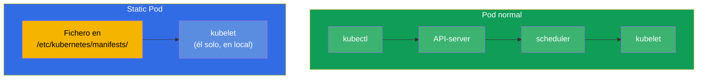
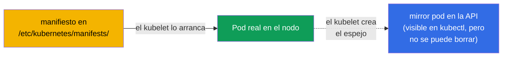
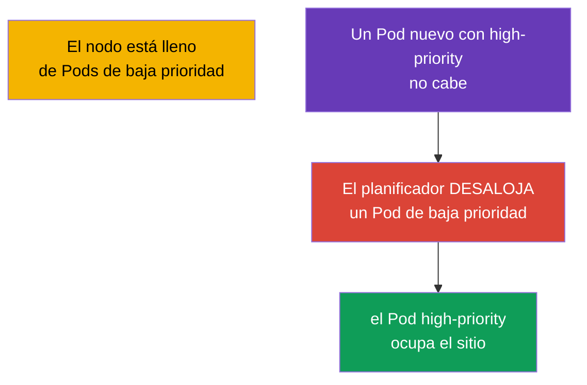
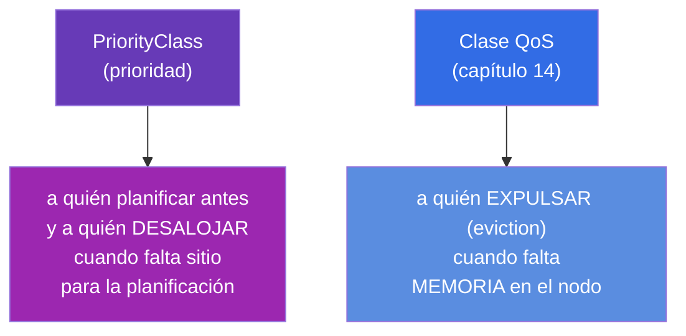
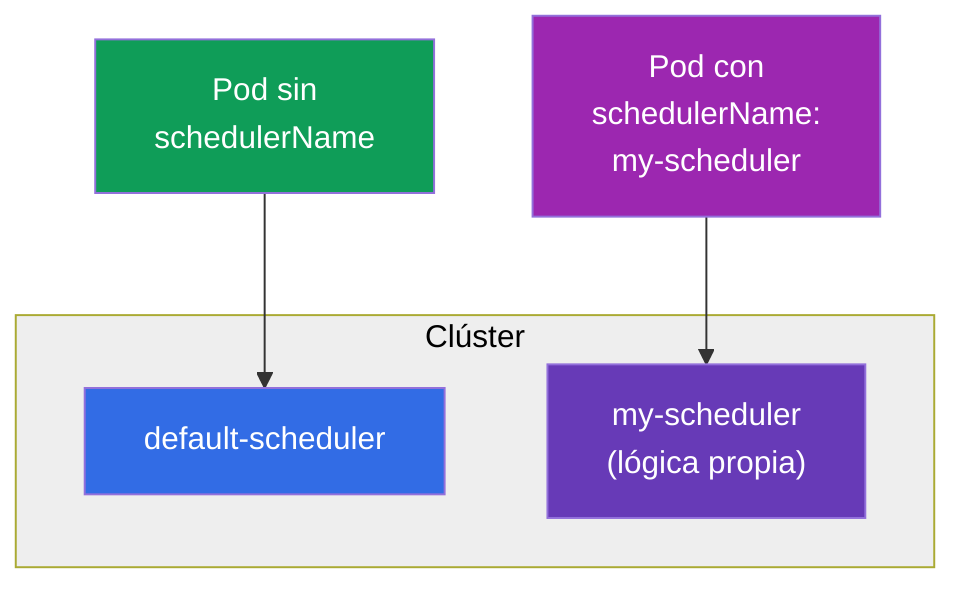

[Русская версия](ru.md) · [Eng version](README.md) · [Version française](fr.md) · [Deutsche Version](de.md) · [ქართული ვერსია](ge.md) · [繁體中文版](tw.md) · [日本語版](jp.md)

# Capítulo 15. Static Pods, PriorityClass y varios planificadores

> **Qué viene ahora.** Cerramos el bloque de planificación con tres temas que aparecen a menudo
> en el CKA. **Static Pods** - Pods gestionados por el kubelet directamente, sin pasar por el control
> plane (¡así es exactamente como arrancan los componentes del propio control plane!). **PriorityClass** -
> prioridades de los Pods y desalojo por prioridad (preemption) cuando faltan recursos. **Varios
> planificadores** - cómo arrancar y usar un planificador propio. Los dos primeros temas son importantes
> tanto para el troubleshooting como para entender cómo está montado el clúster.

## 15.1. Static Pods: Pods bajo el mando del kubelet

Un Pod normal pasa por el API-server y el planificador (capítulo 2). El **Static Pod** es la excepción:
lo gestiona **el kubelet de un nodo concreto de forma directa**, leyendo el manifiesto de una carpeta
local. Ni el API-server ni el planificador participan en ello.



El kubelet vigila la carpeta (normalmente `/etc/kubernetes/manifests/`, ruta fijada en su configuración
con el parámetro `staticPodPath`). Si dejas allí un YAML de Pod, el kubelet lo arranca. Si cambias el
fichero, lo recrea. Si lo borras, lo detiene.

```bash
# Averiguar la ruta de los manifiestos de static pod
grep staticPodPath /var/lib/kubelet/config.yaml
# normalmente: /etc/kubernetes/manifests
```

## 15.2. Mirror Pods y por qué esto importa para el CKA

Aunque el static pod se cree sin pasar por el API-server, el kubelet crea para él un **Pod espejo
(mirror pod)** en la API, para que puedas verlo con `kubectl get pods`. Pero es solo un reflejo:
borrar un static pod con `kubectl delete` **no se puede** - el kubelet lo recreará al instante desde
el fichero. Un static pod solo se quita retirando su manifiesto de la carpeta.



**Lo principal para el CKA:** así es exactamente como arrancan los componentes del control plane
(capítulo 2) - kube-apiserver, etcd, scheduler, controller-manager. Sus manifiestos están en
`/etc/kubernetes/manifests/` en el nodo del control plane, y se arreglan editando esos ficheros. El
nombre del static pod recibe el sufijo del nombre del nodo (por ejemplo, `kube-apiserver-master1`).
Esa es la clave de las tareas del tipo «arregla el componente del control plane».

> **¿Y en los clústeres gestionados (EKS/GKE/AKS)?** Allí no verás esos static pods, y no porque los
> hayan escondido con un filtro, sino porque el control plane está **fuera de tu clúster**. El
> proveedor arranca apiserver, etcd, scheduler y controller-manager en su propia infraestructura
> gestionada (una cuenta aparte de AWS/Google/Azure) a cuyos nodos no tienes acceso. Hacia fuera solo
> se expone un endpoint de API gestionado. Por eso en `kubectl get nodes` solo se ven los nodos worker,
> y en `kube-system` solo los componentes de nivel de nodo y los add-ons (`kube-proxy`, `coredns`, CNI
> como `aws-node`), pero no los componentes del control plane en sí. El proveedor los mantiene y
> actualiza, y los logs están disponibles solo de forma indirecta (por ejemplo, el control plane
> logging en CloudWatch en EKS). La vía de «arreglar un componente mediante el manifiesto en
> `/etc/kubernetes/manifests/`» funciona en clústeres self-managed (kubeadm) - y en el examen CKA es
> justo así.

## 15.3. Cómo crear un static pod

Basta con dejar el manifiesto del Pod en la carpeta adecuada del nodo:

```bash
# en el nodo
cat > /etc/kubernetes/manifests/my-static.yaml <<EOF
apiVersion: v1
kind: Pod
metadata:
  name: my-static
spec:
  containers:
  - name: nginx
    image: nginx
EOF
# el kubelet recogerá el fichero por su cuenta, el Pod aparecerá en unos segundos
kubectl get pods -o wide       # veremos my-static-<nombre-del-nodo>
```

Los static pods se usan donde el Pod debe funcionar **antes que el control plane y de forma
independiente de él** - en primer lugar, para el propio control plane. Las aplicaciones normales no los
necesitan: para ellas están DaemonSet/Deployment.

## 15.4. PriorityClass: prioridades de los Pods

Cuando no hay recursos para todos, ¿quién es más importante? **PriorityClass** define una prioridad
numérica de los Pods. Los Pods más prioritarios se planifican antes y, cuando faltan recursos, pueden
**desalojar (preempt)** a los menos prioritarios.

```yaml
apiVersion: scheduling.k8s.io/v1
kind: PriorityClass
metadata:
  name: high-priority
value: 1000000              # cuanto más grande, más importante
globalDefault: false
description: "Para servicios críticos"
```

Uso en el Pod:

```yaml
spec:
  priorityClassName: high-priority
```



Cómo funciona el desalojo por prioridad (preemption): si un Pod de alta prioridad no cabe, el
planificador encuentra en un nodo adecuado Pods con menor prioridad y los borra, liberando sitio. Los
Pods desalojados intentan mudarse a otros nodos.

Prioridades del sistema integradas que verás en el clúster:

| PriorityClass | Valor | Para qué |
|---------------|----------|----------|
| `system-cluster-critical` | 2000000000 | componentes críticos del clúster |
| `system-node-critical` | 2000001000 | componentes de nivel de nodo (la más alta) |

> **globalDefault.** Si una PriorityClass tiene `globalDefault: true`, se aplica a todos los Pods sin
> `priorityClassName` explícito. Por defecto, la prioridad de los Pods es 0.

## 15.5. PriorityClass y QoS: no confundirlos

Dos temas parecidos, pero de cosas distintas:



- **PriorityClass** resuelve la cuestión de la planificación: a quién colocar antes y a quién desalojar
  para poder ubicar un Pod importante.
- **QoS** (a partir de requests/limits) resuelve la cuestión de la supervivencia cuando falta memoria en
  un nodo que ya está funcionando: a quién expulsará el kubelet primero.

Ambos van de «quién es más importante», pero en etapas distintas: la prioridad, en la colocación; la
QoS, en el eviction.

### Caso: alta prioridad ≠ protección frente a la expulsión

Para captar que la prioridad y la QoS son **independientes**, veamos dos Pods:

- **Pod A** - `priorityClassName` alto (por ejemplo, `1000000`), pero **BestEffort**:
  no tiene requests/limits definidos en absoluto.
- **Pod B** - prioridad baja (`0`, por defecto), pero **Guaranteed**: `requests == limits`
  en CPU y memoria.

Su destino en dos situaciones distintas es **opuesto**.

**Situación 1: no hay sitio para planificar el Pod A (preemption).** Aquí actúa el planificador y mira
**solo la prioridad** - la QoS no participa en absoluto en la elección de la víctima. El Pod A es más
importante, así que, si no hay sitio para él, el planificador puede **desalojar (preempt)** al Pod B,
menos prioritario, incluso a pesar de que B sea garantizado (la QoS Guaranteed no protege del
desalojo). B será eliminado y se irá a buscar otro nodo, y A quedará colocado. Es decir, en la etapa de
planificación gana la alta prioridad de A.

**Situación 2: en el nodo se agota físicamente la memoria (node-pressure eviction).** Ahora decide el
**kubelet**, y el criterio principal es el **consumo relativo a los requests**, es decir, la QoS y no la
prioridad. El kubelet echa primero a quienes comen por encima de sus requests; BestEffort
(requests = 0) entra inmediatamente en ese grupo, y Guaranteed, que vive dentro de sus requests, en el
más protegido. Por eso el Pod A (BestEffort) será expulsado **primero**, aunque su prioridad sea mayor,
y el Pod B (Guaranteed) sobrevivirá. Aquí la prioridad funciona solo como criterio secundario: en
igualdad de condiciones dentro de un mismo grupo.

Conclusión: una PriorityClass alta ayuda a **entrar en el nodo y mantener el sitio durante la
planificación**, pero **no protege** de la expulsión cuando falta memoria - allí lo que salva es la QoS
Guaranteed (`requests == limits`). Para un servicio realmente crítico hacen falta **las dos cosas**:
prioridad alta y Guaranteed.

### Caso: dos Pods con la misma prioridad y Guaranteed - ¿a quién matan primero?

¿Y si los dos Pods son completamente iguales «de rango»: el mismo `priorityClassName` y ambos
Guaranteed? Entonces ni la prioridad ni el grupo de QoS los distinguen, y entra en juego el tercer
criterio del node-pressure eviction: el **consumo relativo a los requests**. El kubelet ordena los Pods
para la expulsión según la cadena «exceso sobre los requests → Priority → cuánto supera el consumo a
los requests»; si los dos primeros son iguales, decide el último: se irá primero el que consuma **más
en relación con su request** (digamos, el «más glotón»). Así que, en igualdad de condiciones, muere el
Pod más voraz en memoria.

Matices importantes precisamente para Guaranteed:

- **Tu límite, tu muerte.** En Guaranteed, `requests == limits`. Si el contenedor choca por sí mismo
  con su límite de memoria, lo mata el OOM-killer **de forma individual** (`OOMKilled`),
  independientemente del Pod vecino: no es una «elección entre dos», sino superar su propio techo.
- **La node-pressure es el caso extremo.** Los Pods Guaranteed se expulsan en último lugar y
  normalmente solo cuando la memoria ya no llega ni para los demonios del sistema del nodo (kubelet,
  entorno de ejecución), no por culpa de los vecinos. A nivel de kernel, al agotarse la memoria el
  OOM-killer se guía por `oom_score` (en Guaranteed es el más «protegido»), y dentro de una misma clase
  mata al proceso que consume más memoria.

Conclusión práctica: cuando los indicadores formales son iguales, el «fusible» pasa a ser el consumo
real, por eso incluso a los Pods Guaranteed críticos conviene ponerles requests cercanos al pico real,
y no «por si acaso».

## 15.6. Varios planificadores

Por defecto, los Pods los reparte el `default-scheduler`. Pero se puede arrancar un planificador
**propio** (con su lógica de elección de nodos) e indicarle al Pod con qué planificador colocarlo.

```yaml
spec:
  schedulerName: my-scheduler    # este Pod lo repartirá el planificador personalizado
```



Si un Pod indica un `schedulerName` que no existe, se quedará para siempre en `Pending`: nadie lo
recogerá. Es otra posible causa de Pending al depurar.

Hay dos formas de obtener un comportamiento de planificación «diferente», y es importante elegir entre
ellas según el esfuerzo que suponen.

### Opción 1 (la ligera): Scheduler Profiles en el planificador estándar

En la mayoría de los casos no hace falta un binario aparte: bastan los **perfiles del planificador**.
Un mismo `kube-scheduler` puede mantener varios **perfiles**, cada uno con su `schedulerName` y su
conjunto de plugins activados/desactivados y sus pesos. El Pod elige el perfil con el mismo campo
`spec.schedulerName`.

Los perfiles se definen en `KubeSchedulerConfiguration` (el fichero que lee kube-scheduler):

```yaml
apiVersion: kubescheduler.config.k8s.io/v1
kind: KubeSchedulerConfiguration
profiles:
  - schedulerName: default-scheduler        # comportamiento normal
  - schedulerName: bin-packing              # nombre propio — es el que indicarán los Pods
    pluginConfig:
      - name: NodeResourcesFit
        args:
          scoringStrategy:
            type: MostAllocated              # empaquetado denso en lugar de reparto uniforme
```

Aquí `MostAllocated` hace que el perfil `bin-packing` rellene los nodos más densamente (ahorro en el
número de nodos), mientras que el `LeastAllocated` estándar reparte los Pods de forma uniforme. Al Pod
le basta con indicar `schedulerName: bin-packing` y lo colocará ese perfil, mientras todo lo demás sigue
funcionando como siempre. Un solo proceso, sin ningún despliegue adicional.

**Cómo aplicarlo paso a paso** (self-managed / kubeadm, donde `kube-scheduler` es un static pod en el
control plane):

1. **Crear el fichero de configuración** en el nodo del control plane, por ejemplo
   `/etc/kubernetes/sched-config.yaml`, con `KubeSchedulerConfiguration` (como arriba) e indicando el
   kubeconfig del planificador:

   ```yaml
   apiVersion: kubescheduler.config.k8s.io/v1
   kind: KubeSchedulerConfiguration
   clientConnection:
     kubeconfig: /etc/kubernetes/scheduler.conf   # kubeconfig del propio planificador
   profiles:
     - schedulerName: default-scheduler
     - schedulerName: bin-packing
       pluginConfig:
         - name: NodeResourcesFit
           args:
             scoringStrategy:
               type: MostAllocated
   ```

2. **Pasar el fichero al planificador** mediante el flag `--config`. Editamos el manifiesto del static
   pod `/etc/kubernetes/manifests/kube-scheduler.yaml`: añadimos el argumento y montamos el fichero
   del host dentro del Pod:

   ```yaml
   spec:
     containers:
     - command:
       - kube-scheduler
       - --config=/etc/kubernetes/sched-config.yaml   # + quitar los flags antiguos que entren en conflicto
       volumeMounts:
       - name: sched-config
         mountPath: /etc/kubernetes/sched-config.yaml
         readOnly: true
     volumes:
     - name: sched-config
       hostPath:
         path: /etc/kubernetes/sched-config.yaml
         type: File
   ```

3. **El kubelet reiniciará por sí mismo** el Pod del planificador (es un static pod: reacciona a la
   edición del manifiesto). Comprobamos que ha arrancado sin errores:

   ```bash
   kubectl -n kube-system get pod -l component=kube-scheduler
   kubectl -n kube-system logs kube-scheduler-<node>    # buscamos "profiles" y la ausencia de errores de configuración
   ```

4. **Comprobar el funcionamiento del perfil:** creamos un Pod con `schedulerName: bin-packing` y vemos
   que ha pasado a `Running` y que en los eventos lo ha asignado precisamente ese perfil:

   ```bash
   kubectl run t --image=nginx --overrides='{"spec":{"schedulerName":"bin-packing"}}'
   kubectl get event --field-selector involvedObject.name=t | grep -i scheduled
   ```

> En los clústeres **gestionados** (EKS/GKE/AKS) las modificaciones de la configuración del planificador
> no están disponibles: el control plane está cerrado (véase el recuadro de 15.2). Allí la planificación
> personalizada solo se hace mediante un planificador propio desplegado en el clúster (Opción 2).

**Qué más se puede definir en los perfiles.** Un perfil no es solo `schedulerName`; a través de él se
configura el propio comportamiento de la planificación:

- **Activar/desactivar plugins por fases (extension points).** La planificación tiene etapas:
  `queueSort`, `preFilter`, `filter`, `postFilter`, `preScore`, `score`, `reserve`,
  `permit`, `preBind`, `bind`, `postBind`. En el bloque `plugins`, para cada etapa se pueden enumerar
  plugins en `enabled`/`disabled` (por ejemplo, desactivar `PodTopologySpread` en
  la etapa score de un perfil).
- **Pesos de los plugins de score.** Los plugins de la fase `score` tienen `weight`; cambiándolos se
  reconfigura la puntuación final de los nodos (por ejemplo, reforzar `ImageLocality` para colocar el
  Pod más a menudo donde la imagen ya está descargada).
- **Argumentos de los plugins (`pluginConfig`).** Ajuste fino de plugins concretos:
  - `NodeResourcesFit` - estrategia de scoring (`LeastAllocated`/`MostAllocated`/
    `RequestedToCapacityRatio`) y pesos de los recursos;
  - `PodTopologySpread` - `defaultConstraints` (valores por defecto del reparto por topología);
  - `InterPodAffinity` - `hardPodAffinityWeight`;
  - `NodeAffinity` - `addedAffinity` (añadir a todos los Pods del perfil una regla de affinity);
  - `DefaultPreemptionArgs`, `VolumeBinding` y otros.
- **Varios perfiles a la vez** - cada uno con su `schedulerName` y su conjunto de plugins/pesos; los
  Pods eligen el que necesitan con el campo `schedulerName`. Limitación: el plugin
  `queueSort` debe ser el mismo en todos los perfiles.
- **Parámetros globales del planificador** (se definen en el mismo fichero, no dentro del perfil):
  `percentageOfNodesToScore` (cuántos nodos evaluar - compromiso velocidad/calidad en clústeres
  grandes), `parallelism`, `podMaxBackoffSeconds`, etc.

### Opción 2 (la pesada): planificador propio como proceso aparte

Si hace falta una lógica que no se puede expresar con plugins, se arranca un **segundo planificador**,
como un Deployment normal en `kube-system`. Necesita su propio ServiceAccount y RBAC (acceso a nodos,
Pods, eventos y leases para la leader election). Esquemáticamente:

```yaml
apiVersion: apps/v1
kind: Deployment
metadata:
  name: my-scheduler
  namespace: kube-system
spec:
  replicas: 1
  selector:
    matchLabels: {app: my-scheduler}
  template:
    metadata:
      labels: {app: my-scheduler}
    spec:
      serviceAccountName: my-scheduler        # + ClusterRole/ClusterRoleBinding con los permisos necesarios
      containers:
      - name: kube-scheduler
        image: registry.k8s.io/kube-scheduler:v1.34.0   # o tu propio binario con plugins personalizados
        command:
        - kube-scheduler
        - --config=/etc/kubernetes/my-scheduler-config.yaml   # aquí va su propio schedulerName
        # ...se monta un ConfigMap con KubeSchedulerConfiguration
```

Después de esto, los Pods con `spec.schedulerName: my-scheduler` los repartirá precisamente él. Ambos
planificadores funcionan en paralelo; lo importante es que no se «peleen» por los mismos Pods (cada uno
toma solo los suyos según `schedulerName`).

### Cuándo hace falta de verdad

En la práctica, un segundo planificador es una rareza; suele bastar con los perfiles o con los
affinity/taints/topologySpread habituales (capítulos 12-13). Motivos reales:

- **Batch/ML y gang scheduling.** Las tareas en las que un conjunto de Pods debe arrancar «todo o
  nada» (entrenamiento distribuido, Spark/MPI) necesitan co-scheduling, y eso lo dan Volcano,
  Apache YuniKorn o el plugin de coscheduling. El planificador estándar coloca los Pods de uno en uno y
  puede llevar a un deadlock de tareas medio arrancadas.
- **Empaquetado denso por ahorro.** El bin-packing (`MostAllocated`) densifica los nodos para que el
  autoescalador pueda apagar los que sobran: ahorro directo. Este es justo un caso de perfil, no de
  binario.
- **Hardware especial y topología.** Tener en cuenta NUMA, la topología de GPU, la proximidad de red o
  los requisitos de latencia, cuando los plugins estándar no llegan.
- **Multi-tenancy y reparto justo.** Cuotas y colas entre equipos con su propia política de equidad
  (YuniKorn, Volcano queues).
- **Lógica de dominio propia.** Reglas de colocación que no se pueden expresar con las etiquetas y los
  predicados existentes.

Regla práctica: primero se intenta resolver la tarea con un perfil o con affinity; un planificador
aparte se toma solo cuando hace falta una lógica radicalmente distinta (en primer lugar, gang
scheduling para batch/ML). Para el examen basta con saber esto: el comportamiento de la planificación se
cambia con perfiles o con un planificador propio, y el Pod se vincula a él con el campo `schedulerName`.

## 15.7. Cómo se aplica esto en producción

- **Static pods, solo para el control plane.** En producción, los static pods son la vía con la que
  kubeadm levanta y mantiene los componentes del control plane hasta que aparece una API funcional. Para
  las cargas de aplicación no se usan: ahí están DaemonSet/Deployment. Saber que «control plane =
  static pods en `/etc/kubernetes/manifests/`» es la base de su mantenimiento y su reparación.
- **PriorityClass para proteger los servicios críticos.** En producción, a los componentes críticos
  (monitorización, ingress, servicios del sistema) se les asigna prioridad alta para que, cuando falten
  recursos, se desalojen las tareas de fondo menos importantes y no ellos. A las cargas batch, al
  contrario, se les da prioridad baja: desalojarlas no da pena.
- **Cuidado con la preemption.** Una prioridad alta puesta sin pensar en muchos Pods lleva a una
  «guerra de desalojos» y a inestabilidad. Las prioridades se piensan a nivel de todo el clúster.
- **Los planificadores personalizados son una rareza.** Un planificador propio se escribe en casos
  específicos (por ejemplo, HPC, reglas de colocación especiales). Casi siempre basta con
  affinity/taints/topologySpread de los capítulos 12-13. Pero conocer `schedulerName` es útil: un valor
  incorrecto es causa de Pending eterno.

## 15.8. Mini-glosario

- **Static Pod** - Pod gestionado por el kubelet directamente desde un manifiesto local, sin pasar por
  el API-server ni el planificador.
- **staticPodPath** - carpeta que vigila el kubelet (normalmente `/etc/kubernetes/manifests/`).
- **Mirror Pod (Pod espejo)** - reflejo del static pod en la API; se ve, pero no se borra
  con kubectl.
- **PriorityClass** - objeto con la prioridad numérica de los Pods.
- **Preemption (desalojo por prioridad)** - eliminación de Pods menos prioritarios para colocar uno más
  prioritario.
- **globalDefault** - PriorityClass que se aplica a los Pods sin prioridad explícita.
- **schedulerName** - qué planificador reparte el Pod.
- **Scheduler Profiles** - varias configuraciones dentro de un mismo planificador.

## 15.9. Resumen del capítulo

- El Static Pod lo gestiona el kubelet directamente desde la carpeta `/etc/kubernetes/manifests/`, sin
  pasar por el API-server ni el planificador; se modifica editando el fichero.
- Para el static pod se crea un Pod espejo en la API (visible en kubectl), pero no se puede borrar con
  kubectl, solo retirando el manifiesto.
- Los componentes del control plane (apiserver, etcd, scheduler, controller-manager) son static
  pods; de ahí la forma de arreglarlos.
- PriorityClass define una prioridad numérica; los Pods de alta prioridad se planifican antes y pueden
  desalojar (preempt) a los menos prioritarios cuando falta sitio.
- PriorityClass (planificación/desalojo) y QoS (eviction cuando falta memoria) van de
  etapas distintas, no confundirlos.
- Se pueden arrancar varios planificadores y elegirlos con `schedulerName`; un nombre incorrecto =
  Pending eterno.

## 15.10. Para qué te servirá: en el examen y en el trabajo real

**En el examen.** «Crea un static pod en el nodo», «arregla un componente del control plane» (mediante
el manifiesto en `/etc/kubernetes/manifests/`), «crea una PriorityClass y asígnala a un Pod» son tareas
típicas del CKA. Entender los static pods es directamente necesario para el dominio de troubleshooting.
Un `schedulerName` con un planificador inexistente es una de las causas de Pending.

**En el trabajo real.** Los static pods son la forma en la que vive físicamente el control plane, y
saberlo es la base de su mantenimiento. PriorityClass protege los servicios críticos del desalojo
cuando faltan recursos y determina qué se puede sacrificar. Esto influye en la estabilidad de todo el
clúster bajo carga.

## 15.11. Preguntas de autoevaluación

1. ¿En qué se diferencia un static pod de un Pod normal por su vía de creación?
2. ¿Por qué un static pod no se puede borrar con `kubectl delete` y cómo se quita?
3. ¿Cómo se relacionan los static pods con los componentes del control plane? ¿Dónde están sus manifiestos?
4. ¿Qué hace PriorityClass y cómo funciona el desalojo por prioridad (preemption)?
5. ¿En qué se diferencia PriorityClass de la clase QoS por su propósito?
6. ¿Cómo dirigir un Pod a un planificador concreto y qué pasará con un `schedulerName` incorrecto?
7. ¿Qué significa `globalDefault: true` en una PriorityClass?

## Práctica

Hemos cerrado la planificación. En el capítulo 16 viene el último tema de la parte 2: el
autoescalado de cargas (HPA), donde las réplicas del Deployment cambian automáticamente según la carga.
Los static pods y PriorityClass se practican en los laboratorios de clúster y planificación.

🧪 Laboratorio 117 (incluye depuración de static pods): [tasks/cka/labs/117](../../labs/117/README_ES.MD)

🧪 Laboratorio 122 (incluye drill de PriorityClass): [tasks/cka/labs/122](../../labs/122/README_ES.MD)

---
[Índice](../README_ES.md) · [Capítulo 14](../14/es.md) · [Capítulo 16](../16/es.md)
