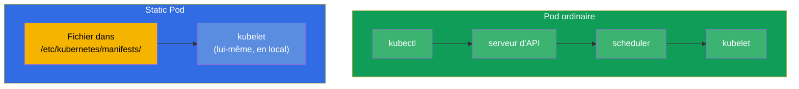
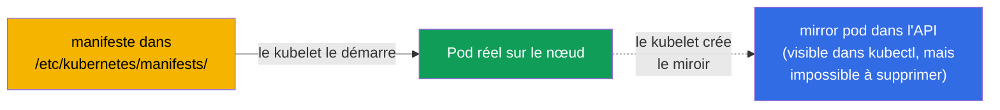
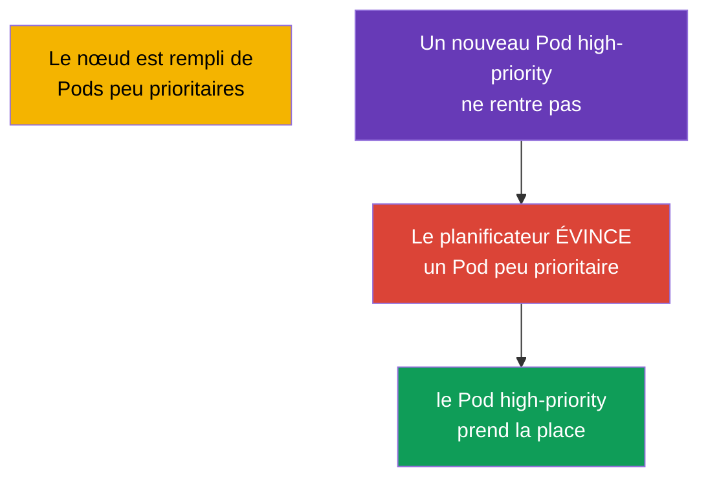
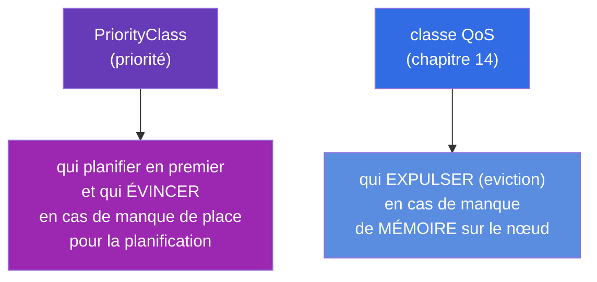
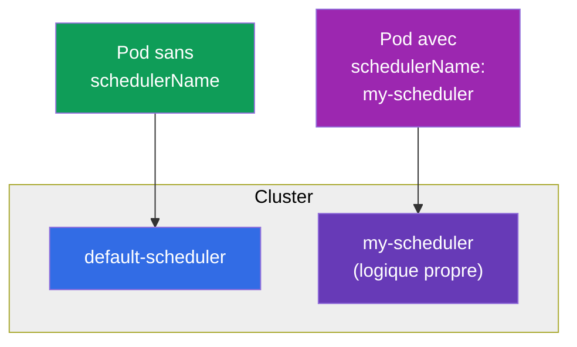

[Русская версия](ru.md) · [Eng version](README.md) · [Versión en español](es.md) · [Deutsche Version](de.md) · [ქართული ვერსია](ge.md) · [繁體中文版](tw.md) · [日本語版](jp.md)

# Chapitre 15. Static Pods, PriorityClass et planificateurs multiples

> **Ce qui suit.** Nous clôturons le bloc consacré à la planification avec trois sujets qui
> reviennent souvent à la CKA. Les **Static Pods** - des Pods gérés directement par le kubelet, en
> contournant le control plane (c'est exactement ainsi que démarrent les composants du control
> plane lui-même !). La **PriorityClass** - les priorités des Pods et l'éviction préventive
> (preemption) en cas de manque de ressources. Les **planificateurs multiples** - comment lancer et
> utiliser son propre planificateur. Les deux premiers sujets sont importants aussi bien pour le
> troubleshooting que pour comprendre comment le cluster est assemblé.

## 15.1. Static Pods : des Pods sous la gestion du kubelet

Un Pod ordinaire passe par le serveur d'API et le planificateur (chapitre 2). Un **Static Pod** est
l'exception : il est géré **directement par le kubelet du nœud concerné**, qui lit son manifeste
depuis un dossier local. Ni le serveur d'API ni le planificateur n'y participent.



Le kubelet surveille un dossier (généralement `/etc/kubernetes/manifests/`, chemin défini dans sa
configuration par le paramètre `staticPodPath`). Vous y déposez le YAML d'un Pod - le kubelet le
démarre. Vous modifiez le fichier - il le recrée. Vous le supprimez - il l'arrête.

```bash
# Trouver le chemin des manifestes des static pod
grep staticPodPath /var/lib/kubelet/config.yaml
# habituellement : /etc/kubernetes/manifests
```

## 15.2. Les mirror pods et pourquoi cela compte pour la CKA

Même si un static pod est créé en contournant le serveur d'API, le kubelet crée pour lui un **Pod
miroir (mirror pod)** dans l'API - afin que vous le voyiez via `kubectl get pods`. Mais ce n'est
qu'un reflet : supprimer un static pod avec `kubectl delete` est **impossible** - le kubelet le
recréera aussitôt à partir du fichier. On ne peut retirer un static pod qu'en retirant son
manifeste du dossier.



**L'essentiel pour la CKA :** c'est exactement ainsi que démarrent les composants du control plane
(chapitre 2) - kube-apiserver, etcd, scheduler, controller-manager. Leurs manifestes se trouvent
dans `/etc/kubernetes/manifests/` sur le nœud du control plane, et on les répare en éditant ces
fichiers. Le nom d'un static pod reçoit le suffixe du nom du nœud (par exemple,
`kube-apiserver-master1`). C'est la clé des exercices « répare un composant du control plane ».

> **Et dans les clusters managés (EKS/GKE/AKS) ?** Là, vous ne verrez pas ces static pods - non pas
> parce qu'ils auraient été masqués par un filtre, mais parce que le control plane est placé **en
> dehors de votre cluster**. Le fournisseur exécute l'apiserver, etcd, le scheduler et le
> controller-manager dans son infrastructure managée (un compte AWS/Google/Azure distinct), dont
> vous n'avez pas accès aux nœuds. Seul un endpoint d'API managé est exposé vers l'extérieur. C'est
> pourquoi `kubectl get nodes` ne montre que les nœuds worker, et `kube-system` uniquement les
> composants de niveau nœud et les add-ons (`kube-proxy`, `coredns`, un CNI comme `aws-node`), mais
> pas les composants du control plane eux-mêmes. Le fournisseur les exploite et les met à jour, et
> les logs ne sont accessibles qu'indirectement (par exemple, le control plane logging dans
> CloudWatch chez EKS). La méthode « réparer un composant via le manifeste dans
> `/etc/kubernetes/manifests/` » fonctionne dans les clusters self-managed (kubeadm) - et c'est
> précisément ce type de cluster que l'on a à l'examen CKA.

## 15.3. Comment créer un static pod

Il suffit de déposer le manifeste du Pod dans le bon dossier sur le nœud :

```bash
# sur le nœud
cat > /etc/kubernetes/manifests/my-static.yaml <<EOF
apiVersion: v1
kind: Pod
metadata:
  name: my-static
spec:
  containers:
  - name: nginx
    image: nginx
EOF
# le kubelet prendra le fichier tout seul, le Pod apparaîtra en quelques secondes
kubectl get pods -o wide       # on verra my-static-<nom-du-nœud>
```

Les static pods s'emploient là où un Pod doit fonctionner **avant et indépendamment du control
plane** - en premier lieu pour le control plane lui-même. Les applications ordinaires n'en ont pas
besoin - pour elles, il y a DaemonSet/Deployment.

## 15.4. PriorityClass : les priorités des Pods

Quand il n'y a pas assez de ressources pour tout le monde, qui est le plus important ? La
**PriorityClass** définit une priorité numérique des Pods. Les Pods plus prioritaires sont
planifiés en premier et, en cas de manque de ressources, peuvent **évincer (preempt)** les moins
prioritaires.

```yaml
apiVersion: scheduling.k8s.io/v1
kind: PriorityClass
metadata:
  name: high-priority
value: 1000000              # plus la valeur est grande, plus c'est important
globalDefault: false
description: "Pour les services critiques"
```

Utilisation dans un Pod :

```yaml
spec:
  priorityClassName: high-priority
```



Comment fonctionne l'éviction préventive (preemption) : si un Pod hautement prioritaire ne rentre
pas, le planificateur trouve sur un nœud approprié des Pods de priorité moindre et les supprime,
libérant de la place. Les Pods évincés tentent de déménager sur d'autres nœuds.

Les priorités système intégrées que vous verrez dans le cluster :

| PriorityClass | Valeur | À quoi ça sert |
|---------------|----------|----------|
| `system-cluster-critical` | 2000000000 | composants critiques du cluster |
| `system-node-critical` | 2000001000 | composants de niveau nœud (la plus haute) |

> **globalDefault.** Si une PriorityClass porte `globalDefault: true`, elle s'applique à tous les
> Pods sans `priorityClassName` explicite. Par défaut, la priorité des Pods est 0.

## 15.5. PriorityClass et QoS : ne pas confondre

Deux sujets qui se ressemblent, mais qui parlent de choses différentes :



- La **PriorityClass** règle la question de la planification : qui placer en premier et qui évincer
  pour caser un Pod important.
- La **QoS** (issue des requests/limits) règle la question de la survie en cas de manque de mémoire
  sur un nœud déjà en fonctionnement : qui le kubelet expulsera en premier.

Les deux parlent de « qui est le plus important », mais à des étapes différentes : la priorité lors
du placement, la QoS lors de l'eviction.

### Cas pratique : haute priorité ≠ protection contre l'expulsion

Pour bien saisir que la priorité et la QoS sont **indépendantes**, examinons deux Pods :

- **Pod A** - `priorityClassName` élevé (par exemple, `1000000`), mais **BestEffort** :
  requests/limits ne sont pas définis du tout.
- **Pod B** - priorité faible (`0`, par défaut), mais **Guaranteed** : `requests == limits` pour le
  CPU et la mémoire.

Leur sort dans deux situations différentes est **opposé**.

**Situation 1 : il manque de la place pour planifier le Pod A (preemption).** Ici, c'est le
planificateur qui agit, et il ne regarde **que la priorité** - la QoS n'intervient pas du tout dans
le choix de la victime. Le Pod A est plus important, donc, s'il n'y a pas de place pour lui, le
planificateur peut **évincer (preempt)** le Pod B moins prioritaire - et cela malgré le fait que B
soit garanti (la QoS Guaranteed ne protège pas de l'éviction préventive). B sera tué et partira
chercher un autre nœud, tandis que A sera placé. Autrement dit, à l'étape de la planification,
c'est la haute priorité de A qui gagne.

**Situation 2 : la mémoire du nœud est physiquement épuisée (node-pressure eviction).** Maintenant,
c'est le **kubelet** qui décide, et le critère principal est la **consommation par rapport aux
requests**, c'est-à-dire la QoS, et non la priorité. Le kubelet chasse d'abord ceux qui mangent
au-delà de leurs requests ; BestEffort (requests = 0) tombe immédiatement dans ce groupe, tandis que
Guaranteed, qui vit dans les limites de ses requests, se retrouve dans le groupe le mieux protégé.
C'est pourquoi le Pod A (BestEffort) sera expulsé **en premier**, bien que sa priorité soit plus
haute, et le Pod B (Guaranteed) survivra. La priorité n'y joue que le rôle de critère secondaire -
à égalité par ailleurs, au sein d'un même groupe.

Conclusion : une PriorityClass élevée aide à **arriver sur un nœud et à y garder sa place lors de la
planification**, mais **ne protège pas** de l'expulsion en cas de manque de mémoire - là, ce qui
sauve, c'est la QoS Guaranteed (`requests == limits`). Pour un service véritablement critique, il
faut **les deux** : une priorité élevée et Guaranteed.

### Cas pratique : deux Pods de même priorité et Guaranteed - lequel sera tué en premier ?

Et si les deux Pods sont totalement égaux « en rangs » - même `priorityClassName` et tous deux
Guaranteed ? Alors ni la priorité ni le groupe QoS ne les distinguent plus, et un troisième critère
de la node-pressure eviction entre en jeu : la **consommation par rapport aux requests**. Le kubelet
classe les Pods à expulser selon la chaîne « dépassement des requests → Priority → de combien la
consommation dépasse les requests » ; à égalité sur les deux premiers, c'est le dernier qui décide -
partira en premier celui qui consomme **le plus par rapport à son request** (le plus « gourmand »,
en somme). Ainsi, toutes choses égales, c'est le Pod le plus vorace en mémoire qui périt.

Nuances importantes propres à Guaranteed :

- **Sa limite, sa mort.** Pour Guaranteed, `requests == limits`. Si un conteneur bute lui-même sur
  sa limite mémoire, l'OOM-killer le tue **individuellement** (`OOMKilled`), indépendamment du Pod
  voisin - ce n'est pas un « choix entre deux », mais le dépassement de son propre plafond.
- **La node-pressure est un cas extrême.** Les Pods Guaranteed sont expulsés en dernier et,
  généralement, seulement quand la mémoire manque déjà aux démons système du nœud (kubelet, runtime),
  et non à cause des voisins. Au niveau du noyau, en cas d'épuisement de la mémoire, l'OOM-killer se
  base sur `oom_score` (celui de Guaranteed est le plus « protégé »), et au sein d'une même classe il
  tue le processus qui consomme le plus de mémoire.

Conclusion pratique : quand les signes formels sont égaux, le « fusible » devient la consommation
réelle - c'est pourquoi, même pour des Pods Guaranteed critiques, il importe de fixer les requests
au plus près du pic réel, et non « avec de la marge ».

## 15.6. Les planificateurs multiples

Par défaut, c'est le `default-scheduler` qui répartit les Pods. Mais on peut lancer **son
propre** planificateur (avec sa logique de choix des nœuds) et indiquer à un Pod par quel
planificateur il doit être placé.

```yaml
spec:
  schedulerName: my-scheduler    # ce Pod sera placé par le planificateur personnalisé
```



Si un Pod indique un `schedulerName` inexistant, il restera à jamais en `Pending` - personne ne le
prendra en charge. C'est encore une cause possible de Pending lors du débogage.

Il y a deux façons d'obtenir un comportement de planification « différent », et le choix entre elles
se fait surtout en fonction de l'effort à fournir.

### Variante 1 (légère) : les Scheduler Profiles dans le planificateur standard

Dans la plupart des cas, un binaire séparé n'est pas nécessaire - les **profils de planificateur**
suffisent. Un même `kube-scheduler` peut porter plusieurs **profils**, chacun avec son propre
`schedulerName` et son propre jeu de plugins activés/désactivés et de poids. Le Pod choisit son
profil avec le même champ `spec.schedulerName`.

Les profils se définissent dans la `KubeSchedulerConfiguration` (le fichier que lit le
kube-scheduler) :

```yaml
apiVersion: kubescheduler.config.k8s.io/v1
kind: KubeSchedulerConfiguration
profiles:
  - schedulerName: default-scheduler        # comportement habituel
  - schedulerName: bin-packing              # nom propre — les Pods l'indiqueront
    pluginConfig:
      - name: NodeResourcesFit
        args:
          scoringStrategy:
            type: MostAllocated              # empaquetage dense au lieu d'un étalement uniforme
```

Ici, `MostAllocated` force le profil `bin-packing` à remplir les nœuds plus densément (économie sur
le nombre de nœuds), là où le `LeastAllocated` standard répartit les Pods uniformément. Il suffit au
Pod d'indiquer `schedulerName: bin-packing` - et ce profil le placera, tandis que tout le reste
continuera à fonctionner comme d'habitude. Un seul processus, aucun déploiement superflu.

**Comment l'appliquer étape par étape** (self-managed / kubeadm, où `kube-scheduler` est un static
pod du control plane) :

1. **Créer le fichier de configuration** sur le nœud control-plane, par exemple
   `/etc/kubernetes/sched-config.yaml`, avec la `KubeSchedulerConfiguration` (comme ci-dessus) et
   l'indication du kubeconfig du planificateur :

   ```yaml
   apiVersion: kubescheduler.config.k8s.io/v1
   kind: KubeSchedulerConfiguration
   clientConnection:
     kubeconfig: /etc/kubernetes/scheduler.conf   # kubeconfig du planificateur lui-même
   profiles:
     - schedulerName: default-scheduler
     - schedulerName: bin-packing
       pluginConfig:
         - name: NodeResourcesFit
           args:
             scoringStrategy:
               type: MostAllocated
   ```

2. **Transmettre le fichier au planificateur** via le flag `--config`. On édite le manifeste du
   static pod `/etc/kubernetes/manifests/kube-scheduler.yaml` : on ajoute l'argument et on monte le
   fichier de l'hôte dans le Pod :

   ```yaml
   spec:
     containers:
     - command:
       - kube-scheduler
       - --config=/etc/kubernetes/sched-config.yaml   # + retirer les anciens flags conflictuels
       volumeMounts:
       - name: sched-config
         mountPath: /etc/kubernetes/sched-config.yaml
         readOnly: true
     volumes:
     - name: sched-config
       hostPath:
         path: /etc/kubernetes/sched-config.yaml
         type: File
   ```

3. **Le kubelet redémarrera lui-même** le Pod du planificateur (c'est un static pod - il réagit à
   l'édition du manifeste). On vérifie qu'il est remonté sans erreurs :

   ```bash
   kubectl -n kube-system get pod -l component=kube-scheduler
   kubectl -n kube-system logs kube-scheduler-<node>    # on cherche "profiles" et l'absence d'erreurs de config
   ```

4. **Vérifier le fonctionnement du profil :** on crée un Pod avec `schedulerName: bin-packing` et on
   regarde qu'il est passé en `Running`, et que dans les événements c'est bien ce profil qui l'a
   affecté :

   ```bash
   kubectl run t --image=nginx --overrides='{"spec":{"schedulerName":"bin-packing"}}'
   kubectl get event --field-selector involvedObject.name=t | grep -i scheduled
   ```

> Dans les clusters **managés** (EKS/GKE/AKS), les modifications de la configuration du planificateur
> sont inaccessibles - le control plane est fermé (voir l'encadré en 15.2). Là, la planification
> personnalisée ne se fait qu'à travers son propre planificateur déployé dans le cluster
> (Variante 2).

**Que peut-on encore définir dans les profils.** Un profil, ce n'est pas seulement un
`schedulerName` ; c'est par lui que l'on règle le comportement même de la planification :

- **Activer/désactiver les plugins par phase (extension points).** La planification a des étapes :
  `queueSort`, `preFilter`, `filter`, `postFilter`, `preScore`, `score`, `reserve`, `permit`,
  `preBind`, `bind`, `postBind`. Dans le bloc `plugins`, pour chaque étape, on peut lister les
  plugins en `enabled`/`disabled` (par exemple, désactiver `PodTopologySpread` à l'étape score dans
  un seul profil).
- **Les poids des plugins de score.** Les plugins de la phase `score` ont un `weight` - en le
  modifiant, on remodèle la note finale des nœuds (par exemple, renforcer `ImageLocality` pour
  placer plus souvent le Pod là où l'image est déjà téléchargée).
- **Les arguments des plugins (`pluginConfig`).** Le réglage fin de plugins précis :
  - `NodeResourcesFit` - la stratégie de scoring (`LeastAllocated`/`MostAllocated`/
    `RequestedToCapacityRatio`) et les poids des ressources ;
  - `PodTopologySpread` - `defaultConstraints` (les valeurs par défaut de la répartition par
    topologie) ;
  - `InterPodAffinity` - `hardPodAffinityWeight` ;
  - `NodeAffinity` - `addedAffinity` (ajouter à tous les Pods du profil une règle d'affinity) ;
  - `DefaultPreemptionArgs`, `VolumeBinding` et autres.
- **Plusieurs profils à la fois** - à chacun son `schedulerName` et son jeu de plugins/poids ; les
  Pods choisissent celui qu'il leur faut avec le champ `schedulerName`. Limitation : le plugin
  `queueSort` doit être identique dans tous les profils.
- **Les paramètres globaux du planificateur** (définis dans le même fichier, non à l'intérieur d'un
  profil) : `percentageOfNodesToScore` (combien de nœuds évaluer - un compromis vitesse/qualité sur
  les grands clusters), `parallelism`, `podMaxBackoffSeconds`, etc.

### Variante 2 (lourde) : son propre planificateur comme processus séparé

Si l'on a besoin d'une logique que les plugins ne peuvent pas exprimer, on lance un **deuxième
planificateur** - comme un Deployment ordinaire dans `kube-system`. Il lui faut son propre
ServiceAccount et du RBAC (accès aux nœuds, aux Pods, aux événements, aux leases pour la leader
election). Schématiquement :

```yaml
apiVersion: apps/v1
kind: Deployment
metadata:
  name: my-scheduler
  namespace: kube-system
spec:
  replicas: 1
  selector:
    matchLabels: {app: my-scheduler}
  template:
    metadata:
      labels: {app: my-scheduler}
    spec:
      serviceAccountName: my-scheduler        # + ClusterRole/ClusterRoleBinding avec les droits requis
      containers:
      - name: kube-scheduler
        image: registry.k8s.io/kube-scheduler:v1.34.0   # ou son propre binaire avec des plugins personnalisés
        command:
        - kube-scheduler
        - --config=/etc/kubernetes/my-scheduler-config.yaml   # ici, son propre schedulerName
        # ...on monte une ConfigMap avec la KubeSchedulerConfiguration
```

Après cela, ce sera bien lui qui placera les Pods portant `spec.schedulerName: my-scheduler`. Les
deux planificateurs travaillent en parallèle ; l'essentiel est qu'ils ne se « battent » pas pour les
mêmes Pods (chacun ne prend que les siens d'après `schedulerName`).

### Quand cela est-il vraiment nécessaire

En pratique, un deuxième planificateur est une rareté ; le plus souvent, les profils ou les
affinity/taints/topologySpread habituels suffisent (chapitres 12-13). Les motifs réels :

- **Batch/ML et gang scheduling.** Les tâches dont l'ensemble des Pods doit démarrer « tout ou
  rien » (entraînement distribué, Spark/MPI) ont besoin de co-scheduling - fourni par Volcano,
  Apache YuniKorn, le plugin coscheduling. Le planificateur standard place les Pods un par un et peut
  aboutir à un deadlock de tâches à moitié démarrées.
- **Empaquetage dense par souci d'économie.** Le bin-packing (`MostAllocated`) densifie les nœuds
  pour que l'autoscaler puisse éteindre ceux qui sont en trop - une économie directe. C'est
  justement le cas d'un profil, et non d'un binaire.
- **Matériel spécial et topologie.** La prise en compte du NUMA, de la topologie GPU, de la
  proximité réseau, des exigences de latence - quand les plugins standard ne suffisent pas.
- **Multi-tenancy et partage équitable.** Des quotas et des files entre les équipes avec leur propre
  politique d'équité (YuniKorn, Volcano queues).
- **Sa propre logique métier.** Des règles de placement qu'on ne peut pas exprimer avec les labels
  et prédicats existants.

Règle pratique : on essaie d'abord de résoudre le problème avec un profil ou de l'affinity ; on ne
prend un planificateur séparé que lorsqu'il faut une logique fondamentalement différente (en premier
lieu, le gang scheduling pour le batch/ML). Pour l'examen, il suffit de savoir : on modifie le
comportement de la planification via des profils ou son propre planificateur, et on rattache un Pod
à celui-ci avec le champ `schedulerName`.

## 15.7. Comment cela s'applique en production

- **Static pods - uniquement pour le control plane.** En prod, les static pods sont le moyen par
  lequel kubeadm démarre et maintient les composants du control plane jusqu'à ce qu'une API
  fonctionnelle apparaisse. Pour les charges applicatives, on ne les utilise pas - là, c'est
  DaemonSet/Deployment. Savoir que « control plane = static pods dans
  `/etc/kubernetes/manifests/` » est la base de leur exploitation et de leur réparation.
- **La PriorityClass pour protéger les services critiques.** En prod, on attribue une priorité
  élevée aux composants critiques (monitoring, ingress, services système), afin qu'en cas de manque
  de ressources ce soient les tâches de fond moins importantes qui soient évincées, et non eux. Aux
  charges batch, à l'inverse, on donne une priorité faible - on ne regrettera pas de les évincer.
- **Attention à la preemption.** Une priorité élevée attribuée sans réflexion à de nombreux Pods
  conduit à une « guerre des évictions » et à de l'instabilité. Les priorités se pensent à l'échelle
  du cluster entier.
- **Les planificateurs personnalisés sont une rareté.** On écrit son propre planificateur dans des
  cas spécifiques (par exemple, HPC, règles de placement particulières). Le plus souvent, les
  affinity/taints/topologySpread des chapitres 12-13 suffisent. Mais connaître `schedulerName` est
  utile : une valeur erronée est une cause de Pending éternel.

## 15.8. Mini-glossaire

- **Static Pod** - un Pod géré directement par le kubelet depuis un manifeste local, en contournant
  le serveur d'API et le planificateur.
- **staticPodPath** - le dossier que surveille le kubelet (habituellement `/etc/kubernetes/manifests/`).
- **Mirror Pod (Pod miroir)** - le reflet d'un static pod dans l'API ; visible, mais non supprimable
  via kubectl.
- **PriorityClass** - un objet portant une priorité numérique des Pods.
- **Preemption (éviction préventive)** - la suppression de Pods moins prioritaires afin de placer un
  Pod plus prioritaire.
- **globalDefault** - la PriorityClass appliquée aux Pods sans priorité explicite.
- **schedulerName** - quel planificateur place le Pod.
- **Scheduler Profiles** - plusieurs configurations au sein d'un même planificateur.

## 15.9. Bilan du chapitre

- Un Static Pod est géré directement par le kubelet depuis le dossier
  `/etc/kubernetes/manifests/`, en contournant le serveur d'API et le planificateur ; il se modifie
  en éditant le fichier.
- Pour un static pod, un Pod miroir est créé dans l'API (visible dans kubectl), mais on ne peut pas
  le supprimer via kubectl - seulement en retirant le manifeste.
- Les composants du control plane (apiserver, etcd, scheduler, controller-manager) sont des static
  pods ; d'où la manière de les réparer.
- La PriorityClass définit une priorité numérique ; les Pods hautement prioritaires sont planifiés
  en premier et peuvent évincer (preempt) les moins prioritaires en cas de manque de place.
- La PriorityClass (planification/éviction préventive) et la QoS (eviction en cas de manque de
  mémoire) concernent des étapes différentes, à ne pas confondre.
- On peut lancer plusieurs planificateurs et les choisir via `schedulerName` ; un nom erroné = un
  Pending éternel.

## 15.10. À quoi cela sert : à l'examen et dans le travail réel

**À l'examen.** « Crée un static pod sur un nœud », « répare un composant du control plane » (via le
manifeste dans `/etc/kubernetes/manifests/`), « crée une PriorityClass et affecte-la à un Pod » sont
des exercices types de la CKA. La compréhension des static pods est directement nécessaire pour le
domaine troubleshooting. Un `schedulerName` pointant vers un planificateur inexistant est une des
causes de Pending.

**Dans le travail réel.** Les static pods sont la façon dont le control plane vit physiquement, et le
savoir est la base de son exploitation. La PriorityClass protège les services critiques de
l'éviction en cas de manque de ressources et détermine ce qu'on peut sacrifier. Cela influe sur la
stabilité de tout le cluster sous charge.

## 15.11. Questions d'auto-évaluation

1. En quoi un static pod diffère-t-il d'un Pod ordinaire par son chemin de création ?
2. Pourquoi ne peut-on pas supprimer un static pod via `kubectl delete` et comment s'en
   débarrasser ?
3. Quel est le lien entre les static pods et les composants du control plane ? Où se trouvent leurs
   manifestes ?
4. Que fait la PriorityClass et comment fonctionne l'éviction préventive (preemption) ?
5. En quoi la PriorityClass diffère-t-elle de la classe QoS par sa finalité ?
6. Comment diriger un Pod vers un planificateur précis et que se passera-t-il en cas de
   `schedulerName` erroné ?
7. Que signifie `globalDefault: true` pour une PriorityClass ?

## Pratique

Nous avons clôturé la planification. Au chapitre 16 - le dernier sujet de la partie 2 :
l'autoscaling des charges de travail (HPA), où les répliques d'un Deployment changent
automatiquement selon la charge. Les static pods et la PriorityClass se travaillent dans les TP sur
le cluster et la planification.

🧪 TP 117 (dont le débogage des static pods) : [tasks/cka/labs/117](../../labs/117/README_FR.MD)

🧪 TP 122 (dont un drill sur la PriorityClass) : [tasks/cka/labs/122](../../labs/122/README_FR.MD)

🎮 Killercoda (dans le navigateur, sans installation) : [Priority Class](https://killercoda.com/chadmcrowell/course/cka/priority-class)

---
[Sommaire](../README_FR.md) · [Chapitre 14](../14/fr.md) · [Chapitre 16](../16/fr.md)
