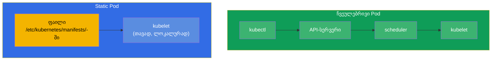
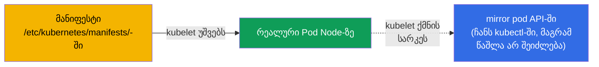
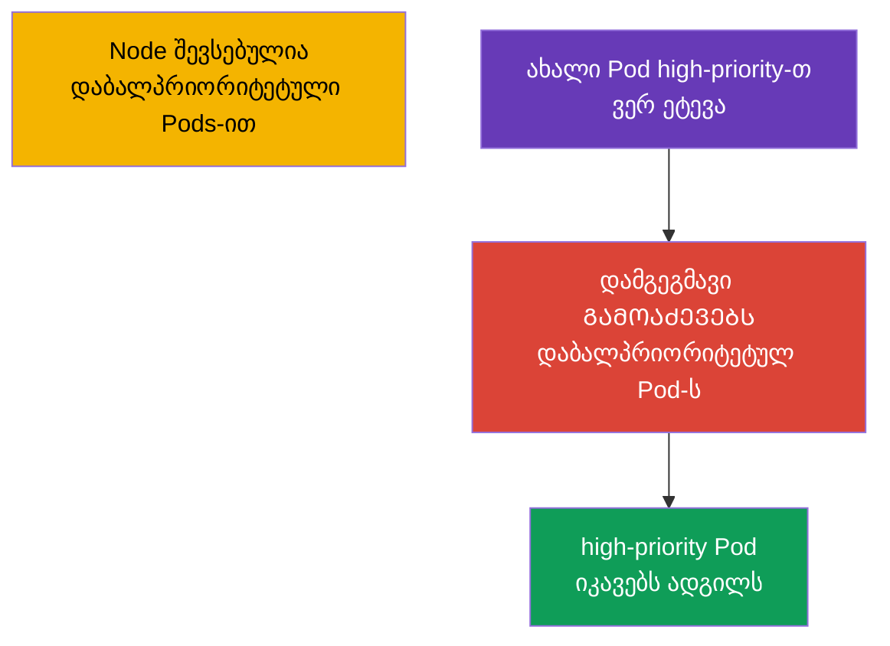
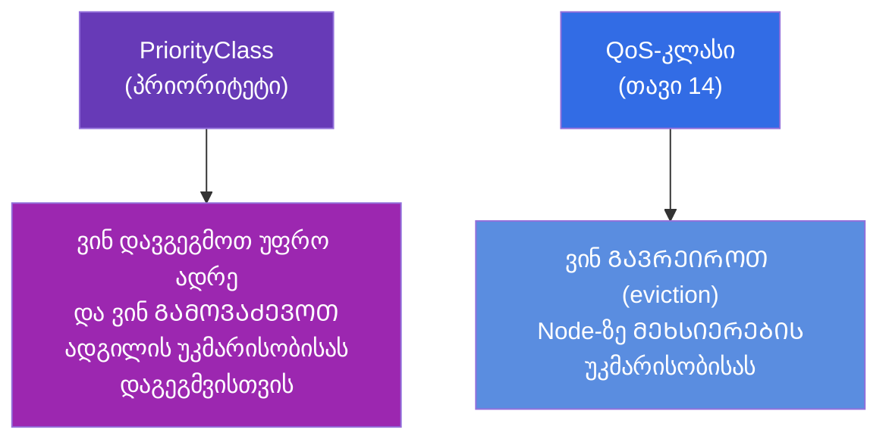
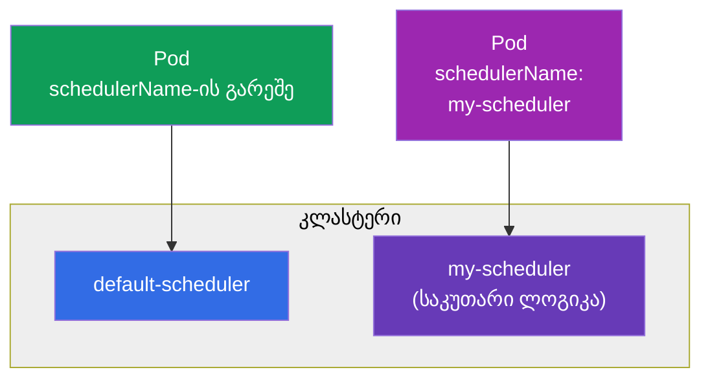

[Русская версия](ru.md) · [Eng version](README.md) · [Versión en español](es.md) · [Version française](fr.md) · [Deutsche Version](de.md) · [繁體中文版](tw.md) · [日本語版](jp.md)

# თავი 15. Static Pods, PriorityClass და რამდენიმე დამგეგმავი

> **რა იქნება შემდეგ.** დაგეგმვის ბლოკს ვხურავთ სამი თემით, რომლებიც ხშირად გვხვდება
> CKA-ზე. **Static Pods** - Pods, რომლებსაც kubelet პირდაპირ მართავს, control plane-ის
> გვერდის ავლით (სწორედ ასე ეშვება თავად control plane-ის კომპონენტები!). **PriorityClass** -
> Pods-ის პრიორიტეტები და გამოძევება (preemption) რესურსების უკმარისობისას. **რამდენიმე
> დამგეგმავი** - როგორ გავუშვათ და გამოვიყენოთ საკუთარი დამგეგმავი. პირველი ორი თემა
> მნიშვნელოვანია troubleshooting-ისთვისაც და იმის გასაგებადაც, საერთოდ როგორ არის აწყობილი კლასტერი.

## 15.1. Static Pods: Pods kubelet-ის მართვის ქვეშ

ჩვეულებრივი Pod გაივლის API-სერვერსა და დამგეგმავს (თავი 2). **Static Pod** გამონაკლისია:
მას მართავს **კონკრეტული Node-ის kubelet პირდაპირ**, ლოკალური საქაღალდიდან მანიფესტის კითხვით. არც
API-სერვერი, არც დამგეგმავი ამაში არ მონაწილეობს.



kubelet აკვირდება საქაღალდეს (ჩვეულებრივ `/etc/kubernetes/manifests/`, გზა მის კონფიგში
პარამეტრით `staticPodPath` არის მითითებული). ჩადეთ იქ Pod-ის YAML - kubelet მას გაუშვებს. შეცვალეთ
ფაილი - ხელახლა შექმნის. წაშალეთ - გააჩერებს.

```bash
# static pod-ის მანიფესტების გზის გაგება
grep staticPodPath /var/lib/kubelet/config.yaml
# ჩვეულებრივ: /etc/kubernetes/manifests
```

## 15.2. სარკისებური Pods და რატომ არის ეს მნიშვნელოვანი CKA-სთვის

მართალია static pod იქმნება API-სერვერის გვერდის ავლით, kubelet მისთვის API-ში ქმნის
**სარკისებურ Pod-ს (mirror pod)** - იმისთვის, რომ თქვენ მას `kubectl get pods`-ით დაინახოთ. მაგრამ ეს მხოლოდ
ანარეკლია: static pod-ის `kubectl delete`-ით წაშლა **არ შეიძლება** - kubelet მას მაშინვე
ხელახლა შექმნის ფაილიდან. static pod-ის მოშორება მხოლოდ საქაღალდიდან მისი მანიფესტის მოშორებით შეიძლება.



**მთავარი CKA-სთვის:** სწორედ ასე ეშვება control plane-ის კომპონენტები (თავი 2) -
kube-apiserver, etcd, scheduler, controller-manager. მათი მანიფესტები დევს
`/etc/kubernetes/manifests/`-ში control plane Node-ზე, და მათ ამ ფაილების რედაქტირებით აკეთებენ. static
pod-ის სახელი იღებს Node-ის სახელის სუფიქსს (მაგალითად, `kube-apiserver-master1`). ეს არის გასაღები
დავალებებისთვის „შეაკეთე control plane-ის კომპონენტი“.

> **და მართულ კლასტერებში (EKS/GKE/AKS)?** იქ ამ static pod-ებს ვერ დაინახავთ -
> და არა იმიტომ, რომ ფილტრით დამალეს, არამედ იმიტომ, რომ control plane გატანილია **თქვენი
> კლასტერის ფარგლებს გარეთ**. პროვაიდერი უშვებს apiserver-ს, etcd-ს, scheduler-სა და controller-manager-ს
> საკუთარ მართულ ინფრასტრუქტურაში (ცალკე AWS/Google/Azure-ის აქაუნთი), რომლის Nodes-თან
> თქვენ წვდომა არ გაქვთ. გარეთ გამოტანილია მხოლოდ მართული API-endpoint. ამიტომ
> `kubectl get nodes`-ში მხოლოდ worker-Nodes ჩანს, ხოლო `kube-system`-ში - მხოლოდ Node-ის
> დონის კომპონენტები და ადონები (`kube-proxy`, `coredns`, CNI როგორიცაა `aws-node`), მაგრამ არა თავად
> control plane-ის კომპონენტები. მათ პროვაიდერი ემსახურება და აახლებს, ხოლო ლოგები ხელმისაწვდომია მხოლოდ
> ირიბად (მაგალითად, control plane logging CloudWatch-ში EKS-ისთვის). ხერხი „შეაკეთო
> კომპონენტი მანიფესტით `/etc/kubernetes/manifests/`-ში“ მუშაობს self-managed
> კლასტერებში (kubeadm) - CKA გამოცდაზე სწორედ ასეთია.

## 15.3. როგორ შევქმნათ static pod

უბრალოდ ჩავდოთ Pod-ის მანიფესტი Node-ზე საჭირო საქაღალდეში:

```bash
# Node-ზე
cat > /etc/kubernetes/manifests/my-static.yaml <<EOF
apiVersion: v1
kind: Pod
metadata:
  name: my-static
spec:
  containers:
  - name: nginx
    image: nginx
EOF
# kubelet ფაილს თავად აიღებს, Pod რამდენიმე წამში გამოჩნდება
kubectl get pods -o wide       # დავინახავთ my-static-<Node-ის-სახელი>
```

Static pod-ებს იყენებენ იქ, სადაც Pod უნდა მუშაობდეს **control plane-ამდე და მისგან
დამოუკიდებლად** - პირველ რიგში თავად control plane-ისთვის. ჩვეულებრივ აპლიკაციებს ისინი არ სჭირდება -
მათთვის არსებობს DaemonSet/Deployment.

## 15.4. PriorityClass: Pods-ის პრიორიტეტები

როცა რესურსები ყველას არ ჰყოფნის, ვინ არის უფრო მნიშვნელოვანი? **PriorityClass** სვამს Pods-ის რიცხვით
პრიორიტეტს. უფრო პრიორიტეტული Pods იგეგმება უფრო ადრე და რესურსების უკმარისობისას შეუძლია
**გამოძევოს (preempt)** ნაკლებად პრიორიტეტული.

```yaml
apiVersion: scheduling.k8s.io/v1
kind: PriorityClass
metadata:
  name: high-priority
value: 1000000              # რაც მეტია, მით უფრო მნიშვნელოვანია
globalDefault: false
description: "კრიტიკული სერვისებისთვის"
```

გამოყენება Pod-ში:

```yaml
spec:
  priorityClassName: high-priority
```



როგორ მუშაობს გამოძევება (preemption): თუ მაღალპრიორიტეტული Pod ვერ ეტევა,
დამგეგმავი შესაფერის Node-ზე პოულობს ნაკლები პრიორიტეტის Pods-ს და შლის მათ,
ადგილს ათავისუფლებს. გამოძევებული Pods სხვა Nodes-ზე გადასვლას ცდილობს.

ჩაშენებული სისტემური პრიორიტეტები, რომლებსაც კლასტერში დაინახავთ:

| PriorityClass | მნიშვნელობა | რისთვის |
|---------------|----------|----------|
| `system-cluster-critical` | 2000000000 | კლასტერის კრიტიკული კომპონენტები |
| `system-node-critical` | 2000001000 | Node-ის დონის კომპონენტები (უმაღლესი) |

> **globalDefault.** თუ PriorityClass-ს უწერია `globalDefault: true`, ის გამოიყენება
> ყველა Pod-ზე აშკარა `priorityClassName`-ის გარეშე. ნაგულისხმევად Pods-ის პრიორიტეტი არის 0.

## 15.5. PriorityClass და QoS: არ აურიოთ

ორი მსგავსი თემა, მაგრამ სხვადასხვა რაღაცაზე:



- **PriorityClass** წყვეტს დაგეგმვის საკითხს: ვინ დავსვათ უფრო ადრე და ვინ გამოვაძევოთ,
  რომ მნიშვნელოვანი Pod განთავსდეს.
- **QoS** (requests/limits-იდან) წყვეტს გადარჩენის საკითხს უკვე მომუშავე Node-ზე მეხსიერების
  უკმარისობისას: ვის გარეირებს kubelet პირველად.

ორივე „ვინ არის უფრო მნიშვნელოვანი“-ზეა, მაგრამ სხვადასხვა ეტაპზე: პრიორიტეტი - განთავსებისას, QoS - eviction-ისას.

### ქეისი: მაღალი პრიორიტეტი ≠ დაცვა გარეირებისგან

იმისთვის, რომ ვიგრძნოთ, რომ პრიორიტეტი და QoS **დამოუკიდებელია**, გავარჩიოთ ორი Pod:

- **Pod A** - მაღალი `priorityClassName` (მაგალითად, `1000000`), მაგრამ **BestEffort**:
  requests/limits საერთოდ არ არის მითითებული.
- **Pod B** - დაბალი პრიორიტეტი (`0`, ნაგულისხმევად), მაგრამ **Guaranteed**: `requests == limits`
  CPU-სა და მეხსიერებაზე.

მათი ბედი ორ სხვადასხვა სიტუაციაში **საპირისპიროა**.

**სიტუაცია 1: არ ჰყოფნის ადგილი, რომ დაიგეგმოს Pod A (preemption).** აქ მუშაობს
დამგეგმავი და უყურებს **მხოლოდ პრიორიტეტს** - QoS მსხვერპლის შერჩევაში საერთოდ არ მონაწილეობს.
Pod A უფრო მნიშვნელოვანია, ამიტომ თუ მისთვის ადგილი არ არის, დამგეგმავს შეუძლია **გამოაძევოს (preempt)**
ნაკლებად პრიორიტეტული Pod B - მიუხედავად იმისა, რომ B გარანტირებულია (Guaranteed QoS
გამოძევებისგან არ იცავს). B მოკლულ იქნება და სხვა Node-ის ძებნას წავა, ხოლო A - განთავსდება. ანუ
დაგეგმვის ეტაპზე იგებს A-ს მაღალი პრიორიტეტი.

**სიტუაცია 2: Node-ზე ფიზიკურად იწურება მეხსიერება (node-pressure eviction).** ახლა
წყვეტს **kubelet**, და მთავარი კრიტერიუმია **მოხმარება requests-თან შედარებით**, ანუ
QoS და არა პრიორიტეტი. kubelet პირველად აძევებს მათ, ვინც საკუთარ requests-ზე მეტს ჭამს;
BestEffort (requests = 0) მაშინვე ხვდება ამ ჯგუფში, ხოლო Guaranteed, რომელიც requests-ის ფარგლებში
ცხოვრობს, - ყველაზე დაცულში. ამიტომ Pod A (BestEffort) გარეირებული იქნება **პირველად**, თუმცა
მას პრიორიტეტი უფრო მაღალი აქვს, ხოლო Pod B (Guaranteed) გადარჩება. პრიორიტეტი აქ მუშაობს მხოლოდ როგორც
მეორეული კრიტერიუმი - სხვა თანაბარ პირობებში ერთი ჯგუფის შიგნით.

დასკვნა: მაღალი PriorityClass ეხმარება **Node-ზე მოხვედრასა და დაგეგმვისას ადგილის
შენარჩუნებაში**, მაგრამ **არ იცავს** მეხსიერების უკმარისობისას გარეირებისგან - იქ შველის
Guaranteed QoS (`requests == limits`). ნამდვილად კრიტიკული სერვისისთვის საჭიროა **ორივე**:
მაღალი პრიორიტეტი და Guaranteed.

### ქეისი: ორი Pod ერთნაირი პრიორიტეტითა და Guaranteed-ით - ვის მოკლავენ პირველად?

და თუ ორივე Pod სრულიად თანაბარია „რანგებით“ - ერთნაირი `priorityClassName` და ორივე
Guaranteed? მაშინ პრიორიტეტიც და QoS-ჯგუფიც წყვეტს მათ გარჩევას, და საქმეში ერთვება
node-pressure eviction-ის მესამე კრიტერიუმი: **მოხმარება requests-თან შედარებით**. kubelet
Pods-ს გარეირებისთვის არანჟირებს ჯაჭვით „requests-ის გადაჭარბება → Priority → რამდენად არის
მოხმარება requests-ზე მაღლა“; პირველი ორის თანაბრობისას წყვეტს ბოლო - პირველად წავა ის,
ვინც **უფრო მეტს მოიხმარს საკუთარ request-თან შედარებით** (პირობითად „უფრო ხარბი“). ასე რომ სხვა
თანაბარ პირობებში კვდება მეხსიერებაზე უფრო მადიანი Pod.

მნიშვნელოვანი დახვეწილობები სწორედ Guaranteed-ისთვის:

- **საკუთარი ლიმიტი - საკუთარი სიკვდილი.** Guaranteed-ს აქვს `requests == limits`. თუ კონტეინერი თავად
  მიეჭედება საკუთარ მეხსიერების ლიმიტს, მას კლავს OOM-killer **ინდივიდუალურად** (`OOMKilled`),
  მეზობელი Pod-ისგან დამოუკიდებლად - ეს არა „არჩევანი ორს შორის“, არამედ საკუთარი
  ჭერის გადაჭარბებაა.
- **Node-pressure - უკიდურესი შემთხვევაა.** Guaranteed-Pods-ს გარეირებენ ყველაზე ბოლოს და
  ჩვეულებრივ მხოლოდ მაშინ, როცა მეხსიერება უკვე Node-ის სისტემურ დემონებს არ ჰყოფნის (kubelet, გაშვების
  გარემო), და არა მეზობლების გამო. ბირთვის დონეზე მეხსიერების ამოწურვისას OOM-killer
  ორიენტირდება `oom_score`-ზე (Guaranteed-ს ის ყველაზე „დაცული“ აქვს), ხოლო ერთი
  კლასის შიგნით კლავს პროცესს, რომელიც მეტ მეხსიერებას მოიხმარს.

პრაქტიკული დასკვნა: როცა ფორმალური ნიშნები თანაბარია, „მცველად“ იქცევა
რეალური მოხმარება - ამიტომ კრიტიკულ Guaranteed-Pods-საც მნიშვნელოვანია requests დაუსვათ
რეალურ პიკთან ახლოს, და არა „მარაგისთვის“.

## 15.6. რამდენიმე დამგეგმავი

ნაგულისხმევად Pods-ს არიგებს `default-scheduler`. მაგრამ შეიძლება გავუშვათ **საკუთარი** დამგეგმავი
(Nodes-ის შერჩევის საკუთარი ლოგიკით) და Pod-ს მივუთითოთ, რომელი დამგეგმავით განთავსდეს.

```yaml
spec:
  schedulerName: my-scheduler    # ამ Pod-ს კასტომური დამგეგმავი გაანაწილებს
```



თუ Pod უთითებს არარსებულ `schedulerName`-ს, ის სამუდამოდ დარჩება `Pending`-ში -
მას ვერავინ აიღებს. ეს Pending-ის კიდევ ერთი შესაძლო მიზეზია გამართვის დროს.

არსებობს დაგეგმვის „სხვა“ ქცევის მიღების ორი ხერხი, და მათ შორის არჩევა მნიშვნელოვანია
შრომითი დანახარჯების მიხედვით.

### ვარიანტი 1 (მსუბუქი): Scheduler Profiles შტატულ დამგეგმავში

უმეტეს შემთხვევაში ცალკე ბინარნიკი არ არის საჭირო - საკმარისია **დამგეგმავის პროფილები**.
ერთი და იგივე `kube-scheduler` შეიძლება ინახავდეს რამდენიმე **პროფილს**, თითოეულს საკუთარი
`schedulerName`-ითა და ჩართული/გამორთული პლაგინების საკუთარი ნაკრებით და მათი წონებით. Pod ირჩევს
პროფილს იმავე ველით `spec.schedulerName`.

პროფილები აღიწერება `KubeSchedulerConfiguration`-ში (ფაილი, რომელსაც kube-scheduler კითხულობს):

```yaml
apiVersion: kubescheduler.config.k8s.io/v1
kind: KubeSchedulerConfiguration
profiles:
  - schedulerName: default-scheduler        # ჩვეულებრივი ქცევა
  - schedulerName: bin-packing              # საკუთარი სახელი — მას მიუთითებენ Pods
    pluginConfig:
      - name: NodeResourcesFit
        args:
          scoringStrategy:
            type: MostAllocated              # მჭიდრო შეფუთვა თანაბრის ნაცვლად
```

აქ `MostAllocated` აიძულებს პროფილს `bin-packing` Nodes უფრო მჭიდროდ ჩაწყოს (ეკონომია
Nodes-ის რაოდენობაზე), მაშინ როცა შტატული `LeastAllocated` Pods-ს თანაბრად ანაწილებს. Pod-ს
საკმარისია მიუთითოს `schedulerName: bin-packing` - და მას სწორედ ეს პროფილი განალაგებს, ხოლო ყველა
დანარჩენი ჩვეულებრივად განაგრძობს მუშაობას. ერთი პროცესი, არავითარი ზედმეტი გაშლა.

**როგორ გამოვიყენოთ ეს ნაბიჯებით** (self-managed / kubeadm, სადაც `kube-scheduler` - static
pod-ია control plane-ზე):

1. **შევქმნათ კონფიგურაციის ფაილი** control-plane Node-ზე, მაგალითად
   `/etc/kubernetes/sched-config.yaml`, `KubeSchedulerConfiguration`-ით (როგორც ზემოთ) და
   დამგეგმავის kubeconfig-ის მითითებით:

   ```yaml
   apiVersion: kubescheduler.config.k8s.io/v1
   kind: KubeSchedulerConfiguration
   clientConnection:
     kubeconfig: /etc/kubernetes/scheduler.conf   # თავად დამგეგმავის kubeconfig
   profiles:
     - schedulerName: default-scheduler
     - schedulerName: bin-packing
       pluginConfig:
         - name: NodeResourcesFit
           args:
             scoringStrategy:
               type: MostAllocated
   ```

2. **გადავცეთ ფაილი დამგეგმავს** დროშით `--config`. ვასწორებთ static pod-ის მანიფესტს
   `/etc/kubernetes/manifests/kube-scheduler.yaml`: ვამატებთ არგუმენტს და ვამონტაჟებთ ფაილს
   ჰოსტიდან Pod-ის შიგნით:

   ```yaml
   spec:
     containers:
     - command:
       - kube-scheduler
       - --config=/etc/kubernetes/sched-config.yaml   # + მოაშორეთ კონფლიქტური ძველი დროშები
       volumeMounts:
       - name: sched-config
         mountPath: /etc/kubernetes/sched-config.yaml
         readOnly: true
     volumes:
     - name: sched-config
       hostPath:
         path: /etc/kubernetes/sched-config.yaml
         type: File
   ```

3. **kubelet თავად გადატვირთავს** დამგეგმავის pod-ს (ეს static pod-ია - რეაგირებს მანიფესტის
   შესწორებაზე). ვამოწმებთ, რომ შეცდომების გარეშე აიწია:

   ```bash
   kubectl -n kube-system get pod -l component=kube-scheduler
   kubectl -n kube-system logs kube-scheduler-<node>    # ვეძებთ "profiles"-ს და კონფიგის შეცდომების არარსებობას
   ```

4. **შევამოწმოთ პროფილის მუშაობა:** ვქმნით Pod-ს `schedulerName: bin-packing`-ით და ვუყურებთ, რომ
   ის `Running`-ში გადავიდა, ხოლო მოვლენებში სწორედ ეს პროფილი დაინიშნა:

   ```bash
   kubectl run t --image=nginx --overrides='{"spec":{"schedulerName":"bin-packing"}}'
   kubectl get event --field-selector involvedObject.name=t | grep -i scheduled
   ```

> **მართულ** კლასტერებში (EKS/GKE/AKS) დამგეგმავის კონფიგურაციის შესწორებები ხელმისაწვდომი არ არის -
> control plane დახურულია (იხ. ჩანართი 15.2-ში). იქ კასტომურ დაგეგმვას მხოლოდ
> კლასტერში გაშლილი საკუთარი დამგეგმავით აკეთებენ (ვარიანტი 2).

**რა შეიძლება კიდევ დავსვათ პროფილებში.** პროფილი - ეს არა მხოლოდ `schedulerName`-ია; მისი მეშვეობით
თავად დაგეგმვის ქცევას აწყობენ:

- **პლაგინების ჩართვა/გამორთვა ფაზების მიხედვით (extension points).** დაგეგმვას აქვს ეტაპები:
  `queueSort`, `preFilter`, `filter`, `postFilter`, `preScore`, `score`, `reserve`,
  `permit`, `preBind`, `bind`, `postBind`. ბლოკ `plugins`-ში ყოველი ეტაპისთვის შეიძლება
  `enabled`/`disabled`-ით ჩამოვთვალოთ პლაგინები (მაგალითად, გამოვრთოთ `PodTopologySpread`
  ეტაპ score-ზე ერთ პროფილში).
- **score-პლაგინების წონები.** ფაზა `score`-ის პლაგინებს აქვს `weight` - მათი შეცვლით
  გადაკეთდება Nodes-ის საბოლოო შეფასება (მაგალითად, გავაძლიეროთ `ImageLocality`, რომ უფრო ხშირად დავსვათ
  Pod იმ ადგილას, სადაც იმიჯი უკვე ჩამოტვირთულია).
- **პლაგინების არგუმენტები (`pluginConfig`).** კონკრეტული პლაგინების ზუსტი მორგება:
  - `NodeResourcesFit` - სკორინგის სტრატეგია (`LeastAllocated`/`MostAllocated`/
    `RequestedToCapacityRatio`) და რესურსების წონები;
  - `PodTopologySpread` - `defaultConstraints` (ტოპოლოგიით განაწილების ნაგულისხმევები);
  - `InterPodAffinity` - `hardPodAffinityWeight`;
  - `NodeAffinity` - `addedAffinity` (პროფილის ყველა Pod-ს დავამატოთ affinity-ის წესი);
  - `DefaultPreemptionArgs`, `VolumeBinding` და სხვ.
- **რამდენიმე პროფილი ერთდროულად** - თითოეულს საკუთარი `schedulerName` და საკუთარი
  პლაგინების/წონების ნაკრები; Pods საჭიროს ირჩევს ველით `schedulerName`. შეზღუდვა: პლაგინი
  `queueSort` ყველა პროფილში ერთნაირი უნდა იყოს.
- **დამგეგმავის გლობალური პარამეტრები** (აღიწერება იმავე ფაილში, არა პროფილის შიგნით):
  `percentageOfNodesToScore` (რამდენი Node შეფასდეს - კომპრომისი სიჩქარე/ხარისხი
  დიდ კლასტერებზე), `parallelism`, `podMaxBackoffSeconds` და მისთ.

### ვარიანტი 2 (მძიმე): საკუთარი დამგეგმავი ცალკე პროცესად

თუ საჭიროა ლოგიკა, რომელიც პლაგინებით ვერ გამოიხატება, უშვებენ **მეორე დამგეგმავს** - როგორც
ჩვეულებრივ Deployment-ს `kube-system`-ში. მას სჭირდება საკუთარი ServiceAccount და RBAC (წვდომა Nodes-თან,
Pods-თან, მოვლენებთან, ლიზებთან leader election-ისთვის). სქემატურად:

```yaml
apiVersion: apps/v1
kind: Deployment
metadata:
  name: my-scheduler
  namespace: kube-system
spec:
  replicas: 1
  selector:
    matchLabels: {app: my-scheduler}
  template:
    metadata:
      labels: {app: my-scheduler}
    spec:
      serviceAccountName: my-scheduler        # + ClusterRole/ClusterRoleBinding საჭირო უფლებებით
      containers:
      - name: kube-scheduler
        image: registry.k8s.io/kube-scheduler:v1.34.0   # ან საკუთარი ბინარნიკი კასტომური პლაგინებით
        command:
        - kube-scheduler
        - --config=/etc/kubernetes/my-scheduler-config.yaml   # აქ საკუთარი schedulerName
        # ...მონტაჟდება ConfigMap KubeSchedulerConfiguration-ით
```

ამის შემდეგ Pods-ს `spec.schedulerName: my-scheduler`-ით სწორედ ის გაანაწილებს. ორივე
დამგეგმავი პარალელურად მუშაობს; მთავარია - რომ ისინი ერთსა და იმავე Pods-ისთვის არ „ჩხუბობდნენ“
(თითოეული იღებს მხოლოდ თავისას `schedulerName`-ის მიხედვით).

### როდის არის ეს ნამდვილად საჭირო

პრაქტიკაში მეორე დამგეგმავი - იშვიათობაა; უფრო ხშირად საკმარისია პროფილები ან ჩვეულებრივი
affinity/taints/topologySpread (თავები 12-13). რეალური მიზეზები:

- **Batch/ML და gang scheduling.** ამოცანებს, სადაც Pods-ის ნაკრები უნდა გაეშვას „ყველაფერი ან
  არაფერი“ პრინციპით (განაწილებული სწავლება, Spark/MPI), სჭირდება co-scheduling - მას იძლევა Volcano,
  Apache YuniKorn, coscheduling-პლაგინი. შტატული დამგეგმავი Pods-ს სათითაოდ ათავსებს და
  შეიძლება ნახევრად გაშვებული ამოცანების დედლოკამდე მიგვიყვანოს.
- **მჭიდრო შეფუთვა ეკონომიისთვის.** Bin-packing (`MostAllocated`) Nodes-ს ამჭიდროებს, რომ
  ავტოსკეილერს ზედმეტების ჩაქრობა შეეძლოს - პირდაპირი ეკონომია. ეს სწორედ პროფილის შემთხვევაა და არა
  ბინარნიკის.
- **სპეციალური რკინა და ტოპოლოგია.** NUMA-ს, GPU-ტოპოლოგიის, ქსელური სიახლოვის,
  შეყოვნებებზე მოთხოვნების გათვალისწინება - როცა სტანდარტული პლაგინები არ ჰყოფნის.
- **მრავალმოქირავნეობა და პატიოსანი დანაწილება.** კვოტები და რიგები გუნდებს შორის საკუთარი
  სამართლიანობის პოლიტიკით (YuniKorn, Volcano queues).
- **საკუთარი დომენური ლოგიკა.** განთავსების წესები, რომლებიც არსებული ლეიბლებითა და
  პრედიკატებით ვერ გამოიხატება.

პრაქტიკული წესი: პირველად ცდილობენ ამოცანა პროფილით ან affinity-ით გადაწყვიტონ; ცალკე
დამგეგმავს იღებენ მხოლოდ მაშინ, როცა პრინციპულად სხვა ლოგიკაა საჭირო (პირველ რიგში gang
scheduling batch/ML-ისთვის). გამოცდისთვის კი საკმარისია იცოდეთ: დაგეგმვის ქცევას ცვლიან
პროფილებით ან საკუთარი დამგეგმავით, ხოლო Pod-ს მას აბამენ ველით `schedulerName`.

## 15.7. როგორ იყენებენ ამას პროდაქშენში

- **Static pods - მხოლოდ control plane-ისთვის.** პროდში static pod-ები არის ხერხი, რომლითაც
  kubeadm აწევს და ინახავს control plane-ის კომპონენტებს მომუშავე API-ს გამოჩენამდე. გამოყენებითი
  დატვირთვებისთვის მათ არ იყენებენ - იქ DaemonSet/Deployment-ია. ცოდნა, რომ „control
  plane = static pods `/etc/kubernetes/manifests/`-ში“, - მათი მომსახურებისა და შეკეთების საფუძველია.
- **PriorityClass კრიტიკული სერვისების დასაცავად.** პროდში კრიტიკულ კომპონენტებს
  (მონიტორინგი, ingress, სისტემური სერვისები) ანიჭებენ მაღალ პრიორიტეტს, რომ რესურსების
  უკმარისობისას ნაკლებად მნიშვნელოვანი ფონური ამოცანები გამოძევდეს და არა ისინი. Batch-დატვირთვებს,
  პირიქით, დაბალ პრიორიტეტს აძლევენ - მათი გამოძევება არ ეშხვება.
- **ფრთხილად preemption-თან.** დაუფიქრებლად მაღალი პრიორიტეტი ბევრ Pod-ზე იწვევს
  „გამოძევებების ომს“ და არასტაბილურობას. პრიორიტეტებს მთელი კლასტერის დონეზე გეგმავენ.
- **კასტომური დამგეგმავები - იშვიათობაა.** საკუთარ დამგეგმავს სპეციფიკურ შემთხვევებში წერენ
  (მაგალითად, HPC, განთავსების განსაკუთრებული წესები). უფრო ხშირად საკმარისია affinity/taints/
  topologySpread თავები 12-13-იდან. მაგრამ `schedulerName`-ის ცოდნა სასარგებლოა: არასწორი მნიშვნელობა -
  მარადიული Pending-ის მიზეზია.

## 15.8. მინი-ლექსიკონი

- **Static Pod** - Pod, რომელსაც kubelet პირდაპირ მართავს ლოკალური მანიფესტიდან, API-სერვერისა
  და დამგეგმავის გვერდის ავლით.
- **staticPodPath** - საქაღალდე, რომელსაც kubelet აკვირდება (ჩვეულებრივ `/etc/kubernetes/manifests/`).
- **Mirror Pod (სარკისებური Pod)** - static pod-ის ანარეკლი API-ში; ჩანს, მაგრამ არ იშლება
  kubectl-ით.
- **PriorityClass** - ობიექტი Pods-ის რიცხვითი პრიორიტეტით.
- **Preemption (გამოძევება)** - ნაკლებად პრიორიტეტული Pods-ის წაშლა უფრო პრიორიტეტულის
  განთავსების მიზნით.
- **globalDefault** - PriorityClass, რომელიც გამოიყენება Pods-ზე აშკარა პრიორიტეტის გარეშე.
- **schedulerName** - რომელი დამგეგმავი ანაწილებს Pod-ს.
- **Scheduler Profiles** - რამდენიმე კონფიგურაცია ერთი დამგეგმავის ფარგლებში.

## 15.9. თავის შეჯამება

- Static Pod-ს kubelet პირდაპირ მართავს საქაღალდიდან `/etc/kubernetes/manifests/`, API-სერვერისა
  და დამგეგმავის გვერდის ავლით; იცვლება ფაილის შესწორებით.
- static pod-ისთვის API-ში იქმნება სარკისებური Pod (ჩანს kubectl-ში), მაგრამ მისი წაშლა
  kubectl-ით არ შეიძლება - მხოლოდ მანიფესტის მოშორებით.
- control plane-ის კომპონენტები (apiserver, etcd, scheduler, controller-manager) - ეს static
  pods-ია; აქედან მოდის მათი შეკეთების ხერხი.
- PriorityClass სვამს რიცხვით პრიორიტეტს; მაღალპრიორიტეტული Pods იგეგმება უფრო ადრე და
  შეუძლია გამოაძევოს (preempt) ნაკლებად პრიორიტეტული ადგილის უკმარისობისას.
- PriorityClass (დაგეგმვა/გამოძევება) და QoS (eviction მეხსიერების უკმარისობისას) - სხვადასხვა
  ეტაპზეა, არ აურიოთ.
- შეიძლება რამდენიმე დამგეგმავის გაშვება და მათი არჩევა `schedulerName`-ით; არასწორი
  სახელი = მარადიული Pending.

## 15.10. როგორ გამოგადგებათ: გამოცდაზე და რეალურ სამუშაოში

**გამოცდაზე.** „შექმენი static pod Node-ზე“, „შეაკეთე control plane-ის კომპონენტი“ (მანიფესტით
`/etc/kubernetes/manifests/`-ში), „შექმენი PriorityClass და დაუნიშნე Pod-ს“ -
CKA-ს ტიპური დავალებებია. static pods-ის გაგება პირდაპირ საჭიროა troubleshooting-ის დომენისთვის.
`schedulerName` არარსებული დამგეგმავით - Pending-ის ერთ-ერთი მიზეზია.

**რეალურ სამუშაოში.** Static pods - ეს არის ის, როგორ ცხოვრობს ფიზიკურად control plane, და ამის
ცოდნა მისი მომსახურების საფუძველია. PriorityClass იცავს კრიტიკულ სერვისებს გამოძევებისგან
რესურსების უკმარისობისას და განსაზღვრავს, რისი გაწირვა შეიძლება. ეს გავლენას ახდენს
მთელი კლასტერის სტაბილურობაზე დატვირთვის ქვეშ.

## 15.11. თვითშემოწმების კითხვები

1. რითი განსხვავდება static pod ჩვეულებრივი Pod-ისგან შექმნის გზით?
2. რატომ არ შეიძლება static pod-ის წაშლა `kubectl delete`-ით და როგორ მოვაშოროთ ის?
3. როგორ არის დაკავშირებული static pods და control plane-ის კომპონენტები? სად დევს მათი მანიფესტები?
4. რას აკეთებს PriorityClass და როგორ მუშაობს გამოძევება (preemption)?
5. რითი განსხვავდება PriorityClass QoS-კლასისგან დანიშნულებით?
6. როგორ მივმართოთ Pod კონკრეტულ დამგეგმავს და რა მოხდება არასწორი `schedulerName`-ის დროს?
7. რას ნიშნავს `globalDefault: true` PriorityClass-ისთვის?

## პრაქტიკა

დაგეგმვა დავხურეთ. თავ 16-ში - მეორე ნაწილის ბოლო თემა: დატვირთვების
ავტომასშტაბირება (HPA), სადაც Deployment-ის რეპლიკები დატვირთვის მიხედვით ავტომატურად იცვლება. Static pods-სა და
PriorityClass-ს ამუშავებენ ლაბებში კლასტერსა და დაგეგმვაზე.

🧪 ლაბი 117 (მათ შორის სტატიკური Pods-ის გამართვა): [tasks/cka/labs/117](../../labs/117/README_GE.MD)

🧪 ლაბი 122 (მათ შორის დრილი PriorityClass-ზე): [tasks/cka/labs/122](../../labs/122/README_GE.MD)

---
[სარჩევი](../README_GE.md) · [თავი 14](../14/ge.md) · [თავი 16](../16/ge.md)
