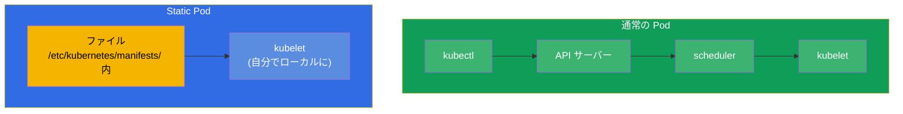
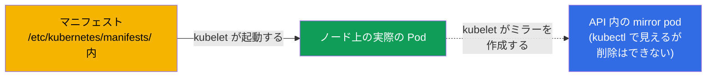
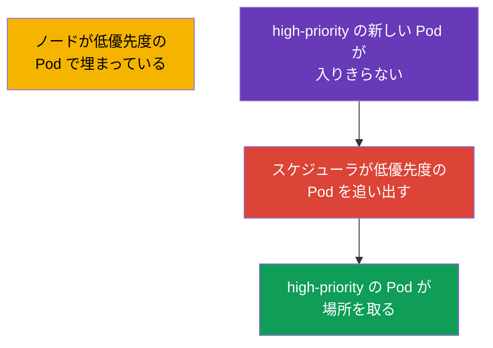
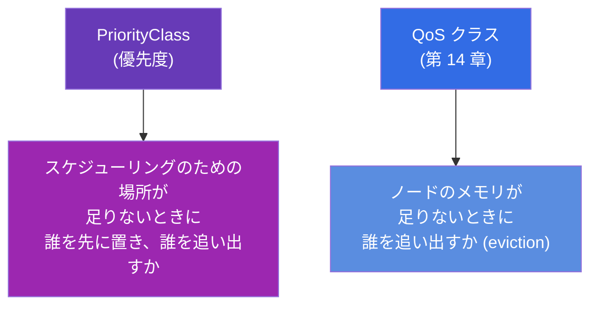
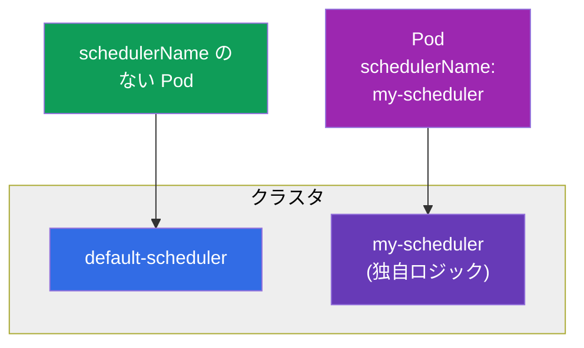

[Русская версия](ru.md) · [Eng version](README.md) · [Versión en español](es.md) · [Version française](fr.md) · [Deutsche Version](de.md) · [ქართული ვერსია](ge.md) · [繁體中文版](tw.md)

# 第 15 章。Static Pods、PriorityClass、複数のスケジューラ

> **次は何か。** CKA によく出てくる 3 つのテーマで、スケジューリングのブロックを
> 締めくくります。**Static Pods** - control plane を通さず kubelet が直接管理する Pod
> です（control plane 自身のコンポーネントはまさにこの方法で起動されます！）。
> **PriorityClass** - Pod の優先度と、リソース不足時の追い出し (preemption) です。
> **複数のスケジューラ** - 自分のスケジューラをどう起動して使うか。最初の 2 つのテーマは
> troubleshooting のためにも、クラスタがそもそもどう組み立てられているかを理解する
> ためにも重要です。

## 15.1. Static Pods：kubelet が管理する Pod

通常の Pod は API サーバーとスケジューラを通ります（第 2 章）。**Static Pod** は例外で、
**特定のノードの kubelet が直接** 管理し、ローカルのフォルダからマニフェストを読みます。
API サーバーもスケジューラも、これには関与しません。



kubelet はフォルダ（通常は `/etc/kubernetes/manifests/`、パスはその設定の
`staticPodPath` パラメータで指定）を監視します。そこに Pod の YAML を置けば kubelet が
起動します。ファイルを変更すれば再作成し、削除すれば停止します。

```bash
# static pod のマニフェストのパスを調べる
grep staticPodPath /var/lib/kubelet/config.yaml
# 通常: /etc/kubernetes/manifests
```

## 15.2. ミラー Pod と、それが CKA で重要な理由

static pod は API サーバーを通さずに作られますが、kubelet はそれに対応する
**ミラー Pod (mirror pod)** を API 内に作ります - あなたが `kubectl get pods` で
見えるようにするためです。しかしこれは反映にすぎません：static pod を
`kubectl delete` で削除することは **できません** - kubelet がすぐにファイルから
作り直します。static pod をなくせるのは、そのマニフェストをフォルダから取り除いた
ときだけです。



**CKA での要点：** control plane のコンポーネント（第 2 章）- kube-apiserver、etcd、
scheduler、controller-manager - はまさにこの方法で起動されます。それらのマニフェストは
control plane ノードの `/etc/kubernetes/manifests/` にあり、修復もこれらのファイルを
編集して行います。static pod の名前にはノード名のサフィックスが付きます（たとえば
`kube-apiserver-master1`）。これが「control plane のコンポーネントを直せ」という課題の
鍵です。

> **マネージドクラスタ (EKS/GKE/AKS) ではどうか。** そこではこれらの static pod は
> 見えません - フィルタで隠されているからではなく、control plane が **あなたの
> クラスタの外** に置かれているからです。プロバイダーは apiserver、etcd、scheduler、
> controller-manager を自身のマネージドインフラ（AWS/Google/Azure の別アカウント）で
> 動かしており、そのノードにあなたはアクセスできません。外に提供されるのは
> マネージドな API エンドポイントだけです。そのため `kubectl get nodes` には
> worker ノードしか見えず、`kube-system` にはノードレベルのコンポーネントとアドオン
> (`kube-proxy`、`coredns`、`aws-node` のような CNI) だけがあり、control plane の
> コンポーネント自身はありません。それらの保守と更新はプロバイダーが行い、ログは
> 間接的にしか得られません（たとえば EKS の CloudWatch への control plane logging）。
> 「`/etc/kubernetes/manifests/` のマニフェスト経由でコンポーネントを直す」方法は
> self-managed クラスタ (kubeadm) で使えます - CKA 試験はまさにそういう環境です。

## 15.3. static pod の作り方

ノード上の必要なフォルダに Pod のマニフェストを置くだけです：

```bash
# ノード上で
cat > /etc/kubernetes/manifests/my-static.yaml <<EOF
apiVersion: v1
kind: Pod
metadata:
  name: my-static
spec:
  containers:
  - name: nginx
    image: nginx
EOF
# kubelet が自分でファイルを拾い、Pod は数秒後に現れる
kubectl get pods -o wide       # my-static-<ノード名> が見える
```

static pod は、Pod が **control plane より前に、そして control plane とは独立して**
動く必要がある場所で使われます - まず第一に control plane 自身のためです。通常の
アプリケーションには必要ありません - そちらには DaemonSet/Deployment があります。

## 15.4. PriorityClass：Pod の優先度

全員にリソースが足りないとき、誰がより重要でしょうか。**PriorityClass** は Pod の
数値の優先度を指定します。優先度の高い Pod は先にスケジュールされ、リソース不足の
ときには優先度の低い Pod を **追い出す (preempt)** ことができます。

```yaml
apiVersion: scheduling.k8s.io/v1
kind: PriorityClass
metadata:
  name: high-priority
value: 1000000              # 大きいほど重要
globalDefault: false
description: "クリティカルなサービス向け"
```

Pod での使い方：

```yaml
spec:
  priorityClassName: high-priority
```



追い出し (preemption) はこう動きます：優先度の高い Pod が入りきらない場合、スケジューラは
適したノード上で優先度の低い Pod を見つけて削除し、場所を空けます。追い出された Pod は
別のノードへ移ろうとします。

クラスタ内で目にする組み込みのシステム優先度：

| PriorityClass | 値 | 用途 |
|---------------|----------|----------|
| `system-cluster-critical` | 2000000000 | クラスタのクリティカルなコンポーネント |
| `system-node-critical` | 2000001000 | ノードレベルのコンポーネント（最高） |

> **globalDefault。** PriorityClass に `globalDefault: true` が設定されていると、
> 明示的な `priorityClassName` を持たないすべての Pod に適用されます。デフォルトの
> Pod の優先度は 0 です。

## 15.5. PriorityClass と QoS：混同しないこと

似ている 2 つのテーマですが、別のことについて話しています：



- **PriorityClass** はスケジューリングの問題を決めます：重要な Pod を配置するために、
  誰を先に置き、誰を追い出すか。
- **QoS**（requests/limits から決まる）は、すでに動いているノードでメモリが足りなく
  なったときの生存の問題を決めます：kubelet が誰を最初に追い出すか。

どちらも「誰がより重要か」ですが、段階が違います：優先度は配置のとき、QoS は
eviction のときです。

### ケース：高い優先度 ≠ 追い出しからの保護

優先度と QoS が **独立** していることを実感するために、2 つの Pod を見てみましょう：

- **Pod A** - `priorityClassName` が高い（たとえば `1000000`）が、**BestEffort**：
  requests/limits がまったく設定されていません。
- **Pod B** - 優先度は低い（`0`、デフォルト）が、**Guaranteed**：CPU とメモリで
  `requests == limits` です。

2 つの異なる状況での運命は **正反対** になります。

**状況 1：Pod A をスケジュールする場所が足りない (preemption)。** ここで動くのは
スケジューラで、見るのは **優先度だけ** です - QoS は犠牲の選択にまったく関与しません。
Pod A のほうが重要なので、それのための場所がなければ、スケジューラは優先度の低い
Pod B を **追い出す (preempt)** ことができます - B が Guaranteed であることに
関わらずです（Guaranteed QoS は追い出しから守ってくれません）。B は殺されて別のノードを
探しに行き、A は配置されます。つまりスケジューリングの段階では A の高い優先度が
勝ちます。

**状況 2：ノードで物理的にメモリが尽きる (node-pressure eviction)。** 今度は決めるのは
**kubelet** で、主な基準は **requests に対する消費量**、つまり優先度ではなく QoS です。
kubelet はまず自分の requests を超えて食べている者を追い出します。BestEffort
(requests = 0) はすぐにこのグループに入り、requests の範囲内で生きている Guaranteed は
もっとも保護されたグループに入ります。そのため Pod A (BestEffort) は優先度が高いにも
かかわらず **最初に** 追い出され、Pod B (Guaranteed) は生き残ります。ここで優先度は
二次的な基準としてしか働きません - 同じグループの内部で他の条件が等しいときです。

結論：高い PriorityClass は **ノードに入り、スケジューリングで場所を確保する** のに
役立ちますが、メモリ不足時の追い出しからは **守りません** - そこで助けになるのは
Guaranteed QoS (`requests == limits`) です。本当にクリティカルなサービスには
**その両方** が必要です：高い優先度と Guaranteed です。

### ケース：優先度が同じで両方 Guaranteed の 2 つの Pod - どちらが先に殺されるか

では両方の Pod が「格付け」で完全に等しい場合 - 同じ `priorityClassName` で、両方
Guaranteed のとき - はどうでしょうか。そのときは優先度も QoS グループも両者を区別
できなくなり、node-pressure eviction の第 3 の基準が働きます：**requests に対する
消費量** です。kubelet は「requests の超過 → Priority → 消費が requests をどれだけ
上回っているか」という連鎖で追い出す Pod を順位付けします。最初の 2 つが等しいときは
最後のものが決め、自分の request に対して **より多く** 消費している者（いわば「より
貪欲な」者）が先に去ります。つまり他の条件が等しいなら、メモリを食う量の多い Pod が
死にます。

まさに Guaranteed について重要な細かい点：

- **自分の limit が自分の死。** Guaranteed では `requests == limits` です。コンテナが
  自分のメモリ limit にぶつかれば、OOM-killer が **個別に** 殺します (`OOMKilled`)。
  隣の Pod とは関係ありません - これは「2 つのうちどちらを選ぶか」ではなく、自分自身の
  上限の超過です。
- **Node-pressure は最後の手段。** Guaranteed の Pod が追い出されるのは最後で、通常は
  ノードのシステムデーモン（kubelet、コンテナランタイム）にすでにメモリが足りなく
  なったときだけであり、隣人のせいではありません。カーネルのレベルではメモリが尽きた
  とき OOM-killer は `oom_score` を見ます（Guaranteed はもっとも「保護された」値です）。
  そして同じクラスの中では、より多くのメモリを消費しているプロセスを殺します。

実践的な結論：形式的な条件が等しいとき、「ヒューズ」になるのは実際の消費量です - だから
こそクリティカルな Guaranteed の Pod でも、requests は「余裕を見て」ではなく実際の
ピークに近い値にすることが重要です。

## 15.6. 複数のスケジューラ

デフォルトでは Pod を配るのは `default-scheduler` です。しかし **自分の** スケジューラ
（独自のノード選択ロジックを持つ）を起動して、どのスケジューラに配置させるかを Pod に
指定できます。

```yaml
spec:
  schedulerName: my-scheduler    # この Pod はカスタムスケジューラが配置する
```



Pod が存在しない `schedulerName` を指定すると、その Pod は永久に `Pending` のまま
残ります - 誰も拾ってくれません。これもデバッグ時の Pending のあり得る原因の 1 つです。

「別の」スケジューリング挙動を得る方法は 2 つあり、どちらを選ぶかは工数で判断する
ことが大切です。

### 選択肢 1（軽い）：標準スケジューラの Scheduler Profiles

ほとんどの場合、別のバイナリは必要ありません - **スケジューラのプロファイル** で
足ります。同じ `kube-scheduler` が複数の **プロファイル** を持てて、それぞれに独自の
`schedulerName` と、有効/無効にしたプラグインとその重みのセットがあります。Pod は
同じ `spec.schedulerName` フィールドでプロファイルを選びます。

プロファイルは `KubeSchedulerConfiguration`（kube-scheduler が読むファイル）で
指定します：

```yaml
apiVersion: kubescheduler.config.k8s.io/v1
kind: KubeSchedulerConfiguration
profiles:
  - schedulerName: default-scheduler        # 通常の挙動
  - schedulerName: bin-packing              # 独自の名前 — Pod がこれを指定する
    pluginConfig:
      - name: NodeResourcesFit
        args:
          scoringStrategy:
            type: MostAllocated              # 均等配分ではなく密な詰め込み
```

ここでは `MostAllocated` が `bin-packing` プロファイルにノードをより密に詰め込ませます
（ノード数の節約）。一方、標準の `LeastAllocated` は Pod を均等に散らします。Pod は
`schedulerName: bin-packing` を指定するだけでこのプロファイルに配置され、それ以外は
これまでどおり動き続けます。プロセスは 1 つ、余分なデプロイもなしです。

**手順で見る適用方法**（self-managed / kubeadm、`kube-scheduler` が control plane の
static pod である場合）：

1. **設定ファイルを作る。** control plane ノードに、たとえば
   `/etc/kubernetes/sched-config.yaml` を作り、`KubeSchedulerConfiguration`（上のとおり）
   とスケジューラの kubeconfig の指定を書きます：

   ```yaml
   apiVersion: kubescheduler.config.k8s.io/v1
   kind: KubeSchedulerConfiguration
   clientConnection:
     kubeconfig: /etc/kubernetes/scheduler.conf   # スケジューラ自身の kubeconfig
   profiles:
     - schedulerName: default-scheduler
     - schedulerName: bin-packing
       pluginConfig:
         - name: NodeResourcesFit
           args:
             scoringStrategy:
               type: MostAllocated
   ```

2. **ファイルをスケジューラに渡す。** `--config` フラグ経由です。static pod の
   マニフェスト `/etc/kubernetes/manifests/kube-scheduler.yaml` を編集し、引数を追加して
   ホストのファイルを Pod の内部にマウントします：

   ```yaml
   spec:
     containers:
     - command:
       - kube-scheduler
       - --config=/etc/kubernetes/sched-config.yaml   # + 競合する古いフラグは削除する
       volumeMounts:
       - name: sched-config
         mountPath: /etc/kubernetes/sched-config.yaml
         readOnly: true
     volumes:
     - name: sched-config
       hostPath:
         path: /etc/kubernetes/sched-config.yaml
         type: File
   ```

3. **kubelet が自分で** スケジューラの Pod を再起動します（これは static pod で、
   マニフェストの編集に反応します）。エラーなく立ち上がったか確認します：

   ```bash
   kubectl -n kube-system get pod -l component=kube-scheduler
   kubectl -n kube-system logs kube-scheduler-<node>    # "profiles" と設定エラーがないことを探す
   ```

4. **プロファイルの動作を確認する：** `schedulerName: bin-packing` の Pod を作り、
   `Running` になったこと、イベントでまさにこのプロファイルが割り当てたことを見ます：

   ```bash
   kubectl run t --image=nginx --overrides='{"spec":{"schedulerName":"bin-packing"}}'
   kubectl get event --field-selector involvedObject.name=t | grep -i scheduled
   ```

> **マネージド** クラスタ (EKS/GKE/AKS) ではスケジューラの設定変更はできません -
> control plane が閉じられています（15.2 の囲みを参照）。そこではカスタムな
> スケジューリングは、クラスタ内にデプロイした独自のスケジューラでのみ行います
> （選択肢 2）。

**プロファイルで他に指定できること。** プロファイルは `schedulerName` だけではなく、
スケジューリングの挙動そのものを設定します：

- **フェーズ (extension points) ごとにプラグインを有効/無効にする。** スケジューリングには
  段階があります：`queueSort`、`preFilter`、`filter`、`postFilter`、`preScore`、`score`、
  `reserve`、`permit`、`preBind`、`bind`、`postBind`。`plugins` ブロックでは各段階について
  `enabled`/`disabled` にプラグインを列挙できます（たとえば 1 つのプロファイルで score の
  段階の `PodTopologySpread` を無効にする）。
- **score プラグインの重み。** `score` フェーズのプラグインには `weight` があり、それを
  変えることでノードの最終スコアを組み替えます（たとえば `ImageLocality` を強めて、
  イメージがすでにダウンロードされている場所へ Pod を置きやすくする）。
- **プラグインの引数 (`pluginConfig`)。** 具体的なプラグインの細かい調整です：
  - `NodeResourcesFit` - スコアリング戦略 (`LeastAllocated`/`MostAllocated`/
    `RequestedToCapacityRatio`) とリソースの重み。
  - `PodTopologySpread` - `defaultConstraints`（トポロジー分散のデフォルト値）。
  - `InterPodAffinity` - `hardPodAffinityWeight`。
  - `NodeAffinity` - `addedAffinity`（プロファイルのすべての Pod に affinity ルールを追加）。
  - `DefaultPreemptionArgs`、`VolumeBinding` など。
- **複数のプロファイルを同時に** - それぞれに独自の `schedulerName` と独自の
  プラグイン/重みのセット。Pod は `schedulerName` フィールドで必要なものを選びます。
  制約：`queueSort` プラグインはすべてのプロファイルで同じでなければなりません。
- **スケジューラのグローバルパラメータ**（プロファイルの内部ではなく、同じファイルで
  指定します）：`percentageOfNodesToScore`（いくつのノードを評価するか - 大きな
  クラスタでの速度と品質の妥協点）、`parallelism`、`podMaxBackoffSeconds` など。

### 選択肢 2（重い）：別プロセスとしての独自スケジューラ

プラグインでは表現できないロジックが必要なら、**2 つめのスケジューラ** を起動します -
`kube-system` の通常の Deployment としてです。それには独自の ServiceAccount と RBAC
（ノード、Pod、イベント、leader election 用のリースへのアクセス）が必要です。
おおまかには：

```yaml
apiVersion: apps/v1
kind: Deployment
metadata:
  name: my-scheduler
  namespace: kube-system
spec:
  replicas: 1
  selector:
    matchLabels: {app: my-scheduler}
  template:
    metadata:
      labels: {app: my-scheduler}
    spec:
      serviceAccountName: my-scheduler        # + 必要な権限を持つ ClusterRole/ClusterRoleBinding
      containers:
      - name: kube-scheduler
        image: registry.k8s.io/kube-scheduler:v1.34.0   # またはカスタムプラグイン入りの独自バイナリ
        command:
        - kube-scheduler
        - --config=/etc/kubernetes/my-scheduler-config.yaml   # ここに独自の schedulerName
        # ...KubeSchedulerConfiguration の ConfigMap をマウントする
```

これ以降、`spec.schedulerName: my-scheduler` の Pod はまさにそれが配置します。両方の
スケジューラは並行して動きます。大事なのは、同じ Pod を「取り合わない」ことです
（それぞれ `schedulerName` で自分のものだけを取ります）。

### 本当に必要になるのはどんなときか

実務では 2 つめのスケジューラはまれで、多くはプロファイルや通常の
affinity/taints/topologySpread（第 12-13 章）で足ります。現実的な理由：

- **Batch/ML と gang scheduling。** Pod のセットが「全部か無しか」で起動しなければ
  ならないタスク（分散学習、Spark/MPI）には co-scheduling が必要で、それを提供するのは
  Volcano、Apache YuniKorn、coscheduling プラグインです。標準のスケジューラは Pod を
  1 つずつ配置するので、半分だけ起動したタスクによるデッドロックにつながることが
  あります。
- **節約のための密な詰め込み。** Bin-packing (`MostAllocated`) はノードを詰めて、
  オートスケーラーが余分なノードを落とせるようにします - 直接的な節約です。これは
  まさにバイナリではなくプロファイルの案件です。
- **特殊なハードウェアとトポロジー。** NUMA、GPU トポロジー、ネットワーク的な近さ、
  レイテンシ要件の考慮 - 標準のプラグインでは足りないとき。
- **マルチテナンシーと公平な分け合い。** 独自の公平性ポリシーを持つチーム間のクォータと
  キュー (YuniKorn、Volcano queues)。
- **独自のドメインロジック。** 既存のラベルや述語では表現できない配置ルール。

実践的なルール：まずプロファイルか affinity で課題を解こうとし、別のスケジューラを
持ち出すのは原理的に別のロジックが必要なときだけです（まず第一に batch/ML の gang
scheduling）。試験のためには次を知っていれば十分です：スケジューリングの挙動は
プロファイルか独自のスケジューラで変え、Pod は `schedulerName` フィールドでそれに
結び付ける、ということです。

## 15.7. 本番環境でこれをどう使うか

- **Static pods は control plane 向けだけ。** 本番での static pod は、動く API が
  現れるまで kubeadm が control plane のコンポーネントを立ち上げて保持するための手段
  です。アプリケーションのワークロードには使いません - そちらは DaemonSet/Deployment
  です。「control plane = `/etc/kubernetes/manifests/` の static pods」と知っていることが、
  その保守と修復の土台です。
- **クリティカルなサービスを守る PriorityClass。** 本番ではクリティカルなコンポーネント
  （モニタリング、ingress、システムサービス）に高い優先度を割り当てて、リソース不足の
  ときに追い出されるのが自分たちではなく、より重要でないバックグラウンドのタスクに
  なるようにします。逆に batch のワークロードには低い優先度を与えます - 追い出しても
  惜しくないからです。
- **preemption には注意。** 多くの Pod に無思慮に高い優先度を付けると「追い出し戦争」と
  不安定さにつながります。優先度はクラスタ全体のレベルで考え抜きます。
- **カスタムスケジューラはまれ。** 独自のスケジューラを書くのは特殊なケース（たとえば
  HPC、特別な配置ルール）です。多くは第 12-13 章の affinity/taints/topologySpread で
  足ります。ただし `schedulerName` について知っておくのは有用です：誤った値は永遠の
  Pending の原因です。

## 15.8. ミニ用語集

- **Static Pod** - API サーバーとスケジューラを通さず、ローカルのマニフェストから
  kubelet が直接管理する Pod。
- **staticPodPath** - kubelet が監視するフォルダ（通常は `/etc/kubernetes/manifests/`）。
- **Mirror Pod（ミラー Pod）** - API 内の static pod の反映。見えるが kubectl では
  削除できない。
- **PriorityClass** - Pod の数値の優先度を持つオブジェクト。
- **Preemption（追い出し）** - より優先度の高い Pod を配置するために、優先度の低い Pod を
  削除すること。
- **globalDefault** - 明示的な優先度を持たない Pod に適用される PriorityClass。
- **schedulerName** - どのスケジューラが Pod を配置するか。
- **Scheduler Profiles** - 1 つのスケジューラの中の複数の設定。

## 15.9. 本章のまとめ

- Static Pod は API サーバーとスケジューラを通さず、`/etc/kubernetes/manifests/` の
  フォルダから kubelet が直接管理します。変更はファイルの編集で行います。
- static pod には API 内にミラー Pod が作られます（kubectl で見える）が、それを kubectl で
  削除することはできません - マニフェストを取り除くしかありません。
- control plane のコンポーネント (apiserver、etcd、scheduler、controller-manager) は
  static pods です。だからこそその直し方もこうなります。
- PriorityClass は数値の優先度を指定します。優先度の高い Pod は先にスケジュールされ、
  場所が足りないときには優先度の低い Pod を追い出せます (preempt)。
- PriorityClass（スケジューリング/追い出し）と QoS（メモリ不足時の eviction）は別の
  段階の話です。混同しないこと。
- 複数のスケジューラを起動して `schedulerName` で選べます。誤った名前 = 永遠の Pending
  です。

## 15.10. これがどう役に立つか：試験と実際の仕事で

**試験では。** 「ノードに static pod を作れ」「control plane のコンポーネントを直せ」
（`/etc/kubernetes/manifests/` のマニフェスト経由）「PriorityClass を作って Pod に
割り当てろ」は CKA の典型的な課題です。static pods の理解は troubleshooting の領域に
直接必要です。存在しないスケジューラを指す `schedulerName` は Pending の原因の 1 つです。

**実際の仕事では。** static pods は control plane が物理的にどう生きているかそのもので、
それを知っていることが保守の土台です。PriorityClass はリソース不足時の追い出しから
クリティカルなサービスを守り、何を犠牲にできるかを決めます。これは負荷のかかった
クラスタ全体の安定性に影響します。

## 15.11. 自己チェックの質問

1. static pod は作成の経路の点で通常の Pod とどう違いますか？
2. なぜ static pod は `kubectl delete` で削除できないのですか。どうやって取り除きますか？
3. static pods と control plane のコンポーネントはどう関係していますか。マニフェストは
   どこにありますか？
4. PriorityClass は何をしますか。追い出し (preemption) はどう動きますか？
5. PriorityClass は QoS クラスと目的の点でどう違いますか？
6. Pod を特定のスケジューラに向けるにはどうしますか。`schedulerName` が誤っていると
   どうなりますか？
7. PriorityClass の `globalDefault: true` は何を意味しますか？

## 演習

スケジューリングは終わりました。第 16 章はパート 2 の最後のテーマ：ワークロードの
オートスケーリング (HPA) で、Deployment のレプリカが負荷に応じて自動的に変わります。
Static pods と PriorityClass はクラスタとスケジューリングのラボで練習します。

🧪 ラボ 117（static pod のデバッグも含む）: [tasks/cka/labs/117](../../labs/117/README_JP.MD)

🧪 ラボ 122（PriorityClass のドリルも含む）: [tasks/cka/labs/122](../../labs/122/README_JP.MD)

🎮 Killercoda（ブラウザ内、セットアップ不要）：[Priority Class](https://killercoda.com/chadmcrowell/course/cka/priority-class)

---
[目次](../README_JP.md) · [第 14 章](../14/jp.md) · [第 16 章](../16/jp.md)
