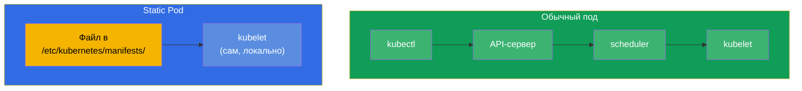
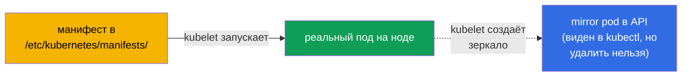
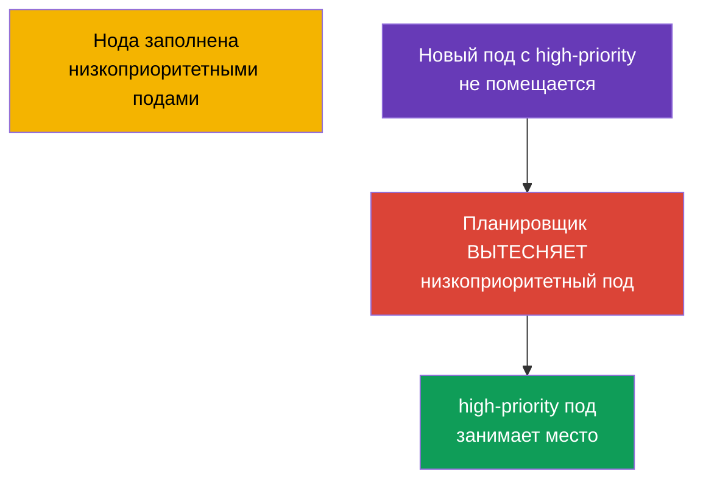
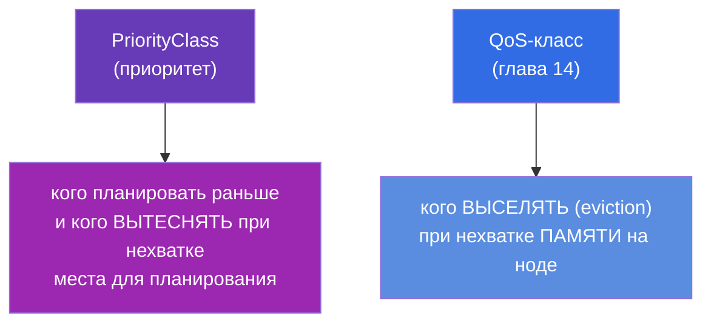
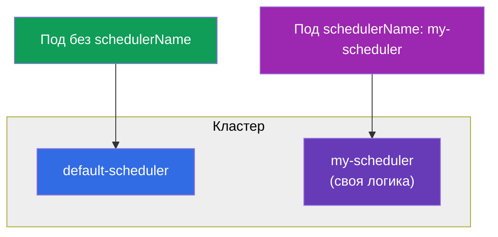

# Глава 15. Static Pods, PriorityClass и несколько планировщиков

> **Что дальше.** Закрываем блок планирования тремя темами, которые часто встречаются на
> CKA. **Static Pods** - поды, которыми управляет kubelet напрямую, минуя control plane
> (именно так запускаются компоненты самого control plane!). **PriorityClass** -
> приоритеты подов и вытеснение (preemption) при нехватке ресурсов. **Несколько
> планировщиков** - как запустить и использовать свой планировщик. Первые две темы важны
> и для troubleshooting, и для понимания, как вообще собран кластер.

## 15.1. Static Pods: поды под управлением kubelet

Обычный под проходит через API-сервер и планировщик (глава 2). **Static Pod** - исключение:
им управляет **kubelet конкретной ноды напрямую**, читая манифест из локальной папки. Ни
API-сервер, ни планировщик в этом не участвуют.



kubelet следит за папаой (обычно `/etc/kubernetes/manifests/`, путь задан в его конфиге
параметром `staticPodPath`). Положили туда YAML пода - kubelet его запускает. Изменили
файл - пересоздаёт. Удалили - останавливает.

```bash
# Узнать путь к манифестам static pod
grep staticPodPath /var/lib/kubelet/config.yaml
# обычно: /etc/kubernetes/manifests
```

## 15.2. Зеркальные поды и почему это важно для CKA

Хотя static pod создаётся минуя API-сервер, kubelet создаёт для него **зеркальный под
(mirror pod)** в API - чтобы вы видели его через `kubectl get pods`. Но это только
отражение: удалить static pod через `kubectl delete` **нельзя** - kubelet тут же
пересоздаст его из файла. Убрать static pod можно, только убрав его манифест из папки.



**Главное для CKA:** именно так запускаются компоненты control plane (глава 2) -
kube-apiserver, etcd, scheduler, controller-manager. Их манифесты лежат в
`/etc/kubernetes/manifests/` на control plane ноде, и чинят их, редактируя эти файлы. Имя
static pod получает суффикс имени ноды (например, `kube-apiserver-master1`). Это ключ к
заданиям «почини компонент control plane».

## 15.3. Как создать static pod

Просто положить манифест пода в нужную папку на ноде:

```bash
# на ноде
cat > /etc/kubernetes/manifests/my-static.yaml <<EOF
apiVersion: v1
kind: Pod
metadata:
  name: my-static
spec:
  containers:
  - name: nginx
    image: nginx
EOF
# kubelet подхватит файл сам, под появится через несколько секунд
kubectl get pods -o wide       # увидим my-static-<имя-ноды>
```

Static pod'ы применяются там, где под должен работать **до и независимо от control
plane** - в первую очередь для самого control plane. Обычным приложениям они не нужны -
для них есть DaemonSet/Deployment.

## 15.4. PriorityClass: приоритеты подов

Когда ресурсов на всех не хватает, кто важнее? **PriorityClass** задаёт числовой
приоритет подов. Более приоритетные поды планируются раньше и при нехватке ресурсов могут
**вытеснить (preempt)** менее приоритетные.

```yaml
apiVersion: scheduling.k8s.io/v1
kind: PriorityClass
metadata:
  name: high-priority
value: 1000000              # чем больше, тем важнее
globalDefault: false
description: "Для критичных сервисов"
```

Использование в поде:

```yaml
spec:
  priorityClassName: high-priority
```



Как работает вытеснение (preemption): если высокоприоритетный под не помещается,
планировщик находит на подходящей ноде поды с меньшим приоритетом и удаляет их,
освобождая место. Вытесненные поды пытаются переехать на другие ноды.

Встроенные системные приоритеты, которые вы увидите в кластере:

| PriorityClass | Значение | Для чего |
|---------------|----------|----------|
| `system-cluster-critical` | 2000000000 | критичные компоненты кластера |
| `system-node-critical` | 2000001000 | компоненты уровня ноды (наивысший) |

> **globalDefault.** Если у PriorityClass стоит `globalDefault: true`, он применяется ко
> всем подам без явного `priorityClassName`. По умолчанию приоритет подов - 0.

## 15.5. PriorityClass и QoS: не путать

Две похожие темы, но про разное:



- **PriorityClass** решает вопрос планирования: кого ставить раньше и кого вытеснить,
  чтобы разместить важный под.
- **QoS** (из requests/limits) решает вопрос выживания при нехватке памяти на уже
  работающей ноде: кого kubelet выселит первым.

Оба про «кто важнее», но на разных этапах: приоритет - при размещении, QoS - при eviction.

## 15.6. Несколько планировщиков

По умолчанию поды разводит `default-scheduler`. Но можно запустить **свой** планировщик
(со своей логикой выбора нод) и указывать поду, каким планировщиком его размещать.

```yaml
spec:
  schedulerName: my-scheduler    # этот под разведёт кастомный планировщик
```



Если под указывает несуществующий `schedulerName`, он навсегда останется в `Pending` -
никто его не подберёт. Это ещё одна возможная причина Pending при отладке.

Более лёгкая альтернатива своему бинарнику - **Scheduler Profiles**: несколько
конфигураций поведения в рамках одного планировщика (разные плагины/веса), выбираемых по
`schedulerName`. Для экзамена достаточно знать оба варианта существуют.

## 15.7. Как это применяют в продакшене

- **Static pods - только под control plane.** В проде static pod'ы - это способ, которым
  kubeadm поднимает и держит компоненты control plane до появления работающего API. Для
  прикладных нагрузок их не используют - там DaemonSet/Deployment. Знание, что «control
  plane = static pods в `/etc/kubernetes/manifests/`», - основа их обслуживания и починки.
- **PriorityClass для защиты критичных сервисов.** В проде критичным компонентам
  (мониторинг, ingress, системные сервисы) назначают высокий приоритет, чтобы при
  нехватке ресурсов вытеснялись менее важные фоновые задачи, а не они. Batch-нагрузкам,
  наоборот, дают низкий приоритет - их не жалко вытеснить.
- **Осторожно с preemption.** Бездумно высокий приоритет у многих подов приводит к
  «войне вытеснений» и нестабильности. Приоритеты продумывают на уровне всего кластера.
- **Кастомные планировщики - редкость.** Свой планировщик пишут в специфических случаях
  (например, HPC, особые правила размещения). Чаще хватает affinity/taints/
  topologySpread из глав 12-13. Но знать про `schedulerName` полезно: неверное значение -
  причина вечного Pending.

## 15.8. Мини-глоссарий

- **Static Pod** - под, управляемый kubelet напрямую из локального манифеста, минуя
  API-сервер и планировщик.
- **staticPodPath** - папка, за которой следит kubelet (обычно `/etc/kubernetes/manifests/`).
- **Mirror Pod (зеркальный под)** - отражение static pod в API; виден, но не удаляется
  через kubectl.
- **PriorityClass** - объект с числовым приоритетом подов.
- **Preemption (вытеснение)** - удаление менее приоритетных подов ради размещения более
  приоритетного.
- **globalDefault** - PriorityClass, применяемый к подам без явного приоритета.
- **schedulerName** - какой планировщик разводит под.
- **Scheduler Profiles** - несколько конфигураций в рамках одного планировщика.

## 15.9. Итоги главы

- Static Pod управляется kubelet напрямую из папки `/etc/kubernetes/manifests/`, минуя
  API-сервер и планировщик; изменяется правкой файла.
- Для static pod создаётся зеркальный под в API (виден в kubectl), но удалить его через
  kubectl нельзя - только убрав манифест.
- Компоненты control plane (apiserver, etcd, scheduler, controller-manager) - это static
  pods; отсюда способ их чинить.
- PriorityClass задаёт числовой приоритет; высокоприоритетные поды планируются раньше и
  могут вытеснять (preempt) менее приоритетные при нехватке места.
- PriorityClass (планирование/вытеснение) и QoS (eviction при нехватке памяти) - про
  разные этапы, не путать.
- Можно запускать несколько планировщиков и выбирать их через `schedulerName`; неверное
  имя = вечный Pending.

## 15.10. Как это пригодится: на экзамене и в реальной работе

**На экзамене.** «Создай static pod на ноде», «почини компонент control plane» (через
манифест в `/etc/kubernetes/manifests/`), «создай PriorityClass и назначь поду» -
типовые задания CKA. Понимание static pods прямо нужно для домена troubleshooting.
`schedulerName` с несуществующим планировщиком - одна из причин Pending.

**В реальной работе.** Static pods - это то, как физически живёт control plane, и знание
этого - основа его обслуживания. PriorityClass защищает критичные сервисы от вытеснения
при нехватке ресурсов и определяет, что можно принести в жертву. Это влияет на
стабильность всего кластера под нагрузкой.

## 15.11. Вопросы для самопроверки

1. Чем static pod отличается от обычного пода по пути создания?
2. Почему static pod нельзя удалить через `kubectl delete` и как его убрать?
3. Как связаны static pods и компоненты control plane? Где лежат их манифесты?
4. Что делает PriorityClass и как работает вытеснение (preemption)?
5. Чем PriorityClass отличается от QoS-класса по назначению?
6. Как направить под на конкретный планировщик и что будет при неверном `schedulerName`?
7. Что означает `globalDefault: true` у PriorityClass?

## Практика

Мы закрыли планирование. В главе 16 - последняя тема части 2: автомасштабирование
нагрузок (HPA), где реплики Deployment меняются автоматически по нагрузке. Static pods и
PriorityClass отрабатываются в лабах по кластеру и планированию.

🧪 Лаба 117 (в т.ч. отладка статик-подов): [tasks/cka/labs/117](../../labs/117/README_RU.MD)

🧪 Лаба 122 (в т.ч. дрилл на PriorityClass): [tasks/cka/labs/122](../../labs/122/README_RU.MD)

---
[Оглавление](../README_RU.md) · [Глава 14](../14/ru.md) · [Глава 16](../16/ru.md)
