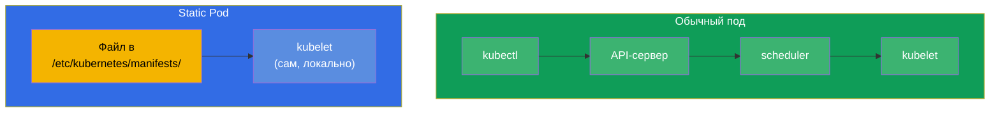
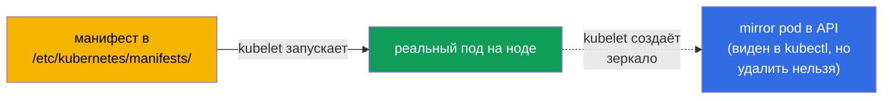
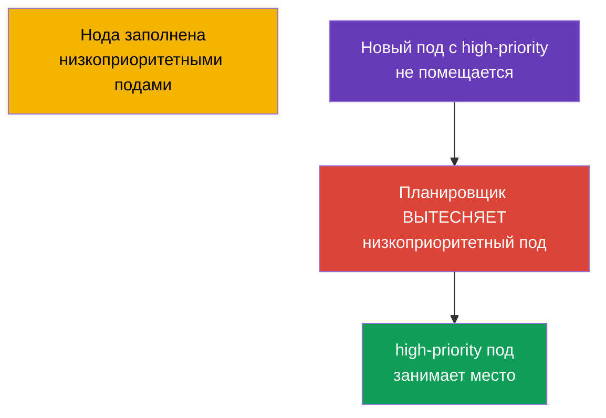
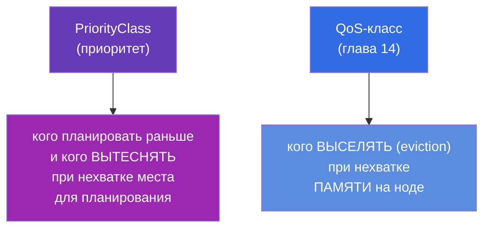
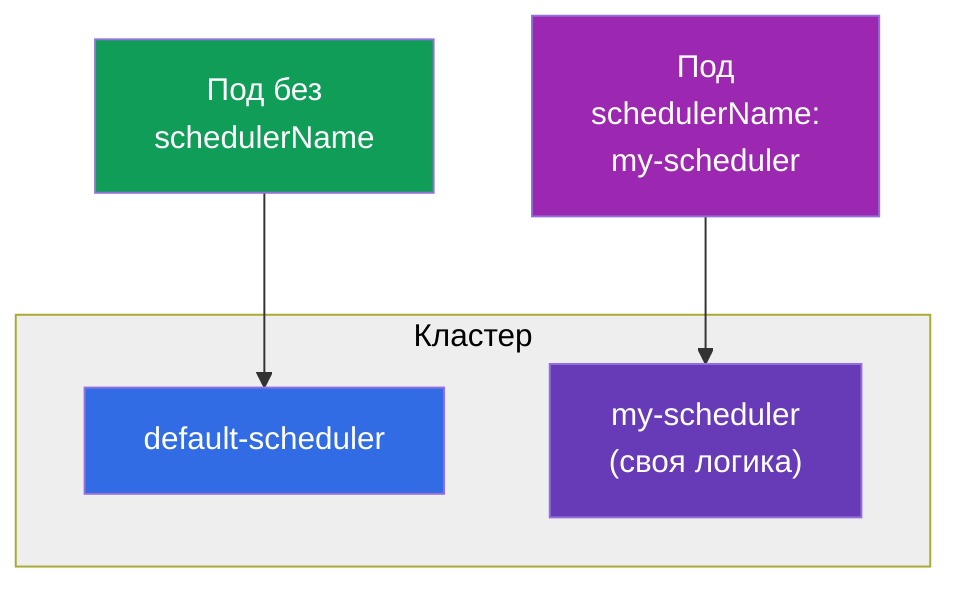

[Eng version](README.md) · [Versión en español](es.md) · [Version française](fr.md) · [Deutsche Version](de.md) · [ქართული ვერსია](ge.md)

# Глава 15. Static Pods, PriorityClass и несколько планировщиков

> **Что дальше.** Закрываем блок планирования тремя темами, которые часто встречаются на
> CKA. **Static Pods** - поды, которыми управляет kubelet напрямую, минуя control plane
> (именно так запускаются компоненты самого control plane!). **PriorityClass** -
> приоритеты подов и вытеснение (preemption) при нехватке ресурсов. **Несколько
> планировщиков** - как запустить и использовать свой планировщик. Первые две темы важны
> и для troubleshooting, и для понимания, как вообще собран кластер.

## 15.1. Static Pods: поды под управлением kubelet

Обычный под проходит через API-сервер и планировщик (глава 2). **Static Pod** - исключение:
им управляет **kubelet конкретной ноды напрямую**, читая манифест из локальной папки. Ни
API-сервер, ни планировщик в этом не участвуют.


```mermaid
flowchart TB
    subgraph Normal["Обычный под"]
        direction LR
        u["kubectl"] --> api1["API-сервер"] --> sched["scheduler"] --> kl1["kubelet"]
    end
    subgraph Static["Static Pod"]
        direction LR
        file["Файл в<br>/etc/kubernetes/manifests/"] --> kl2["kubelet<br>(сам, локально)"]
    end
    style Normal fill:#0f9d58,color:#fff
    style Static fill:#326ce5,color:#fff
    style u fill:#3cb371,color:#fff
    style api1 fill:#3cb371,color:#fff
    style sched fill:#3cb371,color:#fff
    style kl1 fill:#3cb371,color:#fff
    style file fill:#f4b400,color:#000
    style kl2 fill:#5a8de0,color:#fff
```

kubelet следит за папаой (обычно `/etc/kubernetes/manifests/`, путь задан в его конфиге
параметром `staticPodPath`). Положили туда YAML пода - kubelet его запускает. Изменили
файл - пересоздаёт. Удалили - останавливает.

```bash
# Узнать путь к манифестам static pod
grep staticPodPath /var/lib/kubelet/config.yaml
# обычно: /etc/kubernetes/manifests
```

## 15.2. Зеркальные поды и почему это важно для CKA

Хотя static pod создаётся минуя API-сервер, kubelet создаёт для него **зеркальный под
(mirror pod)** в API - чтобы вы видели его через `kubectl get pods`. Но это только
отражение: удалить static pod через `kubectl delete` **нельзя** - kubelet тут же
пересоздаст его из файла. Убрать static pod можно, только убрав его манифест из папки.


```mermaid
flowchart LR
    file["манифест в<br>/etc/kubernetes/manifests/"] -->|"kubelet запускает"| pod["реальный под на ноде"]
    pod -.->|"kubelet создаёт<br>зеркало"| mirror["mirror pod в API<br>(виден в kubectl, но<br>удалить нельзя)"]
    style file fill:#f4b400,color:#000
    style pod fill:#0f9d58,color:#fff
    style mirror fill:#326ce5,color:#fff
```

**Главное для CKA:** именно так запускаются компоненты control plane (глава 2) -
kube-apiserver, etcd, scheduler, controller-manager. Их манифесты лежат в
`/etc/kubernetes/manifests/` на control plane ноде, и чинят их, редактируя эти файлы. Имя
static pod получает суффикс имени ноды (например, `kube-apiserver-master1`). Это ключ к
заданиям «почини компонент control plane».

> **А в управляемых кластерах (EKS/GKE/AKS)?** Там этих static pod'ов вы не увидите -
> и не потому, что их скрыли фильтром, а потому что control plane вынесен **за пределы
> вашего кластера**. Провайдер запускает apiserver, etcd, scheduler и controller-manager
> в своей управляемой инфраструктуре (отдельный аккаунт AWS/Google/Azure), к нодам
> которой у вас нет доступа. Наружу отдаётся только управляемый API-endpoint. Поэтому в
> `kubectl get nodes` видны лишь worker-ноды, а в `kube-system` - только компоненты
> уровня ноды и аддоны (`kube-proxy`, `coredns`, CNI вроде `aws-node`), но не сами
> компоненты control plane. Их обслуживает и обновляет провайдер, а логи доступны лишь
> опосредованно (например, control plane logging в CloudWatch у EKS). Способ «починить
> компонент через манифест в `/etc/kubernetes/manifests/`» работает в self-managed
> кластерах (kubeadm) - на экзамене CKA именно такой.

## 15.3. Как создать static pod

Просто положить манифест пода в нужную папку на ноде:

```bash
# на ноде
cat > /etc/kubernetes/manifests/my-static.yaml <<EOF
apiVersion: v1
kind: Pod
metadata:
  name: my-static
spec:
  containers:
  - name: nginx
    image: nginx
EOF
# kubelet подхватит файл сам, под появится через несколько секунд
kubectl get pods -o wide       # увидим my-static-<имя-ноды>
```

Static pod'ы применяются там, где под должен работать **до и независимо от control
plane** - в первую очередь для самого control plane. Обычным приложениям они не нужны -
для них есть DaemonSet/Deployment.

## 15.4. PriorityClass: приоритеты подов

Когда ресурсов на всех не хватает, кто важнее? **PriorityClass** задаёт числовой
приоритет подов. Более приоритетные поды планируются раньше и при нехватке ресурсов могут
**вытеснить (preempt)** менее приоритетные.

```yaml
apiVersion: scheduling.k8s.io/v1
kind: PriorityClass
metadata:
  name: high-priority
value: 1000000              # чем больше, тем важнее
globalDefault: false
description: "Для критичных сервисов"
```

Использование в поде:

```yaml
spec:
  priorityClassName: high-priority
```


```mermaid
flowchart TB
    full["Нода заполнена<br>низкоприоритетными подами"]
    new["Новый под с high-priority<br>не помещается"]
    new --> preempt["Планировщик ВЫТЕСНЯЕТ<br>низкоприоритетный под"]
    preempt --> place["high-priority под<br>занимает место"]
    style full fill:#f4b400,color:#000
    style new fill:#673ab7,color:#fff
    style preempt fill:#db4437,color:#fff
    style place fill:#0f9d58,color:#fff
```

Как работает вытеснение (preemption): если высокоприоритетный под не помещается,
планировщик находит на подходящей ноде поды с меньшим приоритетом и удаляет их,
освобождая место. Вытесненные поды пытаются переехать на другие ноды.

Встроенные системные приоритеты, которые вы увидите в кластере:

| PriorityClass | Значение | Для чего |
|---------------|----------|----------|
| `system-cluster-critical` | 2000000000 | критичные компоненты кластера |
| `system-node-critical` | 2000001000 | компоненты уровня ноды (наивысший) |

> **globalDefault.** Если у PriorityClass стоит `globalDefault: true`, он применяется ко
> всем подам без явного `priorityClassName`. По умолчанию приоритет подов - 0.

## 15.5. PriorityClass и QoS: не путать

Две похожие темы, но про разное:


```mermaid
flowchart TB
    pc["PriorityClass<br>(приоритет)"] --> pcuse["кого планировать раньше<br>и кого ВЫТЕСНЯТЬ<br>при нехватке места<br>для планирования"]
    qos["QoS-класс<br>(глава 14)"] --> qosuse["кого ВЫСЕЛЯТЬ (eviction)<br>при нехватке<br>ПАМЯТИ на ноде"]
    style pc fill:#673ab7,color:#fff
    style qos fill:#326ce5,color:#fff
    style pcuse fill:#9c27b0,color:#fff
    style qosuse fill:#5a8de0,color:#fff
```

- **PriorityClass** решает вопрос планирования: кого ставить раньше и кого вытеснить,
  чтобы разместить важный под.
- **QoS** (из requests/limits) решает вопрос выживания при нехватке памяти на уже
  работающей ноде: кого kubelet выселит первым.

Оба про «кто важнее», но на разных этапах: приоритет - при размещении, QoS - при eviction.

### Кейс: высокий приоритет ≠ защита от выселения

Чтобы почувствовать, что приоритет и QoS **независимы**, разберём два пода:

- **Под A** - высокий `priorityClassName` (например, `1000000`), но **BestEffort**:
  requests/limits не заданы вообще.
- **Под B** - низкий приоритет (`0`, по умолчанию), но **Guaranteed**: `requests == limits`
  по CPU и памяти.

Их судьба в двух разных ситуациях **противоположна**.

**Ситуация 1: не хватает места, чтобы запланировать под A (preemption).** Здесь работает
планировщик и смотрит **только на приоритет** - QoS в выборе жертвы вообще не участвует.
Под A важнее, поэтому, если для него нет места, планировщик может **вытеснить (preempt)**
менее приоритетный под B - даже несмотря на то, что B гарантированный (Guaranteed QoS от
вытеснения не защищает). B будет убит и пойдёт искать другую ноду, а A - размещён. То
есть на этапе планирования выигрывает высокий приоритет A.

**Ситуация 2: на ноде физически кончается память (node-pressure eviction).** Теперь
решает **kubelet**, и главный критерий - **потребление относительно requests**, то есть
QoS, а не приоритет. Kubelet сначала выгоняет тех, кто ест сверх своих requests;
BestEffort (requests = 0) сразу попадает в эту группу, а Guaranteed, живущий в пределах
requests, - в самую защищённую. Поэтому под A (BestEffort) будет выселен **первым**, хотя
у него приоритет выше, а под B (Guaranteed) уцелеет. Приоритет здесь работает лишь как
вторичный критерий - при прочих равных внутри одной группы.

Вывод: высокий PriorityClass помогает **попасть на ноду и удержать место при
планировании**, но **не защищает** от выселения при нехватке памяти - там спасает
Guaranteed QoS (`requests == limits`). Для по-настоящему критичного сервиса нужно **и
то, и другое**: высокий приоритет и Guaranteed.

### Кейс: два пода с одинаковым приоритетом и Guaranteed - кого убьют первым?

А если оба пода полностью равны «по рангам» - одинаковый `priorityClassName` и оба
Guaranteed? Тогда и приоритет, и QoS-группа перестают их различать, и в дело вступает
третий критерий node-pressure eviction: **потребление относительно requests**. Kubelet
ранжирует поды к выселению по цепочке «превышение requests → Priority → насколько
потребление выше requests»; при равных первых двух решает последний - первым уйдёт тот,
кто потребляет **больше относительно своего request** (условно «жаднее»). Так что при
прочих равных гибнет более прожорливый по памяти под.

Важные нюансы именно для Guaranteed:

- **Свой лимит - своя смерть.** У Guaranteed `requests == limits`. Если контейнер сам
  упрётся в свой лимит памяти, его убивает OOM-killer **индивидуально** (`OOMKilled`),
  независимо от соседнего пода - это не «выбор между двумя», а превышение собственного
  потолка.
- **Node-pressure - крайний случай.** Guaranteed-поды выселяют в последнюю очередь и
  обычно лишь когда памяти не хватает уже системным демонам ноды (kubelet, среда
  выполнения), а не из-за соседей. На уровне ядра при исчерпании памяти OOM-killer
  ориентируется на `oom_score` (у Guaranteed он самый «защищённый»), а внутри одного
  класса убивает процесс, потребляющий больше памяти.

Практический вывод: когда формальные признаки равны, «предохранителем» становится
реальное потребление - поэтому даже критичным Guaranteed-подам важно ставить requests
близко к реальному пику, а не «про запас».

## 15.6. Несколько планировщиков

По умолчанию поды разводит `default-scheduler`. Но можно запустить **свой** планировщик
(со своей логикой выбора нод) и указывать поду, каким планировщиком его размещать.

```yaml
spec:
  schedulerName: my-scheduler    # этот под разведёт кастомный планировщик
```


```mermaid
flowchart TB
    subgraph Cluster["Кластер"]
        ds["default-scheduler"]
        ms["my-scheduler<br>(своя логика)"]
    end
    p1["Под без<br>schedulerName"] --> ds
    p2["Под<br>schedulerName:<br>my-scheduler"] --> ms
    style Cluster fill:#eeeeee,color:#000
    style ds fill:#326ce5,color:#fff
    style ms fill:#673ab7,color:#fff
    style p1 fill:#0f9d58,color:#fff
    style p2 fill:#9c27b0,color:#fff
```

Если под указывает несуществующий `schedulerName`, он навсегда останется в `Pending` -
никто его не подберёт. Это ещё одна возможная причина Pending при отладке.

Есть два способа получить «другое» поведение планирования, и выбирать между ними важно
по трудозатратам.

### Вариант 1 (лёгкий): Scheduler Profiles в штатном планировщике

В большинстве случаев отдельный бинарник не нужен - хватает **профилей планировщика**.
Один и тот же `kube-scheduler` может держать несколько **профилей**, каждый со своим
`schedulerName` и своим набором включённых/выключенных плагинов и их весов. Под выбирает
профиль тем же полем `spec.schedulerName`.

Профили задаются в `KubeSchedulerConfiguration` (файл, который читает kube-scheduler):

```yaml
apiVersion: kubescheduler.config.k8s.io/v1
kind: KubeSchedulerConfiguration
profiles:
  - schedulerName: default-scheduler        # обычное поведение
  - schedulerName: bin-packing              # своё имя — его укажут поды
    pluginConfig:
      - name: NodeResourcesFit
        args:
          scoringStrategy:
            type: MostAllocated              # плотная упаковка вместо равномерной
```

Здесь `MostAllocated` заставляет профиль `bin-packing` набивать ноды плотнее (экономия
на числе нод), тогда как штатный `LeastAllocated` раскидывает поды равномерно. Поду
достаточно указать `schedulerName: bin-packing` - и его разложит этот профиль, а всё
остальное продолжит работать как обычно. Один процесс, никакого лишнего развёртывания.

**Как это применить по шагам** (self-managed / kubeadm, где `kube-scheduler` - static
pod на control plane):

1. **Создать файл конфигурации** на control-plane ноде, например
   `/etc/kubernetes/sched-config.yaml`, с `KubeSchedulerConfiguration` (как выше) и
   указанием kubeconfig планировщика:

   ```yaml
   apiVersion: kubescheduler.config.k8s.io/v1
   kind: KubeSchedulerConfiguration
   clientConnection:
     kubeconfig: /etc/kubernetes/scheduler.conf   # kubeconfig самого планировщика
   profiles:
     - schedulerName: default-scheduler
     - schedulerName: bin-packing
       pluginConfig:
         - name: NodeResourcesFit
           args:
             scoringStrategy:
               type: MostAllocated
   ```

2. **Передать файл планировщику** через флаг `--config`. Правим манифест static pod
   `/etc/kubernetes/manifests/kube-scheduler.yaml`: добавляем аргумент и монтируем файл
   с хоста внутрь пода:

   ```yaml
   spec:
     containers:
     - command:
       - kube-scheduler
       - --config=/etc/kubernetes/sched-config.yaml   # + убрать конфликтующие старые флаги
       volumeMounts:
       - name: sched-config
         mountPath: /etc/kubernetes/sched-config.yaml
         readOnly: true
     volumes:
     - name: sched-config
       hostPath:
         path: /etc/kubernetes/sched-config.yaml
         type: File
   ```

3. **kubelet сам перезапустит** pod планировщика (это static pod - реагирует на правку
   манифеста). Проверяем, что поднялся без ошибок:

   ```bash
   kubectl -n kube-system get pod -l component=kube-scheduler
   kubectl -n kube-system logs kube-scheduler-<node>    # ищем "profiles" и отсутствие ошибок конфига
   ```

4. **Проверить работу профиля:** создаём под с `schedulerName: bin-packing` и смотрим, что
   он ушёл в `Running`, а в событиях назначил именно этот профиль:

   ```bash
   kubectl run t --image=nginx --overrides='{"spec":{"schedulerName":"bin-packing"}}'
   kubectl get event --field-selector involvedObject.name=t | grep -i scheduled
   ```

> В **управляемых** кластерах (EKS/GKE/AKS) правки конфигурации планировщика недоступны -
> control plane закрыт (см. врезку в 15.2). Там кастомное планирование делают только через
> собственный планировщик, развёрнутый в кластере (Вариант 2).

**Что ещё можно задать в профилях.** Профиль - это не только `schedulerName`; через него
настраивают само поведение планирования:

- **Включать/выключать плагины по фазам (extension points).** У планирования есть этапы:
  `queueSort`, `preFilter`, `filter`, `postFilter`, `preScore`, `score`, `reserve`,
  `permit`, `preBind`, `bind`, `postBind`. В блоке `plugins` для каждого этапа можно
  `enabled`/`disabled` перечислить плагины (например, отключить `PodTopologySpread` на
  этапе score в одном профиле).
- **Веса score-плагинов.** У плагинов фазы `score` есть `weight` - меняя их,
  перекраивают итоговую оценку нод (например, усилить `ImageLocality`, чтобы чаще сажать
  под туда, где образ уже скачан).
- **Аргументы плагинов (`pluginConfig`).** Тонкая настройка конкретных плагинов:
  - `NodeResourcesFit` - стратегия скоринга (`LeastAllocated`/`MostAllocated`/
    `RequestedToCapacityRatio`) и веса ресурсов;
  - `PodTopologySpread` - `defaultConstraints` (умолчания распределения по топологии);
  - `InterPodAffinity` - `hardPodAffinityWeight`;
  - `NodeAffinity` - `addedAffinity` (добавить всем подам профиля правило affinity);
  - `DefaultPreemptionArgs`, `VolumeBinding` и др.
- **Несколько профилей сразу** - каждому свой `schedulerName` и свой набор
  плагинов/весов; поды выбирают нужный полем `schedulerName`. Ограничение: плагин
  `queueSort` должен быть одинаковым во всех профилях.
- **Глобальные параметры планировщика** (задаются в том же файле, не внутри профиля):
  `percentageOfNodesToScore` (сколько нод оценивать - компромисс скорость/качество на
  больших кластерах), `parallelism`, `podMaxBackoffSeconds` и т.п.

### Вариант 2 (тяжёлый): собственный планировщик отдельным процессом

Если нужна логика, которую плагинами не выразить, запускают **второй планировщик** - как
обычный Deployment в `kube-system`. Ему нужны свой ServiceAccount и RBAC (доступ к нодам,
подам, событиям, лизам для leader election). Схематично:

```yaml
apiVersion: apps/v1
kind: Deployment
metadata:
  name: my-scheduler
  namespace: kube-system
spec:
  replicas: 1
  selector:
    matchLabels: {app: my-scheduler}
  template:
    metadata:
      labels: {app: my-scheduler}
    spec:
      serviceAccountName: my-scheduler        # + ClusterRole/ClusterRoleBinding с нужными правами
      containers:
      - name: kube-scheduler
        image: registry.k8s.io/kube-scheduler:v1.34.0   # или свой бинарник с кастомными плагинами
        command:
        - kube-scheduler
        - --config=/etc/kubernetes/my-scheduler-config.yaml   # тут свой schedulerName
        # ...монтируется ConfigMap с KubeSchedulerConfiguration
```

После этого поды с `spec.schedulerName: my-scheduler` будет разводить именно он. Оба
планировщика работают параллельно; главное - чтобы они не «дрались» за одни и те же поды
(каждый берёт только свои по `schedulerName`).

### Когда это действительно нужно

На практике второй планировщик - редкость; чаще хватает профилей или обычных
affinity/taints/topologySpread (глава 12-13). Реальные поводы:

- **Batch/ML и gang scheduling.** Задачам, где набор подов должен стартовать «всё или
  ничего» (распределённое обучение, Spark/MPI), нужен co-scheduling - его дают Volcano,
  Apache YuniKorn, coscheduling-плагин. Штатный планировщик размещает поды по одному и
  может привести к дедлоку из полузапущенных задач.
- **Плотная упаковка ради экономии.** Bin-packing (`MostAllocated`) уплотняет ноды, чтобы
  автоскейлер мог гасить лишние - прямая экономия. Это как раз случай профиля, а не
  бинарника.
- **Специальное железо и топология.** Учёт NUMA, GPU-топологии, сетевой близости,
  требований к задержкам - когда стандартных плагинов не хватает.
- **Мультиарендность и честный дележ.** Квоты и очереди между командами со своей
  политикой справедливости (YuniKorn, Volcano queues).
- **Своя доменная логика.** Правила размещения, которые нельзя выразить существующими
  метками и предикатами.

Практическое правило: сначала пытаются решить задачу профилем или affinity; отдельный
планировщик берут, только когда нужна принципиально другая логика (в первую очередь gang
scheduling для batch/ML). Для экзамена же достаточно знать: поведение планирования меняют
профилями или своим планировщиком, а под привязывают к нему полем `schedulerName`.

## 15.7. Как это применяют в продакшене

- **Static pods - только под control plane.** В проде static pod'ы - это способ, которым
  kubeadm поднимает и держит компоненты control plane до появления работающего API. Для
  прикладных нагрузок их не используют - там DaemonSet/Deployment. Знание, что «control
  plane = static pods в `/etc/kubernetes/manifests/`», - основа их обслуживания и починки.
- **PriorityClass для защиты критичных сервисов.** В проде критичным компонентам
  (мониторинг, ingress, системные сервисы) назначают высокий приоритет, чтобы при
  нехватке ресурсов вытеснялись менее важные фоновые задачи, а не они. Batch-нагрузкам,
  наоборот, дают низкий приоритет - их не жалко вытеснить.
- **Осторожно с preemption.** Бездумно высокий приоритет у многих подов приводит к
  «войне вытеснений» и нестабильности. Приоритеты продумывают на уровне всего кластера.
- **Кастомные планировщики - редкость.** Свой планировщик пишут в специфических случаях
  (например, HPC, особые правила размещения). Чаще хватает affinity/taints/
  topologySpread из глав 12-13. Но знать про `schedulerName` полезно: неверное значение -
  причина вечного Pending.

## 15.8. Мини-глоссарий

- **Static Pod** - под, управляемый kubelet напрямую из локального манифеста, минуя
  API-сервер и планировщик.
- **staticPodPath** - папка, за которой следит kubelet (обычно `/etc/kubernetes/manifests/`).
- **Mirror Pod (зеркальный под)** - отражение static pod в API; виден, но не удаляется
  через kubectl.
- **PriorityClass** - объект с числовым приоритетом подов.
- **Preemption (вытеснение)** - удаление менее приоритетных подов ради размещения более
  приоритетного.
- **globalDefault** - PriorityClass, применяемый к подам без явного приоритета.
- **schedulerName** - какой планировщик разводит под.
- **Scheduler Profiles** - несколько конфигураций в рамках одного планировщика.

## 15.9. Итоги главы

- Static Pod управляется kubelet напрямую из папки `/etc/kubernetes/manifests/`, минуя
  API-сервер и планировщик; изменяется правкой файла.
- Для static pod создаётся зеркальный под в API (виден в kubectl), но удалить его через
  kubectl нельзя - только убрав манифест.
- Компоненты control plane (apiserver, etcd, scheduler, controller-manager) - это static
  pods; отсюда способ их чинить.
- PriorityClass задаёт числовой приоритет; высокоприоритетные поды планируются раньше и
  могут вытеснять (preempt) менее приоритетные при нехватке места.
- PriorityClass (планирование/вытеснение) и QoS (eviction при нехватке памяти) - про
  разные этапы, не путать.
- Можно запускать несколько планировщиков и выбирать их через `schedulerName`; неверное
  имя = вечный Pending.

## 15.10. Как это пригодится: на экзамене и в реальной работе

**На экзамене.** «Создай static pod на ноде», «почини компонент control plane» (через
манифест в `/etc/kubernetes/manifests/`), «создай PriorityClass и назначь поду» -
типовые задания CKA. Понимание static pods прямо нужно для домена troubleshooting.
`schedulerName` с несуществующим планировщиком - одна из причин Pending.

**В реальной работе.** Static pods - это то, как физически живёт control plane, и знание
этого - основа его обслуживания. PriorityClass защищает критичные сервисы от вытеснения
при нехватке ресурсов и определяет, что можно принести в жертву. Это влияет на
стабильность всего кластера под нагрузкой.

## 15.11. Вопросы для самопроверки

1. Чем static pod отличается от обычного пода по пути создания?
2. Почему static pod нельзя удалить через `kubectl delete` и как его убрать?
3. Как связаны static pods и компоненты control plane? Где лежат их манифесты?
4. Что делает PriorityClass и как работает вытеснение (preemption)?
5. Чем PriorityClass отличается от QoS-класса по назначению?
6. Как направить под на конкретный планировщик и что будет при неверном `schedulerName`?
7. Что означает `globalDefault: true` у PriorityClass?

## Практика

Мы закрыли планирование. В главе 16 - последняя тема части 2: автомасштабирование
нагрузок (HPA), где реплики Deployment меняются автоматически по нагрузке. Static pods и
PriorityClass отрабатываются в лабах по кластеру и планированию.

🧪 Лаба 117 (в т.ч. отладка статик-подов): [tasks/cka/labs/117](../../labs/117/README_RU.MD)

🧪 Лаба 122 (в т.ч. дрилл на PriorityClass): [tasks/cka/labs/122](../../labs/122/README_RU.MD)

---
[Оглавление](../README_RU.md) · [Глава 14](../14/ru.md) · [Глава 16](../16/ru.md)
