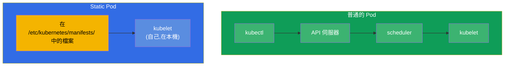
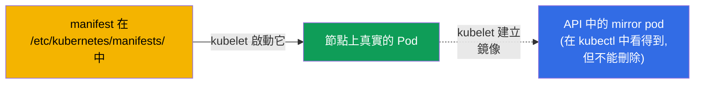
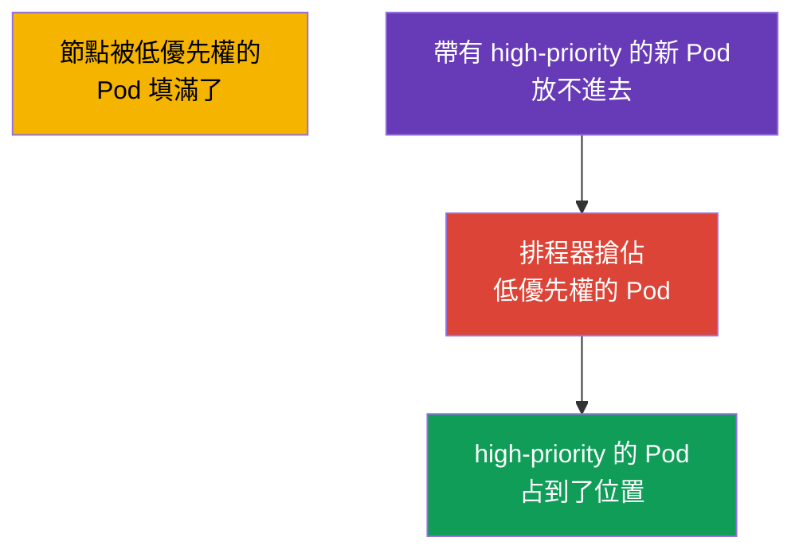
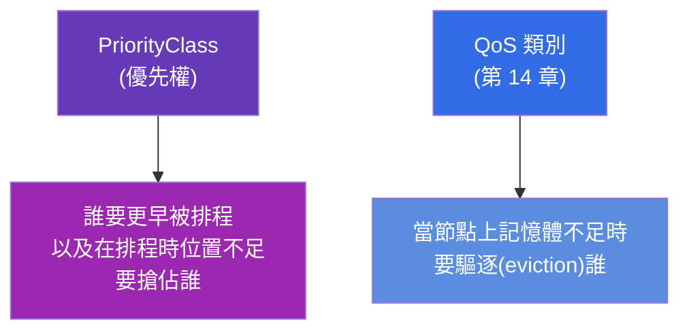
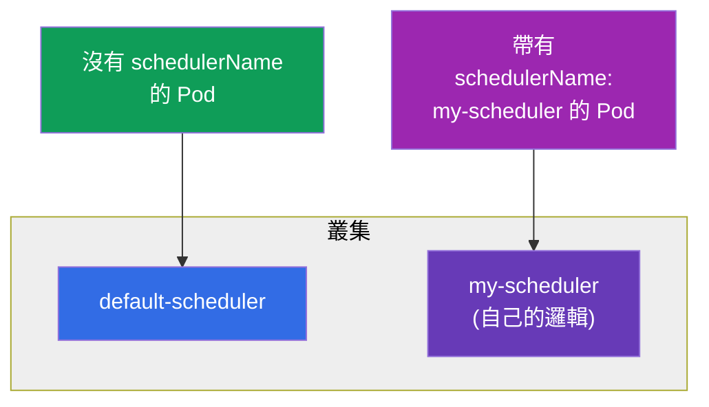

[Русская версия](ru.md) · [Eng version](README.md) · [Versión en español](es.md) · [Version française](fr.md) · [Deutsche Version](de.md) · [ქართული ვერსია](ge.md) · [日本語版](jp.md)

# 第 15 章。Static Pods、PriorityClass 與多個排程器

> **接下來是什麼。** 我們用三個在 CKA 上經常出現的主題來收尾排程這個部分。
> **Static Pods** - 由 kubelet 直接管理、繞過 control plane 的 Pod(control plane
> 自己的元件正是這樣啟動的!)。**PriorityClass** - Pod 的優先權,以及資源不足時的
> 搶佔(preemption)。**多個排程器** - 如何啟動並使用自己的排程器。前兩個主題對
> troubleshooting,以及對理解叢集究竟是怎麼組起來的,都很重要。

## 15.1. Static Pods:由 kubelet 管理的 Pod

普通的 Pod 會經過 API 伺服器與排程器(第 2 章)。**Static Pod** 是例外:它由
**特定節點上的 kubelet 直接** 管理,從本機目錄讀取 manifest。API 伺服器與排程器
都不參與這件事。



kubelet 會盯著一個目錄(通常是 `/etc/kubernetes/manifests/`,路徑在它的設定裡由
`staticPodPath` 參數指定)。把 Pod 的 YAML 放進去 - kubelet 就會啟動它。改了檔案 -
它會重新建立。刪掉 - 它會停下來。

```bash
# 找出 static pod 的 manifest 路徑
grep staticPodPath /var/lib/kubelet/config.yaml
# 通常是:/etc/kubernetes/manifests
```

## 15.2. 鏡像 Pod,以及為什麼這對 CKA 很重要

雖然 static pod 的建立繞過了 API 伺服器,kubelet 仍會為它在 API 中建立一個
**鏡像 Pod(mirror pod)** - 為了讓你能透過 `kubectl get pods` 看到它。但這只是
一個投影:透過 `kubectl delete` **無法** 刪除 static pod - kubelet 會立刻依照檔案
把它重新建立起來。要移除 static pod,只能把它的 manifest 從目錄裡拿掉。



**對 CKA 最重要的一點:** control plane 的元件(第 2 章)正是這樣啟動的 -
kube-apiserver、etcd、scheduler、controller-manager。它們的 manifest 放在 control
plane 節點的 `/etc/kubernetes/manifests/` 裡,修它們就是編輯這些檔案。static pod
的名稱會帶上節點名稱的後綴(例如 `kube-apiserver-master1`)。這是「修好 control
plane 元件」這類題目的關鍵。

> **那在受管叢集(EKS/GKE/AKS)裡呢?** 在那裡你看不到這些 static pod -
> 而且不是因為被過濾器藏起來了,而是因為 control plane 被搬到了 **你的叢集之外**。
> 供應商在自己的受管基礎設施(獨立的 AWS/Google/Azure 帳號)裡運行 apiserver、
> etcd、scheduler 與 controller-manager,那些節點你沒有存取權。對外只提供一個受管的
> API endpoint。所以在 `kubectl get nodes` 裡只看得到 worker 節點,而在 `kube-system`
> 裡只有節點層級的元件與 addon(`kube-proxy`、`coredns`、像 `aws-node` 這樣的 CNI),
> 而不是 control plane 元件本身。它們由供應商維護與升級,日誌也只能間接取得
> (例如 EKS 在 CloudWatch 裡的 control plane logging)。「透過
> `/etc/kubernetes/manifests/` 裡的 manifest 修元件」這個方法只在 self-managed
> 叢集(kubeadm)裡有效 - CKA 考試上正是這一種。

## 15.3. 如何建立 static pod

就是把 Pod 的 manifest 放到節點上對應的目錄裡:

```bash
# 在節點上
cat > /etc/kubernetes/manifests/my-static.yaml <<EOF
apiVersion: v1
kind: Pod
metadata:
  name: my-static
spec:
  containers:
  - name: nginx
    image: nginx
EOF
# kubelet 自己會撿起這個檔案,Pod 會在幾秒後出現
kubectl get pods -o wide       # 會看到 my-static-<節點名稱>
```

static pod 用在 Pod 必須 **早於且獨立於 control plane** 運行的地方 - 首先就是給
control plane 自己用。普通的應用程式不需要它們 - 那些有 DaemonSet/Deployment。

## 15.4. PriorityClass:Pod 的優先權

當資源不夠所有人用時,誰更重要?**PriorityClass** 為 Pod 設定一個數值優先權。優先權
較高的 Pod 會更早被排程,而在資源不足時可以 **搶佔(preempt)** 優先權較低的 Pod。

```yaml
apiVersion: scheduling.k8s.io/v1
kind: PriorityClass
metadata:
  name: high-priority
value: 1000000              # 數字越大越重要
globalDefault: false
description: "給關鍵服務用"
```

在 Pod 中的用法:

```yaml
spec:
  priorityClassName: high-priority
```



搶佔(preemption)是怎麼運作的:如果高優先權的 Pod 放不進去,排程器會在合適的節點上
找到優先權較低的 Pod 並刪除它們,騰出位置。被搶佔的 Pod 會試著搬到其他節點上。

你會在叢集裡看到的內建系統優先權:

| PriorityClass | 值 | 用途 |
|---------------|----------|----------|
| `system-cluster-critical` | 2000000000 | 叢集的關鍵元件 |
| `system-node-critical` | 2000001000 | 節點層級的元件(最高) |

> **globalDefault。** 如果某個 PriorityClass 設了 `globalDefault: true`,它就會套用到
> 所有沒有明確指定 `priorityClassName` 的 Pod 上。預設情況下 Pod 的優先權是 0。

## 15.5. PriorityClass 與 QoS:不要搞混

兩個看起來相似的主題,但講的是不同的事:



- **PriorityClass** 解決排程的問題:誰要先放,以及要搶佔誰,才能安置重要的 Pod。
- **QoS**(來自 requests/limits)解決的是在一個已經在運行的節點上記憶體不足時的生存
  問題:kubelet 會先驅逐誰。

兩者都關於「誰更重要」,但在不同階段:優先權 - 在安置時,QoS - 在 eviction 時。

### 案例:高優先權 ≠ 免於被驅逐

為了體會優先權與 QoS 是 **獨立的**,我們來拆解兩個 Pod:

- **Pod A** - 高 `priorityClassName`(例如 `1000000`),但是 **BestEffort**:
  requests/limits 完全沒設。
- **Pod B** - 低優先權(`0`,預設值),但是 **Guaranteed**:CPU 與記憶體都
  `requests == limits`。

它們在兩種不同情境下的命運是 **相反的**。

**情境 1:沒有位置可以排程 Pod A(preemption)。** 這裡動作的是排程器,而且它
**只看優先權** - QoS 完全不參與犧牲者的挑選。Pod A 更重要,所以如果沒有位置給它,
排程器可以 **搶佔(preempt)** 優先權較低的 Pod B - 即使 B 是 guaranteed 的也一樣
(Guaranteed QoS 並不能免於被搶佔)。B 會被殺掉並去找別的節點,而 A 會被安置。也就是
說在排程這個階段贏的是 A 的高優先權。

**情境 2:節點上的記憶體實際耗盡了(node-pressure eviction)。** 現在做決定的是
**kubelet**,而主要判準是 **相對於 requests 的消耗量**,也就是 QoS,而不是優先權。
kubelet 會先趕走那些吃超過自己 requests 的;BestEffort(requests = 0)立刻落進這一組,
而活在 requests 範圍內的 Guaranteed 則落進最受保護的那一組。因此 Pod A(BestEffort)
會 **第一個** 被驅逐,儘管它的優先權更高,而 Pod B(Guaranteed)會倖存下來。優先權
在這裡只作為次要判準 - 在同一組內其他條件相同時才用。

結論:高 PriorityClass 幫助你 **進到節點上,並在排程時保住位置**,但 **並不保護** 你
在記憶體不足時免於被驅逐 - 在那裡救你的是 Guaranteed QoS(`requests == limits`)。
對於真正關鍵的服務,**兩者都需要**:高優先權加上 Guaranteed。

### 案例:兩個優先權相同且都是 Guaranteed 的 Pod - 誰會先被殺?

那如果兩個 Pod 在「等級上」完全相等呢 - 相同的 `priorityClassName`,而且都是
Guaranteed?那麼優先權與 QoS 組別都不再能區分它們,於是 node-pressure eviction 的
第三個判準上場:**相對於 requests 的消耗量**。kubelet 依照「超出 requests → Priority →
消耗高出 requests 多少」這條鏈來排出被驅逐的順序;前兩項相同時就由最後一項決定 -
先走的是那個 **相對於自己的 request 消耗更多** 的(姑且說「更貪」的)。所以其他條件
相同時,死的是記憶體上更貪吃的那個 Pod。

專屬於 Guaranteed 的重要細節:

- **自己的 limit,自己的死法。** Guaranteed 的 `requests == limits`。如果容器自己撞到
  了自己的記憶體 limit,OOM-killer 會 **單獨** 殺掉它(`OOMKilled`),與鄰居的 Pod
  無關 - 這不是「在兩者之間做選擇」,而是超出了自己的天花板。
- **Node-pressure 是極端情況。** Guaranteed 的 Pod 會被最後才驅逐,而且通常只發生在
  記憶體已經不夠節點上的系統守護程序(kubelet、執行環境)用的時候,而不是因為鄰居。
  在核心層級,記憶體耗盡時 OOM-killer 依據 `oom_score` 來判斷(Guaranteed 的
  `oom_score` 是最「受保護」的),而在同一個類別內則殺掉消耗記憶體更多的行程。

實務結論:當形式上的特徵都相等時,「保險絲」就變成了實際消耗 - 所以即使是關鍵的
Guaranteed Pod,也要把 requests 設得接近真實尖峰,而不是「多留一點以備不時之需」。

## 15.6. 多個排程器

預設情況下 Pod 由 `default-scheduler` 來分配。但你可以啟動 **自己的** 排程器
(帶有自己挑選節點的邏輯),並指定某個 Pod 要由哪個排程器來安置。

```yaml
spec:
  schedulerName: my-scheduler    # 這個 Pod 會由自訂的排程器來分配
```



如果 Pod 指定了一個不存在的 `schedulerName`,它會永遠停在 `Pending` - 沒有人會來接它。
這是除錯時 Pending 的另一個可能原因。

要得到「不一樣的」排程行為有兩種方式,而在它們之間做選擇時,重要的是看工作量。

### 方式 1(輕量):在標準排程器裡使用 Scheduler Profiles

在大多數情況下不需要另一個執行檔 - **排程器設定檔(profiles)** 就夠了。同一個
`kube-scheduler` 可以持有多個 **設定檔**,每一個都有自己的 `schedulerName`,以及自己
啟用/停用的一組外掛與它們的權重。Pod 用同一個 `spec.schedulerName` 欄位來選設定檔。

設定檔在 `KubeSchedulerConfiguration`(kube-scheduler 會讀取的檔案)裡定義:

```yaml
apiVersion: kubescheduler.config.k8s.io/v1
kind: KubeSchedulerConfiguration
profiles:
  - schedulerName: default-scheduler        # 一般的行為
  - schedulerName: bin-packing              # 自己的名稱 - Pod 會指定它
    pluginConfig:
      - name: NodeResourcesFit
        args:
          scoringStrategy:
            type: MostAllocated              # 密集裝箱,而不是平均分散
```

這裡的 `MostAllocated` 讓 `bin-packing` 設定檔把節點塞得更滿(節省節點數量),而標準的
`LeastAllocated` 則把 Pod 平均撒開。Pod 只要指定 `schedulerName: bin-packing` - 就會由
這個設定檔來安排它,其他一切照常運作。一個行程,不需要多餘的部署。

**要如何一步步套用**(self-managed / kubeadm,其中 `kube-scheduler` 是 control plane 上
的 static pod):

1. **建立設定檔** 於 control-plane 節點上,例如
   `/etc/kubernetes/sched-config.yaml`,內含 `KubeSchedulerConfiguration`(如上)並
   指定排程器的 kubeconfig:

   ```yaml
   apiVersion: kubescheduler.config.k8s.io/v1
   kind: KubeSchedulerConfiguration
   clientConnection:
     kubeconfig: /etc/kubernetes/scheduler.conf   # 排程器自己的 kubeconfig
   profiles:
     - schedulerName: default-scheduler
     - schedulerName: bin-packing
       pluginConfig:
         - name: NodeResourcesFit
           args:
             scoringStrategy:
               type: MostAllocated
   ```

2. **把檔案交給排程器**,透過 `--config` 旗標。我們修改 static pod 的 manifest
   `/etc/kubernetes/manifests/kube-scheduler.yaml`:加上參數,並把主機上的檔案掛載到
   Pod 內部:

   ```yaml
   spec:
     containers:
     - command:
       - kube-scheduler
       - --config=/etc/kubernetes/sched-config.yaml   # + 移除會衝突的舊旗標
       volumeMounts:
       - name: sched-config
         mountPath: /etc/kubernetes/sched-config.yaml
         readOnly: true
     volumes:
     - name: sched-config
       hostPath:
         path: /etc/kubernetes/sched-config.yaml
         type: File
   ```

3. **kubelet 會自己重新啟動** 排程器的 pod(這是 static pod - 它會對 manifest 的修改
   有反應)。確認它沒有錯誤地起來了:

   ```bash
   kubectl -n kube-system get pod -l component=kube-scheduler
   kubectl -n kube-system logs kube-scheduler-<node>    # 找 "profiles" 並確認沒有設定錯誤
   ```

4. **檢查設定檔是否生效:** 建立一個帶有 `schedulerName: bin-packing` 的 Pod,看它是否
   進到 `Running`,而事件裡指派的正是這個設定檔:

   ```bash
   kubectl run t --image=nginx --overrides='{"spec":{"schedulerName":"bin-packing"}}'
   kubectl get event --field-selector involvedObject.name=t | grep -i scheduled
   ```

> 在 **受管** 叢集(EKS/GKE/AKS)裡,無法修改排程器的設定 - control plane 是封閉的
> (見 15.2 的方框)。在那裡只能透過部署在叢集內的自有排程器來做自訂排程(方式 2)。

**在設定檔裡還能設定什麼。** 設定檔不只是 `schedulerName`;透過它可以調整排程本身的
行為:

- **依階段(extension points)啟用/停用外掛。** 排程有這些階段:
  `queueSort`、`preFilter`、`filter`、`postFilter`、`preScore`、`score`、`reserve`、
  `permit`、`preBind`、`bind`、`postBind`。在 `plugins` 區塊裡可以為每個階段用
  `enabled`/`disabled` 列出外掛(例如在某個設定檔裡於 score 階段停用
  `PodTopologySpread`)。
- **score 外掛的權重。** `score` 階段的外掛有 `weight` - 改動它們就能重塑節點的最終
  評分(例如加強 `ImageLocality`,讓 Pod 更常被放到映像已經下載好的地方)。
- **外掛的參數(`pluginConfig`)。** 對特定外掛的細部調整:
  - `NodeResourcesFit` - 評分策略(`LeastAllocated`/`MostAllocated`/
    `RequestedToCapacityRatio`)與資源權重;
  - `PodTopologySpread` - `defaultConstraints`(依拓樸分布的預設值);
  - `InterPodAffinity` - `hardPodAffinityWeight`;
  - `NodeAffinity` - `addedAffinity`(為設定檔裡所有 Pod 加上 affinity 規則);
  - `DefaultPreemptionArgs`、`VolumeBinding` 等。
- **同時有多個設定檔** - 每一個都有自己的 `schedulerName` 與自己的一組外掛/權重;
  Pod 用 `schedulerName` 欄位來選要用哪一個。限制:`queueSort` 外掛在所有設定檔裡
  必須是同一個。
- **排程器的全域參數**(設在同一個檔案裡,不在設定檔內部):
  `percentageOfNodesToScore`(要評估多少節點 - 在大型叢集上是速度/品質的折衷)、
  `parallelism`、`podMaxBackoffSeconds` 等。

### 方式 2(沉重):把自有排程器當成獨立行程

如果需要的邏輯用外掛表達不出來,就啟動 **第二個排程器** - 當成 `kube-system` 裡一個
普通的 Deployment。它需要自己的 ServiceAccount 與 RBAC(存取節點、Pod、事件、以及
leader election 用的 lease)。示意如下:

```yaml
apiVersion: apps/v1
kind: Deployment
metadata:
  name: my-scheduler
  namespace: kube-system
spec:
  replicas: 1
  selector:
    matchLabels: {app: my-scheduler}
  template:
    metadata:
      labels: {app: my-scheduler}
    spec:
      serviceAccountName: my-scheduler        # + 帶有必要權限的 ClusterRole/ClusterRoleBinding
      containers:
      - name: kube-scheduler
        image: registry.k8s.io/kube-scheduler:v1.34.0   # 或自己帶有自訂外掛的執行檔
        command:
        - kube-scheduler
        - --config=/etc/kubernetes/my-scheduler-config.yaml   # 這裡有自己的 schedulerName
        # ...掛載帶有 KubeSchedulerConfiguration 的 ConfigMap
```

之後帶有 `spec.schedulerName: my-scheduler` 的 Pod 就會由它來分配。兩個排程器並行
運作;重點是別讓它們為了同一批 Pod 而「打架」(每一個只拿依 `schedulerName` 屬於
自己的那些)。

### 什麼時候真的需要這樣做

在實務上第二個排程器很少見;通常設定檔或普通的 affinity/taints/topologySpread
(第 12-13 章)就夠了。真正的理由有:

- **Batch/ML 與 gang scheduling。** 對於一組 Pod 必須「全有或全無」一起啟動的任務
  (分散式訓練、Spark/MPI),需要 co-scheduling - Volcano、Apache YuniKorn、
  coscheduling 外掛能提供。標準排程器一個一個地安置 Pod,可能導致半啟動任務造成的
  死結。
- **為了省錢的密集裝箱。** Bin-packing(`MostAllocated`)把節點塞緊,讓 autoscaler
  能關掉多餘的節點 - 直接省錢。這正是設定檔的場景,而不是另一個執行檔。
- **特殊硬體與拓樸。** 考慮 NUMA、GPU 拓樸、網路鄰近性、延遲要求 - 當標準外掛
  不夠用時。
- **多租戶與公平分配。** 團隊之間的配額與佇列,帶有自己的公平性政策
  (YuniKorn、Volcano queues)。
- **自己的領域邏輯。** 用現有的標籤與判準無法表達的安置規則。

實務原則:先試著用設定檔或 affinity 解決問題;只有在需要根本不同的邏輯時才動用獨立的
排程器(首先是 batch/ML 的 gang scheduling)。而對考試來說,知道這些就夠了:排程行為
用設定檔或自己的排程器來改,而 Pod 用 `schedulerName` 欄位綁到它身上。

## 15.7. 這在生產環境中如何應用

- **Static pods - 只給 control plane 用。** 在生產環境裡,static pod 是 kubeadm 用來
  在可用的 API 出現之前,把 control plane 元件拉起來並維持住的方式。應用型的工作負載
  不會用它們 - 那些用 DaemonSet/Deployment。知道「control plane = 在
  `/etc/kubernetes/manifests/` 裡的 static pods」,是維護與修復它們的基礎。
- **用 PriorityClass 保護關鍵服務。** 在生產環境裡會給關鍵元件(監控、ingress、系統
  服務)指派高優先權,讓資源不足時被搶佔的是比較不重要的背景任務,而不是它們。
  反過來,batch 型的工作負載給低優先權 - 搶佔掉它們不心疼。
- **小心 preemption。** 不經思考地讓很多 Pod 都有高優先權,會導致「搶佔戰爭」與
  不穩定。優先權要在整個叢集的層級上想清楚。
- **自訂排程器很少見。** 自有排程器只在特定情況下才會寫(例如 HPC、特殊的安置規則)。
  通常第 12-13 章的 affinity/taints/topologySpread 就夠了。但知道 `schedulerName`
  很有用:值填錯就是永遠 Pending 的原因。

## 15.8. 迷你詞彙表

- **Static Pod** - 由 kubelet 直接從本機 manifest 管理的 Pod,繞過 API 伺服器與
  排程器。
- **staticPodPath** - kubelet 盯著的目錄(通常是 `/etc/kubernetes/manifests/`)。
- **Mirror Pod(鏡像 Pod)** - static pod 在 API 中的投影;看得到,但不能透過
  kubectl 刪除。
- **PriorityClass** - 帶有 Pod 數值優先權的物件。
- **Preemption(搶佔)** - 為了安置優先權更高的 Pod 而刪除優先權較低的 Pod。
- **globalDefault** - 套用到沒有明確優先權的 Pod 上的 PriorityClass。
- **schedulerName** - 由哪個排程器來分配這個 Pod。
- **Scheduler Profiles** - 同一個排程器裡的多份設定。

## 15.9. 本章總結

- Static Pod 由 kubelet 直接從 `/etc/kubernetes/manifests/` 目錄管理,繞過 API 伺服器
  與排程器;透過編輯檔案來改動它。
- 系統會為 static pod 在 API 裡建立一個鏡像 Pod(在 kubectl 中看得到),但不能透過
  kubectl 刪除它 - 只能移除 manifest。
- control plane 的元件(apiserver、etcd、scheduler、controller-manager)就是 static
  pods;修它們的方法也由此而來。
- PriorityClass 設定數值優先權;高優先權的 Pod 會更早被排程,而且在位置不足時可以
  搶佔(preempt)優先權較低的。
- PriorityClass(排程/搶佔)與 QoS(記憶體不足時的 eviction)講的是不同階段,不要
  搞混。
- 可以運行多個排程器,並透過 `schedulerName` 來選擇它們;名稱填錯 = 永遠 Pending。

## 15.10. 這些知識用在哪裡:考試與實際工作

**在考試中。** 「在節點上建立一個 static pod」、「修好 control plane 元件」(透過
`/etc/kubernetes/manifests/` 裡的 manifest)、「建立一個 PriorityClass 並指派給 Pod」-
都是 CKA 的典型題目。理解 static pods 對 troubleshooting 這個領域是直接必要的。
`schedulerName` 指向不存在的排程器,是 Pending 的原因之一。

**在實際工作中。** Static pods 就是 control plane 實際存活的方式,而知道這件事是維護它
的基礎。PriorityClass 在資源不足時保護關鍵服務免於被搶佔,並決定什麼可以拿來犧牲。這會
影響整個叢集在負載下的穩定性。

## 15.11. 自我檢查問題

1. 從建立的路徑來看,static pod 與普通的 Pod 有什麼不同?
2. 為什麼 static pod 不能透過 `kubectl delete` 刪除,要怎麼移除它?
3. static pods 與 control plane 元件之間有什麼關係?它們的 manifest 放在哪裡?
4. PriorityClass 做什麼,搶佔(preemption)是怎麼運作的?
5. 從用途上看,PriorityClass 與 QoS 類別有什麼不同?
6. 如何把 Pod 指向特定的排程器,而 `schedulerName` 填錯時會發生什麼?
7. PriorityClass 上的 `globalDefault: true` 是什麼意思?

## 實踐

我們把排程收尾了。第 16 章是第 2 部分的最後一個主題:工作負載的自動擴縮(HPA),
在那裡 Deployment 的副本數會依負載自動變化。Static pods 與 PriorityClass 會在叢集與
排程相關的實驗中練到。

🧪 實驗 117(包含 static pod 的除錯):[tasks/cka/labs/117](../../labs/117/README_TW.MD)

🧪 實驗 122(包含 PriorityClass 的操練):[tasks/cka/labs/122](../../labs/122/README_TW.MD)

🎮 Killercoda（在瀏覽器中，無需安裝）：[Priority Class](https://killercoda.com/chadmcrowell/course/cka/priority-class)

---
[目錄](../README_TW.md) · [第 14 章](../14/tw.md) · [第 16 章](../16/tw.md)
