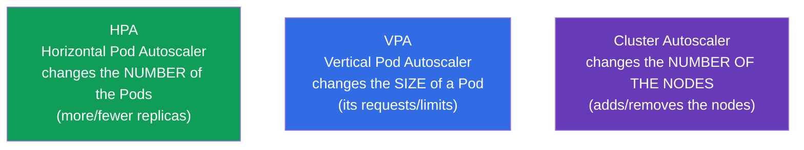
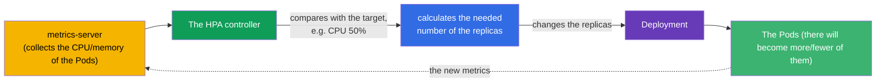
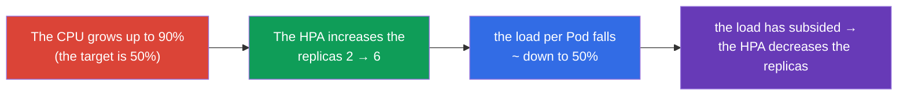
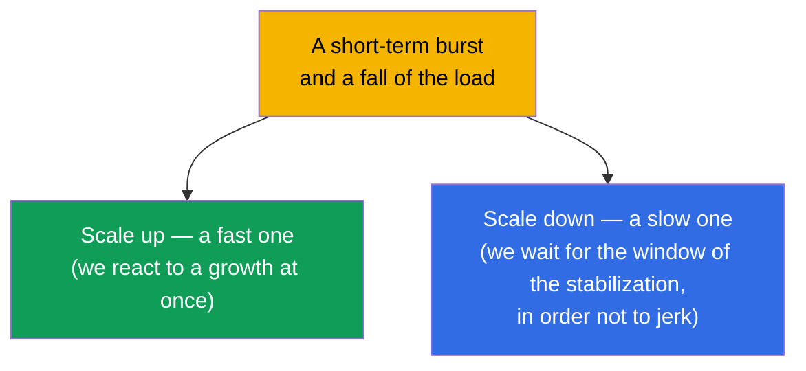

[Русская версия](ru.md) · [Versión en español](es.md) · [Version française](fr.md) · [Deutsche Version](de.md) · [ქართული ვერსია](ge.md)

# Chapter 16. The autoscaling of the workloads: HPA

> **What comes next.** Until now we have set the number of the replicas of a Deployment by hand (`scale`). But
> the load changes: in the daytime there is a peak, at night there is a silence. **HorizontalPodAutoscaler (HPA)**
> automatically changes the number of the Pods by the metrics (usually by the CPU/memory). This closes
> the part 2 and belongs to the domain Workloads (CKA) and Application Deployment (CKAD). At the same time
> we will take apart the neighbours - VPA and Cluster Autoscaler - in order to see the whole picture of the scaling.

## 16.1. The three kinds of the scaling

In order not to get confused, let us at once lay out what and how is scaled in Kubernetes.



| The autoscaler | What it changes | An example |
|-------------|-----------|--------|
| **HPA** (the horizontal one) | the number of the replicas of a Pod | 3 → 10 Pods upon a growth of the CPU |
| **VPA** (the vertical one) | the requests/limits of a Pod | to raise the memory from 256Mi to 512Mi |
| **Cluster Autoscaler** | the number of the nodes in a cluster | to add a node, when the Pods do not fit |

The main hero of the exam is the **HPA**. VPA and Cluster Autoscaler have to be known conceptually.

## 16.2. How the HPA works

The HPA is a controller (a reconciliation loop) that periodically (by default once in ~15
seconds) looks at the metrics of the Pods and compares them with the target value. If the actual
consumption is higher than the target it adds the replicas, if it is lower it removes them.



The formula, by which the HPA counts the desired number of the replicas:

```
the desired replicas = the current ones × (the current metric / the target metric)
```

For example: 3 Pods, the current load of the CPU is 90%, the target is 50% → `3 × (90/50) = 5.4` → a rounding
upwards → **6 Pods**.

## 16.3. metrics-server: without it the HPA does not work

The HPA does not take the metrics out of the air. For the basic metrics (CPU/memory) a **metrics-server**
is needed - a component that collects the consumption from the kubelet and gives it away through the Metrics API. The same
metrics-server feeds `kubectl top` (chapter 28).

```bash
# To check whether the metrics-server is installed
kubectl get deployment metrics-server -n kube-system
kubectl top pods           # if it works — we will see the consumption
```

> **A frequent reason of "the HPA does not scale".** If `kubectl top` writes an error or the column
> of the metrics in `kubectl get hpa` shows `<unknown>` - it means that the metrics-server is not installed
> or does not work. Without it the HPA is blind. This is the first thing that is checked during the debugging of the HPA.

For the metrics more complex than the CPU/memory (the requests per second, the length of a queue) the **custom/external
metrics** through the adapters (for example, the Prometheus Adapter) are needed - see the next section.

### The custom and the external metrics

The CPU and the memory are only the basic case. The HPA (`autoscaling/v2`) is able to scale by three
types of the metrics:

| The type of the metric | From where | An example | The API |
|-------------|--------|--------|-----|
| `Resource` | metrics-server | the CPU/memory of the Pods | `metrics.k8s.io` |
| `Pods` / `Object` (custom) | from the cluster | the requests/sec per Pod, the depth of a queue in an application | `custom.metrics.k8s.io` |
| `External` | from outside the cluster | the length of an SQS/Kafka queue, a metric of a cloud | `external.metrics.k8s.io` |

The metrics-server gives away only the `Resource` metrics. For the custom/external ones an **adapter** is needed,
which registers the corresponding metrics API. The most widespread one is the **Prometheus
Adapter**: it takes the metrics from Prometheus and publishes them as `custom.metrics.k8s.io`,
so that the HPA could count by them. An example of an HPA by the custom metric "the requests per second per Pod":

```yaml
apiVersion: autoscaling/v2
kind: HorizontalPodAutoscaler
metadata:
  name: web
spec:
  scaleTargetRef:
    apiVersion: apps/v1
    kind: Deployment
    name: web
  minReplicas: 2
  maxReplicas: 20
  metrics:
  - type: Pods                         # a custom metric "per each Pod"
    pods:
      metric:
        name: http_requests_per_second
      target:
        type: AverageValue
        averageValue: "100"            # to keep ~100 rps per Pod
```

For the metrics from outside the cluster (for example, the length of a queue) the `type: External` is used. The logic
of the HPA is the same - to compare the current value with the target and to recount the replicas; only the
source of the metric changes.

### KEDA: the event-driven autoscaling

To configure the Prometheus Adapter and to write the rules for every external system is laborious.
**KEDA** (Kubernetes Event-driven Autoscaling) solves this: it is an add-on that
scales a workload **by the events from the external sources** and is able to do what the
basic HPA cannot - the **scaling to zero** (scale to zero), when there are no events.

The key ideas of KEDA:

- **The scalers** - the ready integrations with the dozens of the sources: Kafka, RabbitMQ,
  AWS SQS, Prometheus, Redis, cron, the cloud queues and so on. There is no need to build by hand
  an adapter for every system.
- **`ScaledObject`** - a CRD, where it is described what to scale and by which trigger:

  ```yaml
  apiVersion: keda.sh/v1alpha1
  kind: ScaledObject
  metadata:
    name: consumer
  spec:
    scaleTargetRef:
      name: consumer                 # which Deployment to scale
    minReplicaCount: 0               # KEDA is able to lower down to zero
    maxReplicaCount: 30
    triggers:
    - type: kafka                    # a scaler for a concrete source
      metadata:
        topic: orders
        lagThreshold: "100"          # 1 replica per every 100 messages of the lag
  ```

- **Under the hood there is the same HPA.** KEDA does not replace the HPA, but manages it: for a `ScaledObject`
  it creates an HPA by itself and feeds it with the metrics through the `external.metrics.k8s.io`. A separate
  case is the scale to zero: the transition `0↔1` KEDA does by itself (the HPA is not able to go down to zero), and further
  the created HPA deals with the scaling `1→N`.

**When to choose what.** By the CPU/memory - the regular HPA + metrics-server. By the applied
metrics from Prometheus - the HPA + Prometheus Adapter. By the events of the queues/brokers and there,
where the scale to zero is needed (the handlers of the queues, the rare batch workers), - KEDA: there is less manual
configuration and a saving on the idling, when there is no work.

## 16.4. The creation of an HPA

An obligatory condition: the Pods of a Deployment have to have the **requests** set by the needed
resource (chapter 14) - otherwise the HPA has nothing to compare the percentage of the load with.

Imperatively:

```bash
kubectl autoscale deployment web --min=2 --max=10 --cpu-percent=50
```

Declaratively (autoscaling/v2 - supports several metrics):

```yaml
apiVersion: autoscaling/v2
kind: HorizontalPodAutoscaler
metadata:
  name: web
spec:
  scaleTargetRef:
    apiVersion: apps/v1
    kind: Deployment
    name: web
  minReplicas: 2
  maxReplicas: 10
  metrics:
  - type: Resource
    resource:
      name: cpu
      target:
        type: Utilization
        averageUtilization: 50    # to keep the average load of the CPU ~50%
```

```bash
kubectl get hpa
kubectl describe hpa web      # the current/target metric, the events of the scaling
```



## 16.5. The min/max and the stabilization

Two obligatory limiters:

- **minReplicas** - the lower boundary (the HPA will not lower below it, even if there is no load).
- **maxReplicas** - the upper boundary (a protection from an uncontrolled growth and a ruin).

So that the HPA would not "jerk" the number of the Pods back and forth upon the jumps of the metrics, there is a **window of the stabilization
(stabilization window)**: before a decrease of the replicas the HPA waits (by default 5 minutes),
in order to make sure that the load has really subsided, and has not just fluctuated. The behaviour
of the scaling is finely tuned by the block `behavior` (the speed of the scale up/down).



The asymmetry is intentional: it is better to grow fast (in order to withstand an influx), and to shrink
carefully (in order not to remove the Pods right before a new burst).

## 16.6. The HPA and the Cluster Autoscaler together

The HPA adds the Pods - but what if the nodes have nowhere to put them already? Here the
**Cluster Autoscaler** enters the game: it sees the Pods in `Pending` because of a shortage of the resources and adds
the nodes to the cluster (in a cloud), and upon an idling it removes the superfluous ones.


The link HPA + Cluster Autoscaler is the basis of the elasticity in a cloud: the HPA scales the
application, the Cluster Autoscaler - the infrastructure under it. The HPA and the VPA at that
**are not applied together by one resource** (they would conflict, both changing the reaction to the
CPU/memory).

> **Karpenter is a modern alternative to the Cluster Autoscaler.** The classic Cluster
> Autoscaler scales the **preset** node groups (the identical nodes). **Karpenter**
> (initially AWS, now also the others) goes further: by the unplaced Pods it selects and
> starts a node of a **suitable type/size** directly (the right-sizing, the spot instances,
> the consolidation of the underloaded nodes) without the predefined pools. In a cloud this is often faster and
> cheaper; the idea is the same - to add the nodes for the `Pending` Pods, but more flexibly.

## 16.7. How this is applied in the production

- **The HPA is the standard for a variable load.** The web and the API with the daily peaks are almost always
  under an HPA: they keep a minimum of the replicas at night and unfold under the peak in the daytime. This saves
  the resources and the money without a manual intervention.
- **The requests are an obligatory condition.** In the production under every HPA there are correctly
  selected requests: from them the percentage of the load is counted. Incorrect requests → the HPA
  scales not by the case.
- **Not only the CPU.** The mature teams scale by the applied metrics (the requests/sec,
  the depth of a queue, the latency) through the Prometheus Adapter or KEDA (the event-driven
  autoscaling, right down to zero replicas). The CPU is only a starting point.
- **HPA + Cluster Autoscaler.** In a cloud this is a link: an application is scaled by the Pods,
  the infrastructure - by the nodes. Without the Cluster Autoscaler the HPA will run into the ceiling of the nodes and will leave
  the Pods in Pending.
- **A tuning of the behavior for a service.** For a traffic with the sharp bursts they accelerate the scale up
  and slow down the scale down, in order not to "collapse" before a new wave. A PodDisruptionBudget
  additionally protects from an excessive reduction (chapter 36).

## 16.8. A mini glossary

- **HPA (HorizontalPodAutoscaler)** - changes the number of the replicas by the metrics.
- **VPA (VerticalPodAutoscaler)** - changes the requests/limits of the Pods.
- **Cluster Autoscaler** - changes the number of the nodes in a cluster.
- **metrics-server** - collects the CPU/memory of the Pods; is needed for the HPA and for `kubectl top`.
- **averageUtilization** - the target average percentage of the load of a resource.
- **minReplicas/maxReplicas** - the lower and the upper boundaries of the number of the replicas.
- **stabilization window** - the window of the waiting before a reduction of the replicas.
- **behavior** - a fine tuning of the speed of the scale up/down.
- **KEDA** - the event-driven autoscaling by the external events (including down to zero).

## 16.9. The summary of the chapter

- The three scalings: HPA (the number of the Pods), VPA (the size of a Pod), Cluster Autoscaler (the number
  of the nodes).
- The HPA compares the current metric with the target one and changes the replicas by the formula
  `the replicas × (the current/the target)`.
- The HPA requires a metrics-server (for the CPU/memory); without it the metric is `<unknown>` and the HPA does not
  scale.
- The obligatory condition of the HPA is the set requests at the Pods (from them the percentage is counted).
- The min/max limit the range of the replicas; the window of the stabilization does not let it "jerk" the number of the Pods;
  the scale up is usually fast, the scale down is careful.
- HPA + Cluster Autoscaler: an application is scaled by the Pods, the infrastructure - by the nodes.
- The HPA and the VPA are not applied together by one resource.

## 16.10. How this will come in handy: on the exam and in the real work

**On the exam.** "Create an HPA for a deployment with the target CPU 50%, min 2 max 10" is a typical task
(`kubectl autoscale` or a manifest). It is necessary to remember about the requests and about the metrics-server as
a condition of the work. The debugging of "the HPA does not scale" → a check of `kubectl top`/the metrics-server.

**In the real work.** The HPA is the main mechanism of the elasticity of the applications: it saves the resources
in a lull and holds the load at the peak without a manual intervention. In a link with the Cluster
Autoscaler it gives a full elasticity in a cloud. The understanding of the metrics, of the requests and of the behaviour of the
scale up/down determines whether the autoscaling will help or will create the problems.

## 16.11. Self-check questions

1. In what way do the HPA, the VPA and the Cluster Autoscaler differ by what they change?
2. By which formula does the HPA calculate the needed number of the replicas? Calculate it for 4 Pods, the CPU 80%,
   the target 40%.
3. What for does the HPA need a metrics-server and how to understand that it is absent?
4. Why do the Pods under an HPA obligatorily have to have the requests set?
5. What do the minReplicas/maxReplicas and the window of the stabilization do?
6. Why is the scale up usually fast, and the scale down slow?
7. How do the HPA and the Cluster Autoscaler work together upon a growth of the load?

## Practice

At this point the part 2 (the workloads and the scheduling) is finished. Further there is the part 3:
the configuration and the security of the applications, starting with the commands, the arguments and the environment
variables (chapter 17). The HPA is drilled in the labs on the workloads together with the load
profile of the image `ping_pong`.

🧪 Lab 104 (the autoscaling HPA): [tasks/cka/labs/104](../../labs/104/README.MD)

---
[Contents](../README.md) · [Chapter 15](../15/README.md) · [Chapter 17](../17/README.md)
