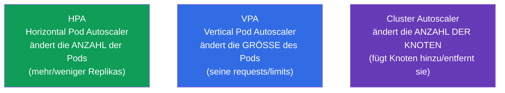
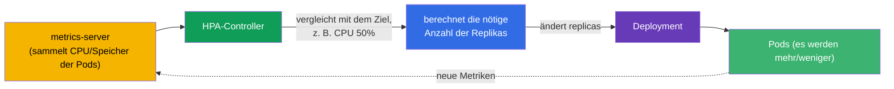
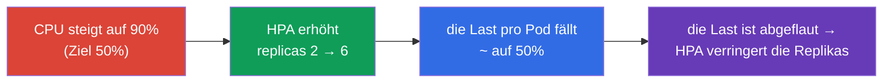
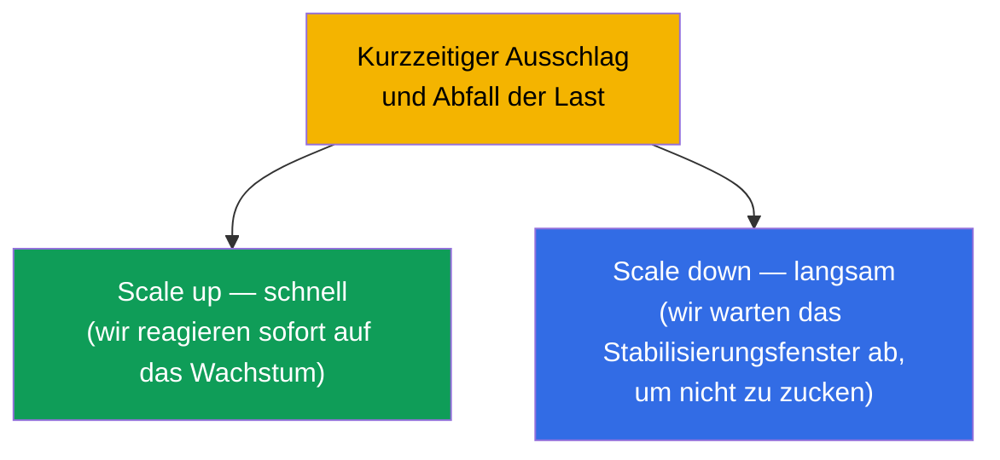
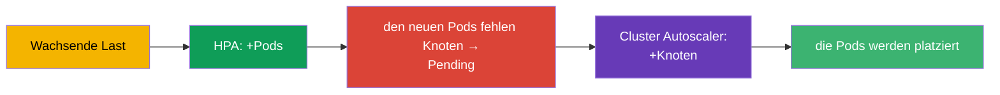

[Русская версия](ru.md) · [Eng version](README.md) · [Versión en español](es.md) · [Version française](fr.md) · [ქართული ვერსია](ge.md)

# Kapitel 16. Autoscaling von Lasten: HPA

> **Was kommt.** Bisher haben wir die Anzahl der Replikas eines Deployment von Hand gesetzt
> (`scale`). Aber die Last ändert sich: tagsüber Spitze, nachts Stille. Der
> **HorizontalPodAutoscaler (HPA)** ändert die Anzahl der Pods automatisch anhand von
> Metriken (üblicherweise nach CPU/Speicher). Damit schließt Teil 2 ab, und es gehört zur
> Domäne Workloads (CKA) und Application Deployment (CKAD). Nebenbei betrachten wir die
> Nachbarn - VPA und Cluster Autoscaler - um das ganze Bild des Skalierens zu sehen.

## 16.1. Drei Arten des Skalierens

Damit keine Verwirrung entsteht, legen wir sofort auseinander, was und wie in Kubernetes
skaliert wird.



| Autoscaler | Was er ändert | Beispiel |
|-------------|-----------|--------|
| **HPA** (horizontal) | Anzahl der Replikas eines Pods | 3 → 10 Pods beim Anstieg der CPU |
| **VPA** (vertikal) | requests/limits des Pods | den Speicher von 256Mi auf 512Mi anheben |
| **Cluster Autoscaler** | Anzahl der Knoten im Cluster | einen Knoten hinzufügen, wenn Pods nicht hineinpassen |

Der Hauptdarsteller der Prüfung ist der **HPA**. VPA und Cluster Autoscaler muss man
konzeptionell kennen.

## 16.2. Wie der HPA funktioniert

Der HPA ist ein Controller (eine Abstimmungsschleife), der periodisch (standardmäßig etwa
alle 15 Sekunden) die Metriken der Pods anschaut und mit dem Zielwert vergleicht. Ist der
tatsächliche Verbrauch höher als das Ziel - fügt er Replikas hinzu, ist er niedriger -
entfernt er sie.



Die Formel, mit der der HPA die gewünschte Anzahl der Replikas berechnet:

```
gewünschte Replikas = aktuelle × (aktuelle Metrik / Zielmetrik)
```

Zum Beispiel: 3 Pods, aktuelle CPU-Auslastung 90%, Ziel 50% → `3 × (90/50) = 5.4` →
Aufrunden → **6 Pods**.

## 16.3. metrics-server: ohne ihn funktioniert der HPA nicht

Der HPA holt die Metriken nicht aus der Luft. Für die Basismetriken (CPU/Speicher) braucht man
den **metrics-server** - eine Komponente, die den Verbrauch vom kubelet sammelt und über die
Metrics API ausliefert. Derselbe metrics-server versorgt `kubectl top` (Kapitel 28).

```bash
# Prüfen, ob der metrics-server installiert ist
kubectl get deployment metrics-server -n kube-system
kubectl top pods           # wenn er funktioniert — sehen wir den Verbrauch
```

> **Häufige Ursache für „der HPA skaliert nicht“.** Wenn `kubectl top` einen Fehler schreibt
> oder die Metrikspalte in `kubectl get hpa` `<unknown>` zeigt - dann ist der metrics-server
> nicht installiert oder funktioniert nicht. Ohne ihn ist der HPA blind. Das ist das Erste,
> was man beim Debuggen des HPA prüft.

Für Metriken jenseits von CPU/Speicher (Anfragen pro Sekunde, Länge einer Warteschlange)
braucht man **custom/external metrics** über Adapter (zum Beispiel den Prometheus Adapter) -
siehe den nächsten Abschnitt.

### Custom- und externe Metriken

CPU und Speicher sind nur der Basisfall. Der HPA (`autoscaling/v2`) kann nach drei Typen von
Metriken skalieren:

| Typ der Metrik | Woher | Beispiel | API |
|-------------|--------|--------|-----|
| `Resource` | metrics-server | CPU/Speicher der Pods | `metrics.k8s.io` |
| `Pods` / `Object` (custom) | aus dem Cluster | Anfragen/Sek. pro Pod, Tiefe der Warteschlange in der Anwendung | `custom.metrics.k8s.io` |
| `External` | von außerhalb des Clusters | Länge der SQS-/Kafka-Warteschlange, Metrik der Cloud | `external.metrics.k8s.io` |

Der metrics-server liefert nur `Resource`-Metriken. Für custom/external braucht man einen
**Adapter**, der die entsprechende metrics API registriert. Der verbreitetste ist der
**Prometheus Adapter**: er nimmt Metriken aus Prometheus und veröffentlicht sie als
`custom.metrics.k8s.io`, damit der HPA danach rechnen kann. Beispiel eines HPA nach der
Custom-Metrik „Anfragen pro Sekunde pro Pod“:

```yaml
apiVersion: autoscaling/v2
kind: HorizontalPodAutoscaler
metadata:
  name: web
spec:
  scaleTargetRef:
    apiVersion: apps/v1
    kind: Deployment
    name: web
  minReplicas: 2
  maxReplicas: 20
  metrics:
  - type: Pods                         # Custom-Metrik „pro jeden Pod“
    pods:
      metric:
        name: http_requests_per_second
      target:
        type: AverageValue
        averageValue: "100"            # ~100 rps pro Pod halten
```

Für Metriken von außerhalb des Clusters (zum Beispiel die Länge einer Warteschlange) nutzt
man `type: External`. Die Logik des HPA ist dieselbe - den aktuellen Wert mit dem Ziel
vergleichen und die Replikas neu berechnen; es ändert sich nur die Quelle der Metrik.

### KEDA: event-driven Autoscaling

Den Prometheus Adapter einzurichten und Regeln für jedes externe System zu schreiben ist
aufwendig. **KEDA** (Kubernetes Event-driven Autoscaling) löst das: es ist ein Aufsatz, der
die Last **anhand von Ereignissen aus externen Quellen** skaliert und das kann, was der
Basis-HPA nicht kann - **das Skalieren auf null** (scale to zero), wenn keine Ereignisse
vorliegen.

Die Kernideen von KEDA:

- **Scaler (scalers)** - fertige Integrationen mit Dutzenden Quellen: Kafka, RabbitMQ,
  AWS SQS, Prometheus, Redis, cron, Cloud-Warteschlangen usw. Man muss nicht von Hand einen
  Adapter für jedes System zusammenbauen.
- **`ScaledObject`** - ein CRD, in dem man beschreibt, was skaliert wird und nach welchem
  Trigger:

  ```yaml
  apiVersion: keda.sh/v1alpha1
  kind: ScaledObject
  metadata:
    name: consumer
  spec:
    scaleTargetRef:
      name: consumer                 # welches Deployment skaliert wird
    minReplicaCount: 0               # KEDA kann bis auf null herunter
    maxReplicaCount: 30
    triggers:
    - type: kafka                    # Scaler für die konkrete Quelle
      metadata:
        topic: orders
        lagThreshold: "100"          # 1 Replika je 100 Nachrichten Lag
  ```

- **Unter der Haube - derselbe HPA.** KEDA ersetzt den HPA nicht, sondern steuert ihn: für ein
  `ScaledObject` erstellt es selbst einen HPA und füttert ihn mit Metriken über
  `external.metrics.k8s.io`. Ein Sonderfall ist scale to zero: den Übergang `0↔1` macht KEDA
  selbst (der HPA kann nicht auf null), und danach übernimmt das Skalieren `1→N` der
  erstellte HPA.

**Wann man was wählt.** Nach CPU/Speicher - der reguläre HPA + metrics-server. Nach
Anwendungsmetriken aus Prometheus - HPA + Prometheus Adapter. Nach Ereignissen von
Warteschlangen/Brokern und dort, wo scale to zero gebraucht wird (Verarbeiter von
Warteschlangen, seltene Batch-Worker), - KEDA: weniger manuelle Einrichtung und Einsparung
im Leerlauf, wenn keine Arbeit anliegt.

## 16.4. Einen HPA erstellen

Zwingende Voraussetzung: bei den Pods des Deployment müssen **requests** für die nötige
Ressource gesetzt sein (Kapitel 14) - sonst hat der HPA nichts, womit er den Prozentsatz der
Auslastung vergleichen kann.

Imperativ:

```bash
kubectl autoscale deployment web --min=2 --max=10 --cpu-percent=50
```

Deklarativ (autoscaling/v2 - unterstützt mehrere Metriken):

```yaml
apiVersion: autoscaling/v2
kind: HorizontalPodAutoscaler
metadata:
  name: web
spec:
  scaleTargetRef:
    apiVersion: apps/v1
    kind: Deployment
    name: web
  minReplicas: 2
  maxReplicas: 10
  metrics:
  - type: Resource
    resource:
      name: cpu
      target:
        type: Utilization
        averageUtilization: 50    # die mittlere CPU-Auslastung bei ~50% halten
```

```bash
kubectl get hpa
kubectl describe hpa web      # aktuelle/Zielmetrik, Events des Skalierens
```



## 16.5. min/max und Stabilisierung

Zwei zwingende Begrenzer:

- **minReplicas** - die untere Grenze (der HPA geht nicht darunter, selbst wenn keine Last da
  ist).
- **maxReplicas** - die obere Grenze (Schutz vor unkontrolliertem Wachstum und Ruin).

Damit der HPA die Anzahl der Pods bei Sprüngen der Metriken nicht hin und her „zuckt“, gibt es
das **Stabilisierungsfenster (stabilization window)**: vor dem Verringern der Replikas wartet
der HPA ab (standardmäßig 5 Minuten), um sicher zu sein, dass die Last wirklich abgeflaut ist
und nicht nur geschwankt hat. Das Verhalten des Skalierens stellt man feiner über den Block
`behavior` ein (Geschwindigkeit von scale up/down).



Die Asymmetrie ist absichtlich: wachsen ist besser schnell (um den Zulauf zu überstehen), und
schrumpfen vorsichtig (um die Pods nicht direkt vor einem neuen Ausschlag zu entfernen).

## 16.6. HPA und Cluster Autoscaler zusammen

Der HPA fügt Pods hinzu - aber was, wenn die Knoten keinen Platz mehr für sie haben? Hier
kommt der **Cluster Autoscaler** ins Spiel: er sieht Pods in `Pending` wegen Ressourcenmangel
und fügt Knoten zum Cluster hinzu (in der Cloud), und im Leerlauf entfernt er die überflüssigen.



Die Verbindung HPA + Cluster Autoscaler ist die Grundlage der Elastizität in der Cloud: der
HPA skaliert die Anwendung, der Cluster Autoscaler die Infrastruktur darunter. HPA und VPA
**wendet man dabei nicht zusammen für dieselbe Ressource an** (sie würden konfliktieren, da
beide die Reaktion auf CPU/Speicher ändern).

> **Karpenter - eine moderne Alternative zum Cluster Autoscaler.** Der klassische Cluster
> Autoscaler skaliert **vorab festgelegte** node groups (gleichartige Knoten). **Karpenter**
> (ursprünglich AWS, inzwischen auch andere) geht weiter: anhand der nicht platzierten Pods
> wählt er einen Knoten **passenden Typs/passender Größe** aus und startet ihn direkt
> (right-sizing, Spot-Instanzen, Konsolidierung unterbelasteter Knoten) ohne vordefinierte
> Pools. In der Cloud ist das oft schneller und günstiger; die Idee ist dieselbe - Knoten für
> `Pending`-Pods hinzufügen, aber flexibler.

## 16.7. Wie man das in der Produktion anwendet

- **HPA - Standard für variable Last.** Web und APIs mit Tagesspitzen stehen fast immer unter
  HPA: sie halten nachts ein Minimum an Replikas und entfalten sich tagsüber zur Spitze. Das
  spart Ressourcen und Geld ohne manuellen Eingriff.
- **requests - zwingende Voraussetzung.** In der Produktion stehen unter jedem HPA korrekt
  gewählte requests: von ihnen wird der Prozentsatz der Auslastung berechnet. Falsche
  requests → der HPA skaliert unpassend.
- **Nicht nur CPU.** Reife Teams skalieren nach Anwendungsmetriken (Anfragen/Sek., Tiefe der
  Warteschlange, Latenz) über den Prometheus Adapter oder KEDA (event-driven Autoscaling, bis
  hinunter zu null Replikas). CPU ist nur ein Startpunkt.
- **HPA + Cluster Autoscaler.** In der Cloud ist das eine Verbindung: die Anwendung wird über
  Pods skaliert, die Infrastruktur über Knoten. Ohne Cluster Autoscaler stößt der HPA an die
  Decke der Knoten und lässt Pods in Pending.
- **Einstellung von behavior je Dienst.** Für Verkehr mit scharfen Ausschlägen beschleunigt
  man scale up und bremst scale down, um nicht vor einer neuen Welle „einzuklappen“. Das
  PodDisruptionBudget schützt zusätzlich vor übermäßigem Verringern (Kapitel 36).

## 16.8. Mini-Glossar

- **HPA (HorizontalPodAutoscaler)** - ändert die Anzahl der Replikas anhand von Metriken.
- **VPA (VerticalPodAutoscaler)** - ändert requests/limits der Pods.
- **Cluster Autoscaler** - ändert die Anzahl der Knoten im Cluster.
- **metrics-server** - sammelt CPU/Speicher der Pods; nötig für HPA und `kubectl top`.
- **averageUtilization** - der angestrebte mittlere Prozentsatz der Auslastung einer Ressource.
- **minReplicas/maxReplicas** - untere und obere Grenze der Anzahl der Replikas.
- **stabilization window** - das Wartefenster vor dem Verringern der Replikas.
- **behavior** - die Feineinstellung der Geschwindigkeit von scale up/down.
- **KEDA** - event-driven Autoscaling nach externen Ereignissen (u. a. bis auf null).

## 16.9. Zusammenfassung des Kapitels

- Drei Arten des Skalierens: HPA (Anzahl der Pods), VPA (Größe des Pods), Cluster Autoscaler
  (Anzahl der Knoten).
- Der HPA vergleicht die aktuelle Metrik mit der Zielmetrik und ändert die Replikas nach der
  Formel `Replikas × (aktuelle/Ziel)`.
- Der HPA braucht den metrics-server (für CPU/Speicher); ohne ihn ist die Metrik `<unknown>`
  und der HPA skaliert nicht.
- Zwingende Voraussetzung für den HPA sind gesetzte requests bei den Pods (von ihnen wird der
  Prozentsatz berechnet).
- min/max begrenzen den Bereich der Replikas; das Stabilisierungsfenster lässt die Anzahl der
  Pods nicht „zucken“; scale up ist üblicherweise schnell, scale down vorsichtig.
- HPA + Cluster Autoscaler: die Anwendung wird über Pods skaliert, die Infrastruktur über
  Knoten.
- HPA und VPA wendet man für dieselbe Ressource nicht zusammen an.

## 16.10. Wofür das nützlich ist: in der Prüfung und in der echten Arbeit

**In der Prüfung.** „Erstelle einen HPA für ein Deployment mit dem Ziel CPU 50%, min 2 max
10“ - eine typische Aufgabe (`kubectl autoscale` oder ein Manifest). Man muss an die requests
und an den metrics-server als Voraussetzung der Funktion denken. Debuggen von „der HPA
skaliert nicht“ → Prüfung von `kubectl top`/metrics-server.

**In der echten Arbeit.** Der HPA ist der Hauptmechanismus der Elastizität von Anwendungen: er
spart Ressourcen in der Ruhephase und hält die Last in der Spitze ohne manuellen Eingriff. In
Verbindung mit dem Cluster Autoscaler ergibt er volle Elastizität in der Cloud. Das
Verständnis der Metriken, der requests und des Verhaltens von scale up/down bestimmt, ob das
Autoscaling hilft oder Probleme schafft.

## 16.11. Fragen zur Selbstüberprüfung

1. Worin unterscheiden sich HPA, VPA und Cluster Autoscaler danach, was sie ändern?
2. Nach welcher Formel berechnet der HPA die nötige Anzahl der Replikas? Rechnen Sie es für 4
   Pods, CPU 80%, Ziel 40%.
3. Wozu braucht der HPA den metrics-server und wie erkennt man, dass er fehlt?
4. Warum müssen bei den Pods unter einem HPA zwingend requests gesetzt sein?
5. Was machen minReplicas/maxReplicas und das Stabilisierungsfenster?
6. Warum ist scale up üblicherweise schnell und scale down langsam?
7. Wie arbeiten HPA und Cluster Autoscaler beim Anstieg der Last zusammen?

## Praxis

Damit ist Teil 2 (Arbeitslasten und Planung) abgeschlossen. Weiter geht es mit Teil 3:
Konfiguration und Sicherheit von Anwendungen, beginnend mit Befehlen, Argumenten und
Umgebungsvariablen (Kapitel 17). Der HPA wird in den Labs zu den Arbeitslasten zusammen mit
dem Lastprofil des Images `ping_pong` geübt.

🧪 Lab 104 (Autoscaling HPA): [tasks/cka/labs/104](../../labs/104/README_DE.MD)

---
[Inhalt](../README_DE.md) · [Kapitel 15](../15/de.md) · [Kapitel 17](../17/de.md)
