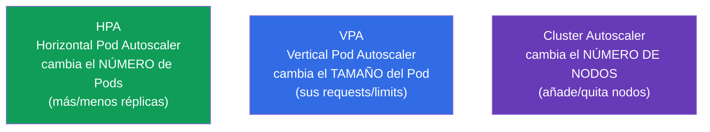
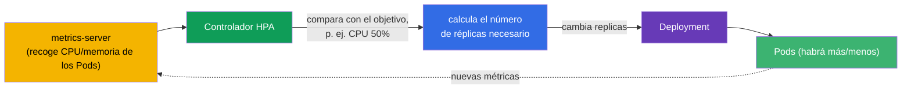
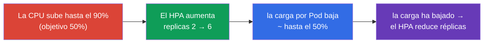
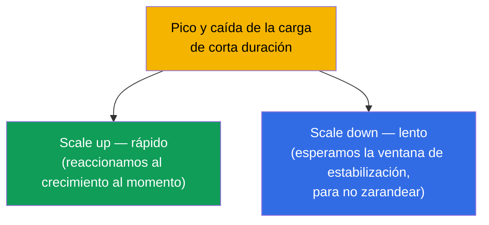
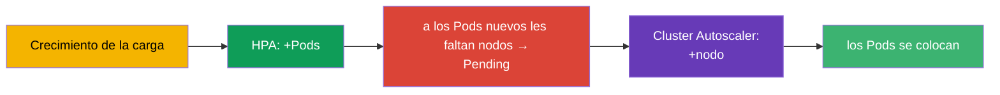

[Русская версия](ru.md) · [Eng version](README.md) · [Version française](fr.md) · [Deutsche Version](de.md) · [ქართული ვერსია](ge.md) · [繁體中文版](tw.md) · [日本語版](jp.md)

# Capítulo 16. Autoescalado de cargas: HPA

> **Qué viene ahora.** Hasta ahora el número de réplicas del Deployment lo fijábamos a mano
> (`scale`). Pero la carga cambia: de día el pico, de noche la calma. El
> **HorizontalPodAutoscaler (HPA)** cambia automáticamente el número de Pods según las métricas
> (normalmente CPU/memoria). Con esto se cierra la parte 2 y pertenece al dominio Workloads (CKA)
> y Application Deployment (CKAD). De paso veremos a sus vecinos - VPA y Cluster Autoscaler - para
> tener la imagen completa del escalado.

## 16.1. Tres tipos de escalado

Para no liarnos, dejemos claro desde el principio qué se escala en Kubernetes y cómo.



| Autoescalador | Qué cambia | Ejemplo |
|-------------|-----------|--------|
| **HPA** (horizontal) | número de réplicas del Pod | 3 → 10 Pods cuando sube la CPU |
| **VPA** (vertical) | requests/limits del Pod | subir la memoria de 256Mi a 512Mi |
| **Cluster Autoscaler** | número de nodos del clúster | añadir un nodo cuando los Pods no caben |

El protagonista del examen es el **HPA**. VPA y Cluster Autoscaler hay que conocerlos a nivel conceptual.

## 16.2. Cómo funciona el HPA

El HPA es un controlador (bucle de reconciliación) que periódicamente (por defecto, cada ~15
segundos) mira las métricas de los Pods y las compara con el valor objetivo. Si el consumo real está
por encima del objetivo, añade réplicas; si está por debajo, las quita.



La fórmula con la que el HPA calcula el número deseado de réplicas:

```
réplicas deseadas = actuales × (métrica actual / métrica objetivo)
```

Por ejemplo: 3 Pods, carga actual de CPU 90%, objetivo 50% → `3 × (90/50) = 5.4` → redondeo hacia
arriba → **6 Pods**.

## 16.3. metrics-server: sin él el HPA no funciona

El HPA no saca las métricas de la nada. Para las métricas básicas (CPU/memoria) hace falta el
**metrics-server**, el componente que recoge el consumo del kubelet y lo sirve por la Metrics API. Ese
mismo metrics-server alimenta a `kubectl top` (capítulo 28).

```bash
# Comprobar si metrics-server está instalado
kubectl get deployment metrics-server -n kube-system
kubectl top pods           # si funciona — veremos el consumo
```

> **Causa frecuente de «el HPA no escala».** Si `kubectl top` devuelve un error o la columna de
> métricas en `kubectl get hpa` muestra `<unknown>`, significa que metrics-server no está instalado
> o no funciona. Sin él el HPA está ciego. Es lo primero que se comprueba al depurar un HPA.

Para métricas más complejas que CPU/memoria (peticiones por segundo, longitud de una cola) hacen falta
**custom/external metrics** mediante adaptadores (por ejemplo, Prometheus Adapter) - véase la sección
siguiente.

### Métricas personalizadas y externas

CPU y memoria son solo el caso básico. El HPA (`autoscaling/v2`) puede escalar según tres tipos de
métricas:

| Tipo de métrica | De dónde viene | Ejemplo | API |
|-------------|--------|--------|-----|
| `Resource` | metrics-server | CPU/memoria de los Pods | `metrics.k8s.io` |
| `Pods` / `Object` (custom) | del clúster | peticiones/s por Pod, profundidad de la cola en la aplicación | `custom.metrics.k8s.io` |
| `External` | de fuera del clúster | longitud de una cola SQS/Kafka, métrica de la nube | `external.metrics.k8s.io` |

El metrics-server solo sirve métricas de tipo `Resource`. Para custom/external hace falta un
**adaptador** que registre el metrics API correspondiente. El más extendido es el **Prometheus
Adapter**: coge las métricas de Prometheus y las publica como `custom.metrics.k8s.io` para que el HPA
pueda calcular con ellas. Ejemplo de HPA con una métrica personalizada de «peticiones por segundo por
Pod»:

```yaml
apiVersion: autoscaling/v2
kind: HorizontalPodAutoscaler
metadata:
  name: web
spec:
  scaleTargetRef:
    apiVersion: apps/v1
    kind: Deployment
    name: web
  minReplicas: 2
  maxReplicas: 20
  metrics:
  - type: Pods                         # métrica personalizada «por cada Pod»
    pods:
      metric:
        name: http_requests_per_second
      target:
        type: AverageValue
        averageValue: "100"            # mantener ~100 rps por Pod
```

Para métricas de fuera del clúster (por ejemplo, la longitud de una cola) se usa `type: External`. La
lógica del HPA es la misma - comparar el valor actual con el objetivo y recalcular las réplicas; solo
cambia la fuente de la métrica.

### KEDA: autoescalado event-driven

Configurar el Prometheus Adapter y escribir reglas para cada sistema externo es laborioso. **KEDA**
(Kubernetes Event-driven Autoscaling) resuelve esto: es una capa por encima que escala la carga
**según eventos de fuentes externas** y sabe hacer lo que el HPA básico no puede - **escalar a cero**
(scale to zero) cuando no hay eventos.

Ideas clave de KEDA:

- **Escaladores (scalers)** - integraciones listas con decenas de fuentes: Kafka, RabbitMQ,
  AWS SQS, Prometheus, Redis, cron, colas en la nube, etc. No hay que montar a mano un
  adaptador para cada sistema.
- **`ScaledObject`** - CRD donde se describe qué escalar y con qué disparador:

  ```yaml
  apiVersion: keda.sh/v1alpha1
  kind: ScaledObject
  metadata:
    name: consumer
  spec:
    scaleTargetRef:
      name: consumer                 # qué Deployment escalar
    minReplicaCount: 0               # KEDA sabe bajar hasta cero
    maxReplicaCount: 30
    triggers:
    - type: kafka                    # escalador para una fuente concreta
      metadata:
        topic: orders
        lagThreshold: "100"          # 1 réplica por cada 100 mensajes de lag
  ```

- **Por debajo está el mismo HPA.** KEDA no sustituye al HPA, sino que lo gobierna: para un
  `ScaledObject` crea él mismo un HPA y lo alimenta con métricas vía `external.metrics.k8s.io`. El caso
  aparte es el scale to zero: la transición `0↔1` la hace KEDA por su cuenta (el HPA no sabe bajar a
  cero), y del escalado `1→N` se encarga ya el HPA creado.

**Cuándo elegir cada cosa.** Por CPU/memoria, el HPA estándar + metrics-server. Por métricas de
aplicación desde Prometheus, HPA + Prometheus Adapter. Por eventos de colas/brókers y allí donde hace
falta scale to zero (procesadores de colas, workers batch poco frecuentes), KEDA: menos configuración
manual y ahorro en los tiempos muertos, cuando no hay trabajo.

## 16.4. Creación de un HPA

Condición obligatoria: los Pods del Deployment deben tener definidos los **requests** del recurso
correspondiente (capítulo 14) - si no, el HPA no tiene con qué comparar el porcentaje de carga.

De forma imperativa:

```bash
kubectl autoscale deployment web --min=2 --max=10 --cpu-percent=50
```

De forma declarativa (autoscaling/v2 - admite varias métricas):

```yaml
apiVersion: autoscaling/v2
kind: HorizontalPodAutoscaler
metadata:
  name: web
spec:
  scaleTargetRef:
    apiVersion: apps/v1
    kind: Deployment
    name: web
  minReplicas: 2
  maxReplicas: 10
  metrics:
  - type: Resource
    resource:
      name: cpu
      target:
        type: Utilization
        averageUtilization: 50    # mantener la carga media de CPU ~50%
```

```bash
kubectl get hpa
kubectl describe hpa web      # métrica actual/objetivo, eventos de escalado
```



## 16.5. min/max y estabilización

Dos limitadores obligatorios:

- **minReplicas** - límite inferior (el HPA no bajará por debajo, aunque no haya carga).
- **maxReplicas** - límite superior (protección frente a un crecimiento incontrolado y la ruina).

Para que el HPA no «zarandee» el número de Pods de un lado a otro con los saltos de las métricas,
existe la **ventana de estabilización (stabilization window)**: antes de reducir réplicas el HPA
espera (por defecto, 5 minutos) para asegurarse de que la carga ha bajado de verdad y no ha sido una
oscilación. El comportamiento del escalado se ajusta con detalle con el bloque `behavior` (velocidad de
scale up/down).



La asimetría es intencionada: es mejor crecer rápido (para aguantar la avalancha) y reducirse con
prudencia (para no quitar Pods justo antes de un nuevo pico).

## 16.6. HPA y Cluster Autoscaler juntos

El HPA añade Pods, pero ¿qué pasa si los nodos ya no tienen dónde colocarlos? Aquí entra en juego el
**Cluster Autoscaler**: ve los Pods en `Pending` por falta de recursos y añade nodos al clúster (en la
nube), y cuando hay poca actividad, quita los que sobran.



La combinación HPA + Cluster Autoscaler es la base de la elasticidad en la nube: el HPA escala la
aplicación y el Cluster Autoscaler, la infraestructura que la sostiene. HPA y VPA, en cambio, **no se
aplican juntos sobre el mismo recurso** (entrarían en conflicto, porque los dos cambian la reacción a
la CPU/memoria).

> **Karpenter, la alternativa moderna al Cluster Autoscaler.** El Cluster Autoscaler clásico escala
> node groups **definidos de antemano** (nodos iguales). **Karpenter** (al principio de AWS, ahora
> también de otros) va más allá: a partir de los Pods sin colocar, elige y arranca directamente un nodo
> del **tipo/tamaño adecuado** (right-sizing, instancias spot, consolidación de nodos poco cargados)
> sin pools predefinidos. En la nube esto suele ser más rápido y más barato; la idea es la misma -
> añadir nodos para los Pods en `Pending`, pero con más flexibilidad.

## 16.7. Cómo se aplica esto en producción

- **El HPA es el estándar para la carga variable.** Los servicios web y las API con picos diarios están
  casi siempre bajo HPA: mantienen el mínimo de réplicas de noche y se despliegan para el pico de día.
  Esto ahorra recursos y dinero sin intervención manual.
- **Los requests son condición obligatoria.** En producción, bajo cada HPA hay requests correctamente
  elegidos: a partir de ellos se calcula el porcentaje de carga. Requests incorrectos → el HPA escala
  cuando no toca.
- **No solo CPU.** Los equipos maduros escalan según métricas de aplicación (peticiones/s,
  profundidad de la cola, latencia) con Prometheus Adapter o KEDA (autoescalado event-driven, incluso
  hasta cero réplicas). La CPU es solo el punto de partida.
- **HPA + Cluster Autoscaler.** En la nube son un tándem: la aplicación escala con Pods y la
  infraestructura, con nodos. Sin Cluster Autoscaler el HPA choca con el techo de los nodos y deja los
  Pods en Pending.
- **Ajustar behavior según el servicio.** Para tráfico con picos bruscos se acelera el scale up y se
  ralentiza el scale down, para no «colapsarse» antes de la siguiente ola. El PodDisruptionBudget
  protege además frente a una reducción excesiva (capítulo 36).

## 16.8. Mini-glosario

- **HPA (HorizontalPodAutoscaler)** - cambia el número de réplicas según las métricas.
- **VPA (VerticalPodAutoscaler)** - cambia los requests/limits de los Pods.
- **Cluster Autoscaler** - cambia el número de nodos del clúster.
- **metrics-server** - recoge CPU/memoria de los Pods; hace falta para el HPA y para `kubectl top`.
- **averageUtilization** - porcentaje medio de carga del recurso que se toma como objetivo.
- **minReplicas/maxReplicas** - límites inferior y superior del número de réplicas.
- **stabilization window** - ventana de espera antes de reducir réplicas.
- **behavior** - ajuste fino de la velocidad de scale up/down.
- **KEDA** - autoescalado event-driven según eventos externos (incluso hasta cero).

## 16.9. Resumen del capítulo

- Tres escalados: HPA (número de Pods), VPA (tamaño del Pod), Cluster Autoscaler (número de
  nodos).
- El HPA compara la métrica actual con la objetivo y cambia las réplicas con la fórmula
  `réplicas × (actual/objetivo)`.
- El HPA necesita metrics-server (para CPU/memoria); sin él la métrica es `<unknown>` y el HPA no
  escala.
- Condición obligatoria del HPA: que los Pods tengan requests definidos (a partir de ellos se calcula
  el porcentaje).
- min/max limitan el rango de réplicas; la ventana de estabilización evita «zarandear» el número de
  Pods; el scale up suele ser rápido y el scale down, prudente.
- HPA + Cluster Autoscaler: la aplicación escala con Pods y la infraestructura, con nodos.
- HPA y VPA no se aplican juntos sobre el mismo recurso.

## 16.10. Para qué te servirá: en el examen y en el trabajo real

**En el examen.** «Crea un HPA para el deployment con objetivo de CPU 50%, min 2 max 10» es una tarea
típica (`kubectl autoscale` o un manifiesto). Hay que recordar los requests y el metrics-server como
condición de funcionamiento. Depurar «el HPA no escala» → comprobar `kubectl top`/metrics-server.

**En el trabajo real.** El HPA es el mecanismo principal de elasticidad de las aplicaciones: ahorra
recursos en la calma y aguanta la carga en el pico sin intervención manual. Junto con el Cluster
Autoscaler da elasticidad completa en la nube. Entender las métricas, los requests y el comportamiento
del scale up/down determina si el autoescalado va a ayudar o a crear problemas.

## 16.11. Preguntas de autoevaluación

1. ¿En qué se diferencian HPA, VPA y Cluster Autoscaler por lo que cambian?
2. ¿Con qué fórmula calcula el HPA el número necesario de réplicas? Calcúlalo para 4 Pods, CPU 80%,
   objetivo 40%.
3. ¿Para qué necesita el HPA el metrics-server y cómo se ve que no está?
4. ¿Por qué los Pods bajo un HPA deben tener obligatoriamente requests definidos?
5. ¿Qué hacen minReplicas/maxReplicas y la ventana de estabilización?
6. ¿Por qué el scale up suele ser rápido y el scale down, lento?
7. ¿Cómo trabajan juntos el HPA y el Cluster Autoscaler cuando crece la carga?

## Práctica

Con esto se cierra la parte 2 (cargas de trabajo y planificación). A continuación viene la parte 3:
configuración y seguridad de las aplicaciones, empezando por comandos, argumentos y variables de
entorno (capítulo 17). El HPA se practica en los laboratorios de cargas de trabajo junto con el perfil
de carga de la imagen `ping_pong`.

🧪 Laboratorio 104 (autoescalado con HPA): [tasks/cka/labs/104](../../labs/104/README_ES.MD)

🎮 Killercoda (en el navegador, sin instalación): [Monitoring Kubernetes with Metrics Server](https://killercoda.com/chadmcrowell/course/ckad/metrics-server)

---
[Índice](../README_ES.md) · [Capítulo 15](../15/es.md) · [Capítulo 17](../17/es.md)
