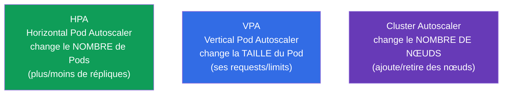
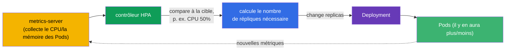
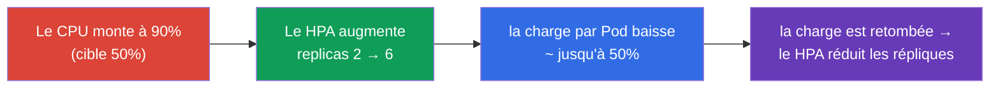
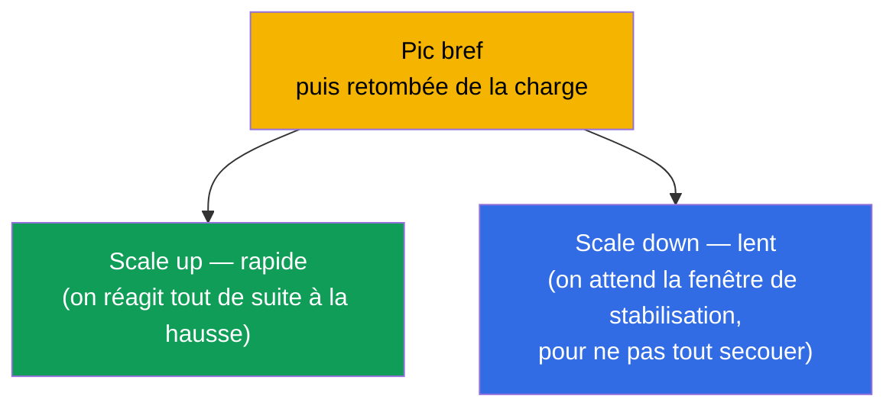
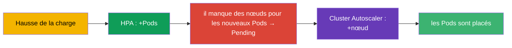

[Русская версия](ru.md) · [Eng version](README.md) · [Versión en español](es.md) · [Deutsche Version](de.md) · [ქართული ვერსია](ge.md)

# Chapitre 16. Autoscaling des charges de travail : HPA

> **Ce qui suit.** Jusqu'ici, nous fixions le nombre de répliques d'un Deployment à la main
> (`scale`). Mais la charge varie : un pic le jour, le calme la nuit. Le
> **HorizontalPodAutoscaler (HPA)** change automatiquement le nombre de Pods d'après des
> métriques (généralement le CPU/la mémoire). Cela clôt la partie 2 et relève du domaine
> Workloads (CKA) et Application Deployment (CKAD). Au passage, nous verrons les voisins - VPA
> et Cluster Autoscaler - pour avoir toute l'image du scaling.

## 16.1. Trois types de scaling

Pour ne pas s'y perdre, posons tout de suite ce qui est mis à l'échelle dans Kubernetes, et
comment.



| Autoscaler | Ce qu'il change | Exemple |
|-------------|-----------|--------|
| **HPA** (horizontal) | le nombre de répliques du Pod | 3 → 10 Pods quand le CPU grimpe |
| **VPA** (vertical) | les requests/limits du Pod | passer la mémoire de 256Mi à 512Mi |
| **Cluster Autoscaler** | le nombre de nœuds du cluster | ajouter un nœud quand les Pods ne rentrent plus |

Le héros principal de l'examen, c'est le **HPA**. Le VPA et le Cluster Autoscaler sont à
connaître conceptuellement.

## 16.2. Comment fonctionne le HPA

Le HPA est un contrôleur (boucle de réconciliation) qui, périodiquement (par défaut toutes
les ~15 secondes), regarde les métriques des Pods et les compare à une valeur cible. Si la
consommation réelle est au-dessus de la cible, il ajoute des répliques ; en dessous, il en
retire.



La formule par laquelle le HPA calcule le nombre de répliques souhaité :

```
répliques souhaitées = actuelles × (métrique actuelle / métrique cible)
```

Par exemple : 3 Pods, charge CPU actuelle 90%, cible 50% → `3 × (90/50) = 5.4` → arrondi au
supérieur → **6 Pods**.

## 16.3. metrics-server : sans lui, le HPA ne fonctionne pas

Le HPA ne sort pas les métriques de nulle part. Pour les métriques de base (CPU/mémoire), il
faut le **metrics-server** - le composant qui collecte la consommation auprès du kubelet et
l'expose via la Metrics API. Ce même metrics-server alimente `kubectl top` (chapitre 28).

```bash
# Vérifier si metrics-server est installé
kubectl get deployment metrics-server -n kube-system
kubectl top pods           # s'il fonctionne — on verra la consommation
```

> **Cause fréquente du « HPA ne scale pas ».** Si `kubectl top` renvoie une erreur ou si la
> colonne des métriques de `kubectl get hpa` affiche `<unknown>`, c'est que metrics-server
> n'est pas installé ou ne fonctionne pas. Sans lui, le HPA est aveugle. C'est la première
> chose à vérifier quand on débogue un HPA.

Pour des métriques plus complexes que le CPU/la mémoire (requêtes par seconde, longueur de
file), il faut des **custom/external metrics** via des adaptateurs (par exemple, le Prometheus
Adapter) - voir la section suivante.

### Métriques personnalisées et externes

Le CPU et la mémoire ne sont que le cas de base. Le HPA (`autoscaling/v2`) sait scaler d'après
trois types de métriques :

| Type de métrique | D'où elle vient | Exemple | API |
|-------------|--------|--------|-----|
| `Resource` | metrics-server | CPU/mémoire des Pods | `metrics.k8s.io` |
| `Pods` / `Object` (custom) | depuis le cluster | requêtes/s par Pod, profondeur de file dans l'application | `custom.metrics.k8s.io` |
| `External` | depuis l'extérieur du cluster | longueur d'une file SQS/Kafka, métrique du cloud | `external.metrics.k8s.io` |

Le metrics-server ne fournit que les métriques `Resource`. Pour les custom/external, il faut un
**adaptateur** qui enregistre le metrics API correspondant. Le plus répandu est le **Prometheus
Adapter** : il prend les métriques dans Prometheus et les publie comme
`custom.metrics.k8s.io`, afin que le HPA puisse calculer avec elles. Exemple de HPA sur une
métrique personnalisée « requêtes par seconde par Pod » :

```yaml
apiVersion: autoscaling/v2
kind: HorizontalPodAutoscaler
metadata:
  name: web
spec:
  scaleTargetRef:
    apiVersion: apps/v1
    kind: Deployment
    name: web
  minReplicas: 2
  maxReplicas: 20
  metrics:
  - type: Pods                         # métrique personnalisée « par Pod »
    pods:
      metric:
        name: http_requests_per_second
      target:
        type: AverageValue
        averageValue: "100"            # tenir ~100 rps par Pod
```

Pour les métriques venant de l'extérieur du cluster (par exemple, la longueur d'une file), on
utilise `type: External`. La logique du HPA reste la même - comparer la valeur actuelle à la
cible et recalculer les répliques ; seule la source de la métrique change.

### KEDA : autoscaling event-driven

Configurer le Prometheus Adapter et écrire des règles pour chaque système externe est
laborieux. **KEDA** (Kubernetes Event-driven Autoscaling) résout cela : c'est une surcouche qui
scale la charge **d'après les événements de sources externes** et qui sait faire ce dont le HPA
de base est incapable - le **scaling jusqu'à zéro** (scale to zero) quand il n'y a pas
d'événements.

Les idées clés de KEDA :

- **Les scalers** - des intégrations prêtes à l'emploi avec des dizaines de sources : Kafka,
  RabbitMQ, AWS SQS, Prometheus, Redis, cron, files cloud, etc. Pas besoin de bricoler à la
  main un adaptateur pour chaque système.
- **`ScaledObject`** - la CRD où l'on décrit quoi scaler et sur quel déclencheur :

  ```yaml
  apiVersion: keda.sh/v1alpha1
  kind: ScaledObject
  metadata:
    name: consumer
  spec:
    scaleTargetRef:
      name: consumer                 # quel Deployment scaler
    minReplicaCount: 0               # KEDA sait descendre jusqu'à zéro
    maxReplicaCount: 30
    triggers:
    - type: kafka                    # le scaler de la source concernée
      metadata:
        topic: orders
        lagThreshold: "100"          # 1 réplique par 100 messages de lag
  ```

- **Sous le capot, c'est le même HPA.** KEDA ne remplace pas le HPA, il le pilote : pour un
  `ScaledObject`, il crée lui-même un HPA et le nourrit de métriques via
  `external.metrics.k8s.io`. Cas à part - le scale to zero : la transition `0↔1`, KEDA la fait
  lui-même (le HPA ne sait pas descendre à zéro), et ensuite le scaling `1→N` est assuré par le
  HPA créé.

**Quand choisir quoi.** Pour le CPU/la mémoire - le HPA standard + metrics-server. Pour des
métriques applicatives issues de Prometheus - HPA + Prometheus Adapter. Pour les événements de
files/brokers et là où il faut un scale to zero (consommateurs de files, workers batch rares) -
KEDA : moins de configuration manuelle et des économies pendant les périodes creuses, quand il
n'y a pas de travail.

## 16.4. Création d'un HPA

Condition obligatoire : les Pods du Deployment doivent avoir des **requests** définies sur la
ressource concernée (chapitre 14) - sinon le HPA n'a rien à quoi comparer le pourcentage de
charge.

De façon impérative :

```bash
kubectl autoscale deployment web --min=2 --max=10 --cpu-percent=50
```

De façon déclarative (autoscaling/v2 - prend en charge plusieurs métriques) :

```yaml
apiVersion: autoscaling/v2
kind: HorizontalPodAutoscaler
metadata:
  name: web
spec:
  scaleTargetRef:
    apiVersion: apps/v1
    kind: Deployment
    name: web
  minReplicas: 2
  maxReplicas: 10
  metrics:
  - type: Resource
    resource:
      name: cpu
      target:
        type: Utilization
        averageUtilization: 50    # tenir une charge CPU moyenne de ~50%
```

```bash
kubectl get hpa
kubectl describe hpa web      # métrique actuelle/cible, événements de scaling
```



## 16.5. min/max et stabilisation

Deux limiteurs obligatoires :

- **minReplicas** - la borne inférieure (le HPA ne descendra pas en dessous, même sans charge).
- **maxReplicas** - la borne supérieure (protection contre une croissance incontrôlée et la
  ruine).

Pour que le HPA ne « secoue » pas le nombre de Pods dans tous les sens au moindre soubresaut
des métriques, il existe une **fenêtre de stabilisation (stabilization window)** : avant de
réduire les répliques, le HPA patiente (par défaut 5 minutes) pour s'assurer que la charge est
vraiment retombée, et non qu'elle a simplement oscillé. Le comportement du scaling se règle
finement avec le bloc `behavior` (vitesse de scale up/down).



L'asymétrie est volontaire : mieux vaut grandir vite (pour absorber l'afflux) et se réduire
prudemment (pour ne pas retirer des Pods juste avant un nouveau pic).

## 16.6. HPA et Cluster Autoscaler ensemble

Le HPA ajoute des Pods - mais que faire si les nœuds n'ont plus de place pour les accueillir ?
C'est là qu'entre en jeu le **Cluster Autoscaler** : il voit les Pods en `Pending` faute de
ressources et ajoute des nœuds au cluster (dans le cloud), et en période creuse il retire ceux
qui sont en trop.



Le duo HPA + Cluster Autoscaler est la base de l'élasticité dans le cloud : le HPA met à
l'échelle l'application, le Cluster Autoscaler l'infrastructure qui la porte. En revanche, HPA
et VPA **ne s'appliquent pas ensemble sur une même ressource** (ils entreraient en conflit,
tous deux modifiant la réaction au CPU/à la mémoire).

> **Karpenter - l'alternative moderne au Cluster Autoscaler.** Le Cluster Autoscaler classique
> met à l'échelle des node groups **définis à l'avance** (des nœuds identiques). **Karpenter**
> (initialement AWS, aujourd'hui d'autres aussi) va plus loin : d'après les Pods non placés, il
> choisit et démarre directement un nœud **du type/de la taille adaptés** (right-sizing,
> instances spot, consolidation des nœuds sous-utilisés) sans pools prédéfinis. Dans le cloud,
> c'est souvent plus rapide et moins cher ; l'idée reste la même - ajouter des nœuds pour les
> Pods en `Pending`, mais avec plus de souplesse.

## 16.7. Comment cela s'applique en production

- **Le HPA est le standard pour une charge variable.** Les sites web et les API avec des pics
  journaliers sont presque toujours sous HPA : ils gardent un minimum de répliques la nuit et se
  déploient pour le pic de la journée. Cela économise des ressources et de l'argent sans
  intervention manuelle.
- **Les requests sont une condition obligatoire.** En prod, sous chaque HPA il y a des requests
  correctement dimensionnées : c'est d'elles qu'on calcule le pourcentage de charge. Des
  requests fausses → un HPA qui scale à côté.
- **Pas seulement le CPU.** Les équipes mûres scalent d'après des métriques applicatives
  (requêtes/s, profondeur de file, latence) via le Prometheus Adapter ou KEDA (autoscaling
  event-driven, jusqu'à zéro réplique). Le CPU n'est qu'un point de départ.
- **HPA + Cluster Autoscaler.** Dans le cloud, c'est un duo : l'application se met à l'échelle
  par les Pods, l'infrastructure par les nœuds. Sans Cluster Autoscaler, le HPA butera sur le
  plafond des nœuds et laissera les Pods en Pending.
- **Réglage de behavior selon le service.** Pour un trafic à pics brusques, on accélère le
  scale up et on ralentit le scale down, afin de ne pas « s'effondrer » avant la vague
  suivante. Le PodDisruptionBudget protège en plus d'une réduction excessive (chapitre 36).

## 16.8. Mini-glossaire

- **HPA (HorizontalPodAutoscaler)** - change le nombre de répliques d'après des métriques.
- **VPA (VerticalPodAutoscaler)** - change les requests/limits des Pods.
- **Cluster Autoscaler** - change le nombre de nœuds du cluster.
- **metrics-server** - collecte le CPU/la mémoire des Pods ; nécessaire au HPA et à
  `kubectl top`.
- **averageUtilization** - le pourcentage moyen cible de charge d'une ressource.
- **minReplicas/maxReplicas** - les bornes inférieure et supérieure du nombre de répliques.
- **stabilization window** - la fenêtre d'attente avant de réduire les répliques.
- **behavior** - le réglage fin de la vitesse de scale up/down.
- **KEDA** - autoscaling event-driven d'après des événements externes (y compris jusqu'à zéro).

## 16.9. Bilan du chapitre

- Trois scalings : HPA (nombre de Pods), VPA (taille du Pod), Cluster Autoscaler (nombre de
  nœuds).
- Le HPA compare la métrique actuelle à la cible et change les répliques selon la formule
  `répliques × (actuelle/cible)`.
- Le HPA exige metrics-server (pour le CPU/la mémoire) ; sans lui, la métrique est `<unknown>`
  et le HPA ne scale pas.
- Condition obligatoire du HPA - des requests définies sur les Pods (c'est d'elles qu'on calcule
  le pourcentage).
- min/max bornent la plage de répliques ; la fenêtre de stabilisation empêche de « secouer » le
  nombre de Pods ; le scale up est généralement rapide, le scale down prudent.
- HPA + Cluster Autoscaler : l'application se met à l'échelle par les Pods, l'infrastructure par
  les nœuds.
- HPA et VPA ne s'appliquent pas ensemble sur une même ressource.

## 16.10. À quoi cela sert : à l'examen et dans le travail réel

**À l'examen.** « Crée un HPA pour un déploiement avec une cible CPU de 50%, min 2 max 10 » est
un exercice type (`kubectl autoscale` ou un manifeste). Il faut se souvenir des requests et de
metrics-server comme condition de fonctionnement. Débogage du « HPA ne scale pas » →
vérification de `kubectl top`/metrics-server.

**Dans le travail réel.** Le HPA est le mécanisme principal d'élasticité des applications : il
économise des ressources dans les périodes calmes et tient la charge au pic sans intervention
manuelle. Associé au Cluster Autoscaler, il donne une élasticité complète dans le cloud. La
compréhension des métriques, des requests et du comportement de scale up/down détermine si
l'autoscaling va aider ou créer des problèmes.

## 16.11. Questions d'auto-évaluation

1. En quoi HPA, VPA et Cluster Autoscaler diffèrent-ils par ce qu'ils changent ?
2. Selon quelle formule le HPA calcule-t-il le nombre de répliques nécessaire ? Calculez pour 4
   Pods, CPU 80%, cible 40%.
3. Pourquoi le HPA a-t-il besoin de metrics-server et comment savoir qu'il est absent ?
4. Pourquoi les Pods sous HPA doivent-ils obligatoirement avoir des requests définies ?
5. Que font minReplicas/maxReplicas et la fenêtre de stabilisation ?
6. Pourquoi le scale up est-il généralement rapide et le scale down lent ?
7. Comment le HPA et le Cluster Autoscaler travaillent-ils ensemble quand la charge augmente ?

## Pratique

La partie 2 (charges de travail et planification) s'achève ici. Ensuite - la partie 3 :
configuration et sécurité des applications, en commençant par les commandes, les arguments et
les variables d'environnement (chapitre 17). Le HPA se travaille dans les TP sur les charges de
travail, avec le profil de charge de l'image `ping_pong`.

🧪 TP 104 (autoscaling HPA) : [tasks/cka/labs/104](../../labs/104/README_FR.MD)

---
[Sommaire](../README_FR.md) · [Chapitre 15](../15/fr.md) · [Chapitre 17](../17/fr.md)
