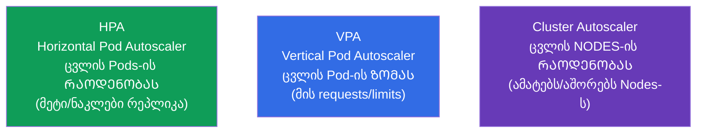
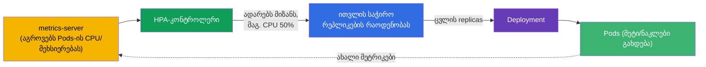
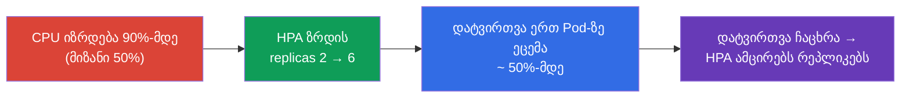
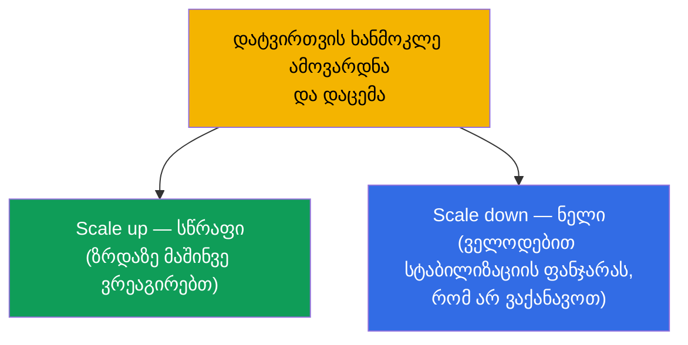

[Русская версия](ru.md) · [Eng version](README.md) · [Versión en español](es.md) · [Version française](fr.md) · [Deutsche Version](de.md)

# თავი 16. დატვირთვების ავტომასშტაბირება: HPA

> **რა იქნება შემდეგ.** აქამდე Deployment-ის რეპლიკების რაოდენობას ხელით ვსვამდით (`scale`). მაგრამ
> დატვირთვა იცვლება: დღისით პიკი, ღამით სიჩუმე. **HorizontalPodAutoscaler (HPA)**
> ავტომატურად ცვლის Pods-ის რაოდენობას მეტრიკების მიხედვით (ჩვეულებრივ CPU/მეხსიერებით). ეს ხურავს
> მეორე ნაწილს და ეხება დომენებს Workloads (CKA) და Application Deployment (CKAD). ამავდროულად
> გავარჩევთ მეზობლებს - VPA-სა და Cluster Autoscaler-ს - რომ მასშტაბირების მთელი სურათი დავინახოთ.

## 16.1. მასშტაბირების სამი სახე

რომ არ აგვერიოს, მაშინვე დავალაგოთ, რა და როგორ მასშტაბირდება Kubernetes-ში.



| ავტოსკეილერი | რას ცვლის | მაგალითი |
|-------------|-----------|--------|
| **HPA** (ჰორიზონტალური) | Pod-ის რეპლიკების რაოდენობა | 3 → 10 Pods CPU-ს ზრდისას |
| **VPA** (ვერტიკალური) | Pod-ის requests/limits | მეხსიერების აწევა 256Mi-დან 512Mi-მდე |
| **Cluster Autoscaler** | Nodes-ის რაოდენობა კლასტერში | Node-ის დამატება, როცა Pods ვერ ეტევა |

გამოცდის მთავარი გმირი - **HPA**. VPA და Cluster Autoscaler კონცეპტუალურად უნდა იცოდეთ.

## 16.2. როგორ მუშაობს HPA

HPA - ეს არის კონტროლერი (შეთანხმების მარყუჟი), რომელიც პერიოდულად (ნაგულისხმევად დაახლოებით 15
წამში ერთხელ) უყურებს Pods-ის მეტრიკებს და ადარებს სამიზნე მნიშვნელობას. თუ ფაქტობრივი
მოხმარება მიზანზე მაღალია - ამატებს რეპლიკებს, თუ დაბალია - აშორებს.



ფორმულა, რომლითაც HPA ითვლის რეპლიკების სასურველ რაოდენობას:

```
სასურველი რეპლიკები = მიმდინარე × (მიმდინარე მეტრიკა / სამიზნე მეტრიკა)
```

მაგალითად: 3 Pod, CPU-ს მიმდინარე დატვირთვა 90%, მიზანი 50% → `3 × (90/50) = 5.4` → დამრგვალება
ზევით → **6 Pod**.

## 16.3. metrics-server: მის გარეშე HPA არ მუშაობს

HPA მეტრიკებს ჰაერიდან არ იღებს. საბაზისო მეტრიკებისთვის (CPU/მეხსიერება) საჭიროა **metrics-server**
- კომპონენტი, რომელიც აგროვებს მოხმარებას kubelet-იდან და გასცემს Metrics API-ის საშუალებით. იგივე
metrics-server კვებავს `kubectl top`-ს (თავი 28).

```bash
# შევამოწმოთ, დაყენებულია თუ არა metrics-server
kubectl get deployment metrics-server -n kube-system
kubectl top pods           # თუ მუშაობს — დავინახავთ მოხმარებას
```

> **„HPA არ ამასშტაბირებს“-ის ხშირი მიზეზი.** თუ `kubectl top` შეცდომას წერს ან მეტრიკების
> სვეტი `kubectl get hpa`-ში აჩვენებს `<unknown>`-ს - ესე იგი metrics-server დაყენებული არ არის
> ან არ მუშაობს. მის გარეშე HPA ბრმაა. ეს არის პირველი, რასაც HPA-ს გამართვისას ამოწმებენ.

CPU/მეხსიერებაზე უფრო რთული მეტრიკებისთვის (მოთხოვნები წამში, რიგის სიგრძე) საჭიროა **custom/external
metrics** ადაპტერების საშუალებით (მაგალითად, Prometheus Adapter) - იხ. შემდეგი განყოფილება.

### კასტომური და გარე მეტრიკები

CPU და მეხსიერება - მხოლოდ საბაზისო შემთხვევაა. HPA (`autoscaling/v2`) მასშტაბირებას შეუძლია სამი
ტიპის მეტრიკით:

| მეტრიკის ტიპი | საიდან | მაგალითი | API |
|-------------|--------|--------|-----|
| `Resource` | metrics-server | Pods-ის CPU/მეხსიერება | `metrics.k8s.io` |
| `Pods` / `Object` (custom) | კლასტერიდან | მოთხოვნა/წმ ერთ Pod-ზე, რიგის სიღრმე აპლიკაციაში | `custom.metrics.k8s.io` |
| `External` | კლასტერის გარედან | SQS/Kafka-ს რიგის სიგრძე, ღრუბლის მეტრიკა | `external.metrics.k8s.io` |

Metrics-server გასცემს მხოლოდ `Resource`-მეტრიკებს. custom/external-ისთვის საჭიროა **ადაპტერი**,
რომელიც შესაბამის metrics API-ს არეგისტრირებს. ყველაზე გავრცელებული - **Prometheus
Adapter**: ის იღებს მეტრიკებს Prometheus-იდან და აქვეყნებს მათ როგორც `custom.metrics.k8s.io`,
რომ HPA-ს მათი მიხედვით თვლა შეეძლოს. HPA-ს მაგალითი კასტომური მეტრიკით „მოთხოვნები წამში ერთ Pod-ზე“:

```yaml
apiVersion: autoscaling/v2
kind: HorizontalPodAutoscaler
metadata:
  name: web
spec:
  scaleTargetRef:
    apiVersion: apps/v1
    kind: Deployment
    name: web
  minReplicas: 2
  maxReplicas: 20
  metrics:
  - type: Pods                         # კასტომური მეტრიკა „ყოველ Pod-ზე“
    pods:
      metric:
        name: http_requests_per_second
      target:
        type: AverageValue
        averageValue: "100"            # დავიჭიროთ ~100 rps ერთ Pod-ზე
```

კლასტერის გარედან მოსული მეტრიკებისთვის (მაგალითად, რიგის სიგრძე) იყენებენ `type: External`-ს. HPA-ს
ლოგიკა იგივეა - შეადაროს მიმდინარე მნიშვნელობა მიზანს და გადათვალოს რეპლიკები; იცვლება მხოლოდ
მეტრიკის წყარო.

### KEDA: event-driven ავტოსკეილინგი

Prometheus Adapter-ის კონფიგურაცია და ყოველ გარე სისტემაზე წესების წერა შრომატევადია.
**KEDA** (Kubernetes Event-driven Autoscaling) ამას წყვეტს: ეს არის დანადგარი, რომელიც
ამასშტაბირებს დატვირთვას **გარე წყაროებიდან მოსული მოვლენების მიხედვით** და შეუძლია ის, რაც საბაზისო
HPA-ს არ შეუძლია, - **ნულამდე მასშტაბირება** (scale to zero), როცა მოვლენები არ არის.

KEDA-ს ძირითადი იდეები:

- **სკეილერები (scalers)** - მზა ინტეგრაციები ათეულობით წყაროსთან: Kafka, RabbitMQ,
  AWS SQS, Prometheus, Redis, cron, ღრუბლოვანი რიგები და ა.შ. არ არის საჭირო ხელით ავაწყოთ
  ადაპტერი ყოველი სისტემისთვის.
- **`ScaledObject`** - CRD, სადაც აღწერენ, რა უნდა მასშტაბირდეს და რომელი ტრიგერით:

  ```yaml
  apiVersion: keda.sh/v1alpha1
  kind: ScaledObject
  metadata:
    name: consumer
  spec:
    scaleTargetRef:
      name: consumer                 # რომელი Deployment უნდა მასშტაბირდეს
    minReplicaCount: 0               # KEDA-ს შეუძლია ნულამდე ჩამოწევა
    maxReplicaCount: 30
    triggers:
    - type: kafka                    # სკეილერი კონკრეტული წყაროსთვის
      metadata:
        topic: orders
        lagThreshold: "100"          # 1 რეპლიკა ყოველ 100 შეტყობინების lag-ზე
  ```

- **კაპოტის ქვეშ - იგივე HPA.** KEDA არ ცვლის HPA-ს, არამედ მართავს მას: `ScaledObject`-ისთვის
  ის თავად ქმნის HPA-ს და კვებავს მას მეტრიკებით `external.metrics.k8s.io`-ის საშუალებით. ცალკე
  შემთხვევაა scale to zero: გადასვლას `0↔1` KEDA თავად აკეთებს (HPA ნულამდე ვერ ჩამოდის), ხოლო შემდეგ
  მასშტაბირებას `1→N` შექმნილი HPA ეწევა.

**როდის რა ავირჩიოთ.** CPU/მეხსიერების მიხედვით - შტატული HPA + metrics-server. Prometheus-იდან
გამოყენებითი მეტრიკების მიხედვით - HPA + Prometheus Adapter. რიგების/ბროკერების მოვლენების მიხედვით და იქ,
სადაც scale to zero არის საჭირო (რიგების დამმუშავებლები, იშვიათი batch-worker-ები), - KEDA: ნაკლები ხელით
კონფიგურაცია და ეკონომია უქმე დროზე, როცა სამუშაო არ არის.

## 16.4. HPA-ს შექმნა

აუცილებელი პირობა: Deployment-ის Pods-ს უნდა ჰქონდეს მითითებული **requests** საჭირო
რესურსზე (თავი 14) - თორემ HPA-ს დატვირთვის პროცენტის შესადარებელი არაფერი აქვს.

იმპერატიულად:

```bash
kubectl autoscale deployment web --min=2 --max=10 --cpu-percent=50
```

დეკლარაციულად (autoscaling/v2 - მხარს უჭერს რამდენიმე მეტრიკას):

```yaml
apiVersion: autoscaling/v2
kind: HorizontalPodAutoscaler
metadata:
  name: web
spec:
  scaleTargetRef:
    apiVersion: apps/v1
    kind: Deployment
    name: web
  minReplicas: 2
  maxReplicas: 10
  metrics:
  - type: Resource
    resource:
      name: cpu
      target:
        type: Utilization
        averageUtilization: 50    # დავიჭიროთ CPU-ს საშუალო დატვირთვა ~50%
```

```bash
kubectl get hpa
kubectl describe hpa web      # მიმდინარე/სამიზნე მეტრიკა, მასშტაბირების მოვლენები
```



## 16.5. min/max და სტაბილიზაცია

ორი აუცილებელი შემზღუდველი:

- **minReplicas** - ქვედა ზღვარი (HPA ამაზე დაბლა არ ჩამოწევს, თუნდაც დატვირთვა არ იყოს).
- **maxReplicas** - ზედა ზღვარი (დაცვა უკონტროლო ზრდისა და გაკოტრებისგან).

იმისთვის, რომ HPA არ „აქანავებდეს“ Pods-ის რაოდენობას წინ და უკან მეტრიკების ხტომებისას, არსებობს **სტაბილიზაციის
ფანჯარა (stabilization window)**: რეპლიკების შემცირებამდე HPA ითმენს (ნაგულისხმევად 5 წუთი),
რომ დარწმუნდეს, რომ დატვირთვა ნამდვილად ჩაცხრა და არა უბრალოდ შეირხა. მასშტაბირების
ქცევა ნატიფად რეგულირდება ბლოკით `behavior` (scale up/down-ის სიჩქარე).



ასიმეტრია განზრახია: ზრდა უკეთესია სწრაფად (რომ ნაკადი გავიტანოთ), ხოლო შემცირება
ფრთხილად (რომ Pods არ მოვაშოროთ ახალი ამოვარდნის წინ).

## 16.6. HPA და Cluster Autoscaler ერთად

HPA ამატებს Pods-ს - მაგრამ რა მოხდება, თუ Nodes-ზე მათი დასმის ადგილი აღარ არის? აქ ერთვება
**Cluster Autoscaler**: ის ხედავს `Pending`-ში მყოფ Pods-ს რესურსების უკმარისობის გამო და ამატებს
Nodes-ს კლასტერში (ღრუბელში), ხოლო უქმე დროს - აშორებს ზედმეტებს.


კავშირი HPA + Cluster Autoscaler - ღრუბელში ელასტიკურობის საფუძველია: HPA ამასშტაბირებს
აპლიკაციას, Cluster Autoscaler - მის ქვეშ ინფრასტრუქტურას. HPA-სა და VPA-ს ამასთან
**ერთსა და იმავე რესურსზე ერთად არ იყენებენ** (ისინი დაკონფლიქტდებოდნენ, ორივე ცვლის რეაქციას
CPU/მეხსიერებაზე).

> **Karpenter - Cluster Autoscaler-ის თანამედროვე ალტერნატივა.** კლასიკური Cluster
> Autoscaler ამასშტაბირებს **წინასწარ განსაზღვრულ** node group-ებს (ერთნაირი Nodes). **Karpenter**
> (თავდაპირველად AWS, ახლა სხვებიც) უფრო შორს მიდის: განუთავსებელი Pods-ის მიხედვით ის შეარჩევს და
> უშვებს **შესაფერისი ტიპის/ზომის** Node-ს პირდაპირ (right-sizing, spot-instance-ები,
> ნაკლებად დატვირთული Nodes-ის კონსოლიდაცია) წინასწარ განსაზღვრული პულების გარეშე. ღრუბელში ეს ხშირად უფრო სწრაფი და
> იაფია; იდეა იგივეა - დაამატო Nodes `Pending`-Pods-ისთვის, მაგრამ უფრო მოქნილად.

## 16.7. როგორ იყენებენ ამას პროდაქშენში

- **HPA - სტანდარტი ცვალებადი დატვირთვისთვის.** ვები და API დღიური პიკებით თითქმის ყოველთვის
  HPA-ს ქვეშაა: ღამით რეპლიკების მინიმუმს იჭერენ და დღისით პიკის ქვეშ იშლებიან. ეს ზოგავს
  რესურსებსა და ფულს ხელით ჩარევის გარეშე.
- **requests - აუცილებელი პირობა.** პროდში ყოველი HPA-ს ქვეშ სწორად
  შერჩეული requests დგას: მათგან ითვლება დატვირთვის პროცენტი. არასწორი requests → HPA
  არასაქმეზე ამასშტაბირებს.
- **მხოლოდ CPU არა.** მოწიფული გუნდები ამასშტაბირებენ გამოყენებითი მეტრიკებით (მოთხოვნა/წმ,
  რიგის სიღრმე, შეყოვნება) Prometheus Adapter-ის ან KEDA-ს საშუალებით (event-driven
  ავტოსკეილინგი, ვიდრე ნულ რეპლიკამდე). CPU - მხოლოდ საწყისი წერტილია.
- **HPA + Cluster Autoscaler.** ღრუბელში ეს კავშირია: აპლიკაცია მასშტაბირდება Pods-ით,
  ინფრასტრუქტურა - Nodes-ით. Cluster Autoscaler-ის გარეშე HPA Nodes-ის ჭერს მიაწყდება და დატოვებს
  Pods-ს Pending-ში.
- **behavior-ის მორგება სერვისზე.** მკვეთრი ამოვარდნების ტრაფიკისთვის აჩქარებენ scale up-ს
  და ანელებენ scale down-ს, რომ ახალი ტალღის წინ არ „ჩაიკუმშონ“. PodDisruptionBudget
  დამატებით იცავს ზედმეტი შემცირებისგან (თავი 36).

## 16.8. მინი-ლექსიკონი

- **HPA (HorizontalPodAutoscaler)** - ცვლის რეპლიკების რაოდენობას მეტრიკების მიხედვით.
- **VPA (VerticalPodAutoscaler)** - ცვლის Pods-ის requests/limits.
- **Cluster Autoscaler** - ცვლის Nodes-ის რაოდენობას კლასტერში.
- **metrics-server** - აგროვებს Pods-ის CPU/მეხსიერებას; საჭიროა HPA-სა და `kubectl top`-ისთვის.
- **averageUtilization** - რესურსის დატვირთვის სამიზნე საშუალო პროცენტი.
- **minReplicas/maxReplicas** - რეპლიკების რაოდენობის ქვედა და ზედა ზღვრები.
- **stabilization window** - ლოდინის ფანჯარა რეპლიკების შემცირებამდე.
- **behavior** - scale up/down-ის სიჩქარის ნატიფი მორგება.
- **KEDA** - event-driven ავტოსკეილინგი გარე მოვლენების მიხედვით (მათ შორის ნულამდე).

## 16.9. თავის შეჯამება

- სამი მასშტაბირება: HPA (Pods-ის რაოდენობა), VPA (Pod-ის ზომა), Cluster Autoscaler (Nodes-ის
  რაოდენობა).
- HPA ადარებს მიმდინარე მეტრიკას სამიზნეს და ცვლის რეპლიკებს ფორმულით
  `რეპლიკები × (მიმდინარე/სამიზნე)`.
- HPA მოითხოვს metrics-server-ს (CPU/მეხსიერებისთვის); მის გარეშე მეტრიკა არის `<unknown>` და HPA არ
  ამასშტაბირებს.
- HPA-ს აუცილებელი პირობა - Pods-ზე მითითებული requests (მათგან ითვლება პროცენტი).
- min/max ზღუდავს რეპლიკების დიაპაზონს; სტაბილიზაციის ფანჯარა არ აძლევს Pods-ის რაოდენობის „აქანავებას“;
  scale up ჩვეულებრივ სწრაფია, scale down - ფრთხილი.
- HPA + Cluster Autoscaler: აპლიკაცია მასშტაბირდება Pods-ით, ინფრასტრუქტურა - Nodes-ით.
- HPA-სა და VPA-ს ერთსა და იმავე რესურსზე ერთად არ იყენებენ.

## 16.10. როგორ გამოგადგებათ: გამოცდაზე და რეალურ სამუშაოში

**გამოცდაზე.** „შექმენი HPA დეპლოისთვის CPU 50%-ის მიზნით, min 2 max 10“ - ტიპური დავალებაა
(`kubectl autoscale` ან მანიფესტი). უნდა გახსოვდეთ requests და metrics-server როგორც
მუშაობის პირობა. გამართვა „HPA არ ამასშტაბირებს“ → `kubectl top`/metrics-server-ის შემოწმება.

**რეალურ სამუშაოში.** HPA - აპლიკაციების ელასტიკურობის ძირითადი მექანიზმია: ზოგავს რესურსებს
სიჩუმეში და იჭერს დატვირთვას პიკზე ხელით ჩარევის გარეშე. Cluster Autoscaler-თან
კავშირში იძლევა სრულ ელასტიკურობას ღრუბელში. მეტრიკების, requests-ისა და scale up/down-ის ქცევის
გაგება განსაზღვრავს, ავტოსკეილინგი დაგეხმარებათ თუ პრობლემებს შეგიქმნით.

## 16.11. თვითშემოწმების კითხვები

1. რითი განსხვავდება HPA, VPA და Cluster Autoscaler იმით, რასაც ისინი ცვლიან?
2. რომელი ფორმულით ითვლის HPA რეპლიკების საჭირო რაოდენობას? დათვალეთ 4 Pod-ისთვის, CPU 80%,
   მიზანი 40%.
3. რისთვის სჭირდება HPA-ს metrics-server და როგორ გავიგოთ, რომ ის არ არის?
4. რატომ უნდა ჰქონდეს HPA-ს ქვეშ მყოფ Pods-ს აუცილებლად მითითებული requests?
5. რას აკეთებს minReplicas/maxReplicas და სტაბილიზაციის ფანჯარა?
6. რატომ არის scale up ჩვეულებრივ სწრაფი, ხოლო scale down ნელი?
7. როგორ მუშაობს HPA და Cluster Autoscaler ერთად დატვირთვის ზრდისას?

## პრაქტიკა

აქ მეორე ნაწილი (სამუშაო დატვირთვები და დაგეგმვა) დასრულებულია. შემდეგ - მესამე ნაწილი:
აპლიკაციების კონფიგურაცია და უსაფრთხოება, დაწყებული ბრძანებებით, არგუმენტებითა და გარემოს
ცვლადებით (თავი 17). HPA-ს ამუშავებენ ლაბებში სამუშაო დატვირთვებზე `ping_pong` იმიჯის
დატვირთვის პროფილთან ერთად.

🧪 ლაბი 104 (ავტომასშტაბირება HPA): [tasks/cka/labs/104](../../labs/104/README_GE.MD)

---
[სარჩევი](../README_GE.md) · [თავი 15](../15/ge.md) · [თავი 17](../17/ge.md)
