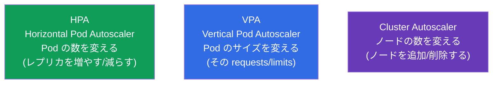
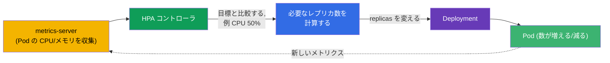
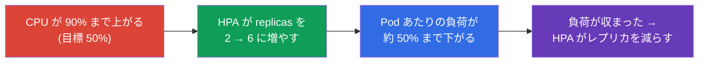
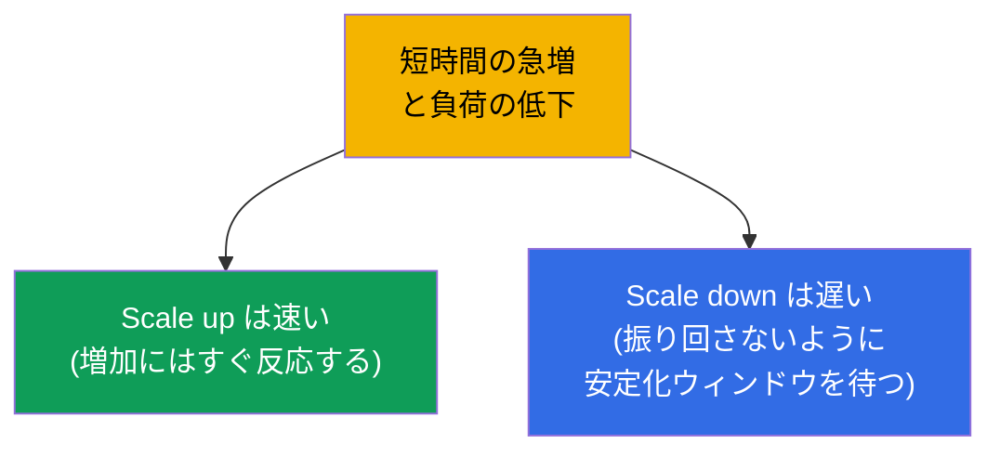

[Русская версия](ru.md) · [Eng version](README.md) · [Versión en español](es.md) · [Version française](fr.md) · [Deutsche Version](de.md) · [ქართული ვერსია](ge.md) · [繁體中文版](tw.md)

# 第 16 章。ワークロードの自動スケーリング：HPA

> **次は何か。** ここまで Deployment のレプリカ数は手で指定していました (`scale`)。しかし
> 負荷は変化します：昼はピーク、夜は静かです。**HorizontalPodAutoscaler (HPA)** は
> メトリクス（通常は CPU/メモリ）に応じて Pod の数を自動で変えます。これでパート 2 は
> 締めくくりとなり、内容は Workloads (CKA) と Application Deployment (CKAD) の領域に
> あたります。あわせて隣人 - VPA と Cluster Autoscaler - も見て、スケーリングの全体像を
> つかみます。

## 16.1. スケーリングの 3 種類

混乱しないように、Kubernetes で何がどうスケールするのかを最初に整理しておきます。



| オートスケーラー | 何を変えるか | 例 |
|-------------|-----------|--------|
| **HPA**（水平） | Pod のレプリカ数 | CPU の上昇に応じて 3 → 10 Pod |
| **VPA**（垂直） | Pod の requests/limits | メモリを 256Mi から 512Mi へ上げる |
| **Cluster Autoscaler** | クラスタ内のノード数 | Pod が収まらないときにノードを追加する |

試験の主役は **HPA** です。VPA と Cluster Autoscaler は概念として知っておく必要があります。

## 16.2. HPA の仕組み

HPA はコントローラ（調整ループ）で、定期的に（デフォルトでは約 15 秒ごとに）Pod の
メトリクスを見て目標値と比較します。実際の消費が目標より高ければレプリカを追加し、
低ければ減らします。



HPA が望ましいレプリカ数を計算する式：

```
望ましいレプリカ数 = 現在のレプリカ数 × (現在のメトリクス / 目標のメトリクス)
```

たとえば：3 Pod、現在の CPU 使用率 90%、目標 50% → `3 × (90/50) = 5.4` → 切り上げ →
**6 Pod**。

## 16.3. metrics-server：これがないと HPA は動かない

HPA はメトリクスを何もないところから取るわけではありません。基本的なメトリクス
(CPU/メモリ) には **metrics-server** が必要です - kubelet から消費量を集めて Metrics
API 経由で提供するコンポーネントです。同じ metrics-server が `kubectl top`（第 28 章）
にも使われます。

```bash
# metrics-server が入っているか確認する
kubectl get deployment metrics-server -n kube-system
kubectl top pods           # 動いていれば消費量が見える
```

> **「HPA がスケールしない」のよくある原因。** `kubectl top` がエラーを出す、または
> `kubectl get hpa` のメトリクス列が `<unknown>` と表示される場合、metrics-server が
> 入っていないか動いていないということです。これがないと HPA は目が見えません。HPA を
> デバッグするとき最初に確認するのがこれです。

CPU/メモリより複雑なメトリクス（秒あたりのリクエスト数、キューの長さ）には、アダプター
（たとえば Prometheus Adapter）経由の **custom/external metrics** が必要です - 次の節を
見てください。

### カスタムメトリクスと外部メトリクス

CPU とメモリは基本的なケースにすぎません。HPA (`autoscaling/v2`) は 3 種類のメトリクスで
スケールできます：

| メトリクスの種類 | どこから | 例 | API |
|-------------|--------|--------|-----|
| `Resource` | metrics-server | Pod の CPU/メモリ | `metrics.k8s.io` |
| `Pods` / `Object` (custom) | クラスタ内部から | Pod あたりの秒間リクエスト数、アプリケーション内のキューの深さ | `custom.metrics.k8s.io` |
| `External` | クラスタの外から | SQS/Kafka のキューの長さ、クラウドのメトリクス | `external.metrics.k8s.io` |

metrics-server が返すのは `Resource` メトリクスだけです。custom/external には、対応する
metrics API を登録する **アダプター** が必要です。もっとも普及しているのが **Prometheus
Adapter** です：Prometheus からメトリクスを取り、`custom.metrics.k8s.io` として公開して、
HPA がそれで計算できるようにします。「Pod あたりの秒間リクエスト数」というカスタム
メトリクスによる HPA の例：

```yaml
apiVersion: autoscaling/v2
kind: HorizontalPodAutoscaler
metadata:
  name: web
spec:
  scaleTargetRef:
    apiVersion: apps/v1
    kind: Deployment
    name: web
  minReplicas: 2
  maxReplicas: 20
  metrics:
  - type: Pods                         # 「Pod ごと」のカスタムメトリクス
    pods:
      metric:
        name: http_requests_per_second
      target:
        type: AverageValue
        averageValue: "100"            # Pod あたり約 100 rps を保つ
```

クラスタの外からのメトリクス（たとえばキューの長さ）には `type: External` を使います。
HPA のロジックは同じです - 現在の値を目標と比較してレプリカを再計算するだけで、変わるのは
メトリクスの出どころだけです。

### KEDA：イベント駆動の自動スケーリング

Prometheus Adapter を設定し、外部システムごとにルールを書くのは手間がかかります。
**KEDA** (Kubernetes Event-driven Autoscaling) がこれを解決します：外部ソースからの
**イベントに応じて** ワークロードをスケールする上位レイヤーで、基本の HPA にできないこと -
イベントがないときの **ゼロまでのスケール** (scale to zero) - ができます。

KEDA の要点：

- **スケーラー (scalers)** - 数十のソースとの出来合いの統合：Kafka、RabbitMQ、
  AWS SQS、Prometheus、Redis、cron、クラウドのキューなど。システムごとに手で
  アダプターを組み立てる必要はありません。
- **`ScaledObject`** - 何を、どのトリガーでスケールするかを記述する CRD：

  ```yaml
  apiVersion: keda.sh/v1alpha1
  kind: ScaledObject
  metadata:
    name: consumer
  spec:
    scaleTargetRef:
      name: consumer                 # どの Deployment をスケールするか
    minReplicaCount: 0               # KEDA はゼロまで下げられる
    maxReplicaCount: 30
    triggers:
    - type: kafka                    # 特定のソース向けのスケーラー
      metadata:
        topic: orders
        lagThreshold: "100"          # lag 100 メッセージごとに 1 レプリカ
  ```

- **内側は同じ HPA。** KEDA は HPA を置き換えるのではなく、HPA を管理します：
  `ScaledObject` に対して自分で HPA を作り、`external.metrics.k8s.io` 経由で
  メトリクスを与えます。特別なのは scale to zero です：`0↔1` の遷移は KEDA 自身が行い
  (HPA はゼロまでできません)、そこから先の `1→N` のスケーリングは作られた HPA が担います。

**どれを選ぶか。** CPU/メモリなら標準の HPA + metrics-server。Prometheus のアプリケーション
メトリクスなら HPA + Prometheus Adapter。キュー/ブローカーのイベントや scale to zero が
必要な場面（キューの処理系、たまにしか動かないバッチワーカー）なら KEDA：手作業の設定が
少なく、仕事がないときのアイドルを節約できます。

## 16.4. HPA の作成

必須条件：Deployment の Pod には対象リソースの **requests** が指定されていなければ
なりません（第 14 章）- そうでないと HPA は使用率のパーセントを比べる相手がありません。

命令的に：

```bash
kubectl autoscale deployment web --min=2 --max=10 --cpu-percent=50
```

宣言的に (autoscaling/v2 - 複数のメトリクスに対応)：

```yaml
apiVersion: autoscaling/v2
kind: HorizontalPodAutoscaler
metadata:
  name: web
spec:
  scaleTargetRef:
    apiVersion: apps/v1
    kind: Deployment
    name: web
  minReplicas: 2
  maxReplicas: 10
  metrics:
  - type: Resource
    resource:
      name: cpu
      target:
        type: Utilization
        averageUtilization: 50    # CPU の平均使用率を約 50% に保つ
```

```bash
kubectl get hpa
kubectl describe hpa web      # 現在/目標のメトリクス、スケーリングのイベント
```



## 16.5. min/max と安定化

必須の 2 つの制限：

- **minReplicas** - 下限（負荷がなくても HPA はこれより下げません）。
- **maxReplicas** - 上限（制御できない増加と出費の暴走からの保護）。

メトリクスが跳ねたときに HPA が Pod の数を行ったり来たり「振り回さない」ように、
**安定化ウィンドウ (stabilization window)** があります：レプリカを減らす前に HPA は
待機し（デフォルトでは 5 分）、負荷が本当に収まったのか、それとも揺れただけなのかを
確かめます。スケーリングの振る舞いは `behavior` ブロックで細かく調整できます
(scale up/down の速さ)。



この非対称は意図的です：増えるときは速いほうがよく（急な流入に耐えるため）、減らすときは
慎重にすべきです（次の急増の直前に Pod を落とさないため）。

## 16.6. HPA と Cluster Autoscaler を組み合わせる

HPA は Pod を追加します - しかしノードにもう置く場所がなかったら？ここで登場するのが
**Cluster Autoscaler** です：リソース不足で `Pending` になっている Pod を見て、クラスタに
ノードを追加し（クラウドで）、逆に空いているときは余ったノードを外します。


HPA + Cluster Autoscaler の組み合わせは、クラウドにおける弾力性の基礎です：HPA が
アプリケーションを、Cluster Autoscaler がその下のインフラをスケールします。なお HPA と VPA は
**同じリソースについて一緒には使いません**（どちらも CPU/メモリへの反応を変えるため、
競合してしまいます）。

> **Karpenter - Cluster Autoscaler の現代的な代替。** 古典的な Cluster Autoscaler は
> **あらかじめ定義された** node group（同じ種類のノード）をスケールします。**Karpenter**
> （もとは AWS、いまでは他でも）はさらに進んでいます：配置されていない Pod を見て、
> **適切な種類/サイズ** のノードを直接選んで起動します (right-sizing、スポットインスタンス、
> 使用率の低いノードの統合)。定義済みのプールは不要です。クラウドではこのほうが速く安い
> ことが多いです。考え方は同じ - `Pending` の Pod のためにノードを追加する - ですが、より
> 柔軟です。

## 16.7. 本番環境でこれをどう使うか

- **HPA は変動する負荷の標準。** 日中にピークがあるウェブや API はほぼ常に HPA の下に
  あります：夜はレプリカを最小に保ち、昼のピークに向けて広がります。手を動かさずに
  リソースとお金を節約できます。
- **requests は必須条件。** 本番ではどの HPA の下にも正しく見積もられた requests が
  あります：そこから使用率のパーセントが計算されます。requests が誤っていると → HPA は
  的外れなスケールをします。
- **CPU だけではない。** 成熟したチームは、Prometheus Adapter や KEDA（イベント駆動の
  自動スケーリング、レプリカ 0 まで含む）を通じて、アプリケーションのメトリクス
  （秒間リクエスト数、キューの深さ、レイテンシ）でスケールします。CPU は出発点にすぎません。
- **HPA + Cluster Autoscaler。** クラウドではこれはセットです：アプリケーションは Pod で、
  インフラはノードでスケールします。Cluster Autoscaler がないと HPA はノードの天井に
  ぶつかり、Pod を Pending のまま残します。
- **サービスに合わせた behavior の調整。** 急激な急増があるトラフィックでは scale up を
  速め scale down を遅くして、次の波の前に「しぼんで」しまわないようにします。
  PodDisruptionBudget は行き過ぎた削減からさらに守ってくれます（第 36 章）。

## 16.8. ミニ用語集

- **HPA (HorizontalPodAutoscaler)** - メトリクスに応じてレプリカ数を変える。
- **VPA (VerticalPodAutoscaler)** - Pod の requests/limits を変える。
- **Cluster Autoscaler** - クラスタ内のノード数を変える。
- **metrics-server** - Pod の CPU/メモリを収集する。HPA と `kubectl top` に必要。
- **averageUtilization** - リソース使用率の目標となる平均パーセント。
- **minReplicas/maxReplicas** - レプリカ数の下限と上限。
- **stabilization window** - レプリカを減らす前の待機ウィンドウ。
- **behavior** - scale up/down の速さの細かい調整。
- **KEDA** - 外部イベントによるイベント駆動の自動スケーリング（ゼロまで含む）。

## 16.9. 本章のまとめ

- 3 つのスケーリング：HPA（Pod の数）、VPA（Pod のサイズ）、Cluster Autoscaler
  （ノードの数）。
- HPA は現在のメトリクスを目標と比較し、`レプリカ数 × (現在/目標)` という式で
  レプリカを変えます。
- HPA には metrics-server が必要です（CPU/メモリの場合）。ないとメトリクスは `<unknown>` で
  HPA はスケールしません。
- HPA の必須条件は Pod に requests が指定されていることです（そこからパーセントを計算します）。
- min/max はレプリカ数の範囲を制限し、安定化ウィンドウは Pod 数を「振り回す」ことを防ぎます。
  scale up は通常速く、scale down は慎重です。
- HPA + Cluster Autoscaler：アプリケーションは Pod で、インフラはノードでスケールします。
- HPA と VPA を同じリソースについて一緒には使いません。

## 16.10. これがどう役に立つか：試験と実際の仕事で

**試験では。** 「CPU 目標 50%、min 2 max 10 でデプロイ用の HPA を作れ」は典型的な問題です
(`kubectl autoscale` かマニフェスト)。requests と、動作の条件としての metrics-server を
覚えておく必要があります。「HPA がスケールしない」のデバッグ → `kubectl top`/metrics-server
の確認。

**実際の仕事では。** HPA はアプリケーションの弾力性の主要な仕組みです：静かなときは
リソースを節約し、ピークでは手を動かさずに負荷を支えます。Cluster Autoscaler と組み合わせると
クラウドで完全な弾力性が得られます。メトリクス、requests、scale up/down の振る舞いを
理解しているかどうかが、自動スケーリングが助けになるか問題を生むかを決めます。

## 16.11. 自己チェックの質問

1. HPA、VPA、Cluster Autoscaler は何を変えるかという点でどう違いますか？
2. HPA はどの式で必要なレプリカ数を計算しますか？4 Pod、CPU 80%、目標 40% で計算して
   ください。
3. なぜ HPA には metrics-server が必要で、それがないことはどうやって分かりますか？
4. なぜ HPA の下の Pod には必ず requests が指定されていなければならないのですか？
5. minReplicas/maxReplicas と安定化ウィンドウは何をしますか？
6. なぜ scale up は通常速く、scale down は遅いのですか？
7. 負荷が増えたとき、HPA と Cluster Autoscaler はどう一緒に働きますか？

## 演習

これでパート 2（ワークロードとスケジューリング）は完了です。次はパート 3：アプリケーションの
設定とセキュリティで、コマンド、引数、環境変数から始まります（第 17 章）。HPA は
`ping_pong` イメージの負荷プロファイルとあわせて、ワークロードのラボで練習します。

🧪 ラボ 104（HPA による自動スケーリング）：[tasks/cka/labs/104](../../labs/104/README_JP.MD)

---
[目次](../README_JP.md) · [第 15 章](../15/jp.md) · [第 17 章](../17/jp.md)
