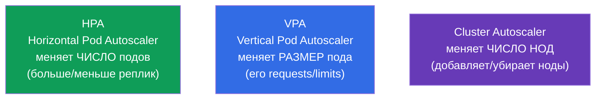
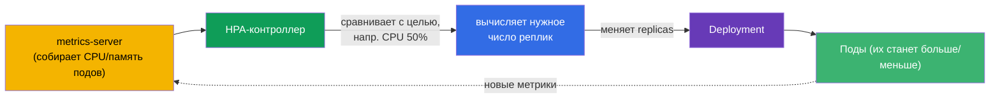
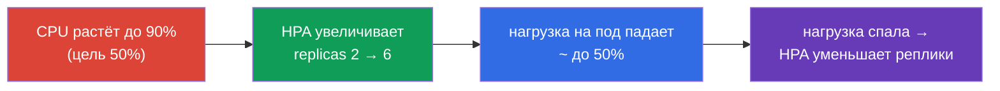
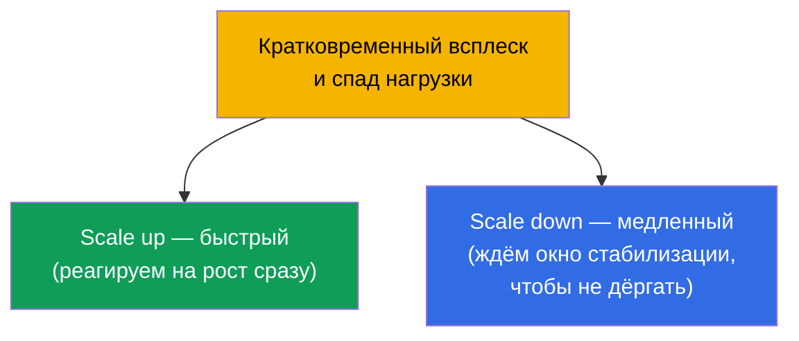

# Глава 16. Автомасштабирование нагрузок: HPA

> **Что дальше.** До сих пор число реплик Deployment мы задавали руками (`scale`). Но
> нагрузка меняется: днём пик, ночью тишина. **HorizontalPodAutoscaler (HPA)**
> автоматически меняет число подов по метрикам (обычно по CPU/памяти). Это завершает
> часть 2 и относится к домену Workloads (CKA) и Application Deployment (CKAD). Заодно
> разберём соседей - VPA и Cluster Autoscaler - чтобы видеть всю картину масштабирования.

## 16.1. Три вида масштабирования

Чтобы не путаться, сразу разложим, что и как масштабируется в Kubernetes.



| Автоскейлер | Что меняет | Пример |
|-------------|-----------|--------|
| **HPA** (горизонтальное) | число реплик пода | 3 → 10 подов при росте CPU |
| **VPA** (вертикальное) | requests/limits пода | поднять память с 256Mi до 512Mi |
| **Cluster Autoscaler** | число нод в кластере | добавить ноду, когда поды не помещаются |

Главный герой экзамена - **HPA**. VPA и Cluster Autoscaler нужно знать концептуально.

## 16.2. Как работает HPA

HPA - это контроллер (петля согласования), который периодически (по умолчанию раз в ~15
секунд) смотрит метрики подов и сравнивает с целевым значением. Если фактическое
потребление выше цели - добавляет реплики, ниже - убирает.



Формула, по которой HPA считает желаемое число реплик:

```
желаемые реплики = текущие × (текущая метрика / целевая метрика)
```

Например: 3 пода, текущая загрузка CPU 90%, цель 50% → `3 × (90/50) = 5.4` → округление
вверх → **6 подов**.

## 16.3. metrics-server: без него HPA не работает

HPA берёт метрики не из воздуха. Для базовых метрик (CPU/память) нужен **metrics-server**
- компонент, который собирает потребление с kubelet и отдаёт через Metrics API. Тот же
metrics-server питает `kubectl top` (глава 28).

```bash
# Проверить, установлен ли metrics-server
kubectl get deployment metrics-server -n kube-system
kubectl top pods           # если работает — увидим потребление
```

> **Частая причина «HPA не масштабирует».** Если `kubectl top` пишет ошибку или колонка
> метрик в `kubectl get hpa` показывает `<unknown>` - значит metrics-server не установлен
> или не работает. Без него HPA слеп. Это первое, что проверяют при отладке HPA.

Для метрик сложнее CPU/памяти (запросов в секунду, длины очереди) нужны **custom/external
metrics** через адаптеры (например, Prometheus Adapter) - но это за пределами базового
HPA.

## 16.4. Создание HPA

Обязательное условие: у подов Deployment должны быть заданы **requests** по нужному
ресурсу (глава 14) - иначе HPA не с чем сравнивать процент загрузки.

Императивно:

```bash
kubectl autoscale deployment web --min=2 --max=10 --cpu-percent=50
```

Декларативно (autoscaling/v2 - поддерживает несколько метрик):

```yaml
apiVersion: autoscaling/v2
kind: HorizontalPodAutoscaler
metadata:
  name: web
spec:
  scaleTargetRef:
    apiVersion: apps/v1
    kind: Deployment
    name: web
  minReplicas: 2
  maxReplicas: 10
  metrics:
  - type: Resource
    resource:
      name: cpu
      target:
        type: Utilization
        averageUtilization: 50    # держать среднюю загрузку CPU ~50%
```

```bash
kubectl get hpa
kubectl describe hpa web      # текущая/целевая метрика, события масштабирования
```



## 16.5. min/max и стабилизация

Два обязательных ограничителя:

- **minReplicas** - нижняя граница (HPA не опустит ниже, даже если нагрузки нет).
- **maxReplicas** - верхняя граница (защита от бесконтрольного роста и разорения).

Чтобы HPA не «дёргал» число подов туда-сюда при скачках метрик, есть **окно стабилизации
(stabilization window)**: перед уменьшением реплик HPA выжидает (по умолчанию 5 минут),
чтобы убедиться, что нагрузка действительно спала, а не колебнулась. Поведение
масштабирования тонко настраивается блоком `behavior` (скорость scale up/down).



Асимметрия намеренная: расти лучше быстро (чтобы выдержать наплыв), а сокращаться
осторожно (чтобы не убрать поды прямо перед новым всплеском).

## 16.6. HPA и Cluster Autoscaler вместе

HPA добавляет поды - но что если нодам уже некуда их ставить? Тут в игру вступает
**Cluster Autoscaler**: он видит поды в `Pending` из-за нехватки ресурсов и добавляет
ноды в кластер (в облаке), а при простое - убирает лишние.


Связка HPA + Cluster Autoscaler - основа эластичности в облаке: HPA масштабирует
приложение, Cluster Autoscaler - инфраструктуру под него. HPA и VPA при этом
**вместе по одному ресурсу не применяют** (они бы конфликтовали, оба меняя реакцию на
CPU/память).

> **Karpenter - современная альтернатива Cluster Autoscaler.** Классический Cluster
> Autoscaler масштабирует **заранее заданные** node group'ы (одинаковые ноды). **Karpenter**
> (изначально AWS, теперь и другие) идёт дальше: по неразмещённым подам он подбирает и
> запускает ноду **подходящего типа/размера** напрямую (right-sizing, спот-инстансы,
> консолидация недогруженных нод) без предопределённых пулов. В облаке это часто быстрее и
> дешевле; идея та же - добавить ноды под `Pending`-поды, но гибче.

## 16.7. Как это применяют в продакшене

- **HPA - стандарт для переменной нагрузки.** Веб и API с дневными пиками почти всегда
  под HPA: держат минимум реплик ночью и разворачиваются под пик днём. Это экономит
  ресурсы и деньги без ручного вмешательства.
- **requests - обязательное условие.** В проде под каждым HPA стоят корректно
  подобранные requests: от них считается процент загрузки. Неверные requests → HPA
  масштабирует не по делу.
- **Не только CPU.** Зрелые команды масштабируют по прикладным метрикам (запросы/сек,
  глубина очереди, задержка) через Prometheus Adapter или KEDA (event-driven
  автоскейлинг, вплоть до нуля реплик). CPU - лишь стартовая точка.
- **HPA + Cluster Autoscaler.** В облаке это связка: приложение масштабируется подами,
  инфраструктура - нодами. Без Cluster Autoscaler HPA упрётся в потолок нод и оставит
  поды в Pending.
- **Настройка behavior под сервис.** Для трафика с резкими всплесками ускоряют scale up
  и замедляют scale down, чтобы не «схлопнуться» перед новой волной. PodDisruptionBudget
  дополнительно защищает от чрезмерного сокращения (глава 36).

## 16.8. Мини-глоссарий

- **HPA (HorizontalPodAutoscaler)** - меняет число реплик по метрикам.
- **VPA (VerticalPodAutoscaler)** - меняет requests/limits подов.
- **Cluster Autoscaler** - меняет число нод в кластере.
- **metrics-server** - собирает CPU/память подов; нужен для HPA и `kubectl top`.
- **averageUtilization** - целевой средний процент загрузки ресурса.
- **minReplicas/maxReplicas** - нижняя и верхняя границы числа реплик.
- **stabilization window** - окно ожидания перед сокращением реплик.
- **behavior** - тонкая настройка скорости scale up/down.
- **KEDA** - event-driven автоскейлинг по внешним событиям (в т.ч. до нуля).

## 16.9. Итоги главы

- Три масштабирования: HPA (число подов), VPA (размер пода), Cluster Autoscaler (число
  нод).
- HPA сравнивает текущую метрику с целевой и меняет реплики по формуле
  `реплики × (текущая/целевая)`.
- HPA требует metrics-server (для CPU/памяти); без него метрика `<unknown>` и HPA не
  масштабирует.
- Обязательное условие HPA - заданные requests у подов (от них считается процент).
- min/max ограничивают диапазон реплик; окно стабилизации не даёт «дёргать» число подов;
  scale up обычно быстрый, scale down осторожный.
- HPA + Cluster Autoscaler: приложение масштабируется подами, инфраструктура - нодами.
- HPA и VPA по одному ресурсу вместе не применяют.

## 16.10. Как это пригодится: на экзамене и в реальной работе

**На экзамене.** «Создай HPA для деплоя с целью CPU 50%, min 2 max 10» - типовое задание
(`kubectl autoscale` или манифест). Нужно помнить про requests и про metrics-server как
условие работы. Отладка «HPA не масштабирует» → проверка `kubectl top`/metrics-server.

**В реальной работе.** HPA - основной механизм эластичности приложений: экономит ресурсы
в затишье и держит нагрузку в пик без ручного вмешательства. В связке с Cluster
Autoscaler даёт полную эластичность в облаке. Понимание метрик, requests и поведения
scale up/down определяет, будет ли автоскейлинг помогать или создавать проблемы.

## 16.11. Вопросы для самопроверки

1. Чем отличаются HPA, VPA и Cluster Autoscaler по тому, что они меняют?
2. По какой формуле HPA вычисляет нужное число реплик? Посчитайте для 4 подов, CPU 80%,
   цель 40%.
3. Зачем HPA нужен metrics-server и как понять, что его нет?
4. Почему у подов под HPA обязательно должны быть заданы requests?
5. Что делают minReplicas/maxReplicas и окно стабилизации?
6. Почему scale up обычно быстрый, а scale down медленный?
7. Как HPA и Cluster Autoscaler работают вместе при росте нагрузки?

## Практика

На этом часть 2 (рабочие нагрузки и планирование) завершена. Дальше - часть 3:
конфигурация и безопасность приложений, начиная с команд, аргументов и переменных
окружения (глава 17). HPA отрабатывается в лабах по рабочим нагрузкам вместе с нагрузочным
профилем образа `ping_pong`.

🧪 Лаба 01: [tasks/cka/labs/01](../../labs/01/README_RU.MD)

---
[Оглавление](../README_RU.md) · [Глава 15](../15/ru.md) · [Глава 17](../17/ru.md)
