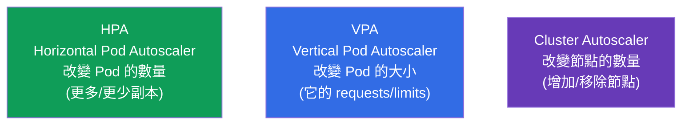
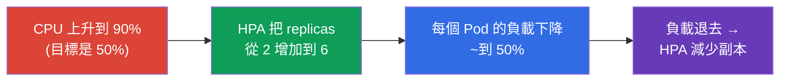
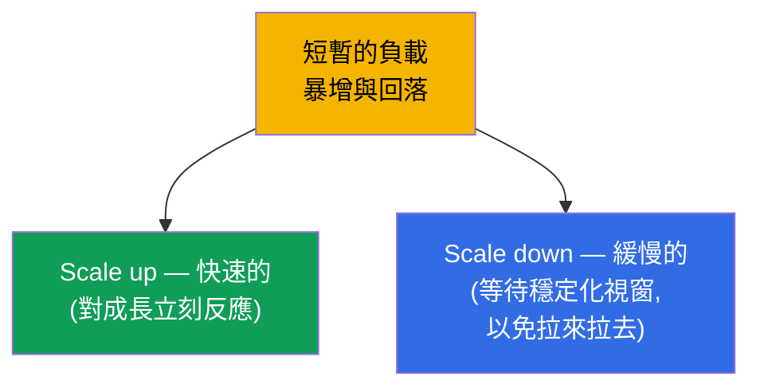

[Русская версия](ru.md) · [Eng version](README.md) · [Versión en español](es.md) · [Version française](fr.md) · [Deutsche Version](de.md) · [ქართული ვერსია](ge.md) · [日本語版](jp.md)

# 第 16 章。工作負載的自動擴縮:HPA

> **接下來是什麼。** 到目前為止,Deployment 的副本數量都是我們手動指定的(`scale`)。
> 但負載是會變的:白天是高峰,夜裡一片安靜。**HorizontalPodAutoscaler(HPA)**
> 會依據指標(通常是 CPU/記憶體)自動改變 Pod 的數量。這為第 2 部分收尾,並且屬於
> Workloads(CKA)與 Application Deployment(CKAD)領域。順便我們也會把它的鄰居 -
> VPA 與 Cluster Autoscaler - 一起拆解,以便看清擴縮的完整全貌。

## 16.1. 三種擴縮

為了不搞混,我們先把 Kubernetes 中什麼會被擴縮、以及怎麼擴縮攤開來看。



| 自動擴縮器 | 改變什麼 | 範例 |
|-------------|-----------|--------|
| **HPA**(水平) | Pod 的副本數量 | CPU 上升時 3 → 10 個 Pod |
| **VPA**(垂直) | Pod 的 requests/limits | 把記憶體從 256Mi 提高到 512Mi |
| **Cluster Autoscaler** | 叢集中節點的數量 | 當 Pod 放不下時增加一個節點 |

考試的主角是 **HPA**。VPA 與 Cluster Autoscaler 需要在概念上理解。

## 16.2. HPA 如何運作

HPA 是一個控制器(協調迴圈),它會週期性地(預設大約每 15 秒一次)查看 Pod 的
指標,並與目標值比較。如果實際的消耗高於目標 - 就增加副本,低於目標 - 就移除副本。

```mermaid
flowchart LR
    ms["metrics-server<br>(收集 Pod 的 CPU/記憶體)"] --> hpa["HPA 控制器"]
    hpa -->|"與目標比較,<br>例如 CPU 50%"| calc["計算需要的<br>副本數量"]
    calc -->|"改變 replicas"| dep["Deployment"]
    dep --> pods["Pod(它們會變多/變少)"]
    pods -.->|"新的指標"| ms
    style ms fill:#f4b400,color:#000
    style hpa fill:#0f9d58,color:#fff
    style calc fill:#326ce5,color:#fff
    style dep fill:#673ab7,color:#fff
    style pods fill:#3cb371,color:#fff
```

HPA 用來計算期望副本數量的公式:

```
期望的副本數 = 目前的副本數 × (目前的指標 / 目標的指標)
```

例如:3 個 Pod,目前的 CPU 負載是 90%,目標是 50% → `3 × (90/50) = 5.4` → 向上
取整 → **6 個 Pod**。

## 16.3. metrics-server:沒有它 HPA 就不會運作

HPA 不會從空氣中取得指標。對於基本指標(CPU/記憶體)需要 **metrics-server** -
一個從 kubelet 收集消耗量並透過 Metrics API 對外提供的元件。同一個
metrics-server 也餵養 `kubectl top`(第 28 章)。

```bash
# 檢查 metrics-server 是否已安裝
kubectl get deployment metrics-server -n kube-system
kubectl top pods           # 如果它在運作 — 我們就會看到消耗量
```

> **「HPA 沒有在擴縮」的常見原因。** 如果 `kubectl top` 回報錯誤,或者
> `kubectl get hpa` 裡的指標欄位顯示 `<unknown>` - 那就表示 metrics-server 沒有
> 安裝或沒有在運作。少了它,HPA 就是瞎的。這是除錯 HPA 時第一個要檢查的東西。

對於比 CPU/記憶體更複雜的指標(每秒請求數、佇列長度),需要透過轉接器
(例如 Prometheus Adapter)取得 **custom/external metrics** - 見下一節。

### 自訂指標與外部指標

CPU 與記憶體只是最基本的情況。HPA(`autoscaling/v2`)可以依三種類型的指標來擴縮:

| 指標類型 | 來自哪裡 | 範例 | API |
|-------------|--------|--------|-----|
| `Resource` | metrics-server | Pod 的 CPU/記憶體 | `metrics.k8s.io` |
| `Pods` / `Object`(custom) | 來自叢集內部 | 每個 Pod 每秒的請求數、應用程式中的佇列深度 | `custom.metrics.k8s.io` |
| `External` | 來自叢集外部 | SQS/Kafka 的佇列長度、雲端的指標 | `external.metrics.k8s.io` |

Metrics-server 只提供 `Resource` 類型的指標。對於 custom/external 需要一個
**轉接器**,由它註冊對應的 metrics API。最常見的是 **Prometheus
Adapter**:它從 Prometheus 取得指標,並把它們發布成 `custom.metrics.k8s.io`,
讓 HPA 可以依據它們來計算。以下是依自訂指標「每個 Pod 每秒的請求數」擴縮的 HPA 範例:

```yaml
apiVersion: autoscaling/v2
kind: HorizontalPodAutoscaler
metadata:
  name: web
spec:
  scaleTargetRef:
    apiVersion: apps/v1
    kind: Deployment
    name: web
  minReplicas: 2
  maxReplicas: 20
  metrics:
  - type: Pods                         # 自訂指標「針對每一個 Pod」
    pods:
      metric:
        name: http_requests_per_second
      target:
        type: AverageValue
        averageValue: "100"            # 讓每個 Pod 維持約 100 rps
```

對於來自叢集外部的指標(例如佇列長度),則使用 `type: External`。HPA 的邏輯
是一樣的 - 把目前的值與目標比較,然後重新計算副本;改變的只有指標的來源。

### KEDA:event-driven 自動擴縮

設定 Prometheus Adapter 並為每一個外部系統撰寫規則很費工。
**KEDA**(Kubernetes Event-driven Autoscaling)解決了這件事:它是一層附加元件,
會 **依據來自外部來源的事件** 來擴縮工作負載,並且能做到基本 HPA 做不到的事 -
**縮到零**(scale to zero),也就是在沒有事件的時候。

KEDA 的關鍵想法:

- **擴縮器(scalers)** - 與數十種來源現成的整合:Kafka、RabbitMQ、
  AWS SQS、Prometheus、Redis、cron、雲端佇列等等。不需要為每一個系統手動
  搭建轉接器。
- **`ScaledObject`** - 一個 CRD,在裡面描述要擴縮什麼、以及依據哪個觸發器:

  ```yaml
  apiVersion: keda.sh/v1alpha1
  kind: ScaledObject
  metadata:
    name: consumer
  spec:
    scaleTargetRef:
      name: consumer                 # 要擴縮哪一個 Deployment
    minReplicaCount: 0               # KEDA 能降到零
    maxReplicaCount: 30
    triggers:
    - type: kafka                    # 針對特定來源的擴縮器
      metadata:
        topic: orders
        lagThreshold: "100"          # 每 100 則訊息的 lag 就一個副本
  ```

- **底層還是同一個 HPA。** KEDA 並沒有取代 HPA,而是管理它:對於 `ScaledObject`
  它會自己建立 HPA,並透過 `external.metrics.k8s.io` 餵給它指標。特殊的
  情況是 scale to zero:`0↔1` 的轉換由 KEDA 自己完成(HPA 不會降到零),而
  之後 `1→N` 的擴縮就由建立出來的 HPA 負責。

**什麼時候選什麼。** 依 CPU/記憶體 - 用內建的 HPA + metrics-server。依來自
Prometheus 的應用層指標 - 用 HPA + Prometheus Adapter。依佇列/訊息代理的事件、
以及需要 scale to zero 的地方(佇列處理器、少見的批次 worker)- 用 KEDA:手動
設定更少,而且在沒有工作時能省下閒置的成本。

## 16.4. 建立 HPA

必要條件:Deployment 的 Pod 必須針對需要的資源設定了 **requests**(第 14 章)-
否則 HPA 沒有東西可以用來比較負載的百分比。

命令式:

```bash
kubectl autoscale deployment web --min=2 --max=10 --cpu-percent=50
```

宣告式(autoscaling/v2 - 支援多個指標):

```yaml
apiVersion: autoscaling/v2
kind: HorizontalPodAutoscaler
metadata:
  name: web
spec:
  scaleTargetRef:
    apiVersion: apps/v1
    kind: Deployment
    name: web
  minReplicas: 2
  maxReplicas: 10
  metrics:
  - type: Resource
    resource:
      name: cpu
      target:
        type: Utilization
        averageUtilization: 50    # 讓 CPU 的平均負載維持在約 50%
```

```bash
kubectl get hpa
kubectl describe hpa web      # 目前的/目標的指標、擴縮的事件
```



## 16.5. min/max 與穩定化

兩個必要的限制器:

- **minReplicas** - 下界(即使沒有負載,HPA 也不會降到它以下)。
- **maxReplicas** - 上界(防止無法控制的成長與破產)。

為了讓 HPA 不會在指標跳動時把 Pod 的數量「拉來拉去」,有一個 **穩定化視窗
(stabilization window)**:在減少副本之前,HPA 會等待(預設 5 分鐘),以確認
負載真的退去了,而不只是抖了一下。擴縮的行為可以透過 `behavior` 區塊細緻地
調整(scale up/down 的速度)。



這種不對稱是刻意的:成長最好快一點(才能撐住湧入的流量),而縮減要小心
(以免在新的一波暴增之前剛好把 Pod 移掉)。

## 16.6. HPA 與 Cluster Autoscaler 一起工作

HPA 增加了 Pod - 但如果節點上已經沒地方放它們了呢?這時 **Cluster Autoscaler**
就上場了:它看到因為資源不足而處於 `Pending` 的 Pod,就往叢集裡增加節點
(在雲端上),而在閒置時則移除多餘的節點。


HPA + Cluster Autoscaler 這個組合是雲端彈性的基礎:HPA 擴縮應用程式,
Cluster Autoscaler 擴縮承載它的基礎設施。同時,HPA 與 VPA **不會針對同一個資源
一起使用**(它們會互相衝突,因為兩者都在改變對 CPU/記憶體的反應)。

> **Karpenter - Cluster Autoscaler 的現代替代方案。** 傳統的 Cluster
> Autoscaler 擴縮的是 **事先定義好的** node group(相同規格的節點)。**Karpenter**
> (最初來自 AWS,現在也有其他家)走得更遠:針對未被安置的 Pod,它會挑選並直接
> 啟動 **合適類型/大小** 的節點(right-sizing、spot 實例、把低使用率的節點做
> 整併),不需要預先定義的節點池。在雲端上這通常更快也更便宜;想法還是一樣 -
> 為 `Pending` 的 Pod 增加節點,只是更有彈性。

## 16.7. 這在生產環境中如何應用

- **HPA 是可變負載的標準做法。** 有日間高峰的網頁與 API 幾乎總是掛在 HPA
  下面:夜裡維持最少的副本,白天在高峰時展開。這能省下資源與金錢,而且不需要
  手動介入。
- **requests 是必要條件。** 在生產環境中,每一個 HPA 底下都有正確挑選過的
  requests:負載的百分比是從它們算出來的。錯誤的 requests → HPA 就會亂擴縮。
- **不只有 CPU。** 成熟的團隊會透過 Prometheus Adapter 或 KEDA(event-driven
  自動擴縮,甚至可以到零個副本)依應用層指標(請求/秒、佇列深度、延遲)擴縮。
  CPU 只是一個起點。
- **HPA + Cluster Autoscaler。** 在雲端上這是一個組合:應用程式用 Pod 擴縮,
  基礎設施用節點擴縮。少了 Cluster Autoscaler,HPA 會撞到節點的天花板,並把
  Pod 留在 Pending。
- **依服務調整 behavior。** 對於有劇烈暴增的流量,會加快 scale up 並放慢
  scale down,以免在新的一波之前「塌下去」。PodDisruptionBudget 則額外保護
  它不被過度縮減(第 36 章)。

## 16.8. 迷你詞彙表

- **HPA(HorizontalPodAutoscaler)** - 依指標改變副本的數量。
- **VPA(VerticalPodAutoscaler)** - 改變 Pod 的 requests/limits。
- **Cluster Autoscaler** - 改變叢集中節點的數量。
- **metrics-server** - 收集 Pod 的 CPU/記憶體;HPA 與 `kubectl top` 都需要它。
- **averageUtilization** - 資源負載的目標平均百分比。
- **minReplicas/maxReplicas** - 副本數量的下界與上界。
- **stabilization window** - 縮減副本之前的等待視窗。
- **behavior** - scale up/down 速度的細緻設定。
- **KEDA** - 依外部事件做 event-driven 自動擴縮(包括降到零)。

## 16.9. 本章總結

- 三種擴縮:HPA(Pod 的數量)、VPA(Pod 的大小)、Cluster Autoscaler(節點的
  數量)。
- HPA 把目前的指標與目標指標比較,並依公式
  `副本數 × (目前的/目標的)` 改變副本。
- HPA 需要 metrics-server(針對 CPU/記憶體);少了它,指標會是 `<unknown>`,
  HPA 也不會擴縮。
- HPA 的必要條件 - Pod 上要設定 requests(百分比是從它們算出來的)。
- min/max 限制副本的範圍;穩定化視窗不讓 Pod 的數量被「拉來拉去」;
  scale up 通常很快,scale down 則謹慎。
- HPA + Cluster Autoscaler:應用程式用 Pod 擴縮,基礎設施用節點擴縮。
- HPA 與 VPA 不會針對同一個資源一起使用。

## 16.10. 這些知識用在哪裡:考試與實際工作

**在考試中。** 「為一個 deployment 建立 HPA,目標 CPU 50%,min 2 max 10」是典型
題目(用 `kubectl autoscale` 或 manifest)。要記得 requests,以及 metrics-server
是運作的前提。除錯「HPA 沒有在擴縮」→ 檢查 `kubectl top`/metrics-server。

**在實際工作中。** HPA 是應用程式彈性的主要機制:在平靜時省下資源,在高峰時
撐住負載,而且不需要手動介入。與 Cluster Autoscaler 搭配,就能在雲端上提供
完整的彈性。對指標、requests 以及 scale up/down 行為的理解,決定了自動擴縮
是會幫上忙,還是會製造問題。

## 16.11. 自我檢查問題

1. HPA、VPA 與 Cluster Autoscaler 在「它們改變什麼」這件事上有什麼不同?
2. HPA 用什麼公式計算需要的副本數量?請計算 4 個 Pod、CPU 80%、
   目標 40% 的情況。
3. HPA 為什麼需要 metrics-server,以及怎麼知道它不存在?
4. 為什麼掛在 HPA 下的 Pod 一定要設定 requests?
5. minReplicas/maxReplicas 與穩定化視窗各做什麼?
6. 為什麼 scale up 通常很快,而 scale down 很慢?
7. 負載成長時,HPA 與 Cluster Autoscaler 是如何一起工作的?

## 實踐

到這裡,第 2 部分(工作負載與排程)就結束了。接下來是第 3 部分:
應用程式的設定與安全,從命令、參數與環境變數開始(第 17 章)。HPA 會在工作負載
相關的實驗中,搭配 `ping_pong` 映像的壓力測試設定一起操練。

🧪 實驗 104(HPA 自動擴縮):[tasks/cka/labs/104](../../labs/104/README_TW.MD)

🎮 Killercoda（在瀏覽器中，無需安裝）：[Monitoring Kubernetes with Metrics Server](https://killercoda.com/chadmcrowell/course/ckad/metrics-server)

---
[目錄](../README_TW.md) · [第 15 章](../15/tw.md) · [第 17 章](../17/tw.md)
