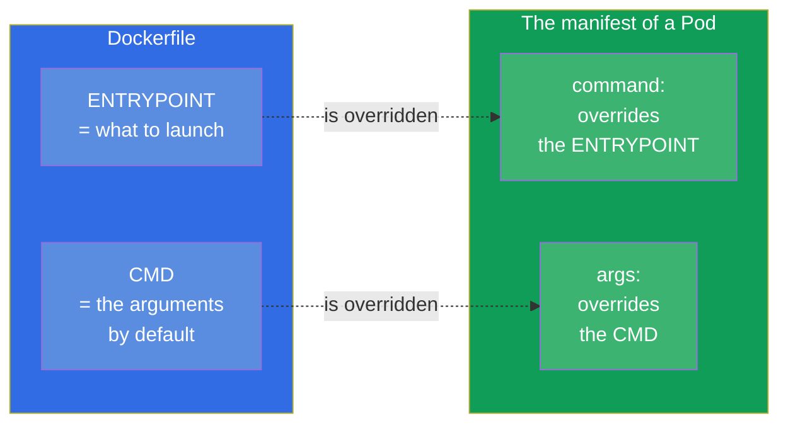
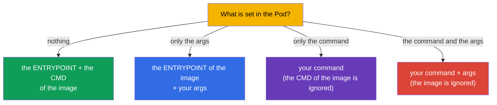
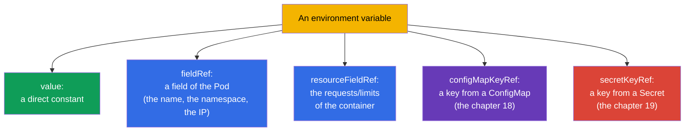

[Русская версия](ru.md) · [Versión en español](es.md) · [Version française](fr.md) · [Deutsche Version](de.md) · [ქართული ვერსია](ge.md) · [繁體中文版](tw.md) · [日本語版](jp.md)

# Chapter 17. The commands, the arguments and the environment variables

> **What comes next.** We are beginning the part 3 - the configuration of the applications. Before taking
> the configs out into a ConfigMap and a Secret (the chapters 18-19), it is necessary to understand the base: how to set for a container
> the command of the start, the arguments and the environment variables. This is the domain Environment/Config
> (CKAD, 25%) and Workloads (CKA). The topic seems simple, but `command`/`args` in Kubernetes
> and `ENTRYPOINT`/`CMD` in Docker are confused constantly - and this costs the points and the broken Pods.

## 17.1. The ENTRYPOINT/CMD in Docker and their reflection in Kubernetes

When an image is built in Docker, in it there is set what to launch: the `ENTRYPOINT` (the executable
program itself) and the `CMD` (the arguments by default). Kubernetes overrides them
by its own fields:



Remember the correspondence - they like to ask about it:

| Docker | Kubernetes | The role |
|--------|-----------|------|
| `ENTRYPOINT` | `command` | the executable program |
| `CMD` | `args` | the arguments to it |

## 17.2. The command and the args in a Pod

```yaml
spec:
  containers:
  - name: app
    image: busybox
    command: ["sleep"]       # overrides the ENTRYPOINT
    args: ["3600"]           # overrides the CMD
```

The rules of the overriding (this is exactly the frequent trap):

- only the `args` is set - the `ENTRYPOINT` of the image + your `args` are taken;
- only the `command` is set - your `command` is taken, the `CMD` of the image is ignored;
- both are set - both are used, the image is ignored completely;
- nothing is set - the `ENTRYPOINT` and the `CMD` from the image work.



Imperatively the command is set through `--command -- ...`:

```bash
kubectl run busy --image=busybox --command -- sleep 3600
# everything after the -- becomes the command
```

## 17.3. The two forms of the notation: the exec and the shell one

The command can be written down in two ways, and the difference is essential.

- **The exec form** (a list of the strings) - is launched directly, without a shell. This is how it is correct in
  Kubernetes: the signals (SIGTERM) reach the process, the PID 1 is your application.

```yaml
command: ["sh", "-c", "echo hello"]
args: ["--port", "8080"]
```

- **The shell form** (one string) - in Docker is launched through `/bin/sh -c`. In Kubernetes
  for the interpolation of the variables or for the pipes an explicit `sh -c` is used:

```yaml
command: ["sh", "-c", "echo $HOSTNAME && sleep 3600"]
```

> **Why this is important.** If a substitution of the environment variables, the pipes or several
> commands are needed - wrap them into `sh -c "..."`. Without a shell the `$VAR` will not be expanded, and the `|` will not
> work - this is a frequent reason of "the command does not work off as it was expected".

## 17.4. The environment variables: the env

The simplest way to pass a config into a container is the environment variables through the `env`:

```yaml
spec:
  containers:
  - name: app
    image: nginx
    env:
    - name: COLOR
      value: "blue"
    - name: GREETING
      value: "hello world"
```

```bash
# Imperatively upon the creation
kubectl run web --image=nginx --env="COLOR=blue" --env="MODE=prod"
```

The simple pairs `name/value` are suitable for the static values. But often it is necessary to take a value
**dynamically** - from the fields of the Pod itself, from the resources or from a ConfigMap/Secret. For this
there is the `valueFrom`.

## 17.5. The valueFrom: the dynamic sources of the variables

The `valueFrom` allows to fill a variable not by a constant, but from a source.



The **Downward API** is a mechanism that gives to a Pod the information about itself (`fieldRef`,
`resourceFieldRef`):

```yaml
    env:
    - name: MY_POD_NAME
      valueFrom:
        fieldRef:
          fieldPath: metadata.name
    - name: MY_POD_IP
      valueFrom:
        fieldRef:
          fieldPath: status.podIP
    - name: MY_NODE_NAME
      valueFrom:
        fieldRef:
          fieldPath: spec.nodeName
    - name: MY_CPU_LIMIT
      valueFrom:
        resourceFieldRef:
          containerName: app
          resource: limits.cpu
```

This is how an application learns its name, the IP, the node, the limits - without a hardcode. The `configMapKeyRef` and
the `secretKeyRef` (to take a value from a ConfigMap/Secret) we will take apart in the next chapters.

> **Important: and what will a Pod see, if a ConfigMap/Secret is changed?** The environment variables
> (`configMapKeyRef`, `secretKeyRef`, `envFrom`) are substituted **once - at the moment
> of the start of the container**. If afterwards a ConfigMap or a Secret is changed, the already started Pod
> **will continue to see the old value**: the env variables are not updated retroactively.
> In order to pick up the new one, the Pod has to be recreated - for example,
> `kubectl rollout restart deployment/<name>`. This is a frequent trap: "I have corrected the ConfigMap, and the
> application is still with the old value".
>
> The **mounting** of a ConfigMap/Secret as a volume behaves otherwise (the chapter 18): there the kubelet
> periodically updates the files in the container upon a change of the object (with a delay of the order
> of a minute), and a restart is not needed - but the application has to **reread the file by itself**.
> An exception is the mounting through a `subPath`: such files are not updated at all. That is,
> a "live" update of the configuration without a restart is possible only through a volume (not a `subPath`) and
> under the condition that the application is able to reread the config.

## 17.6. The environment variables and the order of the expansion

The variables can reference each other through `$(VAR)` (not to be confused with the shell `$VAR`):

```yaml
    env:
    - name: HOST
      value: "db"
    - name: PORT
      value: "5432"
    - name: DSN
      value: "$(HOST):$(PORT)"     # → db:5432
```

Kubernetes expands the `$(VAR)` for the variables declared **earlier** in the list. A reference to
a not yet declared variable will not be expanded. In order to output a literal `$(...)`, it is escaped
by a doubling: `$$(...)`.

## 17.7. A check: what has really got into the container

The debugging of the configuration always comes down to "and what is actually inside?":

```bash
# To look at the environment variables of a container
kubectl exec <pod> -- env

# To look at which command is really set
kubectl get pod <pod> -o jsonpath='{.spec.containers[0].command}'
kubectl get pod <pod> -o jsonpath='{.spec.containers[0].args}'

# The full description
kubectl describe pod <pod>
```

`kubectl exec <pod> -- env` is the fastest way to make sure that the variables
(including the ones from a ConfigMap/Secret) have really reached the container. Upon the complaints "the application
does not see the config" they start exactly with this.

## 17.8. How this is applied in the production

- **The env is for a small configuration, a ConfigMap/Secret is for the rest.** A couple
  of the variables directly in a manifest is normal; but a real configuration (many parameters,
  common for several Pods, the sensitive data) is taken out into a ConfigMap and a Secret (the chapters
  18-19), and into a Pod it is pulled through the `valueFrom`. To hardcode a config in the manifest of a deployment is a bad
  practice.
- **The Downward API is for the observability.** The applications through the Downward API receive their own name,
  the node, the namespace - this goes into the logs and the metrics for the tracing: by a log it is at once visible which
  Pod and on which node has generated the record.
- **A 12-factor application.** The practice of storing the configuration in the environment (and not in the code) is
  a part of the methodology of the 12-factor app: one and the same image works in dev/stage/prod, only
  the variables change. This makes the images portable.
- **The exec form and a correct termination.** In the production the command is written by the exec form, so that
  the SIGTERM would reach the application and it would terminate gracefully upon a rollout/a scaling.
  The shell form without an `exec` can "eat up" the signal, and the Pod will be killed harshly by a timeout.
- **No secrets in the env as they are.** The passwords and the tokens are not written by a value in the `env` -
  they are taken from a Secret (the chapter 19), otherwise they leak into the manifests, into the git and into `kubectl describe`.

## 17.9. A mini glossary

- **command** - overrides the ENTRYPOINT of the image (what to launch).
- **args** - overrides the CMD of the image (the arguments).
- **ENTRYPOINT/CMD** - what and with which arguments to launch, set in the image.
- **the exec form** - a command as a list, without a shell (correct for the signals).
- **the shell form** - a command through `sh -c` (is needed for the variables, for the pipes).
- **env** - the environment variables of a container.
- **valueFrom** - a filling of a variable from a source (a field of a Pod, the resources, a CM/Secret).
- **Downward API** - an access of a Pod to the information about itself (`fieldRef`, `resourceFieldRef`).
- **`$(VAR)`** - a reference to an earlier declared variable inside a manifest.

## 17.10. The summary of the chapter

- Kubernetes overrides the ENTRYPOINT of an image by the field `command`, and the CMD - by the field `args`.
- The rules: only the args → the ENTRYPOINT+args; only the command → your command; both → the image is
  ignored; nothing → the image as it is.
- The exec form (a list) launches without a shell and correctly delivers the signals; for
  the variables/the pipes an explicit `sh -c` (the shell form) is needed.
- The environment variables are set through the `env` (name/value) or the `valueFrom` (dynamically).
- The `valueFrom` takes the values from the fields of a Pod/from the resources (the Downward API) or from
  a ConfigMap/Secret.
- The `$(VAR)` expands the earlier declared variables; the `$$` escapes.
- A check of the real state is `kubectl exec -- env` and a jsonpath by the command/args.

## 17.11. How this will come in handy: on the exam and in the real work

**On the exam.** "Set a command/the arguments for a container", "add an environment variable",
"pass through the name of a Pod/of a node through the Downward API" are the frequent tasks. It is critical not to confuse
the `command`/`args` with the ENTRYPOINT/CMD and to be able to check the result through `kubectl exec -- env`.
This is the foundation for the tasks with a ConfigMap/Secret (the chapters 18-19).

**In the real work.** A configuration through the environment is the basis of the portable images
(12-factor): one image for all the environments. The Downward API gives to an application the context for the logs and the
metrics. A correct exec form of a command ensures a correct termination upon the rollouts.
And the habit of not putting the secrets into the `env` directly is a question of the security.

## 17.12. Self-check questions

1. Which fields of Kubernetes correspond to the ENTRYPOINT and the CMD of an image?
2. What will be launched, if only the `args` is set? And if only the `command`? And both?
3. In what way does the exec form of a command differ from the shell form and when is each one needed?
4. How to pass the name of a Pod and its IP into a variable through the `valueFrom`?
5. What is the Downward API and what does it give to an application?
6. How are the references `$(VAR)` expanded inside the `env` and how to output a literal `$(...)`?
7. How to quickly check which variables have really got into a container?

## Practice

We have learned to set a command and to pass a config through the environment. Further we will take the
configuration out into the separate objects: a ConfigMap (the chapter 18) for the ordinary data and a Secret
(the chapter 19) for the sensitive one. The commands, the arguments and the variables are drilled in the labs on the
configuration.

🧪 Lab 105 (the commands, the arguments, the environment variables): [tasks/cka/labs/105](../../labs/105/README.MD)

---
[Contents](../README.md) · [Chapter 16](../16/README.md) · [Chapter 18](../18/README.md)
