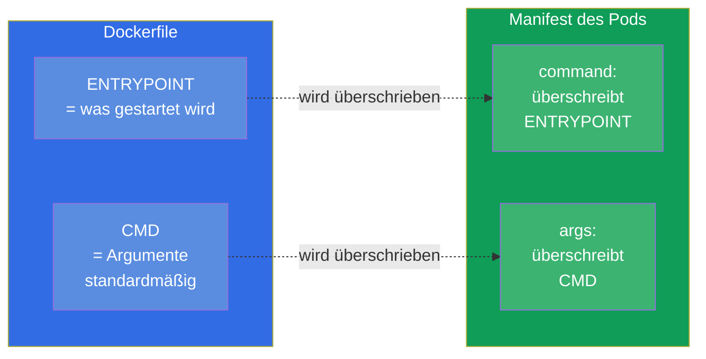
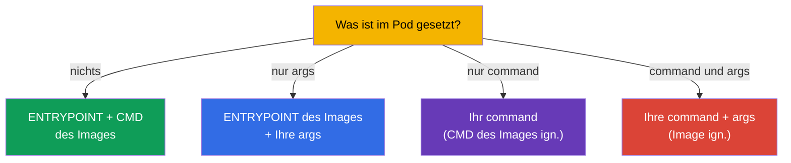
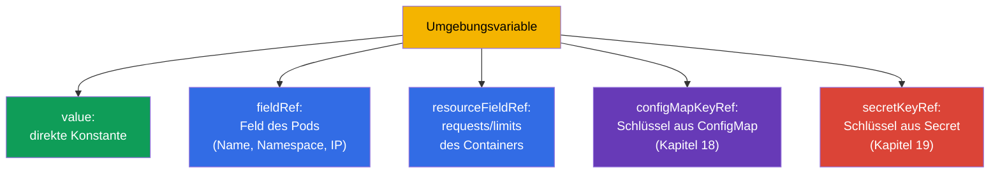

[Русская версия](ru.md) · [Eng version](README.md) · [Versión en español](es.md) · [Version française](fr.md) · [ქართული ვერსია](ge.md) · [繁體中文版](tw.md) · [日本語版](jp.md)

# Kapitel 17. Befehle, Argumente und Umgebungsvariablen

> **Was kommt.** Wir beginnen Teil 3 - die Konfiguration von Anwendungen. Bevor wir die
> Konfigurationen in ConfigMap und Secret auslagern (Kapitel 18-19), muss man die Basis
> verstehen: wie man einem Container den Startbefehl, die Argumente und die
> Umgebungsvariablen setzt. Das ist die Domäne Environment/Config (CKAD, 25%) und Workloads
> (CKA). Das Thema wirkt einfach, aber `command`/`args` in Kubernetes und
> `ENTRYPOINT`/`CMD` in Docker werden ständig verwechselt - und das kostet Punkte und
> kaputte Pods.

## 17.1. ENTRYPOINT/CMD in Docker und ihre Abbildung in Kubernetes

Wenn ein Image in Docker gebaut wird, legt man darin fest, was gestartet wird:
`ENTRYPOINT` (das ausführbare Programm selbst) und `CMD` (die Standardargumente).
Kubernetes überschreibt sie mit eigenen Feldern:



Merken Sie sich die Entsprechung - sie wird gern gefragt:

| Docker | Kubernetes | Rolle |
|--------|-----------|------|
| `ENTRYPOINT` | `command` | das ausführbare Programm |
| `CMD` | `args` | die Argumente dazu |

## 17.2. command und args im Pod

```yaml
spec:
  containers:
  - name: app
    image: busybox
    command: ["sleep"]       # überschreibt ENTRYPOINT
    args: ["3600"]           # überschreibt CMD
```

Die Regeln des Überschreibens (genau das ist die häufige Falle):

- nur `args` gesetzt - genommen wird `ENTRYPOINT` des Images + Ihre `args`;
- nur `command` gesetzt - genommen wird Ihr `command`, das `CMD` des Images wird ignoriert;
- beide gesetzt - beide werden benutzt, das Image wird vollständig ignoriert;
- nichts gesetzt - es wirken `ENTRYPOINT` und `CMD` aus dem Image.



Imperativ setzt man den Befehl über `--command -- ...`:

```bash
kubectl run busy --image=busybox --command -- sleep 3600
# alles nach -- wird zu command
```

## 17.3. Zwei Schreibformen: exec und shell

Den Befehl kann man auf zwei Weisen schreiben, und der Unterschied ist wesentlich.

- **Exec-Form** (Liste von Strings) - wird direkt gestartet, ohne Shell. So ist es in
  Kubernetes richtig: Signale (SIGTERM) erreichen den Prozess, PID 1 ist Ihre Anwendung.

```yaml
command: ["sh", "-c", "echo hello"]
args: ["--port", "8080"]
```

- **Shell-Form** (eine Zeile) - wird in Docker über `/bin/sh -c` gestartet. In Kubernetes
  nutzt man für die Interpolation von Variablen oder für Pipes ein explizites `sh -c`:

```yaml
command: ["sh", "-c", "echo $HOSTNAME && sleep 3600"]
```

> **Warum das wichtig ist.** Wenn Sie das Einsetzen von Umgebungsvariablen, Pipes oder
> mehrere Befehle brauchen - packen Sie es in `sh -c "..."`. Ohne Shell wird `$VAR` nicht
> aufgelöst und `|` funktioniert nicht - das ist eine häufige Ursache für „der Befehl tut
> nicht das Erwartete“.

## 17.4. Umgebungsvariablen: env

Der einfachste Weg, Konfiguration in den Container zu geben, sind Umgebungsvariablen über
`env`:

```yaml
spec:
  containers:
  - name: app
    image: nginx
    env:
    - name: COLOR
      value: "blue"
    - name: GREETING
      value: "hello world"
```

```bash
# Imperativ beim Erstellen
kubectl run web --image=nginx --env="COLOR=blue" --env="MODE=prod"
```

Einfache Paare `name/value` passen für statische Werte. Aber oft muss man den Wert
**dynamisch** nehmen - aus Feldern des Pods selbst, aus den Ressourcen oder aus
ConfigMap/Secret. Dafür gibt es `valueFrom`.

## 17.5. valueFrom: dynamische Quellen für Variablen

`valueFrom` erlaubt es, eine Variable nicht mit einer Konstante, sondern aus einer Quelle
zu füllen.



**Downward API** - der Mechanismus, der dem Pod Informationen über sich selbst gibt
(`fieldRef`, `resourceFieldRef`):

```yaml
    env:
    - name: MY_POD_NAME
      valueFrom:
        fieldRef:
          fieldPath: metadata.name
    - name: MY_POD_IP
      valueFrom:
        fieldRef:
          fieldPath: status.podIP
    - name: MY_NODE_NAME
      valueFrom:
        fieldRef:
          fieldPath: spec.nodeName
    - name: MY_CPU_LIMIT
      valueFrom:
        resourceFieldRef:
          containerName: app
          resource: limits.cpu
```

So erfährt die Anwendung ihren Namen, ihre IP, ihren Knoten, ihre Limits - ohne Hardcoding.
`configMapKeyRef` und `secretKeyRef` (den Wert aus ConfigMap/Secret nehmen) behandeln wir in
den nächsten Kapiteln.

> **Wichtig: und was sieht der Pod, wenn man ConfigMap/Secret ändert?** Umgebungsvariablen
> (`configMapKeyRef`, `secretKeyRef`, `envFrom`) werden **einmal eingesetzt - im Moment des
> Starts des Containers**. Ändert man danach die ConfigMap oder das Secret, **sieht der
> bereits laufende Pod weiterhin den alten Wert**: env-Variablen werden nicht nachträglich
> aktualisiert. Um den neuen zu übernehmen, muss der Pod neu erstellt werden - zum Beispiel
> mit `kubectl rollout restart deployment/<name>`. Das ist eine häufige Falle: „ich habe die
> ConfigMap korrigiert, und die Anwendung ist trotzdem beim alten Wert“.
>
> Anders verhält sich das **Einbinden** von ConfigMap/Secret als Volume (Kapitel 18): dort
> aktualisiert das kubelet die Dateien im Container periodisch bei Änderung des Objekts (mit
> einer Verzögerung in der Größenordnung einer Minute), und ein Neustart ist nicht nötig -
> aber die Anwendung muss die Datei **selbst neu einlesen**. Eine Ausnahme ist das Einbinden
> über `subPath`: solche Dateien werden überhaupt nicht aktualisiert. Das heißt, eine
> „lebendige“ Aktualisierung der Konfiguration ohne Neustart ist nur über ein Volume (nicht
> `subPath`) möglich und nur unter der Bedingung, dass die Anwendung die Konfiguration neu
> einlesen kann.

## 17.6. Umgebungsvariablen und die Reihenfolge der Auflösung

Variablen können über `$(VAR)` aufeinander verweisen (nicht mit dem Shell-`$VAR`
verwechseln):

```yaml
    env:
    - name: HOST
      value: "db"
    - name: PORT
      value: "5432"
    - name: DSN
      value: "$(HOST):$(PORT)"     # → db:5432
```

Kubernetes löst `$(VAR)` für Variablen auf, die **früher** in der Liste deklariert wurden.
Ein Verweis auf eine noch nicht deklarierte Variable wird nicht aufgelöst. Um ein
wortwörtliches `$(...)` auszugeben, maskiert man es durch Verdoppelung: `$$(...)`.

## 17.7. Prüfung: was tatsächlich im Container angekommen ist

Das Debuggen der Konfiguration läuft immer auf „und was ist eigentlich drinnen?“ hinaus:

```bash
# Die Umgebungsvariablen des Containers ansehen
kubectl exec <pod> -- env

# Ansehen, welcher Befehl tatsächlich gesetzt ist
kubectl get pod <pod> -o jsonpath='{.spec.containers[0].command}'
kubectl get pod <pod> -o jsonpath='{.spec.containers[0].args}'

# Vollständige Beschreibung
kubectl describe pod <pod>
```

`kubectl exec <pod> -- env` ist der schnellste Weg, sich zu vergewissern, dass die Variablen
(u. a. aus ConfigMap/Secret) tatsächlich beim Container angekommen sind. Bei Beschwerden „die
Anwendung sieht die Konfiguration nicht“ beginnt man genau damit.

## 17.8. Wie man das in der Produktion anwendet

- **Env - für kleine Konfiguration, ConfigMap/Secret - für den Rest.** Ein Paar Variablen
  direkt im Manifest ist in Ordnung; aber die echte Konfiguration (viele Parameter, gemeinsam
  für mehrere Pods, sensible Daten) lagert man in ConfigMap und Secret aus (Kapitel 18-19)
  und zieht sie in den Pod über `valueFrom`. Konfiguration im Manifest des Deployment
  hartzucodieren ist eine schlechte Praxis.
- **Downward API für Observability.** Anwendungen erhalten über die Downward API ihren
  Namen, ihren Knoten, ihren Namespace - das geht in Logs und Metriken zur Nachverfolgung:
  am Log sieht man sofort, welcher Pod und auf welchem Knoten den Eintrag erzeugt hat.
- **12-Faktor-Anwendung.** Die Praxis, die Konfiguration in der Umgebung zu halten (und
  nicht im Code), ist Teil der Methodik 12-factor app: dasselbe Image funktioniert in
  dev/stage/prod, es ändern sich nur die Variablen. Das macht Images portabel.
- **Exec-Form und korrektes Beenden.** In der Produktion schreibt man den Befehl in
  Exec-Form, damit SIGTERM die Anwendung erreicht und sie beim Rollout/Skalieren gracefully
  beendet wird. Die Shell-Form ohne `exec` kann das Signal „auffressen“, und der Pod wird
  hart nach Timeout getötet.
- **Keine Secrets in env als Klartext.** Passwörter und Tokens schreibt man nicht als Wert
  in `env` - man nimmt sie aus einem Secret (Kapitel 19), sonst lecken sie in Manifeste, git
  und `kubectl describe`.

## 17.9. Mini-Glossar

- **command** - überschreibt das ENTRYPOINT des Images (was gestartet wird).
- **args** - überschreibt das CMD des Images (die Argumente).
- **ENTRYPOINT/CMD** - was und mit welchen Argumenten gestartet wird, im Image festgelegt.
- **Exec-Form** - Befehl als Liste, ohne Shell (richtig für Signale).
- **Shell-Form** - Befehl über `sh -c` (nötig für Variablen, Pipes).
- **env** - die Umgebungsvariablen des Containers.
- **valueFrom** - das Füllen einer Variablen aus einer Quelle (Feld des Pods, Ressourcen,
  CM/Secret).
- **Downward API** - Zugriff des Pods auf Informationen über sich selbst (`fieldRef`,
  `resourceFieldRef`).
- **`$(VAR)`** - Verweis auf eine früher deklarierte Variable innerhalb des Manifests.

## 17.10. Zusammenfassung des Kapitels

- Kubernetes überschreibt das ENTRYPOINT des Images mit dem Feld `command` und das CMD mit
  dem Feld `args`.
- Regeln: nur args → ENTRYPOINT+args; nur command → Ihr command; beide → das Image wird
  ignoriert; nichts → das Image wie es ist.
- Die Exec-Form (Liste) startet ohne Shell und liefert Signale korrekt aus; für
  Variablen/Pipes braucht man ein explizites `sh -c` (Shell-Form).
- Umgebungsvariablen setzt man über `env` (name/value) oder `valueFrom` (dynamisch).
- `valueFrom` nimmt Werte aus Feldern des Pods/den Ressourcen (Downward API) oder aus
  ConfigMap/Secret.
- `$(VAR)` löst früher deklarierte Variablen auf; `$$` maskiert.
- Die Prüfung des tatsächlichen Zustands - `kubectl exec -- env` und jsonpath auf
  command/args.

## 17.11. Wofür das nützlich ist: in der Prüfung und in der echten Arbeit

**In der Prüfung.** „Setze dem Container einen Befehl/Argumente“, „füge eine
Umgebungsvariable hinzu“, „gib den Namen des Pods/Knotens über die Downward API durch“ - das
sind häufige Aufgaben. Kritisch ist, `command`/`args` nicht mit ENTRYPOINT/CMD zu verwechseln
und das Ergebnis über `kubectl exec -- env` prüfen zu können. Das ist die Grundlage für
Aufgaben mit ConfigMap/Secret (Kapitel 18-19).

**In der echten Arbeit.** Konfiguration über die Umgebung ist die Basis portabler Images
(12-factor): ein Image für alle Umgebungen. Die Downward API gibt der Anwendung Kontext für
Logs und Metriken. Die richtige Exec-Form des Befehls sorgt für korrektes Beenden bei
Rollouts. Und die Angewohnheit, Secrets nicht direkt in `env` zu legen, ist eine Frage der
Sicherheit.

## 17.12. Fragen zur Selbstüberprüfung

1. Welche Felder in Kubernetes entsprechen ENTRYPOINT und CMD des Images?
2. Was startet, wenn man nur `args` setzt? Und wenn nur `command`? Und beide?
3. Worin unterscheidet sich die Exec-Form des Befehls von der Shell-Form und wann braucht man
   welche?
4. Wie gibt man über `valueFrom` den Namen des Pods und seine IP in eine Variable?
5. Was ist die Downward API und was gibt sie der Anwendung?
6. Wie werden Verweise `$(VAR)` innerhalb von `env` aufgelöst und wie gibt man ein
   wortwörtliches `$(...)` aus?
7. Wie prüft man schnell, welche Variablen tatsächlich im Container angekommen sind?

## Praxis

Wir haben gelernt, den Befehl zu setzen und die Konfiguration über die Umgebung zu übergeben.
Weiter lagern wir die Konfiguration in eigene Objekte aus: ConfigMap (Kapitel 18) für normale
Daten und Secret (Kapitel 19) für sensible. Befehle, Argumente und Variablen werden in den
Labs zur Konfiguration geübt.

🧪 Lab 105 (Befehle, Argumente, Umgebungsvariablen): [tasks/cka/labs/105](../../labs/105/README_DE.MD)

---
[Inhalt](../README_DE.md) · [Kapitel 16](../16/de.md) · [Kapitel 18](../18/de.md)
