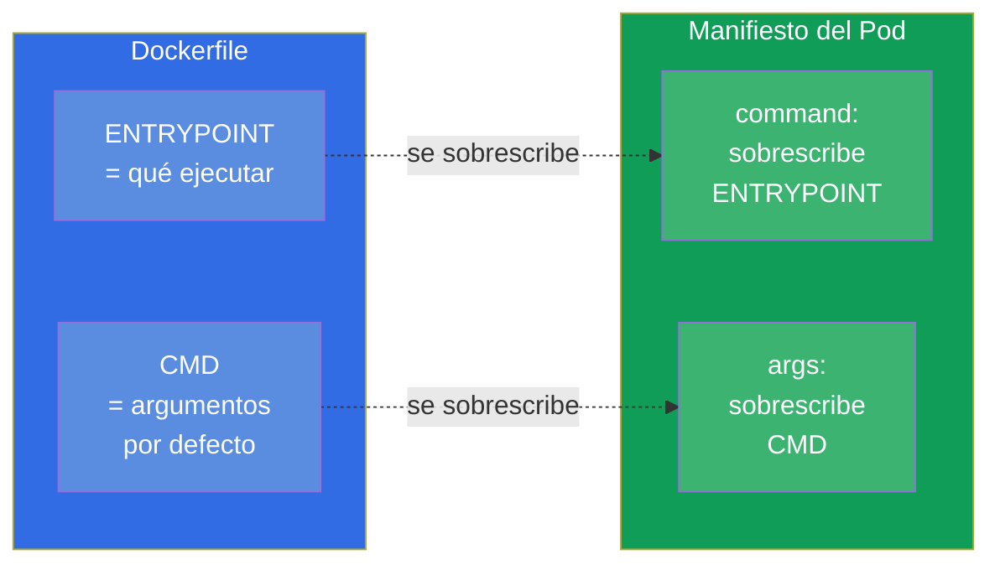
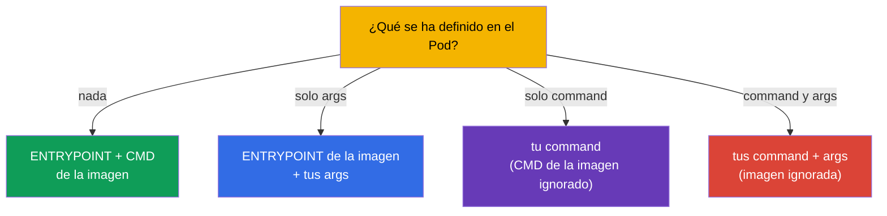
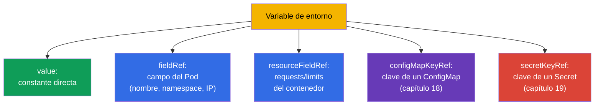

[Русская версия](ru.md) · [Eng version](README.md) · [Version française](fr.md) · [Deutsche Version](de.md) · [ქართული ვერსია](ge.md) · [繁體中文版](tw.md) · [日本語版](jp.md)

# Capítulo 17. Comandos, argumentos y variables de entorno

> **Qué viene ahora.** Empezamos la parte 3 - la configuración de las aplicaciones. Antes de
> sacar los archivos de configuración a ConfigMap y Secret (capítulos 18-19), hay que entender
> la base: cómo se le indica al contenedor el comando de arranque, los argumentos y las variables
> de entorno. Este es el dominio Environment/Config (CKAD, 25%) y Workloads (CKA). El tema parece
> sencillo, pero `command`/`args` en Kubernetes y `ENTRYPOINT`/`CMD` en Docker se confunden
> constantemente - y eso cuesta puntos y Pods rotos.

## 17.1. ENTRYPOINT/CMD en Docker y su reflejo en Kubernetes

Cuando se construye una imagen en Docker, en ella se define qué se ejecuta: `ENTRYPOINT` (el
programa ejecutable en sí) y `CMD` (los argumentos por defecto). Kubernetes los sobrescribe con
sus propios campos:



Memoriza esta correspondencia - les gusta preguntarla:

| Docker | Kubernetes | Papel |
|--------|-----------|------|
| `ENTRYPOINT` | `command` | programa ejecutable |
| `CMD` | `args` | argumentos para él |

## 17.2. command y args en el Pod

```yaml
spec:
  containers:
  - name: app
    image: busybox
    command: ["sleep"]       # sobrescribe ENTRYPOINT
    args: ["3600"]           # sobrescribe CMD
```

Reglas de sobrescritura (aquí está justamente la trampa habitual):

- solo se define `args` - se toma el `ENTRYPOINT` de la imagen + tus `args`;
- solo se define `command` - se toma tu `command` y el `CMD` de la imagen se ignora;
- se definen ambos - se usan los dos y la imagen se ignora por completo;
- no se define nada - funcionan el `ENTRYPOINT` y el `CMD` de la imagen.



De forma imperativa el comando se define con `--command -- ...`:

```bash
kubectl run busy --image=busybox --command -- sleep 3600
# todo lo que va después de -- se convierte en command
```

## 17.3. Dos formas de escritura: exec y shell

El comando se puede escribir de dos maneras, y la diferencia es importante.

- **Forma exec** (lista de cadenas) - se ejecuta directamente, sin shell. Así es lo correcto en
  Kubernetes: las señales (SIGTERM) llegan al proceso y el PID 1 es tu aplicación.

```yaml
command: ["sh", "-c", "echo hello"]
args: ["--port", "8080"]
```

- **Forma shell** (una sola cadena) - en Docker se ejecuta a través de `/bin/sh -c`. En Kubernetes,
  para la interpolación de variables o para las tuberías, se usa un `sh -c` explícito:

```yaml
command: ["sh", "-c", "echo $HOSTNAME && sleep 3600"]
```

> **Por qué importa.** Si necesitas sustitución de variables de entorno, tuberías o varios
> comandos - envuélvelo en `sh -c "..."`. Sin shell, `$VAR` no se expande y `|` no funciona - esta
> es una causa frecuente de «el comando no hace lo que esperaba».

## 17.4. Variables de entorno: env

La forma más sencilla de pasar configuración al contenedor son las variables de entorno mediante
`env`:

```yaml
spec:
  containers:
  - name: app
    image: nginx
    env:
    - name: COLOR
      value: "blue"
    - name: GREETING
      value: "hello world"
```

```bash
# De forma imperativa al crear
kubectl run web --image=nginx --env="COLOR=blue" --env="MODE=prod"
```

Los pares simples `name/value` sirven para valores estáticos. Pero a menudo hace falta tomar el
valor **dinámicamente** - de los campos del propio Pod, de los recursos o de un ConfigMap/Secret.
Para eso existe `valueFrom`.

## 17.5. valueFrom: fuentes dinámicas de variables

`valueFrom` permite rellenar la variable no con una constante, sino desde una fuente.



La **Downward API** es el mecanismo que da al Pod información sobre sí mismo (`fieldRef`,
`resourceFieldRef`):

```yaml
    env:
    - name: MY_POD_NAME
      valueFrom:
        fieldRef:
          fieldPath: metadata.name
    - name: MY_POD_IP
      valueFrom:
        fieldRef:
          fieldPath: status.podIP
    - name: MY_NODE_NAME
      valueFrom:
        fieldRef:
          fieldPath: spec.nodeName
    - name: MY_CPU_LIMIT
      valueFrom:
        resourceFieldRef:
          containerName: app
          resource: limits.cpu
```

Así la aplicación conoce su nombre, su IP, su nodo y sus limits - sin nada codificado a mano.
`configMapKeyRef` y `secretKeyRef` (tomar el valor de un ConfigMap/Secret) los veremos en los
capítulos siguientes.

> **Importante: ¿qué verá el Pod si cambio el ConfigMap/Secret?** Las variables de entorno
> (`configMapKeyRef`, `secretKeyRef`, `envFrom`) se sustituyen **una sola vez - en el momento de
> arrancar el contenedor**. Si después cambias el ConfigMap o el Secret, el Pod ya en marcha
> **seguirá viendo el valor antiguo**: las variables de entorno no se actualizan a posteriori.
> Para recoger el nuevo valor hay que recrear el Pod - por ejemplo,
> `kubectl rollout restart deployment/<name>`. Es una trampa frecuente: «he corregido el ConfigMap
> y la aplicación sigue con el valor antiguo».
>
> Se comporta de otra manera el **montaje** de un ConfigMap/Secret como volumen (capítulo 18): ahí
> el kubelet actualiza periódicamente los archivos dentro del contenedor cuando el objeto cambia
> (con un retardo del orden de un minuto) y no hace falta reiniciar - pero la aplicación tiene que
> **volver a leer el archivo por sí misma**. La excepción es el montaje con `subPath`: esos
> archivos no se actualizan en absoluto. O sea, la actualización «en vivo» de la configuración sin
> reinicio solo es posible mediante volumen (sin `subPath`) y siempre que la aplicación sepa
> releer su configuración.

## 17.6. Variables de entorno y orden de expansión

Las variables pueden referenciarse entre sí con `$(VAR)` (que no hay que confundir con el `$VAR`
de la shell):

```yaml
    env:
    - name: HOST
      value: "db"
    - name: PORT
      value: "5432"
    - name: DSN
      value: "$(HOST):$(PORT)"     # → db:5432
```

Kubernetes expande `$(VAR)` para las variables declaradas **antes** en la lista. Una referencia a
una variable aún no declarada no se expande. Para mostrar un `$(...)` literal se escapa
duplicando: `$$(...)`.

## 17.7. Comprobación: qué ha llegado realmente al contenedor

Depurar la configuración siempre se reduce a «¿y qué hay de verdad dentro?»:

```bash
# Ver las variables de entorno del contenedor
kubectl exec <pod> -- env

# Ver qué comando está realmente definido
kubectl get pod <pod> -o jsonpath='{.spec.containers[0].command}'
kubectl get pod <pod> -o jsonpath='{.spec.containers[0].args}'

# Descripción completa
kubectl describe pod <pod>
```

`kubectl exec <pod> -- env` es la forma más rápida de asegurarse de que las variables (incluidas
las de ConfigMap/Secret) han llegado de verdad al contenedor. Ante la queja «la aplicación no ve
la configuración» se empieza precisamente por aquí.

## 17.8. Cómo se aplica esto en producción

- **Env para configuración pequeña, ConfigMap/Secret para el resto.** Un par de variables
  directamente en el manifiesto está bien; pero la configuración real (muchos parámetros, comunes
  a varios Pods, datos sensibles) se saca a ConfigMap y Secret (capítulos 18-19) y se trae al Pod
  con `valueFrom`. Codificar la configuración a mano en el manifiesto del deployment es una mala
  práctica.
- **Downward API para la observabilidad.** Las aplicaciones obtienen mediante la Downward API su
  nombre, su nodo y su namespace - eso va a los logs y las métricas para la traza: por el log se
  ve al momento qué Pod y en qué nodo generó la entrada.
- **Aplicación de 12 factores.** La práctica de guardar la configuración en el entorno (y no en el
  código) es parte de la metodología 12-factor app: la misma imagen funciona en dev/stage/prod y
  solo cambian las variables. Eso hace las imágenes portables.
- **Forma exec y terminación correcta.** En producción el comando se escribe en forma exec para
  que el SIGTERM llegue a la aplicación y esta termine gracefully durante un despliegue o un
  escalado. La forma shell sin `exec` puede «comerse» la señal y el Pod se matará a lo bruto por
  timeout.
- **Ningún secreto en env tal cual.** Las contraseñas y los tokens no se escriben como valor en
  `env` - se toman de un Secret (capítulo 19); si no, se filtran a los manifiestos, a git y a
  `kubectl describe`.

## 17.9. Mini-glosario

- **command** - sobrescribe el ENTRYPOINT de la imagen (qué ejecutar).
- **args** - sobrescribe el CMD de la imagen (los argumentos).
- **ENTRYPOINT/CMD** - qué ejecutar y con qué argumentos, definido en la imagen.
- **forma exec** - el comando como lista, sin shell (lo correcto para las señales).
- **forma shell** - el comando a través de `sh -c` (necesaria para variables y tuberías).
- **env** - variables de entorno del contenedor.
- **valueFrom** - relleno de la variable desde una fuente (campo del Pod, recursos, CM/Secret).
- **Downward API** - acceso del Pod a información sobre sí mismo (`fieldRef`, `resourceFieldRef`).
- **`$(VAR)`** - referencia a una variable declarada antes dentro del manifiesto.

## 17.10. Resumen del capítulo

- Kubernetes sobrescribe el ENTRYPOINT de la imagen con el campo `command` y el CMD con el campo
  `args`.
- Reglas: solo args → ENTRYPOINT+args; solo command → tu command; ambos → la imagen se ignora;
  nada → la imagen tal cual.
- La forma exec (lista) arranca sin shell y entrega correctamente las señales; para
  variables/tuberías hace falta un `sh -c` explícito (forma shell).
- Las variables de entorno se definen con `env` (name/value) o con `valueFrom` (dinámicamente).
- `valueFrom` toma valores de los campos del Pod/recursos (Downward API) o de un
  ConfigMap/Secret.
- `$(VAR)` expande variables declaradas antes; `$$` escapa.
- La comprobación del estado real: `kubectl exec -- env` y jsonpath sobre command/args.

## 17.11. Para qué te servirá: en el examen y en el trabajo real

**En el examen.** «Define el comando/los argumentos del contenedor», «añade una variable de
entorno», «pasa el nombre del Pod/del nodo con la Downward API» son tareas frecuentes. Es crítico
no confundir `command`/`args` con ENTRYPOINT/CMD y saber comprobar el resultado con
`kubectl exec -- env`. Esta es la base para las tareas con ConfigMap/Secret (capítulos 18-19).

**En el trabajo real.** La configuración a través del entorno es el fundamento de las imágenes
portables (12-factor): una imagen para todos los entornos. La Downward API da a la aplicación
contexto para los logs y las métricas. La forma exec correcta del comando garantiza una
terminación limpia durante los despliegues. Y la costumbre de no poner secretos directamente en
`env` es una cuestión de seguridad.

## 17.12. Preguntas de autoevaluación

1. ¿Qué campos de Kubernetes se corresponden con el ENTRYPOINT y el CMD de la imagen?
2. ¿Qué se ejecutará si defines solo `args`? ¿Y si defines solo `command`? ¿Y ambos?
3. ¿En qué se diferencia la forma exec del comando de la forma shell y cuándo hace falta cada una?
4. ¿Cómo se pasa a una variable, con `valueFrom`, el nombre del Pod y su IP?
5. ¿Qué es la Downward API y qué le aporta a la aplicación?
6. ¿Cómo se expanden las referencias `$(VAR)` dentro de `env` y cómo se muestra un `$(...)`
   literal?
7. ¿Cómo se comprueba rápido qué variables han llegado realmente al contenedor?

## Práctica

Hemos aprendido a definir el comando y a pasar configuración a través del entorno. A continuación
sacaremos la configuración a objetos aparte: ConfigMap (capítulo 18) para los datos normales y
Secret (capítulo 19) para los sensibles. Los comandos, los argumentos y las variables se practican
en los laboratorios de configuración.

🧪 Laboratorio 105 (comandos, argumentos, variables de entorno): [tasks/cka/labs/105](../../labs/105/README_ES.MD)

---
[Índice](../README_ES.md) · [Capítulo 16](../16/es.md) · [Capítulo 18](../18/es.md)
